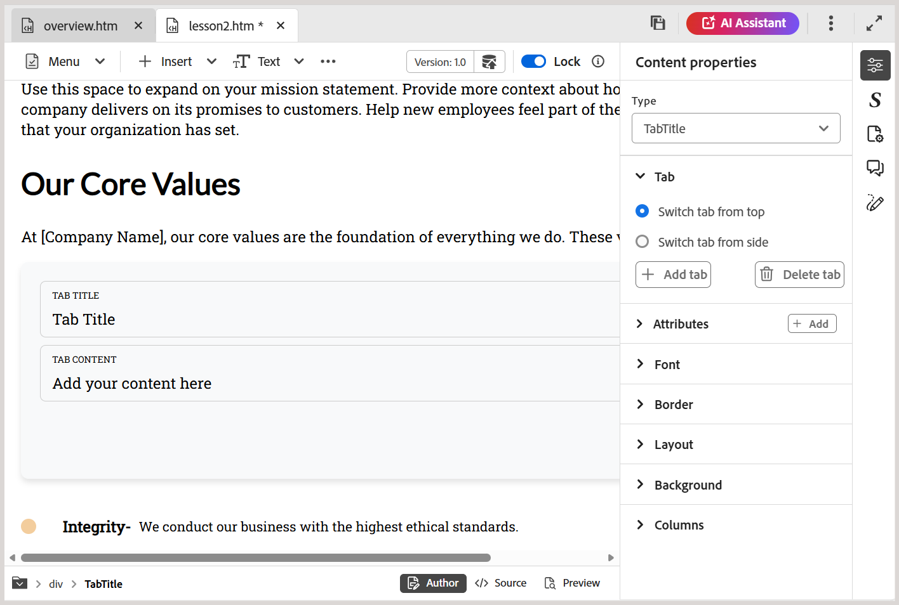
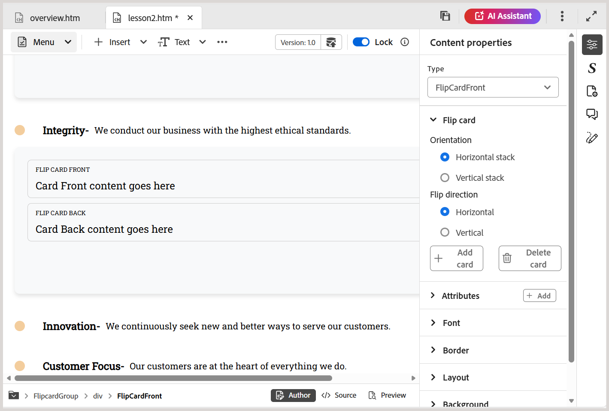

# Verwenden interaktiver Widgets

Sie können die Lerninhalte verbessern, indem Sie mehrere Widgets hinzufügen, um den Kurs interaktiver zu gestalten. Im Folgenden finden Sie ein kurzes Video zu den verschiedenen verfügbaren Widgets.

>[!VIDEO](https://video.tv.adobe.com/v/3469531/learning-content-aem-guides)

Zu den verfügbaren Widgets zur Verbesserung des Benutzererlebnisses und zur Optimierung der Inhaltsbereitstellung gehören:

- **Akkordeon:** Fügt dem Inhalt ein Akkordeon hinzu. Sie können geeigneten Text sowohl in die Akkordeon-Kopfzeile als auch in ihren Hauptteil einfügen. Die zugehörigen Eigenschaften können mithilfe des Bedienfelds **Inhaltseigenschaften** verwaltet werden. Dazu gehören Optionen, mit denen einzelne oder mehrere Akkordeons gleichzeitig geöffnet werden können, sowie das Hinzufügen oder Entfernen von Elementen. Um ein Element oder ein Element des Widgets zu löschen, können Sie auch **Rechtsklick > Element löschen** verwenden.

  {width="650"}

- **Karussell:** Fügt dem Inhalt ein Karussell hinzu. Sie können geeigneten Text sowohl in den Kartentitel als auch in den Hauptteil einfügen. Die zugehörigen Eigenschaften können über das Bedienfeld **Inhaltseigenschaften** verwaltet werden, einschließlich der Optionen zum Hinzufügen oder Entfernen von Elementen. Um ein Element oder ein Element des Widgets zu löschen, können Sie auch **Rechtsklick > Element löschen** verwenden.

  {width="650"}

- **Hotspot:** Fügt einem ausgewählten Bild einen Hotspot hinzu. Wählen Sie zunächst ein Bild aus und navigieren Sie dann zu **Einfügen > Hotspot**. Dadurch wird das Hotspot-Dialogfeld geöffnet, in dem Sie verschiedene Optionen konfigurieren können, z. B. indem Sie verschiedene Hotspot-Größen festlegen, entsprechende Links hinzufügen und die Ebenen anpassen, indem Sie Bereiche vorwärts oder rückwärts verschieben. Um ein Element oder ein Element des Widgets zu löschen, können Sie auch **Rechtsklick > Element löschen** verwenden.

  {width="650"}

- **Registerkarte** Ermöglicht die Organisation von Inhalten in interaktiven Abschnitten.  Jede Registerkarte kann ein bestimmtes Thema oder eine bestimmte Kategorie darstellen; Teilnehmer können auf die Registerkarten klicken oder tippen, um den entsprechenden Inhalt anzuzeigen. Platzieren Sie den Cursor an der Stelle, an der das Registerkarten-Widget im Inhalt angezeigt werden soll, und navigieren Sie dann zu **Einfügen > Widget > Registerkarte**. Dadurch wird ein Registerkarten-Container zu Ihrem Inhalt hinzugefügt. Fügen Sie nun der Registerkarte Inhalte hinzu, die einen Registerkartentitel und den entsprechenden Inhalt enthalten.  Um ein Element oder ein Element des Widgets zu löschen, können Sie auch **Rechtsklick > Element löschen** verwenden.

  

  Um das Registerkarten-Layout (vertikale oder horizontale Registerkarten) hinzuzufügen, zu löschen und zu wechseln, verwenden Sie den Abschnitt **Inhaltseigenschaften** im rechten Bedienfeld.
- **Karte spiegeln:** Fügt eine interaktive Karte zu Ihrem Inhalt hinzu, die Sie spiegeln, um zusätzliche Informationen anzuzeigen. Jede Karte hat zwei Seiten - vorne und hinten, sodass die Lernenden Informationen auf ansprechende Weise erkunden können.  Um eine Flip-Karte einzufügen, platzieren Sie den Cursor an der gewünschten Position und navigieren Sie zu **Einfügen > Widget > Flip-Karte**. Dadurch wird ein Container mit einer Flip-Karte zu Ihrem Inhalt hinzugefügt. Anschließend können Sie einen Titel und ein optionales Bild auf der Vorderseite hinzufügen und den entsprechenden Inhalt auf der Rückseite eingeben. Um ein Element oder ein Element des Widgets zu löschen, können Sie auch **Rechtsklick > Element löschen** verwenden.

  

  Um Karten hinzuzufügen oder zu löschen oder ihr Layout zu ändern, verwenden Sie den Abschnitt **Inhaltseigenschaften** im rechten Bedienfeld.
- **Anklicken zum Einblenden:** Fügt ein interaktives Widget in Ihren Inhalt ein, mit dem Inhalte ausgeblendet werden, bis die Teilnehmer klicken, um sie anzuzeigen. Dies trägt dazu bei, das Durcheinander zu reduzieren und die Exploration zu fördern. Fügen Sie das Widget ein, indem Sie den Cursor an der gewünschten Position platzieren und **Einfügen > Widget > Klicken zum Einblenden** auswählen. Geben Sie nach dem Einfügen den Titel für die Widget-Kopfzeile an und definieren Sie den ausgeblendeten Inhalt, der angezeigt wird, wenn Teilnehmer interagieren.

  

  Um das Widget hinzuzufügen oder zu löschen oder die Widget-Ausrichtung zu verwalten, verwenden Sie den Abschnitt **Inhaltseigenschaften** im rechten Bedienfeld. Um ein Element oder ein Element des Widgets zu löschen, können Sie auch **Rechtsklick > Element löschen** verwenden.