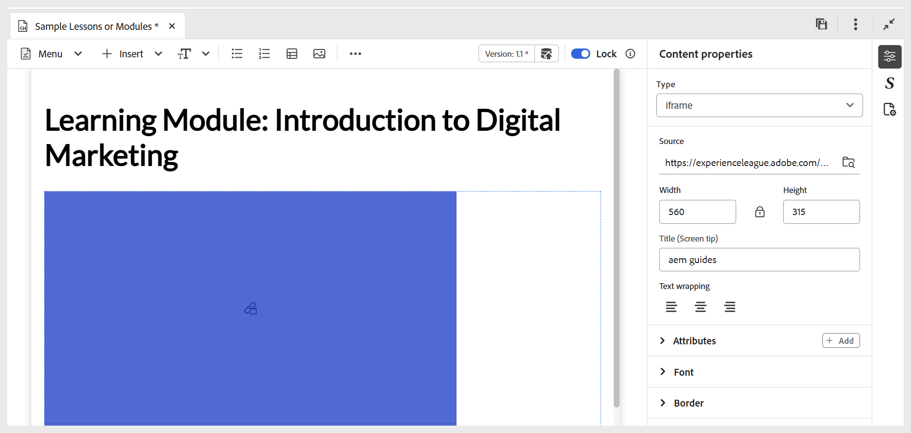

# Verwenden interaktiver Widgets

Sie können die Lerninhalte verbessern, indem Sie mehrere Widgets hinzufügen, um den Kurs interaktiver zu gestalten. Wählen Sie das **Einfügen**-Menü auf der Symbolleiste aus, um auf die Widgets zuzugreifen. Zu den verfügbaren Widgets gehören:

- **Akkordeon:** Fügt dem Inhalt ein Akkordeon hinzu. Sie können geeigneten Text sowohl in die Akkordeon-Kopfzeile als auch in ihren Hauptteil einfügen. Die zugehörigen Eigenschaften können mithilfe des Bedienfelds **Inhaltseigenschaften** verwaltet werden. Dazu gehören Optionen, mit denen einzelne oder mehrere Akkordeons gleichzeitig geöffnet werden können, sowie das Hinzufügen oder Entfernen von Elementen.

  {width="650" align="left"}

- **Karussell:** Fügt dem Inhalt ein Karussell hinzu. Sie können geeigneten Text sowohl in den Kartentitel als auch in den Hauptteil einfügen. Die zugehörigen Eigenschaften können über das Bedienfeld **Inhaltseigenschaften** verwaltet werden, einschließlich der Optionen zum Hinzufügen oder Entfernen von Elementen.

  {width="650" align="left"}

- **Hotspots:** Fügen Sie Hotspots zu einem ausgewählten Bild hinzu. Wählen Sie zunächst ein Bild aus und navigieren Sie dann zu **Einfügen > Hotspot**. Dadurch wird das Hotspot-Dialogfeld geöffnet, in dem Sie verschiedene Optionen konfigurieren können, z. B. indem Sie verschiedene Hotspot-Größen festlegen, entsprechende Links hinzufügen und die Ebenen anpassen, indem Sie Bereiche vorwärts oder rückwärts verschieben.

  {width="650" align="left"}

- **Blockzitate:** Fügt Blockzitate zusammen mit Zitaten zu Ihrem Inhalt hinzu.

  {width="650" align="left"}

- **Codeblöcke:** Fügt einen Codeblock zu Ihrem Inhalt hinzu.

  {width="650" align="left"}

- **Iframes:** Fügen Sie einen iframe in den Inhalt ein, um externe Web-Seiten oder interaktive Ressourcen einzubetten. Sie können die iframe-Eigenschaften mithilfe des Bedienfelds **Inhaltseigenschaften** konfigurieren, einschließlich der Quell-URL, Breite, Höhe, Ausrichtung und Titel. Sie können die im iFrame hinzugefügten Inhalte anzeigen, indem Sie wie unten gezeigt in den **Vorschau**-Modus wechseln.

  **Autor** Ansicht:

  {width="650" align="left"}

  **Vorschau**-Modus:

  {width="650" align="left"}

- **Eingabefeld** Fügen Sie Ihrem Inhalt ein Texteingabefeld mit einer Schaltfläche hinzu. Diese Kombination ermöglicht die Erfassung von Benutzereingaben und Trigger-spezifischen Aktionen. Dem Inhalt wird eine Wiedergabeschaltfläche hinzugefügt, wie unten dargestellt.

  {width="650" align="left"}

- **Weitere Optionen:** Sie haben zusätzliche Optionen, um Ihren Lerninhalt zu verbessern, einschließlich des Einfügens einer horizontalen Linie, eines Zeilenumbruchs, eines Textfelds, eines positionierten Textfelds und einer eingebetteten HTML.

  {width="650" align="left"}
