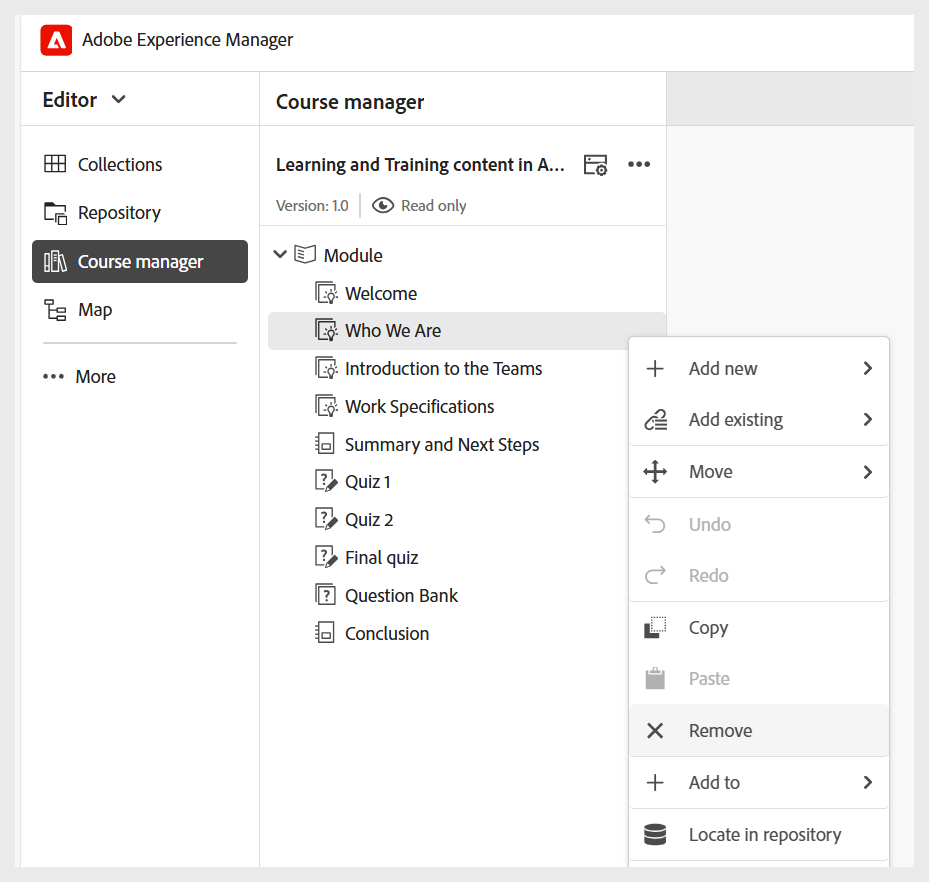

# Verwalten von Kursen

Nachdem Sie einen Kurs erstellt haben, wird er im Kursmanager-Bedienfeld geöffnet. Sie können den Kurs sperren und alle erforderlichen Änderungen auf Kursebene vornehmen. In den folgenden Abschnitten werden die verfügbaren Optionen zum Bearbeiten des Kurses erläutert.

## Neuen Inhalt hinzufügen

Führen Sie die folgenden Schritte aus, um neue Inhalte zu Ihrem Kurs hinzuzufügen:

1. Wählen Sie das Menü **Optionen** > **Neu hinzufügen** aus.

   
2. Wählen Sie den Inhaltstyp aus, den Sie erstellen möchten. Folgende Optionen sind verfügbar:
   - **Lerninhalte**: Das Hauptmaterial in einem Kurs besteht aus kurzen, fokussierten Elementen wie Schritten, Beispielen oder Erklärungen, die eine bestimmte Fähigkeit oder Idee lehren. Weitere Informationen finden Sie unter [Erstellen und Anpassen von Lerninhalten](./create-content.md).
   - **Lernzusammenfassung**: Ein kurzer Überblick am Ende eines Kurskapitels, der die Lernenden an die wichtigsten Punkte erinnert, die sie gerade gelernt haben.
   - **Quiz**: Eine Reihe von Fragen, mit denen überprüft wird, wie gut jemand versteht, was er gelernt hat. Weitere Informationen finden Sie unter [Quiz erstellen und verwalten](./create-quiz.md).
   - **Fragenbank**: Ein gemeinsam genutzter Pool wiederverwendbarer Fragen, mit denen sich schnell und konsistent Quiz erstellen lassen. Weitere Informationen finden Sie unter [Fragenbank](./create-qb.md).
   - **Lerngruppe**: Eine Lerngruppe hilft Ihnen, verwandte Lerninhalte wie Kapitel, Themen und andere Module in einer logischen Reihenfolge zu organisieren und eine klare Hierarchie aufzubauen, die die Verwaltung und Wiederverwendung von Schulungsmaterial erleichtert.
3. Wählen Sie **Erstellen** aus.
Der ausgewählte Inhalt wird erstellt und dem Kurs hinzugefügt.

## Vorhandenen Inhalt hinzufügen

Sie können vorhandene Inhalte aus Ihrem Inhalts-Repository zu Ihrem Kurs hinzufügen. Führen Sie die folgenden Schritte aus, um vorhandenen Inhalt hinzuzufügen:

1. Wählen Sie das Menü **Optionen** > **Vorhandenes hinzufügen** aus.
2. Wählen Sie den Typ des Kursinhalts aus, den Sie erstellen möchten.
3. Navigieren **im Dialogfeld &quot;** auswählen“ zum Speicherort der Inhalte und wählen Sie die gewünschten Lerninhalte aus.

   
4. Wählen Sie **Auswählen** aus.

Der ausgewählte Kursinhalt wird dem Kurs aus dem Repository hinzugefügt.

## Inhalt entfernen

Sie können jedes Thema aus dem Kurs entfernen, indem Sie das Menü **Optionen** für dieses spezifische Thema auswählen und dann auf **Entfernen** klicken, wie unten dargestellt.

## Kursversionen erstellen

Sie können die Versionierung Ihres Kurses über das Menü **Optionen** > **Versionierung** steuern.

Sie erhalten die folgenden Optionen für die Versionierung eines Kurses:

- **Als neue Version speichern**: Speichert Ihren Kurs mit einer neuen Versionsnummer.
- **Versionsverlauf**: Zeigt die Vorschau der aktuellen Version an und ermöglicht Ihnen auch, sie mit den anderen verfügbaren Versionen für den Kurs zu vergleichen.
- **Versionsbezeichnung**: Ermöglicht die Angabe von Beschriftungen in einem Freiformtextformat oder die Verwendung eines Satzes vordefinierter Beschriftungen.

## Anzeigeeinstellungen: Anzeigen

Die **Anzeigen**-Option bestimmt, wie Themen angezeigt werden. Sie können sie mithilfe von Kontrollkästchen für mehrere Themenauswahlen, Nummerierungen zur Angabe der hierarchischen Struktur oder durch Anzeige des Thementitels oder des Dateinamens darstellen.

>[!NOTE]
>
> Diese Anzeigeeinstellungen gelten nur für den Kurs-Manager und haben keine Auswirkungen auf die veröffentlichte Ausgabe.

