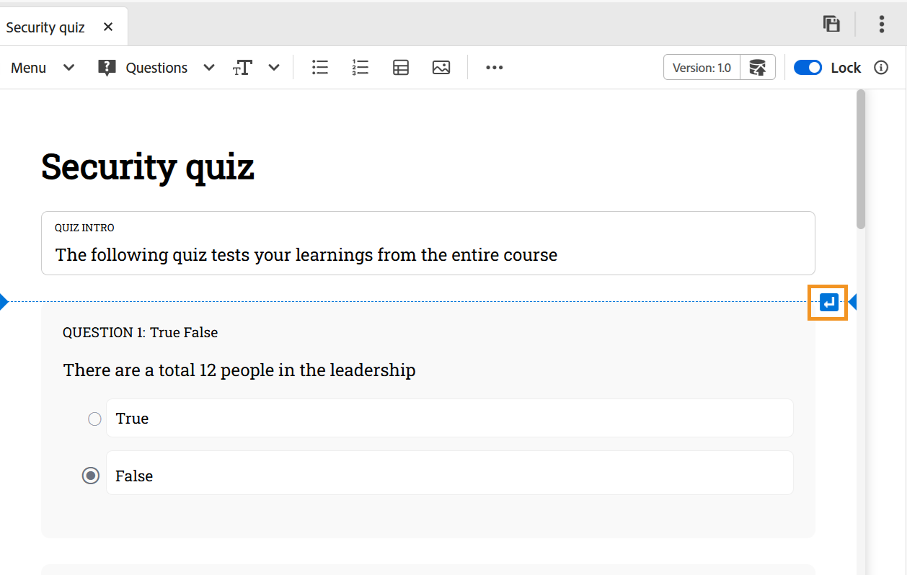

# Einfügen von Fragen in ein Quiz

Führen Sie die folgenden Schritte aus, um Fragen in ein Quiz einzufügen:

1. Wählen Sie den gewünschten Fragetyp aus dem Dropdown **Menü &quot;**&quot; in der Symbolleiste aus. Je nach Ihren Anforderungen können Sie Fragen mithilfe eines der drei verfügbaren Formate hinzufügen: „True“ oder „False“, „Single Correct“ und „Multiple Correct“, wie unten dargestellt.

   {width="650" align="left"}

   Wenn sich der Cursor beim Einfügen einer Frage in einem Fragenblock befindet, wird die neue Frage standardmäßig direkt danach hinzugefügt.

   Um eine Frage zwischen den beiden vorhandenen Fragen einzufügen, fügen Sie zunächst [Absatz einfügen](#insert-paragraph-within-the-quiz) und dann Fragen ein.

1. Eine Frage wird im ausgewählten Format eingefügt. Anschließend können Sie die Frage entsprechend Ihren Anforderungen bearbeiten.

1. Sie können eine beliebige Frage auswählen und ihre Eigenschaften mithilfe des Bedienfelds **Inhaltseigenschaften** konfigurieren. Sie können beispielsweise die richtige Antwort angeben, die zu vergebenden Noten festlegen und Sanktionen für falsche Antworten definieren.

   {width="650" align="left"}

1. Speichert alle Änderungen, die ihr im Quiz vorgenommen habt.

## Fügen Sie einen Absatz innerhalb des Quiz ein

Wenn Sie den Cursor auf eine fragenspezifische Frage oder einen Leerraum zwischen den beiden Fragen platzieren, wird eine blaue horizontale Linie mit einem blauen Pfeil in der rechten Ecke des Bildschirms angezeigt. Durch Auswahl des blauen Pfeils können Sie einen Absatz in die Quiz-Authoring-Oberfläche einfügen.

{width="650" align="left"}

- Wenn es in einer Frage verwendet wird, können Sie der Frage weitere Elemente wie Bilder, Tabellen, Textelemente und mehr hinzufügen.
- Wenn es zwischen den Fragen verwendet wird, können Sie wie oben erwähnt eine weitere Frage einfügen oder andere Authoring-Elemente hinzufügen.

## Frage oder Option löschen

Führen Sie folgende Schritte aus, um eine Frage oder eine bestimmte Option aus einem Quiz zu löschen:

1. Klicken Sie mit der rechten Maustaste auf die Frage oder Option, die Sie entfernen möchten.
1. Wählen Sie im Kontextmenü die Option **Frage löschen** (um die gesamte Frage zu entfernen) oder **Option Löschen** (um nur die ausgewählte Option zu entfernen) aus.

{width="650" align="left"}