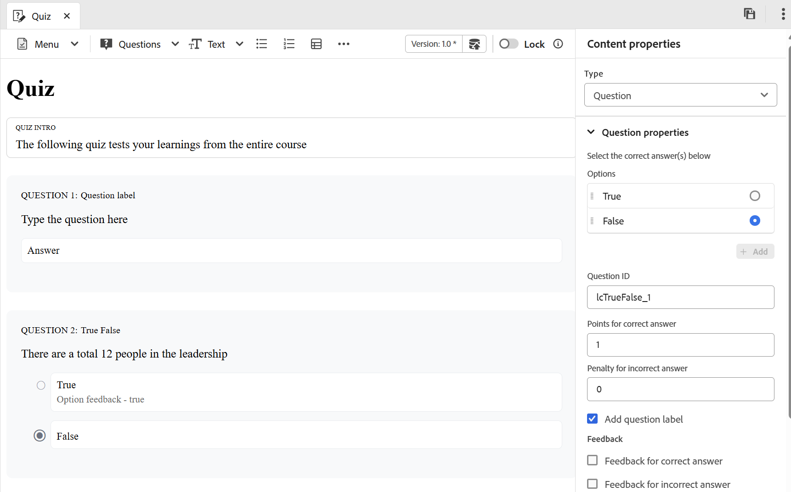
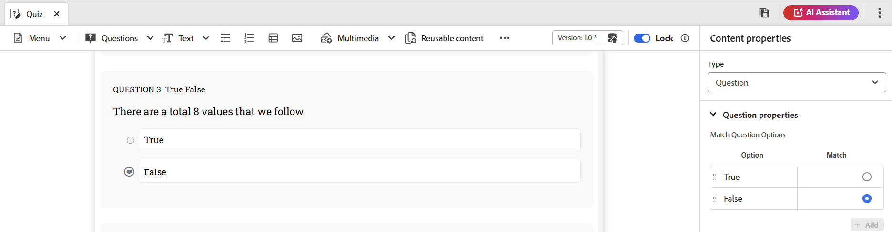

# Einfügen von Fragen in ein Quiz

Führen Sie die folgenden Schritte aus, um Fragen in ein Quiz einzufügen:

1. Wählen Sie den gewünschten Fragetyp aus dem Dropdown **Menü &quot;**&quot; in der Symbolleiste aus. Basierend auf Ihren Anforderungen können Sie Fragen mithilfe eines der vier verfügbaren Formate hinzufügen: „true“ oder „false“, „single correct“, „multiple correct“, „match the following“ und „short answer“, wie unten dargestellt. Weitere Informationen finden Sie unter [Fragetypen](#question-types).

   {width="650"}

   Wenn sich der Cursor beim Einfügen einer Frage in einem Fragenblock befindet, wird die neue Frage standardmäßig direkt danach hinzugefügt.

   Um eine Frage zwischen den beiden vorhandenen Fragen einzufügen, fügen Sie zunächst [Absatz einfügen](#insert-paragraph-within-the-quiz) und dann Fragen ein.

1. Eine Frage wird im ausgewählten Format eingefügt. Anschließend können Sie die Frage entsprechend Ihren Anforderungen bearbeiten.

1. Sie können eine beliebige Frage auswählen und ihre Eigenschaften mithilfe des Bedienfelds **Inhaltseigenschaften** konfigurieren.

   {width="650"}

1. Speichert alle Änderungen, die ihr im Quiz vorgenommen habt.

## Frageeigenschaften

Sie können die Fragen mithilfe der folgenden Frageneigenschaften im Bedienfeld **Inhaltseigenschaften** konfigurieren:

{width="350"}

- **Optionen**: Geben Sie die richtige Antwort auf die Frage an
- **Frage-ID**: Gibt die Frage-ID für jede Frage an. Wenn keine Frage-ID vorhanden ist, wird empfohlen, sie immer hinzuzufügen.
- **Punkte für richtige Antwort**: Geben Sie die Punkte an, die für die richtige Antwort vergeben werden sollen.
- **Strafe für falsche Antwort**: Geben Sie die Punkte an, die bei einer falschen Antwort abgezogen werden sollen.
- **Fragebezeichnung**: Aktivieren Sie diese Option, um eine Fragebezeichnung hinzuzufügen.
- **Feedback**: Ermöglicht es Ihnen, Feedback für eine korrekte oder falsche Antwort zu geben.
- **Option an Position anheften**: Wenn eine bestimmte Option für eine Frage angeheftet wird, bleibt sie an der angegebenen Position in der Optionsliste fixiert, auch wenn **Zufallsbasierte Antwortauswahl für jeden Versuch** in der Konfiguration der SCORM-Voreinstellung aktiviert ist, was andernfalls die verfügbaren Optionen neu mischen würde. Sie können den Mauszeiger über die gewünschte Option einer Frage im Bedienfeld Inhaltseigenschaften bewegen und sie anheften.

  {width="350"}

## Fügen Sie einen Absatz innerhalb des Quiz ein

Wenn Sie den Cursor auf eine fragenspezifische Frage oder einen Leerraum zwischen den beiden Fragen platzieren, wird eine blaue horizontale Linie mit einem blauen Pfeil in der rechten Ecke des Bildschirms angezeigt. Durch Auswahl des blauen Pfeils können Sie einen Absatz in die Quiz-Authoring-Oberfläche einfügen.

{width="650"}

- Wenn es in einer Frage verwendet wird, können Sie der Frage weitere Elemente wie Bilder, Tabellen, Textelemente und mehr hinzufügen.
- Wenn es zwischen den Fragen verwendet wird, können Sie wie oben erwähnt eine weitere Frage einfügen oder andere Authoring-Elemente hinzufügen.

## Frage oder Option löschen

Führen Sie folgende Schritte aus, um eine Frage oder eine bestimmte Option aus einem Quiz zu löschen:

1. Klicken Sie mit der rechten Maustaste auf die Frage oder Option, die Sie entfernen möchten.
1. Wählen Sie im Kontextmenü die Option **Frage löschen** (um die gesamte Frage zu entfernen) oder **Option Löschen** (um nur die ausgewählte Option zu entfernen) aus.

{width="650"}

## Fragetypen

Die folgenden Fragetypen werden in einem Quiz unterstützt:

- **Einzel richtig**: Eine Frage mit mehreren Optionen, bei der nur eine Antwort richtig ist.

  {width="650"}

- **True/False**: Eine auf einer Anweisung basierende Frage, bei der die Lernenden auswählen, ob sie „True“ oder „False“ ist.

  {width="650"}

- **Mehrere richtig**: Eine Frage mit mehreren Optionen, bei denen mehr als eine Antwort korrekt sein kann.

  {width="650"}

- **Folgende zuordnen**: Ermöglicht es den Teilnehmern, Elemente aus zwei Listen abzugleichen, um korrekte Paare zu bilden. Sie können neue Optionssätze über das Bedienfeld **Inhaltseigenschaften** hinzufügen. Um die Komplexität zu erhöhen, können Sie eine Option aus der ersten Liste entfernen und eine zusätzliche Übereinstimmung in die Übereinstimmungsspalte aufnehmen. Dies schafft ein Element der Schwierigkeit, da die Lernenden kritisch darüber nachdenken müssen, welche Option kein direktes Paar hat.

  {width="650"}

  In der veröffentlichten Ausgabe wird für jedes Element die **Übereinstimmung mit der folgenden** Frage mit einem Dropdown-Menü angezeigt, sodass Sie die richtige Übereinstimmung aus den verfügbaren Optionen auswählen können.

  {width="650"}

- **Kurze Antwort**: Ermöglicht Teilnehmern, mit einer kurzen Texteingabe zu antworten. Er akzeptiert alphanumerische Antworten, gleicht Antworten ohne Unterscheidung der Groß-/Kleinschreibung ab und bietet für sehr lange Antworten einen horizontalen Bildlaufbalken.

  {width="650"}
