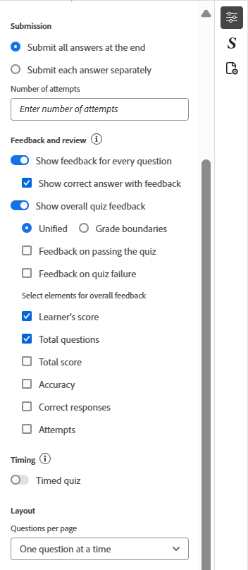

# Quiz Properties

Sie können die Quiz-Eigenschaften mithilfe der folgenden Optionen konfigurieren:

- Wählen Sie den Titel des Quiz aus und klicken Sie dann in der rechten Symbolleiste auf **Inhaltseigenschaften**, um das Bedienfeld **Inhaltseigenschaften** zu öffnen. Hier können Sie die Quiz-Eigenschaften bearbeiten.

  {width="650" align="left"}

- Sie können die Bewertung für Ihr Quiz aktivieren, indem Sie den Umschalter **Abgestuftes Quiz** aktivieren. Nach der Aktivierung können Sie die Verschneidungsmethode entweder prozentual oder absolut wählen und die Kriterien für das Bestehen entsprechend definieren.

  {width="350" align="left"}

- Sie können auch zusätzliche Einstellungen wie Optionen für die Antwortübermittlung, Feedback- und Prüfungsoptionen, Quizzeitpunkte und Layout-Voreinstellungen konfigurieren, wie unten dargestellt.

  {width="350" height="200" align="left"}