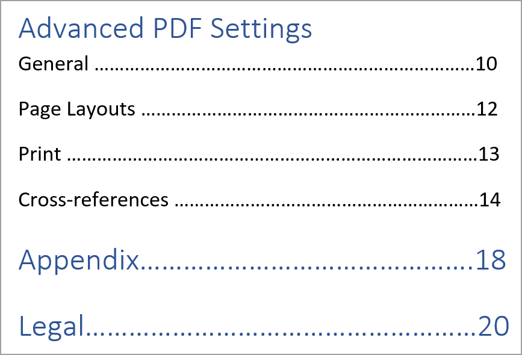

# Komponenten einer PDF-Vorlage {#components-pdf-template}

Eine PDF-Vorlage besteht aus vier Komponenten: Seitenlayouts, Stylesheets, Ressourcen und Einstellungen. Sie können eine Vorlage erstellen, indem Sie diese einzelnen Komponenten anpassen und die Vorlage mit einer Ausgabevorgabe verknüpfen, während Sie eine PDF-Ausgabe generieren. In den folgenden Abschnitten werden diese Komponenten und ihr Anpassungsprozess im Detail beschrieben.

## Seiten-Layouts erstellen und anpassen {#create-customize-page-layout}

Mit den Einstellungen in der Komponente Seitenlayouts können Sie die Struktur einer Seite entwerfen, indem Sie die Kopfzeile, die Fußzeile und den Inhaltsbereich auf einer Seite definieren. Mit dem Seitenlayout-Editor von WYSIWYG können Sie ein Seitenlayout für verschiedene Abschnitte in einer PDF erstellen, z. B. für die Titelseiten vorne und hinten, für Kapitel oder für Tabellen
Inhalte (Inhaltsverzeichnis), Index, leere Seite, Themenvorderseiten, rückwärtige Seiten, Abbildungsverzeichnis (LOF), Tabellenverzeichnis (LOT), Glossar oder Erstellen eines Layouts für eine benutzerdefinierte Seite. In den PDF-Vorlageneinstellungen können Sie ein Seiten-Layout mit verschiedenen Abschnitten in einer PDF zuweisen, die dann zum Generieren der PDF-Ausgabe verwendet werden.

### Erstellen eines neuen Seiten-Layouts {#create-page-layout}

>[!NOTE]
>
>Es gibt Beispiel-Seiten-Layouts, die im Lieferumfang enthalten sind. Sie können diese anpassen oder neue Seiten-Layouts erstellen.

1. Wechseln Sie im Web-Editor zur Registerkarte **Ausgabe** .
1. Erweitern Sie die linke Seitenleiste und klicken Sie auf **Vorlagen**.
1. Öffnen Sie die Vorlage, mit der Sie arbeiten möchten.

   >[!NOTE]
   >
   >Sie können eine Vorlage öffnen, indem Sie doppelt auf ihren Namen oder das Symbol > neben ihrem Namen klicken.

1. Führen Sie einen der folgenden Schritte aus, um ein neues Seiten-Layout zu erstellen:

   * Bewegen Sie den Mauszeiger **Seitenlayouts** klicken Sie auf das Symbol (*Optionen*) **…** und wählen Sie **Neues Seitenlayout**.

   * Klicken Sie **Bedienfeld** Vorlagen) auf das Symbol **+** neben **Vorlagen** und wählen Sie **Seiten-Layout** aus dem Kontextmenü.

     Dadurch wird das Dialogfeld **Layout hinzufügen** geöffnet.

     

1. Geben Sie einen Namen für das neue Seiten-Layout an.
   >[!NOTE]
   >
   >Vermeiden Sie die Verwendung von Sonderzeichen beim Benennen eines Seiten-Layouts. Ein Leerzeichen im Namen wird durch einen Unterstrich „_“ ersetzt.

1. Klicken Sie auf **Fertig**.

   Das neue Layout wird erstellt und unter Seiten-Layouts hinzugefügt.

### Duplizieren eines Seiten-Layouts {#duplicate-page-layout}

1. Doppelklicken Sie **Abschnitt „Vorlagen** der Vorlage, die Sie duplizieren möchten, auf **Seitenlayouts** oder auf das Symbol **>** vor **Seitenlayouts**.

   Dadurch wird die Liste der Seiten-Layouts in der Vorlage angezeigt.

1. Bewegen Sie den Mauszeiger über das Seiten-Layout, das Sie duplizieren möchten, klicken Sie auf das (*Options*-Symbol) **…** und wählen Sie **Duplizieren** aus dem Kontextmenü.

1. Geben _im Dialogfeld Layout duplizieren_ einen Namen für das Seiten-Layout ein.

1. Klicken Sie **Fertig**.
Eine Kopie des ausgewählten Seiten-Layouts wird erstellt und unter Seiten-Layouts hinzugefügt.

### Anpassen eines Seiten-Layouts {#customize-page-layout}

1. Doppelklicken Sie **Abschnitt „Vorlagen** der Vorlage, die Sie bearbeiten möchten, auf **Seitenlayouts** oder auf das Symbol **>** vor **Seitenlayouts**.

   Dadurch wird die Liste der Seiten-Layouts in der Vorlage angezeigt.
1. Um ein Seiten-Layout anzupassen, führen Sie einen der folgenden Schritte aus:
   * Doppelklicken Sie auf ein beliebiges Seiten-Layout.
   * Bewegen Sie den Mauszeiger über ein beliebiges Seiten-Layout und klicken Sie auf *(*) **…** und wählen Sie **Bearbeiten** aus dem Kontextmenü aus.

   Dadurch wird der Seitenlayout-Editor zur Anpassung geöffnet.
1. Nachdem Sie die gewünschten Änderungen vorgenommen haben, klicken Sie auf *Alle speichern* (oder `Crl+S`).

   Weitere Informationen zum Definieren einzelner Layout-Elemente wie Kopfzeile, Fußzeile, Seitenzahl, Titel und mehr finden Sie unter [Erstellen eines Seiten-Layouts](design-page-layout.md).

## Verwenden von Stylesheets zum Anpassen von PDF {#stylesheet-customization}

Mit den Einstellungen in der Stylesheets-Komponente können Sie die Seitenlayoutkomponenten und DITA-Inhalte mit dem WYSIWYG-Editor gestalten oder direkt mit der CSS-Datei arbeiten. Sie können eigene Stile erstellen oder die Standardstileigenschaften anpassen. Der WYSIWYG-Editor bietet Zugriff auf die meisten Eigenschaften, die Sie zum Gestalten Ihres Seitenlayouts oder DITA-Inhalts benötigen. Erweiterte Anpassungen können direkt in der Source-Ansicht vorgenommen werden.

### Neue Formatvorlage erstellen {#create-stylesheet}

Während CSS-Dateien für Inhalt und Layout bereitgestellt werden, können Sie ein neues Stylesheet erstellen, um mehrere Anpassungen auf einen bestimmten Stiltyp anzuwenden, die dann auf eine Zielkomponente angewendet werden können. Standardmäßig werden CSS-Beispieldateien im Produkt gebündelt. Diese CSS-Dateien sollen Ihnen dabei helfen, Ihre Formatierungsinformationen in allen Inhalten und Layouts zu organisieren. Sie können diese Stile in einer oder mehreren CSS-Dateien zusammenführen.

Wenn Sie ein neues Seiten-Layout erstellen, wird die `layout.css` standardmäßig in das neue Seiten-Layout eingeschlossen. Wenn Sie möchten, dass das Seitenlayout Stile aus einer anderen CSS-Datei enthält, können Sie die gewünschte CSS-Datei einfach per Drag-and-Drop in den Inhaltsbearbeitungsbereich des neuen Seitenlayouts ziehen. Um zu überprüfen, ob die CSS-Datei in das Seiten-Layout eingebettet wurde, wechseln Sie zur Source-Ansicht und Sie finden im `<head>` einen Link zur CSS-Datei.

Gehen Sie wie folgt vor, um ein Stylesheet zu erstellen:
1. Führen **im Bedienfeld** Vorlagen“ eine der folgenden Aktionen aus:
   * Bewegen Sie den Mauszeiger über **Registerkarte** Stylesheets“, klicken Sie auf das *(* Optionen **-Symbol)…** und wählen Sie **Neues Stylesheet**.
   * Klicken Sie auf das Symbol **+** neben **Vorlagen** und wählen Sie **Stylesheet** aus dem Kontextmenü.

   Dadurch wird das Dialogfeld Stylesheet hinzufügen geöffnet.

   
1. Geben Sie einen Namen für das neue Stylesheet an.
1. Klicken Sie auf **Fertig**.

   Ein neues Stylesheet wird erstellt und unter dem Abschnitt Stylesheets hinzugefügt.

### Neuen Stil erstellen {#create-style}

Standardmäßig enthalten die mit der Vorlage bereitgestellten CSS-Dateien Stile für Überschriften, Absätze, Zeichen, Hyperlinks, Bilder, Tabellen, div, Seiten und andere Stile. Sie können das Standardformatierungsformat überschreiben oder einen neuen Stil erstellen.

Sie können einen neuen Stil erstellen, um ihn im Seitenlayout der Vorlage zu verwenden, oder einen benutzerdefinierten Stil auf ein beliebiges DITA-Element anwenden. Um diese benutzerdefinierten Stile auf das DITA-Element anzuwenden, müssen Sie sicherstellen, dass der Klassenname des Stils mit dem Namen des DITA-Elements oder dem `outputclass`-Attribut übereinstimmt.  Beispielsweise wird die `
` in DITA durch die `.div {}` in CSS oder das zugehörige `outputclass`-Attribut gesteuert. Wenn Sie `
` in DITA anwenden, wird dies durch die `.div {}` oder `.my-div {}` im CSS geregelt.

Gehen Sie wie folgt vor, um einen neuen Stil zu erstellen:
1. Erweitern Sie die linke Seitenleiste und doppelklicken Sie auf die Vorlage, in der Sie den Stil erstellen möchten.
1. Erweitern Sie den Abschnitt **Stylesheets**. Dadurch wird das Bedienfeld **Stile** geöffnet, das alle Stiloptionen enthält.
1. Wählen Sie das Symbol + aus, um einen neuen Stil hinzuzufügen.

   **Stil hinzufügen** wird das Dialogfeld geöffnet.

   

1. Geben Sie einen **Class** Namen an. Um einen Stil auf das DITA-Element anzuwenden, stellen Sie sicher, dass der Klassenname des Stils mit dem Namen des DITA-Elements oder dem `outputclass`-Attribut übereinstimmt.
1. Wählen **Feld „Tag** (optional) ein Tag aus, für das Sie einen neuen Stil erstellen möchten.

1. Wählen Sie eine **Pseudoklasse**, um ein Element zu formatieren. Eine Pseudoklasse hilft Ihnen, einen speziellen Status des Elements zu definieren. Verwenden Sie beispielsweise eine Pseudoklasse, um ein Element zu formatieren, wenn Sie mit dem Mauszeiger darüber fahren oder wenn Sie den Fokus darauf legen. Sie können auch mehrere Pseudoklassen auswählen. Beispielsweise können Sie `a::visited {color: blue;}` der Pseudoklasse verwenden, um die besuchten Links zu gestalten.

1. Fügen Sie den Selektor für den neuen Stil hinzu. Das **selector**-Feld hilft Ihnen beim Hinzufügen benutzerdefinierter Selektoren neben der Kombination aus Klasse, Tag und Pseudoklasse. Sie können beispielsweise `table a.link` Stil für alle Hyperlinks in einer Tabelle erstellen.

   Weitere Informationen zu CSS-Tags finden Sie unter [Siehe CSS-Stilgrammatik](https://www.w3.org/TR/CSS21/syndata.html#characters).

1. Klicken Sie auf **Fertig**.

   Ein neuer Stil wird erstellt und der Stilliste hinzugefügt.

### Anpassen eines vordefinierten oder neuen Stils {#customize-style}

Nachdem Sie eine neue CSS-Datei mit Standardstilen erstellt haben oder Stile in einer vorhandenen CSS-Datei anpassen möchten, können Sie dazu den Stileditor verwenden.

Gehen Sie wie folgt vor, um einen Stil anzupassen:
1. Doppelklicken Sie auf **Stylesheets** oder klicken Sie auf das Symbol **>** vor **Stylesheets**.

   Dadurch werden die standardmäßigen (Inhalt und Layout) und benutzerdefinierten CSS-Dateien angezeigt.
1. Öffnen Sie eine Formatvorlage zur Bearbeitung.

   Führen Sie einen der folgenden Schritte aus, um Stylesheet zur Bearbeitung zu öffnen:
   * Doppelklicken Sie auf den Namen der Formatvorlage.
   * Bewegen Sie den Mauszeiger über den Namen des Stylesheets, klicken Sie auf (Optionssymbol) … und wählen Sie Bearbeiten aus.

   Dadurch wird das Stylesheet zur Bearbeitung geöffnet und die Liste der Stile im Bedienfeld Stile angezeigt.

   

1. Um einen Stil anzupassen, wählen Sie den Stil aus, um ihn anzuzeigen, und passen Sie ihn mit dem Stileditor an.

### Stileigenschaften

Im mittleren Bereich können Sie die Eigenschaften bearbeiten. Es kann jedoch schwierig sein, eine Momentaufnahme davon zu erhalten, welche Werte alle vorhanden sind.  Der Bereich **Eigenschaften** bietet eine schnelle Ansicht aller Attribute und Werte des Stils.

Im mittleren Bereich können Sie die häufig verwendeten Eigenschaften, jedoch nicht alle von CSS unterstützten Eigenschaften bearbeiten. Im Bereich **Eigenschaften** können Sie alle von CSS unterstützten Eigenschaften bearbeiten und eine Vorschau davon anzeigen. Sie müssen nicht zur Quellansicht wechseln, um Eigenschaften zu bearbeiten.

Erfahren Sie mehr über die Verwendung des Stil[Editors zum Arbeiten mit allgemeinen Inhaltsstilen](stylesheet.md).

## Arbeiten mit Ressourcen {#work-with-resources}

Dies ist ein Container für alle Assets, die zum Entwerfen einer Vorlage verwendet werden. Sie können ihn sich als Ordner vorstellen, der Assets wie Hintergrundbilder, benutzerdefinierte Schriftarten, Logos und mehr enthält. Jedes Mal, wenn Sie ein Asset zu Ihrer Vorlage hinzufügen, wird es in den Asset-Ordner hochgeladen oder eingecheckt. Sie können diese Assets dann verwenden, um Ihre PDF-Vorlagen anzupassen oder zu entwerfen.

Gehen Sie wie folgt vor, um eine Asset-Datei zum Ordner „Ressourcen“ hinzuzufügen:

1. Bewegen Sie den Mauszeiger über die Registerkarte Ressourcen und klicken Sie auf das Symbol (Optionen) … und wählen Sie Importieren.

   Dadurch wird das Dialogfeld Assets hochladen geöffnet.

   

   Der Pfad, unter dem die Asset-Datei hochgeladen wird, wird im Feld **Asset-Ordner auswählen** angezeigt.
   >[!NOTE]
   >
   >Sie können den Pfad zum Hochladen von Assets nicht ändern. Standardmäßig werden alle Assets im Ordner `/content/dam/dita-templates/pdf/<PDF-template-name>` gespeichert.

1. Klicken Sie **Dateien auswählen**, um die Asset-Datei auf Ihrem lokalen Computer zu durchsuchen

1. Klicken Sie **Hochladen**.
Die ausgewählte Datei wird importiert und im Ordner Ressourcen aufgeführt.

## Erweiterte PDF-Einstellungen {#advanced-pdf-settings}

Verwenden Sie den Abschnitt Einstellungen , um die erweiterten Einstellungen für das Seiten-Layout von PDF zu konfigurieren, beginnend mit PDF bei ungeraden oder geraden Seitenformaten für die Querverweise, und um die Druckmarken in der endgültigen PDF zu aktivieren, die generiert wurde
mithilfe der Vorlage.

>[!NOTE]
>
> Ab Experience Manager Guides Version 5.0/2025.02.0 wurde der Abschnitt **Drucken** in den erweiterten PDF-Einstellungen in das Bedienfeld **Ausgabevorgaben** verschoben. Um die Druckeinstellungen zu konfigurieren, zeigen Sie [PDF-Ausgabe veröffentlichen](../web-editor/native-pdf-web-editor.md#print) an.

Klicken Sie zum Konfigurieren **Bereich** Vorlagen **, um** folgenden Optionen anzuzeigen:

### Allgemein

Legen Sie die grundlegenden Konfigurationseinstellungen für den Start eines Kapitels von einer ungeraden oder geraden Seite sowie die Inhaltsverzeichnisstruktur fest und definieren Sie das Format der Führungslinie für die Inhaltsverzeichniseinträge. Sie können die folgenden Einstellungen definieren:

* **Beginn jedes neuen Kapitels ab**: Hiermit können Sie festlegen, wie die einzelnen Kapitel im endgültigen PDF veröffentlicht werden. Sie können zwischen den Optionen **Neue Seite**, **Ungerade Seite**, **Gerade Seite** oder **Aktuelle Seite** wählen. Wenn Sie ein neues Kapitel auf einer ungeraden Seite beginnen möchten, wird nach einem Kapitel, das auf einer ungeraden Seite endet, eine leere Seite eingefügt. Wenn Ihr Kapitel beispielsweise mit der Seitenzahl 15 endet, fügt der Veröffentlichungsprozess eine leere 16. .  ein, damit das neue Kapitel mit der 17. .  beginnen kann.  Wenn Sie die Option **Aktuelle Seite** wählen, werden alle Kapitel in Fortsetzung ohne Seitenumbrüche veröffentlicht. Wenn beispielsweise ein Kapitel in der Mitte von Seite 15 endet, wird das nächste Kapitel ebenfalls von der 15. Seite selbst gestartet.

* **Beginnen Sie jedes Thema von einer neuen Seite**: Wenn Sie möchten, dass jedes Thema in Ihrem Kapitel von einer neuen Seite beginnt, wählen Sie **Option „Jedes Thema von einer neuen Seite**. Wenn Sie Ihre Themen ohne Seitenlücken im weiteren Verlauf behalten möchten, deaktivieren Sie diese Option.

* **Inhaltsstruktur**: Ermöglicht die Anpassung der Hierarchie des Inhaltsverzeichnisses. Es werden die folgenden zusätzlichen Einstellungen verwendet:

   * **Überschriften bis zur Ebene verwenden**: Damit können Sie die Anzahl der Überschriftenebenen anpassen, die in der Inhaltsverzeichnisstruktur Ihrer PDF angezeigt werden sollen.
   * **Seitenzahl für die erste Ebene im Inhaltsverzeichnis nicht anzeigen**: Wählen Sie diese Option, um die entsprechenden Seitenzahlen für alle Kapitel auszublenden, die verschachtelte oder untergeordnete Themen enthalten. Betrachten Sie das folgende Beispiel, bei dem eine Ausgabe erstellt wird, ohne diese Option auszuwählen.

  

  Im obigen Beispiel sind die erweiterten PDF-Einstellungen, der Anhang und die Rechtstexte die Überschriften oder Kapiteltitel der ersten Ebene. Allen Überschriften wird eine Seitennummer zugewiesen.

  Wenn Sie jetzt diese Option auswählen und die Ausgabe generieren, erhalten Sie das folgende Inhaltsverzeichnis:

  

  Hier können Sie feststellen, dass das erste Kapitel „Erweiterte PDF-Einstellungen“ keine Seitenzahl erhält, da es verschachtelte oder untergeordnete Themen enthält. Eine Seitennummer wird hingegen Anhang und Legal zugewiesen, da es sich um eigenständige Themen ohne untergeordnetes Thema handelt.

* **Kapitelnummer nicht im Inhaltsverzeichnis anzeigen** : Wählen Sie diese Option, um die Kapitelnamen ohne die Kapitelnummern im Inhaltsverzeichnis anzuzeigen.   Standardmäßig werden die Kapitelnummern im Inhaltsverzeichnis der PDF-Ausgabe angezeigt.
* **Führungslinienformat**: Verwenden Sie die Dropdown-Liste, um gepunktete, durchgezogene oder Leerraum-Führungslinien auszuwählen und Überschriftenebenen mit den entsprechenden Seitenzahlen zu verbinden.
Informationen zum Anwenden der Überschriftenebenen für Inhaltsverzeichnisse und zur Formatierung finden Sie unter [Hinzufügen eines Kapitelverzeichnisses](design-page-layout.md#add-chapter-toc).

  >[!NOTE]
  >
  >Wenn Sie CSS-Entwickler sind, können Sie das Leader-Format auch direkt in der CSS-Datei definieren.

* **Fortsetzungsmarkierung für Tabelle verwenden**: Wählen Sie diese Option, um Markierungen für lange Tabellen zu definieren, die sich über mehrere Seiten erstrecken.
Sie können festlegen, welcher Text vor und nach der Pause angezeigt werden soll. Beispiel: Auf Seite 5 wird eine Tabelle umgebrochen, und Sie definieren `<Continued on page %page-num%>` für &quot;**vor Umbruch**.  Der Text zeigt unten auf Seite 5 „Fortsetzung auf Seite 6“ an.

  Verwenden Sie Sprachvariablen, um den Text der Fortsetzungsmarkierung vor und nach der Pause zu definieren. Je nach Sprache wird der lokalisierte Wert automatisch in der PDF-Ausgabe ausgewählt. Sie können `Continued on page %page-num%` beispielsweise als Text auf Englisch und `Fortsetzung auf Seite %page-num%` auf Deutsch veröffentlichen.

  Bewegen Sie den Mauszeiger über  in der Nähe der Option, um weitere Details dazu anzuzeigen.
* **Glossarbegriffe mit der Glossarseite verknüpfen**: Wählen Sie diese Option, um die Glossarbegriffe als Hyperlinks im Inhalt anzuzeigen und mit den Begriffen auf der Glossarseite zu verknüpfen. Dies hilft den Lesern, die Definition eines im Glossar definierten Begriffs schnell anzuzeigen.

  Um Glossarbegriffe in Hyperlinks zu konvertieren, gehen Sie folgendermaßen vor:
   * Aktivieren **Glossar** auf der Registerkarte **Seitenlayoutreihenfolge** für eine DITA-Zuordnung.
   * Fügen Sie das Glossar auf den Seiten der Hintergrundthemen für eine Buchkarte hinzu.

  Wenn Sie die Glossarseite nicht aktivieren, werden die Glossarbegriffe im Inhalt in der PDF-Ausgabe nicht in Hyperlinks konvertiert.
  <!--For more information on using table continuation markers, see Use table continuation markers.-->

### Seiten-Layouts {#page-layouts}

Mit den Einstellungen für Seiten-Layouts können Sie vollständig steuern, welches Seiten-Layout für einen bestimmten Abschnitt Ihres Dokuments verwendet werden soll. Um beispielsweise ein Layout für das Inhaltsverzeichnis auszuwählen, klicken Sie auf das Dropdown-Menü unter dem Inhaltsverzeichnisfeld und wählen Sie das Layout aus, das Sie für die Erstellung des Inhaltsverzeichnisses entworfen haben.

Beachten Sie, dass die Einstellungen der Lesezuordnung Vorrang vor den Einstellungen für das Seiten-Layout haben.

Die folgenden Einstellungen sind im Abschnitt Seiten-Layout verfügbar:

**Standardseitenlayout**: Wählen Sie ein Seitenlayout aus, das als Standardlayout für alle Seiten in Ihrer PDF dient. Dies ist das Basisseiten-Layout, das auf die Abschnitte oder Themen angewendet wird, für die Sie kein eigenes Seiten-Layout erstellt haben.

**Seitenlayout für verschiedene Abschnitte**: Sie können ein Seitenlayout den folgenden Abschnitten Ihrer PDF-Ausgabe zuordnen. Wenn Sie ein Seiten-Layout für den entsprechenden Abschnitt entworfen haben, wählen Sie diesen aus der Dropdown-Liste aus. Wenn für bestimmte Abschnitte keine Seiten-Layouts erstellt wurden, wird das Standard-Seiten-Layout angewendet.

* **Kapitel und Themen**: Sie können das Seiten-Layout für das für die Kapitel und Themen angeben. Das ausgewählte Layout wird auf alle Kapitel und Themen angewendet.

* **TOC**: Wenn Sie das Layout der Inhaltsverzeichnisseite entworfen haben, wählen Sie **TOC** in der Dropdown-Liste aus. Alle Inhaltsverzeichnisseiten in Ihrem Dokument haben dann das Layout der Inhaltsverzeichnisseite.

* **Abbildungs- und Tabellenliste**: Sie können auch das Seitenlayout für Abbildungen und Tabellen angeben. Das ausgewählte Layout wird auf alle Abbildungen und Tabellen angewendet.

* **Index**: Wenn Sie ein Seiten-Layout „Index“ entworfen haben, ordnen Sie es der Option „Index“ zu. Mithilfe der Stylesheets können Sie verschiedene Indexelemente in der PDF-Ausgabe formatieren. Verwenden Sie die Indexstile `.idx-header`, `.idx-footer`, `.idx-body`, `.idx-title`, `.idx-keyword-group`, `.idx-unit`, `.idx-keyword`, `.idx-name`, `.idx-link` und `.idx-child`, um die Stile für die Elemente des Index anzupassen.

* **Glossar**: Wenn Sie über ein Glossar-Seiten-Layout verfügen, ordnen Sie es der Option „Glossar“ zu.

  Die Begriffe im Glossar Ihrer PDF-Ausgabe sind immer in alphabetischer Reihenfolge sortiert.

  Sie können die Tag-`sort-as` auch hinzufügen, um einen Sortierschlüssel für die Glossarbegriffe zu definieren. Experience Manager Guides verwendet dann die Sortiertaste, um die Glossarbegriffe anstelle der Glossarbegriffe zu sortieren. Wenn Sie den Sortierschlüssel nicht definiert haben, werden die Glossarbegriffe zum Sortieren verwendet. Sie können beispielsweise den Tag-`sort-as` zum `glossterm` hinzufügen und seinen Wert für den Begriff „USB“ auf `A` setzen (z. B. `<glossterm>USB<sort-as>A</sort-as></glossterm>`). Auf ähnliche Weise können Sie `sort-as` -Tag hinzufügen und seinen Wert auf `B` für den Begriff „Pen Drive“ festlegen. Wenn Sie diese Glossarbegriffe sortieren, wird der `A` für den Glossarbegriff „USB“ vor dem `B` für den Glossarbegriff „Pen Drive“ angezeigt. In der PDF-Ausgabe steht „USB“ also vor „Pen Drive“ auf der Glossarseite.

  Mithilfe der Stylesheets können Sie verschiedene Glossarelemente in der PDF-Ausgabe formatieren. Verwenden Sie die Glossarstile `.glo-header`, `.glo-footer`, `.glo-body`, `.glo-title`, `.glo-unit`, `.glo-link` und `.glo-term`, um die Stile für die Elemente des Glossars anzupassen.

  Erfahren Sie mehr über die Verwendung des Stil[Editors zum Arbeiten mit allgemeinen Inhaltsstilen](stylesheet.md).

* **Vorderseite für Materie und Rückseite für Materie**: Diese Seiten-Layouts definieren den Stil für Vorder- oder Rückseite für Materie Seiten in Ihrem Buch. Wenn Sie das Layout der Titelmaterie entworfen haben, ordnen Sie es der Option **Titelmaterie-Seiten** zu. Wenn Sie das Layout der Titelmaterie aus der Dropdown-Liste auswählen, wird das Layout der Titelmaterie auf alle Themen in der Titelmaterie angewendet.

  Wenn Sie das Layout „Hintergrundmaterial“ entworfen haben, ordnen Sie es der Option **Hintergrundmaterialseiten** zu. Wenn Sie das Layout Hintergrundmaterie aus der Dropdown-Liste auswählen, wird das Layout Hintergrundmaterie auf alle Themen in der Hintergrundmaterie angewendet.

  **Vordere Themenseiten** wird auch als Ausweich-Layout für das **Inhaltsverzeichnis**, **Abbildungs-** Tabellenliste) verwendet.  Auf ähnliche **wird** Zurück Matter Pages“ auch als Ausweich-Layout für die **Index** und **Glossar**-Layouts verwendet. Wenn Sie das Layout für diese Seiten nicht ausgewählt haben, wird das ausgewählte Layout für Vorder- oder Rückseite der Themenseiten angewendet.  Wenn Sie das Layout Vorder- oder Rückseite der Themenseiten nicht ausgewählt haben, wird das Standardseitenlayout darauf angewendet.

* **Seiten-Layout für leere Seiten**:    Sie können auch das Seiten-Layout für leere Seiten angeben. Das ausgewählte Layout wird auf alle leeren Seiten angewendet. Wenn Sie beispielsweise ein Layout Leere Seite für alle leeren Seiten entworfen haben, wählen Sie **Leer** in der Dropdown-Liste aus. Alle leeren Seiten in Ihrem Dokument haben dann das Layout Leere Seite .

* **Titelseite und Rückseite**: Wenn Sie ein Titelseiten-Layout entworfen haben, ordnen Sie es der Option **Titelseite** zu. Wenn Sie über ein Layout für die Rückseite verfügen, ordnen Sie es der Option **Rückseite“**. Wenn keine Layouts für das Deckblatt oder die Rückseite erstellt wurden, wird das Standardseitenlayout angewendet.

Weitere Informationen zu Seiten-Layouts finden Sie unter [Erstellen eines Seiten-Layouts](design-page-layout.md).

### Seitenlayoutreihenfolge {#page-order}

Sie können die folgenden Abschnitte in Ihrer PDF ein- oder ausblenden und auch die Reihenfolge festlegen, in der sie in der endgültigen PDF-Ausgabe angezeigt werden sollen:

* IHV
* Kapitel und Themen
* Abbildungsverzeichnis
* Liste der Tabellen
* Index
* Glossar
* Zitierung

  

  Wenn Sie einen bestimmten Abschnitt in Ihrer PDF-Ausgabe nicht anzeigen möchten, können Sie dies ausblenden, indem Sie den Umschalter deaktivieren.

  Sie können auch die Reihenfolge festlegen, in der diese verschiedenen Abschnitte in Ihrer PDF generiert werden. Um die Standardreihenfolge dieser Abschnitte zu ändern, wählen Sie die gepunkteten Balken aus, um die Abschnitte per Drag-and-Drop an die gewünschte Position zu ziehen.

  >[!NOTE]
  >
  > Die Einstellungen für Reihenfolge und Einbindung gelten nur für eine DITA-Zuordnung. Für eine Bookmap sind diese Einstellungen nicht anwendbar. Die Seiten in einer Bookmap werden gemäß der Reihenfolge der Abschnitte in der Bookmap angezeigt.

.
**Kapitel und Themen** ist das Layout standardmäßig immer aktiviert. Sie können es nicht ein-/ausschalten.

**Seiten zusammenführen**

Standardmäßig beginnen alle Abschnitte auf einer neuen Seite. Wählen Sie die Option **Vorherige Seite** oder **Nächste Seite** aus dem Dropdown-Menü **Zusammenführen mit**, um einen Abschnitt mit einer vorherigen oder nächsten Seite zusammenzuführen. Dadurch wird der Abschnitt in Fortsetzung mit der ausgewählten Seite in der PDF-Ausgabe veröffentlicht. Mit diesem wird es keinen Seitenumbruch dazwischen geben.

>[!NOTE]
>
> Diese Einstellung gilt nur für den Abschnitt und nicht für dessen Komponenten.  Wenn Sie beispielsweise die Option **Vorherige Seite** für **Kapitel und Themen** auswählen, wird der Abschnitt **Kapitel und Themen** mit der vorherigen Seite zusammengeführt. Die verschiedenen Kapitel und Themen werden gemäß den Einstellungen unter **Allgemein** veröffentlicht. Wenn Sie beispielsweise in **Neues Kapitel aus der Einstellung beginnen** die Option **Ungerade Seite** auswählen, wird nach einem Kapitel, das auf einer ungeraden Seite endet, eine leere Seite eingefügt.

Wenn Sie einen Abschnitt mit der vorherigen oder nächsten Seite zusammenführen, wird der Inhalt zusammengeführt und der Stil des Zielabschnitts, in dem der Inhalt zusammengeführt wird, wird angewendet.

Wenn Sie beispielsweise **Inhaltsverzeichnis** und **Kapitel und Themen** aktivieren und die **Nächste Seite** für **Inhaltsverzeichnis** auswählen, wird **Inhaltsverzeichnis** mit dem nächsten Abschnitt zusammengeführt, dem **Kapitel und Themen**. Der Stil des Abschnitts **Kapitel und Themen** wird auf den zusammengeführten Inhalt beider Abschnitte angewendet.

Die Option Zusammenführen funktioniert nacheinander. Wenn Sie also **Nächste Seite** für mehrere zusammenhängende Abschnitte ausgewählt haben, werden diese alle mit dem ersten Abschnitt (in der nächsten Richtung) zusammengeführt, für den diese Eigenschaft nicht festgelegt ist. Sie aktivieren beispielsweise **Inhaltsverzeichnis**, **Kapitel und Themen**, **Abbildungsverzeichnis** und **Index**. Wenn Sie dann **Nächste Seite** für **TOC**, **Chapter &amp; Topics**, **List of Figures** und **None** für **Index** festlegen, werden alle mit **Index** zusammengeführt.

**Statische Seiten**

Die verschiedenen Seiten-Layouts helfen Ihnen, die Ausgabe der verschiedenen Abschnitte zu entwerfen. Diese Abschnitte werden aus der DITA-Zuordnung generiert, während Sie die Ausgabe veröffentlichen.
Sie können auch benutzerdefinierte Seiten-Layouts erstellen und als statische Seiten in der PDF-Ausgabe veröffentlichen. Auf diese Weise können Sie beliebige statische Inhalte wie Anmerkungen oder leere Seiten hinzufügen.

Führen Sie die folgenden Schritte aus, um ein benutzerdefiniertes Seiten-Layout hinzuzufügen:

1. Wählen Sie **Hinzufügen** aus,  ein neues Seiten-Layout hinzuzufügen. Der Bereich Seitenlayout hinzufügen wird geöffnet.
2. Wählen Sie in der Liste das Seiten-Layout aus und klicken Sie auf Hinzufügen . Das neue Seiten-Layout wird der Liste der Seiten-Layouts hinzugefügt.

Sie können auch die folgenden Aktionen ausführen:

* Wählen Sie die gepunkteten Balken aus, um das Seiten-Layout per Drag-and-Drop an die gewünschte Position zu ziehen.

* Wählen Sie **Layout entfernen** , um ein Layout zu entfernen.

* Sie können auch eine statische Seite mit der vorherigen oder der nächsten Seite zusammenführen.

* Sie können ein benutzerdefiniertes Layout auch mehrmals hinzufügen und sortieren. Auf diese Weise können Sie den statischen Inhalt entsprechend veröffentlichen.

  Sie können beispielsweise ein benutzerdefiniertes Layout verwenden, um eine statische Warnung mehrmals in der PDF-Ausgabe zu veröffentlichen.

### Seitenorganisation

Die Seiten in einem PDF-Dokument werden normalerweise entsprechend dem Inhalt veröffentlicht, der in der DITA-Map- oder Bookmap-Datei organisiert ist. Sie können jedoch auch die Reihenfolge der Seiten im PDF-Dokument ändern. Sie können beispielsweise ein mehrseitiges Dokument als Broschüre drucken. Wenn Sie die Blätter zusammenstellen, falten und heften, ist das Ergebnis ein einzelnes Buch mit der richtigen Seitenreihenfolge.  Sie können die veröffentlichte Broschüre dann wie ein Buch lesen.

Die folgenden Einstellungen sind im Abschnitt **Seitenorganisation** verfügbar:

#### Seitenreihenfolge

Wählen Sie eine Seitenreihenfolge aus, die die Seitenreihenfolge in Ihrem PDF-Dokument bestimmt. Sie können die folgenden Optionen aus dem Dropdown-Menü auswählen:

* **Standard**: Die Standardreihenfolge der Seiten gemäß der Quelldatei.
* **Ungerade Seiten zuerst**: Alle ungeraden Seiten werden vor alle geraden Seiten verschoben.
* **Gerade Seiten zuerst**: Alle geraden Seiten werden vor alle ungeraden Seiten verschoben.
* **Umkehren**: Die Seitenreihenfolge wird umgekehrt.
* **Booklet**: Alle Seiten werden wie in einem Booklet bestellt.
* **Right to Left Booklet**: Alle Seiten befinden sich in der Reihenfolge von rechts nach links.
* **Benutzerdefiniert**: Definieren Sie eine benutzerdefinierte Reihenfolge der Seiten anstelle einer vordefinierten Reihenfolge.
   * &quot; a..b“ — Alle aufeinander folgenden Seiten von a bis b.
   * „a,b,c“ — Neue Seitenreihenfolge a, b, c.
   * „a*b“ - Die Seite a wird x-mal wiederholt.
   * &quot;-a“ - Negative Seitenzahlen werden ab der letzten Seite rückwärts gezählt und können mit anderen benutzerdefinierten Bestellungen kombiniert werden.
   * „X“ — Alle Seiten des Dokuments. Gleiches Ergebnis wie „1..-1“.

So können Sie beispielsweise eine benutzerdefinierte Bestellung wie „2,3,5*2,7..10,-1,-2.
Die angegebene Seitenreihenfolge führt zu einem PDF mit den folgenden Seitennummern aus dem Originaldokument, vorausgesetzt, es umfasst insgesamt 25 Seiten: 2, 3, 5, 5, 7, 8, 9, 10, 25, 24.

#### Konfigurieren von mehr als einer Seite pro Blatt

Wählen Sie diese Option, um mehrere Seiten auf einem einzigen Blatt Papier zu veröffentlichen.  Wählen Sie dann die Anzahl der Zeilen und Spalten aus und veröffentlichen Sie die Seiten wie ein Raster auf einem einzelnen Blatt. Sie können die Seiten beispielsweise als Raster aus 2 Zeilen und 4 Spalten veröffentlichen.

Definieren Sie die Zielblattgröße und die Ausrichtung, in der Sie das Blatt veröffentlichen möchten. Sie können auch die Margin-Eigenschaft und die Padding-Eigenschaft des Blatts angeben.

### Querverweise {#cross-references}

Verwenden Sie die **Querverweis**, um festzulegen, wie die Querverweise in PDF veröffentlicht werden. Sie können die Querverweise für Thementitel, Tabellen, Abbildungen usw. formatieren.

>[!NOTE]
>
> Wenn Sie den Verknüpfungstext beim Einfügen des Querverweises definiert haben, hat dieser Vorrang vor dem in der nativen PDF-Vorlage definierten Querverweisformat.

Sie können Variablen auch verwenden, um einen Querverweis zu definieren.  Wenn Sie eine Variable verwenden, wird deren Wert aus den Eigenschaften ausgewählt. Sie können eine einzelne oder eine Kombination von Variablen verwenden, um einen Querverweis zu definieren. Sie können auch eine Kombination aus einer Zeichenfolge und einer Variablen verwenden.

Sie können beispielsweise `View details on {chapter}` verwenden. Wenn der Kapitelname „Allgemeine Einstellungen“ lautet, lautet der Querverweis in der Ausgabe „Details zu allgemeinen Einstellungen anzeigen“.

AEM Guides bietet die folgenden vordefinierten Variablen:

* {title}: Erstellt einen Querverweis zum Titel des Themas. Beispiel: Siehe Nützliche Links auf Seite 2.
* {page} Fügt einen Querverweis auf die Seitenzahlen hinzu. Beispiel: Siehe auf Seite 1.
* {description}: Fügt einen Querverweis zum Text der Beschreibung hinzu. Ein Beispiel finden Sie unter den Details von AEM Guides.
* {chapter}: Fügt einen Querverweis auf die Kapitelnummern hinzu. Siehe zum Beispiel in Kapitel 1.
* {bookmarkText}: Erstellt einen Querverweis auf den mit Lesezeichen versehenen Text. Beispiel: Siehe stop_words auf Seite 5.
* {captionText}: Erstellt einen Querverweis zur Beschriftung der Abbildung oder Tabelle im Thema. Zum Beispiel siehe Luftstrom auf Seite 2.
* {figure}: Fügt einen Querverweis auf die Abbildungsnummer hinzu. Wählt die Zahl der Zahl aus den automatischen Zahlenstilen aus, die Sie für „figcaption“ definiert haben.  Sie können beispielsweise „Siehe {figure} auf Seite {page}&quot; verwenden. Der Querverweis in der Ausgabe enthält die automatisch generierte Abbildungsnummer und deren Seitennummer, „Siehe Abbildung 1 auf Seite 5“.
* {table}: Fügt einen Querverweis zur Tabellennummer hinzu. Wählt die Tabellennummer aus den automatischen Nummerierungsstilen aus, die Sie für Beschriftung definiert haben. Sie können beispielsweise „Siehe {table} auf Seite {page}&quot; verwenden. Der Querverweis in der Ausgabe enthält die automatisch generierte Tabellennummer und die zugehörige Seitennummer „Siehe Tabelle 1 auf Seite 5“.

  >[!NOTE]
  >
  >Sie können Stile für automatische Nummern für Beschriftungs- und Beschriftungs-Tags erstellen.

#### Standardmäßiges Querverweisformat

Wenn Sie das Textfeld leer lassen und den Verknüpfungstext beim Einfügen eines Querverweises nicht definiert haben, fügt Experience Manager Guides die folgenden Variablen für die entsprechenden Querverweise hinzu:

* **Titel**: `{title}`
* **Beschreibung**: `{description}`
* **Absatz**: `{bookmarkText}`
* **Lesezeichen**: `{bookmarkText}`
* **Abbildung**: `{captionText}`
* **Tabelle**: `{captionText}`

Die Rangfolge der Querverweise ist:
* Link-Text in den Querverweisen hinzugefügt
* In der nativen PDF-Vorlage definiertes Querverweisformat
* Standardmäßiges Querverweisformat

#### Sprachvariablen in Querverweisen

Sie können auch Sprachvariablen verwenden, um lokalisierte Querverweise zu definieren. Je nach Sprache wird der lokalisierte Wert automatisch in der PDF-Ausgabe ausgewählt.

Sie können beispielsweise eine Sprachvariable namens „reference-label“ hinzufügen und die Werte auf Englisch und Deutsch definieren.

* Englisch - „Auf Seite {page} anzeigen“
* Deutsch - „Einzelheiten finden Sie auf der Seite {page}&quot;

Wenn Sie `${lng:<variable name>}` zum Abschnitt Absatz hinzufügen, enthalten die Querverweise in den Absätzen der Ausgabe den lokalisierten Text und die Seitenzahl.\
Die folgenden Screenshots zeigen zum Beispiel die Querverweise „Auf Seite 1 anzeigen &quot; in englischer Sprache und „Einzelheiten finden Sie auf der Seite 1“ in deutscher Sprache.

*Ein Querverweis innerhalb eines Absatzes bei Veröffentlichung in englischer Sprache.*

*Ein Querverweis innerhalb eines Absatzes bei Veröffentlichung in deutscher Sprache.*

<!--For more information, see *Format cross-references*.-->
