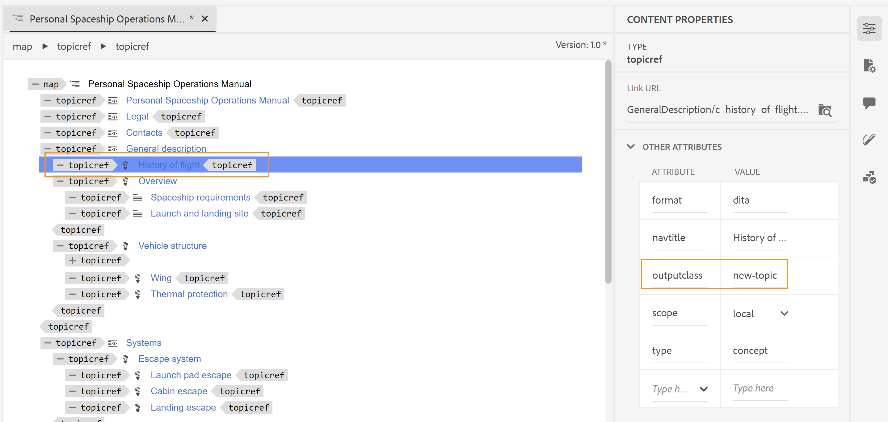

# Anwenden eines benutzerdefinierten Stils auf Inhaltsverzeichniseinträge und Themeninhalte

Manchmal können Sie benutzerdefinierte Stile auf die TOC-Einträge oder ein bestimmtes Thema anwenden. Dies kann erreicht werden, indem ein `outputclass` -Attribut mit dem `<topicref>` -Element in Ihrer DITA-Zuordnung verknüpft wird. Wenn Sie ein benutzerdefiniertes Format auf ein ganzes Thema anwenden möchten, kann dies auch durch Erweitern der Stildefinition des Attributs in der CSS erreicht werden.

Nehmen wir ein Beispiel für ein neues Thema, das Sie zur Überprüfung senden möchten. Zur einfachen Identifizierung des aktualisierten Themas müssen Sie dem Element `<topicref>` in Ihrer DITA-Zuordnung ein Attribut `outputclass` hinzufügen und dann in der CSS einen benutzerdefinierten Stil für dasselbe definieren.

Im folgenden Beispiel wurde dem Thema *Verlauf der Flüge* das Attribut `outputclass` mit dem Wert `new-topic` zugewiesen.



Mit der Klassendefinition von `new-topic` in einem CSS können Sie den Stil für die folgenden Elemente definieren:
* Der Haupteintrag im Inhaltsverzeichnis oder im Mini-Inhaltsverzeichnis
* Der Titel des Themas im Hauptinhalt
* Der gesamte Inhalt des Themas, einschließlich des Titels

Sehen wir uns an, wie jedes dieser Szenarien in CSS definiert werden kann. In der folgenden CSS-Definition der Klasse `new-topic` wurde die Textfarbe geändert.

```css
…
.new-topic {
  color: #CC5309
}
…
```

Diese Definition steuert die Farbe des Texts im Inhaltsverzeichnis und den Titel des Themas. Die folgende PDF-Ausgabe zeigt die unterschiedliche Farbe, die auf den TOC-Eintrag angewendet wird:


Der Titel des Themas wird ebenfalls mit derselben Farbe formatiert.


Wenn Sie möchten, dass der TOC-Eintrag und der Titel des Themas unterschiedliche Stile aufweisen, können Sie sie wie unten gezeigt separat definieren:

```css
...
/*for styling TOC entry */
.new-topic {
  color: #CC3509
}

/* for styling topic's title */
.new-topic.title {
  color: #092ACC
}
...
```

Schließlich können Sie auch Stile auf den gesamten Inhalt innerhalb des Themas anwenden. Dazu müssen Sie dem Klassennamen das Suffix &quot;`-content`&quot; hinzufügen. Im folgenden Beispiel wurde eine Änderungsleiste für den gesamten Inhalt des Themas hinzugefügt:

```css
...
/* for styling the topic's content */
.new-topic-content {
  -ro-change-bar-color: #A609CC;
}
...
```

Unter Verwendung der oben genannten Stilattribute wird links neben dem Thema *Verlauf des Fluges* eine Änderungsleiste hinzugefügt, wie unten dargestellt:


