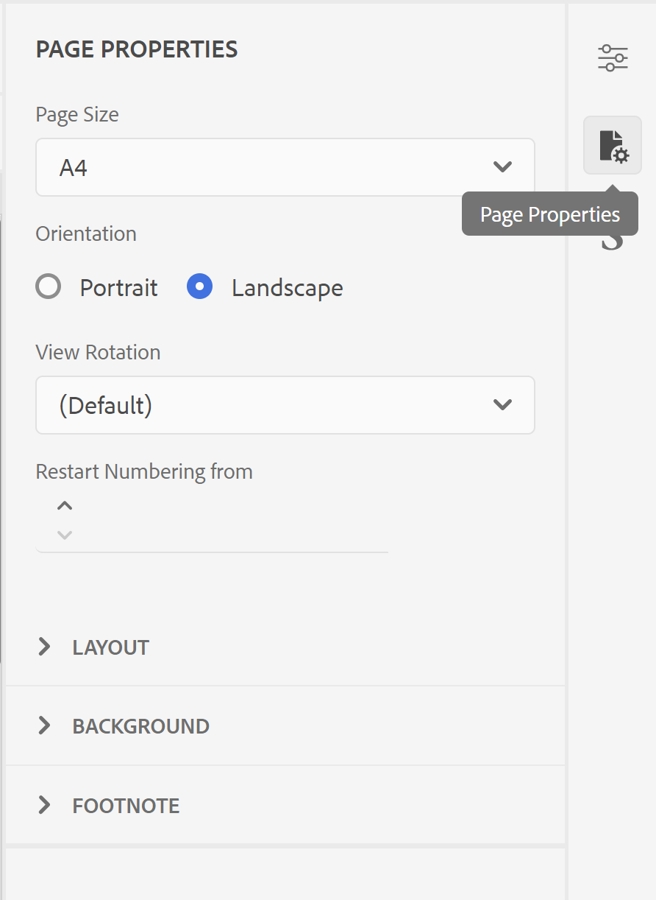
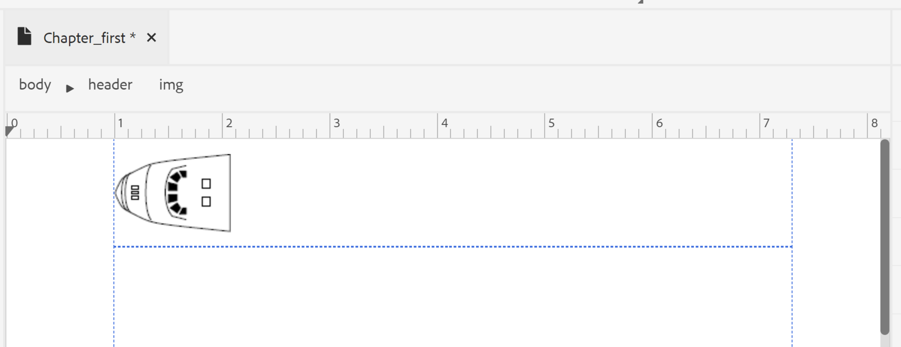
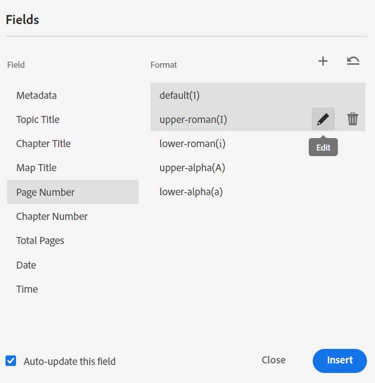
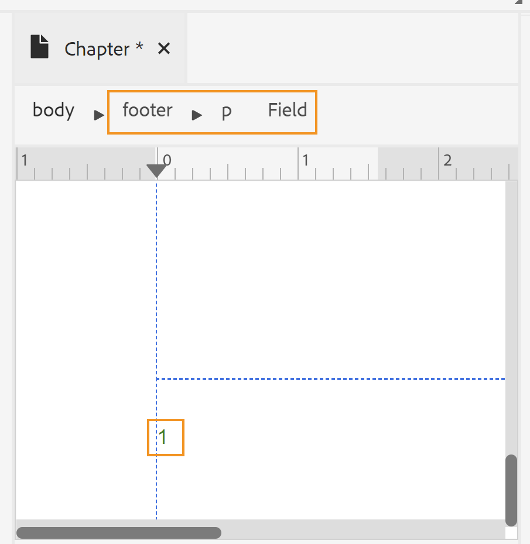
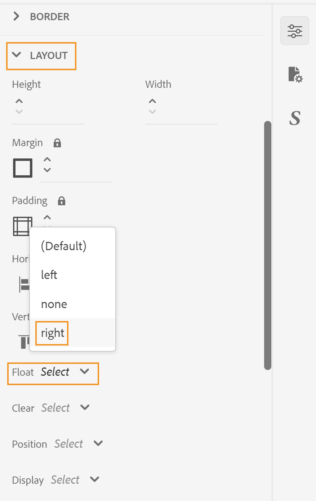

# Entwerfen eines Seiten-Layouts {#design-page-layout}

Beim Erstellen eines PDF-Dokuments hätten Sie verschiedene Abschnitte zur Darstellung verschiedener Arten von Informationen. Ein PDF-Dokument würde beispielsweise von einer Titelseite aus beginnen, die das Logo, den Buchtitel oder die Versionsinformationen Ihres Unternehmens enthält. Dann gibt es Kapitel, Anhänge oder Glossarseiten. Jeder Abschnitt in einem PDF-Dokument sieht anders aus. Dies wird durch Erstellen und Anpassen des Seiten-Layouts erreicht.

Beim Entwerfen des Seiten-Layouts können Sie die verschiedenen Elemente definieren, aus denen eine Seite besteht. Sie können beispielsweise die Seitengröße, die Ränder, die Kopf- und Fußzeile, die Ausrichtung und andere Seitenspezifikationen auf einer Seite definieren. Mit der nativen PDF-Veröffentlichungsfunktion können Sie Ihre Seite gemäß den [Seitenmedienstandards“ &#x200B;](https://www.w3.org/TR/css-page-3/). Die meisten Einstellungen, die unter den Standards für ausgelagerte Medien behandelt werden, können einfach über die Benutzeroberfläche der nativen PDF-Veröffentlichungsfunktion angepasst werden. Für einige andere erweiterte Formatierungen können Sie die Source-Ansicht verwenden, um Ihren eigenen CSS-Code zu schreiben.

Nachdem Sie die Seiten-Layouts entworfen haben, müssen Sie diese Layouts mit den entsprechenden Abschnitten in den PDF-Seitenlayouteinstellungen verknüpfen. Im Abschnitt [Erstellen und Anpassen von Seiten-Layouts](components-pdf-template.md#create-customize-page-layout) finden Sie Einzelheiten zum Erstellen und Öffnen eines Seiten-Layouts zur Anpassung.

## Typen von Seiten-Layouts {#types-of-page-layout}

Ein PDF-Dokument enthält in der Regel die folgenden Abschnitte:

* Titelseite
* Inhaltsverzeichnis
* Aufstieg der Zahlen
* Aufzug von Tabellen
* Kapitel- oder Themenseiten
* Glossar
* Index
* Rückseite

Für diese Abschnitte ist ein entsprechendes Seiten-Layout erforderlich, damit die Informationen in einem bestimmten Format angezeigt werden. Darüber hinaus können Sie auch eine leere Seite verwenden, die als Füller verwendet wird, um ein neues Kapitel von einer ungeraden oder geraden Seite aus zu beginnen. In diesem Fall können Sie entweder das standardmäßige Seiten-Layout verwenden oder ein Seiten-Layout für eine leere Seite erstellen. Weitere [&#x200B; finden Sie unter „Erstellen &#x200B;](components-pdf-template.md#create-page-layout) neuen Seiten-Layouts“.

Mit den Seitenlayouteinstellungen im Abschnitt **Vorlage>Einstellungen** können Sie festlegen, welches Seitenlayout für verschiedene Bereiche Ihrer PDF verwendet werden soll. Jedes Seiten-Layout kann außerdem unterschiedliche Varianten der ersten, rechten oder linken Seite aufweisen.

### Erstellen der ersten, rechten oder linken Seiten-Layout-Varianten {#page-layout-variants}

Verschiedene Seiten-Layouts in Ihrer PDF-Vorlage können weiter angepasst werden, indem verschiedene Layout-Varianten für die erste, rechte oder linke Seite zur Verfügung stehen. Mit dem Seiten-Layout-Designer können Sie diese Seiten unterschiedlich gestalten.

>[!NOTE]
>
>Wenn Sie ein Einzelseiten-Layout für einen Abschnitt in Ihrem Buch haben möchten, müssen Sie die Layouts Erste, Rechte oder Linke Seite nicht erstellen.

Beachten Sie beim Erstellen der Seiten-Layouts die folgenden Punkte:

>[!NOTE]
>
>Die folgenden Punkte haben das Seiten-Layout Kapitel als Beispiel genommen. Diese Punkte gelten jedoch auch für andere Seiten-Layouts.

* Wenn Sie ein Einzelseiten-Layout für alle Seiten innerhalb eines Kapitels verwenden möchten, erstellen Sie nur ein Einzelkapitelseiten-Layout ohne Varianten.

* Wenn Sie ein anderes Erscheinungsbild für die erste Seite für Kapitel in Ihrem Buch haben möchten, müssen Sie eine Layout-Variante für die erste Seite für Ihre Kapitel erstellen.

* Wenn Sie für jede linke und rechte Seite Ihres Buches ein anderes Erscheinungsbild wünschen, müssen Sie die Varianten „Links“ und „Rechts“ für Ihr Kapitelseitenlayout erstellen.

* Wenn Sie möchten, dass Ihre Kapitel mit einer ungeraden oder geraden Seite beginnen, können Sie ein Seiten-Layout für die leere Seite erstellen. Dieses Seiten-Layout wird verwendet, um die Lücke zwischen zwei Kapiteln zu füllen, um sicherzustellen, dass das Kapitel mit der gewünschten ungeraden oder geraden Seite beginnt.

  >[!NOTE]
  >
  >Wenn Sie kein separates leeres Seiten-Layout erstellen, wird das Standard-Seiten-Layout verwendet. Informationen zum Erstellen eines Seiten-Layouts finden Sie unter [Erstellen eines neuen Seiten-Layouts](components-pdf-template.md#create-page-layout).

Das folgende Beispiel führt Sie durch den Prozess der Erstellung von Varianten eines Seiten-Layouts:

1. Erstellen Sie ein Seiten-Layout „Kapitel“ mit den Schritten, die unter „Erstellen eines neuen Seiten-Layouts“ beschrieben sind.

   Ein leeres Seiten-Layout für Kapitel wird erstellt und unter den Seiten-Layouts hinzugefügt.

   Wenn Sie ein Seiten-Layout erstellen, wird es standardmäßig auch zur Bearbeitung geöffnet. Im folgenden Screenshot wird ein leeres (Standard-) Seiten-Layout angezeigt:

   

   Die Kopf- und Fußzeile sowie der Inhaltsbereich in einer Vorlage werden standardmäßig erstellt. Sie können diese Bereiche einfach anpassen, indem Sie die Seiteneigenschaften, Inhaltseigenschaften und verschiedene Tools (z. B. Bilder einfügen, Felder usw.) in der Benutzeroberfläche verwenden.

   >[!NOTE]
   >
   >Für die erweiterte Konfiguration können Sie die Source-Ansicht verwenden und Ihren benutzerdefinierten HTML- und CSS-Code hinzufügen.

1. Bewegen Sie den Mauszeiger über das **Kapitel**-Layout und klicken Sie auf **Optionen**, um das Kontextmenü anzuzeigen.

1. Klicken oder bewegen Sie den Mauszeiger über **Layout-Variante hinzufügen** und wählen Sie das gewünschte Seitenlayout (Erste, Linke oder Rechte) aus, das Sie erstellen möchten.

Das ausgewählte Seiten-Layout wird mithilfe einer Kopie des Basiskapitel-Layouts erstellt. Das bedeutet, dass, wenn Sie Änderungen am standardmäßigen Kapitelseitenlayout vorgenommen haben, dieselben Änderungen zum Zeitpunkt der Erstellung des Seiten-Layouts im Variantenseiten-Layout repliziert werden.

## Arbeiten mit den Seiteneigenschaften eines Seiten-Layouts {#page-props-page-layout}

Beim Entwerfen eines Seiten-Layouts ist es wichtig, die Kontrolle über verschiedene Seiteneigenschaften zu haben. Die native PDF-Veröffentlichungsfunktion kapselt alle wichtigen Seiteneigenschaften im Bedienfeld Seiteneigenschaften . Das Bedienfeld Seiteneigenschaften bietet Zugriff auf verschiedene Eigenschaften in den folgenden Abschnitten:

>[!NOTE]
>
>Das Bedienfeld „Seiteneigenschaften“ kapselt die Eigenschaften und folgt den Regeln, die unter [Seitenmedienstandards“ definiert &#x200B;](https://www.w3.org/TR/css-page-3/).

* **Seitengröße** : Geben Sie die Seitengröße an, die Sie für das Seiten-Layout verwenden möchten. In der Dropdown-Liste Seitengröße können Sie aus über 15 Seitengrößen wählen. Sie können ein Seiten-Layout auch mit einer benutzerdefinierten Seitengröße erstellen. Weitere Informationen finden [&#x200B; unter „Festlegen der &#x200B;](#set-page-size)&quot;.

* **Ausrichtung** : Geben Sie die Seitenausrichtung an, die für das Seiten-Layout verwendet werden soll. Sie können zwischen Hochformat- oder Querformat-Seitenausrichtungen wählen. Beachten Sie, dass Sie verschiedene Ausrichtungen auf verschiedene Seitenvarianten in einem Seiten-Layout anwenden können. Wenn Ihr Inhalt beispielsweise eine breite Tabelle oder ein großes Bild enthält, können Sie ein Querformat-Seiten-Layout erstellen und dieses Layout auf die breitere Tabelle oder das Bild anwenden.

* **Drehung anzeigen** : Geben Sie die Seite oder Richtung an, in der die ursprüngliche Oberseite nach der Drehung dargestellt wird. Sie können zwischen 90° im Uhrzeigersinn, 90° gegen den Uhrzeigersinn oder 180° gegen den Uhrzeigersinn wählen. Dies ist besonders nützlich, wenn Sie für die Ausgabe eine Kombination aus Hoch- und Querformat verwenden möchten. Sie können beispielsweise „Hochformat“ als generisches Seiten-Layout verwenden und ein Querformat-Seiten-Layout für das Rendern breiter Tabellen festlegen. In diesem Fall können Sie festlegen, dass der Tabelleninhalt im Uhrzeigersinn um 90 Grad angezeigt wird. Auf diese Weise wird die Seite im Querformat ausgerichtet und der Inhalt wird um 90 Grad gedreht, um die Kontinuität im Blick zu erhalten. Wie dies erreicht wird, sehen wir als Beispiel weiter unten in diesem Abschnitt.

* **Seitennummerierung** : Die Seitennummerierung ist in einer PDF standardmäßig fortlaufend. Beispielsweise könnte ein PDF mit 100 Seiten fortlaufende Seitenzahlen von 1 bis 100 aufweisen. Sie können für die Nummerierung auch die Nummerierung einer bestimmten Zahl in allen Abschnitten oder das erste Vorkommen eines Abschnitts neu starten.
   * **Neu starten von** : Geben Sie die Seitennummer an, von der aus die Nummerierung für dieses Seiten-Layout beginnen soll. Sie können beispielsweise für jedes Kapitel die Seitenzahl festlegen, die neu gestartet werden soll. In diesem Fall müssen Sie die Eigenschaft Neustart von auf 1 für die Layout-Variante Erste Seite des Kapitelseiten-Layouts einstellen. Standardmäßig wird die Seitennummerierung von der vorherigen Seite fortgesetzt.

   * **Nur auf das erste Vorkommen anwenden**: Sie können auch beim ersten Vorkommen eines Abschnitts nur mit einer bestimmten Zahl beginnen. Sie können beispielsweise nur das erste Kapitel mit 1 beginnen und die Seitenzahlen für andere Kapitel fortsetzen.

* **Layout** : Geben Sie die Seitenränder zusammen mit dem Abstand für die obere, untere, linke und rechte Seite an. In der folgenden Abbildung wird erläutert, wie Ränder, Abstände und Rahmen um den Inhalt gerendert werden. Beachten Sie, dass der Rand oben und unten auf einer Seite die Kopf- und Fußzeile enthält.

  

* **Hintergrund** : Fügen Sie ein Bild oder eine Farbe als Hintergrund Ihres Seiten-Layouts ein. Für ein Bild können Sie die Höhe und Breite des Bildes zusammen mit den Wiederholungs- und Positionseigenschaften angeben.

* **Fußnote** : Geben Sie die Eigenschaften an, in denen Fußnoten in der Ausgabe angezeigt werden sollen. Sie können die Ränder- und Abstandseigenschaften zusammen mit einem Rahmenstil angeben.

### Festlegen der Seitengröße {#set-page-size}

Das allererste, was Sie in einem Seiten-Layout definieren müssen, ist die Seitengröße. In den Seiteneigenschaften gibt es mehr als 15 Seitengrößen, die Sie für ein Seitenlayout auswählen können. Sie können auch eine benutzerdefinierte Seitengröße erstellen, indem Sie die folgenden Schritte ausführen:

1. Öffnen Sie das gewünschte Seiten-Layout zur Bearbeitung.

   >[!NOTE]
   >
   >Siehe [Anpassen eines Seiten-Layouts](components-pdf-template.md#customize-page-layout) Abschnitt zum Öffnen eines Seiten-Layouts zur Anpassung oder Bearbeitung.

1. Klicken Sie im rechten Bedienfeld auf **Seiteneigenschaften**.
1. Wählen Sie in **Dropdown** Liste „Seitengröße“ die Option **Benutzerdefiniert**.

   Die Felder Seitenbreite und Seitenhöhe werden angezeigt.

1. Geben Sie die gewünschten Seitenabmessungen in die Felder **Seitenbreite** und **Seitenhöhe** ein.

   >[!NOTE]
   >
   >Einige der am häufigsten verwendeten Einheiten sind px (Pixel), pt (Punkte), rem, em, % (Prozentsatz) und in (Zoll).

### Seitenausrichtung und Ansichtsrotation verwenden {#page-orientation-rotation}

Sehen wir uns ein Beispiel an, bei dem eine Kombination aus Hoch- und Querformat, Seitenausrichtung und Ansichtsdrehungseigenschaften verwendet wird. In diesem Beispiel erstellen wir eine PDF mit standardmäßiger Hochformat-Ausrichtung, aber eine Tabelle wird in Querformat mit Inhalten in der 90-Grad-Ansicht im Uhrzeigersinn gerendert. Die endgültige Ausgabe sieht in etwa so aus:


In der obigen Ausgabe werden die Informationen der Kontaktliste im Querformat angezeigt, wobei der Inhalt ebenfalls um 90 Grad gedreht ist. Der restliche Inhalt wird im normalen Hochformat angezeigt.

Um diese Art von Ausgabe zu erreichen, müssen wir die folgenden Hauptaufgaben ausführen:

1. Erstellen Sie ein Seiten-Layout mit Querformat.

1. Ändern Sie die **Ansicht Drehung**-Eigenschaft, um Inhalte in 90° zu rendern.

1. Erstellen Sie einen benutzerdefinierten Stil, um das neue Seiten-Layout zu verwenden.

1. Fügen Sie den Stil in der OutputClass-Definition der Tabelle hinzu, die wir im Querformat-Seiten-Layout rendern möchten.

Führen Sie die folgenden Schritte aus, um die oben genannten Aufgaben durchzuführen:

1. Erstellen Sie ein Seiten-Layout mit Querformat.
   1. Erstellen Sie ein Seiten-Layout „Querformat“ mit den Schritten, die unter „Erstellen eines neuen Seiten-Layouts“ beschrieben sind.

   1. Klicken Sie im rechten Bedienfeld auf **Seiteneigenschaften**.

      
   1. Ändern Sie **Ausrichtung** in **Querformat**.

1. Ändern Sie die Eigenschaft „Ansicht-Drehung“, um den Inhalt im 90.

   1. Wählen Sie **im Uhrzeigersinn 90°** aus der Dropdown-Liste Drehung anzeigen .

   

   1. Klicken Sie auf **Alle speichern**, um die aktualisierten Seitenlayouteigenschaften zu speichern.

1. Erstellen Sie einen benutzerdefinierten Stil, um das neue Seiten-Layout zu verwenden.
   1. Erweitern Sie die linke Seitenleiste und doppelklicken Sie auf die Vorlage, in der Sie den Stil erstellen möchten.

   1. Erweitern Sie den Abschnitt Stylesheets .

   1. Bewegen Sie den Mauszeiger über das Layout-Stylesheet, klicken Sie auf (_Options_-Symbol) und wählen Sie Bearbeiten aus.

      Die Layout-Formatvorlage wird zur Bearbeitung geöffnet.

   1. Klicken Sie mit der rechten Maustaste auf **Andere Stile** und wählen Sie **Neuer Stil**.

      

   1. Geben Sie im Popup „Stil hinzufügen **im** &quot;**&quot;**.

      

   1. Klicken Sie auf **Fertig**.

      Ein neuer Stil mit dem Namen `.landscape-style` wird erstellt und am Ende der Liste Andere Stile hinzugefügt.

   1. Doppelklicken Sie auf den `.landscape-style`, um ihn zur Bearbeitung zu öffnen.

   1. Erweitern Sie die Eigenschaft **Paginierung** .

   1. Geben Sie `Landscape` in die Eigenschaft **Seitenlayout** ein.

      

   1. Klicken Sie **Alle speichern** um die aktualisierten Stileigenschaften zu speichern.

1. Fügen Sie den Stil in der `outputclass` der Tabelle hinzu, die wir im Querformat-Seiten-Layout rendern möchten.
   1. Öffnen Sie in einem DITA-Datei-Editor die Datei, auf die Sie das neue Seiten-Layout anwenden möchten.

   1. Suchen Sie das `<table>` Element, das im Querformat gerendert werden soll.

   1. Klicken Sie im Breadcrumb auf das Tabellenelement, um die Tabelle auszuwählen.

      

   1. Klicken Sie im rechten Bedienfeld auf und öffnen Sie das Bedienfeld Inhaltseigenschaften .

   1. Fügen Sie im Bedienfeld Inhaltseigenschaften eine neue Eigenschaft **OutputClass** mit **Querformat** als Eigenschaftswert hinzu.

      

1. Klicken Sie **Alle speichern** um die aktualisierte Datei zu speichern.
1. Generieren Sie die PDF-Ausgabe.

Im endgültigen PDF wird der Tabelleninhalt im Querformat gerendert, wie am Anfang des Beispiels gezeigt.

### Hinzufügen eines Hintergrundbilds {#add-bg-image}

Je nach Ihren Anforderungen können Sie ein Hintergrundbild hinzufügen, das auf jeder ersten Seite einer Kapitelausgabe (PDF) angezeigt wird. Mit den Hintergrundeigenschaften unter den Seiteneigenschaften können Sie ganz einfach ein Hintergrundbild hinzufügen. Sie können dieses Bild auf einer Seite replizieren und es an einer beliebigen Stelle im oberen, unteren oder mittleren Bereich der Seite positionieren.

Um beispielsweise ein Hintergrundbild in den mittleren Bereich Ihres Inhaltsbereichs einzufügen, führen Sie die folgenden Schritte aus:

1. Öffnen Sie das gewünschte Seiten-Layout zur Bearbeitung.

   >[!NOTE]
   >
   >Siehe [Anpassen eines Seiten-Layouts](components-pdf-template.md#customize-page-layout) Abschnitt zum Öffnen eines Seiten-Layouts zur Anpassung oder Bearbeitung.

1. Klicken Sie auf eine beliebige Stelle im Inhaltsbereich.

1. Klicken Sie im rechten Bedienfeld auf **Seiteneigenschaften**.

1. Erweitern Sie den Abschnitt **Hintergrund**.

1. Klicken Sie auf die Schaltfläche „Durchsuchen **im Feld &quot;**&quot;.

1. Navigieren Sie zu und wählen Sie das Bild aus, das Sie als Hintergrundbild verwenden möchten.

   Das Bild wird eingefügt und repliziert, um die gesamte Seite abzudecken.

1. Ändern Sie die Bildgröße, indem Sie die Höhen- und Breiteneigenschaften anpassen.

   >[!NOTE]
   >
   >Sie können eine der Höhen- oder Breiteneigenschaften eingeben, da das Bild automatisch skaliert wird, um das Seitenverhältnis beizubehalten.

1. Legen Sie die anderen Eigenschaften fest, um festzulegen, wie das Hintergrundbild angezeigt werden soll.

   * **Hintergrundwiederholung** : Geben Sie an, ob der Hintergrund wiederholt werden soll oder nicht.

   * **Hintergrundposition** : Geben Sie eine Position für das Hintergrundbild auf Ihrer Seite an.

Im folgenden Screenshot wird das Hintergrundbild angezeigt, wobei die Background Repeat-Eigenschaft auf _no-repeat_ und die Background Position-Eigenschaft auf _center_ gesetzt ist.


## Arbeiten mit Kopf- und Fußzeile einer Seite {#work-header-footer}

Wenn Sie Informationen in eine Kopf- oder Fußzeile in ein Seiten-Layout einfügen, werden diese Informationen auf allen Seiten, die dieses Seiten-Layout verwenden, wiederholt. Normalerweise wird der Kopfzeilenbereich für den Kapitel- oder Thementitel und der Fußzeilenbereich für die Anzeige der Seitenzahlen verwendet.

Beim Erstellen eines neuen Seiten-Layouts wird standardmäßig der Kopf- und Fußzeilenbereich erstellt. Im Kopf- und Fußzeilenbereich eines Seiten-Layouts können Sie viele Anpassungen vornehmen. Sie können beispielsweise ein Bild (wie ein Logo), Variablen (die dynamische Informationen enthalten) oder statische Inhalte einfügen.

### Ändern der Kopf- und Fußzeilenränder und -zeilen {#header-footer-margins}

Standardmäßig sind die Kopf- und Fußzeilenränder auf 1 Zoll festgelegt. Sie können diesen Standardwert ändern, indem Sie die Einstellung „Rand“ im Bedienfeld „Seiteneigenschaften“ ändern. Führen Sie die folgenden Schritte aus, um die Kopf- und Fußzeilengröße zu ändern:

1. Öffnen Sie das gewünschte Seiten-Layout zur Bearbeitung.

   >[!NOTE]
   >
   >Siehe [Anpassen eines Seiten-Layouts](components-pdf-template.md#customize-page-layout) Abschnitt zum Öffnen eines Seiten-Layouts zur Anpassung oder Bearbeitung.

1. Klicken Sie im rechten Bedienfeld auf **Seiteneigenschaften**.
1. Erweitern Sie den Abschnitt **Layout** .
1. Klicken Sie auf das Schlosssymbol neben der Eigenschaft **Spanne**.
1. Um die Kopfzeilengröße zu ändern, geben Sie den gewünschten Wert in das Feld Oberer Rand ein.

   >[!NOTE]
   >
   >Einige der am häufigsten verwendeten Einheiten sind px (Pixel), pt (Punkte), rem, em, % (Prozentsatz) und in (Zoll).

1. Geben Sie zum Ändern der Fußzeilengröße den gewünschten Wert in das Feld Unterer Rand ein.

Sie können den Kopf- und Fußzeilenbereich so gestalten, dass er mehrere Zeilen enthält. Fügen Sie dazu einen \&lt;p\>-Tag mit dem Befehl HTML-Elemente einfügen () im Kopf- oder Fußzeilenbereich.

| _Entwicklerecke_:  |
|---|

Wenn Sie direkt mit dem CSS- und HTML-Code arbeiten möchten, können Sie die Randwerte ändern, wie im folgenden Codefragment gezeigt:

```css
…

<meta name="page-style" content="size:A4 portrait;margin-top:3cm;margin-right:30pt;margin-bottom:1in;margin-left:90px;" />

…
```

>[!NOTE]
>
>Im obigen Beispiel werden verschiedene Einheiten verwendet, um die Randwerte anzugeben.

### Kopf- und Fußzeile entfernen {#remove-header-footer}

Die Kopf- und Fußzeilenüberlagerung am oberen und unteren Rand. Technisch gesehen bedeutet dies, dass Sie, wenn Sie eine Kopf- und Fußzeile in Ihrem Seiten-Layout haben möchten, den erforderlichen Platz am oberen und unteren Rand reservieren müssen.

Wenn Sie nicht möchten, dass ein Seitenlayout eine Kopf- und Fußzeile hat, gibt es zwei Möglichkeiten, dies zu erreichen:

* Wenn Sie die oberen und unteren Ränder beibehalten möchten, lassen Sie den Kopf- und Fußzeilenbereich leer.
* Wenn Sie die oberen und unteren Ränder nicht beibehalten möchten (wie bei der Gestaltung der Vorder- und Rückseite eines Magazins), können Sie die Ränder entfernen, indem Sie die Eigenschaften für die oberen und unteren Ränder auf 0 setzen. Dadurch bleibt kein Platz für Kopf- und Fußzeile.

### Hinzufügen eines Bildes oder Logos in der Kopfzeile {#add-image-header}

Je nach Ihren Anforderungen können Sie ein Bild hinzufügen, das im Kopfzeilenbereich (oder in einem anderen Teil) des Seiten-Layouts angezeigt wird. Es gibt zwei Möglichkeiten, ein Bild in Ihrem Seiten-Layout hinzuzufügen:

* Verwenden Sie ein Bild aus der Vorlage „Ressourcen“.
* Verwenden Sie das Tool \&lt;Bild hinzufügen\> im Seitenlayout-Editor.

>[!NOTE]
>
>Es wird empfohlen, den Ordner Ressourcen zu verwenden, um alle Vorlagen-Assets wie Bilder oder Schriftarten zu verwalten.

Um ein Bild wie das Logo Ihres Unternehmens in den Kopfzeilenbereich einzufügen, führen Sie die folgenden Schritte aus:

1. Öffnen Sie das gewünschte Seiten-Layout zur Bearbeitung.

>[!NOTE]
>
>Siehe [Anpassen eines Seiten-Layouts](components-pdf-template.md#customize-page-layout) Abschnitt zum Öffnen eines Seiten-Layouts zur Anpassung oder Bearbeitung.

1. Klicken Sie auf die Kopfzeile Bearbeiten (), um den Cursor in den Kopfzeilenbereich zu bewegen.

   Oder klicken Sie in den Kopfzeilenbereich.

1. Um ein Bild hinzuzufügen, wählen Sie eine der folgenden Methoden:
1. Klicken Sie auf **Bild einfügen** () in der Symbolleiste; klicken Sie im Popup **Pfad auswählen** zur Bildposition, und klicken Sie auf **Auswählen**, um es in den Kopfzeilenbereich einzufügen.
1. Ziehen Sie ein Bild aus dem Ordner Ressourcen in den Kopfzeilenbereich.

Der folgende Screenshot zeigt ein Beispielbild, das im Kopfzeilenbereich hinzugefügt wurde.



Nachdem ein Bild eingefügt wurde, können Sie seine Attribute ändern, um ihm das gewünschte Erscheinungsbild zu verleihen. Am einfachsten können Sie das Aussehen eines Bildes oder eines anderen Elements im Seiten-Layout ändern, indem Sie das Bedienfeld Inhaltseigenschaften verwenden. Siehe [Arbeiten mit dem Bedienfeld &quot;](#work-with-content-props)&quot; für die verschiedenen Eigenschaften, die über die Benutzeroberfläche zum Anpassen verfügbar sind.

### Hinzufügen von Feldern und Metadaten {#add-fields-metadata}

Felder sind sehr nützlich, wenn Sie vordefinierte Informationen einfügen möchten. Sie können beispielsweise ein Feld Kapiteltitel in den Kopfzeilenbereich Ihres Kapitels einfügen, das bei der Veröffentlichung durch den tatsächlichen Kapiteltitel ersetzt wird.

Es gibt die folgenden Kategorien für Felder, die Sie in Ihr Seiten-Layout einfügen können:

* Metadaten
* Thementitel
* Kapiteltitel
* Titel der Zuordnung
* Seitennummer
* Kapitelnummer
* Seiten insgesamt
* Datum
* Zeit


Jede dieser Feldkategorien enthält verschiedene Varianten, in die die Feldinformationen eingefügt werden können. Ein Datumsfeld kann beispielsweise unterschiedliche Varianten wie `YYYY-MM-DD`, `MM/DD/YY`, `MM/DD/YYYY` usw. aufweisen. Ebenso kann die Seitenzahl Varianten in Form von römischen, dezimalen oder sogar gebietsschemaspezifischen Formaten wie _Arabisch_, _Devanagari_, _Hebräisch_ und mehr aufweisen.


Zusätzlich zu den vordefinierten Feldern können Sie auch Metadateninformationen als Variablen oder Felder in Ihrem Seiten-Layout hinzufügen. Diese Metadaten können in Ihren Quell-DITA-**(**) oder **Themeninhalt** gespeichert oder aus den DITA-**Dateieigenschaften**, **Themendateieigenschaften** werden.

Sie können die Metadaten aus den folgenden Optionen auswählen:

* **Inhalt zuordnen** umfasst die Metadaten, die Sie im `<topicmeta>` der DITA-Zuordnung definiert haben.
* **Dateieigenschaften zuordnen** enthält die Metadaten, auf die Sie über die Seite &quot;**&quot;** DITA-Zuordnung zugreifen können.
* **Themeninhalt** umfasst Metadaten, die im `<prolog>` eines DITA-Themas definiert sind, z. B. Copyright, Autor und andere Details. Um einzelne `<prolog>` abzurufen, können Sie einfache XPath-Ausdrücke verwenden (z. B. //author für den Autorennamen). Fügen Sie für Attributmetadaten das `@` im XPath ein (z. B. //critdates/revidiert/@modified für das geänderte Datum).
* **Themendateieigenschaften** enthält die Metadaten, auf die Sie über die Seite **Eigenschaften** eines Themas zugreifen können.


Sie können Metadaten aus **Dateieigenschaften zuordnen** und **Themendateieigenschaften** in einem einzigen Dokument kombinieren. Sie können beispielsweise eine PDF mit dem Zuordnungstitel auf der Titelseite und dem Thementitel in der Kopfzeile anderer Seiten veröffentlichen. Dazu können Sie die Metadaten des Zuordnungstitels aus den **Zuordnungsdateieigenschaften** zum Titelseitenlayout hinzufügen. Fügen Sie dann die Metadaten für den Thementitel aus den **Themendateieigenschaften** zur Kopfzeile „Kapitel und Themen“ hinzu.

Wenn ein Thema auf einer Seite endet, während das andere auf derselben Seite beginnt, werden die Metadaten des ersten Themas ausgewählt. Sie können auch benutzerdefinierte Eigenschaften hinzufügen und sie dann als Felder in das Seiten-Layout einfügen.


>[!NOTE]
>
> Die Metadatenfelder werden entsprechend Ihrer Auswahl von Asset oder Zuordnung im Dropdown-Menü **Von** angezeigt.


<!--For more information, see [Add fields and metadata](design-page-layout.md#add-fields-and-metadata).-->

Im folgenden Beispiel fügen wir eine Seitennummer und einen Kapiteltitel in den Fußzeilenbereich eines Seiten-Layouts ein.

1. Öffnen Sie das gewünschte Seiten-Layout zur Bearbeitung.

   >[!NOTE]
   >
   >Siehe [Anpassen eines Seiten-Layouts](components-pdf-template.md#customize-page-layout) Abschnitt zum Öffnen eines Seiten-Layouts zur Anpassung oder Bearbeitung.

1. Klicken Sie auf **Fußzeile bearbeiten** (), um den Cursor in den Fußzeilenbereich zu bewegen.

   Oder klicken Sie in den Fußzeilenbereich.

1. Fügen Sie ein Absatzelement ein, indem Sie auf die Schaltfläche **HTML-Elemente einfügen** () und wählen Sie Absatz aus der Liste der Elemente aus.

1. Klicken Sie auf das **Felder einfügen** ().

   Das Popup-Fenster Felder wird angezeigt.

1. Wählen Sie die Kategorie **Seitenzahl** aus der Liste „Feld“ und das **default(1)** Seitenzahlformat aus der Liste Format aus und klicken Sie auf **Einfügen**.

   

   >[!NOTE]
   >
   >Sie können mit Ausnahme des Standardformats auch das Format aller Felder bearbeiten. Klicken Sie dazu auf das Symbol Bearbeiten neben dem Format, das Sie bearbeiten möchten, nehmen Sie Änderungen vor und klicken Sie auf OK. Weitere Informationen finden Sie unter [Hinzufügen von Feldern und Metadaten](#add-fields-metadata).

   Das Feld „Standardseitennummer“ wird in den Fußzeilenbereich des Seiten-Layouts eingefügt.

   

   Der obere Breadcrumb listet die Elemente auf, in denen die Informationen gespeichert werden.

1. Geben Sie nach dem Feld Seitenzahl ein Leerzeichen ein und klicken Sie auf das Symbol **Felder einfügen**.

1. Wählen Sie die Kategorie **Kapiteltitel** aus der Liste Feld und das Format **Kapiteltitel** aus der Liste Format aus und klicken Sie auf **Einfügen**.

   Das Feld _Kapiteltitel_ in dem der Kapiteltitel zum Zeitpunkt der Veröffentlichung eingefügt wird, wird in den Fußzeilenbereich eingefügt. Zu diesem Zeitpunkt sind die Felder Seitennummer und Kapiteltitel durch ein Leerzeichen getrennt.

   

1. Führen Sie die folgenden Schritte aus, um den Kapiteltitel rechtsbündig auszurichten:

   1. Klicken Sie auf das Feld Feld Feld auf dem Breadcrumb, um das Feld Kapiteltitel auszuwählen.

   1. Klicken Sie im rechten Bedienfeld auf **Inhaltseigenschaften** ()-Symbol.

   1. Erweitern Sie den Abschnitt **Layout**-Eigenschaften und legen Sie den **Float**-Eigenschaftswert auf **right** fest.

      

      Das Feld Kapiteltitel ist auf der rechten Seite der Fußzeile ausgerichtet.
      


| _Entwicklerecke_:  |
|---|

Wenn Sie direkt mit dem CSS- und HTML-Code arbeiten möchten, können Sie dies auch erreichen, indem Sie die Source-Ansicht des Seitenlayouts aufrufen und Änderungen am Code vornehmen. Im folgenden Code-Snippet wird dieselbe Fußzeileneinstellung angezeigt, die durch den Code vorgenommen wurde:

```css
…
<p>

<span data-field="page-number" data-format="default">1</span>

<span data-field="chapter-title" data-format="default" style="float: right">Chapter Title</span>

</p>
…
```

## Arbeiten mit einem Inhaltsbereich {#content-area}

Der Inhaltsbereich ist der größte Bereich in Bezug auf den Inhaltsbereich. Der Inhaltsbereich wird mit dem Inhalt Ihres Themas gefüllt. In bestimmten Fällen können Sie im Inhaltsbereich Textbausteininhalte hinzufügen. Dieser Inhalt wird an der angegebenen Position im Seiten-Layout veröffentlicht. Beispielsweise kann die Überschrift im Inhaltsverzeichnis, Glossar und Index als Textbausteininhalt hinzugefügt werden, der unverändert in der endgültigen Ausgabe veröffentlicht wird. Ein weiteres Beispiel ist das Kapitel-Inhaltsverzeichnis, das normalerweise auf der ersten Seite jedes Kapitels hinzugefügt wird.

Eine der am häufigsten verwendeten Anpassungen im Inhaltsbereich ist das mehrspaltige Layout. Mit dem leistungsstarken Seiten-Layout-Designer können Sie bestimmte Seiten anpassen, die in mehreren Spalten gerendert werden sollen, während der Inhalt auf anderen Seiten in einer einzigen Spalte beibehalten wird.

In den folgenden Abschnitten werden verschiedene Szenarien zum Anpassen des Inhaltsbereichs behandelt.

### Kapitel-Inhaltsverzeichnis hinzufügen {#add-chapter-toc}

Ein Kapitel Inhaltsverzeichnis dient als schnelle Referenz für die Leser zu wissen, was im Kapitel ist. Normalerweise wird ein Kapitel-Inhaltsverzeichnis ganz am Anfang eines Kapitels hinzugefügt. Wenn Sie also ein Kapitel-Inhaltsverzeichnis verwenden möchten, können Sie es im Inhaltsbereich des Hauptkapitelseiten-Layouts oder der ersten Seiten-Layout-Variante eines Kapitels hinzufügen.

Im folgenden Beispiel fügen wir ein Kapitelverzeichnis in das erste Seitenlayout eines Kapitels ein:

>[!NOTE]
>
>Bei diesem Verfahren wird davon ausgegangen, dass Sie die erste Seitenvariante für ein Kapitelseiten-Layout erstellt haben. Anweisungen zum Erstellen einer Seitenvariante finden Sie unter [Erstellen der ersten, rechten oder linken Seiten-Layout-Varianten](#page-layout-variants).

1. Öffnen Sie das gewünschte Seiten-Layout zur Bearbeitung.

   >[!NOTE]
   >
   >Siehe [Anpassen eines Seiten-Layouts](components-pdf-template.md#customize-a-page-layout) Abschnitt zum Öffnen eines Seiten-Layouts zur Anpassung oder Bearbeitung.

1. Platzieren Sie den Cursor im Inhaltsbereich des Seiten-Layouts.

1. Klicken Sie auf das Kapitel Inhaltsverzeichnis ()-Symbol.

   Das Standardkapitel-Inhaltsverzeichnis wird in den Inhaltsbereich eingefügt.

   

   >[!NOTE]
   >
   >Das Standardkapitel-Inhaltsverzeichnis enthält die Überschriften 1 bis 4. Hier ist Überschrift 1 der Kapiteltitel selbst. Daher empfiehlt es sich möglicherweise, den Kapiteltitel nicht erneut im Inhaltsverzeichnis zu haben, oder Sie möchten die Ebene der Überschriften, die Sie im Inhaltsverzeichnis haben möchten, erhöhen. Sie können das Inhaltsverzeichnis anpassen, indem Sie die Eigenschaften ändern.

1. Öffnen Sie das Bedienfeld Inhaltseigenschaften , um die Überschriftenebenen des Inhaltsverzeichnisses anzupassen.

   Wenn Sie beispielsweise mit Überschrift 2 beginnen möchten, ändern Sie die erste Dropdown-Liste so, dass sie mit 2 beginnt.

   

   Wenn Sie Überschriften bis Ebene 5 haben möchten, ändern Sie die zweite Dropdown-Liste in 5. Das aktualisierte Inhaltsverzeichnis sieht wie folgt aus:

   

   >[!NOTE]
   >
   >Auf der endgültigen veröffentlichten PDF werden nur die Inhaltsverzeichniseinträge angezeigt, die auf dem Inhalt der Kapitel basieren. Wenn Sie in einem Kapitel keine Überschriften der Stufe 5 haben, wird dies in der endgültigen Ausgabe nicht angezeigt.

Das Erscheinungsbild des standardmäßigen Inhaltsverzeichnisses kann mithilfe der Stylesheets angepasst werden. Der Stil, der mit `chaptoc-level-#` beginnt (z. B. `chaptoc-level-1`, `chaptoc-level-2` usw.), wird verwendet, um die Stile für das Kapitel-Inhaltsverzeichnis anzupassen<!--For more details on the stylesheet elements used in the TOC and how to customize them, see _Customize default chapter TOC_-->.

>[!IMPORTANT]
>
>Wenn Sie derzeit Stilaktualisierungen in einem Stylesheet vornehmen, wird dies möglicherweise nicht in der Inhaltsvorschau angezeigt. Die Ausgabe wird jedoch mit den aktualisierten Stilen gerendert.

### Arbeiten mit einem mehrspaltigen Seiten-Layout {#multi-column-layout}

Mehrspaltige Seiten-Layouts sind sehr häufig bei der Veröffentlichung von Zeitschriften oder Indizes in einem Buch. Mit der nativen PDF-Veröffentlichungsfunktion können Sie Ihr Dokument einfach in mehrere Spalten aufteilen. Bei Verwendung verschiedener Seiten-Layouts können Sie festlegen, dass nur ein bestimmter Abschnitt in mehrere Spalten unterteilt bleibt, während die anderen Abschnitte in einem einzigen Spalten-Layout (oder normalen Layout) beibehalten werden.

Um ein Seiten-Layout mit mehreren Spalten zu erstellen, führen Sie die folgenden Schritte aus:

1. Öffnen Sie das gewünschte Seiten-Layout zur Bearbeitung.

   >[!NOTE]
   >
   >Siehe [Anpassen eines Seiten-Layouts](components-pdf-template.md#customize-a-page-layout) Abschnitt zum Öffnen eines Seiten-Layouts zur Anpassung oder Bearbeitung.

1. Da das mehrspaltige Layout auf den Inhalt angewendet wird, mit Ausnahme des Kopf- und Fußzeilenbereichs, müssen Sie das Inhaltselement im Breadcrumb auswählen.

   Nachdem Sie den Inhalts-Breadcrumb ausgewählt haben, werden im Bedienfeld Inhaltseigenschaften die Eigenschaften für mehrere Spalten angezeigt.

   

1. Verwenden Sie die Eigenschaften für mehrere Spalten, um das mehrspaltige Seiten-Layout anzupassen:

   * **Spaltenanzahl:** Sie die Anzahl der Spalten an, durch die die Seite geteilt werden soll. Verwenden Sie die Symbole Nach oben und Nach unten oder geben Sie eine Zahl ein, um die Anzahl der Spalten festzulegen.

   * **Spaltenbreite:** Sie die Breite einer Spalte in einem mehrspaltigen Layout an. Standardmäßig wird die Größe in Pixel (px) festgelegt. Sie können sie auch in pt, rem, em, % oder in Einheiten angeben.

     >[!NOTE]
     >
     >Wenn Sie keine Größe angeben, werden die Spalten gleichmäßig geteilt, damit sie in die angegebene Seite passen. In den meisten Fällen müssen Sie diesen Wert nicht angeben.

   * **Spaltenabstand** : Geben Sie den Abstand zwischen den einzelnen Spalten an.

   * **Spaltenbereich** : Wenn Sie möchten, dass sich ein Element im Seiten-Layout über mehrere Spalten erstreckt, müssen Sie diese Eigenschaft verwenden. Dies wird erreicht, indem der Stil des gewünschten Elements mithilfe der Stylesheets geändert wird. <!--for more information see _Section explaining style customization_-->.

   Wenn Sie möchten, dass in Ihrem Seiten-Layout ein bestimmter Text auf der ersten Seite aller Kapitelseiten-Layouts angezeigt wird, können Sie ihn zur ersten Seitenvariante des Kapitelseiten-Layouts hinzufügen.

   Wie im folgenden Beispiel gezeigt, wird die Eigenschaft „Spalte spannen“ für den Überschriftentext auf „Alle“ festgelegt. Dadurch wird sichergestellt, dass sich die Überschrift über Spalten erstreckt, auch wenn das Dokument mehrspaltig ist.

   

   >[!IMPORTANT]
   >
   >Sie können die Span Column-Eigenschaft mithilfe des OutputClass-Attributs auf jedes beliebige DITA-Element anwenden.

   * **Spaltenfüllung** : Geben Sie an, wie Inhalte Spalten füllen sollen. Standardmäßig ist dies auf Balance festgelegt, wodurch jede Spalte mit dem gleichen Inhalt gefüllt wird.

   * **Spaltenregel** : Wenn Sie eine Linie zwischen den Spalten haben möchten, verwenden Sie diese Eigenschaft, um die Zeilen- oder Regelstile zu definieren. Geben Sie die Werte für „Stil“, „Farbe“ und „Breite“ für die Regeln an, um eine Linie zwischen den Spalten hinzuzufügen.

## Arbeiten mit dem Bedienfeld Inhaltseigenschaften {#work-with-content-props}

Im Bedienfeld Inhaltseigenschaften können Sie das Erscheinungsbild der Elemente in Ihrem Seiten-Layout einfach aktualisieren. Die Eigenschaften im Bedienfeld Inhaltseigenschaften sind in die folgenden Abschnitte unterteilt:

* **Font** : Enthält textbezogene Eigenschaften. Sie können die Schriftfamilie, Stärke, Größe, Textdekoration (wie Unterstrich, Überstrich, Durchgestrichen), den Textstil (fett, kursiv usw.), Textausrichtung (links, rechts, zentriert oder Blocksatz), die Handhabung von Leerzeichen (als vordefiniertes Format, ohne Umbruch, Leerraum usw.), Zeilenhöhe, Buchstabenabstand und Texteinzug festlegen.

* **Rahmen** : Enthält Eigenschaften zum Hinzufügen und Formatieren eines Rahmens zu einem Element im Seiten-Layout. Sie können für einen gekrümmten Rahmen die Rahmenfarbe, die Rahmenbreite und den Radius festlegen (wie alle, oben, unten, rechts oder links), den Rahmenstil (einfarbig, gestrichelt, gepunktete Linien oder mehr). Im folgenden Beispiel wurde im Kopfzeilenbereich der Seite ein gekrümmter Rahmen hinzugefügt.

  

* **Layout** : Enthält Eigenschaften zum Konfigurieren des Layouts eines Elements im Seiten-Layout. Sie können Höhe, Breite, Ränder und Abstand (für oben, unten, links oder rechts), Horizontale oder vertikale Ausrichtung, Gleitkommazahl (als links, rechts oder keine), Löschen (als links, rechts, beide oder keine), Elementposition (als absolut, fest, relativ oder mehr), Anzeige (als Block, Inhalt, Korrektur oder mehr), Z-Index, Transparenz, Transformieren (durch Drehen oder Skalieren) und Ursprung transformieren (durch X- und Y-Versatz) festlegen.

* **Hintergrund** : Enthält Eigenschaften, um ein Hintergrundbild oder einen Farbton einzuschließen. Sie können die Bildgröße (durch Festlegen von Höhe oder Breite), den Hintergrund (durch Wiederholen, nicht wiederholen, rund oder mehr) und die Hintergrundposition (durch Festlegen von links oben, rechts zentriert, unten zentriert oder mehr) festlegen.
* **Mehrere Spalten** : Enthält Eigenschaften zum Konfigurieren mehrspaltiger Eigenschaften für die Seite oder ein bestimmtes Element, z. B. Kapitel-Inhaltsverzeichnis. Weitere Informationen zu den Eigenschaften und deren Verwendung finden Sie unter [Arbeiten mit einem mehrspaltigen Seiten-Layout](#multi-column-layout).
