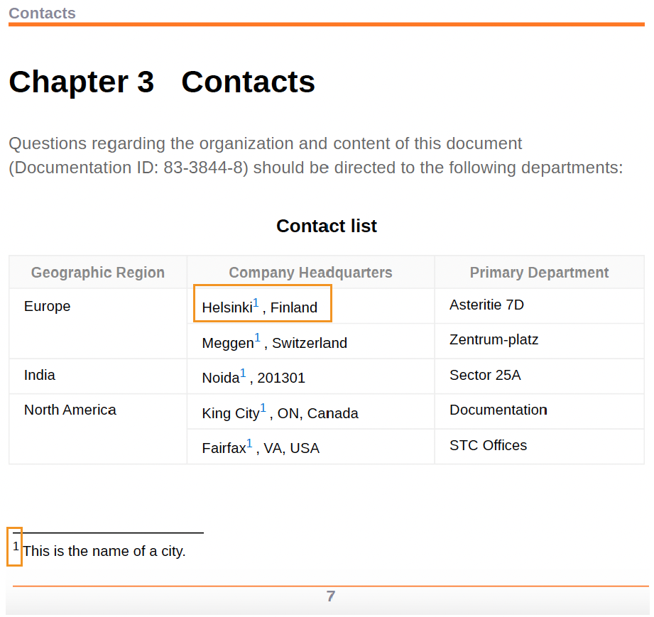

# Anwenden von Fußnotenstilen


Fußnoten sind Notizen, die am unteren Rand einer Seite platziert werden und einen bestimmten Teil des Textes kommentieren oder referenzieren.

Jede Fußnote hat eine Fußnotenmarkierung am unteren Seitenrand, die in der Regel eine Zahl oder ein Symbol wie ein Sternchen ist. Innerhalb des Hauptinhalts wird dieselbe Fußnotenmarkierung als Fußnotenaufruf angezeigt und durch dieselbe Nummer oder dasselbe Symbol als Hochgestellt gekennzeichnet.


## Ändern der Stile von Fußnotenaufrufen und -markierungen

Sie können die Stile der Fußnotenaufrufe und -marken ändern und ihr Erscheinungsbild in der PDF-Ausgabe verwalten. Mithilfe dieser Stile können Sie die Fußnoten im Dokument schnell identifizieren.


**Beispiel 1**:

Im angegebenen Beispiel können Sie eine Klammer vor und nach dem Fußnotenaufruf und der -markierung hinzufügen:

* Fügen Sie das Präfix „(“ und das Suffix „)“ mithilfe des Attributs content im Stil `footnote-call` hinzu, wodurch die Klammern um die Fußnotennummer im Themeninhalt hinzugefügt werden.
* Fügen Sie das Präfix „(“ und das Suffix „)“ mithilfe des Attributs content im `footnote-marker` -Stil hinzu, wodurch die Klammern um die Fußnotennummer am unteren Seitenrand hinzugefügt werden.

```css
...
.fn::footnote-call { 
content: "(" counter(footnote, decimal) ")"; 
} 

.fn::footnote-marker { 
content: "(" counter(footnote, decimal) ")"; 
} 

...
```


*Fügen Sie Klammern um den Fußnotenaufruf und die Fußnotenmarkierung hinzu.*

**Beispiel 2**:

Sie können den Fußnotenaufruf und die Markierung auch mit einem Sternchen oder einem niedriggriechischen Zeichen anstelle einer Zahl kennzeichnen.


```css
.fn::footnote-call {
 content: counter(footnote, asterisks);
}
.fn::footnote-marker {
 content: counter(footnote, asterisks) " ";
}
```

In der Ausgabe können Sie Folgendes anzeigen:


*Fügen Sie einem Fußnotenaufruf und einer Markierung ein Sternchen hinzu.*

## Fußnotenaufruf ausblenden

Sie können einen Stil auch auf Fußnotenaufrufe mit bestimmten Attributen anwenden. Verwenden Sie beispielsweise den folgenden Stil, um eine Fußnote mit den IDs auszublenden:
Der Fußnotenaufruf ist im Hauptinhalt ausgeblendet, aber die Fußnotenmarkierung wird unten auf der Seite angezeigt.

```css
.fn[id]::footnote-call {
		display: none;
                        }
```

## Formatieren des Fußnotenbereichs

Der Fußnotenbereich ist der Bereich, in dem alle Fußnoten platziert werden, im Allgemeinen am unteren Rand einer Seite. Sie können den Fußnotenbereich mithilfe der Seiten-Layouts oder CSS-Stile formatieren.


### Seiten-Layouts

Sie können die Seiteneigenschaften für Seitenlayouts verwenden, um den Fußnotenbereich in den verschiedenen Abschnitten eines PDF-Dokuments zu gestalten. Sie können beispielsweise die Ränder und Abstandseigenschaften des Fußnotenbereichs in einem Kapitel angeben. Sie können auch die Rahmenseite, den Stil, die Farbe, die Breite und den Radius ändern.

Erfahren Sie, wie [mit den Seiteneigenschaften eines Seiten-Layouts arbeiten](./design-page-layout.md#page-props-page-layout).

### CSS-Stile

Sie können Stile anwenden und den Fußnotenbereich in einem PDF-Dokument formatieren. Sie können beispielsweise die Rahmenlänge, den Stil, die Farbe und die Breite ändern.

```css
	@page {
	  @footnote {
   		border-top-style: solid;
   		border-top-color: #FF0000;
   		border-top-width: 3px;
 		        }
	      }
```

## Neu mit der Nummerierung der Fußnoten beginnen

Standardmäßig werden die Fußnoten in einem Dokument fortlaufend nummeriert. Sie können jedoch Seitenlayouts oder CSS-Stile verwenden, um die Nummerierung der Fußnoten neu zu starten.


### Seiten-Layouts

Sie können eine Zahl in den Seiten-Layouts angeben, um die Fußnotennummerierung in den verschiedenen Abschnitten eines PDF-Dokuments neu zu starten. Wählen Sie beispielsweise eine Zahl aus dem Feld **Nummerierung von neu starten** im Bedienfeld Seiteneigenschaften, um die Fußnotennummerierung für jedes Kapitel neu zu starten.

### CSS-Stile

Verwenden Sie den folgenden Stil, um die Fußnotennummerierung auf jeder Seite der PDF-Ausgabe zurückzusetzen:

```css
@page
{
counter-reset: footnote
}
```

Daher starten die Fußnoten auf jeder Seite von 1 neu.

## Inline-Fußnoten anzeigen

Normalerweise wird jede Fußnote als Block angezeigt oder beginnt auf einer neuen Zeile. Sie können sie aber auch in einer Reihe oder nebeneinander platzieren.

```css
.fn{
  	display: inline;
              }
```

## Anwenden von Stilen auf Fußnoten-Querverweise

Sie können auch eine Fußnote vergleichen und in Ihrer PDF-Ausgabe mehrmals auf dieselbe Fußnote verweisen. Auf diese Weise können Sie mehrmals auf dasselbe Zitat oder dieselbe detaillierte Anmerkung im Dokument verweisen, ohne erneut eine Fußnote dafür zu erstellen.

Der folgende Screenshot zeigt beispielsweise, wie dieselbe Fußnote in der PDF-Ausgabe für alle Städte querreferenziert wird.


*Fügen Sie den Querverweis auf eine Fußnote ein.*


Mithilfe von CSS-Stilen können Sie die Querverweise auf Fußnoten auch formatieren. Sie können beispielsweise die Hintergrundfarbe der Querverweise ändern.

```css
    .xref-fn{
	background-color: red;
	}
```


