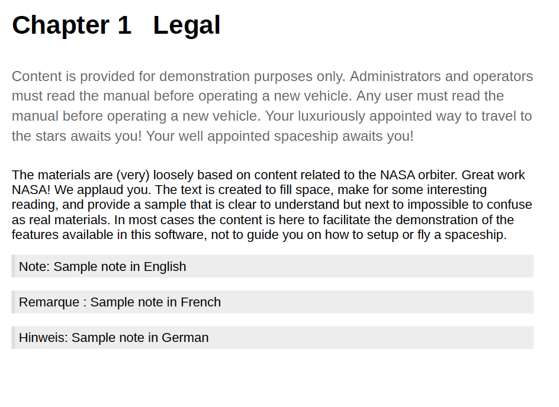

# Unterstützung für Sprachvariablen

AEM Guides bietet die Funktion zum Verwenden von Sprachvariablen. Sie können Sprachvariablen verwenden, um lokalisierte Zeichenfolgen in der PDF-Ausgabe zu definieren oder statischen Text in den Ausgabevorlagen zu lokalisieren. Sie können CSS-Stile verwenden, um die aus einer CSS stammenden Zeichenfolgen zu lokalisieren.

## Sprachvariablen in der PDF-Ausgabe verwenden

Sie können Sprachvariablen verwenden, um eine lokalisierte Version der vordefinierten Beschriftungen wie Hinweis, Vorsicht und Warnung oder statischen Text in der PDF-Ausgabe zu definieren. Der Variablenname ist für alle Sprachen identisch, kann aber für die verschiedenen Sprachen unterschiedliche Werte aufweisen. Sie können den Wert für diese Variablen in einer oder mehreren Sprachen aktualisieren und dann wird der lokalisierte Wert automatisch in der PDF-Ausgabe ausgewählt.

Sie können beispielsweise die folgende Möglichkeit haben, die Bezeichnung `Note` in der PDF-Ausgabe anzuzeigen:

- Englisch: Hinweis

- Französisch: Remarque

- Deutsch: Verweis



*Ein Beispielbrief in englischer, französischer und deutscher Sprache.*

>[!NOTE]
>
> Wenn der Wert für eine Variable nicht in einer bestimmten Sprache definiert ist, wählt AEM Guides die Zeichenfolge aus der Sprache der Benutzeroberfläche (Benutzeroberfläche der Anwendung) als Ausweichmechanismus aus.
>
> Wenn Sie den Wert nicht in der Sprache der Benutzeroberfläche definiert haben, wird nach Englisch (`en_us`) gesucht. Andernfalls wird der Wert für English(`en`) ausgewählt und in der PDF-Ausgabe der Wert angezeigt.

## Typen von Sprachvariablen

AEM Guides unterstützt zwei Variablentypen: Anwendungs- und Benutzervariablen.

### Anwendungsvariablen

AEM Guides bietet eine Reihe vordefinierter oder vordefinierter Anwendungsvariablen. Sie können diese vordefinierten Variablen verwenden, um Informationen zu einem AEM Guides-spezifischen Dokument hinzuzufügen. Beispielsweise zeigt die Variable &quot;`chapter-number`&quot;die Kapitelnummer an, zu der die Seite gehört, sofern sie in einer Seite enthalten ist. Die Variable &quot;`author-label`&quot; zeigt den Namen des Dokumentautors an.

>[!NOTE]
>
> Sie können den Wert für eine Anwendungsvariable überschreiben.


### Benutzervariablen

Sie können auch neue Sprachvariablen erstellen. Sie können beispielsweise eine Benutzervariable Publisher für die Bezeichnung des Herausgebers für das Dokument erstellen.

>[!NOTE]
>
>  Sie sollten über Administratorrechte verfügen, um Benutzervariablen zu erstellen und die Anwendungsvariablen zu bearbeiten.


*Fügen Sie die Sprachvariablen für eine ausgewählte Sprache hinzu und zeigen Sie sie an.*

## Neue Sprachvariable hinzufügen

1. Gehen Sie im Web Editor zur Registerkarte Ausgabe .
1. Wählen Sie **Sprachvariablen** aus  im linken Bereich.
1. Wählen Sie **Bearbeiten** aus, um das Fenster **Sprachvariablen** zu öffnen. Die in der ausgewählten Sprache vorhandenen Anwendungs- und Benutzervariablen werden in alphabetischer Reihenfolge aufgelistet. Die Werte werden entsprechend der ausgewählten Sprache angezeigt. Wenn Sie beispielsweise die französische Sprache auswählen, wird &quot;Tipp&quot;als &quot;Conseil&quot;angezeigt.
1. Wählen Sie im Dropdown-Menü **Sprache** die gewünschte Sprache aus, in der Sie eine Variable bearbeiten möchten.

   >[!NOTE]
   >
   > Wenn Sie die gewünschten Sprachen nicht anzeigen, aktivieren Sie die gewünschte Sprache in den **Sprachvariableneinstellungen**. Einstellungen auswählen  , um das Dialogfeld **Sprachvariableneinstellungen** zu öffnen.

1. Geben Sie den Variablennamen in die Spalte **Name** und den zugehörigen Wert in die Spalte **Wert** ein.

   >[!NOTE]
   >
   >Sie können jeden beliebigen HTML-Inhalt als Variablenwert verwenden, um den Variablenwert in einer bestimmten Formatierung anzuzeigen. Beispielsweise können Sie dem Variablenwert das Tag `<b>` hinzufügen, um den Publisher fett anzuzeigen.

1. Wählen Sie **Sprachvariable hinzufügen**  , um der ausgewählten Sprache eine neue Sprachvariable hinzuzufügen. Wenn Sie eine Variable zu einer Sprache hinzufügen, wird sie automatisch allen Sprachen hinzugefügt. Sie können keine Variable mit demselben Namen wie eine vorhandene Variable erstellen. Es wird ein Fehler angezeigt.

>[!NOTE]
>
> Wenn Sie nicht **Sprachvariable hinzufügen** auswählen, wird die Variable nicht erstellt und der Liste hinzugefügt

## Exportieren und Importieren von Sprachvariablen

Experience Manager Guides unterstützt den Export und Import der in der ausgewählten Sprache vorhandenen Sprachvariablen. Sie können alle Sprachvariablen zusammen mit den definierten Werten einfach exportieren. Dies umfasst sowohl Anwendungs- als auch Benutzervariablen. Verwenden Sie die exportierte Datei, um die gewünschten Änderungen an den Werten vorzunehmen oder sie in andere Sprachen zu lokalisieren.

Sie können auch die XML-Datei importieren, die die Sprachvariablen enthält. Experience Manager Guides importiert nur die bereits definierten Sprachvariablen, einschließlich Anwendungs- und Benutzervariablen. Es werden keine noch nicht definierten Variablen importiert.

### Exportieren von Sprachvariablen

Um die Sprachvariablen für eine Sprache zu exportieren, wählen Sie die Sprache aus der Dropdown-Liste aus und wählen Sie **Exportieren** .
Es wird eine XML-Datei im Format `language_variable_<ln>` erstellt, wobei `<ln>` der Code der ausgewählten Sprache ist. Beispiel: `language_variable_en.xml` für Englisch und `language_variable_fr.xml` für Französisch.

>[!NOTE]
> 
>Wenn Sie nicht gespeicherte Änderungen an den Sprachvariablen haben, können Sie diese nicht exportieren. Speichern Sie die Änderungen, um den aktivierten **Export** anzuzeigen. Symbol &quot;&quot;.

### Sprachvariablen importieren

So importieren Sie die Sprachvariablen:

1. Wählen Sie eine Sprache aus dem Dropdown-Menü aus und wählen Sie **Importieren** .
2. Suchen Sie nach der XML, die die Sprachvariablen enthält, und wählen Sie sie aus. Beispielsweise language_variable_en.xml.
Sie können XML-Dateien im folgenden Format importieren:

```
<?xml version="1.0" encoding="UTF-8"?>
<variables>    
<variable id="note-important">Important: </variable>    
<variable id="note-caution">Avertir: </variable>    
<variable id="image-with-text">Text and image &lt;img src=&quot;/content/dam/assets/images/image_with_text.png&quot; /&gt; </variable> 
</variables> 
```

Die Variablen mit derselben ID werden nach dem Import der Datei importiert. Die Werte für die Variablen in der ausgewählten Sprache werden mit denen in der XML-Datei aktualisiert.  Es wird eine Meldung über die Anzahl der aktualisierten Variablen angezeigt.

>[!NOTE]
> 
><ul><li>Wenn es sich bei der Datei nicht um eine XML-Datei handelt oder die Datei ein falsches Format enthält, das nicht den Sprachvariablen zugeordnet ist, wird ein Fehler angezeigt, dass ein Problem mit der XML-Datei vorliegt. 
&gt;<li>Wenn die Datei keine Variablen mit derselben ID enthält, wird eine Warnung angezeigt, dass in der importierten Datei keine übereinstimmende Sprachvariable gefunden wird.

### Optionen für eine Sprachvariable

Bewegen Sie den Mauszeiger über die Variable, um das Menü **Optionen** dafür anzuzeigen.


*Verwenden Sie das Menü&#x200B;**Optionen**, um eine Sprachvariable zu löschen, in der Vorschau anzuzeigen oder zu duplizieren.*

Sie können sowohl Anwendungs- als auch Benutzervariablen in der Vorschau anzeigen. Um anzuzeigen, wie der Variablenwert in der Ausgabe angezeigt wird, wählen Sie **Vorschau** aus dem Menü **Optionen** der ausgewählten Variable aus.
Sie können auch die Benutzervariablen **Löschen** oder **Duplizieren** auswählen. Wenn Sie eine Variable aus einer Sprache löschen, wird sie automatisch aus allen Sprachen gelöscht.

### Bearbeiten oder Wiederherstellen der Anwendungsvariablen

Sie können auch die Werte für eine Anwendungsvariable bearbeiten. Später können Sie eine Anwendungsvariable auf den ursprünglichen Wert zurücksetzen. **Variable zurücksetzen**  wird für eine Anwendungsvariable mit einem geänderten Wert angezeigt.

## Sprachvariablen in Ausgabevorlagen verwenden

Sie sollten Sprachvariablen zu Ihren lokalisierten Dokumenten hinzufügen. Sie können diese Sprachvariablen in das Seitenlayout einfügen, das auf verschiedenen Seiten in Ihren lokalisierten Dokumenten angezeigt wird. Sie können beispielsweise die Sprachvariable für &quot;`author-name`&quot;hinzufügen, die im Kopfzeilenbereich des Seitenlayouts (oder in einem anderen Teil wie der Fußzeile oder dem Hauptteil) angezeigt wird.


*Der Autor und der Markenname, die in der für die französische PDF generierten Ausgabe lokalisiert sind.*

So fügen Sie eine Sprachvariable wie Ihre `copyright-label` in den Kopfzeilenbereich ein:

1. Öffnen Sie das gewünschte Seitenlayout zur Bearbeitung.

   >[!NOTE]
   >
   > Ansicht [Anpassen eines Seitenlayouts](../native-pdf/components-pdf-template.md#customize-a-page-layout-customize-page-layout) zum Öffnen eines Seitenlayouts zur Anpassung oder Bearbeitung.

1. Wählen Sie die Kopfzeile aus, damit das Einfügen einer Variablen aktiviert wird.
1. Wählen Sie **Variable einfügen**   in der Symbolleiste.
1. Wählen Sie im Popup **Variable einfügen** den Namen der einzufügenden Sprachvariablen aus und klicken Sie auf **Einfügen** , um sie in den Kopfzeilenbereich einzufügen.

   >[!NOTE]
   >
   > Sie können auch die Suchzeichenfolge in das Textfeld eingeben. Die Variablennamen, die die angegebene Zeichenfolge enthalten, werden gefiltert und in der Liste angezeigt.
   > Die ausgewählte Sprachvariable wird in den Kopfzeilenbereich eingefügt.


*Der im Kopfzeilenbereich hinzugefügte `copyright-label`.*

### Anwenden des Inhaltsstils auf Sprachvariablen

Neben dem Wert, den Sie einer Sprachvariablen zuweisen, können Sie auch HTML-Tags verwenden, um den Variablenwert in einer bestimmten Formatierung anzuzeigen. Sie können beispielsweise den Wert von `publisher-label` fett anzeigen.

- Sie können die Stile der Werte auch mit dem Tag <span> formatieren. Beispielsweise können Sie mit der Sprachvariable &quot;page-number&quot;die Seitenzahl im römischen Zahlenformat in englischer Sprache anzeigen und das Format für andere Sprachen angeben.

  Wert für Englisch:
  `<span data-field="page-number" data-format="upper-roman">1</span>`

  Wert für Tamil:
  `<span data-field="page-number" data-format="tamil">1</span>`

Auf ähnliche Weise können Sie Sprachvariablen hinzufügen und andere Felder formatieren, die im Feature &quot;Felder einfügen&quot;der Seitenlayouts aufgeführt sind. Weitere Informationen zum Hinzufügen von Feldern finden Sie unter [Felder und Metadaten hinzufügen](../native-pdf/design-page-layout.md#add-fields-metadata).

- Sie können den Werten auch lokalisierte Bilder hinzufügen. Sie können beispielsweise ein Bildsymbol in der Sprache der Kapitelnummer hinzufügen und lokalisierte Bilder des Symbols in der PDF-Ausgabe abrufen.

  Für Englisch kann der Variablenwert für ein Bild mit `` und für dieselbe Variable in Deutsch mit `` identisch sein. Es nimmt also die Bilder in Abhängigkeit von der Sprache auf.

## Lokalisieren der Zeichenfolgen mit CSS-Stilen

Mithilfe von CSS-Stilen können Sie auch die in der Autonummer verwendeten Zeichenfolgen wie Kapitel, Abschnitt, Abbildung und Tabelle lokalisieren. Da diese Zeichenfolgen aus CSS-Dateien stammen, können Sie sie nicht mithilfe von Sprachvariablen lokalisieren. Um diese Zeichenfolgen zu lokalisieren, können Sie CSS-Stile für jede Sprache erstellen, in der Sie sie lokalisieren möchten.
Beispielsweise können Sie die folgende CSS verwenden, um das Kapitelpräfix und das entsprechende Zahlenformat in verschiedenen Sprachen anzuzeigen.
Beispielsweise können Sie die folgende CSS verwenden, um Kapitel als Hoofdstuk in deutscher Sprache und die Kapitelnummer im Dezimalformat anzuzeigen. Für Japanisch können Sie das japanische Zahlenformat verwenden, um die Kapitelnummern im Inhaltsverzeichnis anzuzeigen.

```
// for English
h1:before {
  counter-increment: h11;
  content: "Chapter " counter(h11, decimal)".";
}

// for German
:root:lang(de) h1:before {
  content: "Hoofdstuk " counter(h11, decimal)".";
}

// for Japanese
:root:lang(ja) h1:before {
  content: "章 " counter(h11, japanese-formal)".";
}
```

Die folgenden Screenshots zeigen die in der Ausgabe auf Deutsch und Japanisch lokalisierten Zeichenfolgen an.


### Präfixe formatieren

Mithilfe von CSS-Stilen können Sie auch die Präfixe formatieren. Sie können beispielsweise die Bezeichnung `Note` so formatieren, dass sie in der Ausgabe der PDF in verschiedenen Sprachen rot angezeigt wird.

```
.note .prefix-content 
{
color: red;
} 
```
