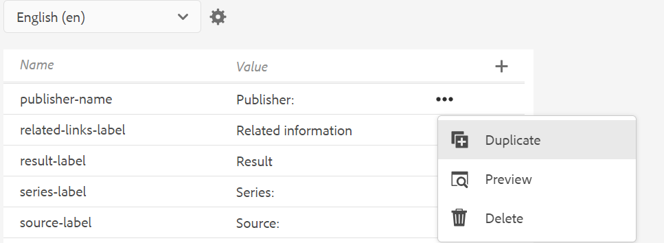

# Unterstützung für Sprachvariablen

Adobe Experience Manager Guides bietet die Funktion zur Verwendung von Sprachvariablen. Sie können Sprachvariablen verwenden, um lokalisierte Zeichenfolgen in der PDF-Ausgabe zu definieren oder statischen Text in den Ausgabevorlagen zu lokalisieren. Sie können CSS-Stile verwenden, um die Zeichenfolgen aus einer CSS-Datei zu lokalisieren.

## Verwenden von Sprachvariablen in der PDF-Ausgabe

Sie können Sprachvariablen verwenden, um eine lokalisierte Version der standardmäßigen Kennzeichnungen wie „Hinweis“, „Vorsicht“ und „Warnung“ oder „Statischer Text“ in der PDF-Ausgabe zu definieren. Der Variablenname ist für alle Sprachen gleich, kann aber für die verschiedenen Sprachen unterschiedliche Werte aufweisen. Sie können den Wert für diese Variablen in einer oder mehreren Sprachen aktualisieren, und dann wird der lokalisierte Wert automatisch in der PDF-Ausgabe ausgewählt.

Beispielsweise können Sie die folgenden Möglichkeiten haben, den `Note` in der PDF-Ausgabe darzustellen:

- Englisch: Hinweis

- Französisch: Remarque

- Deutsch: Hinweis


*Beispielnotiz in englischer, französischer und deutscher Sprache.*

>[!NOTE]
>
> Wenn der Wert für eine Variable nicht in einer bestimmten Sprache definiert ist, wählt AEM Guides die Zeichenfolge aus der Sprache der Benutzeroberfläche (Benutzeroberfläche des Programms) als Ausweichmechanismus aus.
>
> Wenn Sie den Wert nicht in der Sprache der Benutzeroberfläche definiert haben, sucht er nach Englisch (`en_us`), oder er wählt den englischen Wert (`en`) aus und zeigt denselben in der PDF-Ausgabe an.

## Typen von Sprachvariablen

AEM Guides unterstützt zwei Variablentypen: Anwendungs- und Benutzervariablen.

### Anwendungsvariablen

AEM Guides bietet eine Reihe vordefinierter oder vordefinierter Anwendungsvariablen. Sie können diese vordefinierten Variablen verwenden, um Informationen zu einem AEM Guides-spezifischen Dokument hinzuzufügen. Beispiel: Die Variable `chapter-number` zeigt die Kapitelnummer an, zu der die Seite gehört, wenn sie auf einer Seite enthalten ist. Die Variable `author-label` zeigt den Namen des Dokumentautors an.

>[!NOTE]
>
> Sie können den Wert für eine Anwendungsvariable überschreiben.


### Benutzervariablen

Sie können auch neue Sprachvariablen erstellen. Sie können beispielsweise eine Benutzervariable Publisher für die Bezeichnung des Herausgebers für das Dokument erstellen.

>[!NOTE]
>
>  Sie sollten über Administratorrechte verfügen, um Benutzervariablen zu erstellen und die Anwendungsvariablen zu bearbeiten.


*Hinzufügen und Anzeigen der Sprachvariablen für eine ausgewählte Sprache.*

## Neue Sprachvariable hinzufügen

1. Navigieren Sie im Editor zum linken Bedienfeld und wählen Sie &quot;**&quot;**. Diese Option ist im Abschnitt Mehr verfügbar.
1. Wählen Sie **Bearbeiten** aus, um das Fenster **Sprachvariablen** zu öffnen. Die Anwendung und die Benutzervariablen, die in der ausgewählten Sprache vorhanden sind, werden in alphabetischer Reihenfolge aufgeführt. Die Werte werden entsprechend der ausgewählten Sprache angezeigt. Wenn Sie beispielsweise die französische Sprache auswählen, wird „Tipp“ als „Conseil“ angezeigt.
1. Wählen Sie **Dropdown-Menü** Sprache“ die gewünschte Sprache aus, in der Sie eine Variable bearbeiten möchten.

   >[!NOTE]
   >
   > Wenn Sie die gewünschten Sprachen nicht sehen, aktivieren Sie die gewünschte Sprache in den Einstellungen **Sprachen konfigurieren**. Einstellungen auswählen  das Dialogfeld **Sprachen konfigurieren** geöffnet werden.

1. Geben Sie den Variablennamen in die Spalte **Name** und dessen Wert in die Spalte **Wert** ein.

   >[!NOTE]
   >
   >Sie können jeden HTML-Inhalt als Variablenwert verwenden, um den Variablenwert in einer bestimmten Formatierung anzuzeigen. Sie können beispielsweise `<b>` Tag zum Variablenwert hinzufügen, um den Publisher fett zu kennzeichnen.

1. Wählen Sie **Sprachvariable hinzufügen** , um der ausgewählten Sprache eine neue Sprachvariable hinzuzufügen. Wenn Sie eine Variable zu einer Sprache hinzufügen, wird sie automatisch zu allen Sprachen hinzugefügt. Sie können keine Variable mit demselben Namen wie eine vorhandene Variable erstellen. Ein Fehler wird angezeigt.

>[!NOTE]
>
> Wenn Sie nicht **Sprachvariable hinzufügen** auswählen, wird die Variable nicht erstellt und der Liste hinzugefügt

## Exportieren und Importieren von Sprachvariablen

Experience Manager Guides unterstützt den Export und Import der Sprachvariablen, die in der ausgewählten Sprache vorhanden sind. Sie können problemlos alle Sprachvariablen zusammen mit den definierten Werten exportieren. Dies umfasst sowohl Anwendungs- als auch Benutzervariablen. Verwenden Sie die exportierte Datei, um die gewünschten Änderungen an den Werten vorzunehmen oder sie in andere Sprachen zu lokalisieren.

Sie können auch die XML-Datei importieren, die die Sprachvariablen enthält. Experience Manager Guides importiert nur die bereits definierten Sprachvariablen, einschließlich der Anwendungs- und Benutzervariablen. Es werden keine Variablen importiert, die noch nicht definiert sind.

### Sprachvariablen exportieren

Um die Sprachvariablen für eine Sprache zu exportieren, wählen Sie die Sprache aus der Dropdown-Liste aus und klicken Sie auf **Exportieren** .
Es wird eine XML-Datei im Format `language_variable_<ln>` erstellt, wobei `<ln>` der Code der ausgewählten Sprache ist. Beispiel: `language_variable_en.xml` für Englisch und `language_variable_fr.xml` für Französisch.

>[!NOTE]
> 
>Wenn die Sprachvariablen noch nicht gespeicherte Änderungen enthalten, können diese nicht exportiert werden. Speichern Sie die Änderungen, um die aktivierten (**)** .

### Sprachvariablen importieren

So importieren Sie die Sprachvariablen:

1. Wählen Sie eine Sprache aus dem Dropdown-Menü aus und klicken Sie auf **Importieren** .
2. Durchsuchen Sie die XML mit den Sprachvariablen und wählen Sie sie aus. Beispiel: language_variable_de.xml.
Sie können XML-Dateien im folgenden Format importieren:

```
<?xml version="1.0" encoding="UTF-8"?>
<variables>    
<variable id="note-important">Important: </variable>    
<variable id="note-caution">Avertir: </variable>    
<variable id="image-with-text">Text and image &lt;img src=&quot;/content/dam/assets/images/image_with_text.png&quot; /&gt; </variable> 
</variables> 
```

Die Variablen mit derselben ID werden importiert, sobald Sie die Datei importieren. Die Werte für die Variablen in der ausgewählten Sprache werden mit denen in der XML-Datei aktualisiert.  Eine Meldung über die Anzahl der aktualisierten Variablen wird angezeigt.

>[!NOTE]
> 
><ul><li>Wenn es sich bei der Datei nicht um eine XML-Datei handelt oder die Datei ein falsches Format enthält, das nicht den Sprachvariablen zugeordnet ist, wird ein Fehler angezeigt, der besagt, dass ein Problem mit der XML-Datei vorliegt. 
&gt;<li>Wenn die Datei keine Variablen mit derselben ID enthält, wird eine Warnung angezeigt, dass in der importierten Datei keine übereinstimmende Sprachvariable gefunden wird.

### Optionen für eine Sprachvariable

Bewegen Sie den Mauszeiger über die Variable, um das **Optionen**-Menü dafür anzuzeigen.



*Verwenden Sie das Menü&#x200B;**Optionen**, um eine Sprachvariable zu löschen, in der Vorschau anzuzeigen oder zu duplizieren.*

Sie können sowohl Anwendungs- als auch Benutzervariablen in der Vorschau anzeigen. Um anzuzeigen, wie der Wert der Variablen in der Ausgabe angezeigt wird, wählen Sie **Vorschau** aus dem Menü **Optionen** der ausgewählten Variablen aus.
Sie können auch **Benutzervariablen** oder **Duplizieren**. Wenn Sie eine Variable aus einer Sprache löschen, wird sie automatisch aus allen Sprachen gelöscht.

### Bearbeiten oder Zurücksetzen der Anwendungsvariablen

Sie können auch die Werte für eine Anwendungsvariable bearbeiten. Später können Sie eine Anwendungsvariable auf den ursprünglichen Wert zurücksetzen. **Zurücksetzen**  wird für eine Anwendungsvariable mit einem geänderten Wert angezeigt.

## Verwenden von Sprachvariablen in den Ausgabevorlagen

Sie sollten Ihren lokalisierten Dokumenten Sprachvariablen hinzufügen. Sie können diese Sprachvariablen in das Seiten-Layout einfügen, das auf verschiedenen Seiten in Ihren lokalisierten Dokumenten angezeigt wird. Sie können beispielsweise die Sprachvariable für die `author-name` hinzufügen, die im Kopfzeilenbereich des Seitenlayouts (oder in einem anderen Teil wie der Fußzeile oder dem Hauptteil) angezeigt wird.


*Der Autor und der Markenname in der für Französisch generierten PDF-Ausgabe.*

Um eine Sprachvariable wie Ihre `copyright-label` in den Kopfzeilenbereich einzufügen, führen Sie die folgenden Schritte aus:

1. Öffnen Sie das gewünschte Seiten-Layout zur Bearbeitung.

   >[!NOTE]
   >
   > Abschnitt [Anpassen eines Seiten-Layouts](../native-pdf/components-pdf-template.md#customize-a-page-layout-customize-page-layout) zum Öffnen eines Seiten-Layouts zur Anpassung oder Bearbeitung anzeigen.

1. Wählen Sie die Kopfzeile aus, um das Einfügen einer Variablen zu aktivieren.
1. Wählen Sie **Variable einfügen**   in der Symbolleiste.
1. Wählen **im Popup** Variable einfügen“ den Namen der einzufügenden Sprachvariablen aus und klicken Sie auf **Einfügen**, um sie in den Kopfzeilenbereich einzufügen.

   >[!NOTE]
   >
   > Sie können die Suchzeichenfolge auch in das Textfeld eingeben. Die Variablennamen, die die angegebene Zeichenfolge enthalten, werden gefiltert und in der Liste angezeigt.
   > Die ausgewählte Sprachvariable wird in den Kopfzeilenbereich eingefügt.


*Die im Kopfzeilenbereich hinzugefügte `copyright-label`.*

### Anwenden eines Inhaltsstils auf Sprachvariablen

Neben dem Wert, den Sie einer Sprachvariablen zuweisen, können Sie auch HTML-Tags verwenden, um den Variablenwert in bestimmter Formatierung anzuzeigen. Sie können beispielsweise den Wert der `publisher-label` fett formatieren.

- Sie können die Stile der Werte auch mithilfe <span> Tags formatieren. Beispielsweise können Sie mit der Sprachvariablen „page-number“ die Seitennummer im römischen Zahlenformat in englischer Sprache anzeigen und das Format für andere Sprachen angeben.

  Wert für Englisch:
  `<span data-field="page-number" data-format="upper-roman">1</span>`

  Wert für Tamil:
  `<span data-field="page-number" data-format="tamil">1</span>`

Auf ähnliche Weise können Sie Sprachvariablen hinzufügen und andere Felder formatieren, die in der Funktion Felder einfügen der Seiten-Layouts aufgeführt sind. Weitere Informationen zum Hinzufügen von Feldern finden Sie unter [Hinzufügen von Feldern und Metadaten](../native-pdf/design-page-layout.md#add-fields-metadata).

- Sie können den Werten auch lokalisierte Bilder hinzufügen. Sie können beispielsweise ein Bildsymbol in der Kapitelnummernsprache hinzufügen und lokalisierte Bilder des Symbols in der PDF-Ausgabe abrufen.

  Bei Englisch kann der Variablenwert für ein Bild wie `` und für dieselbe Variable auf Deutsch `` sein. Es nimmt Bilder in Abhängigkeit von der Sprache auf.

## Lokalisieren von Zeichenfolgen mithilfe von CSS-Stilen

Mithilfe von CSS-Stilen können Sie auch die Zeichenfolgen lokalisieren, die in „Autonummerieren“ verwendet werden, z. B. „Kapitel“, „Abschnitt“, „Abbildung“ und „Tabelle“. Da diese Zeichenfolgen aus CSS-Dateien stammen, können Sie sie nicht mit Sprachvariablen lokalisieren. Um diese Zeichenfolgen zu lokalisieren, können Sie CSS-Stile für jede Sprache erstellen, in der Sie sie lokalisieren möchten.
Beispielsweise können Sie das folgende CSS verwenden, um das Kapitelpräfix und das entsprechende Zahlenformat in verschiedenen Sprachen anzuzeigen.
Beispielsweise können Sie das folgende CSS verwenden, um Kapitel als Hoofdstuk auf Deutsch und die Kapitelnummer im Dezimalformat anzuzeigen. Bei Japanisch können Sie das japanische Zahlenformat verwenden, um die Kapitelnummern im Inhaltsverzeichnis anzuzeigen.

```
// for English
h1:before {
  counter-increment: h11;
  content: "Chapter " counter(h11, decimal)".";
}

// for German
:root:lang(de) h1:before {
  content: "Hoofdstuk " counter(h11, decimal)".";
}

// for Japanese
:root:lang(ja) h1:before {
  content: "章 " counter(h11, japanese-formal)".";
}
```

Die folgenden Screenshots zeigen die in der deutschen und japanischen PDF-Ausgabe lokalisierten Zeichenfolgen.


### Präfixe formatieren

Mithilfe von CSS-Stilen können Sie auch die Präfixe formatieren. Beispielsweise können Sie den `Note` so formatieren, dass er in der PDF-Ausgabe verschiedener Sprachen rot dargestellt wird.

```
.note .prefix-content 
{
color: red;
} 
```
