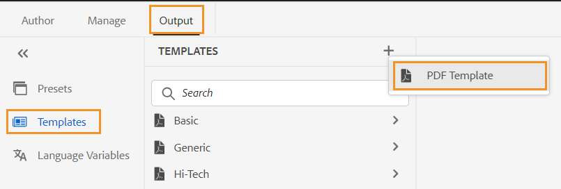

# PDF-Vorlage {#PDF-template}

Die Verwendung einer Vorlage gewährleistet Konsistenz im Inhaltslayout und in der Inhaltsstruktur. Da Vorlagen vordefiniert sind, können Sie Überarbeitungen bei Formatierungsproblemen vermeiden, die bei jedem neuen Projekt oder jeder Aktualisierung auftreten. Mit Vorlagen können Sie Seiten-Layouts entwerfen, Inhalte gestalten und verschiedene Einstellungen anwenden, um Ihre PDF anzupassen.

## Werkseitige und benutzerdefinierte PDF-Vorlagen

Es gibt einige werkseitig bereitgestellte Beispiel-Vorlagen, die die Entwicklerinnen und Entwickler als Basisvorlagen verwenden können, um benutzerdefinierte Vorlagen gemäß ihren Organisationsanforderungen zu erstellen.

## Erstellen einer neuen PDF-Vorlage {#create-pdf-template}

Sie können benutzerdefinierte PDF-Vorlagen mit bestimmten Seitenlayouts erstellen und Formatierungen für Seitenlayoutkomponenten (wie Inhaltsverzeichnis, Index, Glossar) oder DITA-Komponenten (wie Überschrift, Absatz, Liste) mithilfe von Stylesheets definieren.

Um eine neue PDF-Vorlage zu erstellen, führen Sie die folgenden Schritte aus:

1. Wechseln Sie im Web-Editor zur Registerkarte **Ausgabe** .
1. Wählen Sie **Vorlagen**  im linken Bedienfeld.

   

1. Klicken Sie **Fenster** Vorlagen“ auf das Symbol **+** neben **Vorlagen** und wählen Sie **Vorlage PDF**.
1. Wählen **Dialogfeld „Neue PDF-Vorlage** eine Werksvorlage aus, die Sie als Grundlage für die Erstellung der benutzerdefinierten Vorlage verwenden möchten. Sie können auch das Suchfeld verwenden, um nach einer Vorlage zu suchen.
1. Geben Sie einen Titel für die Vorlage an.

   >[!NOTE]
   >
   >  Sie können beim Erstellen und Duplizieren einer Vorlage auch eine Vorschau einer Miniaturansicht für die Vorlage anzeigen. Bearbeiten oder löschen Sie die Miniaturansicht mithilfe von [**Eigenschaften**](#properties-option) im Menü **Optionen** nach dem Erstellen der Vorlage.

1. Klicken Sie auf **Erstellen**.

   Die neue Vorlage wird erstellt und im Bedienfeld **Vorlagen** hinzugefügt.

## Duplizieren einer PDF-Vorlage {#duplicate-pdf-template}

Wenn Sie eine neue Vorlage mit denselben Seitenlayouts und Formatierungen wie eine vorhandene Vorlage erstellen möchten, können Sie eine Kopie erstellen. Nachdem eine Vorlage dupliziert wurde, können Sie die Komponenten bei Bedarf weiter anpassen.

Gehen Sie wie folgt vor, um eine vorhandene PDF-Vorlage zu duplizieren:

1. Wechseln Sie im Web-Editor zur Registerkarte **Ausgabe** .
1. Wählen Sie **Vorlagen**  im linken Bedienfeld. Dadurch wird das Fenster **Vorlagen** geöffnet.
1. Bewegen Sie den Mauszeiger über die Vorlage, die Sie duplizieren möchten, wählen Sie das Symbol **…** *Optionen* und wählen Sie **Duplizieren** aus dem Kontextmenü aus.

   Dadurch wird das **Duplizieren einer PDF-Vorlage** geöffnet.

   

   *Wählen Sie eine zu duplizierende Vorlage aus, zeigen Sie die Miniaturansicht an und aktualisieren Sie den Titel im Dialogfeld **Duplizieren einer PDF**&#x200B;Vorlage*

1. Geben Sie einen Titel für die Vorlage an.

   Das **Titel**-Feld wird als Kopie desselben Titels wie die Quellvorlage vorab ausgefüllt. Eine Fehlermeldung wird angezeigt, wenn die Vorlage mit demselben Titel bereits vorhanden ist.

1. Um einen bevorzugten Titel anzugeben, entfernen Sie den vorausgefüllten Titel und geben Sie einen Titel an.
1. Klicken Sie **Duplizieren**.

   Eine doppelte Vorlage wird erstellt und unter der **Vorlagen** hinzugefügt.

## Weitere Vorgänge bei den Vorlagen

Sie können über das Menü **Optionen“ auch die folgenden Vorgänge** Vorlagen ausführen:

### Löschen

Wählen Sie die Option Löschen , um die ausgewählte Vorlage zu löschen. Wählen Sie dann bei der Bestätigungsaufforderung Ja .
Die Vorgabe wird aus „Vorlagen&#x200B;**entfernt**.

### Eigenschaften{#properties-option}

Wählen Sie diese Option, um die Eigenschaften der Vorlage anzuzeigen und zu bearbeiten. Sie können eine Vorschau der vorhandenen Miniaturansicht für die Vorlage anzeigen. Sie können die Miniaturansicht auch bearbeiten oder löschen. Sie können auch den Titel und die Beschreibung der Vorlage ändern.

### In der Assets-Benutzeroberfläche anzeigen

Wählen Sie diese Option aus, um die Vorlage in der Assets-Benutzeroberfläche anzuzeigen. Beim Öffnen des Stammverzeichnisses der Vorlage können Sie alle Ressourcen der Vorlage anzeigen.

Nachdem Sie die benutzerdefinierte Vorlage erstellt haben, können Sie sie aus den Seitenlayouts in der PDF-Ausgabevorgabe auswählen.

Erfahren Sie, wie [eine PDF-Ausgabe veröffentlichen](https://experienceleague.adobe.com/docs/experience-manager-guides-learn/tutorials/user-guide/output-gen/web-editor/native-pdf-web-editor.html?lang=de).

>[!NOTE]
>
>Wenn für Ihren Ordner ein Ordnerprofil konfiguriert ist, sehen Sie nur die PDF-Vorlagen, die für das Ordnerprofil konfiguriert sind.

Abhängig von Ihrem Setup kann Ihr Administrator die Vorlagen konfigurieren:

+++ Cloud Services

Weitere Informationen zum Einrichten globaler Profile und Profile auf Ordnerebene finden Sie [ Abschnitt &quot;](../cs-install-guide/conf-folder-level.md#id1889D0IL0Y4) konfigurieren“ im Installations- und Konfigurationshandbuch für Cloud Service.

+++

+++ On-Premise Software

Weitere Informationen zum Einrichten globaler Profile und Profile auf Ordnerebene finden Sie im Abschnitt [Konfigurieren von Authoring](../install-guide/conf-folder-level.md#create-custom-authoring-template-id1917d0eg0hj)Vorlagen) im On-Premise-Installations- und Konfigurationshandbuch.

+++

## Anpassen einer PDF-Vorlage {#customize-pdf-template}

Sie können Vorlagen anpassen, indem Sie die Vorlagenkomponenten anpassen und Stilformate mithilfe von Stylesheets anwenden.

Um eine PDF-Vorlage anzupassen, führen Sie die folgenden Schritte aus:

1. Wechseln Sie im Web-Editor zur Registerkarte **Ausgabe** .
1. Erweitern Sie die linke Seitenleiste und wählen Sie **Vorlagen**.

   Dadurch wird das Bedienfeld **Vorlagen** geöffnet.

1. Um die Komponenten einer Vorlage anzuzeigen, führen Sie einen der folgenden Schritte aus:

   * Wählen Sie das Symbol &quot;>&quot; neben einer Vorlage aus oder doppelklicken Sie auf den Namen der Vorlage.
   * Bewegen Sie den Mauszeiger über eine beliebige Vorlage und wählen Sie die … (**Options**-Symbol) und wählen **Bearbeiten** aus dem Kontextmenü aus.

   Standardmäßig wird dadurch das Bedienfeld **Einstellungen** im Vorlageneditor geöffnet.

   

   >[!NOTE]
   >
   >  Ihr Administrator kann die neuesten Vorlagen aus dem folgenden Pfad herunterladen und die vorhandenen ersetzen:
   >
   > `/libs/fmdita/pdf`

   Die verschiedenen Vorlagenkomponenten, die Sie anpassen können, werden in die folgenden Abschnitte unterteilt:

   * Seiten-Layouts: Eine typische PDF enthält verschiedene Seiten, z. B. ein Titelblatt oder eine Titelseite, Inhaltsverzeichnis, Kapitel, Index, Zitate und mehr. Im Abschnitt Seiten-Layouts können Sie das Erscheinungsbild verschiedener Seiten gestalten, aus denen Ihr PDF bestehen würde. Weitere Informationen finden Sie unter [Seiten-Layouts](../native-pdf/components-pdf-template.md#page-layouts).

     Zusätzlich zum Erscheinungsbild können Sie auch die Anordnung von Seitenelementen wie Kopf- und Fußzeile sowie Inhaltsbereichen auf einer Seite definieren. Weitere Informationen zum Anpassen des Seiten-Layouts finden Sie unter [Erstellen und Anpassen von Seiten-Layouts](components-pdf-template.md#create-customize-page-layout).

   * Stylesheets: Mit den Einstellungen im Abschnitt Stylesheets können Sie das Erscheinungsbild der Seiten-Layout-Komponenten anpassen, z. B. Inhaltsverzeichnis, Index, Glossar, Zitate und mehr. Darüber hinaus können Sie auch die Stile für die DITA-Inhalte wie Überschriften, Absätze, Listen und mehr anpassen. Weitere Informationen über die Verwendung von Stylesheets finden Sie unter [Verwenden von Stylesheets zum Anpassen von PDF](components-pdf-template.md#stylesheet-customization).
   * Ressourcen: Speichern Sie Asset-Dateien, die Sie anpassen oder PDF-Vorlagen entwerfen müssen. Assets wie Logos, benutzerdefinierte Schriftarten, Hintergrundbilder und mehr werden in den Ressourcen gespeichert.
Sie können auch Ressourcen verwenden, die sich an einem anderen Speicherort im Repository befinden. Sie müssen nicht für jede Vorlage doppelte Ressourcen erstellen. Sie können diese in einem freigegebenen Ordner speichern und in allen nativen PDF-Vorlagen verwenden.

     Weitere Informationen zur Verwendung von Ressourcen finden Sie unter [Arbeiten mit Ressourcen](components-pdf-template.md#work-with-resources).

   * Einstellungen: Konfigurieren Sie die Ausgabeeinstellungen für das Generieren einer PDF mithilfe der Vorlage. In diesem Abschnitt können Sie die Vorlagenzuordnung für verschiedene Seiten auf einer PDF, für Kapitelstartseiten, Druckmarken, Zitate und mehr definieren.

   Sie können auch die Reihenfolge festlegen, in der sie in der endgültigen PDF-Ausgabe angezeigt werden sollen.
Weitere Informationen zum Anwenden von Einstellungen finden Sie unter [Erweiterte PDF-Einstellungen](components-pdf-template.md#advanced-pdf-settings).

1. Um eine Vorlagenkomponente anzupassen, doppelklicken Sie auf eine Vorlagenkomponente oder wählen Sie zuvor das Symbol > aus.

   Doppelklicken Sie beispielsweise auf *Seiten-Layouts* oder wählen Sie das Symbol *>* vor *Seiten-Layouts*, um die verfügbaren Seiten-Layouts anzuzeigen.

   >[!NOTE]
   >
   >Sie können auch eine Miniaturansicht und die Beschreibung für die Vorlage mithilfe von [**Eigenschaften**](#properties-option) im Menü **Optionen** aktualisieren.

1. Nachdem Sie die gewünschten Änderungen vorgenommen haben, wählen Sie *Alle speichern* (oder `Ctrl+S`) aus.
