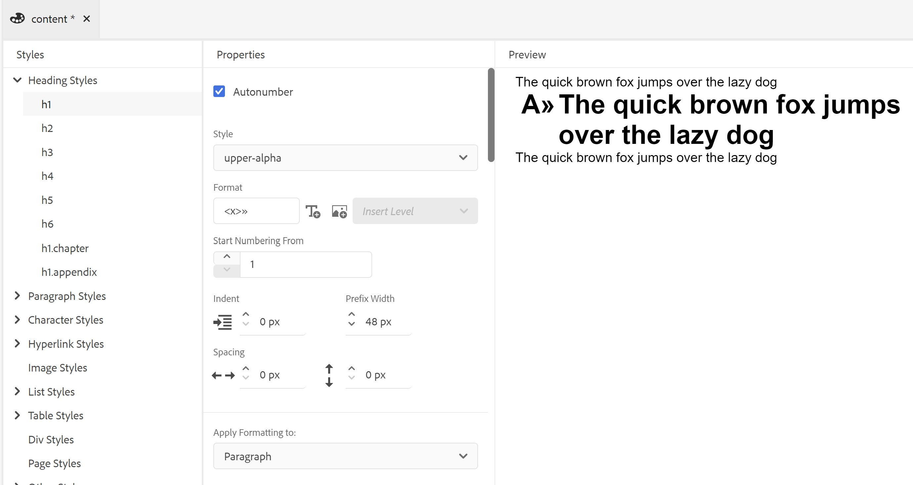
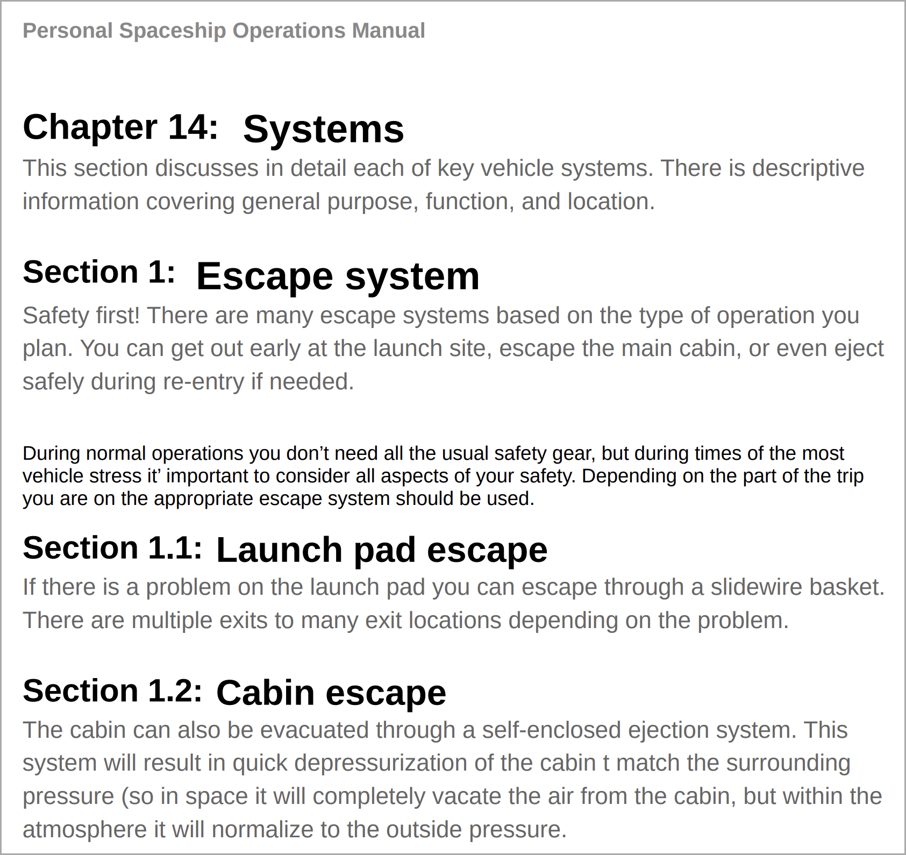
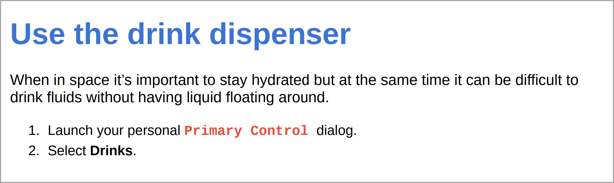

# Arbeiten mit allgemeinen Inhaltsstilen {#work-with-common-styles}

Ein Stylesheet enthält die Definitionen von Stilen für die Elemente, die in der PDF-Ausgabe verwendet werden. Sie können mit den Beispiel-Stylesheets arbeiten oder neue erstellen. In den meisten Fällen hilft Ihnen die Erstellung einer Kopie des vorkonfigurierten Beispiel-Stylesheets, schnell loszulegen.

Der Stileditor ist ein WYSIWYG-Editor, der alle Komplexitäten eines CSS-Codes hinter der Benutzeroberfläche verbirgt. Mit dem Stil-Editor können Sie die Stile für die Elemente Ihrer Wahl einfach und sehr schnell anpassen. Die Stile sind in die folgenden Köpfe unterteilt:

* Überschriftenstile
* Absatzformate
* Zeichenformate
* Hyperlink-Stile
* Bildstile
* Auflisten von Stilen
* Tabellenstile
* Div-Stile
* Seitenstile
* Andere Stile

Beim Arbeiten mit strukturierten DITA-Inhalten ist die Stilzuordnung für die meisten DITA-Elemente im Standard-Stylesheet vorhanden. Wenn Sie mit standardmäßigen DITA-Elementen arbeiten, können Sie ihr Erscheinungsbild ändern, indem Sie direkt Änderungen an der Stildefinition vornehmen. Diese Stildefinitionen sind unter der Kategorie Andere Stile verfügbar. Weitere Informationen finden Sie unter [Arbeiten mit anderen Stilen](#other-styles) weiter unten in diesem Thema.

In den folgenden Abschnitten werden die am häufigsten verwendeten Stileinstellungen in Form von Beispielen behandelt.

>[!NOTE]
>
>In den folgenden Beispielen wird davon ausgegangen, dass Sie mit dem Beispiel-Stylesheet arbeiten, das mit dem Produkt bereitgestellt wird.

## Arbeiten mit Überschriftenstilen {#heading-styles}

Die Überschriftenstile kapseln alle Basisstile für die Überschriften, die in Ihrem Inhalt verwendet werden. Vorkonfiguriert erhalten Sie 6 grundlegende Überschriftenstile und einen Überschriftenstil für die Überschrift des Themas/Kapitels und des Anhangs. In einem strukturierten Dokument stellt H1 den Titel des Themas oder Kapitels dar und H2 bis H6 werden für Unterthemen oder Abschnitte innerhalb eines Themas/Kapitels verwendet. Diese Hierarchie von Überschriften wird automatisch auf Ihren Inhalt angewendet, wenn die entsprechende Überschrift gefunden wird.

>[!NOTE]
>
>Sie können eigene benutzerdefinierte Überschriftenstile erstellen, die mithilfe der Output-Klasse in Ihren Inhalten verwendet werden können. Weitere Informationen finden Sie in Schritt 4 unter [Verwenden der Seitenausrichtung und der Ansichtsrotation](design-page-layout.md#page-orientation-rotation).

### Erstellen benutzerdefinierter Überschriften auf Kapitelebene {#create-chapter-level-heading}

In einem Buch (oder einer Buchkarte) arbeiten Sie mit Kapiteln. Die Stile für die Basisüberschriften sind so konzipiert, dass sie ohne Anpassungen auf die Überschriften auf Kapitelebene angewendet werden. Wenn Sie jedoch spezielle Überschriften für Ihre Inhalte erstellen möchten, müssen Sie diese Überschriften erstellen. Beispielsweise wird die Standardüberschrift `h1.chapter` auf den Titel Ihres Kapitels angewendet. Wenn Sie möchten, dass Ihr Kapiteltitel in einem anderen Stil angezeigt wird, müssen Sie den `h1.chapter` anpassen. Ebenso können Sie benutzerdefinierte Stile für Unterüberschriften in Ihrem Kapitel erstellen. Wenn Sie beispielsweise einen benutzerdefinierten Stil für alle Überschriften der 2<sup>. </sup>. und <sup>. </sup> Ebene in Ihrem Kapitel erstellen möchten, müssen Sie einen neuen Stil als `h2.chatper` und `h3.chatper` erstellen.

Da die native PDF-Publishing-Funktion die grundlegenden Stildefinitionen für die gängigsten Stile enthält, wird der Standardstil auf den Inhalt angewendet, auch wenn Sie einen Stil versehentlich löschen. Wenn beispielsweise in Ihrem Stylesheet keine Stildefinition für den H2-Stil vorhanden ist, wendet die Funktion Natives PDF Publishing einen Basisstil auf den H2-Inhalt an.

In diesem Beispiel erstellen wir einen Stil für Kapitelüberschriften der zweiten Ebene:

1. Öffnen Sie die gewünschte Formatvorlage zur Bearbeitung.
   >[!NOTE]
   >
   >Siehe [Anpassen eines vordefinierten oder neuen Stils](components-pdf-template.md#customize-style) Abschnitt zum Öffnen eines Stylesheets zur Anpassung oder Bearbeitung.

1. Erweitern Sie in der **Stile** die Liste **Überschriftenstile**.
1. Klicken Sie mit der rechten Maustaste auf **Überschriftenstile** und wählen Sie **Neuer Stil**.
1. Behalten Sie im Dialogfeld *Stil hinzufügen* den Namen **Tag** `h2` bei und geben Sie `chapter` in das Feld **Klasse** name ein.
1. Klicken Sie auf **Fertig**.

Ein neuer Überschriftenstil mit dem Namen `h2.chapter` wird erstellt und der Liste Überschriftenstile hinzugefügt.

Nachdem Sie einen Stil erstellt haben, können Sie die erforderlichen Eigenschaften des Stils mit dem Stileditor anpassen.

### Erstellen von automatisch nummerierten Überschriften {#auto-number-heading}

Einer der am häufigsten verwendeten Ausgabestile sind automatisch nummerierte Überschriften. Diese Überschriften stellen die Kapitelnummer, Thema- und Unterthema-Nummer dar. Die Überschriften für die automatische Nummerierung unterscheiden sich von den Listenstilen, bei denen einer Liste von Elementen innerhalb eines Themas automatische Nummern zugewiesen werden.

In diesem Beispiel passen wir die Überschriften von Ebene 1 bis Ebene 3 so an, dass automatische Zahlen in verschiedenen Formaten verwendet werden.

1. Öffnen Sie die gewünschte Formatvorlage zur Bearbeitung.

   >[!NOTE]
   >
   >Siehe [Anpassen eines vordefinierten oder neuen Stils](components-pdf-template.md#customize-style) Abschnitt zum Öffnen eines Stylesheets zur Anpassung oder Bearbeitung.

1. Erweitern Sie in der **Stile** die Liste **Überschriftenstile**.

1. Wählen Sie in **Liste den Stil**&#x200B;h1) aus.
Die Eigenschaften für den Stil h1 werden im Bedienfeld Eigenschaften zusammen mit der Vorschau angezeigt.

   >[!NOTE]
   >
   >Das Bedienfeld „Vorschau“ bietet eine Echtzeitansicht aller Stilaktualisierungen, die Sie auf beliebige Elemente anwenden.

1. Wählen Sie die Eigenschaft **Autonummer** aus.

   Die Stile, die Sie auf die AutoNumber-Liste anwenden können, werden unter der AutoNumber-Eigenschaft angezeigt.

1. Legen Sie die folgenden Eigenschaften fest:
   * **Style**: Wählen Sie aus einer Vielzahl von gebietsschemaspezifischen oder generischen Nummerierungsstilen. Sie können Stile wie Arabisch-Indisch, Devanagari, Georgisch, Dezimal, Niedriges Alpha und mehr auswählen. Wählen Sie für das aktuelle Beispiel `upper-alpha` aus.

   * **Format**: Das Standardformat ist auf `<x>` festgelegt, wobei der `x` Wert durch den Nummerierungsstil ersetzt wird, den Sie in der Style-Eigenschaft ausgewählt haben. Wenn Sie beispielsweise `decimal` (1)-Stil ausgewählt haben, wird der Wert `x` automatisch für jede Instanz des `h1`-Stils inkrementiert und als 2, 3 usw. festgelegt. Sie können auch benutzerdefinierten Text in das Feld einfügen, um den Überschriftenstil zu formatieren. Wenn Sie beispielsweise möchten, dass alle h1-Überschriften das Präfix `Chapter` aufweisen, müssen Sie dieses Feld auf `Chapter <x>` setzen.

   * **Zeichen einfügen**: Wenn Sie ein Sonderzeichen im Format hinzufügen möchten, klicken Sie auf das Symbol Zeichen einfügen ()-Symbol. Wählen Sie das gewünschte Zeichen aus, das Sie im Stilformat hinzufügen möchten, und klicken Sie auf Einfügen. Es gibt verschiedene Arten von Sonderzeichen, die Sie in der Dropdown-Liste Kategorie auswählen auswählen können. Wählen Sie für unser Beispiel in der Kategorie Interpunktion das Anführungszeichen Doppelter Winkel mit der rechten Maustaste aus.

     


   * **Nummerierung beginnen von**: Wenn die Nummerierung mit einer bestimmten Zahl beginnen soll, geben Sie diesen Wert an. Behalten Sie für unser Beispiel den Standardwert 1 bei.

   * **Einzug**: Wenn Sie die Überschrift einrücken möchten, müssen Sie den Einrückungswert festlegen. Legen Sie für unser Beispiel auf 0 px fest.

     >[!NOTE]
     >
     >Sie können den Wert in px (Pixel), pt (Punkte), rem, em, % (Prozentsatz) oder in Zoll (Einheiten) eingeben.

   * **Präfixbreite**: Dies ist der Bereich, der vom automatischen Zahlenformat belegt wird. Er wird automatisch auf eine Größe eingestellt, die das ausgewählte Stilformat problemlos anpassen kann. Wenn Sie die Größe erhöhen möchten, können Sie den Standardwert ersetzen.

     Wenn Sie diesen Wert manuell festlegen, versuchen Sie, die anderen Eigenschaften zu ändern, die sich auf die Breite auswirken. Ändern Sie beispielsweise die Schriftgröße, das Format mit dem Präfix (Kapitel) oder einem Suffix (:), legen Sie den Höchstwert für die Eigenschaft *Nummerierung beginnen von* fest und die verschiedenen Schrifteigenschaften, um die optimale Größe zu erzielen.

     Behalten Sie für unser Beispiel den Standardwert bei.

   * **Abstand**: Geben Sie den horizontalen und vertikalen Abstand an. Behalten Sie für unser Beispiel die Standardwerte bei.

     Mit den oben genannten Anpassungen wird der Stil wie unten gezeigt angepasst:

     

   * **Formatierung anwenden auf**: Mithilfe der Eigenschaften unter der Kategorie „Autonummerierung“ können Sie den Nummerierungsstil definieren. Um weitere Anpassungen am Nummerierungsstil oder am Inhalt Ihres Überschriftenformats vorzunehmen, können Sie in diesem Feld Nummerierung oder Absatz auswählen. Wenn Sie „Nummerierung“ auswählen, werden alle Änderungen an Schriftart, Rahmen, Layout und anderen Kategorien nur auf den Nummerierungsstil in der Überschrift angewendet. Wenn Sie jedoch Absatz auswählen, werden die Änderungen auf den Überschrifteninhalt und nicht auf den Nummerierungsstil angewendet.

   Verwenden Sie die folgenden Einstellungen, um eine Ausgabe zu generieren, die im folgenden Screenshot gezeigt wird:

   | **Überschriftenstil** | **Eigenschaft** | **Wert** | **Zusätzliche Kommentare** |
   | :- | :- | :- | :- |
   | h1 | Stil | Dezimalzahl | Diese Eigenschaften befinden sich unter der Kategorie „Autonummer“ |
   |  | Format | `Capter <x>:` |  |
   |  | Präfixbreite | 160 px |  |
   |  | Schriftart > Textausrichtung | Linksbündig | Stellen Sie sicher, dass Formatierung anwenden auf Nummerierung eingestellt ist |
   | h2 | Stil | Dezimalzahl | Diese Eigenschaften befinden sich unter der Kategorie „Autonummer“ |
   |  | Format | `Section <x>:` |  |
   |  | Präfixbreite | 125 px |  |
   |  | Schriftart > Textausrichtung | Linksbündig | Stellen Sie sicher, dass Formatierung anwenden auf Nummerierung eingestellt ist |
   | h3 | Stil | Dezimalzahl | Diese Eigenschaften befinden sich unter der Kategorie „Autonummer“ |
   |  | Ebene einfügen | 2 |  |
   |  | Format | `Section <2>.<x>:` |  |
   |  | Präfixbreite | 125 px |  |
   |  | Schriftart > Textausrichtung | Linksbündig | Stellen Sie sicher, dass Formatierung anwenden auf Nummerierung eingestellt ist |
   |  |

   

## Arbeiten mit Absatzformaten {#paragraph-style}

Ein Absatzstil kann erstellt werden, um eine spezielle Formatierung auf den gesamten Absatz anzuwenden. Mithilfe der Pseudoklasse können Sie jedoch einen Stil nur auf einen bestimmten Teil des Textes anwenden. Im folgenden Beispiel erstellen wir einen Absatzstil, der den Stil „Initiale“ verwendet.

### Erstellen des Drop-Cap-Stils {#drop-cap-style}

Ein Drop Cap-Stil (oder Dropped Capital) wird in Magazinen und literarischen Dokumenten verwendet, bei denen das erste Zeichen eines Absatzes oder Abschnitts einen speziellen Stil erhält. Den gleichen Effekt können Sie mit der Funktion Natives PDF-Publishing erzielen.

Im folgenden Beispiel erstellen wir einen Drop-Cap-Stil:

1. Öffnen Sie die gewünschte Formatvorlage zur Bearbeitung.

   >[!NOTE]
   >
   >Siehe [Anpassen eines vordefinierten oder neuen Stils](components-pdf-template.md#customize-style) Abschnitt zum Öffnen eines Stylesheets zur Anpassung oder Bearbeitung.

1. Erweitern Sie in **Liste** Stile“ den Eintrag **Absatzstile**.

1. Klicken Sie mit der rechten Maustaste auf **Absatzstil** und wählen Sie **Neuer Stil**.

1. Behalten *Dialogfeld „Stil hinzufügen* den Namen **Tag** als p bei und wählen Sie im Feld **Pseudo** **Klasse** die Option `::first-letter` aus.

1. Klicken Sie auf **Fertig**.

   Ein neuer Absatzstil mit dem Namen `::first-letter` wird erstellt und der Liste **Absatzstile“**.

1. Wählen Sie `::first-letter` unter dem Stil p und legen Sie die folgenden Eigenschaften fest:

   * **Font**: Legen Sie die gewünschte Schriftart für den ersten Buchstaben in Ihrem Absatz fest. Legen Sie für unser Beispiel die Schriftfamilie auf „Kursiv“, die Schriftstärke auf 500 und die Schriftgröße auf 30 Punkt fest und wählen Sie eine Schriftfarbe aus.

   * **Layout**: Legen Sie die vertikale Ausrichtung des Textes um den Stil der Initiale fest. In unserem Beispiel setzen wir die vertikale Ausrichtung auf Unten.

Da das `p`-Tag dem `<p>`-Element in DITA zugeordnet ist, müssen Sie diesen Stil nicht explizit mit dem OutputClass-Attribut hinzufügen. Überall dort, wo in Ihrem Inhalt ein `<p>` verwendet wird, wird automatisch der Drop-Cap-Stil darauf angewendet. Im folgenden Screenshot wurden der Kapiteltitel, die Kurzbeschreibung und die Listenelemente mit der Definition nicht mit dem Stil „Initiale“ formatiert. Nur der Absatzstil ist mit dem Stil für Ablageflächen formatiert:


## Arbeiten mit Zeichenformaten {#char-style}

Mithilfe der Zeichenstile können Sie Stile zum Formatieren von Zeichen oder Wörtern in Ihrem Inhalt erstellen. Sie können beispielsweise einen Zeichenstil für Inline-Code oder Dateinamen oder einen Stil erstellen, der mehrere Stilformate für ausgewählte Inhalte verwendet.

### Erstellen eines Inline-Zeichenstils {#inline-char-style}

Das Formatieren von Inline-Zeichen oder -Wörtern in einem Absatz ist ein sehr gängiger Stil. Der Prozess der Erstellung eines Inline-Stils umfasst zwei Aufgaben: erstens das Erstellen eines neuen Stils im Stylesheet und zweitens das Anwenden des Stils in Ihrem Inhalt mithilfe des Attributs `outputclass` .

Im folgenden Beispiel erstellen wir einen Inline-Zeichenstil:

1. Öffnen Sie die gewünschte Formatvorlage zur Bearbeitung.

   >[!NOTE]
   >
   >Siehe [Anpassen eines vordefinierten oder neuen Stils](components-pdf-template.md#customize-style) Abschnitt zum Öffnen eines Stylesheets zur Anpassung oder Bearbeitung.

1. Erweitern Sie in **Liste** Formatvorlagen **den Eintrag Zeichenformate**.

1. Klicken Sie mit der rechten Maustaste auf **Character Style** und wählen Sie **New Style**.

1. Behalten Sie im Dialogfeld Stil hinzufügen den Namen **Tag** als span bei und geben Sie `BoldItalic` in das Feld **Klasse** name ein.

   

1. Klicken Sie auf **Fertig**.

   Ein neuer Zeichenstil mit dem Namen „Code“ wird erstellt und der Liste „Zeichenformate“ hinzugefügt.

1. Wählen Sie `span.BoldItalic` aus der Liste **Zeichenstil** und legen Sie die folgenden Eigenschaften fest:

   * **Font**: In diesem Abschnitt können alle Eigenschaften im Zusammenhang mit der Schriftart angepasst werden. Standardmäßig sind einige Schriftarten mit dem Produkt gebündelt. Sie können die gewünschte Schriftart für den Zeichenstil auswählen. Legen Sie für unser Beispiel die Schriftfamilie auf *Serif* fest und wählen Sie *Fett* und *Kursiv* in der Font Style -Eigenschaft aus. Sie können auch andere Schriftarteigenschaften anpassen, z. B. Schriftstärke (fett, heller), Textdekoration (z. B. Unterstreichen, Überstreichen), Schriftgröße, Schriftfarbe, Textausrichtung und mehr.

     >[!NOTE]
     >
     >Sie können Ihrer Vorlage auch Schriftarten hinzufügen, die im Abschnitt Ressourcen Ihrer Vorlage gespeichert sind. Weitere Informationen zum Hinzufügen von Schriftarten und zum Arbeiten mit Ressourcen finden Sie unter [Arbeiten mit Ressourcen](components-pdf-template.md#work-with-resources).

   * **Layout**: Sie können die Layout-bezogenen Eigenschaften wie Höhe und Breite, Rand, Abstand, Ausrichtung und mehr festlegen.

   * **Hintergrund**: Mit den Background-Eigenschaften können Sie die Hintergrundfarbe eines bestimmten Stils formatieren. Sie können die Hintergrundfarbe oder das Bild für jeden Stil definieren.

Nachdem Sie den Inline-Zeichenstil erstellt haben, müssen Sie ihn auf Ihren Inhalt anwenden. Um den Inline-Code-Stil anzuwenden, gehen Sie zur Quellansicht und fügen Sie dem gewünschten Inhalt das Attribut `outputclass` hinzu:

`outputclass="BoldItalic"`

Das folgende Beispiel zeigt, wie das Fett-Kursiv-Format an verschiedenen Stellen im laufenden Text angewendet wird:


## Listenstil anpassen {#custom-list-style}

Die Listenstile enthalten die Standardstileinstellungen für die sortierten und unsortierten Listen. Sie können diese Listenstile einfach an Ihre Dokumentationsanforderungen anpassen.

Im folgenden Beispiel passen wir den Stil der nummerierten oder sortierten Liste an:

1. Öffnen Sie die gewünschte Formatvorlage zur Bearbeitung.

   >[!NOTE]
   >
   >Siehe [Anpassen eines vordefinierten oder neuen Stils](components-pdf-template.md#customize-style) Abschnitt zum Öffnen eines Stylesheets zur Anpassung oder Bearbeitung.

1. Erweitern Sie in der **Stile** die Liste **Stile**.

1. Wählen Sie in **Liste den**-Stil aus.

   Die Eigenschaften für den alten Stil werden im Bedienfeld Eigenschaften zusammen mit der Vorschau angezeigt.

   

1. Wählen Sie die **Erweiterte Formatierung** aus.

   Eine Bestätigungsmeldung wird angezeigt.

1. Klicken Sie **der Meldung *Bestätigung* auf „Ja**, um die Eigenschaften **Erweiterte Formatierung** zu öffnen.

   Die folgenden Eigenschaften sind standardmäßig verfügbar:

   * **Ebene**: Standardmäßig gibt es 6 Ebenen mit nummerierten Listen. Die Ebene, die Sie in dieser Dropdown-Liste auswählen, steuert die Stiländerungen auf der ausgewählten Ebene und auf allen nachfolgenden Ebenen. Wenn Sie beispielsweise Ebene 4 auswählen, werden alle angewendeten Stiländerungen auf Ebene 4, 5 und 6 festgelegt.

   * **Listenstiltyp**: Es gibt eine Reihe von Stilen zur Listennummerierung, aus denen Sie wählen können. Die Liste enthält gebietsschemaspezifische und generische Nummerierungsstile, die zum Erstellen einer nummerierten Liste verwendet werden. Einige der Listenstiltypen sind Arabisch, Kambodschanisch, Devanagari, Äthiopisch, Hangul, Hebräisch, Japanisch, Koreanisch, Einfaches Chinesisch, Urdu und mehr.

   Darüber hinaus können Sie mit den folgenden erweiterten Formatierungseigenschaften arbeiten:

   * **Zahlenformat**: Das Standardformat ist auf `<x>` festgelegt, wobei der `x` Wert durch den Nummerierungsstil ersetzt wird, den Sie in der Eigenschaft „Listenstiltyp“ ausgewählt haben. Wenn Sie beispielsweise `decimal` (1)-Stil ausgewählt haben, wird der Wert `x` automatisch für jede Instanz des Listenelements erhöht und als 2, 3 usw. festgelegt. Sie können auch benutzerdefinierten Text in das Feld einfügen, um den Listenstil zu formatieren. Wenn Sie beispielsweise möchten, dass alle Listenstile der ersten Ebene das Suffix &quot;`)`&quot; aufweisen, müssen Sie dieses Feld für den Listenstil der ersten Ebene auf &quot;`<x>)`&quot; festlegen.

   * **Zeichen einfügen**: Wenn Sie ein Sonderzeichen im Zahlenformat hinzufügen möchten, klicken Sie auf das Symbol Zeichen einfügen ()-Symbol. Wählen Sie das gewünschte Zeichen aus, das Sie im Stilformat hinzufügen möchten, und klicken Sie auf Einfügen. Es gibt verschiedene Arten von Sonderzeichen, die Sie in der Dropdown-Liste Kategorie auswählen auswählen können.

   * **Ebene einfügen**: Sie können die Zahl einer der vorangehenden Ebenen in Ihr Zahlenformat einbeziehen. Wenn Sie beispielsweise das Zahlenformat der 5. Ebene in das Zahlenformat der 6. Ebene aufnehmen möchten, wählen Sie in der Dropdown-Liste „Ebene einfügen“ 5. Beachten Sie, dass in der Dropdown-Liste Einfügeebene nur die Anzahl der vorangehenden Ebenen und nicht die folgende Ebene angezeigt wird. Wenn Sie sich beispielsweise auf Ebene 3 befinden, zeigt die Liste Ebene einfügen nur die Ebenen 1 und 2 an.

     

     Sie können auch das Zahlenformat ändern, um die Listenwerte nach Bedarf anzuzeigen. Wenn Sie beispielsweise einen verschachtelten Nummerierungsstil für Ebene 3 verwenden, können Sie ihn als &quot;`<2>.<x>))`&quot; formatieren. Daraufhin wird die Listennummer 2 angezeigt, gefolgt von einem Punkt, der Listennummer 3 und `2.3))` zwei Klammern.

   * **Einzug**: Wenn Sie die Liste einrücken möchten, müssen Sie den Einrückungswert festlegen. Alle Änderungen am Einzug können im Vorschaufenster überprüft und angepasst werden.

     >[!NOTE]
     >
     >Sie können den Wert in px (Pixel), pt (Punkte), rem, em, % (Prozentsatz) oder in Zoll (Einheiten) eingeben.

   * **Präfixbreite**: Dies ist der Bereich, der vom Zahlenformat belegt wird. Er wird automatisch auf eine Größe eingestellt, die das ausgewählte Format problemlos aufnehmen kann. Wenn Sie die Größe erhöhen möchten, können Sie den Standardwert ersetzen.

     Wenn Sie diesen Wert manuell festlegen, versuchen Sie, die anderen Eigenschaften zu ändern, die sich auf die Breite auswirken. Ändern Sie beispielsweise die Schriftgröße, das Format mit Präfix oder Suffix und die verschiedenen Schrifteigenschaften, um die optimale Größe zu erzielen.

   * **Abstand**: Geben Sie den horizontalen Abstand zwischen dem Listenzahlformat und dem Inhalt an. Der vertikale Abstand steuert den Abstand zwischen den beiden Listenelementen.

     Der folgende Screenshot zeigt die benutzerdefinierte sortierte Liste für jede Ebene:

     

## Arbeiten mit Tabellenstilen {#table-styles}

Mithilfe der Stylesheets können Sie eine *n* Anzahl von Tabellenstilen entwerfen. Mithilfe der Tabellenstile können Sie die gesamte Tabelle, eine bestimmte Zeile oder Spalte entwerfen. Mit der Steuerung auf Zellenebene können Sie sehr gut darstellbare Tabellenstile erstellen.

Im folgenden Beispiel sehen wir, wie Sie einen Tabellenstil erstellen und die verschiedenen Tabellenformatierungsoptionen, die Sie anpassen können:

1. Öffnen Sie die gewünschte Formatvorlage zur Bearbeitung.

   >[!NOTE]
   >
   >Siehe [Anpassen eines vordefinierten oder neuen Stils](components-pdf-template.md#customize-style) Abschnitt zum Öffnen eines Stylesheets zur Anpassung oder Bearbeitung.

1. Klicken Sie in der **Stile** mit der rechten Maustaste auf den **Tabellenstil** und wählen Sie **Neuer Stil**.

1. Behalten Sie im Dialogfeld *Stil hinzufügen* den Namen **Tag** `table` bei und geben Sie `double-border` in das Feld **Klasse** name ein.

1. Klicken Sie auf **Fertig**.

   Ein neuer Tabellenstil mit dem Namen `table.double-border` wird erstellt und der Liste Tabellenstile hinzugefügt.

1. Wählen Sie `table.double-border` aus der Liste **Tabellenstile** und legen Sie die folgenden Eigenschaften fest:

   * **Formatierung anwenden auf**: Sie können die Stilformatierung auf die gesamte Tabelle, ungerade/gerade Zeilen oder Spalten oder die erste/letzte Zeile oder Spalte anwenden.

     >[!NOTE]
     >
     >Die folgenden Einstellungen sind im Abschnitt **Allgemein** verfügbar, wenn **Formatierung anwenden auf** auf &quot;**&quot;**.

   * **Textumbruch**: Wählen Sie aus, wie Text um die Tabelle umgebrochen werden soll. Dies ist nützlich, wenn sich die Tabelle in einem anderen Blockelement befindet und die Tabelle zusammen mit anderen Inhalten im Blockelement gerendert werden muss. Die Umbruchoptionen sind *links* oder *rechts* ausgerichtet oder *keine*.

   * **Rahmen reduzieren**: Wählen Sie die Darstellung des Tabellenrahmens aus. Wenn Sie Reduzieren auswählen, wird nur eine einzige Rahmenlinie zwischen den Tabellenzellen eingefügt. Für einen separaten Stil ist der Rahmen jedoch um jede Zelle mit zusätzlichem Abstand sichtbar.

     

   * **Rahmenabstand**: Diese Einstellung ist nur verfügbar, wenn für „Rahmenreduzierung“ die Option „Separat“ festgelegt ist. Mit dieser Einstellung können Sie den vertikalen und horizontalen Abstand zwischen den Zellrahmen festlegen.

     

     >[!NOTE]
     >
     >Die folgenden Einstellungen sind im Abschnitt **Zelle** verfügbar, wenn **Formatierung anwenden auf** auf &quot;**&quot;**.

   * **Padding**: Geben Sie den Abstand zwischen den Tabellenzellen an. Sie können unterschiedliche Abstandswerte für die obere, untere, linke und rechte Seite angeben.

   * **Vertikale Ausrichtung**: Geben Sie die vertikale Ausrichtung für den Zelleninhalt an. Verfügbare Optionen sind: Oben, Mitte und Unten.

   * **Rahmenseite, Stil, Farbe, Breite, Radius:** Legen Sie die Eigenschaften für den Rahmen fest. Sie können festlegen, dass Rahmen nur an bestimmten Seiten, z. B. links oder rechts, angezeigt werden sollen. Unter Rahmenstil werden die verfügbaren Rahmenstile wie Durchgehend, Gestrichelt, Doppelt, und mehr aufgeführt. Geben Sie die Rahmenfarbe mithilfe der Farbpalette an. Sie können die Rahmenbreite in px, pt, rem, em, % und in Einheiten angeben. Der Radius definiert die Kurve für kreisförmige Ecken.

   Die anderen Eigenschaften unter „Schriftart“, „Rahmen“, „Layout“, „Paginierung“ und „Hintergrund“ werden unter anderen Beispielen in diesem Thema erläutert. Je nach Auswahl in der Eigenschaft **Formatierung anwenden auf** können Sie diese Werte auf die gesamte Tabelle oder ausgewählte Zeilen oder Spalten anwenden.

   Nachfolgend finden Sie eine Vorschau einer Beispieltabelle mit verschiedenen Zeilen, die auf andere Weise formatiert sind:

   

## Arbeiten mit anderen Stilen {#other-styles}

Wenn Sie mit strukturierten Inhalten (DITA) arbeiten, werden Sie feststellen, dass fast alle DITA-Elemente im Standard-Stylesheet eine Stilzuordnung aufweisen. Beispielsweise wird der Stil eines `<shortdesc>` Elements unter der Stildefinition **Other Style** > **.** definiert. Sie können jeden dieser Stile einfach anpassen und sie werden automatisch auf die PDF-Ausgabe angewendet, die aus Ihren strukturierten Inhalten generiert wird. Dies bedeutet, dass Sie im Gegensatz zu anderen benutzerdefinierten Stilen kein `outputclass` Attribut zum Inhalt für diese Stile hinzufügen müssen.

Wenn Sie eine Stildefinition für ein Element erstellen möchten, das standardmäßig nicht verfügbar ist, oder ein benutzerdefiniertes Element haben, können Sie es einfach im Stylesheet erstellen. Der einzige Punkt, den Sie berücksichtigen müssen, ist die Erstellung des Stils mit demselben Namen wie der Name des strukturierten Elements.

Im folgenden Beispiel erstellen wir den Stil Titel (`wintitle`) eines neuen Fensters:

1. Öffnen Sie die gewünschte Formatvorlage zur Bearbeitung.

   >[!NOTE]
   >
   >Siehe [Anpassen eines vordefinierten oder neuen Stils](components-pdf-template.md#customize-style) Abschnitt zum Öffnen eines Stylesheets zur Anpassung oder Bearbeitung.

1. Erweitern Sie in **Liste** Stile“ **Andere Stile**.

1. Klicken Sie mit der rechten Maustaste auf **Anderer Stil** und wählen Sie **Neuer Stil**.

1. Behalten Sie im Dialogfeld *Stil hinzufügen* den Namen **Tag** als *leer* bei und geben Sie `wintitle` in das Feld **Klasse** name ein.

   Da `wintitle` ein anerkannter DITA-Elementname ist, wird seine Stildefinition automatisch dem `<wintitle>` Element in Ihrer Quelle zugeordnet.

1. Klicken Sie auf **Fertig**.

   Ein neuer Stil mit dem Namen `.wintitle` wird erstellt und unter der Liste **Andere Stile** hinzugefügt.

1. Wählen Sie .wintitle aus der Liste **Other Styles** aus und legen Sie die Eigenschaften nach Bedarf fest.

Im folgenden Screenshot wird der Stil „wintitle“ dargestellt, der auf den Text &quot;Primäres Steuerelement“ angewendet wird.




## Definieren eines eindeutigen Stils für ein Einzelseiten-Layout

Beim Veröffentlichen der nativen PDF-Ausgabe werden alle Stile auf der endgültigen PDF zusammengeführt. Es ist wichtig, jeder Vorlage im CSS einen eigenen Stil zuzuweisen.
Verwenden Sie unterschiedliche CSS-Stilnamen, um bestimmte Schriftarten und Stile auf verschiedene Abschnitte einer PDF anzuwenden. Sie können beispielsweise die gewünschte Schriftart für die Titelseite mithilfe des folgenden CSS definieren.

```css
...
[data-page-layout="Front"] * { 
    font-size: 18pt; 
}  
...
```


Der Rest des Dokuments verwendet die Standardschriftart, die Sie für das body-Tag in `content.css` oder `layout.css` angegeben haben. Dadurch wird sichergestellt, dass Stile nicht zusammengeführt werden und dass jeder Abschnitt sein beabsichtigtes Design beibehält. Wenn Sie verschiedene Schriftgrößen benötigen, erstellen Sie spezifische Stile dafür.

Sie können beispielsweise die folgenden Stile definieren, um die Schriftgröße 18 auf den Absätzen des vorderen Titelblatts und die Schriftgröße 11 pt für die hintere Titelseite zu definieren:

```css
[data-page-layout="Front"] p { //For all paragraphs inside Front page
  font-size: 18pt; 
} 
  
[data-page-layout="Back"] p { //For all paragraphs inside Back page
  font-size: 11pt; 
}
```

>[!NOTE]
>
>Im vorherigen Beispiel sind „Front“ und „Back“ die Beispielnamen der Layout-Dateien, die Sie in den Vorlagen verwenden können.


## Definieren eines benutzerdefinierten CSS-Stils für Präfix- und Suffix-Inhalte

Wenn Sie benutzerdefinierte CSS-Stile definieren, erhalten diese beim Generieren der nativen PDF-Ausgabe die erste Priorität.
Der folgende Standard-CSS-Stil blendet sowohl Präfix- als auch Suffix-Inhalte aus.

```css
...
.prefix-content, .suffix-content{
    display: none;
} 
...
```

Um diese Präfixe im `<note>`-Element zuzulassen, fügen Sie das folgende CSS in Ihre `content.css` ein:

```css
...
.prefix-content{
    display: inline !important;
}
...
```

Das `<note>`-Element generiert eine zusätzliche `<span>` mit dem Klassenpräfix-Inhalt, der seinem Typattribut entspricht. Diese CSS-Regel zielt auf die `.prefix-content`-Klasse in `<note>`-Elementen mit einem type-Attribut ab, sodass Sie den Präfixinhalt nach Bedarf formatieren oder bearbeiten können.

