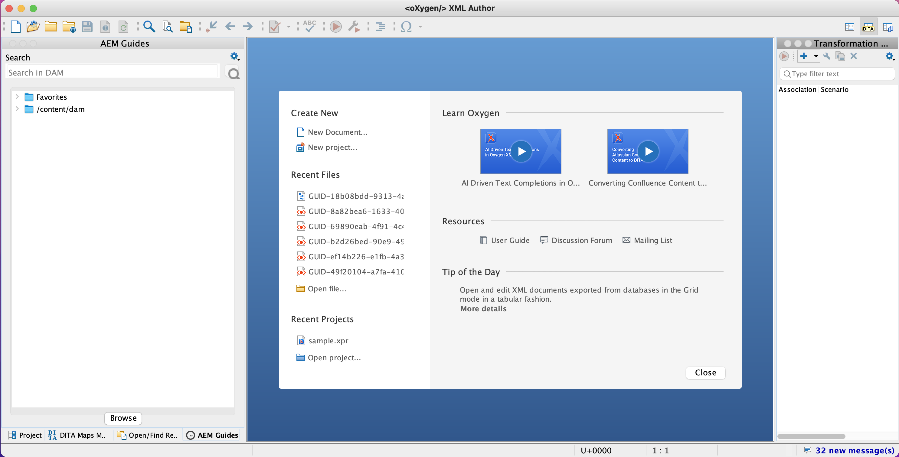

# Oxygen-Plug-in für Adobe Experience Manager Guides {#id1645H6010Q5}

Das Oxygen-Plug-in für Adobe Experience Manager Guides \(in diesem Handbuch unter der Bezeichnung Oxygen-Plug-in für AEM Guides ) ermöglicht die Verbindung des Oxygen XML Author-Service mit dem Adobe Experience Manager \(AEM\)-Repository für die Inhaltserstellung und -verwaltung. Sie können das Plug-in verwenden, um Dateien zu durchsuchen, zu suchen und zu öffnen, Dateien ein- und auszuchecken oder Ordner und Dateien in das AEM-Repository hochzuladen. Über das Bedienfeld AEM Guides im Desktop-Programm können Sie die gewünschten Ordner \(aus dem AEM-Repository\) zur Liste der Favoritenordner markieren, um schnell darauf zuzugreifen. Darüber hinaus können Sie ein Package in der AEM-Web-Oberfläche installieren und Ihre DITA-Dateien in Oxygen XML Author direkt über die AEM-Web-Oberfläche öffnen.

## Herunterladen und installieren {#id1826M0L0PUI}

Das Oxygen-Plug-in für AEM Guides wird über Ihr Adobe Software Distribution-Portal bereitgestellt. Suchen Sie auf der Registerkarte &quot;Experience Manager&quot; nach „Sauerstoff“ und laden Sie dann das Plug-in-Installationsprogramm vom [Adobe Software Distribution Portal](https://experience.adobe.com/#/downloads/content/software-distribution/en/general.html) herunter.

>[!NOTE]
>
>Überprüfen Sie in den Versionshinweisen für die jeweilige Adobe Experience Manager Guides die Kompatibilität der Oxygen Connector-Version.

Sobald Sie das Installationsprogramm haben, installieren Sie es auf Ihrem lokalen Computer, auf dem der Oxygen XML Author installiert ist. Bevor Sie mit der Installation beginnen, müssen Sie sicherstellen, dass Ihr System die technischen Anforderungen für die Installation des Oxygen Plugins für AEM Guides erfüllt.

### Technische Anforderungen

- Oxygen XML Author, Version 26.1

- Adobe Experience Manager Guides Version 4.6 oder höher

- Adobe Experience Manager Version 6.5 mit Service Pack 21, 20 und 19

- Von Oxygen XML Author Version 26.1 unterstütztes Betriebssystem

- Java Development Kit
   - Oracle SE 8 JRE 1.8

### Installieren des Plug-ins unter Windows

>[!IMPORTANT]
>
>Wenn Sie eine ältere Version des Plug-ins auf Ihrem System installiert haben, stellen Sie sicher, dass Sie es deinstallieren, bevor Sie den Installationsprozess starten. Deinstallationsanweisungen finden Sie **Abschnitt** Deinstallieren von Paketen“ im [Arbeiten mit Paketen](https://helpx.adobe.com/de/experience-manager/6-4/sites/administering/using/package-manager.html).

Führen Sie die folgenden Schritte auf dem System durch, auf dem Oxygen XML Author installiert ist:

1. Starten Sie die `.exe` des Installationsprogramms.

   Der Begrüßungsbildschirm des Installationsassistenten wird angezeigt.

1. Klicken Sie **Weiter** und navigieren Sie zu dem Speicherort, an dem die .exe-Datei von Oxygen XML Author verfügbar ist.

1. Wählen Sie die Datei aus und klicken Sie auf **Öffnen**.

   Der Speicherort der ausgewählten Datei wird im Installationsassistenten hinzugefügt.

1. Klicken Sie auf **Weiter**.

1. Klicken Sie auf **Installieren**.

1. Klicken Sie **Beenden**, um den Installationsassistenten zu schließen.
1. Starten Sie Oxygen XML Author.

   Das AEM Guides-Bedienfeld wird in der Oxygen XML-Autoreninstanz angezeigt.

   {width="800" align="left"}

   >[!NOTE]
   >
   >Wenn das Bedienfeld &quot;AEM Guides&quot; nicht angezeigt wird, finden Sie weitere Informationen in den Problemumgehungen im Abschnitt zur Fehlerbehebung [Fehlendes Bedienfeld &quot;AEM Guides](#id192BH200ZAX).


### Installieren des Plug-ins auf Mac

>[!IMPORTANT]
>
>Wenn Sie eine ältere Version des Plug-ins auf Ihrem System installiert haben, stellen Sie sicher, dass Sie es deinstallieren, bevor Sie den Installationsprozess starten. Siehe den **Deinstallieren von Paketen** im Abschnitt [So arbeiten Sie mit Paketen](https://helpx.adobe.com/de/experience-manager/6-4/sites/administering/using/package-manager.html) des Artikels Deinstallationsanweisungen.

Führen Sie die folgenden Schritte auf dem System durch, auf dem Oxygen XML Author installiert ist:

1. Suchen Sie die .dmg-Datei des Plug-ins auf Ihrem System.

1. Doppelklicken Sie auf die .dmg-Datei, um den Dateiinhalt zu öffnen.

   Die DMG-Datei enthält den Ordner „aem-connector-x.x“ und eine Datei „aem-connector-x.x-setup“.

   >[!NOTE]
   >
   >x.x in den Dateinamen ist die Versionsnummer des Plug-ins.

1. Kopieren Sie den Ordner aem-connector-x.x in den Ordner „plugins“ von Oxygen XML Author.
1. Doppelklicken Sie auf die Datei aem-connector-x.x-setup , um das Installationsprogramm zu starten.

1. Starten Sie Oxygen XML Author.

   Das AEM Guides-Bedienfeld wird in der Oxygen XML-Autoreninstanz angezeigt.

    {width="800" align="left"}

   >[!NOTE]
   >
   >Wenn das Bedienfeld &quot;AEM Guides&quot; nicht angezeigt wird, finden Sie weitere Informationen in den Problemumgehungen im Abschnitt zur Fehlerbehebung [Fehlendes Bedienfeld &quot;AEM Guides](#id192BH200ZAX).


### Package zur Aktivierung der Dokumentenbearbeitungsfunktion über die AEM-Web-Oberfläche installieren {#id182CE0Q0TY4}

Als Autorin bzw. Autor können Sie Ihre DITA-Karten oder -Themen in Oxygen XML Author direkt über die AEM-Web-Oberfläche öffnen und bearbeiten. Um diese Funktion in der AEM-Web-Benutzeroberfläche zu aktivieren, muss Ihr AEM-Administrator ein Paket in Ihrer AEM-Autoreninstanz installieren.

Führen Sie als AEM-Administrator die folgenden Schritte aus, um das Paket zu installieren:

1. Rufen Sie die ZIP-Datei des Pakets von Ihrem IT-Team ab.
1. Melden Sie sich bei Ihrer AEM-Instanz *\(als Administrator\)* an und navigieren Sie zum CRX Package Manager. Die Standard-URL für den Zugriff auf den Package Manager lautet

   `http://<server name>:<port>/crx/packmgr/index.jsp`

   Package Manager verwaltet die Pakete auf Ihrer lokalen AEM-Installation. Weitere Informationen zum Arbeiten mit dem Package Manager finden Sie unter [So arbeiten Sie mit Paketen](https://experienceleague.adobe.com/docs/experience-manager-cloud-service/content/implementing/developer-tools/package-manager.html?lang=de) in der AEM-Dokumentation.

    {width="650" align="left"}

1. Um das Sauerstoffpaket hochzuladen, klicken Sie auf **Paket hochladen**.
1. Navigieren Sie im Dialogfeld Paket hochladen zur Sauerstoffpaketdatei, die Sie in Schritt 1 heruntergeladen haben, und klicken Sie auf OK.

   Das Paket wird auf Ihre AEM-Instanz hochgeladen.

1. Um den Installationsprozess zu starten, klicken Sie auf **Installieren**.

   {width="650" align="left"}

1. Klicken Sie im Dialogfeld Paket installieren auf **Installieren**.
1. Klicken Sie nach Abschluss der Installation oben links im CRX Package Manager auf die Schaltfläche „Startseite“.
1. Wählen Sie eine DITA-Datei in Ihrem Assets-Ordner aus.

   **In Sauerstoff bearbeiten** ist in der Symbolleiste verfügbar. Weitere Informationen zur Verwendung dieser Option finden Sie unter [DITA-Thema in Oxygen XML Author über die AEM-Web-Benutzeroberfläche öffnen](#id182CE0I905Z).

   >[!NOTE]
   >
   >Die **Bearbeiten in Oxygen** ist sichtbar, wenn Sie ein DITA-Thema auswählen. Wenn Sie mehrere Themen auswählen, wird die Option nicht angezeigt.


## Konfigurieren des Oxygen-Plug-ins für AEM Guides {#id1826KF00AHS}

Nachdem Sie das Plug-in heruntergeladen und installiert haben, müssen Sie Folgendes konfigurieren, um mit dem Plug-in arbeiten zu können:

- **Web-Authentifizierungseinstellungen**: Einstellungen für die SSO-Authentifizierung im Plug-in für AEM Guides.
- **Allgemeine Einstellungen**: Verbindungseinstellungen für das Plug-in, z. B. AEM-Server-URL, Anmeldedaten usw.
- **Präferenz für die Anpassung von Profilattributen und Dateinamen in Querverweisen**: Diese Konfiguration ist für die Profilattributschemata für die Dokumentationssätze erforderlich.

### Web-Authentifizierungseinstellungen

JxBrowser wird für die SSO-Authentifizierung durch das Oxygen-Connector-Plug-in verwendet. Es handelt sich um einen Chromium-basierten Browser. Für Java 9+ ist Zugriff auf nicht öffentliche APIs erforderlich und für müssen Sie diesen Zugriff explizit für JxBrowser gewähren. Weitere Informationen finden Sie unter [Fehlerbehebung bei JxBrowser](https://jxbrowser-support.teamdev.com/docs/guides/troubleshooting/issues.html).

Aktualisieren Sie die angegebenen Dateien, um die Web-Authentifizierungseinstellungen im Oxygen-Plug-in für AEM Guides zu konfigurieren:

>[!NOTE]
>
>Erstellen Sie eine Sicherung der Datei, bevor Sie sie aktualisieren.

**Für Mac und Oxygen 26.1**

Fügen Sie die folgenden Zeilen in env.sh hinzu

```java
--illegal-access=permit\
--add-opens=java.desktop/javax.swing.plaf.basic=ALL-UNNAMED\
--add-exports=javafx.controls/com.sun.javafx.scene.control=ALL-UNNAMED\
--add-exports=javafx.graphics/com.sun.javafx.stage=ALL-UNNAMED\
--add-exports=javafx.graphics/com.sun.javafx.scene=ALL-UNNAMED\
--add-exports=javafx.graphics/com.sun.javafx.scene.traversal=ALL-UNNAMED\
--add-exports=javafx.graphics/com.sun.javafx.tk=ALL-UNNAMED\
--add-exports=javafx.graphics/com.sun.glass.ui=ALL-UNNAMED\
--add-opens=javafx.graphics/com.sun.glass.ui=ALL-UNNAMED\
--add-opens=javafx.graphics/javafx.stage=ALL-UNNAMED\
--add-opens=javafx.graphics/com.sun.javafx.tk.quantum=ALL-UNNAMED\
--add-exports=java.desktop/sun.awt=ALL-UNNAMED\
--add-opens javafx.swing/javafx.embed.swing=ALL-UNNAMED
```

Fügen Sie die folgenden Zeilen in der Datei „sauerauthor.sh“ hinzu

```java
-Djdk.module.illegalAccess=permit\-Djava.ipc.external=true\
```

**Für Windows und Oxygen 26.1**

Fügen Sie in „env.bat“ die folgenden Zeilen hinzu

```java
--illegal-access=permit --add-opens=java.desktop/javax.swing.plaf.basic=ALL-UNNAMED --add-exports=javafx.controls/com.sun.javafx.scene.control=ALL-UNNAMED --add-exports=javafx.graphics/com.sun.javafx.stage=ALL-UNNAMED --add-exports=javafx.graphics/com.sun.javafx.scene=ALL-UNNAMED --add-exports=javafx.graphics/com.sun.javafx.scene.traversal=ALL-UNNAMED --add-exports=javafx.graphics/com.sun.javafx.tk=ALL-UNNAMED --add-exports=javafx.graphics/com.sun.glass.ui=ALL-UNNAMED --add-opens=javafx.graphics/com.sun.glass.ui=ALL-UNNAMED --add-opens=javafx.graphics/javafx.stage=ALL-UNNAMED --add-opens=javafx.graphics/com.sun.javafx.tk.quantum=ALL-UNNAMED --add-exports=java.desktop/sun.awt=ALL-UNNAMED --add-opens javafx.swing/javafx.embed.swing=ALL-UNNAMED
```

Fügen Sie die folgenden Zeilen in der Datei „sauerauthor.bat“ hinzu

```java
-Djdk.module.illegalAccess=permit -Djava.ipc.external=true
```

>[!NOTE]
>
>Als Administrator müssen Sie sauerstofffrei von sauerstoffauthor.sh für Mac und sauerstoffauthor.bat für Windows ausführen.

### Allgemeine Einstellungen

Führen Sie die folgenden Schritte aus, um die Verbindungseinstellungen im Oxygen-Plug-in für Adobe Experience Manager Guides zu konfigurieren:

1. Klicken Sie im AEM Guides-Bedienfeld auf das Symbol Einstellungen und wählen Sie dann **Einstellungen** aus.

   {width="800" align="left"}

1. Geben Sie die folgenden Details an:
   - **Server URL**: URL des AEM-Servers, z. B.:

     ```http
     http[s]://<host>:<port>
     ```

     Geben Sie unter der obigen URL den Hostnamen und den Port des Servers an, auf dem der AEM-Server bereitgestellt wird.

     >[!IMPORTANT]
     >
     >Wenn Ihr AEM-Server auf Port 80 oder 443 bereitgestellt wird, müssen Sie ihn nicht in der URL angeben.

   - **Authentifizierung:** Wählen Sie **Einfach \(Benutzername/Kennwort\)** oder **Web-Authentifizierung**. Wenn Sie die **Einfach**-Authentifizierung auswählen, müssen Sie den **Benutzernamen** und **Kennwort** im Dialogfeld „Voreinstellungen“ eingeben.

     Wenn Sie Web-Authentifizierung auswählen, wird der AEM-Anmeldebildschirm angezeigt. Geben Sie Ihre Anmeldedaten ein und klicken Sie auf **Schaltfläche „Anmelden**. Bei erfolgreicher Anmeldung wird der AEM-Anmeldebildschirm geschlossen und das Bedienfeld &quot;AEM Guides&quot; zeigt die Dateiliste vom AEM-Server an.

   - **Verbindungs-Timeout**: Geben Sie die Zeit in Sekunden an, die der Client auf eine Antwort vom AEM-Server wartet. Falls innerhalb der angegebenen Zeit keine Antwort vom Server eingeht, wird die Anfrage beendet. Der Standardwert ist 20 Sekunden.

   - **Lokaler Ordner**: Speicherort auf dem lokalen Computer, auf dem die Dateien aus dem AEM-Repository nach dem Auschecken gespeichert werden. Wenn Sie einen Speicherort angeben, der nicht auf dem Laufwerk vorhanden ist, erstellt das Plug-in diesen Speicherort.
   - **Datei beim Auschecken öffnen**: Wenn diese Option aktiviert ist, werden die Dateien beim Auschecken geöffnet.
   - **Datei beim Einchecken schließen**: Wenn diese Option aktiviert ist, werden die Dateien beim Einchecken geschlossen. Vor dem Schließen der Datei wird ein Popup angezeigt, in dem Sie die Versionskommentare angeben können.
   - **Eincheckdialogfeld beim Schließen der Datei anzeigen**: Wenn diese Option ausgewählt ist, wird beim Schließen einer Datei ein Popup angezeigt. Im Popup-Fenster können Sie die Datei einchecken oder die Datei schließen, ohne sie einzuchecken.
   - **Datei beim Öffnen automatisch auschecken**: Wenn diese Option aktiviert ist, wird sie durch Doppelklicken auf eine Datei automatisch ausgecheckt und zur Bearbeitung geöffnet. Wenn die Datei bereits ausgecheckt ist, wird sie einfach zur Bearbeitung geöffnet. Wenn diese Option nicht ausgewählt ist, wird beim Öffnen einer Datei, für die keine Sperre vorhanden ist, diese im schreibgeschützten Modus geöffnet.
1. Klicken Sie auf **OK**.

### Präferenz für die Anpassung von Profilattributen und Dateinamen in Querverweisen {#id1827K0D0OHT}

Sie müssen die Voreinstellungen in Oxygen XML Author konfigurieren, um das mit den DITA-Themen im AEM-Repository verknüpfte Profilattribut zu verwenden. Sie müssen außerdem die Voreinstellung so konfigurieren, dass Dateinamen anstelle von GUIDs in den Querverweisen angezeigt werden.

Führen Sie die folgenden Schritte aus, um Profilattribute und Querverweise zu konfigurieren:

1. Klicken Sie in Oxygen XML Author auf **Optionen** \> **Voreinstellungen**.
1. Wählen Sie auf der **Dokumenttypzuordnung** die Option **DITA** und klicken Sie dann auf **Erweitern**.

   {width="650" align="left"}

1. Wählen Sie auf **Registerkarte** Klassenpfad`com.adobe.o2.connector` in der Dropdown **Verwenden des übergeordneten Klassenladers vom Plug-in mit ID** aus.

   {width="650" align="left"}

1. Nehmen **auf** Registerkarte „Erweiterungen“ die folgenden Änderungen vor:

   - Klicken Sie **Auswählen** neben dem Bundle **Erweiterungen** und wählen Sie aus.   `LinkResolverExtensionBundle - com.adobe.o2.framework.extn` in der **Class**-Liste. Klicken Sie auf **OK**.

      {width="650" align="left"}
   - Klicken Sie **Auswählen** neben dem **Author Extension State Listener** unter **Individuelle Erweiterungen** und wählen Sie `CustomAuthorExtensionStateListener - com.adobe.o2.framework.extn` in der **Class**-Liste aus. Klicken Sie auf **OK**.
   - Klicken Sie **Auswählen** neben dem **Editor für benutzerdefinierte Attributwerte erstellen** unter **Individuelle Erweiterungen** und wählen Sie `CustomValueEditor - com.adobe.o2.framework.extn` in der Liste **Klasse** aus. Klicken Sie auf **OK**.
   - Klicken Sie **Auswählen** neben dem **Author External Object Insertion Handler** unter **Individuelle Erweiterungen** und wählen Sie `CustomURLInsertionHandler - com.adobe.o2.ui ` in der Liste **Klasse** aus. Klicken Sie auf **OK**.


   Der folgende Screenshot zeigt die konfigurierte Registerkarte **Erweiterung** für DITA-Themen:
   
1. Klicken **in** Dialogfeldern auf OK, um die Änderungen zu speichern.

### Konfigurieren der DITA-Kartenerweiterung

Die DITA Map-Erweiterungskonfiguration ist erforderlich, um das Öffnen von Map-Dateien in Oxygen XML Author direkt über die AEM-Web-Oberfläche zu ermöglichen. Diese Konfigurationen ähneln den Konfigurationen für Profilattribute, die im vorherigen Verfahren vorgenommen wurden.

Führen Sie die folgenden Schritte aus, um die DITA Map-Erweiterung zu konfigurieren:

1. Klicken Sie in Oxygen XML Author auf **Optionen** \> **Voreinstellungen**.
1. Wählen Sie auf der **Dokumenttypzuordnung** die Option **DITA-Zuordnung** und klicken Sie dann auf **Erweitern**.
1. Wählen Sie auf **Registerkarte** Klassenpfad“ com.adobe.o2.connector in der Dropdown-Liste **Übergeordnetes Class-Ladeprogramm vom Plug-in mit ID verwenden** aus.
1. Nehmen **auf** Registerkarte „Erweiterungen“ die folgenden Änderungen vor:
   - Klicken Sie **Auswählen** neben dem Bundle **Erweiterungen** und wählen Sie aus.   `com.adobe.o2.framework.extn.LinkResolverDITAMapExtensionBundle` in der **Class**-Liste. Klicken Sie auf **OK**.

   - Klicken Sie **Auswählen** neben dem **Author Extension State Listener** unter **Individuelle Erweiterungen** und wählen Sie `CustomDITAMapAuthorExtensionStateListener - com.adobe.o2.framework.extn` in der **Class**-Liste aus. Klicken Sie auf **OK**.

   - Klicken Sie **Auswählen** neben dem **Author External Object Insertion Handler** unter **Individuelle Erweiterungen** und wählen Sie `CustomURLInsertionHandler - com.adobe.o2.ui ` in der Liste **Klasse** aus. Klicken Sie auf **OK**.

   - Klicken Sie **Auswählen** neben dem **Editor für benutzerdefinierte Attributwerte erstellen** unter **Individuelle Erweiterungen** und wählen Sie `CustomValueEditor - com.adobe.o2.framework.extn` in der Liste **Klasse** aus. Klicken Sie auf **OK**.

   - Klicken Sie **Auswählen** neben dem **Verweisauflöser** unter **Individuelle Erweiterungen** und wählen Sie `CustomDITAMapReferenceResolver - com.adobe.o2` in der Liste **Klasse** aus. Klicken Sie auf **OK**.
   - *\(Optional\)* Wenn Sie Verweise beim Öffnen einer Zuordnungsdatei nicht auflösen möchten, müssen Sie die folgende zusätzliche Konfiguration durchführen:

   Der folgende Screenshot zeigt die konfigurierte Registerkarte **Erweiterung**:
   

1. Klicken **in** Dialogfeldern auf OK, um die Änderungen zu speichern.

## Arbeiten mit dem Oxygen-Plug-in für AEM Guides {#id1826JG00WY4}

### AEM Guides Panel

Der folgende Bildschirm zeigt das Bedienfeld &quot;AEM Guides&quot;.

{width="550" align="left"}

**A**\) Zeigt die Suchleiste an.

**B**\) Zeigt den Ordner „Favoriten“ an. Standardmäßig ist es leer. Sie können Ordner aus dem AEM-Repository als Favoriten hinzufügen. Die Favoritenordner werden dann hier angezeigt.

**C**\) Der DAM-Ordner zeigt das AEM-Repository an. Sie können die Ordneransicht erweitern und reduzieren.

**D**\) Das Symbol Einstellungen \(Zahnrad\) mit folgenden Optionen:

- **Verbinden**: Wählen Sie diese Option, um eine Verbindung zum AEM-Server herzustellen. Die Option ist deaktiviert, wenn die Oxygen XML-Autoreninstanz mit dem AEM-Server verbunden ist.
- **Aktualisieren**: Wählen Sie diese Option, um den neuesten Status der Dateien und Ordner aus dem AEM-Repository abzurufen.

  >[!NOTE]
  >
  >Stellen Sie sicher, dass Sie Ihre Dateien speichern, bevor Sie sie aktualisieren. Wenn Sie die Option **Aktualisieren** auswählen, erhalten Sie eine Warnung, dass Sie Ihre Dateien speichern müssen, bevor Sie sie aktualisieren. Wenn Sie Ihre Dateien nicht gespeichert haben, können Sie auf &quot;**&quot; klicken** sie speichern.

- **Einstellungen**: Sie können diese Option verwenden, um das Dialogfeld „Allgemeine Voreinstellungen“ des Plug-ins zu öffnen.
- **Abmelden**: Wählen Sie diese Option, um die AEM-Serververbindung zu schließen. Diese Option ist nur verfügbar, wenn Sie den Web-Authentifizierungsmodus verwenden.

### Kontextmenüfunktionen

Die Funktionen des Oxygen Plugins für AEM Guides sind verfügbar, wenn Sie mit der rechten Maustaste auf einen Ordner oder eine Datei im AEM-Repository klicken. Die für die Ordner verfügbaren Funktionen unterscheiden sich von den Dateien. Im Folgenden finden Sie eine vollständige Liste der Funktionen im Kontextmenü des Oxygen-Plug-ins für AEM Guides:

- **Öffnen**: Öffnet die ausgewählte Datei oder erweitert den ausgewählten Ordner.
- **Öffnen in**: Sie können die ausgewählte Datei im Web-Editor von AEM Guides, im Zuordnungs-Dashboard oder im Zuordnungs-Editor öffnen. Weitere Informationen zu diesen Optionen finden Sie unter [Datei im AEM Guides-Editor öffnen](#id195GH0V30KX).
- **Auschecken**: Checkt eine Datei aus dem AEM-Repository aus. Weitere Informationen finden Sie unter [Dateien auschecken](#id195HC020TS4).
- **Auschecken bei abhängigen**: Checkt eine Datei mit ihren direkten Verweisen aus. Weitere Informationen finden Sie unter [Dateien auschecken](#id195HC020TS4).
- **Mit schreibgeschützten abhängigen Elementen auschecken**: Checkt die ausgewählte Datei zusammen mit den abhängigen Elementen aus. Sie können keine Änderungen an den abhängigen Dateien vornehmen. Weitere Informationen finden Sie unter [Dateien auschecken](#id195HC020TS4).
- **Auschecken abbrechen**: Bricht die ausgecheckte Datei ab, schließt die Datei im Editor und setzt die Änderungen auf die letzte Version der auf dem Server gespeicherten Datei zurück.
- **Aktualisieren**: Ruft im Falle einer Datei die neueste Kopie der Datei aus dem AEM-Repository ab. Für einen Ordner ruft es die Ordnerstruktur und den Dateistatus ab. Das bedeutet, dass, wenn eine Datei hinzugefügt wird, diese in der AEM Guides-Ansicht angezeigt wird. Wenn eine Datei auf dem AEM-Server ausgecheckt ist, wird beim Aktualisieren in Oxygen Author die Datei als ausgecheckt angezeigt. Dadurch wird jedoch die Dateiliste in der Ansicht *Dateien ausgecheckt in AEM Guides* nicht aktualisiert.
- **Ausgecheckte Dateien aktualisieren**: Aktualisiert die Liste der ausgecheckten Dateien in der Ansicht *Dateien ausgecheckt in AEM Guides*. Wenn eine Datei auf dem AEM-Server ausgecheckt ist, wird durch eine Aktualisierung die Liste der ausgecheckten Dateien in der Ansicht *Dateien ausgecheckt in AEM Guides* aktualisiert. Wenn jedoch eine neue Datei hinzugefügt oder der Status einer Datei geändert wurde, wird sie in der AEM Guides-Baumstrukturansicht nicht aktualisiert. Um den Dateistatus auf AEM zu aktualisieren, müssen Sie eine Aktualisierung durchführen.
- **Einchecken**: Checkt eine Datei ein, die Sie ausgecheckt haben. Weitere Informationen finden Sie unter [Einchecken einer Datei](#id182CF0J0FHS).
- **Einchecken bei abhängigen**: Wenn Sie Dateien mit abhängigen Elementen ausgecheckt haben, werden die Hauptdatei und die abhängigen Elemente durch diese Option eingecheckt. Weitere Informationen finden Sie unter [Einchecken einer Datei](#id182CF0J0FHS).
- **Ordner erstellen**: Erstellt einen Ordner im AEM-Repository. Diese Option ist nur auf Ordnerebene verfügbar.
- **Datei hochladen\(s\)**: Lädt einzelne oder mehrere Dateien hoch. Weitere Informationen finden Sie unter [Dateien und Ordner hochladen](#id195HC03F03J).
- **Mit abhängigen Elementen hochladen**: Lädt DITA-Dateien \(XML, DITA, Book Map oder DITA Map\) mit den abhängigen Elementen hoch. Weitere Informationen finden Sie unter [Dateien und Ordner hochladen](#id195HC03F03J).
- **Upload-**: Lädt einen Ordner in das AEM-Repository hoch. Weitere Informationen finden Sie unter [Dateien und Ordner hochladen](#id195HC03F03J).
- **Zu Favoriten hinzufügen**: Fügt einen Ordner zum Ordner *Favoriten* im Bedienfeld &quot;AEM Guides&quot; hinzu. Es wird empfohlen, hier Ihren Arbeitsordner hinzuzufügen, um die Synchronisierung von Dateien und Dateistatus über AEM zu vereinfachen.
- **Aus Favoriten entfernen**: Entfernt einen Ordner aus *Favoriten*. Weitere Informationen finden Sie unter [Favoriten hinzufügen oder entfernen](#id195HC04405P).
- **Metadaten anzeigen**: Zeigt die Metadaten wie DITA-Klasse, Titel des Dokuments, Typ, UUID und andere mit einer Datei verknüpfte Informationen an. Weitere Informationen finden Sie unter [Anzeigen der Metadaten einer Datei](#id195GHN0H05C).
- **Versionen anzeigen**: Zeigt den Versionsverlauf einer Datei an. Weitere Informationen finden Sie unter [Anzeigen des Versionsverlaufs einer Datei](#id195GI000D5Q).

### Öffnen Sie eine Datei in Oxygen XML Author {#id195GHJ0A0UB}

Sobald Sie eine Verbindung zum AEM-Repository hergestellt haben, können Sie Dateien zur Bearbeitung in der Oxygen XML-Autoreninstanz öffnen. Führen Sie die folgenden Schritte aus, um eine Datei zur Bearbeitung in der Oxygen XML-Autoreninstanz zu öffnen:

1. Klicken Sie im AEM Guides-Bedienfeld mit der rechten Maustaste auf eine Datei, die Sie zur Bearbeitung öffnen möchten.

1. Wählen **Öffnen** aus dem Kontextmenü aus. Oder Sie können auf die Datei doppelklicken, um sie zu öffnen.

   Die Datei wird im Editor von Oxygen XML Author geöffnet.

    {width="800" align="left"}

   Wenn Sie den Mauszeiger über die Registerkarte einer Datei bewegen, wird Ihnen der Serverpfad zusammen mit der UUID angezeigt. Im obigen Screenshot ist die UUID des Dokuments hervorgehoben.

>[!NOTE]
>
>Wenn Sie den Mauszeiger über die Bilder oder Videos in einem Thema im Editor der Oxygen XML-Autoreninstanz bewegen, wird nur die UUID des ausgewählten Elements angezeigt. Um sie im Repository zu finden, klicken Sie mit der rechten Maustaste auf das angezeigte Bild oder das Objekt-Tag (nur bei Videos, Audios und anderen Mediendateien) und wählen Sie **Im Repository anzeigen**.


Wenn Sie die Option **Datei beim Öffnen automatisch auschecken** im Dialogfeld „Voreinstellungen“ ausgewählt haben, wird die Datei beim Öffnen automatisch ausgecheckt und steht zur Bearbeitung zur Verfügung. Um eine Datei zu öffnen, können Sie entweder auf einen Dateinamen doppelklicken oder mit der rechten Maustaste auf den Dateinamen klicken und **Öffnen** aus dem Kontextmenü auswählen. Wenn diese Option nicht ausgewählt ist, wird die Datei im schreibgeschützten Modus geöffnet.


### Datei im Editor von AEM Guides öffnen {#id195GH0V30KX}

Wenn Sie die in AEM Guides verfügbaren Editoren verwenden möchten, wählen Sie dazu die erforderliche Option im Kontextmenü aus. Führen Sie die folgenden Schritte aus, um den Editor von AEM Guides anstelle des Editors von Oxygen XML Author zu verwenden:

1. Klicken Sie im AEM Guides-Bedienfeld mit der rechten Maustaste auf eine Datei, die Sie zur Bearbeitung öffnen möchten.

1. Wählen **Öffnen in** aus dem Kontextmenü und wählen Sie aus den folgenden Optionen aus:

   - **Webthema-Editor**: Wenn es sich bei der Datei, die Sie öffnen möchten, um eine XML- oder DITA-Datei handelt, können Sie sie zur Bearbeitung im Webeditor öffnen. Wählen Sie die Option **Webthema-Editor**, um die ausgewählte Datei zur Bearbeitung im Web-Editor zu öffnen.

   - **Map Dashboard**: Sie können im Map Dashboard eine DITAMAP-Datei bearbeiten, in der Sie verschiedene Vorgänge mit der Map-Datei durchführen können. Diese Vorgänge hängen von der Rolle/Gruppe ab, der Sie angehören.

   - **Web DITA Map Editor**: Wenn Sie die .ditamap-Datei zur Bearbeitung im Map Editor öffnen möchten, wählen Sie diese Option. Mit der Option „DITA-Zuordnungs-Editor“ können Sie Themen hinzufügen oder entfernen, Beziehungstabellen hinzufügen und andere Vorgänge für Ihre Zuordnung durchführen.


### Dateien auschecken {#id195HC020TS4}

Wenn Sie eine Datei auschecken, wird sie lokal auf Ihrem System gespeichert und für die Bearbeitung im AEM-Repository gesperrt. Führen Sie die folgenden Schritte aus, um eine Datei auszuchecken:

1. Sie können Ihre Dateien auf eine der folgenden Arten auschecken:
   - Klicken Sie mit der rechten Maustaste im AEM Guides-Bedienfeld auf eine Datei.
   - Klicken Sie mit der rechten Maustaste auf die Registerkarte Zuordnung im Bedienfeld DITA-Zuordnungs-Manager .
   - Klicken Sie mit der rechten Maustaste im Bedienfeld DITA Maps Manager auf eine Datei.
   - Klicken Sie mit der rechten Maustaste auf die Registerkarte Datei , wenn Sie eine Karte oder ein Thema im Editor öffnen.

1. Wählen Sie eine der folgenden Optionen aus:
   - **Auschecken:** Checkt eine Datei aus dem AEM-Repository aus und stellt sie zur Bearbeitung bereit.
   - **Auschecken bei abhängigen**: Checkt eine Datei mit ihren direkten Verweisen aus. Mit dieser Option können Sie Änderungen an übergeordneten und untergeordneten Seiten vornehmen. Das Oxygen-Plug-in für AEM Guides unterstützt das Auschecken einer Ebene von Angehörigen. Beispiel: Map A verweist auf Thema A und Thema A verweist auf Thema B. Beim Auschecken von Map A wird Thema A unabhängig von seiner Ebene in der Inhaltsverzeichnishierarchie ausgecheckt. Thema B wird jedoch nicht geprüft, da es nicht direkt mit Karte A verknüpft ist.
   - **Auschecken mit schreibgeschützten abhängigen Elementen**: Checkt eine Datei aus und lädt deren abhängige Elemente als schreibgeschützte Kopien auf Ihren lokalen Computer herunter. Sie können keine Änderungen an den abhängigen Dateien vornehmen.

Wenn Sie die Option **Dateien beim Auschecken öffnen** \(im Dialogfeld „Voreinstellungen\) ausgewählt haben, wird beim Auschecken einer Datei die Datei automatisch zur Bearbeitung geöffnet.

Wenn Sie die Option **Datei beim Öffnen automatisch auschecken** \(im Dialogfeld „Voreinstellungen\) ausgewählt haben, wird die Datei beim Öffnen automatisch ausgecheckt und zur Bearbeitung bereitgestellt. Um eine Datei zu öffnen, können Sie entweder auf einen Dateinamen doppelklicken oder mit der rechten Maustaste auf den Dateinamen klicken und **Öffnen** aus dem Kontextmenü auswählen.

Wenn eine Datei ausgecheckt wird, ändert sich das Symbol der Datei und zeigt den Status Gesperrt an.

{width="650" align="left"}

Im obigen Screenshot wird eine von einem anderen Benutzer ausgecheckte Datei mit einem schwarzen Sperrsymbol \(A\) angezeigt. Die vom aktuellen Benutzer ausgecheckte Datei wird mit einem grünen Häkchen \(B\) angezeigt.

>[!NOTE]
>
>Wenn die ausgecheckte Datei gelöscht oder in einen anderen Ordner in AEM verschoben wird, erhalten Sie beim Einchecken der Datei eine Fehlermeldung. Vergewissern Sie sich, dass die ausgecheckte Datei nicht über die AEM-Web-Oberfläche verschoben oder gelöscht wird.

### Einchecken einer Datei {#id182CF0J0FHS}

Beim Einchecken einer Datei wird die lokale Kopie aus Ihrem System im AEM-Repository gespeichert und die Dateisperre aufgehoben. Führen Sie die folgenden Schritte aus, um eine Datei einzuchecken:

1. Speichern Sie Ihre Datei, indem Sie auf **Datei** \> **Speichern** klicken.

1. Klicken Sie mit der rechten Maustaste auf eine ausgecheckte Datei oder Karte an einem der folgenden Orte:
   - AEM Guides Panel
   - DITA Maps Manager-Bedienfeld
   - Registerkarte „Datei“ beim Öffnen einer Zuordnung oder eines Themas im Editor.
   - Die Registerkarte „Zuordnung“ im Bedienfeld „DITA-Zuordnungs-Manager“.

1. Wählen Sie aus den beiden folgenden Optionen:

   - **Einchecken**: Checkt die ausgewählte Datei aus Ihrem lokalen System in das AEM-Repository ein.
   - **Einchecken bei abhängigen Elementen:** Wenn Sie eine Datei zusammen mit den abhängigen Elementen ausgecheckt haben, verwenden Sie diese Option, um alle abhängigen Dateien in einem einzigen Vorgang einzuchecken. Bei Auswahl dieser Option wird das Dialogfeld Einchecken mit allen abhängigen Dateien angezeigt. Klicken Sie auf OK , um alle Dateien gleichzeitig einzuchecken.

   Wenn Sie abhängige Dateien nicht ausgecheckt haben und dann diese Option wählen, werden nur die abhängigen Dateien eingecheckt, die Sie \(separat\) ausgecheckt haben. Ihnen wird eine Liste von Dateien angezeigt, die nicht eingecheckt werden konnten:

   {width="800" align="left"}

   Es wird dringend empfohlen, eine ausgecheckte Datei nicht zu verschieben. Wenn eine ausgecheckte Datei jedoch an einen anderen Speicherort verschoben wird, müssen Sie das Auschecken für diese Datei abbrechen. Wenn Sie Aktualisierungen an dieser Datei vornehmen möchten, checken Sie die Datei erneut aus, nehmen Sie Änderungen vor und checken Sie sie dann wieder ein. Wenn Sie versuchen, eine Datei einzuchecken, die von ihrem ursprünglichen Speicherort verschoben wurde, erhalten Sie einen Fehler.

   Wenn eine abhängige Datei in AEM ausgecheckt ist, wird beim Einchecken mit abhängigen Elementen die abhängige Datei nicht im Eincheckdialogfeld angezeigt. Um eine Liste der abhängigen Dateien abzurufen, die in AEM ausgecheckt sind, müssen Sie einen Ordner aktualisieren.

   Wenn Sie eine abhängige Datei über AEM eingecheckt haben, wird die Dateiliste in der Oxygen-Autoreninstanz erst aktualisiert, wenn Sie einen Ordner aktualisieren und ausgecheckte Dateien aktualisieren. Wenn Sie mit Angehörigen einen Check-in durchführen, bei dem einige Dateien über AEM eingecheckt wurden, wird ein Fehler angezeigt, in dem die Dateien aufgelistet werden, die nicht eingecheckt werden konnten.

1. \(Optional\) Fügen Sie im **Einchecken** oder im **Einchecken mit Angehörigen** einen Kommentar in das Textfeld **Versionskommentare** ein.

   >[!NOTE]
   >
   >Dieser Kommentar wird im AEM-Versionsverlauf der Datei angezeigt.

1. Fügen Sie im Textfeld **Label** im Dialogfeld **Einchecken** oder **Einchecken mit Angehörigen** Beschriftungen hinzu. Geben Sie einen Titel ein und drücken Sie die Eingabetaste. Beispiel: Version *2307*.

   Wenn Ihr Administrator eine vordefinierte Liste von Kennzeichnungen hat und diese in die `label.json` hochgeladen hat, werden diese Kennzeichnungen als Dropdown-Liste angezeigt. Sie können eine oder mehrere Beschriftungen aus dem Dropdown-Menü auswählen.

   {width="550" align="left"}

   Sie können derselben Version eines Themas mehrere Beschriftungen (durch Kommas getrennt) hinzufügen.  Beispiel: *Adobe*, *AEM*, *Guides*.
Sie können jedoch nicht dieselbe Bezeichnung zu den verschiedenen Versionen eines Themas hinzufügen. Wenn Sie eine Beschriftung hinzufügen, die Sie bereits zu einer früheren Version hinzugefügt haben, wird sie zur neuesten Version hinzugefügt und von der früheren Version entfernt.

   >[!NOTE]
   > 
   > Diese Beschriftungen werden im AEM-Versionsverlauf der Datei angezeigt.


1. Klicken Sie auf **OK**.

>[!NOTE]
>
>Wenn die ausgecheckte Datei gelöscht oder in einen anderen Ordner in AEM verschoben wird, erhalten Sie beim Einchecken der Datei eine Fehlermeldung. Vergewissern Sie sich, dass die ausgecheckte Datei nicht über die AEM-Web-Oberfläche verschoben oder gelöscht wird.

### In der AEM Guides-Ansicht ausgecheckte Dateien

Wenn Sie sich in mehreren Ordnern befinden, ist es nicht einfach herauszufinden, wie viele Dateien in einer Ansicht ausgecheckt sind. AEM Guides stellt in der AEM Guides-Ansicht ausgecheckte Dateien bereit. Dadurch erhalten Sie einen vollständigen Schnappschuss der aktuell ausgecheckten Dateien. In dieser Ansicht können Sie mithilfe von AEM Guides einfach feststellen, welche Dateien von Ihnen im AEM-Repository überprüft wurden. Führen Sie die folgenden Schritte aus, um auf diese Ansicht zuzugreifen und mit ihr zu arbeiten:

1. Klicken Sie **Fenster** \> **Ansicht anzeigen** \> **Dateien in AEM Guides ausgecheckt**.

   Die in der AEM Guides-Ansicht ausgecheckten Dateien werden angezeigt.

   {width="550" align="left"}

1. Klicken Sie mit der rechten Maustaste auf eine Datei in dieser Ansicht, um die folgenden Optionen anzuzeigen:

   - [Öffnen](#id195GH0V30KX)
   - [Öffnen in](#id195GH0V30KX)
   - Auschecken abbrechen
   - [Einchecken](#id182CF0J0FHS)
   - [Check-in mit Angehörigen](#id182CF0J0FHS)
   - [Anzeigen von Metadaten](#id195GHN0H05C)
   - [Versionen anzeigen](#id195GI000D5Q)

**Hinweise zu in der AEM Guides-Ansicht ausgecheckten Dateien:**

- Die *Dateien, die in der AEM Guides*-Ansicht ausgecheckt sind, verwaltet die Benutzersitzungen. Das bedeutet, dass Dateien, die vom aktuellen Benutzer ausgecheckt wurden, in der Ansicht über die Sitzungen desselben Benutzers hinweg gespeichert und verwaltet werden \(oder cache\).

- Wenn der/die Benutzende die Anmeldeinformationen für den AEM-Server ändert, werden die Daten \(oder cache\) der ausgecheckten Datei in der Ansicht zurückgesetzt. Der Benutzer muss manuell den Befehl *Ausgecheckte Dateien aktualisieren* für jeden Ordner ausführen, aus dem die Dateien zuvor ausgecheckt wurden. Um dies zu vereinfachen, wird empfohlen, Ihre Arbeitsordner zu &quot;*&quot; hinzuzufügen* von wo aus Sie schnell eine Ordneraktualisierung durchführen können.

- Sie können die Dateiliste nach Dateinamen, Titel oder Pfad sortieren. Wenn eine neue Datei ausgecheckt wird, wird die Datei in der Ansicht in sortierter Reihenfolge angezeigt.


### Dateien und Ordner hochladen {#id195HC03F03J}

Führen Sie die folgenden Schritte aus, um Dateien oder Ordner hochzuladen:

1. Klicken Sie mit der rechten Maustaste auf einen Ordner im AEM Guides-Bedienfeld.
1. Wählen Sie eine der folgenden Optionen aus:
   - **Datei(en) hochladen**: Wählen Sie diese Option, um eine oder mehrere Dateien in den ausgewählten Ordner im AEM-Repository hochzuladen. Wählen Sie im Dialogfeld Dateien auswählen die Dateien aus und klicken Sie auf **Öffnen**.
   - **Mit Angehörigen hochladen**: Wählen Sie diese Option, um eine DITA-Datei mit den Angehörigen hochzuladen. Wählen Sie im Dialogfeld Datei zum Hochladen auswählen die Dateien aus und klicken Sie auf **Öffnen**.
   - **Ordner hochladen**: Wählen Sie diese Option, um einen Ordner in das AEM-Repository hochzuladen. Wählen Sie im Dialogfeld „Auswählen“ den Ordner aus und klicken Sie auf **Auswählen**.

**Zusätzliche Hinweise zum Arbeiten mit UUID-basierten Dateien**:

Beachten Sie beim Verschieben oder Kopieren von Inhalten von Ihrem lokalen System in das AEM-Repository die folgenden Punkte:

- Beim Hochladen einer oder mehrerer Dateien wird eine neue UUID für Dateien ohne UUID generiert. Diese UUID wird im `topic id` einer DITA-Datei hinzugefügt.

- Beim Kopieren eines Ordners werden die Verweise auf die Dateien \(innerhalb des Ordners\) automatisch in allen DITA-Zuordnungen aktualisiert, die auf Dateien in diesem Ordner verweisen.

- Beim Kopieren einer DITA-Zuordnungsdatei werden die UUID-Referenzen in der Zuordnungsdatei nicht geändert.

- Wenn eine Datei oder ein Ordner einen Konflikt aufweist oder ein Duplikat aufweist, wird ein eindeutiger Dateiname für die neue Datei generiert, die kopiert oder verschoben wird.

- Keine zwei Dateien können dieselbe UUID haben. Allen neuen Dateien wird eine eindeutige UUID zugewiesen.

- Wenn eine Datei von zwei verschiedenen Benutzern gleichzeitig hochgeladen wird, überschreibt die später verarbeitete Datei die vorherige Datei. Eine solche Praxis sollte jedoch vermieden werden.

- Wenn Sie Inhalte aus dem AEM-Repository auschecken und Änderungen auf Ihrem lokalen System vornehmen, stellen Sie sicher, dass der Dateiname zum Zeitpunkt des Uploads nicht geändert wird.

- Wenn Sie einen Verweis in den DITA Maps Manager oder den Editor einfügen, wird der Titel der Datei und nicht die UUID angezeigt. Wenn der Titel nicht vorhanden ist, wird der Dateiname angezeigt.

### Hinzufügen oder Entfernen von Favoriten {#id195HC04405P}

Führen Sie die folgenden Schritte aus, um einen Ordner zum Ordner „Favoriten“ im Bedienfeld &quot;AEM Guides&quot; hinzuzufügen oder zu entfernen:

- Klicken Sie mit der rechten Maustaste auf einen Ordner und wählen Sie **Zu Favoriten hinzufügen**. Sie können einen Ordner zu den Favoriten hinzufügen, wenn er sich nicht in den Favoriten befindet.
- Sie haben folgende Möglichkeiten, um einen Ordner aus den Favoriten zu entfernen:
   - Klicken Sie mit der rechten Maustaste auf einen Ordner im Ordner **Favoriten** und wählen Sie **Aus Favoriten entfernen**.
   - Klicken Sie mit der rechten Maustaste auf einen Ordner im AEM-Repository unter **DAM**-Ordner, der bereits als Favorit hinzugefügt wurde, und wählen Sie **Aus Favoriten entfernen**.

### Anzeigen des Versionsverlaufs einer Datei {#id195GI000D5Q}

Führen Sie die folgenden Schritte aus, um den Versionsverlauf einer Datei anzuzeigen:

1. Klicken Sie mit der rechten Maustaste im AEM Guides-Bedienfeld auf eine Datei.

1. Wählen **Versionen anzeigen** aus dem Kontextmenü aus.

   Der Versionsverlauf der Datei wird im Dialogfeld Versionen angezeigt.

   {width="550" align="left"}


### Anzeigen der Metadaten einer Datei {#id195GHN0H05C}

Führen Sie die folgenden Schritte aus, um die Metadaten einer Datei anzuzeigen:

1. Klicken Sie mit der rechten Maustaste im AEM Guides-Bedienfeld auf eine Datei.

1. Wählen **Metadaten anzeigen** aus dem Kontextmenü aus.

   Die Metadaten der Datei, wie die DITA-Klasse, der Dokumentstatus, das Änderungsdatum, die Größe, der Titel und die UUID werden im Metadaten-Dialogfeld angezeigt.

   {width="550" align="left"}


## Suchen eines Themas im AEM-Repository {#id1826J20405Z}

Sie können über die Suchleiste im AEM Guides-Bedienfeld im AEM-Repository nach Themen suchen. Sie können im gesamten DAM-Ordner suchen oder einen Ordner auswählen und dann in diesem Ordner nach einem Thema suchen. Das Suchergebnis zeigt die Themen an, deren Text mit Ihrer Suchanfrage übereinstimmt.

Führen Sie die folgenden Schritte aus, um nach Themen zu suchen:

1. Wählen Sie einen Ordner im AEM-Repository aus, in dem Sie nach einem Thema suchen möchten.
1. Geben Sie die Suchabfrage \(z. B. `introduction`\) in der Suchleiste des Oxygen-Plug-ins für AEM Guides ein.
1. Auf die Suchschaltfläche klicken oder die Eingabetaste drücken.

   Das Ergebnis wird auf der Registerkarte Suchergebnisse als Liste mit dem Dateipfad angezeigt. Wenn für Ihre Suchanfrage kein übereinstimmendes Ergebnis vorliegt, werden keine Ergebnisse in der Meldung &lt;Pfad des ausgewählten Ordners> angezeigt.

   {width="550" align="left"}

1. \(Optional\) Doppelklicken Sie im Suchergebnis auf eine Datei, um sie im Oxygen XML-Autorenknoten zu öffnen.
1. Führen Sie einen der folgenden Schritte aus, um zur AEM-Repository-Ansicht zurückzukehren:
   - Um die AEM-Repository-Ansicht anzuzeigen, ohne die Suchergebnisse zu löschen, klicken Sie auf **Durchsuchen** Registerkarte.
   - Um die Suchergebnisse zu löschen und das AEM-Repository anzuzeigen, klicken Sie auf das Symbol Suche löschen .

## Öffnen des DITA-Themas in der Oxygen XML-Autoreninstanz über die AEM-Web-Benutzeroberfläche {#id182CE0I905Z}

Sie können Ihr DITA-Thema in Oxygen XML Author über die AEM-Web-Benutzeroberfläche öffnen und bearbeiten. Sie müssen ein Paket in AEM installieren, um diese Option zu aktivieren. Weitere Informationen zur Paketinstallation finden Sie unter [Installieren des Pakets, um die Dokumentbearbeitungsfunktion über die AEM-Web-Oberfläche zu aktivieren](#id182CE0Q0TY4).

>[!NOTE]
>
>Die Option **In Sauerstoff bearbeiten** ist an verschiedenen Stellen in AEM verfügbar: bei Auswahl eines Themas, bei der Vorschau eines Themas oder auf der Registerkarte „Topics and Reports“ der DITA-Zuordnungskonsole. Wenn Sie mehrere Themen auswählen, wird die Option nicht in der Symbolleiste angezeigt.

**Öffnen eines DITA-Themas**

Führen Sie die folgenden Schritte aus, um ein DITA-Thema in Oxygen XML Author zu öffnen:

1. Wählen Sie ein Thema in Ihren Assets aus und klicken Sie auf **Option „In Sauerstoff**&quot; in der Symbolleiste.

   >[!NOTE]
   >
   >Wenn das Thema nicht ausgecheckt ist, wird es zunächst ausgecheckt und dann im Bearbeitungsmodus in Oxygen geöffnet.

1. Wählen Sie Oxygen XML Author *&lt;version\>* im **Launch Application**-Meldungsfeld aus. Sie können die Option **Bei AEM-Links meine Auswahl speichern** auswählen, um Ihre Voreinstellung zu speichern.

**Bearbeiten eines DITA-Themas**

Führen Sie die folgenden Schritte aus, um ein DITA-Thema in der Oxygen XML-Autoreninstanz zu bearbeiten:

1. Wählen Sie ein Thema in Ihren Assets aus und checken Sie es aus.
1. Klicken Sie **der Symbolleiste auf** Option „Bearbeiten in Sauerstoff“.

   >[!NOTE]
   >
   >Wenn das Thema nicht ausgecheckt ist, wird es zunächst ausgecheckt und dann im Bearbeitungsmodus in Oxygen geöffnet.

1. Wählen Sie Oxygen XML Author *&lt;version\>* im **Launch Application**-Meldungsfeld aus. Sie können die Option **Bei AEM-Links meine Auswahl speichern** auswählen, um Ihre Voreinstellung zu speichern.
1. Bearbeiten Sie das Thema im Oxygen XML-Autorenknoten.
1. Checken Sie das Thema vom Oxygen Plugin für AEM Guides ein.

   Weitere Informationen zum Einchecken eines Themas mithilfe des Oxygen-Plug-ins für AEM Guides finden Sie unter [Einchecken einer Datei](#id182CF0J0FHS).

   >[!NOTE]
   >
   >Stellen Sie sicher, dass Sie das Thema mit dem Oxygen-Plug-in für AEM Guides einchecken. Wenn Sie über die AEM-Web-Benutzeroberfläche einchecken, werden die Änderungen, die Sie an der Oxygen XML-Autoreninstanz vornehmen, nicht in der eingecheckten Themenversion gespeichert.

**Fügen Sie einen Verweis auf ein Thema aus dem Experience Manager Guides-Repository ein**

Sie können ein Thema auch per Drag-and-Drop einfügen, um den Verweis in ein Thema oder eine DITA-Karte einzufügen.
>[!NOTE]
>
> Sie müssen eine Datei auschecken, bevor Sie einen Verweis darauf hinzufügen.

Die folgenden Elemente werden je nach Verweistyp hinzugefügt:

Wenn Sie mit einem geöffneten Thema zum Editor ablegen:
- Es wird ein Verweis mit `<image>` -Element für die Bilder hinzugefügt.
- Ein Objektelement wird für ein Video oder Audio hinzugefügt.
- Das `<xref>`-Element wird für alle anderen Verweise wie Topic, Map, DITAVAL, PDF, ZIP und XML hinzugefügt.

Wenn Sie mit einer geöffneten Karte zum Editor oder DITA Maps Manager ablegen:
- Das `<mapref>`-Element wird für Zuordnungsverweise hinzugefügt, die eine DITA-Zuordnung, eine Bookmap oder ein Betreffschema enthalten.
- Das `<topicref>`-Element wird für alle anderen Verweise wie Topic, Map, DITAVAL, PDF, ZIP und XML hinzugefügt.


## Arbeiten mit Attributprofilen {#id1827JA002YK}

Mit AEM Guides können Sie bedingte Attribute einfach mithilfe der entsprechenden DITA-Attribute erstellen und verknüpfen. Sie können bedingte Attribute auf globaler Ebene oder Ordnerebene definieren. Die global definierten Bedingungen sind für alle Projekte sichtbar, und Bedingungen auf Ordnerebene sind nur in Projekten sichtbar, die innerhalb des angegebenen Ordners erstellt wurden. Inhaltsautoren können diese bedingten Attribute verwenden, um Inhalte in ihren DITA-Themen oder -Karten, die sie erstellen oder verwenden, mit Bedingungen zu versehen. Weitere Informationen zum Erstellen bedingter Attribute in AEM mithilfe von AEM Guides finden Sie *Abschnitt „Konfigurieren bedingter Attribute für globale oder* Profile“ unter Installieren und Konfigurieren von Adobe Experience Manager Guides.

>[!NOTE]
>
>Vergewissern Sie sich, dass Sie die bedingten Attribute in AEM hinzugefügt und [Voreinstellung für die Anpassung von Profilattributen](#id1827K0D0OHT) festgelegt haben, bevor Sie bedingte Attribute zu Ihrem Inhalt hinzufügen.

Führen Sie die folgenden Schritte aus, um Ihrem Inhalt in Oxygen XML Author bedingte Attribute hinzuzufügen:

1. Checken Sie aus und öffnen Sie ein Thema aus dem *Oxygen-Plug-in für AEM Guides*.
1. Wählen Sie den Teil des Inhalts aus, auf den Sie die bedingten Attribute anwenden möchten.
1. Doppelklicken Sie auf das bedingte Attribut im Bedienfeld „Attribute“ des Oxygen XML-Autors.

   {width="300" align="left"}

1. Wählen Sie in **Spalte** Verfügbar“ des Dialogfelds Attribut bearbeiten die Attribute aus und klicken Sie auf **Hinzufügen**.

   Im folgenden Bildschirm werden `audience` Attribute angezeigt.

   {width="550" align="left"}

1. Klicken Sie auf **OK**.

   Die Attribute werden dem Inhalt hinzugefügt.


## Beheben häufiger Probleme {#id188ABC00RY4}

In diesem Abschnitt werden einige der häufigsten Probleme behandelt, die bei der Arbeit mit dem Plug-in auftreten können, sowie deren Lösungen.

### AEM Guides-Bedienfeld fehlt {#id192BH200ZAX}

**Problem** - Wenn das AEM Guides-Bedienfeld in der Oxygen XML-Autoreninstanz nicht angezeigt wird, versuchen Sie die folgenden Lösungen:

Lösung 1:

1. Aktivieren Sie in der Oxygen XML-Autoreninstanz das Plug-in.

   Klicken Sie auf **Optionen** \> **Voreinstellungen** \> **Plug-ins** und wählen Sie **Oxygen-Plug-in für Adobe Experience Manager Guides.**

1. Starten Sie Oxygen XML Author neu.


Lösung 2:

1. Wenn das AEM Guides-Bedienfeld weiterhin nicht angezeigt wird, aktivieren Sie das AEM Guides-Fenster.

   Klicken Sie in Oxygen XML Author auf **Window** \> **View anzeigen** \> **AEM Guides**.

Lösung 3:

1. Deinstallieren Sie das Oxygen-Plug-in für Adobe Experience Manager Guides und installieren Sie es erneut.

   - Deinstallieren Sie unter Windows das Plug-in von der Liste **Software hinzufügen oder**&quot;. Installieren Sie dann das Plug-in neu.

   - Rufen Sie auf Mac den Ordner aem-connector-x.x im Ordner „plugins“ des Oxygen XML-Autorenprogramms auf und verschieben Sie ihn in **Papierkorb**. Leeren Sie dann den Ordner **Papierkorb**.


### Konfigurieren des Ports für die DITA-OT-Transformation

**Problem** - Wenn Sie eine DITA-OT-Transformation für Dateien ausführen, die vom Plug-in verarbeitet werden, schlägt die Transformation mit dem folgenden Fehler fehl:

{width="800" align="left"}

**Lösung** - Dieses Problem wurde behoben, indem ein Proxy-Server zwischen DITA-OT und dem Plug-in hinzugefügt wurde. Dieser Proxy-Server verarbeitet und gibt alle von DITA-OT angeforderten Dateien für Umwandlungen frei. Der Standardport, auf dem dieser Server konfiguriert wurde, lautet: `5972`. Wenn Sie diesen Port für einen anderen Server verwenden, können Sie einen anderen Port für den Proxy-Server angeben.

Führen Sie die folgenden Schritte aus, um den Standard-Port des Proxy-Servers zu ändern:

1. Navigieren Sie zum Basisverzeichnis \(des Benutzers\).
1. Erstellen Sie eine Datei mit dem Namen aem\_connector\_proxy.
1. Öffnen Sie die Datei in einem Texteditor und fügen Sie eine verfügbare Portnummer in die erste Zeile der Datei ein.
1. Speichern und schließen Sie die Datei.
1. Starten Sie Oxygen XML Author neu und führen Sie die DITA-OT-Transformation aus.


### Das AEM Guides-Bedienfeld navigiert nicht zum geöffneten Dateispeicherort

Problem: Wenn Sie eine Datei zur Bearbeitung in Oxygen XML Author vom AEM-Server aus öffnen, wird die Datei zur Bearbeitung in Oxygen XML Author geöffnet. Im AEM Guides-Bedienfeld wird der Speicherort der Datei jedoch nicht in der Navigationsstruktur angezeigt.

Lösung: Dieses Problem wurde in Szenarien beobachtet, in denen der Dateipfad &quot;/content/dam“ zweimal enthält. Standardmäßig werden alle Assets in AEM im Ordner &quot;/content/dam“ gespeichert. Wenn Sie eine Ordnerstruktur hochladen oder erstellen, die auch /content/dam enthält, tritt dieses Problem auf. Sie können alle normalen Vorgänge für solche Dateien ausführen. Ihre Position innerhalb der Navigationsstruktur wird jedoch nicht standardmäßig angezeigt. Um auf diese Datei in der Navigationsstruktur zuzugreifen, müssen Sie manuell zum Speicherort der Datei navigieren. Beachten Sie, dass in der Navigationsstruktur der doppelte /content/dam-Pfad durch /content/assets ersetzt wird.

### Konfigurieren der Protokollierung

Problem: Standardmäßig erzeugt das Oxygen-Plug-in für AEM Guides keine Protokolle, was das Debugging von Fehlerszenarien erschwert.

Lösung: Führen Sie die folgenden Schritte aus, um die Logger für Sauerstoff und JxBrowser einzurichten:

1. Oxygen XML Author schließen

1. Erstellen Sie eine Datei mit dem Namen `logback.xml` mit folgendem Inhalt:

   ```xml
   <configuration>
       <appender name="R2" class="ch.qos.logback.core.rolling.RollingFileAppender">
           <file>${user.home}/Desktop/oxygenLog/oxygen.log</file>
           <rollingPolicy class="ch.qos.logback.core.rolling.FixedWindowRollingPolicy">
               <fileNamePattern>${user.home}/Desktop/oxygenLog/oxygen%i.log.gz</fileNamePattern>
               <minIndex>1</minIndex>
               <maxIndex>20</maxIndex>
           </rollingPolicy>
           <triggeringPolicy class="ch.qos.logback.core.rolling.SizeBasedTriggeringPolicy">
               <maxFileSize>100MB</maxFileSize>
           </triggeringPolicy>
           <encoder>
               <pattern>%r %marker %p [ %t ] %c - %m%n</pattern>
           </encoder>
       </appender> 
   
       <root level="debug">
           <appender-ref ref="R2" />
       </root>
   </configuration>   
   ```

1. Speichern Sie die Datei im `Oxygen Author 26`. (Der Pfad lautet beispielsweise: `C:\Program Files\Oxygen XML Author 26\logback.xml`)

1. Schließen Sie die Datei . Dadurch werden Sauerstoffprotokolle aktiviert, die unter folgendem Pfad verfügbar sein werden: `${user.home}/Desktop/oxygenLog/oxygen.log`
1. Öffnen Sie die `oxygenAuthor.bat` in einem Texteditor.
1. Richten Sie JxBrowser-bezogene Protokolle ein, indem Sie den Parameter
   `-Denable.aem.jx.log=true`. Dadurch werden JxBrowser-bezogene Protokolle aktiviert, die Sie unter folgendem Pfad anzeigen können: `${user.home}\AppData\Local\Temp\Oxygen_Plugin_Javax_Log.log`:


   ```java
   SET OXYGEN_JAVA=java.exe
   if exist "%JAVA_HOME%\bin\java.exe" set OXYGEN_JAVA="%JAVA_HOME%\bin\java.exe"
   if exist "%~dp0\jre\bin\java.exe" SET OXYGEN_JAVA="%~dp0\jre\bin\java.exe"
   rem Set environment variables
   call "%~dp0\env.bat"
   %OXYGEN_JAVA% -XX:-OmitStackTraceInFastThrow -XX:SoftRefLRUPolicyMSPerMB=10 -Djdk.module.illegalAccess=permit -Djava.ipc.external=true 
   -Denable.aem.jx.log=true -Dsun.java2d.noddraw=true -Dsun.awt.nopixfmt=true -Dsun.java2d.dpiaware=true -Dsun.io.useCanonCaches=true -Dsun.io.useCanonPrefixCache=true 
   -Dsun.awt.keepWorkingSetOnMinimize=true -Dcom.oxygenxml.app.descriptor=ro.sync.exml.AuthorFrameDescriptor
    -Dcom.oxygenxml.ApplicationDataFolder="%APPDATA%" -cp %CP% ro.sync.exml.Oxygen %*
   ```


Mit den vorherigen Schritten werden die Protokolle aktiviert und Sie können sie zum Debugging der Probleme verwenden.
