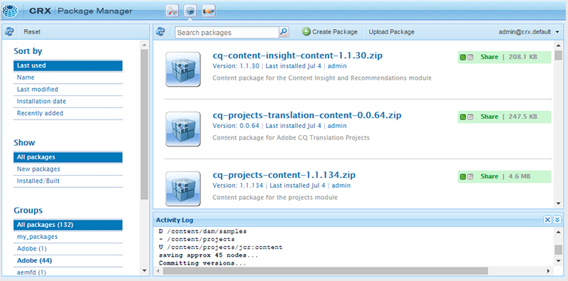
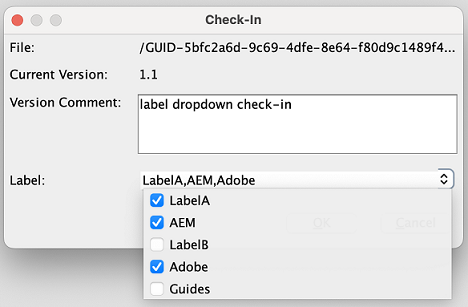
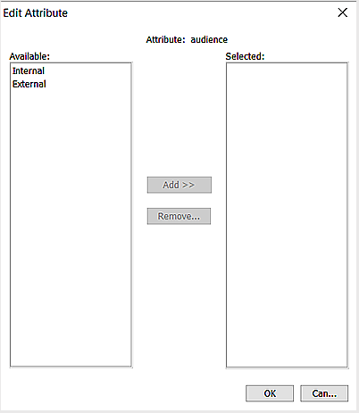

# Sauerstoff-Plugin für Adobe Experience Manager Guides {#id1645H6010Q5}

Mit dem Sauerstoff-Plugin für Adobe Experience Manager Guides \(später im Handbuch als Sauerstoff-Plugin für AEM Guides bezeichnet\) können Sie die Sauerstoff-XML-Autoreninstanz mit dem Adobe Experience Manager \(AEM\)-Repository verbinden, um Inhalte zu erstellen und zu verwalten. Mit dem Plug-in können Sie Dateien durchsuchen, durchsuchen und öffnen, Dateien auschecken und einchecken sowie Ordner und Dateien in AEM Repository hochladen. Im AEM Guides-Bedienfeld der Desktop-Applikation können Sie die gewünschten Ordner \(aus AEM Repository\) zur Liste der bevorzugten Ordner markieren, damit Sie schnell darauf zugreifen können. Darüber hinaus können Sie ein Paket in AEM Web-Oberfläche installieren und Ihre DITA-Dateien in der Oxygen XML Author direkt über die AEM Web-Oberfläche öffnen.

## Herunterladen und installieren {#id1826M0L0PUI}

Das Sauerstoff-Plugin für AEM Guides wird über Ihr Adobe Software Distribution-Portal bereitgestellt. Suchen Sie auf der Registerkarte &quot;Experience Manager&quot;nach &quot;Sauerstoff&quot;und laden Sie dann das Plugin-Installationsprogramm von Ihrem [Adobe Software Distribution-Portal](https://experience.adobe.com/#/downloads/content/software-distribution/en/general.html) herunter.

>[!NOTE]
>
>Überprüfen Sie in den Versionshinweisen für die jeweilige Adobe Experience Manager Guides auf die Kompatibilität mit der Sauerstoff-Connector-Version.

Nachdem Sie das Installationsprogramm installiert haben, installieren Sie es auf Ihrem lokalen Computer, auf dem die Oxygen XML Author installiert ist. Bevor Sie mit der Installation beginnen, müssen Sie sicherstellen, dass Ihr System die technischen Anforderungen für die Installation des Sauerstoff-Plug-ins für AEM Guides erfüllt.

### Technische Anforderungen

- Sauerstoff-XML-Autorenversion 26.1

- Adobe Experience Manager Guides-Version 4.6 oder höher

- Adobe Experience Manager-Version 6.5 mit Service Pack 21, 20 und 19

- Von Oxygen XML Author Version 26.1 unterstütztes Betriebssystem

- Java Development Kit
   - Oracle SE 8 JRE 1.8

### Installieren des Plug-ins unter Windows

>[!IMPORTANT]
>
>Wenn Sie eine ältere Version des Plug-ins auf Ihrem System installiert haben, stellen Sie sicher, dass Sie es deinstallieren, bevor Sie den Installationsprozess starten. Anweisungen zur Deinstallation finden Sie im Abschnitt **Deinstallieren von Paketen** im Artikel [Arbeiten mit Paketen](https://helpx.adobe.com/experience-manager/6-4/sites/administering/using/package-manager.html) .

Führen Sie die folgenden Schritte für das System aus, auf dem Oxygen XML Author installiert ist:

1. Starten Sie die Datei &quot;`.exe`&quot; des Installationsprogramms.

   Der Willkommensbildschirm des Installationsassistenten wird angezeigt.

1. Klicken Sie auf &quot;**Weiter**&quot;und navigieren Sie zu dem Speicherort, an dem die EXE-Datei der Oxygen XML-Autoreninstanz verfügbar ist.

1. Wählen Sie die Datei aus und klicken Sie auf **Öffnen**.

   Der Speicherort der ausgewählten Datei wird im Installationsassistenten hinzugefügt.

1. Klicken Sie auf **Weiter**.

1. Klicken Sie auf **Installieren**.

1. Klicken Sie auf **Beenden** , um den Installationsassistenten zu schließen.
1. Starten Sie die XML-Autoreninstanz Oxygen.

   Das AEM Guides-Bedienfeld wird im Oxygen XML Author angezeigt.

   {width="800" align="left"}

   >[!NOTE]
   >
   >Wenn das Bedienfeld &quot;AEM Guides&quot;nicht angezeigt wird, finden Sie Informationen zu den Problemumgehungen im Abschnitt zur Fehlerbehebung -[Fehlendes AEM Guides-Bedienfeld](#id192BH200ZAX).


### Installieren des Plug-ins in Mac

>[!IMPORTANT]
>
>Wenn Sie eine ältere Version des Plug-ins auf Ihrem System installiert haben, stellen Sie sicher, dass Sie es deinstallieren, bevor Sie den Installationsprozess starten. Weitere Informationen finden Sie im Abschnitt **Deinstallieren von Paketen** in den Anweisungen zur Deinstallation des Artikels [Arbeiten mit Paketen](https://helpx.adobe.com/experience-manager/6-4/sites/administering/using/package-manager.html) .

Führen Sie die folgenden Schritte für das System aus, auf dem Oxygen XML Author installiert ist:

1. Suchen Sie die .dmg-Datei des Plug-ins auf Ihrem System.

1. Doppelklicken Sie auf die Datei &quot;.dmg&quot;, um den Dateiinhalt zu öffnen.

   Die .dmg-Datei enthält einen Ordner aem-connector-x.x und eine Datei aem-connector-x.x-setup .

   >[!NOTE]
   >
   >x.x in den Dateinamen ist die Versionsnummer des Plug-ins.

1. Kopieren Sie den Ordner aem-connector-x.x in den Ordner plugins von Oxygen XML Author.
1. Doppelklicken Sie auf die Datei aem-connector-x.x-setup , um das Installationsprogramm zu starten.

1. Starten Sie die XML-Autoreninstanz Oxygen.

   Das AEM Guides-Bedienfeld wird im Oxygen XML Author angezeigt.

    {width="800" align="left"}

   >[!NOTE]
   >
   >Wenn das Bedienfeld &quot;AEM Guides&quot;nicht angezeigt wird, finden Sie Informationen zu den Problemumgehungen im Abschnitt zur Fehlerbehebung -[Fehlendes AEM Guides-Bedienfeld](#id192BH200ZAX).


### Installieren Sie das Paket für die Aktivierung der Dokumentbearbeitungsfunktion über AEM Web-Oberfläche {#id182CE0Q0TY4}

Als Autor können Sie Ihre DITA-Maps oder -Themen in der Oxygen XML Author direkt über die AEM Web-Oberfläche öffnen und bearbeiten. Um diese Funktion in AEM Web-Oberfläche zu aktivieren, muss Ihr AEM-Administrator ein Paket in Ihrer AEM-Authoring-Instanz installieren.

Als AEM Administrator führen Sie die folgenden Schritte aus, um das Paket zu installieren:

1. Rufen Sie die ZIP-Datei des Pakets von Ihrem IT-Team ab.
1. Melden Sie sich bei Ihrer AEM-Instanz an *\ (als Administrator\)* und navigieren Sie zum CRX Package Manager. Die Standard-URL für den Zugriff auf den Paketmanager lautet

   `http://<server name>:<port>/crx/packmgr/index.jsp`

   Der Package Manager verwaltet die Pakete in Ihrer lokalen AEM-Installation. Weitere Informationen zum Arbeiten mit Package Manager finden Sie unter [Arbeiten mit Paketen](https://experienceleague.adobe.com/docs/experience-manager-cloud-service/content/implementing/developer-tools/package-manager.html?lang=en) in AEM Dokumentation.

    {width="650" align="left"}

1. Um das Sauerstoff-Paket hochzuladen, klicken Sie auf **Paket hochladen**.
1. Navigieren Sie im Dialogfeld &quot;Paket hochladen&quot;zur Sauerstoffpaketdatei, die Sie in Schritt 1 heruntergeladen haben, und klicken Sie auf OK.

   Das Paket wird in Ihre AEM-Instanz hochgeladen.

1. Um den Installationsprozess zu starten, klicken Sie auf **Installieren**.

   {width="650" align="left"}

1. Klicken Sie im Dialogfeld &quot;Paket installieren&quot;auf **Installieren**.
1. Klicken Sie nach Abschluss der Installation auf die Schaltfläche Home in der linken oberen Ecke des CRX Package Managers.
1. Wählen Sie eine DITA-Datei im Ordner &quot;Assets&quot;aus.

   Die Option **In Sauerstoff bearbeiten** ist in der Symbolleiste verfügbar. Weitere Informationen zur Verwendung dieser Option finden Sie unter [DITA-Thema in der XML-Autoreninstanz von Oxygen über AEM Web-Oberfläche öffnen](#id182CE0I905Z).

   >[!NOTE]
   >
   >Die Option **In Sauerstoff bearbeiten** ist sichtbar, wenn Sie ein DITA-Thema auswählen. Wenn Sie mehrere Themen auswählen, ist die Option nicht sichtbar.


## Konfigurieren des Sauerstoff-Plug-ins für AEM Guides {#id1826KF00AHS}

Nachdem Sie das Plug-in heruntergeladen und installiert haben, müssen Sie Folgendes konfigurieren, damit es mit dem Plug-in funktioniert:

- **Web authentication settings**: Einstellungen für die SSO-Authentifizierung im Plug-in für AEM Guides.
- **Allgemeine Einstellungen**: Verbindungseinstellungen für das Plug-in, wie z. B. AEM Server-URL, Anmeldedetails usw.
- **Präferenz für die Profilattributanpassung und Dateinamen in Querverweisen**: Diese Konfiguration ist für die Profilattributschemas für die Dokumentationssätze erforderlich.

### Webauthentifizierungseinstellungen

JxBrowser wird für die SSO-Authentifizierung durch das Oxygen-Connector-Plug-in verwendet. Es handelt sich um einen Chromium-basierten Browser. Für Java 9+ ist der Zugriff auf nicht öffentliche APIs erforderlich und Sie müssen diesen Zugriff explizit auf JxBrowser gewähren. Weitere Informationen finden Sie unter [JxBrowser-Fehlerbehebung](https://jxbrowser-support.teamdev.com/docs/guides/troubleshooting/issues.html).

Aktualisieren Sie die angegebenen Dateien, um die Web-Authentifizierungseinstellungen im Oxygen-Plug-in für AEM Guides zu konfigurieren:

>[!NOTE]
>
>Erstellen Sie eine Sicherungskopie der Datei, bevor Sie sie aktualisieren.

**Für Mac und Sauerstoff 26.1**

Fügen Sie die folgenden Zeilen in env.sh hinzu:

```java
--illegal-access=permit\
--add-opens=java.desktop/javax.swing.plaf.basic=ALL-UNNAMED\
--add-exports=javafx.controls/com.sun.javafx.scene.control=ALL-UNNAMED\
--add-exports=javafx.graphics/com.sun.javafx.stage=ALL-UNNAMED\
--add-exports=javafx.graphics/com.sun.javafx.scene=ALL-UNNAMED\
--add-exports=javafx.graphics/com.sun.javafx.scene.traversal=ALL-UNNAMED\
--add-exports=javafx.graphics/com.sun.javafx.tk=ALL-UNNAMED\
--add-exports=javafx.graphics/com.sun.glass.ui=ALL-UNNAMED\
--add-opens=javafx.graphics/com.sun.glass.ui=ALL-UNNAMED\
--add-opens=javafx.graphics/javafx.stage=ALL-UNNAMED\
--add-opens=javafx.graphics/com.sun.javafx.tk.quantum=ALL-UNNAMED\
--add-exports=java.desktop/sun.awt=ALL-UNNAMED\
--add-opens javafx.swing/javafx.embed.swing=ALL-UNNAMED
```

Fügen Sie die folgenden Zeilen in die Datei SauerstoffAuthor.sh ein.

```java
-Djdk.module.illegalAccess=permit\-Djava.ipc.external=true\
```

**Für Windows und Sauerstoff 26.1**

Fügen Sie die folgenden Zeilen in env.bat hinzu

```java
--illegal-access=permit --add-opens=java.desktop/javax.swing.plaf.basic=ALL-UNNAMED --add-exports=javafx.controls/com.sun.javafx.scene.control=ALL-UNNAMED --add-exports=javafx.graphics/com.sun.javafx.stage=ALL-UNNAMED --add-exports=javafx.graphics/com.sun.javafx.scene=ALL-UNNAMED --add-exports=javafx.graphics/com.sun.javafx.scene.traversal=ALL-UNNAMED --add-exports=javafx.graphics/com.sun.javafx.tk=ALL-UNNAMED --add-exports=javafx.graphics/com.sun.glass.ui=ALL-UNNAMED --add-opens=javafx.graphics/com.sun.glass.ui=ALL-UNNAMED --add-opens=javafx.graphics/javafx.stage=ALL-UNNAMED --add-opens=javafx.graphics/com.sun.javafx.tk.quantum=ALL-UNNAMED --add-exports=java.desktop/sun.awt=ALL-UNNAMED --add-opens javafx.swing/javafx.embed.swing=ALL-UNNAMED
```

Fügen Sie die folgenden Zeilen in die Datei SauerstoffAuthor.bat ein

```java
-Djdk.module.illegalAccess=permit -Djava.ipc.external=true
```

>[!NOTE]
>
>Als Administrator müssen Sie Sauerstoff von SauerstoffAuthor.sh für Mac und SauerstoffAuthor.bat für Windows ausführen.

### Allgemeine Einstellungen

Führen Sie die folgenden Schritte aus, um die Verbindungseinstellungen im Sauerstoff-Plug-in für Adobe Experience Manager Guides zu konfigurieren:

1. Klicken Sie im Bedienfeld &quot;AEM Guides&quot;auf das Einstellungssymbol und wählen Sie dann **Einstellungen** aus.

   {width="800" align="left"}

1. Geben Sie die folgenden Details an:
   - **Server-URL**: URL des AEM, z. B.:

     ```http
     http[s]://<host>:<port>
     ```

     Geben Sie in der obigen URL den Hostnamen und Port des Servers an, auf dem AEM Server bereitgestellt wird.

     >[!IMPORTANT]
     >
     >Wenn Ihr AEM-Server an Port 80 oder 443 bereitgestellt wird, müssen Sie ihn nicht in der URL angeben.

   - **Authentifizierung:** Wählen Sie aus **Einfach \(Benutzername/Kennwort\)** oder **Webauthentifizierung**. Wenn Sie die Authentifizierung **Einfach** auswählen, müssen Sie den Benutzernamen **3} und das Kennwort** 5} im Dialogfeld &quot;Voreinstellungen&quot;eingeben.****

     Wenn Sie Webauthentifizierung auswählen, wird der Bildschirm AEM Anmeldung angezeigt. Geben Sie Ihre Anmeldedaten ein und klicken Sie auf die Schaltfläche **Anmelden** . Bei erfolgreicher Anmeldung wird der Bildschirm AEM Anmeldung geschlossen und das Bedienfeld AEM Guides zeigt die Dateiliste vom AEM Server an.

   - **Verbindungs-Timeout**: Geben Sie die Zeit in Sekunden an, die der Client auf eine Antwort vom AEM-Server wartet. Wenn innerhalb der angegebenen Zeit keine Antwort vom Server empfangen wird, wird die Anfrage beendet. Der Standardwert ist 20 Sekunden.

   - **Lokaler Ordner**: Speicherort auf Ihrem lokalen Computer, an dem die Dateien aus AEM Repository nach dem Auschecken gespeichert werden. Wenn Sie einen Speicherort angeben, der nicht auf dem Laufwerk vorhanden ist, erstellt das Plug-in diesen Speicherort.
   - **Datei beim Auschecken öffnen**: Wenn diese Option aktiviert ist, werden die Dateien beim Auschecken geöffnet.
   - **Datei beim Einchecken schließen**: Wenn ausgewählt, werden die Dateien beim Einchecken geschlossen. Vor dem Schließen der Datei wird ein Popup angezeigt, in dem Sie die Versionskommentare angeben können.
   - **Dialogfeld &quot;Einchecken&quot;beim Schließen der Datei anzeigen**: Wenn diese Option aktiviert ist, wird beim Schließen einer Datei ein Popup-Fenster angezeigt. Im Popup-Fenster können Sie auswählen, ob Sie die Datei einchecken oder die Datei schließen möchten, ohne sie einzuchecken.
   - **Datei beim Öffnen automatisch auschecken**: Wenn diese Option aktiviert ist, wird sie durch Doppelklicken auf eine Datei automatisch ausgecheckt und zur Bearbeitung geöffnet. Wenn die Datei bereits ausgecheckt ist, wird sie einfach zur Bearbeitung geöffnet. Wenn diese Option nicht ausgewählt ist, wird eine Datei, für die Sie keine Sperre haben, im schreibgeschützten Modus geöffnet.
1. Klicken Sie auf **OK**.

### Voreinstellung für die Profilattributanpassung und Dateinamen in Querverweisen {#id1827K0D0OHT}

Sie müssen die Voreinstellungen in der Oxygen XML Author konfigurieren, um das Profilattribut zu verwenden, das den DITA-Themen im AEM Repository zugeordnet ist. Außerdem müssen Sie die Voreinstellung so konfigurieren, dass Dateinamen anstelle von GUIDs in den Querverweisen angezeigt werden.

Führen Sie die folgenden Schritte aus, um Profilattribute und Querverweise zu konfigurieren:

1. Klicken Sie in Oxygen XML Author auf **Options** \> **Preferences**.
1. Wählen Sie auf der Registerkarte **Dokumenttyp-Zuordnung** die Option **DITA** und klicken Sie dann auf **Erweitern**.

   {width="650" align="left"}

1. Wählen Sie auf der Registerkarte **Klassenpfad** in der Dropdown-Liste **Parent Class Loader From Plugin with ID** verwenden die Option `com.adobe.o2.connector` aus.

   {width="650" align="left"}

1. Nehmen Sie auf der Registerkarte **Erweiterungen** die folgenden Änderungen vor:

   - Klicken Sie auf **Choose** neben dem Bundle **Erweiterungen** und wählen Sie   `LinkResolverExtensionBundle - com.adobe.o2.framework.extn` in der Liste **Klasse**. Klicken Sie auf **OK**.
      {width="650" align="left"}
   - Klicken Sie auf **Choose** neben dem Listener für den Autorenerweiterungsstatus **unter** Individuelle Erweiterungen **und wählen Sie `CustomAuthorExtensionStateListener - com.adobe.o2.framework.extn` in der Liste** Klasse **aus.** Klicken Sie auf **OK**.
   - Klicken Sie neben dem Editor für benutzerdefinierten Attributwert für Autoren **auf** Auswählen **unter** Individuelle Erweiterungen **und wählen Sie `CustomValueEditor - com.adobe.o2.framework.extn` in der Liste** Klasse **aus.** Klicken Sie auf **OK**.
   - Klicken Sie auf **Choose** neben dem Einfüge-Handler für externe Autorenobjekte **unter** Individuelle Erweiterungen **und wählen Sie `CustomURLInsertionHandler - com.adobe.o2.ui ` in der Liste** Klasse **aus.** Klicken Sie auf **OK**.


   Der folgende Screenshot zeigt die konfigurierte Registerkarte **Erweiterung** für DITA-Themen:
   
1. Klicken Sie in allen Dialogfeldern auf **OK** , um Ihre Änderungen zu speichern.

### Konfigurieren der DITA Map-Erweiterung

Die Konfiguration der DITA-Map-Erweiterung ist erforderlich, um das Öffnen von Zuordnungsdateien in der Oxygen XML-Autoreninstanz direkt über die AEM Web-Oberfläche zu ermöglichen. Diese Konfigurationen ähneln den Konfigurationen für Profilattribute, die im vorherigen Verfahren vorgenommen wurden.

Führen Sie die folgenden Schritte aus, um die DITA Map-Erweiterung zu konfigurieren:

1. Klicken Sie in Oxygen XML Author auf **Options** \> **Preferences**.
1. Wählen Sie auf der Registerkarte **Dokumenttyp-Zuordnung** die Option **DITA-Zuordnung** und klicken Sie dann auf **Erweitern**.
1. Wählen Sie auf der Registerkarte **Klassenpfad** com.adobe.o2.connector in der Dropdown-Liste **Übergeordnete Klassenlader aus Plug-in mit ID verwenden** aus.
1. Nehmen Sie auf der Registerkarte **Erweiterungen** die folgenden Änderungen vor:
   - Klicken Sie auf **Choose** neben dem Bundle **Erweiterungen** und wählen Sie   `com.adobe.o2.framework.extn.LinkResolverDITAMapExtensionBundle` in der Liste **Klasse**. Klicken Sie auf **OK**.

   - Klicken Sie auf **Choose** neben dem Listener für den Autorenerweiterungsstatus **unter** Individuelle Erweiterungen **und wählen Sie `CustomDITAMapAuthorExtensionStateListener - com.adobe.o2.framework.extn` in der Liste** Klasse **aus.** Klicken Sie auf **OK**.

   - Klicken Sie auf **Choose** neben dem Einfüge-Handler für externe Autorenobjekte **unter** Individuelle Erweiterungen **und wählen Sie `CustomURLInsertionHandler - com.adobe.o2.ui ` in der Liste** Klasse **aus.** Klicken Sie auf **OK**.

   - Klicken Sie neben dem Editor für benutzerdefinierten Attributwert für Autoren **auf** Auswählen **unter** Individuelle Erweiterungen **und wählen Sie `CustomValueEditor - com.adobe.o2.framework.extn` in der Liste** Klasse **aus.** Klicken Sie auf **OK**.

   - Klicken Sie auf **Choose** neben dem **References resolver** unter **Individuelle Erweiterungen** und wählen Sie `CustomDITAMapReferenceResolver - com.adobe.o2` in der Liste **Klasse** aus. Klicken Sie auf **OK**.
   - *\(Optional\)* Wenn Sie Verweise beim Öffnen einer Zuordnungsdatei nicht auflösen möchten, müssen Sie die folgende zusätzliche Konfiguration durchführen:

   Der folgende Screenshot zeigt die konfigurierte Registerkarte **Erweiterung**:
   

1. Klicken Sie in allen Dialogfeldern auf **OK** , um Ihre Änderungen zu speichern.

## Arbeiten mit dem Oxygen-Plug-in für AEM Guides {#id1826JG00WY4}

### AEM Guides-Bedienfeld

Der folgende Bildschirm zeigt das AEM Guides-Bedienfeld.

{width="550" align="left"}

**A**\) Zeigt die Suchleiste an.

**B**\) Zeigt den Ordner Favoriten an. Standardmäßig ist sie leer. Sie können Ordner aus dem AEM-Repository als Favoriten hinzufügen. Die bevorzugten Ordner werden hier angezeigt.

**C**\) Der DAM-Ordner zeigt das AEM Repository an. Sie können die Ordneransicht erweitern und reduzieren.

**D**\) Das Einstellungssymbol \(Zahnrad\) mit den folgenden Optionen:

- **Verbinden**: Wählen Sie diese Option, um eine Verbindung zum AEM-Server herzustellen. Die Option ist deaktiviert, wenn die XML-Autoreninstanz mit dem AEM Server verbunden ist.
- **Aktualisieren**: Wählen Sie diese Option, um den neuesten Status der Dateien und Ordner aus dem AEM Repository abzurufen.

  >[!NOTE]
  >
  >Achten Sie darauf, die Dateien zu speichern, bevor Sie sie aktualisieren. Wenn Sie die Option **Aktualisieren** auswählen, erhalten Sie eine Warnung, Ihre Dateien zu speichern, bevor Sie sie aktualisieren. Wenn Sie Ihre Dateien nicht gespeichert haben, können Sie auf **Abbrechen** klicken und sie speichern.

- **Einstellungen**: Sie können diese Option verwenden, um das Dialogfeld &quot;Allgemeine Voreinstellungen&quot;des Plug-ins zu öffnen.
- **Abmelden**: Wählen Sie diese Option, um die AEM Serververbindung zu schließen. Diese Option ist nur verfügbar, wenn Sie den Webauthentifizierungsmodus verwenden.

### Kontextmenüfunktionen

Die Funktionen des Sauerstoff-Plug-ins für AEM Guides sind verfügbar, wenn Sie mit der rechten Maustaste auf einen Ordner oder eine Datei im AEM-Repository klicken. Die für die Ordner verfügbaren Funktionen unterscheiden sich von den Dateien. Im Folgenden finden Sie eine vollständige Liste der Funktionen des Oxygen-Plug-ins für das AEM Guides-Kontextmenü:

- **Öffnen**: Öffnet die ausgewählte Datei oder erweitert den ausgewählten Ordner.
- **Öffnen in**: Sie können die ausgewählte Datei im Web Editor, im Map-Dashboard oder im Map-Editor in AEM Guides öffnen. Weitere Informationen zu diesen Optionen finden Sie unter [Datei im AEM Guides-Editor öffnen](#id195GH0V30KX).
- **Auschecken**: Prüft eine Datei aus AEM Repository. Weitere Informationen finden Sie unter [Auschecken von Dateien](#id195HC020TS4).
- **Checkout mit abhängigen Elementen**: Prüft eine Datei mit ihren direkten Verweisen. Weitere Informationen finden Sie unter [Auschecken von Dateien](#id195HC020TS4).
- **Mit schreibgeschützten abhängigen Elementen auschecken**: Prüft die ausgewählte Datei mit den abhängigen Elementen. Sie können keine Änderungen an den abhängigen Dateien vornehmen. Weitere Informationen finden Sie unter [Auschecken von Dateien](#id195HC020TS4).
- **Auschecken abbrechen**: Bricht die ausgecheckte Datei ab, schließt die Datei aus dem Editor und setzt die Änderungen auf die letzte Version der auf dem Server gespeicherten Datei zurück.
- **Aktualisieren**: Ruft im Fall einer Datei die neueste Kopie der Datei aus dem AEM-Repository ab. Für einen Ordner ruft er die Ordnerstruktur und den Status der Datei ab. Das bedeutet, dass eine Datei hinzugefügt wird und sie dann in der AEM Guides-Ansicht angezeigt wird. Wenn eine Datei auf AEM Server ausgecheckt wurde, zeigt die Aktualisierung in der Sauerstoffverfassungs-Autoreninstanz die Datei als ausgecheckt an. Dies aktualisiert jedoch nicht die Dateiliste in der Ansicht &quot;*Ausgecheckte Dateien in AEM Guides*&quot;.
- **Ausgecheckte Dateien aktualisieren**: Aktualisiert die Liste der ausgecheckten Dateien in der Ansicht *Ausgecheckte Dateien in AEM Guides* . Wenn eine Datei auf AEM Server ausgecheckt wurde, wird durch eine Aktualisierung die Liste der ausgecheckten Dateien in der Ansicht &quot;*Ausgecheckte Dateien in AEM Guides*&quot;aktualisiert. Wenn jedoch eine neue Datei hinzugefügt oder der Status einer Datei geändert wurde, wird sie nicht in der AEM Guides-Strukturansicht aktualisiert. Um den Status von Dateien auf AEM zu aktualisieren, müssen Sie eine Aktualisierung durchführen.
- **Einchecken**: Prüft eine Datei, die Sie ausgecheckt haben. Weitere Informationen finden Sie unter [Einchecken in einer Datei](#id182CF0J0FHS).
- **Mit abhängigen Elementen einchecken**: Wenn Sie Dateien mit abhängigen Elementen ausgecheckt haben, checkt diese Option die Hauptdatei zusammen mit den abhängigen Elementen ein. Weitere Informationen finden Sie unter [Einchecken in einer Datei](#id182CF0J0FHS).
- **Ordner erstellen**: Erstellt einen Ordner im AEM-Repository. Diese Option ist nur auf Ordnerebene verfügbar.
- **Datei hochladen\(s\)**: Lädt einzelne oder mehrere Dateien hoch. Weitere Informationen finden Sie unter [Dateien und Ordner hochladen](#id195HC03F03J).
- **Mit abhängigen Elementen hochladen**: Lädt DITA-Dateien \(XML, DITA, Book Map oder DITA Map\) mit den abhängigen Elementen hoch. Weitere Informationen finden Sie unter [Dateien und Ordner hochladen](#id195HC03F03J).
- **Ordner hochladen**: Lädt einen Ordner in das AEM-Repository hoch. Weitere Informationen finden Sie unter [Dateien und Ordner hochladen](#id195HC03F03J).
- **Zu Favoriten hinzufügen**: Fügt einen Ordner zum Ordner *Favoriten* im AEM Guides-Bedienfeld hinzu. Es wird empfohlen, Ihren Arbeitsordner hier hinzuzufügen, was die Synchronisierung von Dateien und den Dateistatus von AEM erleichtert.
- **Aus Favoriten entfernen**: Entfernt einen Ordner aus *Favoriten*. Weitere Informationen finden Sie unter [Favoriten hinzufügen oder entfernen](#id195HC04405P).
- **Metadaten anzeigen**: Zeigt die Metadaten wie die DITA-Klasse, den Titel, den Typ, die UUID und andere mit einer Datei verknüpfte Informationen an. Weitere Informationen finden Sie unter [Metadaten einer Datei anzeigen](#id195GHN0H05C).
- **Versionen anzeigen**: Zeigt den Versionsverlauf einer Datei an. Weitere Informationen finden Sie unter [Versionsverlauf einer Datei anzeigen](#id195GI000D5Q).

### Öffnen einer Datei in der XML-Autoreninstanz von Oxygen {#id195GHJ0A0UB}

Nachdem Sie eine Verbindung zum AEM-Repository hergestellt haben, können Sie Dateien zur Bearbeitung in der XML-Autoreninstanz öffnen. Führen Sie die folgenden Schritte aus, um eine Datei zur Bearbeitung im Oxygen XML Author zu öffnen:

1. Klicken Sie im AEM Guides-Bedienfeld mit der rechten Maustaste auf eine Datei, die Sie zur Bearbeitung öffnen möchten.

1. Wählen Sie **Öffnen** aus dem Kontextmenü. Alternativ können Sie auf die Datei doppelklicken, um sie zu öffnen.

   Die Datei wird im Editor der XML-Autoreninstanz von Oxygen geöffnet.

    {width="800" align="left"}

   Wenn Sie den Mauszeiger über die Registerkarte einer Datei bewegen, wird Ihnen der Serverpfad zusammen mit der UUID angezeigt. Im obigen Screenshot wird die UUID des Dokuments hervorgehoben.

>[!NOTE]
>
>Wenn Sie den Mauszeiger über die Bilder oder Videos in einem Thema im Editor der XML-Autoren-Sauerstoff bewegen, wird nur die UUID des ausgewählten Elements angezeigt. Um es im Repository zu finden, klicken Sie mit der rechten Maustaste auf das angezeigte Bild- oder Objekt-Tag (nur bei Videos, Audiodateien und anderen Mediendateien) und wählen Sie **Im Repository anzeigen** aus.


Wenn Sie die Option &quot;**Automatische Checkout-Datei beim Öffnen**&quot;ausgewählt haben \(im Dialogfeld &quot;Voreinstellungen&quot;\), wird beim Öffnen einer Datei die Datei automatisch ausgecheckt und steht zur Bearbeitung zur Verfügung. Um eine Datei zu öffnen, können Sie entweder auf einen Dateinamen doppelklicken oder mit der rechten Maustaste auf den Dateinamen klicken und **Öffnen** aus dem Kontextmenü auswählen. Wenn diese Option nicht ausgewählt ist, wird die Datei im schreibgeschützten Modus geöffnet.


### Datei im AEM Guides-Editor öffnen {#id195GH0V30KX}

Wenn Sie die in AEM Guides verfügbaren Editoren verwenden möchten, wählen Sie dazu die gewünschte Option im Kontextmenü aus. Führen Sie die folgenden Schritte aus, um den AEM Guides-Editor anstelle des Oxygen XML Author-Editors zu verwenden:

1. Klicken Sie im AEM Guides-Bedienfeld mit der rechten Maustaste auf eine Datei, die Sie zur Bearbeitung öffnen möchten.

1. Wählen Sie im Kontextmenü die Option **Öffnen in** und wählen Sie eine der folgenden Optionen:

   - **Web-Themen-Editor**: Wenn es sich bei der Datei, die Sie öffnen, um eine .xml- oder .dita-Datei handelt, können Sie sie zur Bearbeitung im Web-Editor öffnen. Wählen Sie die Option &quot;**Web-Themen-Editor**&quot;, um die ausgewählte Datei zur Bearbeitung im Web-Editor zu öffnen.

   - **Dashboard zuordnen**: Sie können eine .ditamap-Datei im Map-Dashboard bearbeiten, in der Sie verschiedene Vorgänge für die Zuordnungsdatei ausführen können. Diese Vorgänge hängen von der Rolle/Gruppe ab, zu der Sie gehören.

   - **Web DITA Map Editor**: Wenn Sie die .ditamap-Datei zur Bearbeitung im Map Editor öffnen möchten, wählen Sie diese Option. Mit der Option &quot;DITA Map Editor&quot;können Sie Themen hinzufügen oder entfernen, Beziehungstabellen hinzufügen und andere Vorgänge auf Ihrer Zuordnung durchführen.


### Auschecken von Dateien {#id195HC020TS4}

Wenn Sie eine Datei auschecken, wird sie lokal auf Ihrem System gespeichert und zur Bearbeitung im AEM Repository gesperrt. Führen Sie die folgenden Schritte aus, um eine Datei auszuchecken:

1. Sie können Ihre Dateien auf eine der folgenden Arten auschecken:
   - Klicken Sie im AEM Guides-Bedienfeld mit der rechten Maustaste auf eine Datei.
   - Klicken Sie mit der rechten Maustaste auf die Registerkarte &quot;Zuordnung&quot;im Bereich &quot;DITA Maps Manager&quot;.
   - Klicken Sie mit der rechten Maustaste auf eine Datei im Bereich &quot;DITA Maps Manager&quot;.
   - Klicken Sie mit der rechten Maustaste auf die Registerkarte &quot;Datei&quot;, wenn Sie eine Zuordnung oder ein Thema im Editor öffnen.

1. Wählen Sie eine der folgenden Optionen aus:
   - **Auschecken:** Prüft eine Datei aus AEM Repository und stellt sie zur Bearbeitung bereit.
   - **Checkout mit abhängigen Elementen**: Prüft eine Datei mit ihren direkten Verweisen. Mit dieser Option können Sie Änderungen an übergeordneten und untergeordneten Seiten vornehmen. Das Sauerstoff-Plugin für AEM Guides unterstützt das Auschecken einer Ebene von abhängigen Elementen. Beispiel: Zuordnung A verweist auf Thema A und Thema A verweist auf Thema B. Wenn Sie Karte A auschecken, wird Thema A unabhängig von der Ebene in der TOC-Hierarchie ausgecheckt. Themen B wird jedoch nicht überprüft, da es nicht direkt von Karte A aus verknüpft ist.
   - **Mit schreibgeschützten abhängigen Elementen auschecken**: Prüft eine Datei und lädt ihre abhängigen Elemente als schreibgeschützte Kopien auf Ihren lokalen Computer herunter. Sie können keine Änderungen an den abhängigen Dateien vornehmen.

Wenn Sie die Option **Dateien beim Auschecken öffnen** ausgewählt haben \(im Dialogfeld &quot;Voreinstellungen&quot;\), wird beim Auschecken einer Datei die Datei automatisch zur Bearbeitung geöffnet.

Wenn Sie die Option &quot;**Automatische Checkout-Datei beim Öffnen**&quot;ausgewählt haben \(im Dialogfeld &quot;Voreinstellungen&quot;\), wird beim Öffnen der Datei die Datei automatisch ausgecheckt und zur Bearbeitung bereitgestellt. Um eine Datei zu öffnen, können Sie entweder auf einen Dateinamen doppelklicken oder mit der rechten Maustaste auf den Dateinamen klicken und **Öffnen** aus dem Kontextmenü auswählen.

Wenn eine Datei ausgecheckt wird, ändert sich das Symbol der Datei, um den Sperrstatus anzuzeigen.

{width="650" align="left"}

Im obigen Screenshot wird eine von einem anderen Benutzer ausgecheckte Datei mit einem schwarzen Sperrsymbol \(A\) angezeigt. Die vom aktuellen Benutzer ausgecheckte Datei wird mit einem grünen Schloss \(B\) angezeigt.

>[!NOTE]
>
>Wenn die ausgecheckte Datei gelöscht oder in einen anderen Ordner in AEM verschoben wird, erhalten Sie beim Einchecken der Datei eine Fehlermeldung. Vergewissern Sie sich, dass die ausgecheckte Datei nicht über die AEM Web-Oberfläche verschoben oder gelöscht wird.

### Einchecken einer Datei {#id182CF0J0FHS}

Wenn Sie eine Datei einchecken, wird die lokale Kopie von Ihrem System im AEM-Repository gespeichert und die Sperre in der Datei wird entfernt. Führen Sie die folgenden Schritte aus, um eine Datei einzuchecken:

1. Speichern Sie Ihre Datei, indem Sie auf **Datei** \> **Speichern** klicken.

1. Klicken Sie mit der rechten Maustaste auf eine ausgecheckte Datei oder Zuordnung an einem der folgenden Speicherorte:
   - AEM Guides-Bedienfeld
   - Bedienfeld &quot;DITA Maps Manager&quot;
   - Registerkarte &quot;Datei&quot;, wenn Sie eine Zuordnung oder ein Thema im Editor öffnen.
   - Die Registerkarte &quot;Zuordnung&quot;im Bereich &quot;DITA Maps Manager&quot;.

1. Wählen Sie aus den folgenden beiden Optionen:

   - **Einchecken**: Prüft die ausgewählte Datei von Ihrem lokalen System in AEM Repository.
   - **Mit abhängigen Elementen einchecken:** Wenn Sie eine Datei zusammen mit den abhängigen Elementen ausgecheckt haben, verwenden Sie diese Option, um alle abhängigen Dateien in einem einzigen Vorgang einzuchecken. Bei Auswahl dieser Option wird das Dialogfeld &quot;Einchecken&quot;mit allen abhängigen Dateien angezeigt. Klicken Sie auf OK , um alle Dateien gleichzeitig einzuchecken.

   Wenn Sie die abhängigen Dateien nicht ausgecheckt haben und diese Option wählen, werden nur die abhängigen Dateien eingecheckt, die \(separat\) ausgecheckt haben. Ihnen wird eine Liste der Dateien angezeigt, die nicht eingecheckt werden konnten:

   {width="800" align="left"}

   Es wird dringend empfohlen, keine ausgecheckte Datei zu verschieben. Wenn jedoch eine ausgecheckte Datei an einen anderen Speicherort verschoben wird, müssen Sie den Checkout für diese Datei abbrechen. Wenn Sie Aktualisierungen an dieser Datei vornehmen möchten, checken Sie die Datei erneut aus, nehmen Sie Änderungen vor und checken Sie sie dann wieder ein. Wenn Sie versuchen, eine Datei einzuchecken, die von ihrem ursprünglichen Speicherort verschoben wurde, wird ein Fehler ausgegeben.

   Wenn eine abhängige Datei in AEM ausgecheckt ist, wird die abhängige Datei beim Einchecken nicht im Dialogfeld &quot;Einchecken&quot;angezeigt. Um eine Liste der abhängigen Dateien zu erhalten, die in AEM ausgecheckt wurden, müssen Sie einen Ordner aktualisieren.

   Wenn Sie über AEM eine abhängige Datei eingecheckt haben, wird die Dateiliste in der Sauerstoff-Autoreninstanz erst aktualisiert, wenn Sie den Ordner &quot;Aktualisierte und ausgecheckte Dateien aktualisieren&quot;erstellt haben. Wenn Sie ein Check-in mit abhängigen Personen durchführen und einige Dateien über AEM einchecken, erhalten Sie eine Fehlerliste mit den Dateien, die nicht eingecheckt werden konnten.

1. \(Optional\) Fügen Sie im Dialogfeld **Einchecken** oder **Einchecken mit abhängigen Elementen** im Textfeld **Versionskommentare** einen Kommentar hinzu.

   >[!NOTE]
   >
   >Dieser Kommentar wird im AEM Versionsverlauf der Datei angezeigt.

1. Fügen Sie im Textfeld **Beschriftung** im Dialogfeld **Einchecken** oder im Dialogfeld **Einchecken mit abhängigen Elementen** Beschriftungen hinzu. Geben Sie einen Titel ein und drücken Sie die Eingabetaste. Beispiel: *Version 2307*.

   Wenn Ihr Administrator eine vordefinierte Liste von Bezeichnungen verwendet und diese in die Datei `label.json` hochgeladen hat, werden diese Bezeichnungen als Dropdown-Liste angezeigt. Sie können eine oder mehrere Beschriftungen aus der Dropdown-Liste auswählen.

   {width="550" align="left"}

   Sie können derselben Version eines Themas mehrere Bezeichnungen (durch Kommas getrennt) hinzufügen.  Beispiel: *Adobe*, *AEM*, *Guides*.
Sie können jedoch nicht dieselbe Bezeichnung zu den verschiedenen Versionen eines Themas hinzufügen. Wenn Sie eine Bezeichnung hinzufügen, die Sie bereits zu einer früheren Version hinzugefügt haben, wird diese der neuesten Version hinzugefügt und aus der früheren Version entfernt.

   >[!NOTE]
   > 
   > Diese Beschriftungen werden im AEM Versionsverlauf der Datei angezeigt.


1. Klicken Sie auf **OK**.

>[!NOTE]
>
>Wenn die ausgecheckte Datei gelöscht oder in einen anderen Ordner in AEM verschoben wird, erhalten Sie beim Einchecken der Datei eine Fehlermeldung. Vergewissern Sie sich, dass die ausgecheckte Datei nicht über die AEM Web-Oberfläche verschoben oder gelöscht wird.

### In der AEM Guides-Ansicht ausgecheckte Dateien

Wenn Sie mehrere Ordner haben, ist es nicht einfach herauszufinden, wie viele Dateien in einer Ansicht ausgecheckt werden. AEM Guides bietet in der AEM Guides-Ansicht ausgecheckte Dateien, die eine vollständige Momentaufnahme der derzeit ausgecheckten Dateien liefert. Mithilfe dieser Ansicht können Sie einfach feststellen, welche Dateien von Ihnen in AEM Repository mithilfe von AEM Guides überprüft wurden. Führen Sie die folgenden Schritte aus, um auf diese Ansicht zuzugreifen und sie zu verwenden:

1. Klicken Sie auf **Window** \> **Show View** \> **Files Checked-out in AEM Guides**.

   Die Ansicht &quot;Files Checked-out in AEM Guides&quot;wird angezeigt.

   {width="550" align="left"}

1. Klicken Sie mit der rechten Maustaste auf eine Datei in dieser Ansicht, um die folgenden Optionen zu erhalten:

   - [Öffnen](#id195GH0V30KX)
   - [Öffnen in](#id195GH0V30KX)
   - Abbrechen des Auscheckens
   - [Einchecken](#id182CF0J0FHS)
   - [Einchecken mit abhängigen Personen](#id182CF0J0FHS)
   - [Anzeigen von Metadaten](#id195GHN0H05C)
   - [Versionen anzeigen](#id195GI000D5Q)

**Hinweise zu in der AEM Guides-Ansicht ausgecheckten Dateien:**

- Die Ansicht &quot;*Ausgecheckte Dateien&quot;in AEM Guides*&quot;verwaltet die Benutzersitzungen. Das bedeutet, dass Dateien, die vom aktuellen Benutzer ausgecheckt wurden, in der Ansicht über die Sitzungen desselben Benutzers hinweg gespeichert und gepflegt werden \(oder Cache\).

- Wenn der Benutzer die Anmeldedaten oder den AEM-Server ändert, werden die Daten der ausgecheckten Datei \(oder Cache\) in der Ansicht zurückgesetzt. Der Benutzer muss für jeden Ordner, aus dem die Dateien zuvor ausgecheckt wurden, manuell den Befehl *Ausgewählte Dateien aktualisieren* ausführen. Um dies zu vereinfachen, wird empfohlen, Ihre Arbeitsordner *Favoriten* hinzuzufügen, damit Sie schnell eine Ordneraktualisierung vornehmen können.

- Sie können die Dateiliste nach Dateinamen, Titel oder Pfad sortieren. Wenn eine neue Datei ausgecheckt ist, wird die Datei in der Ansicht in sortierter Reihenfolge angezeigt.


### Dateien und Ordner hochladen {#id195HC03F03J}

Führen Sie die folgenden Schritte aus, um Dateien oder Ordner hochzuladen:

1. Klicken Sie im AEM Guides-Bedienfeld mit der rechten Maustaste auf einen Ordner.
1. Wählen Sie eine der folgenden Optionen aus:
   - **Datei hochladen\(s\)**: Wählen Sie diese Option, um einzelne oder mehrere Dateien in den ausgewählten Ordner im AEM-Repository hochzuladen. Wählen Sie im Dialogfeld Dateien auswählen \(s\) für den Upload die Dateien aus und klicken Sie auf **Öffnen**.
   - **Mit abhängigen Elementen hochladen**: Wählen Sie diese Option, um eine DITA-Datei mit den abhängigen Elementen hochzuladen. Wählen Sie im Dialogfeld &quot;Select file to upload&quot;die Dateien aus und klicken Sie auf **Open**.
   - **Ordner hochladen**: Wählen Sie diese Option, um einen Ordner in das AEM-Repository hochzuladen. Wählen Sie im Dialogfeld &quot;Auswählen&quot;den Ordner aus und klicken Sie auf **Choose**.

**Zusätzliche Hinweise zum Arbeiten mit UUID-basierten Dateien**:

Beim Verschieben oder Kopieren von Inhalten aus Ihrem lokalen System in AEM Repository müssen die folgenden Punkte berücksichtigt werden:

- Beim Hochladen einer oder mehrerer Dateien wird für Dateien ohne UUID eine neue UUID generiert. Diese UUID wird im `topic id` einer DITA-Datei hinzugefügt.

- Beim Kopieren eines Ordners werden die Verweise auf die Dateien \(im Ordner\) automatisch in allen DITA-Maps aktualisiert, die auf Dateien in diesem Ordner verweisen.

- Beim Kopieren einer DITA-Map-Datei werden die UUID-Verweise in der Map-Datei nicht geändert.

- Wenn eine Datei oder ein Ordner einen Konflikt oder ein Duplikat aufweist, wird ein eindeutiger Dateiname für die neue Datei generiert, die kopiert oder verschoben wird.

- Keine zwei Dateien können dieselbe UUID aufweisen. Allen neuen Dateien wird eine eindeutige UID zugewiesen.

- Wenn eine Datei von zwei verschiedenen Benutzern gleichzeitig hochgeladen wird, überschreibt die später verarbeitete Datei die frühere Datei. Eine solche Praxis sollte jedoch vermieden werden.

- Wenn Sie Inhalte aus AEM Repository auschecken und Änderungen auf Ihrem lokalen System vornehmen, stellen Sie sicher, dass der Dateiname zum Zeitpunkt des Hochladens der Datei nicht geändert wird.

- Wenn Sie einen Verweis in den DITA Maps Manager oder den Editor einfügen, wird der Titel der Datei und nicht die UUID angezeigt. Wenn der Titel nicht vorhanden ist, wird der Dateiname angezeigt.

### Favoriten hinzufügen oder entfernen {#id195HC04405P}

Führen Sie die folgenden Schritte aus, um einen Ordner zum Ordner Favoriten im AEM Guides-Bedienfeld hinzuzufügen oder zu entfernen:

- Klicken Sie mit der rechten Maustaste auf einen Ordner und wählen Sie **Zu Favoriten hinzufügen** aus. Sie können einen Ordner zu Favoriten hinzufügen, wenn er nicht zu Favoriten gehört.
- Sie können Ordner auf folgende Weise aus Favoriten entfernen:
   - Klicken Sie mit der rechten Maustaste auf einen Ordner im Ordner **Favoriten** und wählen Sie **Aus Favoriten entfernen** aus.
   - Klicken Sie mit der rechten Maustaste auf einen Ordner im AEM-Repository unter dem Ordner &quot;**DAM**&quot;, der bereits als Favorit hinzugefügt wurde, und wählen Sie &quot;**Aus Favoriten entfernen**&quot;.

### Versionsverlauf einer Datei anzeigen {#id195GI000D5Q}

Führen Sie die folgenden Schritte aus, um den Versionsverlauf einer Datei anzuzeigen:

1. Klicken Sie im AEM Guides-Bedienfeld mit der rechten Maustaste auf eine Datei.

1. Wählen Sie **Versionen anzeigen** aus dem Kontextmenü.

   Der Versionsverlauf der Datei wird im Dialogfeld Versionen angezeigt.

   {width="550" align="left"}


### Metadaten einer Datei anzeigen {#id195GHN0H05C}

Führen Sie die folgenden Schritte aus, um die Metadaten einer Datei anzuzeigen:

1. Klicken Sie im AEM Guides-Bedienfeld mit der rechten Maustaste auf eine Datei.

1. Wählen Sie **Metadaten anzeigen** aus dem Kontextmenü.

   Die Metadaten der Datei wie DITA-Klasse, Dokumentstatus, Änderungsdatum, Größe, Titel und UUID werden im Dialogfeld Metadaten angezeigt.

   {width="550" align="left"}


## Suchen nach einem Thema im AEM Repository {#id1826J20405Z}

Sie können über die Suchleiste im AEM Guides-Bereich nach Themen im AEM-Repository suchen. Sie können im gesamten DAM-Ordner suchen oder einen Ordner auswählen und dann nach einem Thema in diesem Ordner suchen. Das Suchergebnis zeigt die Themen an, deren Text mit Ihrer Suchabfrage übereinstimmt.

Führen Sie die folgenden Schritte aus, um Themen zu suchen:

1. Wählen Sie einen Ordner im AEM-Repository aus, in dem Sie nach einem Thema suchen möchten.
1. Geben Sie die Suchabfrage \(z. B. `introduction`\) in die Suchleiste des Sauerstoff-Plug-ins für AEM Guides ein.
1. Klicken Sie auf die Suchschaltfläche oder drücken Sie die Eingabetaste.

   Das Ergebnis wird auf der Registerkarte Suchergebnisse als Liste mit dem Dateipfad angezeigt. Wenn für Ihre Suchabfrage kein passendes Ergebnis vorliegt, wird die Meldung &lt;Pfad des ausgewählten Ordners\> Keine Ergebnisse angezeigt.

   {width="550" align="left"}

1. \(Optional\) Doppelklicken Sie auf eine Datei im Suchergebnis, um sie in der XML-Autoreninstanz von Oxygen zu öffnen.
1. Führen Sie einen der folgenden Schritte aus, um zur AEM Repository-Ansicht zurückzukehren:
   - Um die AEM Repository-Ansicht anzuzeigen, ohne die Suchergebnisse zu löschen, klicken Sie auf die Registerkarte **Durchsuchen** .
   - Um die Suchergebnisse zu löschen und das AEM Repository anzuzeigen, klicken Sie auf das Symbol Suche löschen .

## Öffnen Sie das DITA-Thema in der Oxygen XML Author über AEM Web-Oberfläche. {#id182CE0I905Z}

Sie können Ihr DITA-Thema in der Oxygen XML Author über die AEM Web-Oberfläche öffnen und bearbeiten. Sie müssen ein Package in AEM installieren, um diese Option zu aktivieren. Weitere Informationen zur Paketinstallation finden Sie unter [Installieren des Pakets für die Aktivierung der Dokumentbearbeitungsfunktion über AEM Web-Oberfläche](#id182CE0Q0TY4).

>[!NOTE]
>
>Die Option **In Sauerstoff bearbeiten** ist an verschiedenen Stellen in AEM verfügbar: bei Auswahl eines Themas, bei der Vorschau eines Themas oder auf der Registerkarte &quot;Themen und Berichte&quot;der DITA-Zuordnungskonsole. Wenn Sie mehrere Themen auswählen, ist die Option nicht in der Symbolleiste sichtbar.

**Öffnen eines DITA-Themas**

Führen Sie die folgenden Schritte aus, um ein DITA-Thema in der XML-Autoreninstanz von Oxygen zu öffnen:

1. Wählen Sie ein Thema in Ihren Assets aus und klicken Sie in der Symbolleiste auf die Option **In Sauerstoff bearbeiten** .

   >[!NOTE]
   >
   >Wenn das Thema nicht ausgecheckt ist, wird es zunächst ausgecheckt und dann im Bearbeitungsmodus in Sauerstoff geöffnet.

1. Wählen Sie im Meldungsfeld **Launch Application** die Option &quot;XHTML-Autor *&lt;Version\>*&quot;. Sie können die Option **Meine Auswahl für AEM Links speichern** auswählen, um Ihre Voreinstellung zu speichern.

**Bearbeiten eines DITA-Themas**

Führen Sie die folgenden Schritte aus, um ein DITA-Thema in der Oxygen XML Author zu bearbeiten:

1. Auswählen und Auschecken eines Themas in Ihren Assets.
1. Klicken Sie in der Symbolleiste auf die Option **In Sauerstoff bearbeiten** .

   >[!NOTE]
   >
   >Wenn das Thema nicht ausgecheckt ist, wird es zunächst ausgecheckt und dann im Bearbeitungsmodus in Sauerstoff geöffnet.

1. Wählen Sie im Meldungsfeld **Launch Application** die Option &quot;XHTML-Autor *&lt;Version\>*&quot;. Sie können die Option **Meine Auswahl für AEM Links speichern** auswählen, um Ihre Voreinstellung zu speichern.
1. Bearbeiten Sie das Thema in der Oxygen XML Author.
1. Checken Sie das Thema über das Oxygen-Plug-in für AEM Guides ein.

   Weitere Informationen zum Einchecken eines Themas mit dem Sauerstoff-Plug-in für AEM Guides finden Sie unter [Einchecken einer Datei](#id182CF0J0FHS).

   >[!NOTE]
   >
   >Stellen Sie sicher, dass Sie das Thema mit dem Sauerstoff-Plugin für AEM Guides einchecken. Wenn Sie über die AEM Web-Oberfläche einchecken, werden die Änderungen, die Sie in der Sauerstoff-XML-Autoreninstanz vornehmen, nicht in der eingecheckten Version des Themas gespeichert.

**Fügen Sie einen Verweis auf ein Thema aus dem Experience Manager Guides-Repository ein**

Sie können auch per Drag-and-Drop ein Thema einfügen, um die Referenz in ein Thema oder eine DITA-Zuordnung einzufügen.
>[!NOTE]
>
> Sie müssen eine Datei auschecken, bevor Sie einen Verweis hinzufügen.

Die folgenden Elemente werden basierend auf dem Typ der Verweise hinzugefügt:

Wenn Sie mit einem geöffneten Thema zum Editor wechseln:
- Eine Referenz mit dem Element `<image>` für die Bilder wird hinzugefügt.
- Für ein Video oder eine Audioaufzeichnung wird ein Objektelement hinzugefügt.
- Das Element `<xref>` wird für alle anderen Verweise wie Thema, Zuordnung, DITAVAL, PDF, ZIP und XML hinzugefügt.

Wenn Sie beim Editor oder DITA Maps-Manager mit geöffneter Karte ablegen:
- Das Element `<mapref>` wird für Zuordnungsverweise hinzugefügt, die eine DITA-Zuordnung, eine Bookmap oder ein Subject-Schema enthalten.
- Das Element `<topicref>` wird für alle anderen Verweise wie Thema, Zuordnung, DITAVAL, PDF, ZIP und XML hinzugefügt.


## Arbeiten mit Attributprofilen {#id1827JA002YK}

Mit AEM Guides können Sie bedingte Attribute mithilfe der entsprechenden DITA-Attribute einfach erstellen und zuordnen. Sie können bedingte Attribute auf globaler Ebene oder auf Ordnerebene definieren. Die global definierten Bedingungen sind für alle Projekte sichtbar und die Bedingungen auf Ordnerebene sind nur in Projekten sichtbar, die innerhalb des angegebenen Ordners erstellt wurden. Inhaltsautoren können diese bedingten Attribute verwenden, um Inhalte in ihren DITA-Themen oder -Maps, die sie erstellen oder verwenden, an Bedingungen zu knüpfen. Weitere Informationen zum Erstellen von bedingten Attributen in AEM mithilfe von AEM Guides finden Sie im Abschnitt *Bedingte Attribute für globale Profile oder Profile auf Ordnerebene konfigurieren* unter Installieren und Konfigurieren von Adobe Experience Manager Guides.

>[!NOTE]
>
>Stellen Sie sicher, dass Sie die bedingten Attribute in AEM hinzugefügt und [Voreinstellung für die Profilattributanpassung](#id1827K0D0OHT) festgelegt haben, bevor Sie bedingte Attribute zu Ihrem Inhalt hinzufügen.

Führen Sie die folgenden Schritte aus, um Ihrem Inhalt in der XML-Autoreninstanz Bedingungsattribute hinzuzufügen:

1. Checken Sie ein Thema aus und öffnen Sie es über das *Sauerstoff-Plug-in für AEM Guides*.
1. Wählen Sie den Teil des Inhalts aus, auf den Sie die bedingten Attribute anwenden möchten.
1. Doppelklicken Sie auf das bedingte Attribut im Bereich &quot;Attribute&quot;der XML-Autoreninstanz Oxygen .

   {width="300" align="left"}

1. Wählen Sie in der Spalte **Verfügbar** des Dialogfelds &quot;Attribut bearbeiten&quot;das Attribut\(s\) aus und klicken Sie auf **Hinzufügen**.

   Im folgenden Bildschirm werden die Attribute `audience` angezeigt.

   {width="550" align="left"}

1. Klicken Sie auf **OK**.

   Die Attribute werden dem Inhalt hinzugefügt.


## Fehlerbehebung bei allgemeinen Problemen {#id188ABC00RY4}

In diesem Thema werden einige der häufigsten Probleme behandelt, die bei der Arbeit mit dem Plug-in auftreten können, sowie deren Lösungen.

### Fehlendes AEM Guides-Bedienfeld {#id192BH200ZAX}

**Problem** - Wenn das AEM Guides-Bedienfeld in der XML-Autoreninstanz nicht angezeigt wird, versuchen Sie die folgenden Lösungen:

Lösung 1:

1. Aktivieren Sie in der XML-Autoreninstanz Oxygen das Plug-in.

   Klicken Sie auf **Options** \> **Preferences** \> **Plugins** und wählen Sie **Oxygen Plugin for Adobe Experience Manager Guides** aus.

1. Starten Sie die XML-Autoreninstanz von Oxygen neu.


Lösung 2:

1. Wenn das Bedienfeld AEM Guides immer noch nicht angezeigt wird, aktivieren Sie das Fenster AEM Guides .

   Klicken Sie in Oxygen XML Author auf **Window** \> **Show View** \> **AEM Guides**.

Lösung 3:

1. Deinstallieren Sie das Oxygen-Plug-in für Adobe Experience Manager Guides und installieren Sie es erneut.

   - Deinstallieren Sie unter Windows das Plug-in aus der Liste **Programme hinzufügen oder entfernen** . Installieren Sie dann das Plug-in neu.

   - Rufen Sie in Mac den Ordner aem-connector-x.x im Ordner &quot;plugins&quot;von Oxygen XML Author auf und verschieben Sie ihn in **Papierkorb**. Leeren Sie dann den Ordner **Papierkorb** .


### Anschluss für DITA-OT-Transformation konfigurieren

**Problem** - Wenn Sie eine DITA-OT-Transformation für Dateien ausführen, die vom Plug-in verarbeitet werden, schlägt die Transformation mit dem folgenden Fehler fehl:

{width="800" align="left"}

**Lösung** - Dieses Problem wurde behoben, indem ein Proxy-Server zwischen DITA-OT und dem Plug-in hinzugefügt wurde. Dieser Proxy-Server verarbeitet und gibt alle Dateien weiter, die von DITA-OT für Umwandlungen angefordert werden. Der Standardanschluss, für den dieser Server konfiguriert wurde, ist: `5972`. Wenn Sie diesen Anschluss für einen anderen Server verwenden, können Sie einen anderen Anschluss für den Proxyserver angeben.

Führen Sie die folgenden Schritte aus, um den Standardanschluss des Proxyservers zu ändern:

1. Navigieren Sie zum Basisverzeichnis Ihres Benutzers (Benutzer\).
1. Erstellen Sie eine Datei mit dem Namen aem\_connector\_proxy.
1. Öffnen Sie die Datei in einem beliebigen Texteditor und fügen Sie in der ersten Zeile der Datei eine verfügbare Anschlussnummer hinzu.
1. Speichern und schließen Sie die Datei.
1. Starten Sie die XL-XML-Autoreninstanz neu und führen Sie die DITA-OT-Transformation aus.


### Das AEM Guides-Bedienfeld navigiert nicht zum Speicherort der geöffneten Datei

Problem: Wenn Sie eine Datei zum Bearbeiten in der XML-Autoreninstanz von AEM Server aus öffnen, wird die Datei zur Bearbeitung in der XML-Autoreninstanz geöffnet. Das AEM Guides-Bedienfeld zeigt jedoch nicht den Speicherort der Datei in der Navigationsstruktur an.

Lösung: Dieses Problem wurde in Szenarien beobachtet, in denen der Dateipfad /content/dam zweimal enthält. Standardmäßig werden alle Assets in AEM im Ordner /content/dam gespeichert. Wenn Sie eine Ordnerstruktur hochladen oder erstellen, die auch /content/dam enthält, wird dieses Problem beobachtet. Sie können alle normalen Vorgänge für diese Dateien ausführen, ihr Speicherort innerhalb der Navigationsstruktur wird jedoch nicht standardmäßig angezeigt. Um auf diese Datei in der Navigationsstruktur zuzugreifen, müssen Sie manuell zum Speicherort der Datei navigieren. Beachten Sie, dass in der Navigationsstruktur der doppelte Pfad /content/dam durch /content/assets ersetzt wird.

### Protokollierung konfigurieren

Problem: Standardmäßig generiert das Sauerstoff-Plug-in für AEM Guides keine Protokolle, was das Debuggen von Fehlerszenarien erschwert.

Lösung: Führen Sie die folgenden Schritte aus, um die Logger für Adobe Xygen und JxBrowser einzurichten:

1. Oxygen XML Author schließen

1. Erstellen Sie eine Datei mit dem Namen `logback.xml` mit folgendem Inhalt:

   ```xml
   <configuration>
       <appender name="R2" class="ch.qos.logback.core.rolling.RollingFileAppender">
           <file>${user.home}/Desktop/oxygenLog/oxygen.log</file>
           <rollingPolicy class="ch.qos.logback.core.rolling.FixedWindowRollingPolicy">
               <fileNamePattern>${user.home}/Desktop/oxygenLog/oxygen%i.log.gz</fileNamePattern>
               <minIndex>1</minIndex>
               <maxIndex>20</maxIndex>
           </rollingPolicy>
           <triggeringPolicy class="ch.qos.logback.core.rolling.SizeBasedTriggeringPolicy">
               <maxFileSize>100MB</maxFileSize>
           </triggeringPolicy>
           <encoder>
               <pattern>%r %marker %p [ %t ] %c - %m%n</pattern>
           </encoder>
       </appender> 
   
       <root level="debug">
           <appender-ref ref="R2" />
       </root>
   </configuration>   
   ```

1. Speichern Sie die Datei im Verzeichnis &quot;`Oxygen Author 26`&quot;. (Der Pfad lautet beispielsweise: `C:\Program Files\Oxygen XML Author 26\logback.xml`)

1. Schließen Sie die Datei. Dadurch werden Xygen-Protokolle aktiviert, die unter dem folgenden Pfad verfügbar sind: `${user.home}/Desktop/oxygenLog/oxygen.log`
1. Öffnen Sie die Datei &quot;`oxygenAuthor.bat`&quot; in einem Texteditor.
1. Richten Sie JxBrowser-bezogene Protokolle ein, indem Sie den Parameter hinzufügen
   `-Denable.aem.jx.log=true` ersetzt werden. Dadurch werden JxBrowser-bezogene Protokolle aktiviert, die Sie unter dem folgenden Pfad anzeigen können: `${user.home}\AppData\Local\Temp\Oxygen_Plugin_Javax_Log.log`:


   ```java
   SET OXYGEN_JAVA=java.exe
   if exist "%JAVA_HOME%\bin\java.exe" set OXYGEN_JAVA="%JAVA_HOME%\bin\java.exe"
   if exist "%~dp0\jre\bin\java.exe" SET OXYGEN_JAVA="%~dp0\jre\bin\java.exe"
   rem Set environment variables
   call "%~dp0\env.bat"
   %OXYGEN_JAVA% -XX:-OmitStackTraceInFastThrow -XX:SoftRefLRUPolicyMSPerMB=10 -Djdk.module.illegalAccess=permit -Djava.ipc.external=true 
   -Denable.aem.jx.log=true -Dsun.java2d.noddraw=true -Dsun.awt.nopixfmt=true -Dsun.java2d.dpiaware=true -Dsun.io.useCanonCaches=true -Dsun.io.useCanonPrefixCache=true 
   -Dsun.awt.keepWorkingSetOnMinimize=true -Dcom.oxygenxml.app.descriptor=ro.sync.exml.AuthorFrameDescriptor
    -Dcom.oxygenxml.ApplicationDataFolder="%APPDATA%" -cp %CP% ro.sync.exml.Oxygen %*
   ```


Mit den vorherigen Schritten werden die Protokolle aktiviert und Sie können sie zur Problembehebung verwenden.
