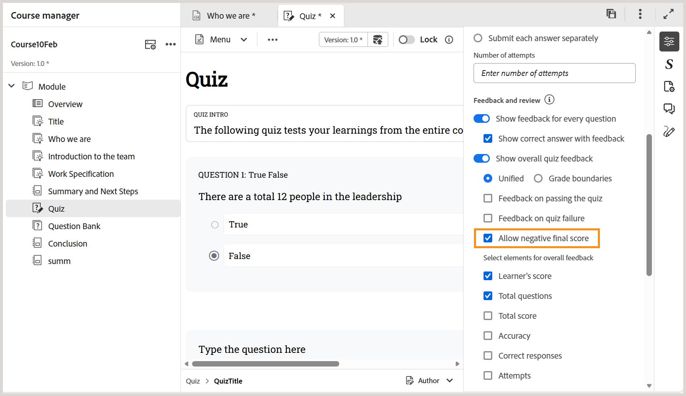

# Version Februar 2026 von Produktschulungen und Lerninhalten

Diese Versionshinweise behandeln die neuen Funktionsverbesserungen und Probleme, die in der Version vom Februar 2026 der Produktschulungen und Lerninhalte behoben wurden.

## Neue Funktionsverbesserungen

Die folgenden Funktionen werden in der Version vom Februar 2026 von Produktschulungen und Lerninhalten eingeführt:

- **Unterstützung für Untertitel**: Sie können jetzt Untertitel zu Ihren Lerninhalten hinzufügen, indem Sie die neue Option **Untertitel hinzufügen** in **Dateieigenschaften**. Dies erhöht die Klarheit und verbessert die Durchsuchbarkeit des gesamten Kursinhalts.

  Weitere Informationen finden Sie unter [Hinzufügen von Titeln und Untertiteln zu Lerninhalten](../learning-content/lc-basic-blocks.md#add-title-and-subtitle-to-learning-content).

  

- **Negatives Endergebnis aktivieren oder deaktivieren**: Beim Konfigurieren der Quizeigenschaften können Sie das negative Endergebnis mit der Option **Negatives Endergebnis zulassen** steuern. Wenn diese Option aktiviert ist, erhalten Lernende einen Mindestwert von null, auch wenn eine negative Markierung angewendet wird. Dadurch bleiben die Teilnehmer motiviert, da sichergestellt wird, dass die Punktzahl nie unter null fällt.

  Weitere Informationen zu [Quiz-Eigenschaften](../learning-content/quiz-properties.md).

  

- **Löschen von Widgets per Rechtsklick**: Zusätzlich zum Löschen von Quizfragen können Sie jetzt auch Widgets wie Akkordeons, Flip-Karten und andere Widgets mit **Rechtsklick > Element löschen** löschen. Diese Verbesserung erweitert die vorhandene Funktion *Frage löschen* auf Widgets, sodass Sie sie mit weniger Klicks und minimaler Navigation entfernen können.

  Weitere Informationen über [Verwenden interaktiver Widgets](../learning-content/lc-widgets.md).

  
- **Antworten festhalten**: Sie können jetzt bestimmte Antworten festhalten, sodass ihre Position unverändert bleibt, auch wenn Antworten während der SCORM-Ausgabegenerierung randomisiert werden. Dies ist besonders nützlich für Optionen wie *alle der oben genannten* oder *keine der oben genannten*.

  Weitere Informationen über [Frageneigenschaften](../learning-content/quiz-insert-questions.md#question-properties).

  
- **Art der Kurzantwort**: Mit dem Fragetyp „Kurzantwort“ können Lernende kurze, beschreibende alphanumerische Antworten verwenden, anstatt vordefinierte Optionen auszuwählen. Dieser Fragetyp ermutigt Lernende, sich aktiv zu erinnern und ihr Verständnis in ihren eigenen Worten zu artikulieren, wodurch Bewertungen für Lernende ansprechender werden.

  Weitere Informationen zu [Fragetypen](../learning-content/quiz-insert-questions.md#question-types).

  
- **Sequenzieller Versuch für Quizfragen**: Sie können jetzt sequenzielle Quizversuche für die SCORM-Ausgabe mithilfe der Option **Teilnehmer müssen jede Frage versuchen, um fortzufahren** in der SCORM-Ausgabevorgabe erzwingen. Wenn diese Option aktiviert ist, müssen die Teilnehmer jede Frage beantworten, bevor sie zur nächsten Frage wechseln. Die Navigation ist dabei so lange eingeschränkt, bis die aktuelle Frage abgeschlossen ist. Dadurch wird ein geführter, schrittweiser Bewertungsablauf und ein konsistentes Lernerlebnis gewährleistet.

  Weitere Informationen finden Sie unter [SCORM-Ausgabevorgabe konfigurieren](../learning-content/config-scorm-preset.md).

  

## Behobene Probleme

Die folgenden Probleme wurden in der Version vom Februar 2026 der Produktschulungen und Lerninhalte behoben:

- Beim Veröffentlichen der SCORM-Ausgabe und Bereitstellen auf ALM zeigt der L2-Quizbericht falsche Summen- und Maximalwerte für Quiz an, die mehrere Versuche und eine zufällige Fragenbankauswahl verwenden. (GUIDES-38855)
- Wenn ein Kurs auf dem Cloud-Server generiert wird, wird aufgrund des `coralui3.css` Stylesheets ein unbeabsichtigter Leerraum unter der Copyright-Fußzeile angezeigt, was zu Inkonsistenzen im Layout führt. (GUIDES-38853)
- Beim Navigieren zu einem Kurs mit Akkordeon über die Tastatur wird das Pluszeichen (+) oder der Registerkartentitel nicht hervorgehoben, was die visuelle Identifizierung des aktiven Elements verhindert. (GUIDES-38852)
- Für Kurse, die mit der SCORM-Carbon-Vorlage oder der Standardvorlage generiert wurden, werden beim Zugriff auf ein Mobilgerät im Querformat im Inhaltsverzeichnis (Kursmenü) keine Modul-Links angezeigt, die die Navigation verhindern. (GUIDES-38851)
- Beim Replizieren der Hierarchie für einen Kurs in Experience Manager Guides muss zum Erstellen eines Lernobjekts zunächst eine Lerngruppe erstellt werden, da Ergänzungen auf Objektebene nicht unterstützt werden. (GUIDES-38849)
- Der Versuch, mithilfe der Tastatur auf die Dropdown-Optionen in Übereinstimmung mit dem folgenden Fragetyp zuzugreifen, schlägt fehl, da die Optionen nicht auf die Tabulator- oder Pfeiltaste reagieren, die die Navigation verhindert. (GUIDES-38985)
- Durch Anwenden einer Vorgabe für den Überschriftenstil wird der ausgewählte Text ausgeblendet, wahrscheinlich aufgrund der Änderung der Schriftfarbe in Weiß, sodass der Text nicht mehr auswählbar und nicht sichtbar ist. (GUIDES-39981)
- Wenn Sie Experience Manager Guides in Mozilla Firefox verwenden, zeigt die Flip-Karte nach dem Spiegeln den Vorderseitentext rückwärts auf der Rückseite an. (GUIDES-39983)
- Wenn Sie auf das Inhaltsverzeichnis (TOC) im linken Bereich für den Kurs klicken, zeigt der Kurs weiterhin den Abschlussstatus an, auch wenn das Quiz fehlgeschlagen ist. (GUIDES-40398)
- Der Versuch, den folgenden Fragetyp in einem Quiz in ALM falsch abzugleichen, führt dazu, dass die ausgewählten Optionen nicht im Bericht angezeigt werden. (GUIDES-38640)
- Beim Generieren der PDF-Ausgabe werden die angewendeten Authoring-Stile nicht beibehalten, was zu Inkonsistenzen im Design führt. (GUIDES-38642)

