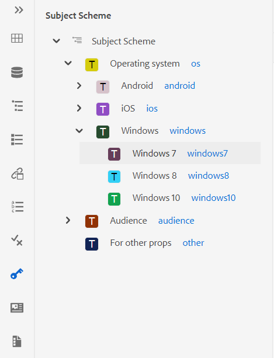
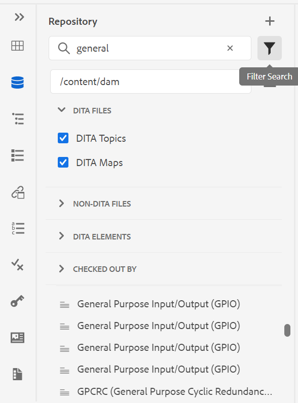
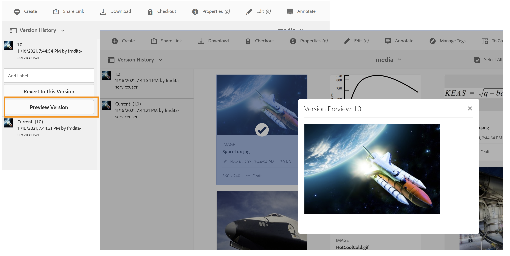

# Version Januar von [!DNL Adobe Experience Manager Guides] as a Cloud Service

## Upgrade auf die Version Januar

Führen Sie ein Upgrade Ihres aktuellen [!DNL Adobe Experience Manager Guides] as a Cloud Service-Setups (später [!DNL AEM Guides] as a Cloud Service-Setup genannt) durch, indem Sie die folgenden Schritte ausführen:
1. Checken Sie den Git-Code der Cloud Service aus und wechseln Sie zu der Verzweigung, die in der Cloud Service-Pipeline konfiguriert ist und der Umgebung entspricht, die Sie aktualisieren möchten.
1. Aktualisieren Sie `<dox.version>` Eigenschaft in `/dox/dox.installer/pom.xml` Datei Ihres Cloud Service-Git-Codes auf Version 2022.1.78.
1. Übertragen Sie die Änderungen und führen Sie die Cloud Service-Pipeline aus, um auf die Version Januar von [!DNL AEM Guides] as a Cloud Service zu aktualisieren.

## Kompatibilitätsmatrix

In diesem Abschnitt wird die Kompatibilitätsmatrix für die Softwareanwendungen aufgelistet, die von [!DNL AEM Guides] Version vom as a Cloud Service Januar 2022 unterstützt werden.

### FrameMaker und FrameMaker Publishing Server

| FMPS | FrameMaker |
| --- | --- |
| Nicht kompatibel | Aktualisierung 2020 4 und höher |
| | |

### Sauerstoffanschluss

| [!DNL AEM Guides] Cloud-Version | Fenster des Sauerstoffanschlusses | Oxygen Connector Mac | In Oxygen Windows bearbeiten | In Oxygen Mac bearbeiten |
| --- | --- | --- | --- | --- |
| 2022.1.0 | 2.4.0 | 2.4.0 | 2,2 | 2,2 |
|  |  |  |  |  |

## Neue Funktionen und Verbesserungen

### Artikelbasierte Veröffentlichung

Mit der Version vom Januar haben wir eine Funktion zum Veröffentlichen auf Artikelbasis eingeführt, die in den Web-Editor integriert ist. Sie können die Funktion zur artikelbasierten Veröffentlichung verwenden, um inkrementell Ausgaben für ein oder mehrere Themen zu generieren oder Ihre Inhalte auf einer Knowledgebase-Plattform zu veröffentlichen.

Mit dieser Funktion können Benutzer die DITA-Karte additiv erstellen und Themen veröffentlichen, sobald sie bereit sind. Nachdem Sie Ihre Zuordnung veröffentlicht haben, verwenden Sie die Funktion zum Veröffentlichen auf Artikelbasis, um eine inkrementelle Veröffentlichung nur für die aktualisierten Artikel zu erzielen.

Zusätzlich zu AEM können Sie diese einzigartige Funktion verwenden, um Ihre Artikel auf allen Knowledgebase-Portalen wie Salesforce zu veröffentlichen. Diese Funktion enthält auch eine OOTB-Inhaltsvorlage, die auf den AEM-Kernkomponenten basiert und Ihnen die Erstellung eines wissensbasierten Repositorys für die technischen Inhalte ermöglicht. Das Tolle an dieser Vorlage ist, dass sie vollständig an Ihre Unternehmensanforderungen angepasst werden kann und auch Anwendungsfälle wie Unternehmens-Intranetportale unterstützen kann.
Sie können die Artikel auch nach Dokumentstatus und Änderungszeit filtern.

Diese bedarfsorientierte Artikelveröffentlichung von unterwegs gibt Ihnen nicht nur vollständige Kontrolle über die Veröffentlichung Ihrer Inhalte, sondern reduziert auch die Gesamtzeit für die Veröffentlichung Ihrer aktualisierten Inhalte.
Wenn Sie Ihre Artikel mit dieser Vorlage veröffentlichen, kann sie auch die Metadaten an Ihre veröffentlichten Seiten weitergeben.
Weitere Informationen finden Sie unter *Artikelbasierte Veröffentlichung im Web* Editor im Benutzerhandbuch.

### Verbesserter Web-Editor

Es gibt viele Verbesserungen und neue Funktionen, die im Web-Editor eingeführt werden:

* Unterstützung für das Betreffschema wurde auch im Web-Editor hinzugefügt. Sie können jetzt das Betreffschema mithilfe des Bedienfelds „Betreffschema“ erstellen und verwenden. Durch das Hinzufügen des Betreffschemas können Sie jetzt eigene Unternehmensmetadaten und -taxonomien verwenden.

* In dieser Version wurde ein neues Glossar-Hotspot-Tool eingeführt, mit dem Glossare stapelweise verwaltet werden können. Mit diesem Tool können Sie Text schnell in Glossare und Glossare für eine ausgewählte Karte oder offene Themen stapelweise in Begriffe konvertieren.

* Im Bedienfeld Wiederverwendbarer Inhalt wurde eine Aktualisierungsfunktion hinzugefügt, mit der Sie den wiederverwendbaren Inhalt in Referenzdateien schnell aktualisieren können.
* Der Indikator Neue Arbeitskopie zeigt an, ob Ihre aktuelle (Arbeitskopie) der Datei mit der gespeicherten Version synchronisiert ist oder nicht.

* Der Suchfilter im Repository-Bedienfeld und das Dialogfeld zum Durchsuchen von Dateien wurde verbessert, um mehr Filteroptionen zu bieten, die weiter angepasst werden können.

* Sie können jetzt DOCX-Dateien über den Web-Editor hochladen.

### Authoring mit FrameMaker

Jetzt können Sie Ihre Dokumente in FrameMaker erstellen und veröffentlichen. FrameMaker wird mit einem vorkonfigurierten Anschluss für Adobe Experience Manager ausgeliefert. Beim FrameMaker erhalten Sie eine benutzerfreundliche Oberfläche, über die Sie Ihre Dokumente in einer verteilten und gemeinsamen Umgebung verwalten können.

Nachdem Sie Ihren Inhalt erstellt haben, können Sie mit FrameMaker Ihre Dokumente in verschiedenen Formaten veröffentlichen - PDF, HTML5, EPUB und DITA. Sie können auch die verschiedenen Dateiverwaltungsvorgänge wie Auschecken, Auschecken mit abhängigen Elementen, Einchecken, Aktualisieren usw. durchführen.
Verwenden Sie zum Erstellen mit FrameMaker in [!DNL AEM Guides] as a Cloud Service die FrameMaker-Version 2020.4 und höher.

### Neues Übersetzungs-Dashboard

Im Web-Editor wurde ein neues Übersetzungs-Dashboard mit den folgenden Funktionen eingeführt:

* Sortieren, Suchen und Filtern der Themenliste.
* Filtern von Inhalten nach Referenztyp - direkte oder indirekte Verweise.
* Einfache Navigation beim Suchen eines vorhandenen Projekts beim Initiieren einer Übersetzungsanfrage.
* Es wurde ein mehrsprachiger Übersetzungsmechanismus eingeführt, um zu vermeiden, dass mehrere Projekte für jede Sprache erstellt werden, wenn die Übersetzungsanfrage für mehr als eine Sprache initiiert wird.
* Es wurde eine Konfiguration zum Ausblenden der Registerkarte „Übersetzung“ im Zuordnungs-Dashboard eingeführt. Standardmäßig ist sie sichtbar. Sie können Inhalte entweder über das Zuordnungs-Dashboard oder den Web-Editor übersetzen.

### Erweiterte Veröffentlichung

* Autoren können jetzt Metadaten auf Zuordnungs- und Themenebene an die DITA-OT-Veröffentlichung übergeben. Dies ist hilfreich, wenn benutzerdefinierte PDF-Vorlagen so konzipiert sind, dass sie Dateimetadateneigenschaften wie Tags, Autor, Dokumentstatus und mehr verwenden.

* Es wurde eine neue Konfiguration hinzugefügt, mit der Benutzende die Versionen der zu löschenden Themen beibehalten oder löschen können, wenn **Option „Löschen und Erstellen** in der Ausgabegenerierung der AEM-Site verwendet wird.

### Verbesserte Dateiverarbeitung

Die folgenden Verbesserungen sind jetzt beim Arbeiten mit -Dateien in AEM Assets zu sehen:
* Ein neues Datei-Upload-Erlebnis und ein neues Dialogfeld zur Auswahl einer Konfliktbewältigungsstrategie wurden eingeführt.

* Möglichkeit zum Erstellen einer neuen Version der hochgeladenen Datei mit der Möglichkeit, das Überschreiben einer ausgecheckten Datei zu verhindern.
* Jetzt können Sie eine Vorschau von Bildern direkt über die Ansicht Versionsverlauf anzeigen. Bei DITA- und Nicht-DITA-Dateien zeigt der Versionsverlauf die aktuellen Versionsinformationen separat an.

* Wenn Benutzende eine DITA-Datei erstellen, wird der Standarddateiname in kleiner Groß-/Kleinschreibung angezeigt, um inline mit dem Erstellungsszenario des nativen AEM-Ordners zu sein.

### Neue Berichtsexportfunktion

Berichte sind sehr nützlich, um den Zustand Ihrer Inhalte zu ermitteln. [!DNL AEM Guides] as a Cloud Service bietet verschiedene Berichte, um die Kontrolle über Ihre Inhalte zu übernehmen. Jetzt können Sie nicht nur die Berichte anzeigen, sondern auch die Berichtsdaten in eine CSV-Datei exportieren, um sie anzuzeigen und für Ihr größeres Team freizugeben. Berichtsdaten können Ihnen einen schnellen Überblick über fehlerhafte Links oder fehlende Bilder geben.

### Verbessertes Aktualisierungserlebnis bei Oxygen DAM

Wenn Sie Dateien vom AEM-Server in Oxygen aktualisieren, wird eine Warnmeldung angezeigt, wenn Sie nicht gespeicherte Dateien in Ihrer aktuellen Oxygen-Sitzung haben. Sie können den Aktualisierungsvorgang abbrechen, um nicht gespeicherte Dateien zu speichern. Ohne diese Funktion verloren die Benutzer alle nicht gespeicherten Informationen in ihren Dokumenten.

### Weitere Funktionsverbesserungen

* Sie können jetzt eine neue Vorlage **DITA-Projekt** unter dem Pfad **/apps/projects/templates** erstellen.
* Laden Sie jetzt die standardmäßige Datei **ui_config.json** aus Ihren Ordnerprofilen herunter. Dies kann verwendet werden, um beim Upgrade benutzerdefinierte Änderungen aus der vorhandenen Datei **ui_config.json** zusammenzuführen.
* Sie müssen den Browser-Cache nicht löschen, selbst wenn neue Versionen von JS-Dateien vorhanden sind.

## Behobene Probleme

Die in verschiedenen Bereichen behobenen Fehler sind unten aufgeführt:

### Web-Editor

* Korallenriffe erscheinen in roter Farbe, auch wenn sie nicht gebrochen sind. (8 239)
* Der Wert für das bedingte Attribut wird nicht automatisch ausgefüllt, wenn Alle Eigenschaften hinzufügen im DITAVAL-Editor ausgewählt ist. (8234)
* Autoren können kein Bild unter Verwendung eines relativen Pfads in ein Thema einfügen. (8112)
* Auf der Seite Prüfungsaufgabe werden die Multimediadateien nicht angezeigt, wenn im Dateinamen Leerzeichen vorhanden sind. (8111)
* Der in der Tabellenzelle hinzugefügte pH-Wert wird rot angezeigt. (8 083)
* Links in der Prüfungsaufgabe werden nicht aktualisiert, wenn die zu überprüfenden Dateien verschoben werden. (8080)
* Im Web-Editor werden Bilder, bei denen die Skalierungseigenschaft auf 75 % oder höher eingestellt ist, nicht korrekt gerendert. (8073)
* GIF-Bilder werden im Web-Editor als statische Bilder gerendert. (8024)
* Ein conkeyref in einem Notizenelement wird weder in der Vorschau des Web-Editors noch in der Ausgabe angezeigt. (8006)
* Eine XRef für ein Element, das selbst eine Konfig ist, wird im Editor nicht aufgelöst. (7933)
* Titel mit Schlüssel werden in der Editor-Vorschau und im Repository-Bedienfeld nicht korrekt gerendert. (7909)
* Ausschnitte mit Sonderzeichen werden nicht korrekt gespeichert. (7908)
* Das Speichern eines Themas nach dem Formatieren von MathML-Gleichungen führt zu einem Fehler. (7954)
* Keydef mit „tm“ werden im Editor nicht ordnungsgemäß gerendert und die AEM-Site-Ausgabe enthielt doppelte TM-Symbole. (7 859)
* Das Ziehen und Ablegen eines Snippets funktioniert nicht wie in den DTDs festgelegt. (7 758)
* Beim HTML werden benutzerdefinierte Abmessungen für Grafiken ignoriert. (7 718)
* Das Attribut conrefend wird beim Verschieben der Quelldatei nicht aktualisiert. (7698)
* Die Arbeit mit Referenzdokumenten für Thementypen führt zu mehreren Problemen mit der Benutzeroberfläche. (7656)
* DITAVAL-Dateien werden nicht angezeigt, wenn der Autor ditavalref in einer Karte hinzufügt. (7594)
* Wenn dem Element das Attribut „outputClass“ hinzugefügt wird, wird in jedem leeren `<entry>`-Element unerwartetes Leerzeichen `<tgroup>`. (7532)
* Die Schaltfläche &quot;Source&quot; funktioniert nicht für Themen, die über das Zuordnungs-Dashboard geöffnet werden. (7465)
* Der schöne Druck fügt Leerzeilen und Leerzeichen ein, die beim Öffnen der Datei im FrameMaker oder Oxygen sichtbar sind. (7408)
* Karten mit „href=&quot;/&quot; in Themen werden nicht auf AEM-Sites veröffentlicht. (7405)
* Im Editor aufgetretene Leistungsprobleme, wenn die Stammzuordnung über eine große Anzahl von Schlüsselwörtern verfügt. (7400)
* Dokumentstatus für eine Zuordnung mit benutzerdefinierter Vorlage wird nicht von dem entsprechenden Profilstatus übernommen. (7359)
* `<tm>` Element wird fälschlicherweise als Blockelement gerendert. (7 286)
* Doppelte Vorlagen werden im Bereich der Editor-Vorlagen angezeigt, wenn eine neue Vorlage erstellt wird. (5 814)
* Vorlagen, die in ui_config für Bilder zum Festlegen zusätzlicher Attribute definiert sind, können nicht für Drag-and-Drop-Fälle verwendet werden. (5 713)
* Falsche Standarddarstellung von uicontrol in menucascade. (5 483)
* Benutzerdefinierte Vorlagen für Topic/Map zeigen in der Benutzeroberfläche keinen neuen Namen an. Der Name wird als „Thema“/„Zuordnung“ angezeigt, anstatt den konfigurierten Namen anzuzeigen. (4958)
* Möglichkeit, die Rootmap aus den Benutzereinstellungen zu löschen. (8534)
* Eine neu erstellte Zuordnungssammlung wird auch nach dem Aktualisieren der Seite nicht aufgeführt.(8603)
* Entsperrtes Thema kann nicht geschlossen werden. (8545)
* Beim Wechseln zwischen Quell- und Autorenmodus wird das Thema als beschädigt markiert und der Inhalt muss erneut gespeichert werden.(8524)
* Das Bedienfeld „Inhalt wiederverwenden“ stürzt bei der Suche nach Sonderzeichen `[` oder `*` ab.(8 279)
* Der Cursor wird nicht in der Suchleiste angezeigt, wenn das Dialogfeld Element einfügen durch den Tastaturbefehl Alt+Eingabe geöffnet wird.(7912)
* Die Suchoption sucht nur nach Dateinamen und nicht nach Inhalt. (7 784)

### Sauerstoffanschluss

* Dateien, deren übergeordneter Ordner Sonderzeichen enthält, geben beim Laden in Oxygen einen Fehler aus. (8054)
* Wenn ein neu erstelltes Dokument in Oxygen geöffnet wird, wird der Fehler „GUID kann nicht gefunden werden“ ausgegeben. (7 856)
* Die Eincheckoption wird deaktiviert, nachdem die Datei aus AEM ausgecheckt wurde, indem „In Oxygen bearbeiten“ verwendet wird. (7471)

### Überprüfung

* Die Echtzeit-Synchronisierung funktioniert nicht für Kommentare. (7661)

### Zuordnungs-Dashboard

* Konkreter Inhalt im Titel eines Themas wird auf der Registerkarte „Themen“ oder „Berichte“ des Zuordnungs-Dashboards nicht angezeigt. (8 263)
* AEM Sites-Ausgabe | jcr:title der generierten Site-Seite wird nicht aktualisiert, wenn der DITA-Thementitel aktualisiert wird. (8 131)
* Download MAP lädt die in den Themen verwendeten Videodateien nicht herunter. (8070)
* Mediendateien werden nicht heruntergeladen, wenn das Objekt-Tag über die Download-Bookmap-API verwendet wird. (8057)
* Falscher Bericht wird auf der Registerkarte „Berichte“ angezeigt, wenn ein Thema auf eine Datei verweist, deren Titel mit „conref“ beginnt. (4698)
* Das Dialogfeld Beschriftungen anwenden auf der Registerkarte Baseline zeigt keine Beschriftungen in der Dropdown-Liste an. (8455)

### Veröffentlichung

* Die PDF-Erstellung schlägt zum ersten Mal fehl, wenn „Versionierung aktivieren“ ausgewählt wird. (8 053, 8 294)
* Leerzeichen werden nach einem „tm;“-Tag in der AEM-Site-Ausgabe automatisch hinzugefügt. (7964)
* YouTube-Videos können nicht in der AEM-Site-Ausgabe angezeigt werden. (7401)
* Die Filterung nach Kennzeichnung schlägt für referenzierte Inhalte fehl, nachdem der Benutzer auf Alle Themen in der Registerkarte „Baseline“ des Zuordnungs-Dashboards geklickt hat. (7388)
* Veröffentlichungsthema mit Element `<tm>` mit dem Eigenschaftswert SM oder reg wird in der generierten Ausgabe falsch angezeigt. (7 239)
* Bei der grundlegenden Veröffentlichung mit Bild wird nicht die neueste Version des Bildes in der veröffentlichten Ausgabe ausgewählt. (7231)
* Relative referenzierte Themen werden auf der Registerkarte „Grundlinie“ angezeigt. (5 424)
* Die inkrementelle Veröffentlichung eines Themas mit conkeyref im Titel funktioniert nicht wie erwartet. (4474)
* Der Seitentitel wird nicht für die Generierung der Ausgabe-URL verwendet, obwohl diese Einstellung aktiviert ist. (8 257)
* Grundlegende Veröffentlichung : Auswahl der aktuellen Version der Bilder anstelle des eingefrorenen Knotens. Dies wird auch angezeigt, wenn ein Bild Leerzeichen oder Sonderzeichen im Dateinamen enthält. (8 274, 8 322)
* Die inkrementelle Veröffentlichung schlägt für die DITA-Zuordnung mit dem Typ „Betreff“ und dem Schema „mapref“ fehl. (8218)
* Null wird hinzugefügt, wenn dem Publish-Dashboard eine Zuordnung hinzugefügt wird. (8695)
* Bei Verwendung der grundlegenden Veröffentlichung mit dem Bild als Einschränkung im Thema wird das Bild nicht in der Ausgabe veröffentlicht. (8564)
* Die Veröffentlichung schlägt mit einer Ausnahme fehl, wenn die in der AEM-Site-Veröffentlichung verwendete Grundlinie gelöscht wird. (8572)
* Die Themenregenerierung funktioniert nicht. (8091)
* Es bestehen Probleme beim Veröffentlichen von Fußnoten in Tabellen. (4709)

### AEM Assets

* Bei der Auswahl/Löschung von umfangreichen Inhalten in der Assets-Benutzeroberfläche wurden Leistungsprobleme gefunden. (8 238)
* Die Funktion für gespeicherte Suchen (Smart-Sammlung) funktioniert nicht, wenn den Suchfiltern das DITA-Prädikat hinzugefügt wird. (8048)
* Das Zurücksetzen des Bildes auf eine ältere Version funktioniert nicht. (DXML-7903)
* Die Option „Löschen“ ist auch für Autorinnen und Autoren sichtbar, die nicht über die Berechtigung zum Löschen verfügen. (7322)
* Mit der CCMS-Überlagerung für den Assets-Editor wird die Wiedergabe der Option „Löschen“ unterbrochen. (8093)
* Das Dokumentprofil wird nicht gelöscht. (8604)
* Verweise werden beschädigt, wenn „Alle auswählen“ ausgeführt und der Multimedia-/DITA_CONTENT-Inhalt in einen anderen Ordner verschoben wird. (8621)
* Beim Verschieben der Assets treten in der Quelle falsche Verweise auf. (8 627)
* Feste Listenansicht wird nicht geladen. (8542)

### Content-Import

* Konvertierung von HTML in DITA | Tabelle mit &#39;tr&#39; mit leeren &#39;td&#39;-Einträgen verursacht zusätzliche Zeilen in der Ausgabe. (8 132)
* Konvertierung von HTML in DITA | HTML mit einer Tabelle mit mehreren TBODY schlägt mit Ausnahme fehl. (7940)
* Konvertierung von HTML in DITA | gibt Fehler aus, wenn die Quell-HTML Kommentare enthält. (7 937)
* Beim Importieren von DITA 1.3 DITA-Dateien werden einige href-Elemente in falsch formatierte Links umgewandelt. (8019)

## Bekannte Probleme

Adobe hat die folgenden bekannten Probleme in [!DNL AEM Guides] Version vom as a Cloud Service Januar 2022 festgestellt.

### Bekannte Probleme mit Workaround

Verwenden Sie die angegebene Problemumgehung für die folgenden bekannten Probleme:

* Die Web-Authentifizierung funktioniert nicht für den Oxygen-Connector in Mac.
  **Problemumgehung**: Verwenden Sie vorerst den Oxygen-Connector unter Windows.

* Im Firefox-Browser können die Überprüfungskommentare nicht importiert werden, ohne die Ansicht nebeneinander zu öffnen.
  **Problemumgehung**: Verwenden Sie vorerst den Chrome-Browser.

* Verweise werden beschädigt, wenn die Bilder oder Multimediadateien verschoben werden, die Leerzeichen in den Dateinamen enthalten.
  **Problemumgehung**: Benennen Sie die Datei um und entfernen Sie die Leerzeichen aus dem Dateinamen, bevor Sie sie verschieben.

* Das Zuordnungs-Dashboard wird in der neuesten Version des Chrome-Browsers nicht gelegentlich geladen.
  **Problemumgehung**: Aktualisieren Sie die Dashboard-Seite „Zuordnung“.

### Andere bekannte Probleme

* Wenn Oxygen über die Web-Authentifizierung mit [!DNL AEM Guides] Lösung verbunden ist, schlägt die Abmeldung fehl.
* Prüfungsaufgaben können den Benutzenden nicht neu zugewiesen werden.
* Probleme treten in der Zuordnungssammlungs-Benutzeroberfläche auf, z. B. der Text ist verzerrt und **Alle auswählen** die Funktion funktioniert nicht ordnungsgemäß.
