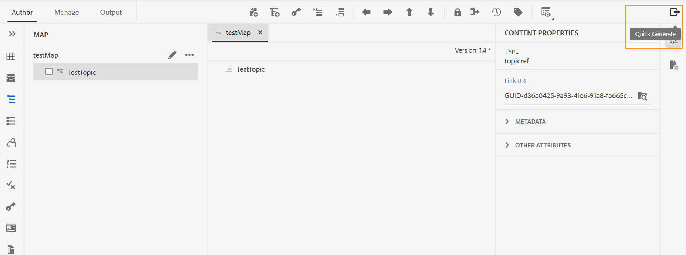

# Oktober-Version von Adobe Experience Manager Guides as a Cloud Service

## Upgrade auf die Version Oktober

Führen Sie ein Upgrade Ihres aktuellen Adobe Experience Manager Guides as a Cloud Service-Setups (später als *AEM Guides as a Cloud Service* bezeichnet) durch, indem Sie die folgenden Schritte ausführen:
1. Checken Sie den Git-Code der Cloud Services aus und wechseln Sie zu der Verzweigung, die in der Cloud Services-Pipeline konfiguriert ist und der Umgebung entspricht, die Sie aktualisieren möchten.
1. Aktualisieren Sie `<dox.version>` Eigenschaft in `/dox/dox.installer/pom.xml` Datei Ihres Cloud Services-Git-Codes auf 2022.10.183.
1. Übertragen Sie die Änderungen und führen Sie die Cloud Services-Pipeline aus, um auf die Oktober-Version von AEM Guides as a Cloud Service zu aktualisieren.

## Kompatibilitätsmatrix

In diesem Abschnitt finden Sie die Kompatibilitätsmatrix für die Softwareanwendungen, die von AEM Guides as a Cloud Service Version Oktober 2022 unterstützt werden.

### FrameMaker und FrameMaker Publishing Server

| FMPS | FrameMaker |
| --- | --- |
| Nicht kompatibel | Aktualisierung 2020 4 und höher |
| | |

*Die in AEM erstellten Grundlinien und Bedingungen werden ab 2020.2 in FMPS-Versionen unterstützt.

### Sauerstoffanschluss

| AEM Guides as a Cloud Service-Version | Fenster des Sauerstoffanschlusses | Oxygen Connector Mac | In Oxygen Windows bearbeiten | In Oxygen Mac bearbeiten |
| --- | --- | --- | --- | --- |
| 2022.10.0 | 2.7.13 | 2.7.13 | 2,3 | 2,3 |
|  |  |  |  |  |

## Neue Funktionen und Verbesserungen

AEM Guides as a Cloud Service bietet in der Oktober-Version Verbesserungen und neue Funktionen:

### Bedienfeld „Schnellgenerierung“

Jetzt bietet AEM Guides das Bedienfeld **Quick Generate**, mit dem Sie schnell die Ausgabe für Vorgaben generieren und anzeigen können, die für Ihre DITA-Zuordnung erstellt wurden.

Im Bedienfeld **Schnellgenerierung** wird die Liste aller für Ihre DITA-Zuordnung erstellten Ausgabevorgaben angezeigt.

Wählen Sie eine oder mehrere Vorgaben aus und generieren Sie schnell die Ausgabe. Sie können auch schnell die für die Voreinstellungen generierte Ausgabe anzeigen. Bei der Generierung der Ausgabe wird eine Erfolgsmeldung angezeigt. Wenn die Ausgabegenerierung fehlschlägt, wird eine Fehlermeldung angezeigt. Sie können auch das Fehlerprotokoll einsehen, um die Details des Fehlers anzuzeigen, der beim Generierungsprozess aufgetreten ist.

## Behobene Probleme

Die in verschiedenen Bereichen behobenen Fehler sind unten aufgeführt:

* Native PDF | Fehler tritt beim Entfernen von Themen nur für Ressourcen aus der PDF-Ausgabe auf. (10554)
* Native PDF | Leere Keyrefs werden in der PDF-Ausgabe angezeigt. (10553)
* Native PDF | `navtitle` für `topichead` wird nicht berücksichtigt. (10509)
* Native PDF | Unterstützung für AMD64-JDK-Varianten erforderlich. (10465)
* Natives PDF | Frontend-Themen können nicht aus dem Inhaltsverzeichnis ausgeblendet werden. (10355)
* Native PDF | Durch das Neustarten der Seitenzahl im Kapitellayout wird die Nummerierung nach dem Zufallsprinzip vom Ende des vorherigen Kapitels aus gestartet. (10154)
* Chrome-Browser | Bildschirm wird beim Ziehen und Ablegen eines Elements aus der Benutzeroberfläche leer. Beispiel: Beim Ziehen einer Bedingung aus dem Bedienfeld Bedingungen . (10524)
* Knoteneigenschaften werden nach dem Kopieren und Einfügen eines Assets entfernt. (10053)
* Beim Klicken auf **Schließen** werden Benutzer zu Assets weitergeleitet - das Erlebnis wurde korrigiert, sodass Benutzer zur AEM-Homepage weitergeleitet werden. (9654)
