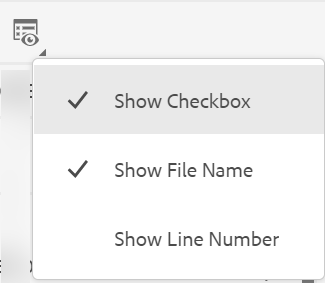

# August-Version von Adobe Experience Manager Guides as a Cloud Service

## Aktualisierung auf die August-Version

Führen Sie die folgenden Schritte aus, um das aktuelle Adobe Experience Manager Guides-as a Cloud Service-Setup (später als *AEM Guides as a Cloud Service* bezeichnet) zu aktualisieren:
1. Sehen Sie sich den Git-Code des Cloud Service an und wechseln Sie zu der Verzweigung, die in der Cloud Service-Pipeline entsprechend der Umgebung konfiguriert ist, die Sie aktualisieren möchten.
1. Aktualisieren Sie die Eigenschaft `<dox.version>` in der Datei `/dox/dox.installer/pom.xml` Ihres Cloud Service-Git-Codes auf 2022.8.167.
1. Übertragen Sie die Änderungen und führen Sie die Cloud Service-Pipeline aus, um auf die August-Version von AEM Guides as a Cloud Service zu aktualisieren.

## Kompatibilitätsmatrix

In diesem Abschnitt wird die Kompatibilitätsmatrix für die Softwareanwendungen aufgelistet, die von der AEM Guides as a Cloud Service-Version vom August 2022 unterstützt werden.

### FrameMaker und FrameMaker Publishing Server

| FMPS | FrameMaker |
| --- | --- |
| Nicht kompatibel | Aktualisierung 4 und höher für 2020 |
| | |

*Die in AEM erstellten Grundlinien und Bedingungen werden in FMPS-Versionen ab 2020.2 unterstützt.

### Sauerstoffanschluss

| AEM Guides as a Cloud-Version | Sauerstoff Connector Windows | Sauerstoff Connector Mac |
| --- | --- | --- |
| 2022.8.0 | 2,7,5 | 2,7,5 |
|  |  |  |

## Neue Funktionen und Verbesserungen

AEM Guides as a Cloud Service bietet viele Verbesserungen und neue Funktionen in der August-Version:

### Layout-Ansicht im Map Editor

Jetzt können Sie das vollständige Layout einer DITA-Karte im Map Editor anzeigen. Wenn Sie eine Karte zur Bearbeitung öffnen, wird die Ansicht **Layout** des Map-Editors geöffnet. In dieser Ansicht können Sie die Zuordnungshierarchie in einer Baumansicht sehen und die Themen in einer Zuordnung organisieren oder strukturieren.

Die Ansicht &quot;Layout&quot;enthält eine separate Symbolleiste, mit der Sie viele Aufgaben zu den in einer Zuordnung vorhandenen Themen ausführen können.
Sie können Themenverweise, Themengruppen und Schlüsseldefinitionen in eine Zuordnung einfügen. Sie können die in einer Karte vorhandenen Themen neu organisieren, indem Sie sie nach oben, unten, links oder rechts verschieben. Sie können die Themen auch per Drag-and-Drop in eine Karte verschieben. Der Map Editor bietet außerdem die Symbole zum Sperren oder Entsperren von Dateien, zum Überprüfen des Versionsverlaufs und zum Verwalten von Versionsbeschriftungen.

Die Ansicht &quot;Layout&quot;bietet außerdem die **Anzeigeoptionen** zum Anzeigen oder Ausblenden der Zeilennummer, zum Ein- oder Ausblenden des Kontrollkästchens oder zum Anzeigen des Dateinamens oder Titels für die Themen in einer Zuordnung.

Sie können die Themen auch basierend auf den angewendeten bedingten Filtern anzeigen.

Neben der Organisation von Themen in der Zuordnungsdatei können Sie auch Verweise über das Menü **Optionen** hinzufügen, verschieben, kopieren, einfügen oder löschen, das für ein Element in der Layout-Ansicht verfügbar ist. Sie können ein Thema oder eine Zuordnung auch per Drag-and-Drop aus dem Repository-Bedienfeld in die im Map Editor geöffnete Karte ziehen.

Im rechten Bereich werden die Inhaltseigenschaften und die Zuordnungseigenschaften in der Ansicht &quot;Layout&quot;des Map-Editors angezeigt. Die für das ausgewählte Thema definierten Inline-Attribute werden in der Layout-Ansicht dem Thema zugeordnet. Sie können beispielsweise schnell alle Themen finden, für die das Plattformattribut &quot;`IOS`&quot; definiert ist.

Jetzt können Sie auch die Metadateninformationen für die Themen oder die Zuordnung festlegen. Sie können den Navigationstitel, den Linktext, die Kurzbeschreibung und die Suchbegriffe für das ausgewählte Thema oder die ausgewählte Zuordnung definieren.

Weitere Informationen finden Sie im Abschnitt *Layout-Ansicht* unter Verwenden von Adobe Experience Manager Guides as a Cloud Service .

### Inline-Attribute in den Editor-Einstellungen

AEM Guides ermöglicht jetzt die Konfiguration von **Inline-Attributen** durch Ihren Administrator in den **Editor-Einstellungen**. Sie können auch neue Inline-Attribute hinzufügen oder die vorhandenen Attribute über die Registerkarte **Inline-Attribute** in den Editor-Einstellungen löschen.
Die konfigurierten Inline-Attribute, die für ein Thema definiert sind, werden in der Layout-Ansicht anhand des Themas angezeigt.

### Zusätzliche Filter in der Ansicht &quot;Repository&quot;

Die Filtersuche in der Repository-Ansicht wurde jetzt leistungsfähiger. Es wurden zwei neue Suchkriterien hinzugefügt: **Zuletzt geändert** und **Tags** , um die Dateien zu filtern und Ihre Suche im AEM-Repository einzuschränken:
* **Zuletzt geändert**: Sie können nach Dateien suchen, die nach einem ausgewählten Datum, aber vor einem ausgewählten Datum zuletzt geändert wurden. Sie können auch die vordefinierten Kriterien verwenden und nach Dateien suchen, die in den letzten 2 Stunden, in der letzten Woche, im letzten Monat oder im letzten Jahr zuletzt geändert wurden.
* **Tags**: Sie können auch nach Dateien suchen, auf die bestimmte Tags angewendet wurden. Sie können das Tag entweder eingeben oder aus der Dropdown-Liste auswählen.

## Behobene Probleme

Die in verschiedenen Bereichen behobenen Fehler sind unten aufgeführt:

* Veralteter Lucene-Index wird in /core/article-publish/src/main/java/com/adobe/dxml/article/publish/util/DoxUtils.java verwendet (9291).
* Aktualisiertes Node.js wird nicht für die Veröffentlichung verwendet. (9835)
* Das DITA-Thema wird nicht automatisch mit den Änderungen aktualisiert, die auf der Seite **Eigenschaften** vorgenommen wurden. (8745)
* Frontmatter-Element beim Hinzufügen zu einer DITA-Bookmap funktioniert nicht ordnungsgemäß. (9507)
* Native PDF | Bei Verwendung von **Quick Generate** für mehrere Dateien wird eine leere PDF generiert, wenn ein leeres Element ausgewählt wird. (9822)
* Native PDF | Anhang wird als Kapitel in der PDF-Ausgabe veröffentlicht. (9829)
* Native PDF | Wenn ein SVG-Bild bearbeitet wird, wird es im Seitenlayout nicht aktualisiert angezeigt. (9069)
* Beim Einfügen eines `Nonbreaking Hyphen` -Zeichens im Dialogfeld **Sonderzeichen einfügen** wird ein normaler Bindestrich eingefügt. (8919)
* Der XML-Editor zeigt keine aktualisierten Bilder in den Themen an, wenn sie bearbeitet wurden. (9500)
* Beim Veröffentlichen der Ausgabe über den Editor können die Vorgaben nicht aus dem Tab **Ausgabe** gelöscht werden. 9100
* Die Unterkarten einer DITA-Zuordnung werden nicht mithilfe der Option &quot;**Alle auswählen**&quot;aus dem Auslassungsmenü ausgecheckt. (9814)
* Zuordnungs- oder Themenvorlagen können nicht aus dem Menü **Vorlagen** in die benutzerdefinierte Zuordnungsvorlage im Web-Editor gezogen werden. (9846)
* Neue Themen- oder Zuordnungsvorlage kann nicht im Unterordner einer Zuordnungs- oder Themenvorlage erstellt werden. (9888)
* Es gibt keine Option zum Durchsuchen der Themen oder Maps, die in den Unterordnern einer Maps- oder Themenvorlage vorhanden sind. (9889)
* Wenn eine Schematron-Datei aktualisiert und zusammen mit der DITA-Datei gespeichert wird, wird das rechte Bedienfeld nicht angezeigt (wenn die DITA-Datei die in der Schematron-Datei vorhandenen Validierungen beschädigt). (9986)
* Eine neue doppelte Ausgabevorgabe kann erstellt werden, wenn ihr Name mit einer vorhandenen Vorgabe übereinstimmt. (9997)
* SVG-Bilder werden beschädigt und beim Generieren der HTML-Ausgabe nicht korrekt veröffentlicht. (9949)

## Bekannte Probleme

Adobe hat die folgenden bekannten Probleme in der AEM Guides as a Cloud Service-Version vom August 2022 identifiziert.

### Bekannte Probleme mit Problemumgehung

Verwenden Sie die bereitgestellte Problemumgehung für die folgenden bekannten Probleme:

* Die Ansicht &quot;Layout&quot;ist im Map Editor nicht sichtbar.

  **Problemumgehung**: Aktualisieren Sie ui_config.json im Ordnerprofil.

* Symbols.json wird überschrieben, sodass das Problem 8919 auftritt.

  **Problemumgehung**: Aktualisierte symbols.json muss mit überschriebenen symbols.json zusammengeführt werden.

### Andere bekannte Probleme

* Wenn mehrere Dateien aus dem Ergebnisabschnitt ausgewählt sind, der bei der Durchführung einer Suche im Repository angezeigt wird, und sie dann per Drag-and-Drop in der Autorenansicht abgelegt werden, wird nur eine Datei hinzugefügt.
