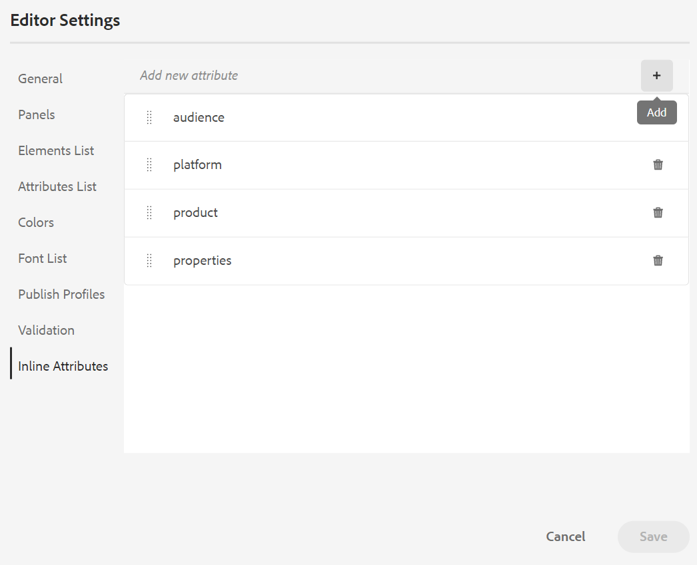

# August-Version von Adobe Experience Manager Guides as a Cloud Service

## Upgrade auf die August-Version

Führen Sie ein Upgrade Ihres aktuellen Adobe Experience Manager Guides as a Cloud Service-Setups (später als *AEM Guides as a Cloud Service* bezeichnet) durch, indem Sie die folgenden Schritte ausführen:
1. Checken Sie den Git-Code der Cloud Services aus und wechseln Sie zu der Verzweigung, die in der Cloud Services-Pipeline konfiguriert ist und der Umgebung entspricht, die Sie aktualisieren möchten.
1. Aktualisieren Sie `<dox.version>` Eigenschaft in `/dox/dox.installer/pom.xml` Datei Ihres Cloud Services-Git-Codes auf 2022.8.167.
1. Übertragen Sie die Änderungen und führen Sie die Cloud Services-Pipeline aus, um auf die August-Version von AEM Guides as a Cloud Service zu aktualisieren.

## Kompatibilitätsmatrix

In diesem Abschnitt finden Sie die Kompatibilitätsmatrix für die Softwareanwendungen, die von AEM Guides as a Cloud Service Version August 2022 unterstützt werden.

### FrameMaker und FrameMaker Publishing Server

| FMPS | FrameMaker |
| --- | --- |
| Nicht kompatibel | Aktualisierung 2020 4 und höher |
| | |

*Die in AEM erstellten Grundlinien und Bedingungen werden ab 2020.2 in FMPS-Versionen unterstützt.

### Sauerstoffanschluss

| AEM Guides as a Cloud Service-Version | Fenster des Sauerstoffanschlusses | Oxygen Connector Mac |
| --- | --- | --- |
| 2022.8.0 | 2,7,5 | 2,7,5 |
|  |  |  |

## Neue Funktionen und Verbesserungen

AEM Guides as a Cloud Service bietet in der August-Version viele Verbesserungen und neue Funktionen:

### Layout-Ansicht im Karten-Editor

Jetzt können Sie das vollständige Layout einer DITA-Karte im Karten-Editor anzeigen. Wenn Sie eine Karte zur Bearbeitung öffnen, wird die Ansicht **Layout** des Karteneditors geöffnet. In dieser Ansicht können Sie die Zuordnungshierarchie in einer Baumstrukturansicht anzeigen sowie die Themen in einer Zuordnung organisieren oder strukturieren.

Die Layout-Ansicht enthält eine separate Symbolleiste, mit der Sie viele Aufgaben zu den in einer Karte vorhandenen Themen ausführen können.
Sie können Themenreferenzen, Themengruppe und Schlüsseldefinitionen in eine Zuordnung einfügen. Sie können die in einer Karte vorhandenen Themen neu organisieren, indem Sie sie nach oben, unten, links oder rechts verschieben. Sie können die Themen auch per Drag-and-Drop in eine Karte verschieben. Der Zuordnungs-Editor bietet außerdem die Symbole zum Sperren oder Entsperren von Dateien, zum Überprüfen des Versionsverlaufs und zum Ausführen einer Versionskennzeichenverwaltung.

Die Layout-Ansicht enthält auch die **Ansichtsoptionen** zum Ein- oder Ausblenden der Zeilennummer, zum Ein- oder Ausblenden des Kontrollkästchens oder zum Anzeigen des Dateinamens oder des Titels für die Themen in einer Karte.

Sie können die Themen auch basierend auf den auf sie angewendeten bedingten Filtern anzeigen.

Zusätzlich zur Organisation von Themen in der Zuordnungsdatei können Sie Verweise auch über das Menü **Optionen** hinzufügen, verschieben, kopieren, einfügen oder löschen, das für ein Element in der Layout-Ansicht verfügbar ist. Sie können auch ein Thema oder eine Karte aus dem Repository-Bereich auf die im Karten-Editor geöffnete Karte ziehen und dort ablegen.

Im rechten Bedienfeld werden die Inhaltseigenschaften und die Zuordnungseigenschaften in der Layout-Ansicht des Zuordnungs-Editors angezeigt. Die für das ausgewählte Thema definierten Inline-Attribute werden für das Thema in der Layout-Ansicht angezeigt. Sie können beispielsweise schnell alle Themen finden, für die das Platform-Attribut als `IOS` definiert ist.

Jetzt können Sie auch die Metadateninformationen für die Themen oder die Zuordnung festlegen. Sie können den Navigationstitel, den Link-Text, die Kurzbeschreibung und die Keywords für das ausgewählte Thema oder die ausgewählte Karte definieren.

Weitere Informationen finden Sie im *Layout-Ansicht* in Verwenden von Adobe Experience Manager Guides as a Cloud Service.

### Inline-Attribute in den Editor-Einstellungen

AEM Guides ermöglicht jetzt die Konfiguration von **Inline** Attributen durch Ihren Administrator über die **Editor-Einstellungen**. Sie können auch neue Inline-Attribute hinzufügen oder die vorhandenen auf der Registerkarte **Inline-Attribute** in den Editor-Einstellungen löschen.
Die für ein Thema definierten konfigurierten Inline-Attribute werden für das Thema in der Layout-Ansicht angezeigt.

### Zusätzliche Filter in der Repository-Ansicht

Jetzt wurde die Filtersuche in der Repository-Ansicht leistungsfähiger. Es wurden zwei neue Suchkriterien **Zuletzt geändert** und **Tags** hinzugefügt, um die Dateien zu filtern und Ihre Suche im AEM-Repository einzugrenzen:
* **Zuletzt geändert**: Sie können nach Dateien suchen, die zuletzt nach einem ausgewählten Datum, aber vor einem ausgewählten Datum geändert wurden. Sie können auch die vordefinierten Kriterien verwenden und nach Dateien suchen, die in den letzten 2 Stunden, in der letzten Woche, im letzten Monat oder im letzten Jahr zuletzt geändert wurden.
* **Tags**: Sie können auch nach Dateien suchen, auf die bestimmte Tags angewendet wurden. Sie können das Tag entweder eingeben oder aus der Dropdown-Liste auswählen.

## Behobene Probleme

Die in verschiedenen Bereichen behobenen Fehler sind unten aufgeführt:

* Veralteter Lucene-Index wird in /core/article-publish/src/main/java/com/adobe/dxml/article/publish/util/DoxUtils.java (9291) verwendet
* Aktualisierte Node.js wird nicht für die Veröffentlichung verwendet. (9 835)
* Das DITA-Thema wird nicht automatisch mit den Änderungen aktualisiert, die auf der Seite **Eigenschaften** vorgenommen wurden. (8 745)
* Das Frontmatter-Element funktioniert beim Hinzufügen zu einer DITA-Lesekarte nicht ordnungsgemäß. (9507)
* Native PDF | Eine leere PDF wird bei Verwendung von **Quick Generate** für mehrere Dateien generiert, wenn ein leeres Element ausgewählt wird. (9822)
* Native PDF | Der Anhang wird als Kapitel in der PDF-Ausgabe veröffentlicht. (9 829)
* Native PDF | Wenn ein SVG-Bild bearbeitet wird, wird es im Seiten-Layout nicht angezeigt oder aktualisiert. (9069)
* Ein regulärer Bindestrich wird eingefügt, wenn im Dialogfeld „Sonderzeichen einfügen`Nonbreaking Hyphen` ein **eingefügt**. (8919)
* Der XML-Editor zeigt keine aktualisierten Bilder in den Themen an, wenn sie bearbeitet wurden. (9500)
* Beim Veröffentlichen der Ausgabe über den Editor können die Vorgaben nicht aus der Registerkarte **Ausgabe** gelöscht werden. (9100)
* Die Unterzuordnungen einer DITA-Zuordnung werden nicht mit der Option **Alle auswählen** aus dem Menü mit den Auslassungspunkten ausgecheckt. (9 814)
* Zuordnung oder Themenvorlagen können nicht aus dem Menü **Vorlagen** auf die benutzerdefinierte Zuordnungsvorlage im Web-Editor gezogen werden. (9 846)
* Es kann keine neue Themen- oder Zuordnungsvorlage im Unterordner einer Zuordnung oder Themenvorlage erstellt werden. (9 888)
* Es ist keine Option zum Durchsuchen der Themen oder Karten vorhanden, die in den Unterordnern einer Zuordnung oder Themenvorlage vorhanden sind. (9 889)
* Wenn eine Schematrondatei aktualisiert und zusammen mit der DITA-Datei gespeichert wird, wird der rechte Bereich nicht angezeigt (wenn die DITA-Datei die in der Schematrondatei vorhandenen Validierungen beschädigt). (9986)
* Es kann eine neue doppelte Ausgabevorgabe erstellt werden, wenn ihr Name mit dem einer vorhandenen Vorgabe übereinstimmt. (9997)
* SVG-Bilder werden beim Generieren der HTML-Ausgabe beschädigt und werden nicht korrekt veröffentlicht. (9949)

## Bekannte Probleme

Adobe hat die folgenden bekannten Probleme in AEM Guides as a Cloud Service Version August 2022 identifiziert.

### Bekannte Probleme mit Workaround

Verwenden Sie die angegebene Problemumgehung für die folgenden bekannten Probleme:

* Die Layout-Ansicht ist im Zuordnungs-Editor nicht sichtbar.

  **Problemumgehung**: Aktualisieren Sie ui_config.json im Ordnerprofil.

* Symbols.json wird überschrieben, sodass Problem 8919 auftritt.

  **Problemumgehung**: Aktualisierte symbols.json muss mit überschriebenen symbols.json zusammengeführt werden.

### Andere bekannte Probleme

* Wenn mehrere Dateien aus dem Ergebnisabschnitt bei einer Suche im Repository ausgewählt und dann in der Autorenansicht per Drag-and-Drop abgelegt werden, wird nur eine einzige Datei hinzugefügt.
