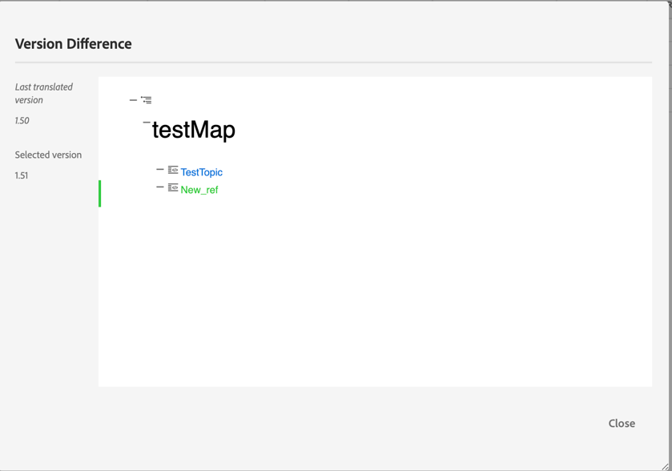

# September-Version von Adobe Experience Manager Guides as a Cloud Service

## Upgrade auf die Version September

Führen Sie ein Upgrade Ihres aktuellen Adobe Experience Manager Guides as a Cloud Service-Setups (später als *AEM Guides as a Cloud Service* bezeichnet) durch, indem Sie die folgenden Schritte ausführen:
1. Checken Sie den Git-Code der Cloud Services aus und wechseln Sie zu der Verzweigung, die in der Cloud Services-Pipeline konfiguriert ist und der Umgebung entspricht, die Sie aktualisieren möchten.
1. Aktualisieren Sie `<dox.version>` Eigenschaft in `/dox/dox.installer/pom.xml` Datei Ihres Cloud Services-Git-Codes auf 2022.9.178.
1. Übernehmen Sie die Änderungen und führen Sie die Cloud Services-Pipeline aus, um auf die Version September von AEM Guides as a Cloud Service zu aktualisieren.

## Schritte zum Indizieren des vorhandenen Inhalts

Führen Sie die folgenden Schritte aus, um den vorhandenen Inhalt zu indizieren und den neuen Text „Suchen und Ersetzen“ auf Zuordnungsebene zu verwenden:
* Ausführen einer POST-Anfrage an den Server (mit korrekter Authentifizierung) - `http://<server:port>/bin/guides/map-find/indexin`.
(Optional) Sie können bestimmte Pfade der Karten übergeben, um sie zu indizieren. Standardmäßig werden alle Karten indiziert ||  Beispiel :   `https://<Server:port>/bin/guides/map-find/indexing?paths=<map_path_in_repository>`)
* Die API gibt eine jobId zurück. Um den Auftragsstatus zu überprüfen, können Sie eine GET-Anfrage mit Auftrags-ID an denselben Endpunkt senden - `http://<server:port>/bin/guides/map-find/indexing?jobId={jobId}`
(Beispiel: `http://<_localhost:8080_>/bin/guides/map-find/indexing?jobId=2022/9/15/7/27/7dfa1271-981e-4617-b5a4-c18379f11c42_678)`
* Sobald der Vorgang abgeschlossen ist, wird die obige GET-Anfrage erfolgreich beantwortet und es wird angegeben, ob Zuordnungen fehlgeschlagen sind. Die erfolgreich indizierten Zuordnungen können aus den Serverprotokollen bestätigt werden.

## Kompatibilitätsmatrix

In diesem Abschnitt finden Sie die Kompatibilitätsmatrix für die Softwareanwendungen, die von AEM Guides as a Cloud Service Version September 2022 unterstützt werden.

### FrameMaker und FrameMaker Publishing Server

| FMPS | FrameMaker |
| --- | --- |
| Nicht kompatibel | Aktualisierung 2020 4 und höher |
| | |

*Die in AEM erstellten Grundlinien und Bedingungen werden ab 2020.2 in FMPS-Versionen unterstützt.

### Sauerstoffanschluss

| AEM Guides as a Cloud Service-Version | Fenster des Sauerstoffanschlusses | Oxygen Connector Mac | In Oxygen Windows bearbeiten | In Oxygen Mac bearbeiten |
| --- | --- | --- | --- | --- |
| 2022.9.0 | 2.7.13 | 2.7.13 | 2,3 | 2,3 |
|  |  |  |  |  |

## Neue Funktionen und Verbesserungen

AEM Guides as a Cloud Service bietet in der September-Version viele Verbesserungen und neue Funktionen:

### Erstellen einer dynamischen Baseline basierend auf Kennzeichnungen

Jetzt bietet AEM Guides die Funktion, dynamische Baselines basierend auf Beschriftungen zu erstellen. Wenn Sie eine Baseline generieren, eine Baseline herunterladen oder ein Übersetzungsprojekt mithilfe einer Baseline erstellen, werden die Dateien basierend auf den aktualisierten Beschriftungen dynamisch ausgewählt. Diese Funktion ist praktisch, da Sie die Grundlinie beim Aktualisieren der Kennzeichnungen nicht ändern müssen.
Sie können auch den Snapshot der Baseline als CSV exportieren.

### Suchen und Ersetzen des Textes auf Kartenebene

Sie können jetzt in einer Zuordnung nach Dateien suchen, die bestimmten Text enthalten. Der gesuchte Text wird in den Dateien hervorgehoben. Sie können das gesuchte Wort oder die gesuchte Wortgruppe in den Dateien auch durch ein anderes Wort oder eine andere Wortgruppe ersetzen.
Wählen Sie das Symbol **Ersetzen**, um das aktuelle Vorkommen zu ersetzen, und das Symbol **Alle in Datei ersetzen**, um alle Vorkommen in der ausgewählten Datei zu ersetzen.

Standardmäßig sind die Optionen **Datei vor dem Ersetzen auschecken** und **Neue Version nach dem Ersetzen erstellen** ausgewählt, sodass eine Datei ausgecheckt wird, bevor Sie den Text ersetzen, und eine neue Version erstellt wird, nachdem der Text ersetzt wurde.

### Anzeigen von Versionsunterschieden bei Dateien mit unzureichender Synchronisierung im Übersetzungs-Dashboard

Sie können jetzt die **Nicht synchron)-Dateien** den Änderungen übersetzen, die zwischen den beiden Versionen eines Themas vorgenommen wurden.\

Im Übersetzungs-Dashboard können Sie die Unterschiede zwischen der zuletzt übersetzten Version und der aktuellen Version der ausgewählten Datei leicht erkennen.

Basierend auf den Unterschieden können Sie entscheiden, ob Sie ein Thema übersetzen möchten oder nicht.

### Für PDF-Vorgaben verfügbare Metadaten-Benutzeroberfläche

Sie können die Metadaten aus der Ausgabevorgabe einer DITA-Zuordnung festlegen. Sie können die Metadaten für Titel, Autor, Betreff und Keywords festlegen. Diese Metadaten werden den Metadaten in den Dateieigenschaften Ihrer Ausgabe-PDF zugeordnet.
Diese Metadaten setzen die auf Buchebene definierten Metadaten außer Kraft. Sie können die Metadaten in jeder Ausgabevorgabe spezifisch definieren und an die Ausgabe-PDF übergeben.

## Behobene Probleme

Die in verschiedenen Bereichen behobenen Fehler sind unten aufgeführt:

* Web-Editor | Beim Verschieben von Elementen innerhalb eines Themas werden die zugewiesenen IDs für Elemente durch automatisch zugewiesene IDs überschrieben. (7 895)
* Änderungen verfolgen | Der Inhalt geht verloren, wenn ein neues Element mit der Eingabetaste eingegeben wird. 10246)
* Die Unterzuordnung, die auf die Hauptzuordnung in „dita-templates“ verweist, wird nicht erstellt. 10231)
* XML-Editor | Kopieren/Einfügen funktioniert nicht im Autorenmodus. 10309)
* Wenn mehrere Versionsbezeichnungen ausgewählt sind, wird die Auswahl nicht aufgehoben. (9561)
* Die automatische Navigation zum Pfad im Dialogfeld zum Durchsuchen der Site funktioniert nicht wie das Durchsuchen der Datei. (9920)
* Das Gliederungsbedienfeld zeigt beim Wechsel vom **Author**- in den **Source** Modus keine Inhalte an. 10319)
* Inhalte in einem neuen Thema, die mit einem Inhalt in der Themenvorlage erstellt wurden, funktionieren nicht. Die kopierte Hash-ID wird in der Inhaltskopie nicht aktualisiert. (9 890)
* web-editor | Beim Erstellen einer Zuordnung aus der Zuordnungsvorlage ist kein Ladeprogramm vorhanden. (9891)
* Neuer Karten-Editor | Der im Zuordnungstitel hinzugefügte fett- oder kursiv formatierte Text wird nicht beibehalten, wenn wir von **Autor** zur **Layout** Ansicht wechseln. 10218)
* Neuer Karten-Editor | Bedingungen, die auf Verweise angewendet werden, können nicht aus der Layout-Ansicht entfernt werden. 10213)
* Neuer Karten-Editor | Das Anwenden von Bedingungsreferenzen funktioniert in der Layout-Ansicht nicht wie in der Authoring-Ansicht. 10198)
* Neuer Karten-Editor | Nach links aus dem Kontextmenü entfernen Sie den Verweis, wenn er nicht nach links verschoben werden kann. 10219)
* Neuer Karten-Editor |Das Symbol wird für die Verweise in einer mithilfe der Layout-Ansicht erstellten Zuordnung falsch angezeigt. 10197)
* Repository-Bedienfeld | Ein Rechtsklick im Repository-Bedienfeld gibt einen Anwendungsfehler zurück. 10123)
* Suchen und Ersetzen | Der Dunkelmodus kann für Suchergebnisse im Web-Editor nicht gelesen werden. (9978)
* Übersetzung | Metadaten und Tags werden nicht an die übersetzten Kopien weitergegeben. (4696)
* Beim Kopieren und Einfügen (Strg+C/Strg+V) des Inhalts wird im Autorenmodus ein Fehler ausgegeben. 10304)
* PDF-Vorlage | Beim Hinzufügen von Hintergrundbildern zu einem Seitenlayout wird der absolute Bildpfad angezeigt, und die Bilder werden nicht in der Ausgabe-PDF angezeigt. 10297)
* Native PDF | Kapiteltitel und Kapitelüberschrift funktionieren nicht in der PDF-Veröffentlichung. (9947)
* Native PDF | `xref` für ein Konzept wurde für ein bestimmtes DITA-Thema nicht korrekt aufgelöst. 10229)
* Native PDF | Beschriftungstext für eine Tabelle kann in der generierten PDF-Ausgabe nicht angezeigt werden. (9 827)
* Native PDF | Verweise in Anhängen werden in der PDF-Ausgabe nicht als Anhänge angezeigt. 10182)
* Native PDF | Das Rahmenattribut für eine Tabelle wird nicht an die temporäre HTML weitergegeben (als -Klasse). 10353)
* Native PDF | Temporäre HTML-Dateien fügen die Klassen colsep und rowsep zu td und th hinzu, selbst wenn ihr Wert in der Quell-DITA 0 ist. 10352)
* Native PDF |  Metadaten für im Seiten-Layout hinzugefügtes Zertifikat werden nicht berücksichtigt. 10377)
* Native PDF |  Die Generierung von PDF schlägt für bestimmte Inhalte fehl. (9927)
* Native PDF | Inhalte über conkeyref werden in der PDF-Ausgabe nicht angezeigt. (9 836)
* Native PDF | Die wichtigsten Referenzen für Schlüssel mit Bildern oder externen Links werden nicht aufgelöst. 10063)
* In der Autorenansicht für eine Zuordnung wird kein Platzhaltertext für die Tabellen- und Abbildliste angezeigt. 10330)
* Beim Erstellen einer neuen Baseline wird der bereits ausgewählte Baseline-Filter nicht angewendet. (9954)
* Videodatei fehlt in der Grundlinie, wenn der Name des übergeordneten Ordners ein Leerzeichen enthält. 10031)
* Bei der Basiserstellung wird nicht die neueste Version ausgewählt, wenn sich die Zeitzone des Benutzers von der Zeitzone des Servers unterscheidet. 10190)
* Die Tastenkombination Strg + F öffnet das Browser-Suchmodal in der Assets-Konsole nach der Installation von AEM Guides 4.1 in AEM 6.5.12 nicht. 10189)

## Bekannte Probleme

Adobe hat die folgenden bekannten Probleme in AEM Guides as a Cloud Service Version September 2022 identifiziert.

* Dynamische Baseline ist nicht in die Veröffentlichung der Wissensdatenbank integriert.

* Übersetzung | Das Symbol für den Versionsunterschied wird für den Quellinhalt aufgrund einer Änderung am Zielinhalt angezeigt.
