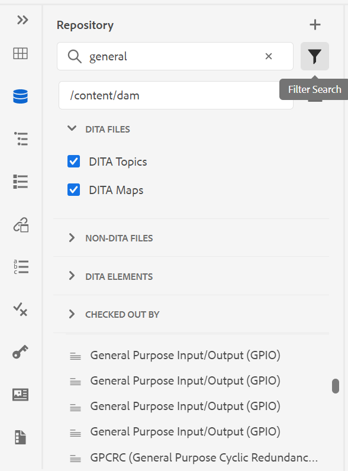

# Versionshinweise | Adobe Experience Manager Guides 4.0.x

**Haftungsausschluss**:

*Adobe Experience Manager Guides* wurde zuvor als *XML Documentation für Adobe Experience Manager* gekennzeichnet. Beachten Sie, dass sich bestimmte Verweise in der Dokumentation weiterhin auf das vorherige Branding beziehen können, aber dennoch für das aktuelle Angebot gelten.

Diese Versionshinweise enthalten die Upgrade-Anweisungen, neue Funktionen und Erweiterungen in Version 4.0.x von Adobe Experience Manager Guides (später als AEM Guides bezeichnet).

## 4.0.3 | Versionshinweise

### Kompatibilitätsmatrix

In diesem Abschnitt finden Sie die Kompatibilitätsmatrix für die von AEM Guides Version 4.0.3 unterstützten Softwareanwendungen.

#### Adobe Experience Manager

- Version 6.5 Service Pack 12, 10, 11 oder 9

Weitere Informationen finden Sie *Abschnitt „Technische*&quot; im Installations- und Konfigurationshandbuch.

#### FrameMaker und FrameMaker Publishing Server

| Freigabe | FMPS 2020 | FMPS 2019 | FM 2020 | FM 2019 |
|---|---|---|---|---|
| Nicht-UUID | 2020.2 oder höher* | 2019 | 2020.3 oder höher | 2019.8 (neueste Aktualisierung) |
| UUID | 2020.2 oder höher* | Nicht kompatibel | 2020.4 oder höher | Nicht kompatibel |

*Grundlinien und Bedingungen, die in der XML Documentation-Lösung erstellt wurden, werden ab der FMPS-Version 2020.2 unterstützt.*

#### Sauerstoffanschluss

| Freigabe | Fenster des Sauerstoffanschlusses | Oxygen Connector Mac | In Oxygen Windows bearbeiten | In Oxygen Mac bearbeiten |
|---|---|---|---|---|
| Nicht-UUID | 1.6.8 | 1.6.8 | 1.5 | 1.5 |
| UUID | 2.3.8 | 2.3.8 | 2,2 | 2,2 |

### Behobene Probleme

Die in verschiedenen Bereichen behobenen Fehler sind unten aufgeführt:

- Oxygen checkt eine falsche Themenversion aus, nachdem eine Dateiversion in AEM zurückgesetzt wurde. (9661)
- In der Assets-Benutzeroberfläche werden beim Zurücksetzen einer Dateiversion falsche Zeitstempelunterschiede angezeigt. (9662)
- Dateien werden bei der Wiederherstellung auf eine beliebige Version automatisch ausgecheckt. (9663)
- Übersetzte Inhalte sind fehlerhaft, wenn der Sprach-Code als fr-fr oder en-us erwähnt wird. (9665)
- In der Nicht-UUID-Version integriert sich die genehmigte Übersetzung nicht in die Zielsprache, wenn der Code der Zielsprache fünf Zeichen wie fr_ca enthält. (9666)
- Die Zielversion des Bildes wird als JCR:root angezeigt, nachdem die Übersetzung mit aktivierter Option „Neue Version erstellen“ abgeschlossen wurde. (9668)
- Wenn die Übersetzung mit der Grundlinie durchgeführt wird, wird eine falsche Version des Bildes zur Übersetzung gesendet. (9669)

## 4.0.2 | Versionshinweise

### Kompatibilitätsmatrix

In diesem Abschnitt finden Sie die Kompatibilitätsmatrix für die von AEM Guides Version 4.0.2 unterstützten Softwareanwendungen.

#### Adobe Experience Manager

- Version 6.5 Service Pack 12, 10, 11 oder 9

Weitere Informationen finden Sie *Abschnitt „Technische*&quot; im Installations- und Konfigurationshandbuch.

#### FrameMaker und FrameMaker Publishing Server

| Freigabe | FMPS 2020 | FMPS 2019 | FM 2020 | FM 2019 |
|---|---|---|---|---|
| Nicht-UUID | 2020.2 oder höher* | 2019 | 2020.3 oder höher | 2019.8 (neueste Aktualisierung) |
| UUID | 2020.2 oder höher* | Nicht kompatibel | 2020.4 oder höher | Nicht kompatibel |

*Grundlinien und Bedingungen, die in der XML Documentation-Lösung erstellt wurden, werden ab der FMPS-Version 2020.2 unterstützt.*

#### Sauerstoffanschluss

| Freigabe | Fenster des Sauerstoffanschlusses | Oxygen Connector Mac | In Oxygen Windows bearbeiten | In Oxygen Mac bearbeiten |
|---|---|---|---|---|
| Nicht-UUID | 1.6.8 | 1.6.8 | 1.5 | 1.5 |
| UUID | 2.3.8 | 2.3.8 | 2,2 | 2,2 |

### Behobene Probleme

Die in verschiedenen Bereichen behobenen Fehler sind unten aufgeführt:

- Die Position von eingefügtem oder gelöschtem Text ist in einem neu erstellten Überprüfungsdokument nicht korrekt. (9454)
- Version 1.0 ist in bestimmten Fällen nach dem Upgrade auf Version 4.0.1 nicht **Bedienfeld** Versionsverlauf“ aufgeführt. (9441)
- Beschriftung und Kommentare werden für die aktuelle Version unter Version 1.0 nicht angezeigt und werden in bestimmten Fällen nicht unter dem Bedienfeld **Versionsverlauf** aufgeführt. (9440)
- Editor friert ein, wenn bestimmte Inhaltsdateien im Editor geöffnet werden. (9433)
- Die Suche im Repository-Bedienfeld und das *topicref* Durchsuchen-Dialogfeld friert bei der Suche nach großen Inhaltsdateien ein. (9432)
- Beim einmaligen Speichern einer Datei im Web-Editor werden zwei Versionen für eine Datei erstellt. (9428)
- Nicht-DITA- und ditaval-Assets können nicht in topicref eingefügt werden. (9363)
- Der Editor wartet nur auf das Laden der Vorschau einer Karte mit einer großen Anzahl von Schlüsseln. (9332)
- Verweise funktionieren nicht mehr, wenn die Assets beim Authoring mit FM Update 4 in den Quelldateien verschoben werden. (9177)

### Bekannte Probleme

- Wenn die Einstellung **Neue Version für hochgeladene Datei erstellen** aktiviert ist, wird bei Auswahl von **Alle speichern** in bestimmten Fällen gelegentlich eine neue Version erstellt.
- Die Funktion „Benutzer löschen“ unter dem Ordnerprofil funktioniert im Chrome-Browser nicht zeitweise. **Problemumgehung**: Aktualisieren Sie den Chrome-Browser.

## 4.0.1 | Versionshinweise

### Kompatibilitätsmatrix

In diesem Abschnitt wird die Kompatibilitätsmatrix für die von XML Documentation-Lösung Version 4.0.1 unterstützten Softwareanwendungen aufgeführt.

#### Adobe Experience Manager

- Version 6.5 Service Pack 12, 11 oder 10
- Java: 11

#### FrameMaker und FrameMaker Publishing Server

| Freigabe | FMPS 2020 | FMPS 2019 | FM 2020 | FM 2019 |
|---|---|---|---|---|
| Nicht-UUID | 2020.2 oder höher* | 2019 | 2020.3 oder höher | 2019.8 (neueste Aktualisierung) |
| UUID | 2020.2 oder höher* | Nicht kompatibel | 2020.4 oder höher | Nicht kompatibel |

*Grundlinien und Bedingungen, die in der XML Documentation-Lösung erstellt wurden, werden ab der FMPS-Version 2020.2 unterstützt.*

#### Sauerstoffanschluss

| Freigabe | Fenster des Sauerstoffanschlusses | Oxygen Connector Mac | In Oxygen Windows bearbeiten | In Oxygen Mac bearbeiten |
|---|---|---|---|---|
| Nicht-UUID | 1.6.8 | 1.6.8 | 1.5 | 1.5 |
| UUID | 2.3.8 | 2.3.8 | 2,2 | 2,2 |

### Behobene Probleme

Die in verschiedenen Bereichen behobenen Fehler sind unten aufgeführt:

- Die Verweisstruktur ist für eine Zuordnung fehlerhaft, wenn doppelte Themenverweise hinzugefügt/entfernt werden. (8922)
- Im Abschnitt **Aktuelle** der Version (Versionsverlauf **sind mehrere Probleme** (8909)
- Verweise werden beschädigt, wenn **Alle auswählen** verwendet und die Multimediadateien oder DITA-Inhalte in einen anderen Ordner verschoben werden. (8897)
- Mehrere Probleme mit der Benutzeroberfläche **Dialogfeld** Querverweis einfügen > **Dateiverweis** > **Suchdatei** > **Filter** > **Suchpfad ändern** im Web-Editor. (8889)
- Probleme mit &quot;*topicref* und *ditavalref* im Karten-Editor suchen (8983).
- Die Suche während der Eingabe führt zu unerwünschten Suchanfragen in der Repository-Ansicht. (8982)
- Die Administratorbenutzer im Ordnerprofil können nicht gelöscht werden. (8926)
- In der Ausgabe der AEM-Site wird die Fußnote als Verweis verwendet, ohne dass zum Fußnotenabschnitt gescrollt wird. (9061)
- Die aktualisierten Artikel können nicht in Salesforce veröffentlicht werden. (9008)
- Die Position der Hervorhebung ist in der Seitenansicht falsch. (9009)
- Bedingungen können nicht per Drag-and-Drop auf DITA-Themen gezogen werden. (9031)
- css_layout.css kann im Ordnerprofil nicht überlagert werden. (9032)
- Ausnahme beim Anzeigen eines Assets nach dem Hochladen. (9068)
- Die Anpassung der zulässigen Sonderzeichen im XML-Editor funktioniert nicht ordnungsgemäß. (9075)
- Im Übersetzungs-Workflow wird eine zusätzliche Version für das übersetzte Asset erstellt. (9107)
- Grundlegende Veröffentlichung bei einem Thema mit einem Bild als *conref* von einem anderen Thema, das Bild wird nicht in der Ausgabe angezeigt. (9172)
- Bei Verwendung der Download Map API werden temporäre Verzeichnisse nicht bereinigt, falls der Download fehlschlägt. (9176)
- Die horizontale Ausrichtung ist für eine Tabelle in Version 4.0 nicht verfügbar. (9207)
- Das Schlüsselattribut wird für *glossref* nicht angezeigt, sodass das gekürzte Formular nicht über Verweise einfügen eingefügt werden kann. (9213)
- Das Erstellen *keydef* ermöglicht nur die Auswahl eines Links in 4.0. (9214)
- Das Verhalten der Funktion *Schlüsseldefinition einfügen/* keyref) in 4.0 unterscheidet sich vom Verhalten in 3.8.10. (9215)
- Fehlerkorrektur - Der Web-Editor funktioniert jetzt in den Versionen 3.8.6 bis 3.8.10. (9219)
- Probleme treten auf, wenn ein beliebiges Keyword im Titel für eine Registerkarte verwendet wird. (9317)
- In der Source-Ansicht werden mehrere Fehler für nicht bedingte Attribute angezeigt. (9278)
- Im Dialogfeld „Durchsuchen“ von **Pfad auswählen** vorhandene Probleme (9289)

## 4.0 | Versionshinweise

### Kompatibilitätsmatrix

In diesem Abschnitt finden Sie die Kompatibilitätsmatrix für die von XML Documentation Version 4.0 unterstützten Softwareanwendungen.

#### Adobe Experience Manager

- Version 6.5 Service Pack 11, 10 oder 9

#### FrameMaker und FrameMaker Publishing Server

| Freigabe | FMPS 2020 | FMPS 2019 | FM 2020 | FM 2019 |
|---|---|---|---|---|
| Nicht-UUID | 2020.2 oder höher* | 2019 | 2020.3 oder höher | 2019.8 (neueste Aktualisierung) |
| UUID | 2020.2 oder höher* | Nicht kompatibel | 2020.4 oder höher | Nicht kompatibel |

*Grundlinien und Bedingungen, die in der XML Documentation-Lösung erstellt wurden, werden ab der FMPS-Version 2020.2 unterstützt.*

#### Sauerstoffanschluss

| Freigabe | Fenster des Sauerstoffanschlusses | Oxygen Connector Mac | In Oxygen Windows bearbeiten | In Oxygen Mac bearbeiten |
|---|---|---|---|---|
| Nicht-UUID | 1.6.8 | 1.6.8 | 1.5 | 1.5 |
| UUID | 2.3.8 | 2.3.8 | 2,2 | 2,2 |

### Neue Funktionen und Verbesserungen

#### Artikelbasierte Veröffentlichung

Mit Version 4.0 haben wir eine Funktion zum Veröffentlichen auf Artikelbasis eingeführt, die in den Web-Editor integriert ist. Sie können die Funktion zur artikelbasierten Veröffentlichung verwenden, um inkrementell Ausgaben für ein oder mehrere Themen zu generieren oder Ihre Inhalte auf einer Knowledgebase-Plattform zu veröffentlichen.

Mit dieser Funktion können Benutzer die DITA-Karte additiv erstellen und Themen veröffentlichen, sobald sie bereit sind. Nachdem Sie Ihre Zuordnung veröffentlicht haben, verwenden Sie die Funktion zum Veröffentlichen auf Artikelbasis, um eine inkrementelle Veröffentlichung nur für die aktualisierten Artikel zu erzielen.

Zusätzlich zu AEM können Sie diese einzigartige Funktion verwenden, um Ihre Artikel auf allen Knowledgebase-Portalen wie Salesforce zu veröffentlichen. Diese Funktion enthält auch eine OOTB-Inhaltsvorlage, die auf den AEM-Kernkomponenten basiert und Ihnen das Erstellen eines wissensbasierten Repositorys für die technischen Inhalte ermöglicht. Das Tolle an dieser Vorlage ist, dass sie vollständig an Ihre Unternehmensanforderungen angepasst werden kann und auch Anwendungsfälle wie Unternehmens-Intranetportale unterstützen kann.

Diese bedarfsorientierte Artikelveröffentlichung von unterwegs gibt Ihnen nicht nur vollständige Kontrolle über die Veröffentlichung Ihrer Inhalte, sondern reduziert auch die Gesamtzeit für die Veröffentlichung Ihrer aktualisierten Inhalte.

Weitere Informationen finden Sie unter *Artikelbasierte Veröffentlichung im Web* Editor im Benutzerhandbuch.

#### Verbesserter Web-Editor

Es gibt viele Verbesserungen und neue Funktionen, die im Web-Editor eingeführt werden:

- Das Kern-Framework wurde von der Coral-basierten Benutzeroberfläche in die spektrumbasierte Benutzeroberfläche geändert. Dies bietet eine sehr standardisierte und intuitive Benutzeroberfläche.
- Im rechten Bedienfeld wurde die neue Funktion „Dateieigenschaften“ eingeführt. Sie können die Eigenschaften eines aktiven Dokuments überprüfen. Die Informationen sind in zwei Abschnitte unterteilt:
   - *Allgemein*: enthält die allgemeinen Dateidetails wie Dateiname, UUID, Metadaten-Tags, Sprache, Erstellungsdatum, Status des Auscheckens und Dokumentstatus.
   - *Referenz*: enthält eingehende und ausgehende Verweise.

     

- Unterstützung für das Betreffschema wurde auch im Web-Editor hinzugefügt. Sie können jetzt das Betreffschema mithilfe des Bedienfelds „Betreffschema“ erstellen und verwenden. Durch das Hinzufügen des Betreffschemas können Sie jetzt eigene Unternehmensmetadaten und -taxonomien verwenden.

  

- In dieser Version wurde ein neues Glossar-Hotspot-Tool eingeführt, mit dem Glossare stapelweise verwaltet werden können. Mit diesem Tool können Sie Text schnell in Glossare und Glossare für eine ausgewählte Karte oder offene Themen stapelweise in Begriffe konvertieren.

  

- Im Bedienfeld Wiederverwendbarer Inhalt wurde eine Aktualisierungsfunktion hinzugefügt, mit der Sie den wiederverwendbaren Inhalt in Referenzdateien schnell aktualisieren können.
- Die Anzeige „Neue Dateiaktualisierung“ zeigt an, ob Ihre aktuelle (Arbeitskopie) der Datei mit der gespeicherten Version synchronisiert ist oder nicht.

  

- Der Suchfilter im Repository-Bedienfeld und das Dialogfeld zum Durchsuchen von Dateien wurde verbessert, um mehr Filteroptionen zu bieten, die weiter angepasst werden können.

  

- Sie können jetzt DOCX-Dateien über den Web-Editor hochladen.
- Benutzereinstellungen werden jetzt im Benutzerprofil und nicht mehr in den Cookies des Browsers gespeichert. Dies hilft Benutzenden, ihre Voreinstellungen Browser- oder Benutzersitzungen beizubehalten.

#### Neues Übersetzungs-Dashboard

Im Web-Editor wurde ein neues Übersetzungs-Dashboard mit den folgenden Funktionen eingeführt:

- Sortieren, Suchen und Filtern der Themenliste.
- Filtern von Inhalten nach Referenztyp - direkte oder indirekte Verweise.
- Einfache Navigation beim Suchen eines vorhandenen Projekts beim Initiieren einer Übersetzungsanfrage.
- Es wurde ein mehrsprachiger Übersetzungsmechanismus eingeführt, um zu vermeiden, dass mehrere Projekte für jede Sprache erstellt werden, wenn die Übersetzungsanfrage für mehr als eine Sprache initiiert wird.
- Es wurde eine Konfiguration zum Ausblenden der Registerkarte „Übersetzung“ im Zuordnungs-Dashboard eingeführt. Standardmäßig ist sie sichtbar. Sie können Inhalte entweder über das Zuordnungs-Dashboard oder den Web-Editor übersetzen.

#### Erweiterte Veröffentlichung

Die folgenden Verbesserungen sind jetzt im Veröffentlichungsprozess verfügbar:

- Die PDF-Generierung über FrameMaker Publishing Server unterstützt jetzt Baselines und Bedingungsvorgaben.
- Autoren können jetzt Metadaten auf Zuordnungs- und Themenebene an die DITA-OT-Veröffentlichung übergeben. Dies ist hilfreich, wenn benutzerdefinierte PDF-Vorlagen so konzipiert sind, dass sie Dateimetadateneigenschaften wie Tags, Autor, Dokumentstatus und mehr verwenden.

  

- In configMgr wurde eine neue Konfiguration hinzugefügt, mit der Benutzende die Versionen der zu löschenden Themen beibehalten oder löschen können, wenn **Option „Löschen und Erstellen** in der AEM-Site-Ausgabegenerierung verwendet wird.

#### Verbesserte Dateiverarbeitung

Die folgenden Verbesserungen sind jetzt beim Arbeiten mit -Dateien in AEM Assets zu sehen:

- Ein neues Datei-Upload-Erlebnis und ein neues Dialogfeld zur Auswahl einer Konfliktbewältigungsstrategie wurden eingeführt.

  

- Möglichkeit zum Erstellen einer neuen Version der hochgeladenen Datei mit der Möglichkeit, das Überschreiben einer ausgecheckten Datei zu verhindern.
- Jetzt können Sie eine Vorschau von Bildern direkt über die Ansicht Versionsverlauf anzeigen. Bei DITA- und Nicht-DITA-Dateien zeigt der Versionsverlauf die aktuellen Versionsinformationen separat an.

  

#### Neue Berichtsexportfunktion

Berichte sind sehr nützlich, um den Zustand Ihrer Inhalte zu ermitteln. Die XML Documentation-Lösung bietet verschiedene Berichte, um die Kontrolle über Ihre Inhalte zu übernehmen. Jetzt können Sie nicht nur die Berichte anzeigen, sondern auch die Berichtsdaten in eine CSV-Datei exportieren, um sie anzuzeigen und für Ihr größeres Team freizugeben. Berichtsdaten können Ihnen einen schnellen Überblick über fehlerhafte Links oder fehlende Bilder geben.

#### Verbessertes Aktualisierungserlebnis bei Oxygen DAM

Wenn Sie Dateien vom AEM-Server in Oxygen aktualisieren, wird eine Warnmeldung angezeigt, wenn Sie in Ihrer aktuellen Oxygen-Sitzung nicht gespeicherte Dateien haben. Sie können den Aktualisierungsvorgang abbrechen, um nicht gespeicherte Dateien zu speichern. Ohne diese Funktion verloren die Benutzer alle nicht gespeicherten Informationen in ihren Dokumenten.

#### Weitere Funktionsverbesserungen

- Gemäß den Best Practices von AEM wurden die Anwendungsdaten jetzt aus /content/fmdita, /etc/fmdita/ und /content/dxml/ an einen neueren Speicherort migriert.
- Der Workflow DAM-Asset-Aktualisierung wurde mit besserer Handhabung und optimierter Leistung wieder eingeführt, um ihn zusammen mit dem XML-Nachbearbeitungs-Workflow auszuführen.
- Das XML Documentation-API-Paket ist jetzt in einem öffentlich zugänglichen Maven-Repository verfügbar.
- Sie können jetzt eine neue DITA-Projektvorlage unter dem Pfad /apps/projects/templates erstellen.
- Laden Sie jetzt die standardmäßige Datei ui_config.json aus Ihren Ordnerprofilen herunter. Dies kann verwendet werden, um benutzerdefinierte Änderungen aus der vorhandenen Datei ui_config.json beim Upgrade zusammenzuführen.

### Behobene Probleme

Die in verschiedenen Bereichen behobenen Fehler sind unten aufgeführt:

#### Web-Editor

- Conrefs erscheinen in roter Farbe, auch wenn sie nicht beschädigt sind. (8239)
- Der Wert für das bedingte Attribut wird nicht automatisch ausgefüllt, wenn **Alle Eigenschaften hinzufügen** im DITAVAL-Editor ausgewählt ist. (8234)
- Autoren können kein Bild unter Verwendung eines relativen Pfads in ein Thema einfügen. (8112)
- Der in der Tabellenzelle hinzugefügte pH-Wert wird rot angezeigt. (8083)
- Bei UUID-basierten Systemen werden Links in einer Prüfungsaufgabe nicht aktualisiert, wenn die zu überprüfenden Dateien verschoben werden. (8080)
- Im Web-Editor werden Bilder, bei denen die Skalierungseigenschaft auf 75 % oder höher eingestellt ist, nicht korrekt gerendert. (8073)
- GIF-Bilder werden im Web-Editor als statische Bilder gerendert. (8024)
- Ein conkeyref in einem Notizenelement wird weder in der Vorschau des Web-Editors noch in der Ausgabe angezeigt. (8006)
- Eine XRef für ein Element, das selbst eine Konfig ist, wird im Editor nicht aufgelöst. (7933)
- Titel mit Schlüssel werden in der Editor-Vorschau und im Repository-Bedienfeld nicht korrekt gerendert. (7909)
- Ausschnitte mit Sonderzeichen werden nicht korrekt gespeichert. (7908)
- Selbst wenn ein JS-Validierungsproblem auftritt, wird die POST-Anfrage weiterhin an den Server gesendet. (7989)
- Das Speichern eines Themas nach dem Formatieren von MathML-Gleichungen führt zu einem Fehler. (7954)
- Keydef mit „tm“ werden im Editor nicht ordnungsgemäß gerendert und die AEM-Site-Ausgabe enthält doppelte TM-Symbole. (7859)
- Das Ziehen und Ablegen eines Snippets funktioniert nicht wie in den DTDs festgelegt. (7758)
- HTML ignoriert benutzerdefinierte Abmessungen für Grafiken. (7718)
- Das Attribut conrefend wird beim Verschieben der Quelldatei nicht aktualisiert. (7698)
- Die Arbeit mit Referenzdokumenten für Thementypen führt zu mehreren Problemen mit der Benutzeroberfläche. (7656)
- DITAVAL-Dateien werden nicht angezeigt, wenn der Autor ditavalref in einer Karte hinzufügt. (7594)
- Wenn dem Element das Attribut „outputClass“ hinzugefügt wird, wird in jedem leeren `<entry>`-Element unerwartetes Leerzeichen `<tgroup>`. (7532)
- Die Schaltfläche &quot;Source&quot; funktioniert nicht für Themen, die über das Zuordnungs-Dashboard geöffnet werden. (7465)
- Der schöne Druck fügt Leerzeilen und Leerzeichen ein, die beim Öffnen der Datei in FrameMaker oder Oxygen sichtbar sind. (7408)
- Karten mit href=&quot;/&quot; in einem der Themen werden nicht auf AEM Sites veröffentlicht (7405)
- Im Editor aufgetretene Leistungsprobleme, wenn die Stammzuordnung über eine große Anzahl von Schlüsselwörtern verfügt. (7400)
- Dokumentstatus für eine Zuordnung mit benutzerdefinierter Vorlage wird nicht von dem entsprechenden Profilstatus übernommen. (7359)
- `<tm>` Element wird fälschlicherweise als Blockelement gerendert. (7286)
- Doppelte Vorlagen werden im Bereich der Editor-Vorlagen angezeigt, wenn eine neue Vorlage erstellt wird. (5814)
- Vorlagen, die in ui_config für Bilder zum Festlegen zusätzlicher Attribute definiert sind, können nicht für Drag-and-Drop-Fälle verwendet werden. (5713)
- Falsche Standarddarstellung von uicontrol in menucascade. (5483)
- Benutzerdefinierte Vorlagen für Topic/Map zeigen in der Benutzeroberfläche keinen neuen Namen an. Der Name wird als „Thema“/„Karte“ angezeigt, anstatt den konfigurierten Namen anzuzeigen (4958)

#### Sauerstoffanschluss

- Dateien, deren übergeordneter Ordner Sonderzeichen enthält, geben beim Laden in Oxygen einen Fehler aus. (8054)
- Wenn ein neu erstelltes Dokument in Oxygen geöffnet wird, wird der Fehler „GUID kann nicht gefunden werden“ ausgegeben. (7856)
- Die Eincheckoption wird deaktiviert, nachdem die Datei aus AEM ausgecheckt wurde, indem „In Oxygen bearbeiten“ verwendet wird. (7471)

#### Überprüfung

- Wenn Prüfungsaufgaben aus dem AEM-Posteingang neu zugewiesen werden, können die mit den Aufgaben verknüpften Payloads von den Verantwortlichen nicht angezeigt werden. (8003)
- Wenn ein Dateiname über Leerzeichen verfügt, wird auf der Seite Prüfungsaufgabe der Inhalt der (Multimedia-)Datei nicht angezeigt. (8111)

#### Zuordnungs-Dashboard

- Konkreter Inhalt im Titel eines Themas wird auf der Registerkarte „Themen“ oder „Berichte“ des Zuordnungs-Dashboards nicht angezeigt. (8263)
- AEM Sites-Ausgabe | jcr:title der generierten Siteseite wird nicht aktualisiert, wenn der DITA-Thementitel aktualisiert wird. (8131)
- Download MAP lädt die in den Themen verwendeten Videodateien nicht herunter. (8070)
- Der Download der AEM-Lesekarte schlägt für die flache Hierarchie fehl, wenn die Lesekarte zwei Themen mit demselben Namen in verschiedenen Ordnern enthält. Wenn es Dateien mit demselben Namen, aber unterschiedlicher Groß-/Kleinschreibung gibt, werden sie als die doppelten Dateien behandelt. (8058)
- Mediendateien werden nicht heruntergeladen, wenn das Objekt-Tag über die Download-Bookmap-API verwendet wird. (8057)
- Falscher Bericht wird auf der Registerkarte „Berichte“ angezeigt, wenn ein Thema auf eine Datei verweist, deren Titel mit „conref“ beginnt. (4698)

#### Publishing

- Die Erstellung von PDF schlägt zum ersten Mal fehl, wenn Versionierung aktivieren ausgewählt wird. (8053, 8294)
- Für Nicht-UUID-Inhalte werden conref-Bilder in der AEM Site-Ausgabe nicht angezeigt. (7907)
- Leerzeichen werden nach einem „tm;“-Tag in der AEM Site-Ausgabe automatisch hinzugefügt. (7964)
- YouTube-Videos können nicht in der AEM Site-Ausgabe angezeigt werden. (7401)
- Die Filterung nach Kennzeichnung schlägt für referenzierte Inhalte fehl, nachdem der Benutzer auf Alle Themen in der Registerkarte „Baseline“ des Zuordnungs-Dashboards geklickt hat. (7388)
- Veröffentlichungsthema mit Element `<tm>` mit dem Eigenschaftswert SM oder reg wird in der generierten Ausgabe falsch angezeigt. (7239)
- Bei der grundlegenden Veröffentlichung mit Bild wird nicht die neueste Version des Bildes in der veröffentlichten Ausgabe ausgewählt. (7231)
- Relative referenzierte Themen werden auf der Registerkarte „Grundlinie“ angezeigt. (5424)
- Die inkrementelle Veröffentlichung eines Themas mit conkeyref im Titel funktioniert nicht wie erwartet. (4474)
- Der Seitentitel wird nicht für die Generierung der Ausgabe-URL verwendet, obwohl diese Einstellung aktiviert ist. (8257)
- Grundlegende Veröffentlichung : Auswahl der aktuellen Version der Bilder anstelle des eingefrorenen Knotens. Dies wird auch angezeigt, wenn ein Bild Leerzeichen oder Sonderzeichen im Dateinamen enthält. (8274, 8322)
- Die inkrementelle Veröffentlichung schlägt für die DITA-Zuordnung mit dem Typ „Betreff“ und dem Schema „mapref“ fehl. (8218)

#### AEM Assets

- Bei der Auswahl/Löschung von umfangreichen Inhalten in der Assets-Benutzeroberfläche wurden Leistungsprobleme gefunden. (8238)
- Die Funktion für gespeicherte Suchen (Smart-Sammlung) funktioniert nicht, wenn den Suchfiltern das DITA-Prädikat hinzugefügt wird. (8048)
- Das Zurücksetzen des Bildes auf eine ältere Version funktioniert nicht. (DXML-7903)
- Die Option „Löschen“ ist auch für Autorinnen und Autoren sichtbar, die nicht über die Berechtigung zum Löschen verfügen. (7322)
- Mit der CCMS-Überlagerung für den Assets-Editor wird die Wiedergabe der Option „Löschen“ unterbrochen. (8093)

#### Content-Import

- Konvertierung von HTML in DITA | Tabelle mit &#39;tr&#39; mit leeren &#39;td&#39;-Einträgen führt zu zusätzlichen Zeilen in der Ausgabe. (8132)
- Konvertierung von HTML in DITA | HTML mit einer Tabelle mit mehreren tbody schlägt mit Ausnahme fehl. (7940)
- Konvertierung von HTML in DITA | Fehler bei Verwendung von HTML als Quelle mit Kommentaren. (7937)
- Beim Importieren von DITA 1.3 DITA-Dateien werden einige href-Elemente in falsch formatierte Links umgewandelt. (8019)

#### Andere

- In der Ansicht Versionsverlauf fehlt die Miniaturansicht von Bildern oder ist beschädigt. (7948, 8008)
- Die zipMapWithDependents-API gibt im Falle fehlerhafter Verweise im Inhalt keine relevanten Informationen zurück. (7521)
- Für UUID-Kunden haben sich die Standardkonfigurationswerte für einige Konfigurationen geändert, z. B. Regex zur Identifizierung von UUID-Dateien, Verwendung des Seitentitels zum Generieren der Ausgabe und mehr. (8301, 8305)

## Upgrade-Anweisungen {#upgrade-instructions}

Sie können Ihre aktuelle Version von AEM Guides einfach auf Version 4.0.3 aktualisieren. Bevor Sie mit dem Upgrade auf Version 4.0.3 von AEM Guides fortfahren, müssen Sie die folgenden Punkte berücksichtigen:

- Wenn Sie Version 4.0.2 verwenden, können Sie direkt auf Version 4.0.3 aktualisieren. Sie müssen auf Version 4.0.2 aktualisieren, bevor Sie ein Upgrade auf 4.0.3 durchführen.
- Wenn Sie Version 4.0 verwenden, können Sie direkt auf Version 4.0.2 aktualisieren.
- Wenn Sie Version 4.0.1 verwenden, müssen Sie sie deinstallieren.
- Wenn Sie Version 3.8.5 verwenden, müssen Sie auf Version 4.0 aktualisieren, bevor Sie auf 4.0.2 aktualisieren.
- Wenn Sie eine Version vor 3.8.5 verwenden, lesen Sie den Abschnitt Upgrade im produktspezifischen Installationshandbuch.

Weitere Informationen finden Sie unter [Upgrade-Anweisungen](https://helpx.adobe.com/content/dam/help/en/xml-documentation-solution/4-0-3/Adobe-Experience-Manager-Guides_Upgrade-Instructions_EN.pdf).

