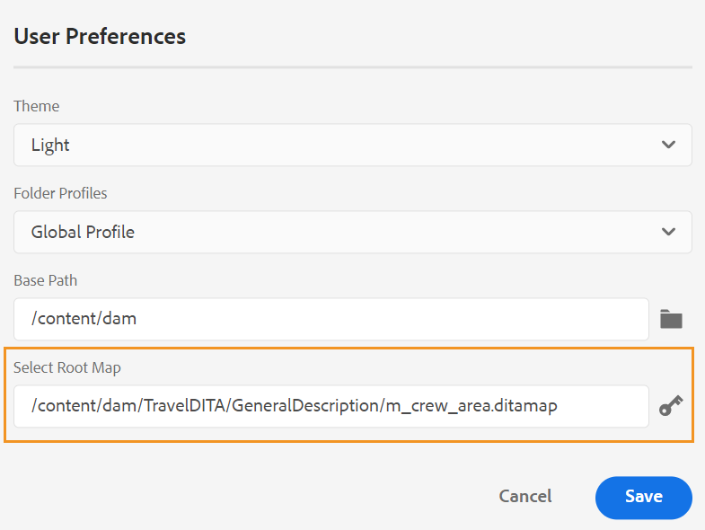

# Version 4.1.x von Adobe Experience Manager Guides

Diese Versionshinweise enthalten die Upgrade-Anweisungen, neue Funktionen und Erweiterungen in Version 4.1.x von Adobe Experience Manager Guides (später *AEM Guides*).

## Aktualisieren auf die neueste Version

Sie können Ihre aktuelle Version von AEM Guides einfach auf Version 4.1.3 aktualisieren. Bevor Sie mit dem Upgrade auf Version 4.1.3 von AEM Guides fortfahren, müssen Sie die folgenden Punkte berücksichtigen:

* Wenn Sie Version 4.1 oder 4.1.x verwenden, können Sie direkt auf Version 4.1.3 aktualisieren.
* Wenn Sie Version 4.0.x verwenden, müssen Sie auf Version 4.1 oder 4.1.x aktualisieren, bevor Sie auf 4.1.3 aktualisieren.
* Wenn Sie Version 3.8.5 verwenden, müssen Sie auf Version 4.0.x aktualisieren, bevor Sie auf 4.1 aktualisieren.
* Wenn Sie eine Version vor 3.8.5 verwenden, lesen Sie den Abschnitt Upgrade im produktspezifischen Installationshandbuch.

Weitere Informationen finden Sie unter [Upgrade-Anweisungen](assets/Adobe-Experience-Manager-Guides-Upgrade-Instructions-EN.pdf).

## 4,1,3 | Versionshinweise zu

## Kompatibilitätsmatrix

In diesem Abschnitt wird die Kompatibilitätsmatrix für die von AEM Guides Version 4.1.3 unterstützten Softwareanwendungen aufgeführt.

### ADOBE EXPERIENCE MANAGER

**NICHT-UUID**
Version 6.5 Service Pack 13, 12, 11 oder 10

**UUID**
Version 6.5 Service Pack 13, 12, 11 oder 10

Weitere Informationen finden Sie im Abschnitt Technische Anforderungen des Handbuchs Installieren und Konfigurieren von Adobe Experience Manager Guides .

### FrameMaker und FrameMaker Publishing Server

| Freigabe | FMPS 2020 | FMPS 2019 | FM 2020 | FM 2019 |
| --- | --- | --- | --- | --- |
| 4.1.3 (Nicht-UUID) | 2020.2 oder höher* | 2019 | 2020.3 oder höher | 2019.8 (neueste Aktualisierung) |
| 4.1.3 (UUID) | 2020.2 oder höher* | Nicht kompatibel | 2020.4 oder höher | Nicht kompatibel |
| | | | |

*Die in AEM erstellten Grundlinien und Bedingungen werden ab 2020.2 in FMPS-Versionen unterstützt.

### Sauerstoffanschluss

| Freigabe | Fenster des Sauerstoffanschlusses | Oxygen Connector Mac | In Oxygen Windows bearbeiten | In Oxygen Mac bearbeiten |
| --- | --- | --- |--- |--- |
| 4.1.3 (Nicht-UUID) | 2.0 | 2.0 | 1,6 | 1,6 |
| 4.1.3 (UUID) | 2,7 | 2,7 | 2,3 | 2,3 |
|  |  |   |

## Behobene Probleme

Der behobene Fehler ist unten aufgeführt:

* Der Web-Editor lädt gelegentlich leere Seiten. 10678)

## 4,1,2 | Versionshinweise zu

## Kompatibilitätsmatrix

In diesem Abschnitt wird die Kompatibilitätsmatrix für die von AEM Guides Version 4.1.2 unterstützten Softwareanwendungen aufgeführt.

### ADOBE EXPERIENCE MANAGER

**NICHT-UUID**
Version 6.5 Service Pack 13, 12, 11 oder 10

**UUID**
Version 6.5 Service Pack 13, 12, 11 oder 10

Weitere Informationen finden Sie im Abschnitt Technische Anforderungen des Handbuchs Installieren und Konfigurieren von Adobe Experience Manager Guides .

### FrameMaker und FrameMaker Publishing Server

| Freigabe | FMPS 2020 | FMPS 2019 | FM 2020 | FM 2019 |
| --- | --- | --- | --- | --- |
| 4.1.2 (Nicht-UUID) | 2020.2 oder höher* | 2019 | 2020.3 oder höher | 2019.8 (neueste Aktualisierung) |
| 4.1.2 (UUID) | 2020.2 oder höher* | Nicht kompatibel | 2020.4 oder höher | Nicht kompatibel |
| | | | |

*Die in AEM erstellten Grundlinien und Bedingungen werden ab 2020.2 in FMPS-Versionen unterstützt.

### Sauerstoffanschluss

| Freigabe | Fenster des Sauerstoffanschlusses | Oxygen Connector Mac | In Oxygen Windows bearbeiten | In Oxygen Mac bearbeiten |
| --- | --- | --- |--- |--- |
| 4.1.2 (Nicht-UUID) | 2.0 | 2.0 | 1,6 | 1,6 |
| 4.1.2 (UUID) | 2,7 | 2,7 | 2,3 | 2,3 |
|  |  |   |

## Behobene Probleme

Die in verschiedenen Bereichen behobenen Fehler sind unten aufgeführt:

* Bei der Auswahl aller Ordnerprofile wird ein unsichtbares Ordnerprofil angezeigt (was falsch ist). 10393)
* Bei der Basiserstellung wird nicht die neueste Version ausgewählt, wenn sich die Zeitzone des Benutzers von der Zeitzone des Servers unterscheidet. 10336)
* Die Tastenkombination Strg+F öffnet das Browser-Suchmodal in der Assets-Konsole nach der Installation von AEM Guides 4.1 nicht. 10339)
* Bei der grundlegenden Erstellung tritt bei dem Thema auf, das den Verweis auf einen Ordner enthält. 10383)
* Auf der Registerkarte „Ausgabevorgaben“ wird gelegentlich ein leerer Bildschirm angezeigt und in einigen Fällen werden nicht bearbeitbare Vorgaben angezeigt. 10390)
* Die Verwaltung des Schlüsselraums führt zu Ausnahmen und Fehlern. 10449)

### Bekannte Probleme mit Workaround

* Die während der Übersetzung exportierte Baseline wird nicht auf der Registerkarte Baseline des Editors geladen.

  **Problemumgehung**: Verwenden Sie die Registerkarte „Grundlinie“ des DITA-Zuordnungs-Dashboards.

## 4,1 | Versionshinweise zu

Diese Versionshinweise enthalten die Upgrade-Anweisungen, neue Funktionen und Erweiterungen in Version 4.1.x von Adobe Experience Manager Guides (später *AEM Guides*).

## Kompatibilitätsmatrix

In diesem Abschnitt wird die Kompatibilitätsmatrix für die von AEM Guides Version 4.1 unterstützten Softwareanwendungen aufgeführt.

### ADOBE EXPERIENCE MANAGER

**NICHT-UUID**
Version 6.5 Service Pack 13, 12, 10 oder 11

**UUID**
Version 6.5 Service Pack 13, 12, 10 oder 11

Weitere Informationen finden Sie im Abschnitt Technische Anforderungen des Handbuchs Installieren und Konfigurieren von Adobe Experience Manager Guides .

### FrameMaker und FrameMaker Publishing Server

| Freigabe | FMPS 2020 | FMPS 2019 | FM 2020 | FM 2019 |
| --- | --- | --- | --- | --- |
| 4.1 (Nicht-UUID) | 2020.2 oder höher* | 2019 | 2020.3 oder höher | 2019.8 (neueste Aktualisierung) |
| 4.1 (UUID) | 2020.2 oder höher* | Nicht kompatibel | 2020.4 oder höher | Nicht kompatibel |
| | | | |

*Die in AEM erstellten Grundlinien und Bedingungen werden ab 2020.2 in FMPS-Versionen unterstützt.

### Sauerstoffanschluss

| Freigabe | Fenster des Sauerstoffanschlusses | Oxygen Connector Mac | In Oxygen Windows bearbeiten | In Oxygen Mac bearbeiten |
| --- | --- | --- |--- |--- |
| 4.1 (Nicht-UUID) | 2.0 | 2.0 | 1,6 | 1,6 |
| 4.1 (UUID) | 2,7 | 2,7 | 2,3 | 2,3 |
|  |  |  |

## Neue Funktionen und Verbesserungen

AEM Guides bietet in Version 4.1 viele Verbesserungen und neue Funktionen:

### Natives PDF-Publishing

Die Erstellung einer nativen PDF wird jetzt auch in Version 4.1 von AEM Guides unterstützt. Eine neue Publishing-Engine wurde mit den folgenden Funktionen eingeführt:
* Erstellen einer CSS-Vorlage
* Erstellen verschiedener Seitenvorlagen
* Entwerfen von PDF-Vorlagen mit CSS- und Seitenvorlagen
* Publish Map- und Themeninhalte im PDF-Format

### Unterstützung für den Knowledgebase-Site-Pfad in der artikelbasierten Veröffentlichung

AEM Guides bietet die Funktion zur artikelbasierten Veröffentlichung, um schrittweise eine Ausgabe eines oder mehrerer Themen zu generieren oder Ihre Inhalte auf einer Wissensdatenbankplattform zu veröffentlichen. Mit Version 4.1 haben Sie eine zusätzliche Option, den Pfad der Wissensdatenbank-Website auszuwählen, auf den das Thema/die Karte veröffentlicht werden soll. Nachdem Sie den Pfad ausgewählt haben, wird die Ausgabe unter dem angegebenen Pfad generiert.

### Erweiterter Web-Editor

* **Verbesserte Schlüsselauflösung**

Ein DITA-Inhaltsschlüssel-Verweis fügt einen Teil des Inhalts von einem Thema in ein anderes ein. Sie verwendet eine -Taste, um den Inhalt zu finden. Die wichtigsten Referenzen, die mit einem DITA-Thema verbunden sind, müssen aufgelöst werden. Die ausgewählte Stammzuordnung hat die höchste Priorität, um Schlüsselverweise aufzulösen.

Jetzt werden die Schlüsselverweise auf der Grundlage der Stammzuordnung aufgelöst, die in der folgenden Prioritätsreihenfolge festgelegt ist:

1. Benutzereinstellungen
1. Kartenansichtsbereich
1. Ordnerprofil

Weitere Informationen finden Sie *Abschnitt „Auflösen* Schlüsselverweisen“ im Handbuch Verwenden von Adobe Experience Manager Guides .

* **Hinzufügen eines benutzerdefinierten Bedienfelds im linken Bedienfeld**

Jetzt können Sie ein benutzerdefiniertes Bedienfeld im linken Bedienfeld des Web-Editors hinzufügen. Sie können ein benutzerdefiniertes Bedienfeld für verschiedene Zwecke verwenden, z. B. für die Bereitstellung von Hilfe oder für Tests für ein Projekt. Wenn ein benutzerdefiniertes Bedienfeld konfiguriert wurde, wird es auch in der Liste der Bedienfelder in den **Editor-Einstellungen** angezeigt. Sie können den Schalter umschalten, um das benutzerdefinierte Bedienfeld ein- oder auszublenden.

* **Möglichkeit, den Dokumentstatus von Themen in einer DITA-Zuordnung zu ändern**

Jetzt können Sie den Dokumentstatus ausgewählter Themen innerhalb einer DITA-Karte einfach ändern. Sie können die Eigenschaften ausgewählter Themen in einer DITA-Karte auch über das Menü **Weitere Optionen** unten im Kartenansichtsfenster öffnen und bearbeiten.

* **Versionsinformationen, die im Vorschaumodus angezeigt werden**

Der Web-Editor hilft Ihnen bei der Verwaltung Ihrer Versionen. Jetzt können Sie im Vorschaumodus eines Themas auch die Version des aktiven Themas oder die DITA-Map in der oberen rechten Ecke der Datei-Registerkarte des Themas sehen.

* **Verbessertes Aktualisierungsverhalten des Web-Editors**

Die folgenden Verbesserungen sind jetzt mit dem Browser-Aktualisierungsvorgang im Web-Editor verfügbar:

* Jetzt erhalten Sie die Unterstützung, den Browser zu aktualisieren, während Sie Ihre
Inhalte im Web-Editor. Wenn Sie auf das Browser-Aktualisierungssymbol klicken, während eine oder mehrere Dateien mit
Nicht gespeicherte Änderungen werden zur Bearbeitung geöffnet. Sie werden aufgefordert, Ihre Dateien zu speichern oder die Aktualisierungsaktion abzubrechen.

* Selbst beim Aktualisieren des Browsers werden die Ansichten des linken und des rechten Bedienfelds beibehalten.

* Das aktive Thema oder die DITA-Karte wird im Inhaltsbearbeitungsbereich erneut geöffnet.

* **Erstellen Sie Karten basierend auf benutzerdefinierten Vorlagen**

Jetzt erhalten Sie die leistungsstarke Funktion zum Erstellen benutzerdefinierter Zuordnungsvorlagen. Sie können sie verwenden, um DITA-Karten zusammen mit den Themenvorlagen und Zuordnungsvorlagen zu erstellen, auf die in der Zuordnungsvorlage verwiesen wird.

Sie können auch auf andere Zuordnungsvorlagen und Themenvorlagen aus der benutzerdefinierten Zuordnungsvorlage verweisen. Die referenzierten Zuordnungsvorlagen können auf verschiedene Zuordnungsvorlagen, Themenvorlagen, Themen, Karten, Bilder, Videos und andere Assets verweisen.

Die benutzerdefinierte Zuordnungsvorlage kann Ihnen dabei helfen, die Zuordnungsvorlagen und die gesamte referenzierte Ordnerstruktur sehr einfach zu replizieren. Diese benutzerdefinierten Vorlagen sind besonders nützlich, um mehrere Karten zu erstellen und neu zu erstellen, die rekursive Strukturen und Verweise haben.

* **Schematron-Unterstützung**
„Schematron“ bezieht sich auf eine regelbasierte Validierungssprache, die zum Definieren von Tests für eine XML-Datei verwendet wird. Mithilfe einer Schematron-Datei können Sie bestimmte Regeln definieren und diese dann für ein DITA-Thema oder eine Zuordnung validieren. Der Web-Editor unterstützt Schematron-Dateien. Sie können die Schematron-Dateien importieren und auch im Web-Editor bearbeiten. Die Unterstützung von Schematronen im Web-Editor hilft Ihnen bei der Validierung der Dateien anhand eines Regelsatzes und der Aufrechterhaltung der Konsistenz und Korrektheit über die Themen hinweg.

* **Verbessertes Dialogfeld beim Schließen der Datei**

AEM Guides fordert Sie auf, Ihre Änderungen zu speichern und Ihre gesperrten Dateien zu entsperren, wenn Sie versuchen, eine im Web-Editor geöffnete Datei zu schließen. Die Eingabeaufforderungen werden basierend auf den vom Administrator konfigurierten Einstellungen **Einchecken beim Schließen anfragen** und **Beim Schließen nach neuer Version** fragen“ angezeigt.

Je nach Konfiguration haben Sie die Möglichkeit, die Änderungen zu speichern und eine neue Version Ihres Dokuments zu erstellen. Sie können auch die Datei einchecken und die Änderungen an der aktuellen Version speichern.

Weitere Informationen finden Sie *Abschnitt „Schließen und Speichern von Dateien* im Handbuch Verwenden von Adobe Experience Manager Guides .* Die Funktion **Keyword einfügen** wurde verbessert. Sie können jetzt ein einzufügendes Keyword leichter finden, da die Keywords in alphabetischer Reihenfolge aufgeführt werden. Sie können auch nach Keywords suchen, indem Sie eine Suchzeichenfolge in das Suchfeld eingeben.

* **Unterstützung für Markdown-Dokumente**
Markdown ist eine einfache Markup-Sprache, mit der Sie Formatierungselemente zu Textdokumenten hinzufügen können. Mit dem Web-Editor können Sie Markdown-Dokumente (.md) zusammen mit Ihren DITA-Dokumenten verwenden. Sie können ein Markdown-Dokument einfach im Web-Editor erstellen und in der Vorschau anzeigen und es über den DITA-Karteneditor auch Ihrer Kartendatei hinzufügen.  Weitere Informationen finden Sie im *Erstellen von Markdown-Dokumenten im Web-Editor* im Handbuch zur Verwendung von Adobe Experience Manager Guides .

* **Möglichkeit, eine standardmäßige Tag-Ansicht zu konfigurieren**
Wenn ein(e) Benutzende(r) die Tag-Ansicht im Web-Editor aktiviert, bleibt sie auch sitzungsübergreifend aktiviert.  Das bedeutet, dass Sie die Tag-Ansicht nicht erneut aktivieren müssen, um später darauf zuzugreifen. Ihr Administrator kann den Standardstatus für die Tag-Ansicht im Web-Editor konfigurieren. Der Standardwert für die Tags-Ansicht für die Sitzung eines neuen Benutzers wird durch die tagsView-Eigenschaft in der Datei ui_config.json bestimmt.

* Im Repository werden die Dateien jetzt in Stapeln geladen. Alle im Haupt- oder `/content/dam folder` vorhandenen Dateien werden aufgelistet. Aber von der nächsten Ebene oder dem sekundären Ordner werden 75 Dateien auf einmal geladen. Dieses Laden im Batch ist effizient, und Sie können schneller auf die Dateien zugreifen als alle Dateien, die in einem Ordner vorhanden sind.

### Neues Baseline-Dashboard

Die AEM Guides-Version 4.1 bietet die im Web-Editor integrierte Funktion „Baseline“. Sie können jetzt aus dem Web-Editor Baselines erstellen und diese zum Veröffentlichen oder Übersetzen von Themen verschiedener Versionen verwenden.

**Hinweis**: Aktualisieren Sie für ein System-Upgrade die neueste **ui_config.json** für das Ordnerprofil.

Verwenden Sie diese Funktion, um eine Baseline mit einer bestimmten Version der Themen zu erstellen, die an einem bestimmten Datum und zu einer bestimmten Uhrzeit verfügbar sind. Außerdem erhalten Sie API-Unterstützung zum Erstellen oder Aktualisieren einer Baseline mit einer für eine Themenversion definierten Bezeichnung.

Sie können die Dateien nach Dateinamen oder Speicherort durchsuchen. Sie können auch die Themen filtern, die im Baseline-Bearbeitungsfenster angezeigt werden sollen, und sie nach bestimmten Spalten sortieren.

Die Leistung für den grundlegenden Erstellungsprozess wurde weiter verbessert. Der Prozess zum Erstellen von Grundlinien ist asynchron, sodass Sie andere Dateien im Web-Editor weiter bearbeiten können, während die Grundlinie erstellt wird. Weitere Informationen finden Sie unter *Erstellen und Verwalten von Baselines im Web* Editor im Handbuch Verwenden von Adobe Experience Manager Guides .

Hinweis: Die Registerkarte Baseline im Zuordnungs-Dashboard ist standardmäßig ausgeblendet. Ihre bzw. Ihr Admin kann die Registerkarte Baseline im Zuordnungs-Dashboard aktivieren.

* Der Baseline-Parameter in den APIs zum Herunterladen der Karte verwendet jetzt den Titel der Baseline, um den versionierten Inhalt abzurufen.

### Verbesserter Übersetzungsprozess

* **Möglichkeit zum Erstellen eines Übersetzungsprojekts mit Zielgruppenbestimmung**
Wenn Sie nur den Umfang für ein zu übersetzendes Projekt erstellen müssen, können Sie **Erstellen eines neuen Übersetzungsprojekts für die Berechnung des Umfangs** auswählen. Dadurch werden die Kopien nicht zur Übersetzung gesendet und der ursprüngliche Übersetzungsstatus der Dateien wird beibehalten.

* Die **Languages** zeigt die Sprachordner zusammen mit ihren Sprachcodes an. Zum Beispiel Französisch (fr) und Deutsch (de).

Weitere Informationen zur Übersetzung finden Sie im Abschnitt *Übersetzen von Dokumenten aus dem Web* Editor im Handbuch Verwenden von Adobe Experience Manager Guides .

### Erweiterte Veröffentlichung

* Sie können auch auf das **Publish-Dashboard** über die Registerkarte „Ausgaben“ zugreifen, während Sie die Ausgabe über das Zuordnungs-Dashboard generieren. Eine Liste aller aktiven Veröffentlichungsaufgaben ist im Publish-Dashboard verfügbar.

* Im Zuordnungs-Dashboard können Sie mehrere DITAVAL-Dateien auswählen, um bedingte Inhalte zu generieren. Sie können die Dateireihenfolge durch Hinzufügen oder Löschen von Dateien beibehalten. Sie können auch den Mauszeiger über den Dateinamen bewegen, um den Pfad im AEM-Repository anzuzeigen, in dem die Datei gespeichert ist.

* Für die Metadaten der AEM-Site-Ausgabe wurden Baselines berücksichtigt. Sie können auch die Eigenschaften einer Baseline-Version als Metadaten verarbeiten. Wenn keine Baseline definiert ist, werden die Eigenschaften der neuesten Version als Metadaten verarbeitet.

* Die **Dateiname** und **DITA-OT-Befehlszeilenargumente** wurden für HTML5-, EPUB- und benutzerdefinierte Ausgabevorgaben hinzugefügt. Jetzt können Sie den Dateinamen angeben, mit dem Sie die Ausgabe speichern möchten. Sie können auch die zusätzlichen Argumente angeben, die DITA-OT beim Generieren der Ausgabe verarbeiten soll.

### Zuordnungs-Dashboard

Wenn Sie sich dafür entscheiden, die DITA-Karte herunterzuladen, wird die Anfrage in die Warteschlange gestellt und Sie erhalten eine Benachrichtigung, sobald die Karte zum Herunterladen bereit ist. Sie können die Zuordnungsdatei direkt herunterladen oder später über den Link im AEM-Benachrichtigungs-Posteingang herunterladen.

### Weitere Funktionsverbesserungen

* AEM Guides unterstützt jetzt Oxygen XML Author Version 24.1.
* Der Baseline-Parameter in den APIs zum Herunterladen der Karte verwendet jetzt den Titel der Baseline, um den versionierten Inhalt abzurufen.

### Veraltete Funktion

AEM Guides unterstützt nicht mehr die Generierung des DITA-Ausgabeformats für FrameMaker-Dokumente. Diese DITA-Option wurde auch aus den Ausgabevorgaben des Zuordnungs -Dashboards entfernt.

## Behobene Probleme

Die in verschiedenen Bereichen behobenen Fehler sind unten aufgeführt:

* Die Authoring-Unterstützung ist nicht als Alternative für die dateipfadbasierte Referenzierung für die Veröffentlichung verfügbar. (8076)
* Das DITA Add-on-Paket verhindert die Erkennung von DAM-Duplikat-Assets. (8417)
* Nach dem Einchecken eines Dokuments von Oxygen zu AEM wird der japanische Inhalt im Dokument durch Fragezeichen (???) ersetzt. (9124)
* Ausgecheckte Dateien aktualisieren funktioniert nicht bei der Protokollierung mit Webauthentifizierung in Oxygen. (9179)
* Die Datei wird beim Öffnen mit Sauerstoff nicht ausgecheckt. (9192)
* Nach dem Einchecken eines Dokuments von Oxygen zu AEM wird der japanische Inhalt im Dokument durch Fragezeichen (???) ersetzt. (9276)
* Web-Authentifizierung funktioniert nicht in Oxygen. (9296)
* Das erneute Hochladen schlägt in Oxygen fehl, wenn die Datei(en) bereits im AEM am selben Speicherort vorhanden sind. (9328)
* Option nicht verfügbar, um Inhalte zwischen AEM und dem lokalen System zwangsweise zu synchronisieren. (9439)
* Die ID wird für Elemente, die mit dem Dialogfeld „Wiederverwendbaren Inhalt einfügen **in der sekundären Symbolleiste hinzugefügt**, nicht automatisch generiert. (5 826)
* Beim Hochladen eines Bildes mit demselben Namen wie eine vorhandene Datei über den Editor wird kein Bestätigungsdialogfeld angezeigt. (6011)
* In der Zeichenpalette ist kein zerstörungsfreier Bereich verfügbar. (7523)
* Die Elementliste (Alt+Eingabetaste) wird im dunkelsten/dunkelsten Design ausgegraut angezeigt. (7913)
* Die Version wird beim Speichern der Revision eines Themas in der Symbolleiste des Zuordnungsbereichs nicht aktualisiert. (8228)
* xref kann auch an gültigen Speicherorten nicht eingefügt werden. (8354)
* Der Vorgang „getVersionLabels“ weist Einschränkungen auf und liefert nicht die erwartete Leistung. (8513)
* Beim Schließen einer gesperrten oder bearbeiteten Datei, die derzeit nicht im Editor geöffnet ist, treten beim Bestätigungsdialogfeld Probleme auf. (8692)
* Fehler beim Hinzufügen eines Benutzers als Administrator zum Profilordner, wenn die Benutzer-ID numerisch ist. (8908)
* Das Übersetzungsbedienfeld ist selbst beim Öffnen der DITA-Karte im Karten-Editor sichtbar. (9053)
* Der Sprach-Code wird nicht mit der Sprache im Bedienfeld Übersetzung angezeigt. (9108)
* Die Registerkarten „Übersetzung“ und „Baseline“ sind einige Zeit lang im Zuordnungs-Dashboard sichtbar. (9 146)
* Wenn die Übersetzung abgeschlossen ist, wird eine zusätzliche Version für das übersetzte Asset erstellt. (9310)
* Die genehmigte Übersetzung integriert sich nicht in die Zielsprache, wenn der Code der Zielsprache fünf Zeichen wie `fr_ca` enthält. (9357)
* Übersetzte Inhalte sind fehlerhaft, wenn der erstellte Code der Zielsprache als `fr-fr, `, `en-us` erwähnt wird. (9527)
* Beim Laden einer DITA-Zuordnung, die sich außerhalb des Sprachordners befindet, wird eine Ausnahme am Backend protokolliert.(9543)
* Die DITA-Datei kann nicht mit der benutzerdefinierten DITA-Vorlage aus dem Editor erstellt werden. (7262)
* Die DITA-Map geht beim Veröffentlichen einer UUID-DITA-Map über FMPS verloren. (7278)
* AEM Guides kopiert die nicht eindeutigen Eigenschaften eines Assets nicht, wenn ein Asset kopiert und eingefügt wird. (8241)
* Der Name der DITA-Map wird bei der Erstellung nicht in Kleinbuchstaben konvertiert. (8383)
* Die Beschreibung der Prüfungsaufgabe wird nicht in der E-Mail-Benachrichtigung angezeigt, die gesendet wird, wenn eine neue Prüfungsaufgabe zugewiesen wird. (8507)
* Map-API herunterladen | Temporäre Ordner werden nicht bereinigt, falls Fehler im Download-Prozess auftreten. (8523)
* `columnpreview.jsp` ist von SP abhängig.  (8543)
* Ausgabeaufträge mit dem Status „Warten“ oder „Wird ausgeführt“ werden im Publish-Dashboard nicht bereinigt.  (8 569)
* Standardsymbol, das beim Generieren eines Berichts mit der Schaltfläche „Generieren“ ausgewählt wird, selbst wenn die Symboleigenschaft definiert ist. (8573)
* Beim Aktualisieren von 3.8.x auf 4.0 treten während des Überprüfungsprozesses Probleme auf. (8 788)
* Wenn ein Benutzername lang ist, werden im Überprüfungsfenster des Web-Editors die Symbole zum Akzeptieren/Ablehnen nicht deutlich angezeigt. (8793)
* Nach dem Entfernen eines Themas und dem Ausführen eines Verschiebungsvorgangs wird die Referenzstruktur unterbrochen. (8804)
* Die vom Benutzer definierte benutzerdefinierte DTD hat keinen Vorrang vor der in DITA-OT eingebetteten standardmäßigen DITA-DTD. (9104)
* Die Position der Hervorhebung ist in der Seitenansicht falsch. (9305)
* In der Ausgabe der AEM-Site wird die Fußnote als Verweis verwendet, aber es wird nicht zum Fußnotenabschnitt gescrollt. (9061)
* Die Reihenfolge der Fußnoten ist in der Ausgabe der AEM-Site falsch. (9327)
* Neu erstellte DITA-Assets werden immer von einem anderen Benutzer ausgecheckt. (9 387)
* Bei der Erstellung neuer Inhalte wird immer ein Fehler protokolliert. (9388)
* Im dritten Bildschirm des Erstellungsprozesses der Prüfungsaufgabe wird keine Liste der Glossare angezeigt. (4558)
* Beim Hochladen mehrerer Dateien vom FrameMaker/Oxygen Connector wurden falsche UUID-Referenzen zugewiesen. (8 269)
* Die E-Mail-Benachrichtigung wird nicht gesendet, wenn eine Prüfungsaufgabe im Posteingang erneut zugewiesen wird. (8 376)
* Der zweite Administratorbenutzer kann nicht als der erste Administratorbenutzer einem Ordner hinzugefügt werden. (8430)
* **Beschriftungen anwenden** zeigt das Dialogfeld auf der Registerkarte Baseline keine Beschriftungen im Dropdown-Menü an. (8455)
* Bei Verwendung der grundlegenden Veröffentlichung mit dem Bild als Einschränkung im Thema wird das Bild nicht in der Ausgabe veröffentlicht. (8564)
* Die Ausgabe-Bereinigungsfunktion schlägt fehl, wenn eine große Anzahl von übrig gebliebenen Ausgabe-Verlaufsknoten vorhanden ist. (8568)
* Im Bereich Versionsverlauf wird im Abschnitt Aktuelle Version ein falscher Zeitstempel angezeigt und durch Informationen geändert. (8 765)
* Baseline wird nicht auf Grundlage der definierten Bezeichnung aktualisiert. (8 799)
* Der Fehler tritt auf, wenn Dateien, deren übergeordneter Ordner Sonderzeichen im Dateinamen enthält, in Oxygen geöffnet werden (über die **Bearbeiten in Oxygen**). (8918)
* Das Hochladen von Dateien von Oxygen auf AEM schlägt fehl. (9157)
* Karte herunterladen mit Grundlinie funktioniert nicht, wenn der Inhalt in einen anderen Ordner verschoben wird. (9331)
* Oxygen überprüft eine falsche Version eines Themas, nachdem eine Version in AEM zurückgesetzt wurde. (9411)
* Die Suche im Repository-Bedienfeld und im Dialogfeld zum Durchsuchen von TopicRef friert den Bildschirm ein, wenn der Inhalt groß ist. (9432)
* Wenn die Einstellung **Neue Version für hochgeladene Datei erstellen** aktiviert ist, wird beim Zurücksetzen und Speichern auf einem eingefrorenen Knoten eine neue Version erstellt. (9473)
* In der Assets-Benutzeroberfläche werden beim Zurücksetzen einer Dateiversion falsche Zeitstempelunterschiede angezeigt. (9480)
* Dateien werden bei der Wiederherstellung auf eine beliebige Version automatisch ausgecheckt. (9482)
* Das Sperrsymbol wird in der Repository-Ansicht angezeigt, auch wenn die Datei aus dem Editor eingecheckt wird.  (5 756)
* Es ist nicht möglich, mit der Autorenansicht des Web-Editors Frontend- und Backmatter-Elemente in einer Lesekarte hinzuzufügen. (7652)
* Der Vorschaumodus unterstützt `deliveryTarget` bedingtes Verarbeitungsattribut in DITA nicht. (7685)
* Beim Öffnen eines Glossarthemas im XML-Editor erzwingt AEM das Speichern, selbst wenn es nicht geändert wurde. (8105)
* Das Dialogfeld „Verweise einfügen“ wird beim Hinzufügen eines Betreffs zu einer Zuordnung über die Benutzeroberfläche geöffnet. (8212)
* Das Bedienfeld „Inhalt wiederverwenden“ stürzt bei der Suche nach Sonderzeichen `[` oder `*` ab.(8 279)
* Beim Erstellen eines Glossars zeigt der Web-Editor den Inhalt als Anmerkung an. (8 384)
* Der XML-Editor entfernt Zeilenumbruch im Codeblock. (8522)
* Beim Wechseln zwischen Quell- und Autorenmodus wird das Thema als beschädigt markiert und der Inhalt muss erneut gespeichert werden.(8524)
* Ein entsperrtes Thema kann nicht geschlossen werden. (8545)
* Es gibt keine Option, um den Knowledgebase-Pfad in artikelbasierten Veröffentlichungsvorgaben auszuwählen. (8 636)
* Attribute fehlen beim Hinzufügen eines Kapitels zu einer Bookmap mithilfe von Drag-and-Drop aus der Favoritenansicht. (8 746)
* Das Dialogfeld „Keyword einfügen“ verfügt nicht über die Suchfunktion und Keywords werden nicht in sortierter Reihenfolge aufgelistet. (9094)
* Wenn Sie eine Suche im XML-Editor durchführen, friert die Seite ein. (9452)
* Sites fehlen in den AEM-Voreinstellungen auf der Registerkarte „Ausgabe“. (9567)
* SVG von Bildern, die im Autorenmodus des XML-Editors nicht korrekt gerendert werden. (9426)
* Baseline wird bei der Veröffentlichung über Salesforce nicht berücksichtigt. (8953)
* Die Möglichkeit, die Rootmap aus den Benutzereinstellungen zu löschen, ist nicht vorhanden. (8534)
