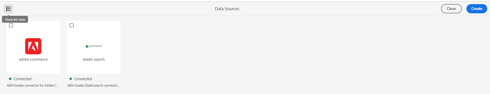

# Neue Funktionen in der Version Oktober 2023 von Adobe Experience Manager Guides as a Cloud Service

Dieser Artikel behandelt die neuen und erweiterten Funktionen in der Version Oktober 2023 von Adobe Experience Manager Guides (später als *AEM Guides as a Cloud Service* bezeichnet).

Weitere Informationen zu den Upgrade-Anweisungen, der Kompatibilitätsmatrix und den in dieser Version behobenen Problemen finden Sie unter [Versionshinweise](release-notes-2023-10-0.md).

## Konfigurieren eines Datenquellen-Connectors über die Benutzeroberfläche

Experience Manager Guides bietet jetzt ein **Datenquellen**-Tool, mit dem Sie vordefinierte Connectoren für Datenquellen konfigurieren können. Sie können auf einfache Weise Connectoren für JIRA-, SQL- (MySQL, PostgreSQL, Microsoft SQL Server, SQLite, MariaDB, H2DB), AdobeCommerce- und Elasticsearch-Datenbanken erstellen.

Sie können einen Datenquellen-Connector auch einfach bearbeiten, erneut verbinden, duplizieren oder löschen. Erfahren Sie, wie [einfach einen Datenquellen-Connector über die Benutzeroberfläche konfigurieren](../cs-install-guide/conf-data-source-connector-tools.md).

{width="550" align="left"}

*Erstellen und Anzeigen der Datenquellen-Connectoren im Bedienfeld „Datenquellen“.*

## Anzeigen von Protokollen für den Themengenerator

Sie können jetzt auch die Protokolldatei für die Inhaltserstellung anzeigen. In dieser Protokolldatei können Sie die Warnungen, Fehler und Ausnahmen überprüfen.  Erfahren Sie mehr darüber, wie [Optionen für einen Themengenerator](../user-guide/web-editor-content-snippet.md#options-for-a-topic-generator) Ihnen helfen, die Themengeneratoren einfach zu generieren und zu verwalten.

## Unterstützung für Velocity-Tools in den Datenquellenvorlagen

Sie können jetzt die Velocity-Tools in den Experience Manager Guides-Vorlagen verwenden. Mit diesen Tools können Sie verschiedene Funktionen auf die Daten anwenden, die Sie aus den Datenquellen abrufen. Sie können die Vorlagen beim Erstellen eines Inhaltsausschnitts oder Themas verwenden. Mit dieser Funktion sparen Sie Zeit und Mühe bei der manuellen Anwendung derselben Funktion auf jeden Datensatz.  Außerdem werden präzise Ergebnisse erzielt.
Beispielsweise können Sie das $mathTool verwenden, um mathematische Funktionen auszuführen.
Erfahren Sie mehr über [ Verwendung von Velocity-Tools in den Datenquellenvorlagen](../user-guide/web-editor-content-snippet.md#use-velocity-tools).

## Native PDF-Verbesserungen

Die folgenden nativen PDF-Verbesserungen wurden in der Version vom Oktober 2023 vorgenommen:

### Zurücksetzen der Seitennummer für die erste Seite eines Layouts

In der nativen PDF-Ausgabe können Sie die Seitenzahlen neu starten und die Zahl angeben, mit der die Nummerierung beginnt. Jetzt können Sie die Nummerierung auch nur für das erste Vorkommen eines Abschnitts starten.
Erfahren Sie mehr über [Arbeiten mit den Seiteneigenschaften eines Seiten-Layouts](../native-pdf/design-page-layout.md#page-props-page-layout).

### Kapitel ohne automatische Nummern im Inhaltsverzeichnis anzeigen

Experience Manager Guides zeigt die Kapitelnummern zusammen mit den Kapitelnamen im Inhaltsverzeichnis (Inhaltsverzeichnis) an. Jetzt können Sie festlegen, dass nur die Kapitelnamen ohne die Kapitelnummern veröffentlicht werden. Weitere Informationen zum Konfigurieren der [erweiterten PDF-Einstellungen einer Vorlage](../native-pdf/components-pdf-template.md#advanced-pdf-settings).

## Herunterladen einer Karte aus dem Web-Editor

Jetzt können Sie eine Karte nicht nur in der Kartenansicht des Web-Editors bearbeiten, sondern auch herunterladen. Sie können die Karte mit einer bestimmten Grundlinie herunterladen. Sie haben außerdem die Möglichkeit, die Hierarchie zu vereinfachen und alle Dateien und Ordner in einem einzigen Ordner zu speichern.

Weitere Informationen finden Sie in der Beschreibung der Funktion **Kartenansicht** im Abschnitt [Linkes Bedienfeld](../user-guide/web-editor-features.md#id2051EA0M0HS).

{width="550" align="left"}

*Wählen Sie eine Datei in der Repository-Ansicht aus und wählen Sie die Option aus, um eine Aktion mit der Datei durchzuführen.*

## Bearbeiten einer Datei im Oxygen Connector-Plug-in

Mit Experience Manager Guides können Sie jetzt eine Datei im Web-Editor auswählen und dann die Datei im Plug-in „Oxygen-Connector“ bearbeiten. Diese Option ist nicht als Bestandteil der vordefinierten Unterstützung aktiviert.

Weitere Informationen finden Sie in der **Optionen für eine Datei** Funktionsbeschreibung im Abschnitt [Linkes Bedienfeld](../user-guide/web-editor-features.md#id2051EA0M0HS).
