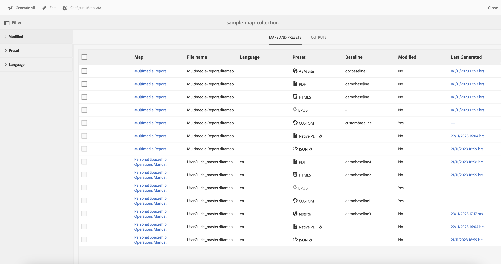
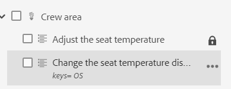

# Neue Funktionen in der Adobe Experience Manager Guides as a Cloud Service-Version vom Dezember 2023

Dieser Artikel behandelt die neuen und erweiterten Funktionen in der Version Dezember 2023 von Adobe Experience Manager Guides (später als *Experience Manager Guides as a Cloud Service* bezeichnet).

Weitere Informationen zu den Upgrade-Anweisungen, der Kompatibilitätsmatrix und den in dieser Version behobenen Problemen finden Sie [ den Versionshinweisen ](release-notes-2023-12-0.md).

## Verwenden von Variablen in der PDF-Ausgabe

Sie können Variablen verwenden, um wiederverwendbare Informationen dynamisch einzufügen und zu verwalten. Mit Experience Manager Guides können Sie Variablen erstellen, bearbeiten und in der Vorschau anzeigen, während Sie die PDF-Ausgabe generieren. Sie können die Werte von Variablen schnell ändern und Ihre Dokumente portabel und einfach zu aktualisieren machen.

{width="800"}

*Erstellen und Verwalten von Variablen im Web-Editor.*

Sie können auch Variablensätze erstellen, die die Standardwerte überschreiben, und Ihren Variablen alternative Werte zuweisen. Fügen Sie diese Variablen in das Seiten-Layout ein und verwenden Sie dasselbe PDF-Layout. Sie müssen nicht für jeden Wertesatz separate Layouts erstellen. Sie können beispielsweise für jede Produktversion einen Variablensatz erstellen. Dieser Variablensatz kann aus Variablen für verschiedene Produktdetails wie Produktname, Versionsnummer und Veröffentlichungsdatum bestehen. Anschließend können Sie für diese Variablen unterschiedliche Werte hinzufügen.

**Variablensatz 1: Adobe-set1**

* Produktname: Experience Manager Guides
* Versionsnummer: 2311
* Veröffentlichungsdatum: 11/02/2023

**Variablensatz 2: Adobe-set2**

* Produktname: Experience Manager Guides
* Versionsnummer: 2310
* Veröffentlichungsdatum: 09/27/2023

*Generieren Sie die PDF-Ausgabe mithilfe von Variablen im PDF-Layout.*

Sie können Stile anwenden und HTML-Markup verwenden, um die Variablen zu formatieren.  Sie können bei Bedarf auch schnell die Werte für alle Variablen aktualisieren und die Ausgabe neu generieren. Wenn Sie beispielsweise die Details für eine Version aktualisieren müssen, können Sie den Wert der Version in der Variablen VersionNumber bearbeiten und die Ausgabe neu generieren.

Erfahren Sie mehr über die Verwendung von [Variablen in der PDF-Ausgabe](../native-pdf/native-pdf-variables.md).

## Neues Erlebnis zur Bearbeitung der Attribute

Jetzt verfügen Sie über ein überarbeitetes Erlebnis, um die Attribute für ein Element im Bedienfeld **Inhaltseigenschaften** im Web-Editor hinzuzufügen oder zu bearbeiten.

{width="300"}

*Attribute aus dem Bedienfeld „Inhaltseigenschaften“ hinzufügen.*

Sie können die Attribute auch einfach bearbeiten und löschen.

Weitere Informationen finden Sie in der Beschreibung der Funktion **Inhaltseigenschaften** im Abschnitt [Bereich rechts](../user-guide/web-editor-features.md#id2051EB003YK).

## Bearbeiten von Metadaten beim Authoring

Beim Authoring können Sie jetzt die Dateimetadaten-Tags mithilfe der Dropdown-Liste **Dateieigenschaften** im rechten Bedienfeld aktualisieren. Sie können auch **Weitere Eigenschaften bearbeiten** auswählen, um weitere Metadaten zu aktualisieren.

{width="300"}

*Aktualisieren von Metadaten und Bearbeiten von Dateieigenschaften im rechten Bedienfeld.*

Weitere Informationen finden Sie in der **Dateieigenschaften** Funktionsbeschreibung im Abschnitt [Bereich rechts](../user-guide/web-editor-features.md#id2051EB003YK).

## Möglichkeit, Inhalte in der ServiceNow-Wissensdatenbank zu veröffentlichen

Sie können Ihre Inhalte jetzt auch auf der ServiceNow-Wissensdatenbankplattform veröffentlichen.

Mit der Version vom Dezember 2023 können Sie als Administrator ein Veröffentlichungsprofil für den ServiceNow-Wissensdatenbank-Server erstellen. Als Autor oder Herausgeber können Sie dann in der Ausgabevorgabe „ServiceNow-Veröffentlichungsprofil“ auswählen, um die Ausgabe in der angegebenen Wissensdatenbank zu veröffentlichen.

Mit dieser Funktion können Sie Inhalte wie Text, Videos und Bilder auf der ServiceNow-Knowledge-Base-Plattform veröffentlichen und ein umfassendes Repository verwalten.

{width="300"}

*Erstellen Sie eine Ausgabevorgabe für die ServiceNow-Wissensdatenbank.*

Weitere Informationen zu den Ausgabevorgaben [Wissensdatenbank](../user-guide/generate-output-knowledge-base.md).

## Verbessertes Dashboard für Zuordnungssammlung

Experience Manager Guides bietet ein erweitertes Dashboard für die Kartensammlung . In einer Zuordnungssammlung können Sie die Metadateneigenschaften für die DITA-Zuordnungen schnell stapelweise konfigurieren. Diese Funktion ist praktisch, da Sie die Metadateneigenschaften nicht für jede DITA-Zuordnung einzeln aktualisieren müssen.

Jetzt können Sie den Dateinamen der DITA-Karte anzeigen. Sie können auch die Baselines anzeigen. Auf diese Weise können Sie die für eine Voreinstellung verwendete Baseline schnell finden.

{width="800"}

*Anzeigen, Bearbeiten und Generieren von Ausgaben im Zuordnungssammlungs-Dashboard.*

Erfahren Sie, wie [Zuordnungssammlung für die Ausgabegenerierung verwenden](../user-guide/generate-output-use-map-collection-output-generation.md).

## Anzeigen von Schlüsselattributen in der Zuordnungsansicht

Wenn Sie Schlüsselattribute für die Themen- oder Zuordnungsreferenzen definieren, können Sie auch den Titel, das entsprechende Symbol und den Schlüssel im linken Bereich anzeigen. Die Taste wird als `key=<key-name>` angezeigt.

Weitere Informationen finden Sie in der Beschreibung der Funktion **Kartenansicht** im Abschnitt [Linkes Bedienfeld](../user-guide/web-editor-features.md#id2051EA0M0HS).

 {width="300"}

*Anzeigen des Schlüsselattributs in der Zuordnungsansicht.*

## Möglichkeit, eine Baseline basierend auf der Bezeichnung zu duplizieren

Experience Manager Guides bietet jetzt ein verbessertes Benutzererlebnis zum Erstellen der Grundlinien aus dem Web-Editor.\
 {width="300"}
*Erstellen einer Baseline aus dem Web-Editor.*

Außerdem können Sie eine Baseline basierend auf der Bezeichnung duplizieren. Die Referenzversion wird basierend auf der angegebenen Beschriftung (falls vorhanden) beim Duplizieren ausgewählt, andernfalls wird die Version aus der duplizierten Baseline ausgewählt.

 {width="300"}

*Duplizieren Sie eine Baseline basierend auf einer Beschriftung oder erstellen Sie eine exakte Kopie.*

Erfahren Sie mehr über das [Erstellen und Verwalten von Baselines im Web-Editor](../user-guide/web-editor-baseline.md).

## Auflösen von Kreuzzuordnungs-Links in der AEM-Site-Ausgabe

Kreuzzuordnungs-Links (XREF mit Peer-Bereich), die in der AEM-Site-Ausgabe gerendert werden, werden jetzt gemäß dem Dateinamen des Veröffentlichungskontexts aufgelöst, der für die generierte Zuordnung festgelegt wurde.

## Konfigurieren Sie die URL der Ausgabe der AEM-Site, um den Dokumenttitel zu verwenden

Experience Manager Guides ermöglicht es Ihnen als Administrator, die URL der Ausgabe der AEM-Site zu konfigurieren. Wenn der Dateiname nicht vorhanden ist oder alle Sonderzeichen enthält, können Sie so konfigurieren, dass er sie durch ein Trennzeichen in der URL der AEM-Site-Ausgabe ersetzt. Sie können sie auch durch den Namen des ersten untergeordneten Themas ersetzen. Erfahren Sie, wie [die URL der AEM-Site-Ausgabe so konfigurieren, dass sie den Dokumenttitel verwendet](../cs-install-guide/conf-output-generation.md#configure-the-url-of-the-aem-site-output-to-use-the-document-title).
