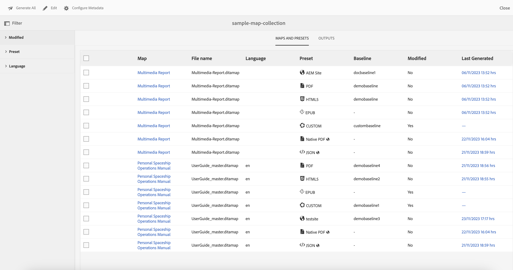

# Neue Funktionen in der Adobe Experience Manager Guides as a Cloud Service-Version vom Dezember 2023

Dieser Artikel behandelt die neuen und verbesserten Funktionen in der Version Dezember 2023 von Adobe Experience Manager Guides (später als *Experience Manager Guides as a Cloud Service* bezeichnet).

Weitere Informationen zu den Upgrade-Anweisungen, der Kompatibilitätsmatrix und den in dieser Version behobenen Problemen finden Sie unter [Versionshinweise](release-notes-2023-12-0.md).

## Variablen in der PDF-Ausgabe verwenden

Mithilfe von Variablen können Sie wiederverwendbare Informationen dynamisch einfügen und verwalten. Experience Manager Guides unterstützt Sie beim Erstellen, Bearbeiten und Anzeigen einer Vorschau von Variablen beim Generieren der PDF-Ausgabe. Sie können die Werte von Variablen schnell ändern und Ihre Dokumente portabel und einfach zu aktualisieren.

{width="800" align="left"}

*Erstellen und verwalten Sie Variablen im Web-Editor.*

Sie können auch Variablensätze erstellen, die die Standardwerte außer Kraft setzen und Ihren Variablen alternative Werte zuweisen. Fügen Sie diese Variablen in das Seitenlayout ein und verwenden Sie dasselbe PDF-Layout. Sie müssen nicht für jeden Wertesatz separate Layouts erstellen. Sie können beispielsweise für jede Produktversion einen Variablensatz erstellen. Dieser Variablensatz kann aus Variablen für verschiedene Produktdetails wie Produktname, Versionsnummer und Veröffentlichungsdatum bestehen. Anschließend können Sie für diese Variablen unterschiedliche Werte hinzufügen.

**Variable festgelegt 1: Adobe-set1**

* ProductName: Experience Manager Guides
* VersionNumber: 2311
* Releasedatum: 20.11.2023

**Variable festgelegt 2: Adobe-set2**

* ProductName: Experience Manager Guides
* VersionNumber: 2310
* ReleaseDate: 27.09.2023

*Generieren Sie die PDF-Ausgabe mithilfe von Variablen im PDF-Layout.*

Sie können Stile anwenden und HTML Markup verwenden, um die Variablen zu formatieren.  Sie können die Werte für alle Variablen bei Bedarf auch schnell aktualisieren und die Ausgabe neu generieren. Wenn Sie beispielsweise die Details für eine Version aktualisieren müssen, können Sie den Wert der Version in der Variablen VersionNumber bearbeiten und die Ausgabe neu generieren.

Erfahren Sie mehr über die Verwendung von [Variablen in der PDF-Ausgabe](../native-pdf/native-pdf-variables.md).

## Umgestaltetes Erlebnis zur Bearbeitung der Attribute

Jetzt erhalten Sie ein überarbeitetes Erlebnis, um die Attribute für ein Element aus dem Bereich **Inhaltseigenschaften** im Web Editor hinzuzufügen oder zu bearbeiten.

{width="300" align="left"}

*Fügen Sie Attribute aus dem Bereich &quot;Inhaltseigenschaften&quot;hinzu.*

Sie können die Attribute auch einfach bearbeiten und löschen.

Weitere Informationen finden Sie in der Beschreibung der Funktion **Inhaltseigenschaften** im Abschnitt [Rechtes Bedienfeld](../user-guide/web-editor-features.md#id2051EB003YK) .

## Bearbeiten von Metadaten beim Authoring

Jetzt können Sie beim Authoring die Metadaten-Tags der Datei mithilfe des Dropdown-Menüs aus den **Dateieigenschaften** im rechten Bereich aktualisieren. Sie können auch &quot;**Weitere Eigenschaften bearbeiten**&quot;auswählen, um weitere Metadaten zu aktualisieren.

{width="300" align="left"}

*Aktualisieren Sie die Metadaten und bearbeiten Sie die Dateieigenschaften im rechten Bereich.*

Weitere Informationen finden Sie in der Beschreibung der Funktion **Dateieigenschaften** im Abschnitt [Rechtes Bedienfeld](../user-guide/web-editor-features.md#id2051EB003YK) .

## Möglichkeit der Veröffentlichung von Inhalten in der ServiceNow-Wissensdatenbank

Sie können Ihre Inhalte jetzt auch in der ServiceNow Knowledge Base-Plattform veröffentlichen.

Mit der Version von Dezember 2023 können Sie als Administrator ein Veröffentlichungsprofil für den ServiceNow Knowledge Base-Server erstellen. Als Autor oder Herausgeber können Sie dann dieses ServiceNow-Veröffentlichungsprofil in der Ausgabevorgabe auswählen, um die Ausgabe in der angegebenen Wissensdatenbank zu veröffentlichen.

Mit dieser Funktion können Sie Inhalte wie Text, Videos und Bilder in der ServiceNow Knowledge Base-Plattform veröffentlichen und ein umfassendes Repository verwalten.

{width="300" align="left"}

*Erstellen Sie eine Ausgabevorgabe für die ServiceNow-Wissensdatenbank.*

Erfahren Sie mehr über die Ausgabevorgaben der [Wissensdatenbank](../user-guide/generate-output-knowledge-base.md).

## Verbessertes Landkartenkollektions-Dashboard

Experience Manager Guides bietet ein erweitertes Dashboard für die Zuordnungserfassung. In einer Zuordnungssammlung können Sie die Metadateneigenschaften für die DITA-Maps schnell stapelweise konfigurieren. Diese Funktion ist praktisch, da Sie die Metadateneigenschaften nicht für jede DITA-Zuordnung einzeln aktualisieren müssen.

Jetzt können Sie den Dateinamen der DITA-Map anzeigen. Sie können auch die Grundlinien anzeigen. Auf diese Weise können Sie schnell die für eine Vorgabe verwendete Grundlinie finden.

{width="800" align="left"}

*Anzeigen, Bearbeiten und Generieren der Ausgabe aus dem Dashboard der Zuordnungssammlung.*

Erfahren Sie, wie Sie [die Kartensammlung für die Ausgabegenerierung verwenden](../user-guide/generate-output-use-map-collection-output-generation.md).

## Anzeigen von Schlüsselattributen in der Kartenansicht

Wenn Sie Schlüsselattribute für das Thema oder die Zuordnungsreferenzen definieren, können Sie auch den Titel, das entsprechende Symbol und den Schlüssel im linken Bereich anzeigen. Der Schlüssel wird als `key=<key-name>` angezeigt.

Weitere Informationen finden Sie in der Beschreibung der Funktion **Kartenansicht** im Abschnitt [Linkes Bedienfeld](../user-guide/web-editor-features.md#id2051EA0M0HS) .

 {width="300" align="left"}

*Zeigen Sie das Schlüsselattribut in der Kartenansicht an.*

## Möglichkeit, eine Grundlinie basierend auf der Bezeichnung zu duplizieren

Experience Manager Guides bietet jetzt ein verbessertes Benutzererlebnis zum Erstellen der Grundlinien im Web-Editor.\
 {width="300" align="left"}
*Erstellen Sie eine Grundlinie aus dem Web-Editor.*

Außerdem können Sie damit eine Grundlinie basierend auf der Bezeichnung duplizieren. Die Referenzversion wird beim Duplizieren anhand der angegebenen Bezeichnung ausgewählt (sofern vorhanden) oder wählt die Version aus der duplizierten Grundlinie aus.

 {width="300" align="left"}

*Duplizieren Sie eine Grundlinie basierend auf einer Bezeichnung oder erstellen Sie eine exakte Kopie.*

Erfahren Sie mehr darüber, wie Sie mit dem Web Editor ](../user-guide/web-editor-baseline.md) Grundlinien erstellen und verwalten.[

## Auflösen von Cross-Map-Links in der Ausgabe der AEM Site

Cross-Map-Links (XREF mit Perimeter Peer), die in der AEM Site-Ausgabe gerendert werden, werden jetzt gemäß dem Dateinamen des Veröffentlichungskontexts aufgelöst, der für die generierte Zuordnung festgelegt wurde.

## URL der Ausgabe der AEM Site zur Verwendung des Dokumenttitels konfigurieren

Experience Manager Guides ermöglicht es Ihnen als Administrator, die URL der AEM Site-Ausgabe zu konfigurieren. Wenn der Dateiname nicht vorhanden ist oder alle Sonderzeichen enthält, können Sie konfigurieren, dass er in der URL der AEM Site-Ausgabe durch ein Trennzeichen ersetzt wird. Sie können sie auch durch den Namen des ersten untergeordneten Themas ersetzen. Erfahren Sie, wie Sie [die URL der AEM Site-Ausgabe für die Verwendung des Dokumenttitels konfigurieren](../cs-install-guide/conf-output-generation.md#configure-the-url-of-the-aem-site-output-to-use-the-document-title).
