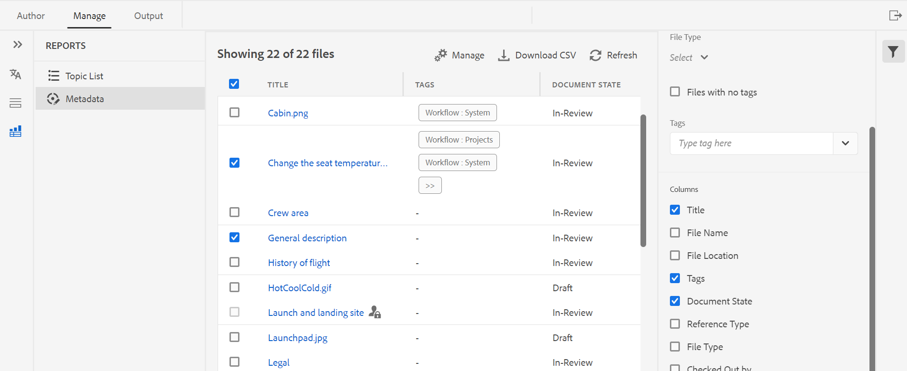

# Neue Funktionen in der Version Februar 2023 von Adobe Experience Manager Guides as a Cloud Service

Dieser Artikel behandelt die neuen und erweiterten Funktionen in der Version Februar 2023 von Adobe Experience Manager Guides (später *AEM Guides as a Cloud Service*).

Weitere Informationen zu den Upgrade-Anweisungen, der Kompatibilitätsmatrix und den in dieser Version behobenen Problemen finden Sie im Artikel [Versionshinweise](release-notes-2023-2-0.md) .

## Erstellen von Berichten im Web-Editor

AEM Guides verfügt über eine Funktion im Web-Editor, mit der Sie die Vollständigkeit Ihrer technischen Dokumente insgesamt überprüfen und Berichte für sie generieren können.
Sie können die Themenliste anzeigen, die Metadaten verwalten und die in allen Verweisen für die aktuelle Zuordnung verwendeten Multimedia-Inhalte in der
Registerkarte **Berichte** im Web-Editor.

**Generieren der Themenlistenansicht**

Sie können die Themenliste generieren, die detaillierte Informationen zu Ihren Themen bereitstellt, z. B. den Referenztyp, den Dokumentstatus und den Autor. Sie können auch die CSV-Datei generieren, um den aktuellen Schnappschuss der Themen in der DITA-Karte herunterzuladen.

**Verwalten von Metadaten und Ändern des Dokumentstatus**

Sie können Tags auf ein einzelnes Thema anwenden oder die Bulk-Tagging-Funktion verwenden, um mehrere Tags auf mehrere Themen, eine DITA-Karte oder eine Unterzuordnung anzuwenden. Sie können auch den Dokumentstatus aller ausgewählten Themen in den nächstmöglichen allgemeinen Dokumentstatus ändern.

**Generieren des Multimedia-Berichts**

Sie können den Multimedia-Bericht erstellen, der detaillierte Informationen zu den Multimedia-Inhalten enthält, die in Ihren Referenzen innerhalb der aktuellen Karte verwendet werden. Sie haben die Flexibilität, die im Bericht aufgelisteten Multimediadateien zu filtern und zu sortieren.
Sie können auch die CSV-Datei generieren, um den aktuellen Schnappschuss der in der DITA-Karte verwendeten Multimedia-Inhalte herunterzuladen.

## Überarbeiteter UX für die Überprüfungsfunktion

Jetzt bieten AEM-Handbücher eine verbesserte Benutzeroberfläche, mit der Sie die freigegebenen Themen zur Überprüfung überprüfen können. In der neuesten Version wurden für die Überprüfungsfunktion folgende Verbesserungen vorgenommen:

* Aktualisierte Benutzeroberfläche
* Bedienfeld „Bedingungen“, mit dem Sie den Inhalt entsprechend den verfügbaren Bedingungen im Thema markieren können
* Jeder Kommentar im Kommentarbereich ist mit dem entsprechenden Text im aktuellen Thema verknüpft. Damit können Sie den kommentierten Text leichter identifizieren.
* Die Kommentare werden in der Reihenfolge des kommentierten Texts im Dokument angezeigt.
* Der Name der Prüfungsaufgabe wird im Prüfungs-Workflow angezeigt.
* Wählen Sie die Rootmap für die Prüfungsaufgabe aus, die zum Auflösen aller wichtigen Verweise und Glossarbegriffe verwendet wird, die im Prüfungsinhalt verwendet werden.
* Kontextuelle Symbolleiste zum schnellen Hervorheben oder Durchstreichen von Text
* Optionsmenü zum Bearbeiten oder Löschen eigener Kommentare
* Für veraltete Kommentare haben Sie Zugriff auf eine Ansicht, die Ihnen hilft, die vorherige Version des Themas mit der aktuellen Überprüfungsversion zu vergleichen.
* Bei Verwendung der Filter werden die Kommentare im rechten Bedienfeld entsprechend der Auswahl gefiltert und die
Die Anzahl der Kommentare im linken Bereich wird entsprechend aktualisiert.

  

## Verbesserungen an der Übersetzung

Jetzt verfügen Sie über benutzerfreundlichere Verbesserungen im Übersetzungs-Dashboard, mit denen Sie Ihre Dokumente aus dem Web-Editor einfach übersetzen können.

**Übergeben Sie die Versionsbezeichnung an die Zielversion**

Mit AEM Guides können Sie die Bezeichnung der Quelldatei an die Zieldatei übergeben. Auf diese Weise können Sie die Quellversion für die übersetzte Datei leicht identifizieren.

Wenn Sie beispielsweise Quelldateien haben, auf die die Bezeichnung Version 1.0 angewendet wurde, können Sie die Bezeichnung Quelle (Version 1.0) auch an die übersetzte Datei weitergeben.

**Erzwingt die Synchronisierung für nicht synchronisierte Assets**

Wenn Sie Änderungen an einigen Assets vornehmen, werden diese von AEM Guides als nicht synchronisiert markiert. Sie können die geänderten Assets entweder erneut übersetzen oder den Status „Nicht synchronisiert“ verwerfen. Wenn Sie zum Beispiel einige kleinere Änderungen vorgenommen haben, die wirklich keine Übersetzung benötigen, können Sie deren Status als „Synchronisiert“ markieren.

**In Bearbeitung befindliche Übersetzungsprojekte für ein Thema oder eine Karte anzeigen**

Einige der Verweise auf Ihrem Übersetzungs-Dashboard sind möglicherweise in Bearbeitung. Jetzt bietet AEM Guides eine Funktion, mit der Sie die Liste aller laufenden Übersetzungsprojekte (zusammen mit der Zielsprache) anzeigen können, die die ausgewählte Referenz enthalten.

## Generieren von Ausgaben in verschiedenen Formaten aus dem Web-Editor

Jetzt können Sie die Ausgabe für Ihre Themen oder DITA-Map einfach aus dem Web-Editor generieren. Sie können verschiedene Ausgabevorgaben wie AEM-Site, PDF, HTML5,
JSON (ein Headless-Ausgabeformat) und benutzerdefinierte Ausgabe. Sie können diese dann verwenden, um die entsprechenden Ausgaben zu generieren.

Sie können Attribute in Ihren DITA-Themen definieren und dann die Bedingungsvorgabe verwenden, um eine Bedingung beim Veröffentlichen der Ausgabe anzuwenden. Sie können die Funktion „Baseline-Veröffentlichung“ auch verwenden, um eine bestimmte Version Ihrer DITA-Karte oder Ihres Themas selektiv zu veröffentlichen.

## Suchen und Ersetzen des Textes auf Kartenebene

Mit AEM Guides können Sie in einer Zuordnung nach Dateien suchen, die bestimmten Text enthalten. Der gesuchte Text wird in den Dateien hervorgehoben. Jetzt können Sie auch das gesuchte Wort oder die gesuchte Phrase in allen Dateien durch ein anderes Wort oder eine andere Phrase ersetzen. Sie können das Symbol **Alle ersetzen** oben rechts in der Liste auswählen, um alle Vorkommen des gesuchten Begriffs in allen Dateien zu ersetzen.

## Löschen und Duplizieren von Dateien aus dem Repository-Bereich

Jetzt können Sie ganz einfach ein Duplikat oder eine Kopie einer Datei über das Menü **Optionen** der ausgewählten Datei im Repository-Bereich erstellen. Standardmäßig wird die Datei erstellt mit
Ein Suffix (wie `filename_1.extension`).

## Weitere Verbesserungen am Web-Editor

* In AEM Guides können Sie mithilfe des Kontextmenüs einige allgemeine Vorgänge für Bilder und Mediendateien ausführen. Jetzt können Sie auch das ausgewählte Bild oder die ausgewählten Medien im Repository finden oder die Vorschau der Datei in der Assets-Benutzeroberfläche anzeigen.

* Der Name des aktuellen Ordnerprofils wird als Bezeichnung für das Symbol Benutzereinstellungen in der Hauptsymbolleiste angezeigt. Auf diese Weise können Sie das Ordnerprofil identifizieren, an dem Sie arbeiten.

* Wenn Sie eine Karte in der Kartenansicht öffnen, wird der Titel der aktuellen Karte in der Mitte der Symbolleiste angezeigt. Dies ist hilfreich, um Benutzenden mitzuteilen, welche Karte derzeit geöffnet ist.

## Titel anstelle von UUID im Sauerstoff-Editor anzeigen

Jetzt können Sie in AEM Guides die Option **Titel im Editor verwenden und Zuordnungs** Manager in den Einstellungen auswählen. Wenn Sie diese Option auswählen, wird der Titel der Datei auf der Registerkarte der Datei angezeigt, wenn sie im Editor oder DITA Maps Manager geöffnet wird. Wenn Sie diese Option nicht auswählen, wird die UUID der Datei auf der Registerkarte der Datei angezeigt.

## Microservice-basierte Veröffentlichung für AEM Guides as a Cloud Service

Der neue Publishing-Microservice ermöglicht es Ihnen, große Publishing-Workloads gleichzeitig auf AEM Guides as a Cloud Service auszuführen und die branchenführende Server-lose Adobe I/O Runtime-Plattform zu nutzen.

Für jede Veröffentlichungsanfrage führt AEM Guides as a Cloud Service einen separaten Container aus, der gemäß den Benutzeranfragen horizontal skaliert werden kann. Dadurch können Sie mehrere Veröffentlichungsanfragen ausführen und eine verbesserte Leistung erzielen.

Weitere Informationen finden Sie unter [Konfigurieren einer neuen, auf Microservices basierenden Veröffentlichung für AEM Guides as a Cloud Service](https://experienceleague.adobe.com/docs/experience-manager-guides-learn/tutorials/knowledge-base/publishing/configure-microservices.md).

## Native PDF | Hinzufügen eines benutzerdefinierten Lesezeichens in der PDF-Ausgabe

Jetzt können Sie ein benutzerdefiniertes Lesezeichen zu einem bestimmten Inhalt in Ihrer endgültigen PDF-Ausgabe hinzufügen, um die Navigation zu erleichtern. Dies wird dem Inhaltsverzeichnis hinzugefügt, das aus den Themen- oder Abschnittstiteln in Ihrer DITA-Karte erstellt wird.

## Native PDF | Anwenden eines benutzerdefinierten Stils auf Inhaltsverzeichniseinträge und Themeninhalte

AEM Guides bietet die Funktion, benutzerdefinierte Stile auf Inhaltsverzeichniseinträge oder ein bestimmtes Thema in der PDF-Ausgabe anzuwenden. Sie können beispielsweise die Farbe des Textes im Inhaltsverzeichnis und den Titel des Themas ändern. Sie können auch Stile auf den gesamten Inhalt innerhalb des Themas anwenden.

## Native PDF | Formatieren der Seitenmarkierung in der Fußnoten -Komponente

Jetzt können Sie die Seitenmarkierung in den Fußnoten formatieren. Sie können beispielsweise Klammern hinzufügen oder deren Farbe ändern. Diese Stile helfen den Benutzenden, die Seitenmarkierungen im Dokument leicht zu identifizieren.

## Native PDF | Ändern der Leiste, um geänderte Themen im Inhaltsverzeichnis anzuzeigen

Mit AEM Guides können Sie nun die geänderten Themen im Inhaltsverzeichnis der PDF-Ausgabe schnell identifizieren.  Links neben den geänderten Themen im Inhaltsverzeichnis wird eine Änderungsleiste angezeigt. Sie können auf das Thema im Inhaltsverzeichnis klicken und die detaillierten Änderungen anzeigen.

