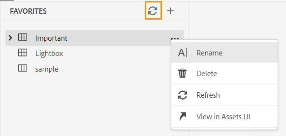
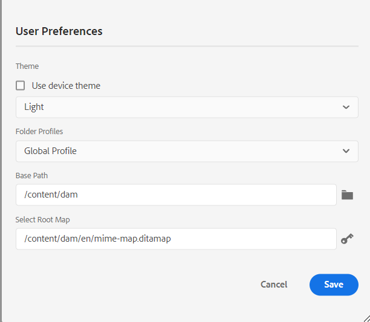

# Neue Funktionen in der Version Juni 2023 von Adobe Experience Manager Guides as a Cloud Service

Dieser Artikel behandelt die neuen und erweiterten Funktionen in der Version Juni 2023 von Adobe Experience Manager Guides (später *AEM Guides as a Cloud Service*).

Weitere Informationen zu den Upgrade-Anweisungen, der Kompatibilitätsmatrix und den in dieser Version behobenen Problemen finden Sie unter [Versionshinweise](release-notes-2023-6-0.md).

## Bericht zu fehlerhaften Links im Web-Editor

Mit AEM Guides können Sie die Vollständigkeit Ihrer technischen Dokumente überprüfen und Berichte über den Web-Editor generieren. Ab jetzt Version Juni 2023 bietet Ihnen AEM Guides die Funktion zum Anzeigen und Beheben von fehlerhaften Links. Dies ist ein nützlicher Bericht, der Ihnen bei der Verwaltung Ihrer fehlerhaften Links hilft. Sie können die beschädigten Links in Ihrer DITA-Karte einfach anzeigen und auch beheben.
{width="800" align="left"}

Nachdem Sie einen Link korrigiert haben, wird er nicht mehr unter der Liste der fehlerhaften Links angezeigt.

Weitere Informationen finden Sie unter [Anzeigen und Beheben von fehlerhaften Links](../user-guide/reports-web-editor.md#report-broken-links).

## Umbenennen und Verschieben von Dateien in der Repository-Ansicht

Jetzt können Sie eine Datei auch über das Repository-Bedienfeld umbenennen oder verschieben. Diese Funktion ist praktisch und hilft bei der einfachen Verwaltung Ihrer Dateien über das Repository-Bedienfeld. Sie können eine Datei auswählen und sie über das Menü **Optionen** für die ausgewählte Datei umbenennen oder verschieben. AEM Guides zeigt eine Erfolgsmeldung an, wenn Sie eine Datei verschieben oder umbenennen.

{width="650" align="left"}

Weitere Informationen zum Optionen-Menü einer Datei finden Sie in der **Repository-Ansicht** Funktionsbeschreibung im Abschnitt [Linkes ](../user-guide/web-editor-features.md#id2051EA0M0HS)).

## Native PDF-Verbesserungen

### Hinzufügen eines Wasserzeichens zum PDF der Ausgabe für Entwurfsdokumente

Jetzt können Sie der PDF-Ausgabe des noch nicht genehmigten Dokuments ein Wasserzeichen hinzufügen. Dieses Wasserzeichen wird nicht angezeigt, wenn Sie die PDF für das Dokument im Dokumentstatus „Genehmigt“ generieren. Sie können beispielsweise einen Wasserzeichenentwurf für Ihre PDF-Ausgabe hinzufügen.

Weitere Informationen finden Sie unter [Hinzufügen eines Wasserzeichens zur PDF-Ausgabe für Entwurfsdokumente](../native-pdf/use-javascript-content-style.md#watermark-draft-document).

### Unterstützung für Sprachvariablen

AEM Guides unterstützt Sprachvariablen. Sie können Sprachvariablen verwenden, um eine lokalisierte Version der vordefinierten Kennzeichnungen wie „Hinweis“, „Vorsicht“ und „Warnung“ oder „Statischer Text“ in der PDF-Ausgabe zu definieren.
Sie können die Sprachvariablen oder die lokalisierte Version der Kennzeichnungen den entsprechenden Abschnitten in Ihrer PDF-Ausgabe und in den Ausgabevorlagen hinzufügen.

#### Sprachvariablen in der PDF-Ausgabe

Sie können die Sprachvariablen verwenden, um lokalisierte Beschriftungen für Elemente wie „Hinweis“, „Vorsicht“ und „Warnung“ zu definieren. Sie können den Wert für diese Variablen in einer oder mehreren Sprachen aktualisieren, und dann wird der lokalisierte Wert automatisch in der PDF-Ausgabe ausgewählt.
Beispielsweise können Sie die Beschriftung Hinweis in Ihrer PDF-Ausgabe wie folgt darstellen:

* Englisch: Hinweis
* Französisch: Remarque
* Deutsch: Hinweis

#### Sprachvariablen in den Ausgabevorlagen

Wenn Sie die PDF-Ausgabe in verschiedenen Sprachen erstellen wollten, mussten Sie verschiedene PDF-Vorlagen erstellen, die lokalisierten Text für jede Sprache enthalten. Mit der Sprachvariablen-Funktion müssen Sie die Vorlage nur noch einmal erstellen. Anschließend können Sie für jeden statischen Text, den Sie lokalisieren müssen, entsprechende Sprachvariablen erstellen und in Ihrer Vorlage verwenden.
Sie können Sprachvariablen für längeren Text erstellen, z. B. einen ganzen Satz oder sogar einen Absatz. Sie können auch Stile anwenden und HTML-Markup verwenden, um diese Sprachvariablen zu formatieren.

Weitere Informationen finden Sie unter [Unterstützung für Sprachvariablen](../native-pdf/native-pdf-language-variables.md).

### Verwendung von AEM-Metadaten in PDF-Layouts

Metadaten sind die Beschreibung oder Definition Ihres Inhalts. Diese Metadaten werden in Ihrem Quell-DITA-Map-Inhalt gespeichert.

Jetzt können Sie in AEM Guides auch die Metadateneigenschaften Ihrer Assets auswählen und sie zum Seiten-Layout hinzufügen. AEM Guides wählt diese Metadateneigenschaften Ihrer Assets aus und veröffentlicht sie in Ihrer PDF-Ausgabe.

{width="550" align="left"}

>[!NOTE]
>
> AEM Guides unterstützt auch die Metadateneigenschaften für Ihre DITA-Zuordnungen.

Weitere Informationen finden Sie unter [Hinzufügen von Feldern und Metadaten](../native-pdf/design-page-layout.md#add-fields-metadata).

## Verbesserungen am Schematron

### Verwenden Sie Berichtsanweisungen, um im Schematron nach Regeln zu suchen

AEM Guides unterstützt jetzt auch die Report Statements mit dem Schematron. Eine Berichtsanweisung erzeugt eine Meldung, wenn eine Testanweisung als „true“ ausgewertet wird. Wenn Sie beispielsweise möchten, dass die Kurzbeschreibung maximal 150 Zeichen lang ist, können Sie eine Berichtsanweisung definieren, um die Themen zu überprüfen, bei denen die Kurzbeschreibung mehr als 150 Zeichen lang ist.

Weitere Informationen finden Sie unter [Verwenden von Assert- und Report-Anweisungen zum Überprüfen auf Regeln](../user-guide/support-schematron-file.md#schematron-assert-report).

### Verwenden von Regex-Ausdrücken

Sie können auch Regex-Ausdrücke verwenden, um eine Regel mit matches()-Funktion zu definieren und dann eine Validierung mithilfe der Schematron-Datei durchzuführen.

Weitere Informationen finden Sie unter [Verwenden von Regex-Ausdrücken](../user-guide/support-schematron-file.md#schematron-assert-report).

### Abstrakte Muster definieren

AEM Guides unterstützt auch abstrakte Muster in Schematron. Sie können generische abstrakte Muster definieren und diese abstrakten Muster wiederverwenden. Abstrakte Muster können Ihr Schematron-Schema vereinfachen und Ihnen auch dabei helfen, Ihre Validierungslogik zu verwalten und zu aktualisieren.

Weitere Informationen finden Sie unter [Definieren abstrakter Muster](../user-guide/support-schematron-file.md#schematron-abstract-patterns).

## Navigieren Sie vom Web-Editor zur AEM-Startseite

Jetzt können Sie einfach vom Web-Editor zur AEM-Startseite navigieren.

{width="800" align="left"}

* Klicken Sie auf **Guides**-Symbol ( ), um zur AEM-Navigationsseite zurückzukehren.

Weitere Informationen finden Sie unter [AEM-Navigationsseite](../user-guide/web-editor-launch-editor.md#id2056BG00RZJ).

## Umgang mit hierarchischen Definitionen von Betreffdefinitionen und Auflistungen

AEM Guides verfügt über die leistungsstarke Funktion zum Erstellen von Themenschemakarten, bei denen es sich um eine spezielle Form von DITA-Karten handelt, mit denen taxonomische Themen und kontrollierte Werte definiert werden. Jetzt können Sie in AEM Guides auch die Betreffdefinition in einer Zuordnung und die Auflistungsdefinitionen in einer anderen Zuordnung definieren. Anschließend können Sie die Zuordnungsreferenz hinzufügen und das Betreffschema verwenden.
Die Verweise auf die Auflistung des Subjekts werden in derselben Zuordnung oder in der referenzierten Zuordnung aufgelöst.

Weitere Informationen zum Umgang mit hierarchischen Definitionen von Betreffdefinitionen und Auflistungen finden Sie in der **Betreffschema** Funktionsbeschreibung im Abschnitt [Linkes ](../user-guide/web-editor-features.md#id2051EA0M0HS)).

## Unterstützung des XLIFF-Formats bei der Übersetzung

AEM Guides unterstützt auch das XLIFF-Format (XML Localization Interchange File Format) bei der Übersetzung. Jetzt können Sie auch wählen, **Neues XLIFF-Übersetzungsprojekt erstellen**, um den XML-Inhalt in das XLIFF-Format zu konvertieren.
Mithilfe dieses Formats können Sie die Inhalte in das standardmäßige XLIFF-Format exportieren und sie dann den Übersetzungsdienstleistern bereitstellen. Weitere Informationen finden Sie unter [Übersetzungsprojekt erstellen](../user-guide/translate-documents-web-editor.md#create-translation-project).

{width="350" align="left"}

## Bedienfeld „Favoriten“ verbessert

Mit AEM Guides können Sie eine Sammlung oder Favoritenliste Ihrer Dateien und Ordner erstellen und diese einfach verwenden. Das **„Optionen** ist jetzt auch im Bedienfeld &quot;**&quot;**. Sie können die ausgewählte Sammlung umbenennen oder sie aus dem Menü **Optionen** löschen. Sie können die Option **Aktualisieren** auswählen, um eine neue Liste der Dateien oder Ordner aus dem Repository abzurufen. Sie können die Ordnerinhalte auch in der Benutzeroberfläche von Assets anzeigen.

{width="650" align="left"}

>[!NOTE]
>
> Sie können die Liste auch mithilfe des Symbols **Aktualisieren** oben aktualisieren.

Weitere Informationen zum Menü **Optionen** einer Favoritensammlung finden Sie in der **Favoriten**-Funktionsbeschreibung im Abschnitt [Linkes Bedienfeld](../user-guide/web-editor-features.md#id2051EA0M0HS).

## Zum Systemdesign wechseln

Sie können jetzt auch das Geräte-Design verwenden. Unter **Benutzereinstellungen** können Sie AEM Guides so konfigurieren, dass je nach Design Ihres Geräts automatisch zwischen hellen und dunklen Designs gewechselt wird.

{width="550" align="left"}

Weitere Informationen finden Sie in der Beschreibung der Funktion **Benutzereinstellungen** im Abschnitt [Hauptsymbolleiste](../user-guide/web-editor-features.md#id2051EA0G05Z).
