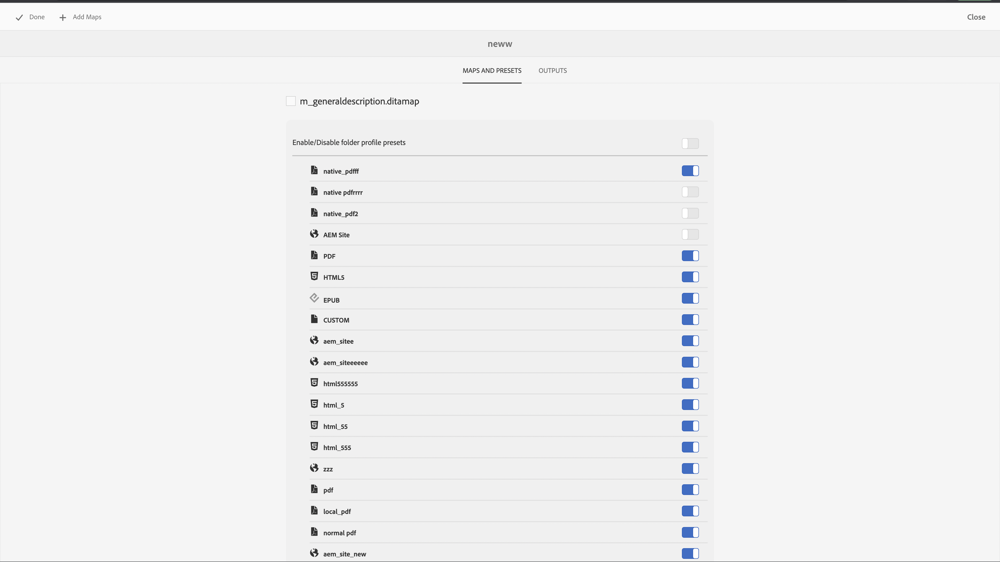

# Neue Funktionen in der Adobe Experience Manager Guides as a Cloud Service-Version vom Juli 2023

In diesem Artikel werden die neuen und verbesserten Funktionen in der Adobe Experience Manager Guides-Version vom Juli 2023 (später als *AEM Guides as a Cloud Service* bezeichnet) behandelt.

Weitere Informationen zu den Upgrade-Anweisungen, der Kompatibilitätsmatrix und den in dieser Version behobenen Problemen finden Sie unter [Versionshinweise](release-notes-2023-7-0.md).

## Herstellen einer Verbindung zu einer Datenquelle und Einfügen von Daten in Ihre Themen

Jetzt können Sie über vordefinierte Connectoren aus AEM Guides schnell eine Verbindung zu Ihren Datenquellen herstellen. Durch die Verbindung mit einer Datenquelle können Sie Ihre Informationen mit der Quelle synchronisieren und alle Aktualisierungen der Daten werden automatisch übernommen, wodurch AEM Guides zu einem echten Content-Hub wird. Mit dieser Funktion sparen Sie Zeit und Mühe beim manuellen Hinzufügen oder Kopieren der Daten.

AEM Guides ermöglicht es Ihrem Administrator nun, die nativen Connectoren für JIRA- und SQL-Datenbanken (MySQL, PostgreSQL, SQL Server, SQLite) zu konfigurieren. Sie können auch andere Connectoren hinzufügen, indem sie die Standardschnittstellen erweitern.

Nach dem Hinzufügen können Sie die konfigurierten Connectoren anzeigen, die im Web Editor im Bereich **Datenquellen** aufgeführt sind.

{width="300" align="left"}

Sie können einen Generator für Inhaltsfragmente erstellen, um die Daten aus einer verbundenen Datenquelle abzurufen. Anschließend können Sie die Daten in Ihre Themen einfügen und sie bearbeiten.

Nachdem Sie einen Inhaltsfragment-Generator erstellt haben, können Sie ihn wiederverwenden, um die Daten in ein beliebiges Thema einzufügen. Weitere Informationen finden Sie unter [Einfügen eines Inhaltsfragments aus Ihrer Datenquelle](../user-guide/web-editor-content-snippet.md).

## Überprüfungsfenster zur Präsentation von Überprüfungsprojekten und der aktiven Prüfungsaufgaben

AEM Guides macht Ihre Bewertungen nun nahtloser. Es stellt den Bereich &quot;Bewertungen&quot;im Web Editor bereit. Im Bedienfeld &quot;Überprüfungen&quot;werden alle Überprüfungsprojekte und die aktiven Prüfungsaufgaben innerhalb der Überprüfungsprojekte angezeigt, zu denen Sie gehören.

Als Autor können Sie mit dieser Funktion die Prüfungsaufgaben einfach öffnen, die Kommentare anzeigen und die Kommentare schnell in einer zentralen Ansicht bearbeiten.
{width="800" align="left"}
Weitere Informationen finden Sie in der Beschreibung der Funktion **Überprüfen** im Abschnitt [Linkes Bedienfeld](../user-guide/web-editor-features.md#id2051EA0M0HS) .

## Verbesserungen bei der Zuordnungssammlung

Mit einer Map Collection können Sie mehrere Maps organisieren und sie im Stapel veröffentlichen. An der Zuordnungssammlung wurden viele neue Verbesserungen vorgenommen:

- Jetzt können Sie einer Zuordnungssammlung auch native PDF-Ausgabevorgaben hinzufügen und diese zum Generieren der PDF-Ausgabe verwenden.
- Sie können die von Ihrem Administrator erstellten globalen und Ordnerprofilvorgaben anzeigen und sie zum Generieren der PDF-Ausgabe verwenden.
- Jetzt können Sie nicht nur eine einzelne Vorgabe auswählen, sondern auch alle Ordnerprofilvorgaben für eine DITA-Zuordnung in einem Schritt aktivieren.
  {width="800" align="left"}

Weitere Informationen finden Sie unter [Verwenden der Zuordnungssammlung für die Ausgabegenerierung](../user-guide/generate-output-use-map-collection-output-generation.md).

## Möglichkeit zum Zugriff auf temporäre HTML-Dateien beim Generieren der nativen PDF-Ausgabe

Jetzt können Sie mit AEM Guides die temporären HTML-Dateien herunterladen, die beim Generieren der nativen PDF-Ausgabe erstellt wurden. Wählen Sie in den Ausgabevorgabeneinstellungen die Option zum Herunterladen der temporären Dateien aus.  AEM Guides ermöglicht Ihnen dann, die temporären Dateien herunterzuladen, die beim Generieren der Ausgabe mithilfe dieser Vorgabe erstellt wurden.

Diese Funktion ermöglicht bessere Einblicke in den Generierungsprozess mit Zugriff auf Zwischenstile und Layouts und hilft Ihnen, Ihre CSS-Stile gemäß Ihren Anforderungen zu korrigieren oder zu ändern.

{width="800" align="left"}

Weitere Informationen finden Sie unter [Erstellen einer PDF-Ausgabevorgabe](../web-editor/native-pdf-web-editor.md#create-output-preset).

## Microservice-basierte Veröffentlichung zum Generieren von HTML5- und benutzerdefinierter Ausgabe

Mit dem neuen Publishing-Microservice können Sie gleichzeitig große Veröffentlichungsarbeitslasten auf AEM Guides as a Cloud Service ausführen und die branchenführende Server-lose Adobe I/O Runtime-Plattform nutzen. Jetzt mit dem Microservice können Sie auch die HTML5 und die benutzerdefinierte Ausgabe generieren.
Sie können mehrere Veröffentlichungsanforderungen ausführen und eine verbesserte Leistung bei der Generierung dieser Ausgabeformate erzielen.
Weitere Informationen finden Sie unter [Konfigurieren der Veröffentlichung auf Microservice-Basis für AEM Guides as a Cloud Service](../knowledge-base/publishing/configure-microservices.md).

## Anzeigen der AEM Guides-Versionsdetails in den Informationen

Jetzt können Sie zusammen mit den AEM **Info** auch die AEM Guides-Versionsdetails anzeigen. Sie können die aktuellen Versionsdetails in der Option **Info** der **Hilfe** auf der AEM Navigationsseite anzeigen.

(width=&quot;800&quot; align=&quot;left&quot;)
