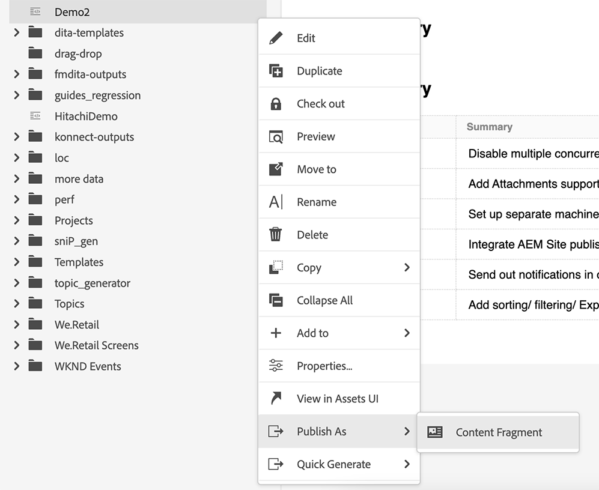

# Neue Funktionen in der Version September 2023 von Adobe Experience Manager Guides as a Cloud Service

Dieser Artikel behandelt die neuen und erweiterten Funktionen in der Version September 2023 von Adobe Experience Manager Guides (später als *AEM Guides as a Cloud Service* bezeichnet).

Weitere Informationen zu den Upgrade-Anweisungen, der Kompatibilitätsmatrix und den in dieser Version behobenen Problemen finden Sie unter [Versionshinweise](release-notes-2023-9-0.md).

## Herstellen einer Verbindung zu einer Datenquelle und Einfügen der Themen

AEM Guides bietet vorkonfigurierte Connectoren, mit denen Sie eine Verbindung zu Ihren Datenquellen herstellen können, wodurch AEM Guides zu einem echten Content-Hub wird. Dies bietet den Vorteil, dass Sie Zeit und Aufwand sparen, der andernfalls für das manuelle Hinzufügen oder die Replikation von Daten aufgewendet würde.

Neben den vorhandenen vorkonfigurierten Connectoren wie JIRA und SQL (MySQL, PostgreSQL, SQL Server, SQLite) kann Ihr Administrator auch Connectoren für MariaDB-, H2DB-, AdobeCommerce- und Elasticsearch-Datenbanken konfigurieren. Sie können auch andere Connectoren hinzufügen, indem sie die Standardschnittstellen erweitern.

Sie können die konfigurierten Connectoren unter dem Bedienfeld **Datenquellen** im Web-Editor anzeigen.

*Anzeigen der verbundenen Datenquellen.*

Sie können jetzt auch ein Thema aus einer verbundenen Datenquelle erstellen. Ein Thema kann Daten in verschiedenen Formaten enthalten, z. B. Tabellen, Listen und Absätze. Außerdem können Sie eine DITA-Karte für alle Themen erstellen. Beim Abrufen aus einer Datenquelle können Sie dem Thema Metadaten zuordnen.

Weitere Informationen finden Sie unter [Verwenden von Daten aus Ihrer Datenquelle](../user-guide/web-editor-content-snippet.md).

## Hinzufügen von Zitaten zu Inhalten

Zitate sind Verweise auf die Quelle von Informationen, die Ihrem Inhalt hinzugefügt werden. Zitate helfen Ihnen dabei, Glaubwürdigkeit aufzubauen und Plagiate zu verhindern. Zitate helfen den Lesern, die Quelle zu finden und die Informationen im Text zu überprüfen.

In AEM Guides können Sie Zitate hinzufügen oder Zitate importieren und sie auf Ihre Inhalte anwenden. Sie können diese Zitate aus jeder Quelle von Büchern, Websites und Zeitschriften hinzufügen.

Nachdem Sie Ihre Zitate in Ihre Themen eingefügt haben, können Sie sie im Web-Editor in der Vorschau anzeigen. Sie können auch Inhalte mit Zitaten veröffentlichen, indem Sie natives PDF verwenden.

{width="300" align="left"}

*Anzeigen der Liste der Zitate im Bereich „Zitate“.*

Weitere Informationen finden Sie unter [Hinzufügen und Verwalten von Zitaten in Ihren Inhalten](../user-guide/web-editor-apply-citations.md).

## Publish zu einem Inhaltsfragment

Inhaltsfragmente sind separate Inhaltselemente in AEM. Es handelt sich um strukturierte Inhalte, die auf einem Inhaltsmodell basieren. Inhaltsfragmente sind reine Inhalte ohne Design- oder Layout-Informationen. Sie können unabhängig von den von AEM unterstützten Kanälen erstellt und verwaltet werden. Die Modularität und Wiederverwendbarkeit der Inhaltsfragmente führt zu mehr Flexibilität, Konsistenz, Effizienz und einfacherem Management.

AEM Guides bietet jetzt die Möglichkeit, ein Thema oder die Elemente innerhalb eines Themas in einem Inhaltsfragment zu veröffentlichen. Sie können eine JSON-basierte Zuordnung zwischen einem Thema und einem Inhaltsfragmentmodell erstellen. Verwenden Sie diese Zuordnung, um Inhalte, die in einigen oder allen Elementen innerhalb eines Themas vorhanden sind, in einem Inhaltsfragment zu veröffentlichen.

Nutzen Sie die Leistungsfähigkeit von AEM Guides und Inhaltsfragmenten und verwenden Sie Inhaltsfragmente auf jeder AEM-Site. Sie können die Details auch über APIs extrahieren, die von Inhaltsfragmenten unterstützt werden.

{width="550" align="left"}

*Publish eines Themas zu einem Inhaltsfragment.*

Weitere Informationen finden Sie unter [Publish in einem Inhaltsfragment](../user-guide//publish-content-fragment.md).

## Verbesserungen bei Überprüfungen

AEM Guides bietet jetzt eine verbesserte Überprüfungsfunktion mit den folgenden Funktionen:

### Prüfungsthemen suchen

Die Durchführung von Überprüfungen ist ein wichtiges Merkmal von AEM Guides. Dies hilft den Reviewern bei der Überprüfung der ihnen zugewiesenen Dokumente .
Jetzt können Sie nach einem Thema suchen, indem Sie einen Teil des Textes des Titels oder Dateipfads in die Suchleiste der Themenansicht des Review-Panels eingeben. Sie können auch alle Themen anzeigen oder Themen mit Kommentaren anzeigen. Standardmäßig können Sie alle in der Prüfungsaufgabe vorhandenen Themen anzeigen. Weitere Informationen finden Sie unter [Themen &#x200B;](../user-guide/review-topics.md).

{width="800" align="left"}

*Suchen eines Prüfungsthemas im Prüfungsbereich.*

## Handbücher zum Erweiterungs-Framework

Erstellen Sie benutzerdefinierte Pakete auf AEM Guides, um die Erweiterbarkeit mithilfe des AEM Guides-Erweiterungs-Frameworks zu gewährleisten. Diese Pakete sind für Entwickler und Berater nützlich und bieten ihnen Erweiterbarkeit für die Komponenten im Editor. Sie können Schaltflächen, Dialogfelder und Dropdown-Listen auswählen und benutzerdefinierte JavaScript hinzufügen, die einfach mit der AEM Guides-Benutzeroberfläche interagieren können.

## Native PDF-Verbesserungen

Die folgenden nativen PDF-Verbesserungen wurden in der Version vom September 2023 vorgenommen, um AEM Guides zu einem robusteren Produkt zu machen:

### Sortieren von Seiten in der PDF-Ausgabe

Sie können die folgenden Abschnitte auf Ihrem PDF ein- oder ausblenden und auch die Reihenfolge festlegen, in der sie in der endgültigen PDF-Ausgabe angezeigt werden sollen:

* IHV
* Kapitel und Themen
* Abbildungsverzeichnis
* Liste der Tabellen
* Index
* Glossar
* Zitierung
* Seiten-Layouts

Wenn Sie einen bestimmten Abschnitt in Ihrer PDF-Ausgabe nicht anzeigen möchten, können Sie dies ausblenden, indem Sie den Umschalter ausschalten.

Weitere Informationen finden Sie unter [Seitenreihenfolge](../native-pdf/components-pdf-template.md#page-order).

### Zusammenführen von Seiten

Bei einer nativen PDF-Ausgabe beginnen standardmäßig alle Abschnitte auf einer neuen Seite. Jetzt können Sie einen Abschnitt mit seiner vorherigen Seite oder der nächsten Seite zusammenführen. Dadurch wird der Abschnitt in Fortsetzung mit der ausgewählten Seite in der PDF-Ausgabe veröffentlicht und es gibt keinen Seitenumbruch zwischen den Seiten.

Weitere Informationen finden Sie in der Beschreibung der Funktion **Seiten zusammenführen** im Abschnitt [Seitenreihenfolge](../native-pdf/components-pdf-template.md#page-order).

### Beliebiges Kapitel von der aktuellen Seite starten

Sie können die grundlegenden Konfigurationseinstellungen für den Start eines Kapitels von einer ungeraden oder geraden Seite aus festlegen, die Inhaltsverzeichnisstruktur festlegen und das Format der Führungslinie für die Inhaltsverzeichniseinträge definieren.

Jetzt können Sie auch ein Kapitel von der aktuellen Seite aus starten. Wenn Sie dies wählen, werden alle Kapitel in Fortsetzung ohne Seitenumbrüche veröffentlicht. Wenn beispielsweise ein Kapitel in der Mitte von Seite 15 endet, beginnt das nächste Kapitel ebenfalls von der 15. Seite selbst.

Weitere Informationen finden Sie in der Beschreibung der **Allgemein**-Registerkarte unter [Erweiterte PDF-Einstellungen](../native-pdf/components-pdf-template.md#advanced-pdf-settings-advanced-pdf-settings).

### Statische Seiten

Sie können auch benutzerdefinierte Seiten-Layouts erstellen und als statische Seiten in der PDF-Ausgabe veröffentlichen. Auf diese Weise können Sie beliebige statische Inhalte wie Anmerkungen oder leere Seiten hinzufügen.

Weitere Informationen finden Sie in der Beschreibung der Funktion **Statische Seiten** im Abschnitt [Seitenreihenfolge](../native-pdf/components-pdf-template.md#page-order).

### Variablen in Querverweisen

Sie können Variablen verwenden, um einen Querverweis zu definieren. Wenn Sie eine Variable verwenden, wird deren Wert aus den Eigenschaften ausgewählt.

Jetzt können Sie auch {figure} und {table} verwenden.
Verwenden {figure}, um einen Querverweis auf die Abbildungsnummer hinzuzufügen. Die Zahl wird aus den Stilen für automatische Zahlen ausgewählt, die Sie für „figcaption“ definiert haben.

Verwenden Sie {table} , um einen Querverweis zur Tabellennummer hinzuzufügen. Die Tabellennummer wird aus den automatischen Nummerierungsstilen ausgewählt, die Sie für Beschriftung definiert haben.

Weitere Informationen finden Sie unter [Querverweise](../native-pdf/components-pdf-template.md##cross-references).

### Neugestaltung des CSS-Editors

Jetzt wurde der CSS-Editor neu gestaltet, um das Benutzererlebnis mit Selektoren und Stileigenschaften zu verbessern.

#### Verbesserung des Dialogfelds „Stil hinzufügen“

Sie können jetzt benutzerdefinierte Selektoren verwenden, um komplexe Stile hinzuzufügen. Mit dem neuen Selektorfeld können Sie neben der Kombination aus Klasse, Tag und Pseudoklasse auch benutzerdefinierte Selektoren hinzufügen. Sie können beispielsweise `table a.link` Stil für alle Hyperlinks in einer Tabelle erstellen.

{width="300" align="left"}

*Fügen Sie die Details für den neuen Stil hinzu.*

#### Stileigenschaften anpassen

Jetzt führt AEM Guides Sie in ein neues Eigenschaftenbedienfeld unter dem Vorschauabschnitt für Stile ein. Sie können die Eigenschaften der Stile effizienter und schneller über das Bedienfeld Eigenschaften bearbeiten.

## Unterstützung mehrerer Betreffdefinitionen in einer einzelnen Auflistungsdefinition

Sie können jetzt eine oder mehrere Betreffdefinitionen in einer Zuordnung und die Auflistungsdefinitionen in einer anderen Zuordnung definieren und dann die Zuordnungsreferenz hinzufügen. Die Verweise auf die Auflistung des Subjekts werden in derselben Zuordnung oder in der referenzierten Zuordnung aufgelöst.

Sie können jetzt auch Bedingungen definieren und sie auf einige bestimmte Elemente in einem Thema anwenden.  Die Bedingungen sind nur für diese spezifischen Elemente sichtbar, nicht für alle anderen Elemente.

Weitere Informationen zum Umgang mit hierarchischen Definitionen von Betreffdefinitionen und Auflistungen finden Sie in der Beschreibung der Funktionen des Betreffschemas im Abschnitt [Linkes Bedienfeld](../user-guide/web-editor-features.md#id2051EA0M0HS).

## Alle Vorgaben in einer Zuordnungssammlung auswählen

Sie können nicht nur eine einzelne Vorgabe und alle Ordnerprofilvorgaben aktivieren, sondern auch alle Vorgaben für eine DITA-Zuordnung in einem Schritt aktivieren.
{width="800" align="left"}\
*Wählen Sie alle Vorgaben in einer Zuordnungssammlung aus.*

Weitere Informationen finden Sie unter [Zuordnungssammlung für die Ausgabegenerierung verwenden](../user-guide/generate-output-use-map-collection-output-generation.md).

## Native PDF-Unterstützung im Publish-Dashboard für Massenspeicher

Mit der Massenaktivierungsfunktion von AEM Guides können Sie Ihre Inhalte schnell und einfach von der Autoren- zur Veröffentlichungsinstanz aktivieren. In die Massenaktivierungszuordnung können die native PDF-Ausgabevorgabe, die AEM-Site-, PDF-, HTML5-, benutzerdefinierte und JSON-Ausgabe einbezogen werden.
Weitere Informationen finden Sie unter [Massenaktivierung veröffentlichter Inhalte](../user-guide/conf-bulk-activation.md).

## Verbessertes Tool für Massenverschiebung

Als Administrator können Sie jetzt das verbesserte Tool zum Verschieben von Massen verwenden, um Ordner mit vielen Dateien von einem Speicherort an einen anderen zu verschieben.
Sie können das Dialogfeld Datei durchsuchen verwenden, um die Quellordner auszuwählen, die verschoben werden sollen. Sie können auch zum Zielspeicherort navigieren, um die Quellordner zu verschieben. Wählen Sie  {width="25" align="left"} neben einem Feld aus, um weitere Informationen dazu anzuzeigen.

Weitere Informationen finden Sie unter [Dateien stapelweise verschieben](../user-guide/authoring-file-management.md#move-files-bulk).

## Verbesserte Vorschau über das Kontextmenü

Verwenden Sie das Kontextmenü, um die Datei (.dita, .xml, Audio, Video oder Bild) schnell in der Vorschau anzuzeigen, ohne sie zu öffnen. Sie können jetzt die Größe des Vorschaubereichs ändern. Wenn der Inhalt einen Verweis-Link enthält, können Sie ihn auswählen, um ihn in einer neuen Registerkarte zu öffnen.

{width="800" align="left"}

*Vorschau der Datei im Fensterbereich anzeigen.*

Weitere Informationen zum Kontextmenü finden Sie in der **Optionen für eine Datei** Funktionsbeschreibung im Abschnitt [Linkes &#x200B;](../user-guide/web-editor-features.md#id2051EA0M0HS)).

## Verwenden von Variablen für aktuelles Datum und aktuelle Uhrzeit in den Optionen Zielpfad, Site-Name oder Dateiname .

Beim Generieren von Ausgaben in AEM Site oder PDF können Sie Variablen verwenden, um die Optionen **Zielpfad**, **Site-Name** oder **Dateiname** festzulegen. Sie können jetzt auch die Variablen `${system_date}` und `${system_time}` verwenden. Mithilfe dieser Variablen können Sie das aktuelle Datum und die aktuelle Uhrzeit an diese Optionen anhängen.

Erfahren Sie, wie [Variablen zum Festlegen der Optionen Zielpfad, Site-Name oder Dateiname verwenden](../user-guide/generate-output-use-variables.md).
