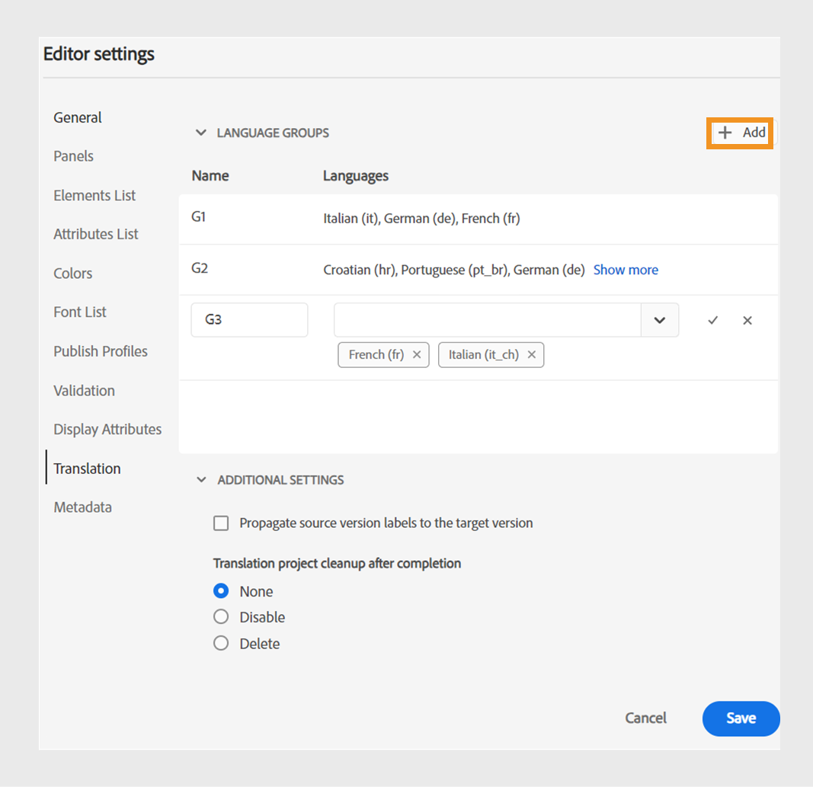

# Neue Funktionen in der Version 2024.4.0

Dieser Artikel behandelt die neuen und erweiterten Funktionen der Version 2024.4.0 von Adobe Experience Manager Guides.

Eine Liste der in dieser Version behobenen Probleme finden Sie im Artikel [Behobene Probleme in Version 2024.4.0](fixed-issues-2024-04-0.md).

Erfahren Sie mehr [Upgrade-Anweisungen für die Version 2024.4.0](upgrade-instructions-2024-04-0.md).

## Möglichkeit, Inhalte mithilfe vorkonfigurierter Sprachgruppen in mehrere Sprachen zu übersetzen

In Experience Manager Guides können Sie jetzt Sprachgruppen erstellen und Ihre Inhalte einfach in mehrere Sprachen übersetzen. Mit dieser Funktion können Sie Übersetzungen entsprechend den Anforderungen Ihres Unternehmens organisieren und verwalten.

Wenn Sie beispielsweise Inhalte für einige Länder in Europa übersetzen müssen, können Sie eine Sprachgruppe für europäische Sprachen wie Englisch (EN), Französisch (FR), Deutsch (DE), Spanisch (ES) und Italienisch (IT) erstellen.

{width="300" align="left"}

*Wählen Sie die Sprachgruppen oder Sprachen aus, die Sie für die Übersetzung Ihrer Dokumente verwenden möchten.*

>[!NOTE]
>
>Wenn der Zielordner einer Sprache fehlt oder die Zielsprache mit der Quelle identisch ist, ist die Sprache ausgegraut und es wird ein Warnsymbol angezeigt.

Als Admin können Sie Sprachgruppen erstellen und diese für mehrere Ordnerprofile konfigurieren. Als Autorin bzw. Autor können Sie die Sprachgruppen anzeigen, die für Ihr Ordnerprofil konfiguriert sind.

Insgesamt verbessert die Erstellung von Sprachgruppen die Effizienz und Produktivität von Übersetzungsprojekten und verbessert damit den Lokalisierungsprozess über mehrere Sprachen hinweg.

Erfahren Sie, wie Sie [Dokumente aus dem Web-Editor übersetzen](../user-guide/translate-documents-web-editor.md).

## Nach der Übersetzung das Übersetzungsprojekt automatisch löschen oder deaktivieren

Jetzt können Sie als Administrator konfigurieren, dass die Übersetzungsprojekte nach Abschluss der Übersetzung automatisch deaktiviert oder gelöscht werden. Mit dieser Funktion können Sie Ressourcen effizient nutzen und Dateien nach Abschluss der Übersetzung verwalten.

Wenn Sie ein Projekt löschen, werden alle im Projekt vorhandenen Dateien und Ordner endgültig entfernt. Durch das Löschen der Übersetzungsprojekte können Sie auch den belegten Speicherplatz freigeben.

Sie können die Übersetzungsprojekte deaktivieren, wenn Sie sie später verwenden möchten.

{width="550" align="left"}

*Konfigurieren von Sprachgruppen und Bereinigungseinstellungen für Übersetzungsprojekte.*

Erfahren Sie mehr darüber, wie [das Übersetzungsprojekt automatisch löschen oder deaktivieren](../user-guide/translate-documents-web-editor.md#automatically-delete-or-disable-a-completed-translation-project).

## Aktivieren der Ausgabe für Ihre Maps in der Massenaktivierungssammlung auf der Vorschauinstanz

Zusätzlich zur Aktivierung der Ausgabe für Ihre Massenaktivierungssammlung in der Veröffentlichungsinstanz bietet Experience Manager-Handbücher als Cloud Service jetzt die Funktion, sie in der **-Instanz** aktivieren.

Mit dieser Funktion können Sie Ihre Inhalte in einer Vorschauinstanz aktivieren, damit Sie überprüfen können, wie sie aussehen und funktionieren, bevor Sie sie für die **Publish**-Instanz aktivieren.

{width="800" align="left"}

*Informationen zu den aktivierten Zuordnungsausgaben finden Sie auf der Registerkarte **Prüfverlauf**.*

Weitere Informationen über [Massenaktivierung](../user-guide/conf-bulk-activation-publish-map-collection.md).

## Verbesserungen bei den Datenquellen-Connectoren

Die folgenden Verbesserungen wurden an den Datenquellen-Connectoren für Version 2024.4.0 vorgenommen:

### Verbinden mit den Datenquellen von Salsify, Akeneo und Microsoft Azure DevOps Boards (ADO)

Zusätzlich zu den vorhandenen vordefinierten Connectoren bieten Experience Manager Guides auch Connectoren für Datenquellen von Salsify, Akeneo und Microsoft Azure DevOps Boards (ADO) an. Als Admin können Sie diese Connectoren herunterladen und installieren. Konfigurieren Sie anschließend die installierten Connectoren.

### Kopieren Sie die Beispielabfrage und fügen Sie sie ein, um ein Inhaltsfragment oder Thema zu erstellen

Sie können einfach eine Beispieldatenabfrage kopieren und in den Generator einfügen, um einen Inhaltsausschnitt oder ein Thema zu erstellen. Mit dieser Funktion müssen Sie sich nicht an die Syntax erinnern oder eine Abfrage manuell erstellen. Anstatt die Abfrage manuell einzugeben, können Sie eine Beispielabfrage kopieren und einfügen, sie bearbeiten und sie zum Abrufen der Daten nach Ihren Anforderungen verwenden.

{width="800" align="left"}

*Kopieren und bearbeiten Sie eine Beispielabfrage, um den Inhaltsausschnitt zu erstellen.*

### Verbinden mit JSON-Datendateien über einen Datei-Connector

Als Admin können Sie jetzt einen JSON-Datei-Connector konfigurieren, um JSON-Datendateien als Datenquelle zu verwenden. Verwenden Sie den Connector, um die JSON-Dateien von Ihrem Computer oder aus den Adobe Experience Manager-Assets zu importieren. Als Autorin bzw. Autor können Sie dann mithilfe der Generatoren Inhaltsausschnitte oder Themen erstellen.

Mit dieser Funktion können Sie die in Ihren JSON-Dateien gespeicherten Daten verwenden und sie über verschiedene Ausschnitte hinweg wiederverwenden. Der Inhalt wird auch dynamisch aktualisiert, sobald Sie die JSON-Dateien aktualisieren.

### Konfigurieren mehrerer Ressourcen-URLs für einen Connector, um Inhaltsausschnitte oder Themen zu erstellen

Als Administrator können Sie mehrere Ressourcen-URLs für einige Connectoren wie Generic REST Client, Salsify, Akeneo und Microsoft Azure DevOps Boards (ADO) konfigurieren.

Stellen Sie dann als Autorin bzw. Autor eine Verbindung mit den Datenquellen her, um mithilfe der Generatoren Inhaltsausschnitte oder Themen zu erstellen. Diese Funktion ist praktisch, da Sie nicht für jede URL eine Datenquelle erstellen müssen. So können Sie schnell Daten aus einer der Ressourcen für eine bestimmte Datenquelle in einem einzelnen Inhaltsfragment oder Thema abrufen.

Erfahren Sie mehr über die Datenquellen-Connectoren und wie Sie [einen Datenquellen-Connector über die Benutzeroberfläche konfigurieren](../cs-install-guide/conf-data-source-connector-tools.md).

Erfahren Sie, wie Sie [Daten aus Ihrer Datenquelle verwenden](../user-guide/web-editor-content-snippet.md).

## Anpassen des Web-Editor-Erlebnisses mit einer neuen Benutzeroberfläche mit Benutzereinstellungen

Das **Benutzereinstellungen** im Web-Editor enthält jetzt eine neue Registerkarte **Erscheinungsbild**. Auf dieser neuen Registerkarte können Sie die gängigsten Look-and-Feel-Voreinstellungen in der Benutzeroberfläche des Web-Editors konfigurieren.

Sie können so konfigurieren, dass die Dateien nach Titel oder Dateinamen angezeigt werden, und das Design des Programms und die Quellansicht ändern. Außerdem können Sie die Einstellungen konfigurieren, um eine geöffnete Datei in der Repository-Ansicht zu finden und die Leerzeichen ohne Unterbrechung zu verarbeiten.

{width="550" align="left"}

*Passen Sie das Erscheinungsbild Ihren Vorlieben entsprechend an.*

Weitere Informationen zur Beschreibung der Funktion **Benutzereinstellungen** finden Sie im Abschnitt [Linkes Bedienfeld](../user-guide/web-editor-features.md#id2051EA0M0HS).

## Suchen Sie eine geöffnete Datei in der Repository-Ansicht des Web-Editors

Wählen Sie die Option **Dateien immer im Repository finden** unter **Benutzereinstellungen** aus, um schnell in der Repository-Ansicht zu navigieren und nach Ihrer Datei zu suchen. Sie müssen nicht manuell danach suchen.

Während der Bearbeitung hilft Ihnen diese Funktion auch dabei, den Speicherort der Datei in der Repository-Hierarchie einfach anzuzeigen.

Weitere Informationen finden Sie unter [Suchen einer geöffneten Datei in der Repository-Ansicht](../user-guide/web-editor-edit-topics.md#locate-an-open-file-in-the-repository-view).

## Verbesserte Handhabung von Leerzeichen ohne Unterbrechung im Web-Editor

Experience Manager Guides ermöglicht es Ihnen, beim Bearbeiten von Dokumenten im Web-Editor eine Leertaste ohne Unterbrechung anzuzeigen. Außerdem wird die Handhabung von Leerzeichen ohne Unterbrechung verbessert.
Dabei werden mehrere aufeinander folgende Leerzeichen in ein einziges Leerzeichen umgewandelt, um die WYSIWYG-Ansicht des Dokuments im Web-Editor beizubehalten. Diese Funktion trägt auch dazu bei, das allgemeine Erscheinungsbild und die Professionalität des Dokuments zu verbessern.

Weitere Informationen finden Sie unter [Weitere Funktionen des Web-Editors](../user-guide/web-editor-other-features.md).

## Deaktivieren der Nachbearbeitung für ausgewählte Ordner in Adobe Experience Manager Assets

Als Administrator können Sie jetzt die Nachbearbeitung und Erstellung von UUIDs für ausgewählte Ordner in Experience Manager Assets deaktivieren. Diese Konfiguration kann hilfreich sein, insbesondere bei vielen Assets oder komplexen Ordnerstrukturen. Außerdem können mehrere Benutzende die Assets schnell und gleichzeitig hochladen, ohne einander zu beeinträchtigen.  

Die Deaktivierung der Nachbearbeitung für einen Ordner wirkt sich auch auf alle untergeordneten Ordner aus. Experience Manager Guides bietet jetzt jedoch die Möglichkeit, die Nachbearbeitung für einzelne untergeordnete Ordner innerhalb des ignorierten Ordners selektiv zu aktivieren.

Erfahren Sie, wie [ Nachbearbeitung für einen Ordner deaktivieren ](../cs-install-guide/conf-folder-post-processing.md).

## Neues Erlebnis bei der Suche und Filterung von Dateien in der Repository-Ansicht

Das Filtern von Dateien wurde verbessert. Die überarbeitete Funktion zum Filtern von Dateien bietet eine verbesserte Möglichkeit, Dateien mühelos zu suchen und durch Dateien zu navigieren.

{width="300" align="left"}

*Suchen nach Dateien, die den Text`general purpose.`* enthalten

Profitieren Sie von Vorteilen wie einem schnelleren Zugriff auf relevante Dateien und einer intuitiveren Benutzeroberfläche für ein reibungsloseres und effizienteres Sucherlebnis.

 {width="300" align="left"}

*Verwenden Sie die Filter für die schnelle Suche, um nach DITA- und Nicht-DITA-Dateien zu suchen.*

Weitere Informationen zur Funktion **Suche filtern** im Abschnitt [Linkes Bedienfeld](../user-guide/web-editor-features.md#id2051EA0M0HS).

## Getrennte Liste zum Anzeigen und Einfügen gültiger Elemente entsprechend ihrer Position

Beim Bearbeiten eines Dokuments im Web-Editor können Sie jetzt eine getrennte Liste von Elementen anzeigen, die am aktuellen Speicherort und außerhalb des aktuellen Speicherorts gültig sind. Je nach Ihren Anforderungen wählen Sie ein Element aus den folgenden Optionen aus:

* **Gültige Elemente an der aktuellen Position** die Sie an der aktuellen Cursorposition selbst einfügen können.
* **Gültige Elemente außerhalb des aktuellen Speicherorts** die Sie für das aktuelle Element innerhalb der Elementhierarchie nach einem der übergeordneten Elemente einfügen können.

{width="300" align="left"}

*Sehen Sie sich die getrennten Listen mit gültigen Elementen an, um ein Element am aktuellen Speicherort einzufügen.*

Diese geteilte Liste gültiger Elemente hilft Ihnen, die Inhaltsstruktur beizubehalten und die DITA-Standards zu befolgen.

Weitere Informationen zur Funktion **Element einfügen** finden Sie im Abschnitt [Sekundäre ](../user-guide/web-editor-features.md#2051ea0j0y4).

## Der Inhaltstyp wird als Dropdown-Menü angezeigt

Jetzt werden die Inhaltseigenschaften **Typ** als Dropdown-Menü angezeigt. Sie können die Tags der vollständigen Hierarchie für das aktuelle Tag aus der Dropdown-Liste anzeigen und auswählen.

Dieses Dropdown-Menü hilft Ihnen, schnell auf die relevanten Tags innerhalb der hierarchischen Struktur zuzugreifen.

{width="300" align="left"}

*Wählen Sie ein Tag aus der Hierarchie für das aktuelle Tag aus.*

Weitere Informationen zur Funktion **Inhaltseigenschaften** finden Sie im Abschnitt [Rechtes Bedienfeld](../user-guide/web-editor-features.md#id2051eb003yk) .

## Verbesserte Leistung bei der Massenüberprüfung von Dateien im Zuordnungs-Editor

Experience Manager Guides verbessert die Leistung und das Erlebnis der Funktion zum Einchecken von Massendateien im Zuordnungs-Editor. Durch diese Verbesserung können Sie Dateien schneller in Massen einchecken.
Sie können den Fortschritt des Eincheckvorgangs für die Dateien auch im Dialogfeld **Als neue Version speichern und entsperren** anzeigen. Schließlich wird die Erfolgsmeldung angezeigt, nachdem der Vorgang abgeschlossen ist und alle ausgewählten ausgecheckten Dateien eingecheckt wurden.

{width="300" align="left"}

*Liste und Status der Dateien anzeigen, die im Zuordnungs-Editor stapelweise überprüft wurden.*

Erfahren Sie, wie [mit dem erweiterten Zuordnungs-Editor arbeiten](../user-guide/map-editor-advanced-map-editor.md)

## Herunterladen der temporären Datei beim Generieren der Ausgabe über DITA-OT

Sie können auch die temporären Dateien herunterladen, die beim Veröffentlichen der AEM-Site-, HTML-, benutzerdefinierten, JSON- oder PDF-Ausgabe über DITA-OT generiert werden. Mit dieser Funktion können Sie alle Probleme analysieren, die während des Ausgabenerstellungsprozesses auftreten können, und Fehler effektiv beheben.  
Sie können auch die Datei „metadata.xml“ herunterladen, wenn Sie Metadateneigenschaften ausgewählt haben, die an die mit DITA-OT generierte Ausgabe übergeben wurden. 

Weitere Informationen zu den Vorgaben finden Sie unter [Grundlegendes zu den Ausgabevorgaben](../user-guide/generate-output-understand-presets.md).

## IMS-JWT-Anmeldeinformationen durch IMS-OAuth-Anmeldeinformationen für Microservice-basierte Veröffentlichung ersetzen

Die Anmeldeinformationen für das Service-Konto (JWT) werden zugunsten der OAuth **Server-zu-Server)-Anmeldeinformationen**. Ihre Anwendungen, die die Anmeldeinformationen für das Service-Konto (JWT) verwenden, funktionieren ab dem 1. Januar 2025 nicht mehr. Sie müssen bis zum 1. Januar 2025 auf die neuen Anmeldedaten migrieren, um sicherzustellen, dass Ihre Anwendung weiterhin funktioniert.

Der Cloud-Publishing-Service für Experience Manager Guides ist jetzt durch die Adobe IMS-OAuth-basierte Authentifizierung gesichert. Erfahren Sie, wie [Microservice-basierte Veröffentlichung mit OAuth-Authentifizierung konfigurieren](../knowledge-base/publishing/configure-microservices-imt-config.md).
