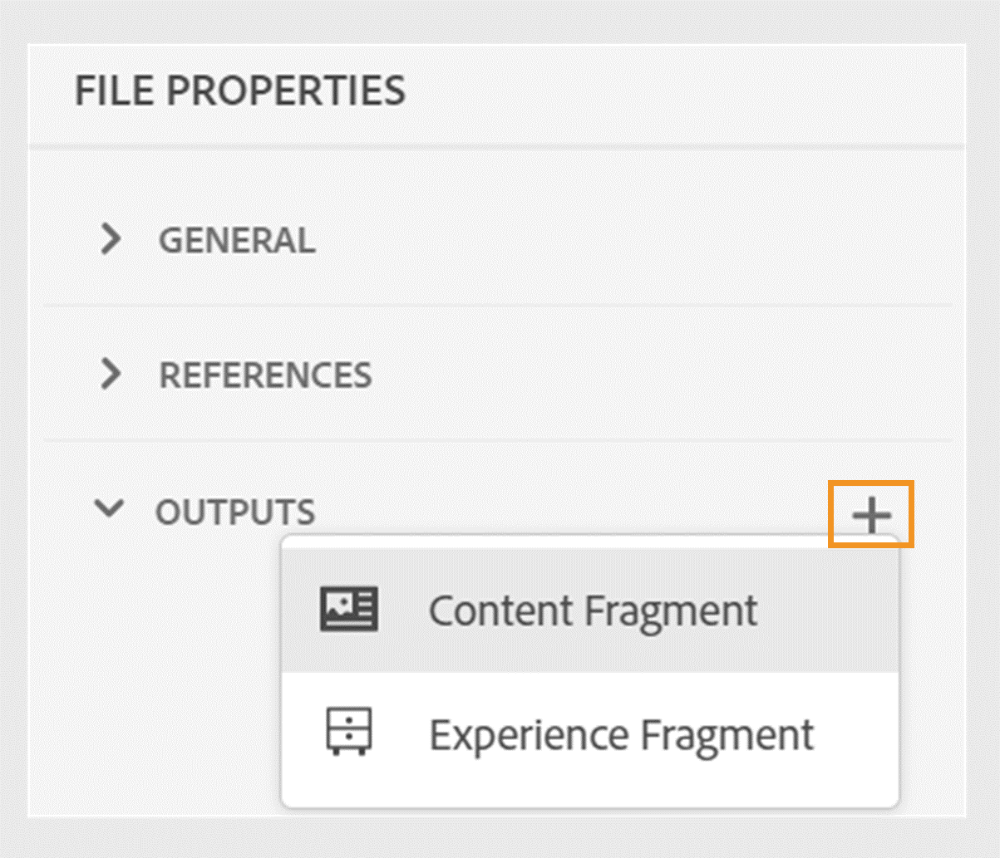

# Neue Funktionen in der Version 2024.06.0

Dieser Artikel behandelt die neuen und erweiterten Funktionen der Version 2024.06.0 von Adobe Experience Manager Guides.

Eine Liste der in dieser Version behobenen Probleme finden Sie im Artikel [Behobene Probleme in Version 2024.06.0](fixed-issues-2024-06-0.md).

Erfahren Sie mehr [Upgrade-Anweisungen für die Version 2024.06.0](upgrade-instructions-2024-06-0.md).

## Publish eines Themas oder seiner Elemente in ein Experience Fragment

Ein Experience Fragment ist eine modulare Inhaltseinheit in Adobe Experience Manager, die Inhalte und Layout integriert. Experience Fragments sind entscheidend für die Erstellung konsistenter und ansprechender Erlebnisse, die über mehrere Kanäle hinweg weiter verwendet werden können.

Mit Experience Manager Guides können Sie jetzt ein Thema oder seine Elemente in einem Experience Fragment veröffentlichen. Sie können eine JSON-basierte Zuordnung zwischen einem Thema und seinen Elementen in einem Experience Fragment erstellen. Sie können beispielsweise Experience Fragments für Kopf- oder Fußzeilen mit Branding-Elementen, Werbebannern, Kundenreferenzen und Ereignispromotions erstellen.

Weitere Informationen finden Sie unter [Publish Experience Fragments](../user-guide/publish-experience-fragment.md).

## Verbesserungen bei der Veröffentlichung von Inhaltsfragmenten

Experience Manager Guides bietet auch einige hilfreiche Verbesserungen bei Inhaltsfragmenten:

- Sie können Inhalte bei der Veröffentlichung in einem Inhaltsfragment einfach mit Bedingungen filtern, indem Sie eine DITAVAL-Datei oder bedingte Attribute verwenden.
- Sie können die Inhaltsfragmente eines Themas auch im Abschnitt **Ausgaben** der Seite **Dateieigenschaften** veröffentlichen und anzeigen.

{width="300" align="left"}

Weitere Informationen finden Sie unter [Publish-Inhaltsfragmente](../user-guide/publish-content-fragment.md).

## Übergeben von Metadaten aus Themendateieigenschaften an die native PDF-Ausgabe

Jetzt können Sie mit Experience Manager Guides die Metadaten aus den Dateieigenschaften eines Themas zu den Seiten-Layouts hinzufügen, während Sie die native PDF-Ausgabe generieren. Verwenden Sie diese Funktion, um themenspezifische Metadaten wie Titel, Tags und Beschreibung zu den Seiten-Layouts hinzuzufügen. Sie können Ihre veröffentlichte PDF auch auf der Grundlage der Metadaten des Themas anpassen, z. B. indem Sie dem Hintergrund des Themas ein Wasserzeichen auf Grundlage des Dokumentstatus des Themas hinzufügen.

 {width="300" align="left"}

*Fügen Sie den Feldern in Ihren Seiten-Layouts Metadaten hinzu.*

Erfahren Sie, wie Sie [Felder und Metadaten](../native-pdf/design-page-layout.md#add-fields-metadata) in einem Seitenlayout hinzufügen.

## Auswahl partieller Inhalte aus allen Elementen für Vorgänge

Experience Manager Guides verbessert das Benutzererlebnis bei der Auswahl der Inhalte über die Elemente hinweg im Web-Editor. Sie können mühelos Inhalte über verschiedene Elemente hinweg auswählen und Vorgänge wie fett, kursiv und unterstrichen ausführen. Mit dieser Funktion können Sie die Formatierung für teilweise ausgewählte Inhalte nahtlos anwenden oder entfernen. Sie können auch schnell die Inhalte löschen, die Sie über Elemente hinweg ausgewählt haben. Sobald der Inhalt gelöscht wurde, wird der verbleibende Inhalt ggf. automatisch unter einem einzigen gültigen Element zusammengeführt.

Sie können auch teilweise Inhalte über Elemente hinweg auswählen und dann den Inhalt unter einem gültigen DITA-Element umgeben.
 {width="300" align="left"}

*Umschließen des ausgewählten Inhalts mit einem gültigen Element.*

Insgesamt bieten diese Verbesserungen ein besseres Erlebnis und helfen Ihnen, Ihre Effizienz bei der Bearbeitung Ihrer Dokumente zu verbessern.

Weitere Informationen finden Sie unter [Teilweise Auswahl von Inhalten über Elemente hinweg](../user-guide/web-editor-edit-topics.md#partial-selection-of-content-across-elements).

## Unterstützung für Markdown-Dokumente in der nativen PDF-Veröffentlichung

Experience Manager Guides unterstützt auch Markdown-Dokumente in der nativen PDF-Veröffentlichung. Diese Funktion ist praktisch und hilft Ihnen beim Generieren von PDF für die Markdown-Dateien in Ihrer DITA-Zuordnung. Die Markdown-Unterstützung bei der nativen PDF-Veröffentlichung hilft Ihnen beim einfachen Erstellen, Verwalten und Freigeben Ihrer Dokumente.

Weitere Informationen finden Sie unter [Unterstützung für Markdown-Dokumente](../web-editor/native-pdf-web-editor.md#support-for-markdown-documents).

## Verbesserte Leistung und Skalierbarkeit für große Übersetzungsprojekte

Die Übersetzungsfunktion ist schneller und skalierbarer denn je. Sie verfügt über eine neue Architektur, die eine verbesserte Leistung bietet. Die Projekterstellung ist nun schneller als früher und die Konflikte während des Prozesses sind nahezu nicht mehr vorhanden. Diese verbesserte Leistung hilft Ihnen bei schnelleren Übersetzungen und gewährleistet so einen reibungslosen Betrieb auch bei großen Übersetzungsprojekten.

Diese Verbesserung ist sehr vorteilhaft, da sie die Produktivität und die Gesamterfahrung verbessert.

Erfahren Sie mehr über das [Übersetzen von Dokumenten über den Web-Editor](../user-guide/translate-documents-web-editor.md).
