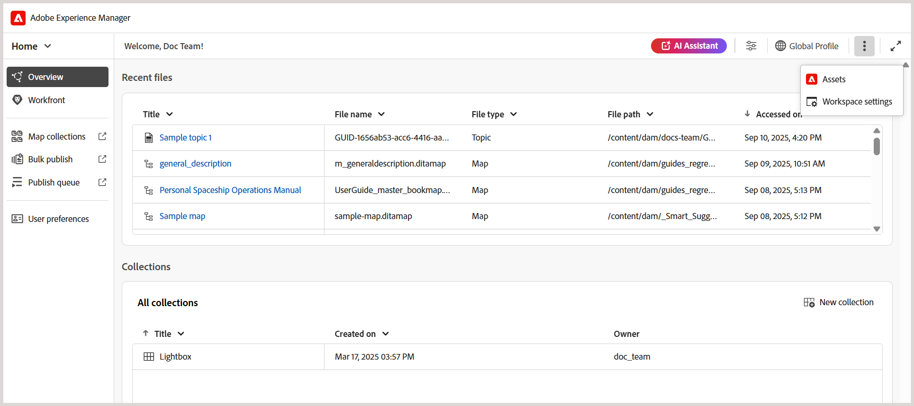

# Neue Funktionen in der Version 2025.10.0 (Oktober 2025)

Dieser Artikel behandelt die neuen und erweiterten Funktionen, die mit der Version 2025.10.0 von Adobe Experience Manager Guides as a Cloud Service eingeführt wurden.

Eine Liste der in dieser Version behobenen Probleme finden Sie im Artikel [Behobene Probleme in Version 2025.10.0](fixed-issues-2025-10-0.md).

Erfahren Sie mehr [Upgrade-Anweisungen für die Version 2025.10.0](../release-info/upgrade-instructions-2025-10-0.md).

## Die Editor-Einstellungen wurden in Workspace-Einstellungen umbenannt und können von der Startseite aus aufgerufen werden

Um die Navigation und die Benutzerfreundlichkeit zu verbessern, wurden die folgenden Verbesserungen eingeführt:

- **Editor-Einstellungen** in Experience Manager Guides wurde in **Workspace-Einstellungen“**.
- Das Menü **Mehr Aktionen** (das Dreipunkt-Menü), das zuvor nur in der Benutzeroberfläche der Editor- und Zuordnungskonsole verfügbar war, ist jetzt über die [Homepage](../user-guide/intro-home-page.md) zugänglich.

  

## Einfaches Identifizieren und Korrigieren doppelter IDs in Themen und Zuordnungen in der Autorenansicht

Experience Manager Guides enthält jetzt die Schaltfläche **Duplizierte IDs** im Editor, mit der Sie doppelte IDs, die in einem einzelnen Thema oder einer Zuordnung vorhanden sind, schnell identifizieren und beheben können. Wenn doppelte IDs erkannt werden, wird diese Schaltfläche in der Ansicht **Autor“ in der linken unteren Ecke** Editor-Benutzeroberfläche angezeigt. Nach Auswahl der Schaltfläche wird eine Liste aller Instanzen mit doppelten IDs in einem Pop-up angezeigt. Wenn Sie eine Instanz auswählen, wird der entsprechende Inhalt im Thema oder in der Karte hervorgehoben, sodass Sie die doppelten IDs im rechten Bedienfeld finden und korrigieren können.

Weitere Informationen finden Sie unter [Zusätzliche Funktionen im Editor](../user-guide/web-editor-other-features.md).

{width="350" align="left"}

## Verbesserungen der Repository- und Berichtsfilter

Der Filter **Gesperrt von** unter den erweiterten Filtern im Repository und **Autor**-Filter in den DITA-Zuordnungsberichten laden Benutzerlisten nun schrittweise beim Scrollen, anstatt alle auf einmal. Diese paginierte Ladung verbessert die Geschwindigkeit und macht das Arbeiten mit großen Benutzerdatensätzen effizienter und nahtloser.

## Zugriff auf den Status von Prüfungsaufgaben direkt über das Prüfungsfeld

Als Initiator einer Prüfungsaufgabe können Sie jetzt den Status Ihrer Prüfungsaufgabe direkt im Bedienfeld Überprüfen überprüfen. Mit den neuesten Verbesserungen enthält das Dialogfeld **Aufgabe aktualisieren** im Prüfungsbereich eine neue Option **Prüfungsstatus**. Wenn Sie diese Option auswählen, gelangen Sie direkt zum Überprüfungs-Dashboard, wo Sie den Aufgabenstatus aller Reviewer einsehen können. So können Sie schneller auf den Aufgabenfortschritt zugreifen, ohne den Kontext wechseln zu müssen.

Weitere Informationen finden Sie unter [Anfordern einer erneuten Überprüfung oder Schließen einer Prüfungsaufgabe als Autor](../user-guide/review-close-review-task.md).

{width="350" align="left"}

## API zum Tracking des Nachbearbeitungsstatus für Ordner oder Assets

Eine neue API ist jetzt verfügbar, um den Nachbearbeitungsstatus einzelner Assets und Ordner zu verfolgen. Dies ist besonders nützlich für Teams, die automatisierte Workflows verwenden, bei denen die Veröffentlichung erst erfolgen muss, nachdem die Inhalte vollständig verarbeitet wurden. Die -API bietet eine zuverlässige Möglichkeit, die Bereitschaft zu bestätigen, wodurch das Risiko von Veröffentlichungsfehlern, die durch eine unvollständige Verarbeitung verursacht werden, reduziert wird.

Weitere Informationen finden Sie unter [API zum Nachverfolgen des Nachbearbeitungsstatus für Ordner oder Assets](../api-reference/track-post-processing-status.md).

