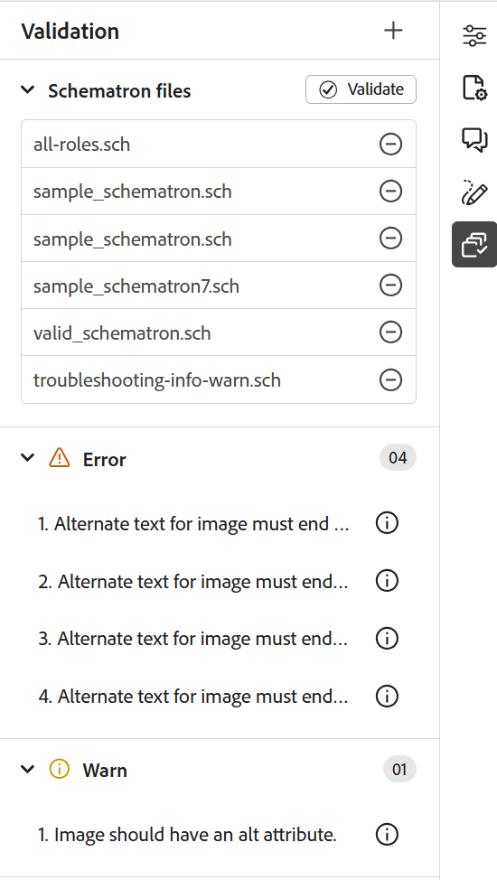

# Neue Funktionen in der Version 2026.03.0 (März 2026)

Dieser Artikel behandelt die neuen und erweiterten Funktionen, die mit der Version 2026.03.0 von Adobe Experience Manager Guides as a Cloud Service eingeführt wurden.

Eine Liste der in dieser Version behobenen Probleme finden Sie im Artikel [Behobene Probleme in Version 2026.03.0](fixed-issues-2026-03-0.md).

Erfahren Sie mehr [Upgrade-Anweisungen für die Version 2026.03.0](../release-info/upgrade-instructions-2026-03-0.md).

## Einführung in Schulungs- und Lerninhalte für Produkte in Experience Manager Guides

Die Inhaltsfunktion **Produktschulung und -**) in Experience Manager Guides ermöglicht es Schulungsteams und Lehrplanern, interaktive eLearning-Kurse direkt über die Experience Manager Guides-Benutzeroberfläche zu erstellen.

Mit vorlagenbasiertem Authoring, interaktiven Kurskomponenten und Unterstützung für Bewertungen können Teams hochwertige Schulungsinhalte entwickeln, die auf ihre Unternehmensziele abgestimmt sind.

>[!NOTE]
> 
> Die Funktion für Produktschulungen und Lerninhalte bleibt standardmäßig für alle Instanzen von Experience Manager Guides as a Cloud Service deaktiviert. Administratoren können diese Funktion auf Ordnerprofilebene unter **Workspace-Einstellungen** > **Allgemein** aktivieren.

Die wichtigsten Funktionen sind wie folgt:

- Zentralisiertes Content Management
- Vorlagengesteuerte Bearbeitung
- Unterstützung für die Wiederverwendung von Inhalten
- Erstellung und Verwaltung von Bewertungen
- Web-basierte Überprüfungs-Workflows
- Branchenführendes Übersetzungsmanagement
- Multi-Channel-Publishing mit nativen SCORM- und PDF-Ausgabeformaten

Weitere Informationen finden Sie unter [Erste Schritte](../learning-content/course-overview.md) und [Konfigurationshandbuch](../lc-config-guide/introduction.md).

## Verbesserungen am Editor

Im Rahmen dieser Version wurden die folgenden Editor-Verbesserungen vorgenommen:

### Verbesserungen des Bedienfelds „Schematron-Validierung“

Die folgenden Verbesserungen der Schematron-Benutzeroberfläche wurden vorgenommen, um Klarheit, Benutzerfreundlichkeit und Validierungsergebnisse zu verbessern:

- Im Validierungsfenster wird eine Meldung mit leerem Status angezeigt, wenn keine Schematron-Datei hinzugefügt wird, was für eine bessere Klarheit und Richtung bei den nächsten Schritten sorgt.

  {width="350" align="left"}
- Wenn mehrere Schematron-Dateien hinzugefügt werden, werden sie unter einem konsolidierten Akkordeon organisiert, was eine bessere Sichtbarkeit der konfigurierten Schematron-Dateien bietet.

  {width="350" align="left"}
- Basierend auf dem in der Schematron-Datei definierten Rollenattribut werden die Validierungsergebnisse jetzt wie folgt kategorisiert: `Fatal`, `Error`, `Warn` oder `Info`. Jede Kategorie enthält eine sichtbare Anzahl sowie eine kontextuelle QuickInfo für eine klarere Interpretation.

  {width="350" align="left"}

Weitere Informationen zur Verwendung von Schematrondateien in Experience Manager Guides finden Sie unter [Unterstützung für Schematrondateien](../user-guide/support-schematron-file.md).

### Sprachkopien für Übersetzungen sind jetzt im rechten Bedienfeld der Editor-Benutzeroberfläche verfügbar

Im rechten Bereich unter **Dateieigenschaften** *ist jetzt ein neuer Abschnitt*&#x200B;Übersetzungen“ verfügbar. Dieser Abschnitt bietet direkten Zugriff auf alle verfügbaren Sprachkopien für das aktuell geöffnete Asset (Karte, Thema, Bild usw.). Sie müssen nicht mehr zur Assets-Benutzeroberfläche navigieren, um diese Sprachkopien anzuzeigen oder darauf zuzugreifen.

{width="350" align="left"}

Für jede Sprachkopie können Sie den Mauszeiger über die Datei bewegen, um deren Pfad im Repository zu suchen, oder sie einfach auswählen, um sie im Editor zu öffnen. Neben dem Öffnen von Dateien können Sie auch viele Aktionen über das Menü **Optionen** ausführen. Zu den Aktionen, die Sie ausführen können, gehören Bearbeiten, Vorschau, UUID kopieren, Pfad kopieren, Zu Sammlungen hinzufügen und Eigenschaften.

Weitere Informationen finden Sie unter [Rechtes Bedienfeld im Editor](../user-guide/web-editor-right-panel.md#file-properties).

### Zitate in allen Journalfeldern suchen

Sie können jetzt Zitate in allen Journalfeldern wie *Titel*, *Journaltitel*, *Autor*, *Jahr*, *Volumen*, *Anzahl* und *Seiten* mithilfe der Option **Beliebiges Feld** im Dialogfeld **Zitat hinzufügen** durchsuchen. Die Suche gibt das Zitat zurück, das dem eingegebenen Text am nächsten kommt.

Weitere Informationen zum Hinzufügen von Zitaten in Experience Manager Guides finden Sie unter [Hinzufügen und Verwalten von Zitaten in ](../user-guide/web-editor-apply-citations.md).

{width="350" align="left"}

## Verbesserungen bei Überprüfungen

Die folgenden Verbesserungen sind für die Überprüfungsfunktion in dieser Version verfügbar:

- Das Zuweisen eines Reviewers zu einer Prüfungsaufgabe hängt jetzt von einer aktiven Projektauswahl ab. Das Feld **Zuweisen zu** auf der Seite *Prüfungsaufgabe erstellen* bleibt deaktiviert, bis ein aktives Projekt ausgewählt wird. Nachdem ein Projekt ausgewählt wurde, wird das **Zuweisen an** aktiviert und listet nur die mit diesem Projekt verknüpften Benutzer und Benutzergruppen auf. Dadurch wird sichergestellt, dass Prüfungsaufgaben nur gültigen Projektmitgliedern zugewiesen werden, und eine unbeabsichtigte Auswahl von Prüfern verhindert.

  

- Das Feld **Zuweisen an** unterstützt jetzt die Suche mit automatischer Textvervollständigung, sodass Sie Benutzer oder Benutzergruppen schnell durch Eingabe von Text finden können.

Zusammen machen diese Verbesserungen die Auswahl der Prüfer präziser, effizienter und besser auf die projektspezifischen Prüfungs-Workflows abgestimmt.

Weitere Informationen finden Sie unter [Themen zur Überprüfung senden](../user-guide/review-send-topics-for-review.md).

## Verbesserungen beim Asset-Management

Diese Version führt die folgenden Verbesserungen beim Asset-Management ein:

### Verwenden Sie die Dateihierarchie reduzieren , um Zuordnungen mit ursprünglichen Dateinamen und zugehörigen Metadaten herunterzuladen.

Jetzt können Sie die Option Dateihierarchie reduzieren verwenden, um eine Zuordnung mit dem ursprünglichen Dateinamen herunterzuladen. Darüber hinaus enthält das heruntergeladene Paket eine `metadata.json`-Datei, sodass die zugehörigen Metadaten außerhalb von Experience Manager Guides einfach zugänglich und wiederverwendbar sind.

Weitere Informationen zum Herunterladen von Dateien in Experience Manager Guides finden Sie unter [Dateien herunterladen](../user-guide/authoring-download-assets.md).

### Verwenden von Regex zum Aktivieren oder Deaktivieren der Nachbearbeitung

Sie können jetzt Regex verwenden, um die Nachbearbeitung für Ordner zu aktivieren oder zu deaktivieren. Diese Verbesserung ermöglicht es Admins, Nachbearbeitungsregeln zu definieren, die für mehrere Ordner oder ganze Ordnerhierarchien mit einer einzigen Konfiguration gelten, anstatt einzelne Ordnerpfade anzugeben.

Weitere Informationen finden Sie unter [Verwenden von Regex zum Aktivieren oder Deaktivieren der Nachbearbeitung](../cs-install-guide/conf-folder-post-processing.md#use-regex-to-enable-or-disable-post-processing).

