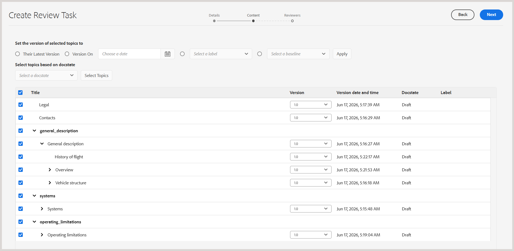
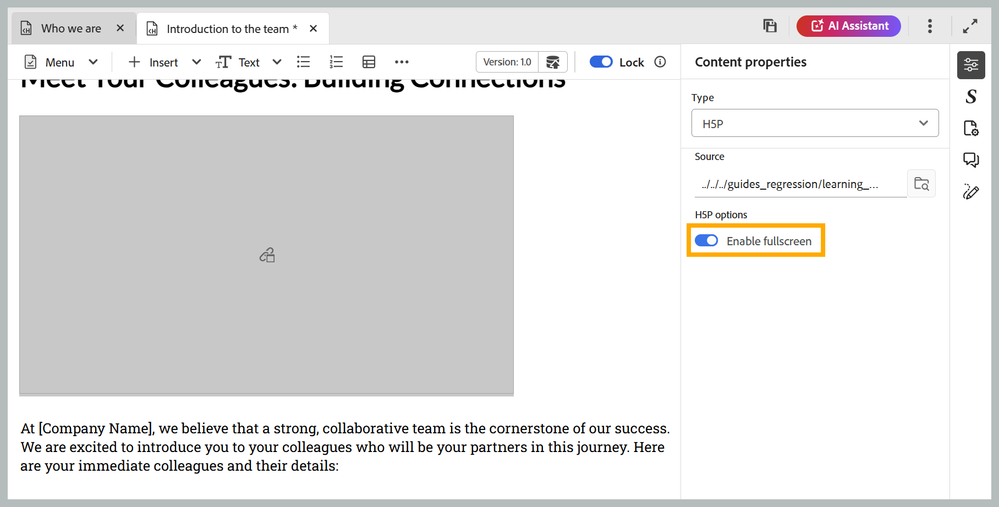

# Neue Funktionen in der Version 2026.09.0 (September 2026)

Dieser Artikel behandelt die neuen und erweiterten Funktionen, die mit der Version 2026.09.0 von Adobe Experience Manager Guides as a Cloud Service eingeführt wurden.

Eine Liste der in dieser Version behobenen Probleme finden Sie unter [Behobene Probleme in Version 2026.09.0](fixed-issues-2026-09-0.md).

Erfahren Sie mehr [Upgrade-Anweisungen für die Version 2026.09.0](../release-info/upgrade-instructions-2026-09-0.md).

## Einführung der KI-gestützten Smart-Tagging-Funktion im KI-Assistenten

Jetzt können Sie den KI-Assistenten verwenden, um Ihrem Inhalt Tags vorzuschlagen und hinzuzufügen. Mit der neuen Smart-Tagging-Funktion können Autorinnen und Autoren den KI-Assistenten bitten, Tags für ein oder mehrere Themen vorzuschlagen, die auf der Smart-Tagging-Fähigkeit von Adobe CX Enterprise Coworker basieren. Die Qualifikation prüft den Inhalt, generiert Tag-Empfehlungen und stellt sie für Ihre Überprüfung bereit. Sobald Sie dies bestätigen, werden die vorgeschlagenen Tags auf die relevanten Themen innerhalb einer Karte angewendet.

Weitere Informationen finden Sie unter [Verwenden des KI-Assistenten im Agentenmodus](../user-guide/ai-assistant-agentic.md).

Derzeit ist die Smart-Tagging-Funktion verfügbar, wenn der KI-Assistent im Modus **Agent** konfiguriert ist. Administratoren können den Modus **Agent** oder **Standard** in den **Workspace-Einstellungen** einer Instanz aktivieren.

- **Agentenmodus** bietet Autorinnen und Autoren die Smart-Tagging-Oberfläche für Tag-Empfehlungen und -Anwendungen.
- **Standardmodus** bietet das vorhandene KI-Assistentenerlebnis mit den Registerkarten **Hilfe** und **Authoring** im KI-Assistenten-Bedienfeld.

## Verbesserungen am Editor

### Verhindern von Inhaltsüberschreibungen bei gleichzeitiger Bearbeitung

Wenn zwei Autoren gleichzeitig an demselben Thema arbeiten, kann ein Autor das Thema geöffnet haben, während ein anderer Autor es sperrt, Änderungen vornimmt und eine neuere Version speichert. Das bereits geöffnete Thema kann dann veraltete Inhalte enthalten, und die Bearbeitung dieser Version könnte die neuesten Änderungen überschreiben.

Um solche Konflikte zu vermeiden, wird die zuletzt gespeicherte Version jetzt automatisch im Editor geladen, wenn Sie ein Thema sperren. Dadurch wird sichergestellt, dass Sie mit den neuesten Inhalten arbeiten, und es wird verhindert, dass Änderungen überschrieben werden, die von einem anderen Autor vorgenommen wurden.

Dies gilt, wenn **Einstellung „Bearbeitung deaktivieren, ohne die Datei** sperren“ aktiviert ist.

Weitere Informationen finden Sie unter [Verhindern von Inhaltsüberschreibungen bei gleichzeitiger Bearbeitung](../user-guide/web-editor-edit-topics.md#prevent-content-overwrite-during-concurrent-editing).

### Vorschau des Zuordnungsinhalts als Teil einer ausgewählten statischen Grundlinie

Wenn eine Zuordnung eine oder mehrere statische Grundlinien enthält, können Sie die Zuordnung jetzt auf der Grundlage einer ausgewählten Grundlinie anstelle der aktuellen Arbeitskopie im Editor in der Vorschau anzeigen.

Alle Versionen der Themen, Assets, Bilder und Verweise, die mit der ausgewählten Baseline verknüpft sind, werden in der Vorschau angezeigt, sodass eine genaue Ansicht des Zuordnungsinhalts zum Zeitpunkt der Erstellung der Baseline verfügbar ist. Weitere Informationen finden Sie unter [Editor-Ansichten für Themen](../user-guide/web-editor-views.md#preview-content-using-baseline).

## Verbesserungen bei Überprüfungen

### Markieren einzelner Themen als „Erledigt“ bei einer Prüfungsaufgabe

Experience Manager Guides führt eine Fortschrittsverfolgung auf Themenebene für Reviewer ein, sodass der Überprüfungsfortschritt bei Aufgaben mit mehreren Themen besser eingesehen werden kann. Als Prüfer können Sie jetzt einzelne Themen als erledigt markieren und zwischen Themen unterscheiden, die Sie abgeschlossen haben, und Themen, die noch bearbeitet werden müssen.

Um dies zu unterstützen, sind Themen in der Dokumentansicht der Überprüfungs-Benutzeroberfläche in Akkordeons mit dem Kontrollkästchen **Thema als erledigt markieren** unterteilt. Die Themen, die Sie mithilfe des Kontrollkästchens als geprüft markieren, werden im Bereich **Themen** angezeigt, während **Zähler Themen überprüft** oben den Fortschritt bei den Ihnen zugewiesenen Themen anzeigt. Zusammen geben diese einen klaren Überblick darüber, was Sie behandelt haben und was noch verbleibt, auch wenn Sie nach einer Pause zu einer längeren Prüfungsaufgabe zurückkehren.

Weitere Informationen finden Sie unter [Themen &#x200B;](../user-guide/review-topics.md#mark-individual-topics-as-done-in-a-review-task).

### Identifizieren von Benutzern mit Rollen beim Taggen in Kommentaren

Reviewer und Autoren können jetzt die Rolle eines Benutzers anzeigen, z. B. Reviewer, Autor oder Inhaber zusammen mit seinem Benutzernamen und seiner E-Mail-Adresse (falls verfügbar), wenn sie jemanden in einem Kommentar oder einer Antwort taggen. Dies erleichtert die schnelle Identifizierung des richtigen Benutzers für das Tagging, insbesondere in Projekten mit einer großen Anzahl von Teilnehmern.

Erfahren Sie mehr über [Tagging von Benutzern in einem Kommentar](../user-guide/review-topics.md#tag-task-users-in-a-comment).

### Anzeigen der Zuordnungshierarchie bei der Auswahl der zu überprüfenden Themen

Bei der Auswahl von Inhalten für eine Überprüfung können Sie als Autor oder Initiator einer Prüfungsaufgabe jetzt Karten, Unterkarten und Themen in der vorhandenen Hierarchie auf der Seite **Inhalt** anzeigen, anstatt alle Themen als flache Liste anzuzeigen. Die hierarchische Ansicht erleichtert das Verständnis der Struktur Ihrer Inhalte und die Auswahl einzelner Themen oder ganzer Unterkarten zur Überprüfung.

Weitere Informationen finden Sie unter [Anzeigen der Zuordnungshierarchie bei Auswahl der zu überprüfenden Themen](../user-guide/review-send-topics-for-review.md#view-the-map-hierarchy-while-selecting-topics-for-review).

## Verbesserungen beim Veröffentlichen

### Veröffentlichen Sie die native PDF-Ausgabe mit der Sprache Ihrer Zuordnung

Die native Seite der PDF-Ausgabevoreinstellung enthält jetzt eine neue Option **Zuordnungssprache verwenden**. Wenn diese Option aktiviert ist, lösen Ausgabevorlagenvariablen ihre Sprache aus dem `xml:lang` der Stammzuordnung auf und nicht aus einer Sprache, die explizit in der Voreinstellung ausgewählt wurde. Dies bedeutet, dass Sie beim Veröffentlichen übersetzter Karten nicht mehr für jede Sprache eine separate Ausgabevorgabe beibehalten müssen. Wenn für die Zuordnung keine `xml:lang` definiert ist, wird standardmäßig Englisch (en_US) ausgegeben.

Weitere Informationen finden Sie unter [Native PDF-Vorgabenkonfiguration](../web-editor/native-pdf-web-editor.md) und [Verwenden von Sprachvariablen in den Ausgabevorlagen](../native-pdf/native-pdf-language-variables.md#use-language-variables-in-the-output-templates).

## Verbesserungen an Lerninhalten

### Aktivieren der Vollbildansicht für H5P-Inhalte in einem Lernkurs

Autoren können jetzt die Vollbildanzeige für jedes H5P-Element aktivieren oder deaktivieren, das in einem Lernkurs verwendet wird. Verwenden Sie den Umschalter **Vollbild aktivieren** im Bedienfeld **Inhaltseigenschaften**, um diese Einstellung zu steuern. Wenn diese Option aktiviert ist, können Teilnehmer den H5P-Inhalt auf den Vollbildmodus erweitern. Wenn diese Option deaktiviert ist, bleibt der Inhalt in der Standardansicht inline. Diese Einstellung gilt konsistent für den Vorschaumodus und die veröffentlichte Ausgabe.

Erfahren Sie mehr über [Weitere Optionen im Menü „Einfügen](../learning-content/lc-other-insert-options.md) von Produktschulungen und Lerninhalten.

## Leistungsverbesserungen

### Verbesserte Leistung durch paginiertes Laden von Dateien und Ordnern

Experience Manager Guides unterstützt jetzt das paginierte Laden von Dateien und Ordnern, um das Browsen zu vereinfachen, insbesondere bei Ordnern mit einer großen Anzahl von Assets. Anstatt den gesamten Inhalt gleichzeitig zu laden, werden die Ordner schrittweise in Stapeln mit 50 Assets geladen, wobei je nach Bedienfeld oder Dialogfeld beim Scrollen oder Auswählen **Mehr laden** zusätzliche Assets abgerufen werden.

Die Sortierung erfolgt Server-seitig. Das Anwenden einer Sortierreihenfolge ruft also frisch sortierte Ergebnisse ab, anstatt bereits im Browser geladene Daten neu zu sortieren. Bei gängigen Vorgängen wie Umbenennen, Löschen, Hinzufügen und Verschieben wird nicht mehr der gesamte Ordner neu geladen. Stattdessen aktualisieren sie nur das betroffene Element oder aktualisieren die erste Ergebnisseite.

Das paginierte Laden ist in der Startseiten-Repository-Tabelle, in Sammlungen, im Explorer, in Such- und Vorlagenbereichen und im Dialogfeld „Pfad auswählen“ verfügbar.

Weitere Informationen finden Sie unter [Paginiertes Laden von Dateien und Ordnern](../user-guide/paginated-loading-assets.md).

{width="650"}

