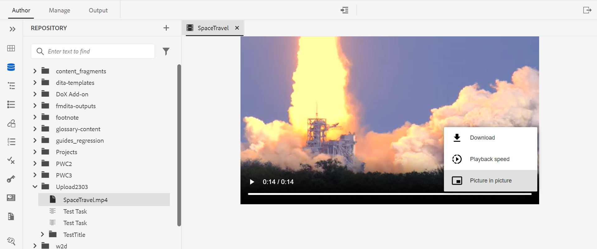

# Neue Funktionen in Version 4.2.1 von Adobe Experience Manager Guides (Mai 2023)

Dieser Artikel behandelt die neuen und erweiterten Funktionen in Version 4.2.1 von Adobe Experience Manager Guides (später *AEM Guides*).

Weitere Informationen zu den Upgrade-Anweisungen, der Kompatibilitätsmatrix und den in dieser Version behobenen Problemen finden Sie im Artikel [Versionshinweise](release-notes-4-2-1.md) .

## Navigieren Sie vom Web-Editor zur AEM-Homepage

Jetzt können Sie einfach vom Web-Editor zur AEM-Navigationsseite navigieren.

{width="800" align="left"}

* Klicken Sie auf **Guides**-Symbol ( ), um zur AEM-Navigationsseite zurückzukehren.

Weitere Informationen finden Sie unter [AEM-Navigationsseite](../user-guide/web-editor-launch-editor.md#id2056BG00RZJ).

## Erweiterte Metadatenunterstützung beim PDF-Publishing

AEM Guides bietet jetzt erweiterte Unterstützung für die Metadaten, die den Metadaten in Ihrer PDF-Ausgabe zugeordnet sind. Die Metadatenoptionen enthalten Informationen zum Dokument und dessen Inhalt, z. B. den Namen des Autors, den Dokumenttitel, Schlüsselwörter, Copyright-Informationen und andere Datenfelder.

Sie können eine XMP-Datei importieren, und AEM Guides kann die Informationen aus der Datei auswählen. Sie haben auch die Möglichkeit, die Namen und Werte der Metadaten mithilfe des Dropdown-Menüs anzugeben. Sie können auch benutzerdefinierte Metadaten hinzufügen, indem Sie direkt in das Namensfeld eingeben.

Weitere Informationen finden Sie unter **Metadaten** Funktionsbeschreibung in [Erstellen einer PDF-Ausgabevorgabe](../web-editor/native-pdf-web-editor.md).

### Verbessertes Bedienfeld für Gliederungsansichten

AEM Guides bietet ein verbessertes Bedienfeld für die Gliederungsansicht, in dem Sie eine hierarchische Ansicht der im Dokument verwendeten Elemente erhalten.

Die Gliederungsansicht bietet die folgenden Verbesserungen:

* Das Dropdown-Menü „Anzeigeoptionen“ wird oben im Bedienfeld „Gliederungsansicht“ angezeigt. Wenn ein Element eine ID, ein Attribut und einen Text hat, können Sie diese aus der Dropdown-Liste auswählen, um sie zusammen mit dem Element anzuzeigen. Die Attribute, die im Bereich Gliederungsansicht angezeigt werden können, werden durch die Einstellungen der Anzeigeattribute bestimmt, die von Ihrem Administrator im **Editor-Einstellungen“ konfiguriert**.

* Mithilfe der Suchfunktion können Sie nach einem Element anhand seines Namens, seiner ID, seines Textes oder seines Attributwerts suchen.

Weitere Informationen finden Sie in der Beschreibung der Funktion Gliederungsansicht im Abschnitt [Linkes Bedienfeld](../user-guide/web-editor-features.md#id2051EA0M0HS).

## Erzeugen des Multimedia-Berichts über den Web-Editor

AEM Guides bietet die Funktion zum Generieren der Berichte für Ihre technischen Dokumente.  Mit dieser Funktion können Sie die Themenliste anzeigen und die Metadaten Ihrer Dokumente verwalten. Jetzt können Sie auch das Multimedia sehen, das in allen Verweisen für die aktuelle Zuordnung von der **Berichte** im Web-Editor verwendet wird.

Sie können den Multimedia-Bericht erstellen, der detaillierte Informationen zu den Multimedia-Inhalten enthält, die in Ihren Referenzen innerhalb der aktuellen Karte verwendet werden. Sie haben die Flexibilität, die im Bericht aufgelisteten Multimediadateien zu filtern und zu sortieren.
Sie können auch die CSV-Datei generieren, um den aktuellen Schnappschuss der in der DITA-Karte verwendeten Multimedia-Inhalte herunterzuladen.

Weitere Informationen finden Sie in der Beschreibung der Funktion zum Erzeugen eines Multimediaberichts im Abschnitt [DITA-Zuordnungsbericht im Web-Editor](../user-guide/reports-web-editor.md).

## Native PDF | Ändern der Leiste, um geänderte Themen im Inhaltsverzeichnis anzuzeigen

Mit AEM Guides können Sie nun die geänderten Themen im Inhaltsverzeichnis der PDF-Ausgabe schnell identifizieren.  Links neben den geänderten Themen im Inhaltsverzeichnis wird eine Änderungsleiste angezeigt. Sie können auf das Thema im Inhaltsverzeichnis klicken und die detaillierten Änderungen anzeigen.

Weitere Informationen finden Sie unter [Arbeiten mit benutzerdefinierten Formatvorlagen für Änderungsbalken](../native-pdf/change-bar-style.md).

## Native PDF | Formatieren der Seitenmarkierung in der Fußnoten -Komponente

Jetzt können Sie die Seitenmarkierung in den Fußnoten formatieren. Sie können beispielsweise Klammern hinzufügen oder deren Farbe ändern. Diese Stile helfen den Benutzenden, die Seitenmarkierungen im Dokument leicht zu identifizieren.

Weitere Informationen finden Sie unter [Verwenden benutzerdefinierter Stile in Fußnoten](../native-pdf/footnote-number-style.md).

## Öffnen und Wiedergeben von Video- oder Audiodateien im Web-Editor

AEM Guides bietet jetzt die Funktion zum Öffnen und Wiedergeben der Audio- oder Videodateien im Web-Editor. Sie können die Lautstärke oder die Ansicht des Videos ändern. Im Kontextmenü haben Sie auch die Optionen **Herunterladen**, **Wiedergabegeschwindigkeit** oder Ansicht **Bild in Bild**.

Weitere Informationen finden Sie in der Beschreibung der Funktion „Repository-Ansicht“ im Abschnitt [Linkes Bedienfeld](../user-guide/web-editor-features.md#id2051EA0M0HS).
