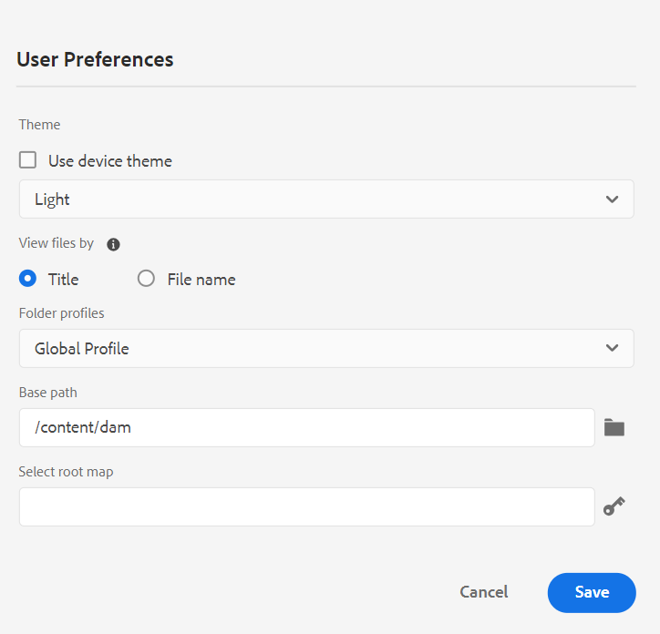

# Neue Funktionen in Version 4.4.0 (Januar 2024)

Dieser Artikel behandelt die neuen und erweiterten Funktionen in Version 4.4.0 von Adobe Experience Manager Guides.

Eine Liste der in dieser Version behobenen Probleme finden Sie unter [Behobene Probleme in Version 4.4.0](../release-info/fixed-issues-4-4.md).

Erfahren Sie mehr [Upgrade-Anweisungen für Version 4.4.0](../release-info/upgrade-instructions-4-4.md).

## Neu gestaltete Funktion „Versionsverlauf“ im Web-Editor

Jetzt bietet Experience Manager Guides eine erweiterte Funktion zum Versionsverlauf, mit der Sie die an einem Dokument vorgenommenen Änderungen im Zeitverlauf vergleichen können. In der neuen Seitenansicht können Sie den Inhalt und die Metadaten der aktuellen Version einfach mit einer beliebigen früheren Version desselben Dokuments vergleichen. Sie können auch die Beschriftungen und Kommentare für die verglichenen Versionen anzeigen. Als Admin können Sie die Versionsmetadaten des Themas und deren Werte steuern, die im Dialogfeld **Versionsverlauf** angezeigt werden.

{width="800" align="left"}
*Vorschau der Änderungen in den verschiedenen Versionen eines Themas.*

Weitere Informationen zur Beschreibung der Funktion **Versionsverlauf** finden Sie im Abschnitt [Linkes Bedienfeld (alt)](/help/legacy-product-guide/user-guide/web-editor-features.md#id2051EA0M0HS).

## Verwalten von Bedingungsvorgaben

Sie können Bedingungsattribute in Ihren DITA-Themen definieren. Verwenden Sie dann die Bedingungsattribute in der Bedingungsvorgabe, um den Inhalt in einer DITA-Zuordnung zu veröffentlichen. Experience Manager Guides bietet jetzt auch ein angereichertes Erlebnis im Web-Editor, mit dem Sie Bedingungsvorgaben effizienter erstellen und verwalten können. Sie können sie auch einfach bearbeiten, duplizieren oder löschen.

{width="550" align="left"}

Weitere Informationen finden Sie unter [Verwenden von Bedingungsvorgaben](../user-guide/generate-output-use-condition-presets.md).

## Neues Erlebnis zur Bearbeitung der Attribute

Jetzt verfügen Sie über ein überarbeitetes Erlebnis, um die Attribute für ein Element im Bedienfeld **Inhaltseigenschaften** im Web-Editor hinzuzufügen oder zu bearbeiten.

{width="300" align="left"}

*Attribute aus dem Bedienfeld „Inhaltseigenschaften“ hinzufügen.*

Sie können die Attribute auch einfach bearbeiten und löschen.
Weitere Informationen finden Sie in der Beschreibung der Funktion **Inhaltseigenschaften** im Abschnitt [Bereich rechts](../user-guide/web-editor-features.md#id2051EB003YK).

## Bearbeiten von Metadaten beim Authoring

Beim Authoring können Sie jetzt die Dateimetadaten-Tags mithilfe der Dropdown-Liste **Dateieigenschaften** im rechten Bedienfeld aktualisieren. Sie können auch **Weitere Eigenschaften bearbeiten** auswählen, um weitere Metadaten zu aktualisieren.

{width="300" align="left"}

*Aktualisieren von Metadaten und Bearbeiten von Dateieigenschaften im rechten Bedienfeld.*

Weitere Informationen finden Sie in der **Dateieigenschaften** Funktionsbeschreibung im Abschnitt [Bereich rechts](../user-guide/web-editor-features.md#id2051EB003YK).

## Anzeigen von Schlüsselattributen in der Zuordnungsansicht

Wenn Sie Schlüsselattribute für die Themen- oder Zuordnungsreferenzen definieren, können Sie auch den Titel, das entsprechende Symbol und den Schlüssel im linken Bereich anzeigen. Die Taste wird als `key=<key-name>` angezeigt.

 {width="300" align="left"}

*Anzeigen des Schlüsselattributs in der Zuordnungsansicht.*

Weitere Informationen finden Sie in der Beschreibung der Funktion **Kartenansicht** im Abschnitt [Linkes Bedienfeld](../user-guide/web-editor-features.md#id2051EA0M0HS).

## Möglichkeit, eine Baseline basierend auf der Bezeichnung zu duplizieren

Experience Manager Guides bietet jetzt ein verbessertes Benutzererlebnis zum Erstellen der Grundlinien aus dem Web-Editor.
Die Optionen **Manuelles Update** und **Automatisches Update** sind intuitiver und erleichtern Ihnen die Wahl zwischen der Erstellung einer statischen Grundlinie oder ihrer automatischen Aktualisierung entsprechend den Kennzeichnungen.

 {width="300" align="left"}
*Erstellen einer Baseline aus dem Web-Editor.*

Außerdem können Sie eine Baseline basierend auf der Bezeichnung duplizieren. Die Referenzversion wird basierend auf der angegebenen Beschriftung (falls vorhanden) beim Duplizieren ausgewählt, andernfalls wird die Version aus der duplizierten Baseline ausgewählt.

 {width="300" align="left"}

*Duplizieren Sie eine Baseline basierend auf einer Beschriftung oder erstellen Sie eine exakte Kopie.*

Erfahren Sie mehr über das [Erstellen und Verwalten von Baselines im Web-Editor](../user-guide/web-editor-baseline.md).

## Verbessertes Dashboard für Zuordnungssammlung

Experience Manager Guides bietet ein erweitertes Dashboard für die Kartensammlung . In einer Zuordnungssammlung können Sie die Metadateneigenschaften für die DITA-Zuordnungen schnell stapelweise konfigurieren. Diese Funktion ist praktisch, da Sie die Metadateneigenschaften nicht für jede DITA-Zuordnung einzeln aktualisieren müssen.

Jetzt können Sie den Dateinamen der DITA-Karte anzeigen. Sie können auch die Baselines anzeigen. Auf diese Weise können Sie die für eine Voreinstellung verwendete Baseline schnell finden.

{width="800" align="left"}

*Anzeigen, Bearbeiten und Generieren von Ausgaben im Zuordnungssammlungs-Dashboard.*

Erfahren Sie, wie [Zuordnungssammlung für die Ausgabegenerierung verwenden](../user-guide/generate-output-use-map-collection-output-generation.md).

## Erweitertes Übersetzungs-Panel

Das Bedienfeld **Übersetzung** wurde verbessert.  Sie können die Liste **Verfügbare Sprachen** anzeigen und schnell das Gebietsschema auswählen, in das Sie Ihr Projekt übersetzen möchten. Mit einer einzigen Auswahl können Sie auch **Alle auswählen** um Ihr Projekt in alle verfügbaren Sprachen zu übersetzen.

{width="300" align="left"}

*Wählen Sie die Gebietsschemata aus, in die Sie Ihr Projekt übersetzen möchten. Wählen Sie die Standardversion, die Baseline oder die neueste Version der zu übersetzenden Dateien aus.*

Erfahren Sie mehr über die [Übersetzung von Inhalten](../user-guide/translation.md).

## Verbesserte Suchlogik im Dialogfeld „Element einfügen“

Die Elemente sind jetzt im Dialogfeld Element einfügen leicht zu finden.  Sie können eine Zeichenfolge in das Suchfeld eingeben und eine Liste aller gültigen Elemente abrufen, die mit der eingegebenen Zeichenfolge beginnen.

Beispiel: Beim Bearbeiten eines Absatzes, für den Sie ein Element einfügen möchten, können Sie nach dem Zeichen „t“ suchen, um Folgendes zu erhalten
Alle gültigen Elemente, die mit „t“ beginnen.

{width="300" align="left"}

*Geben Sie ein Zeichen ein, um nach allen gültigen Elementen zu suchen, die mit dem Zeichen beginnen.*

Weitere Informationen finden Sie in der Beschreibung **Element einfügen** im Abschnitt [Linkes Bedienfeld](../user-guide/web-editor-features.md#id2051EA0M0HS).

## Möglichkeit, eine Liste auf derselben Ebene aufzuteilen

Jetzt können Sie Ihre Liste im Web-Editor einfach aufteilen. Wählen Sie die **Liste teilen** aus dem Kontextmenü eines Listenelements aus, um die aktuelle Liste zu teilen. Eine neue Liste wird auf derselben Ebene erstellt, beginnend mit dem Listenelement, das Sie für die Aufspaltung ausgewählt haben.

{width="300" align="left"}

*Wählen Sie die Option aus, um die aktuelle Liste zu teilen.*

Weitere Informationen finden Sie in der **Liste einfügen** Funktionsbeschreibung im Abschnitt [Linkes Bedienfeld](../user-guide/web-editor-features.md#id2051EA0M0HS).

## DITA-Elemente einfach entpacken

Jetzt können Sie ein Element mithilfe der Option aus dem Kontextmenü eines Elements im Web-Editor einfach entpacken. Auf diese Weise können Sie den Text des Elements einfach mit dem übergeordneten Element zusammenführen.
Weitere Informationen finden Sie im Abschnitt **Element entpacken** unter &quot;[ Funktionen im Web-Editor](../user-guide/web-editor-other-features.md).

## Zugreifen auf Dateieigenschaften im Quellmodus der Bearbeitung

Jetzt können Sie auf die Funktion **Dateieigenschaften“ des rechten Bedienfelds** allen vier Modi oder Ansichten zugreifen: Layout, Autor, Source und Vorschau.  Auf diese Weise können Sie die Eigenschaften Ihrer Datei auch dann anzeigen, wenn Sie zwischen den verschiedenen Modi wechseln.

Weitere Informationen finden Sie in der **Dateieigenschaften** Funktionsbeschreibung im Abschnitt [Rechtes Bedienfeld](../user-guide/web-editor-features.md#id2051EB003YK).

## Dateien nach Titel oder Dateinamen anzeigen

Sie können jetzt die Standardmethode zum Anzeigen der Dateien im Web-Editor auswählen. Sie können die Liste der Dateien anhand der Titel oder der Dateinamen aus den verschiedenen Bedienfeldern in der Autorenansicht anzeigen.

{width="550" align="left"}

*Ändern Sie die Standardeinstellung zum Anzeigen der Dateien im Dialogfeld **Benutzereinstellungen**.*

## Wiederherstellen von Dateiregisterkarten beim Aktualisieren des Browsers

Experience Manager Guides stellt den Status der geöffneten Dateiregisterkarten im Web-Editor wieder her, wenn Sie den Browser aktualisieren. Weitere Informationen finden Sie im Abschnitt **Browser beim Bearbeiten der Dateien aktualisieren** unter [Themen im Web-Editor bearbeiten](../user-guide/web-editor-edit-topics.md).

## Möglichkeit zur Navigation mithilfe von Tastaturbefehlen

Experience Manager Guides ermöglicht jetzt auch die Verwendung von Tastaturbefehlen zum Verschieben des Cursors im Web-Editor. Sie können die Tastaturbefehle verwenden, um ein Wort schnell nach links oder rechts zu verschieben. Sie können auch mithilfe der Tastaturbefehle zum Anfang oder Ende der Zeile wechseln.
Jetzt können Sie auch Tastaturbefehle verwenden, um den Cursor an den Anfang des nächsten Elements oder an das Ende des vorherigen Elements zu verschieben.
Erfahren Sie mehr über [Tastaturbefehle im Web-Editor](../user-guide/web-editor-keyboard-shortcuts.md).

## Auflösen von Kreuzzuordnungs-Links in der AEM-Site-Ausgabe

Kreuzzuordnungs-Links (XREF mit Peer-Bereich), die in der AEM-Site-Ausgabe gerendert werden, werden jetzt gemäß dem Dateinamen des Veröffentlichungskontexts aufgelöst, der für die generierte Zuordnung festgelegt wurde.

## Konfigurieren Sie die URL der AEM-Site-Ausgabe, um den Dokumenttitel zu verwenden

Experience Manager Guides ermöglicht es Ihnen als Administrator, die URL der Ausgabe der AEM-Site zu konfigurieren. Wenn der Dateiname nicht vorhanden ist oder alle Sonderzeichen enthält, können Sie so konfigurieren, dass er sie durch ein Trennzeichen in der URL der AEM-Site-Ausgabe ersetzt. Sie können sie auch durch den Namen des ersten untergeordneten Themas ersetzen. Erfahren Sie, wie Sie [die URL der AEM-Site-Ausgabe konfigurieren, um den Dokumenttitel zu verwenden](../cs-install-guide/conf-output-generation.md#configure-the-url-of-the-aem-site-output-to-use-the-document-title).

## Mehrere parallele Publish-Ausgabevorgaben

Experience Manager bietet die Funktion, Baselines zu erstellen, indem die Themen automatisch entsprechend der ihnen zugewiesenen Beschriftung ausgewählt werden. Jetzt können Sie auch mehrere Ausgabevorgaben mit automatischen Baselines derselben DITA-Zuordnung nahtlos veröffentlichen. Sie müssen nicht nur eine Vorgabe gleichzeitig veröffentlichen, sondern können auch mehrere Ausgabevorgaben parallel veröffentlichen.

Erfahren Sie mehr über das [Erstellen und Verwalten von Baselines im Web-Editor](../user-guide/web-editor-baseline.md).

## Native PDF-Verbesserungen

Die folgenden nativen PDF-Verbesserungen wurden in Version 4.4.0 vorgenommen:

### Verwenden von Variablen in der PDF-Ausgabe

Sie können Variablen verwenden, um wiederverwendbare Informationen dynamisch einzufügen und zu verwalten. Experience Manager Guides hilft Ihnen beim Erstellen, Bearbeiten und Anzeigen einer Vorschau von Variablen während der Erstellung der PDF-Ausgabe. Sie können die Werte von Variablen schnell ändern und Ihre Dokumente portabel und einfach zu aktualisieren machen.

{width="800" align="left"}

*Erstellen und Verwalten von Variablen im Web-Editor.*

Sie können auch Variablensätze erstellen, die die Standardwerte überschreiben, und Ihren Variablen alternative Werte zuweisen. Fügen Sie diese Variablen in das Seiten-Layout ein und verwenden Sie dasselbe PDF-Layout. Sie müssen nicht für jeden Wertesatz separate Layouts erstellen. Sie können beispielsweise für jede Produktversion einen Variablensatz erstellen. Dieser Variablensatz kann aus Variablen für verschiedene Produktdetails wie Produktname, Versionsnummer und Veröffentlichungsdatum bestehen. Anschließend können Sie für diese Variablen unterschiedliche Werte hinzufügen.

**Variablensatz 1: Adobe-Set1**

* Produktname: Experience Manager Guides
* Versionsnummer: 2311
* Veröffentlichungsdatum: 11/02/2023

**Variablensatz 2: Adobe-Set2**

* Produktname: Experience Manager Guides
* Versionsnummer: 2310
* Veröffentlichungsdatum: 09/27/2023

*Generieren Sie die PDF-Ausgabe mithilfe von Variablen im PDF-Layout.*

Sie können Stile anwenden und HTML-Markup verwenden, um die Variablen zu formatieren.  Sie können bei Bedarf auch schnell die Werte für alle Variablen aktualisieren und die Ausgabe neu generieren. Wenn Sie beispielsweise die Details für eine Version aktualisieren müssen, können Sie den Wert der Version in der Variablen VersionNumber bearbeiten und die Ausgabe neu generieren.

Erfahren Sie mehr über die Verwendung von [Variablen in der PDF-Ausgabe](../native-pdf/native-pdf-variables.md).

### Übertragen von Asset-Metadaten an die PDF-Ausgabe

Experience Manager bietet jetzt die Möglichkeit, die Metadateneigenschaften der Assets aus der DITA-Zuordnung auf die PDF-Ausgabe zu übertragen.
Über die native PDF-Ausgabevorgabe können Sie die Metadaten auswählen, die Sie an den PDF-Veröffentlichungsprozess weitergeben möchten. Sie können sowohl die benutzerdefinierten als auch die Standardeigenschaften auswählen.  Die ausgewählten Metadateneigenschaften werden in die mit dem nativen PDF generierte PDF-Datei übertragen.

Diese Funktion ist praktisch, da sie Ihnen dabei hilft, Ihre Asset-Eigenschaften wie Autor, Erstellungsdatum oder Dokumenttitel konsistent zu halten. Dies erleichtert die Organisation, Suche und Kategorisierung Ihrer Dokumente.

Weitere Informationen finden Sie unter **Erweitert** in der Ausgabe [Publish PDF](../web-editor/native-pdf-web-editor.md).

### Verwenden der im `topicmeta` hinzugefügten Metadaten für die PDF-Ausgabe

Die Metadatenfunktion in der nativen PDF-Veröffentlichung hilft bei der Inhaltsverwaltung und bei der Suche nach Dateien im Internet.

*Wählen Sie eine Option aus, um Metadatenoptionen hinzuzufügen und anzupassen.*

Jetzt bietet Experience Manager Guides die Möglichkeit, die Metadaten zu verwenden, die Sie im `topicmeta` der DITA-Zuordnung hinzugefügt haben, um die Metadatenfelder der PDF-Ausgabe zu befüllen. Standardmäßig ist diese Option aktiviert.

Diese Funktion trägt zu einer besseren Dokumentverwaltung bei, sorgt für Konsistenz und macht Ihre Dokumente durchsuchbar.

Weitere Informationen finden Sie auf der Registerkarte **Metadaten** in der [Publish PDF-Ausgabe](../web-editor/native-pdf-web-editor.md).

### Verwenden und Duplizieren von vordefinierten PDF-Vorlagen

Experience Manager Guides bietet vordefinierte oder werkseitige PDF-Vorlagen. Duplizieren Sie die werkseitigen PDF-Vorlagen, um die benutzerdefinierten PDF-Vorlagen zu erstellen.

Jetzt können Sie beim Erstellen und Duplizieren einer Vorlage auch eine Vorschau des Miniaturbilds für eine Vorlage anzeigen. Sie können dieses Bild auch bearbeiten oder löschen. Diese Funktion ist nützlich, um Vorlagen mit ähnlichen Namen zu markieren oder zu unterscheiden.
Weitere Informationen zur [PDF-Vorlage](../native-pdf/pdf-template.md).

{width="550" align="left"}

*Duplizieren Sie eine vorhandene PDF-Vorlage.*

### Ändern der Reihenfolge von Seiten und Veröffentlichen mehrerer Seiten pro Blatt

Neben der Veröffentlichung der Seiten gemäß dem Quelldokument können Sie beim Veröffentlichen eines mehrseitigen Dokuments auch die Seitenreihenfolge beim PDF ändern.  Dadurch haben Sie die Möglichkeit, die Seiten in verschiedenen Reihenfolgen zu veröffentlichen, z. B. alle ungeraden oder alle geraden Seiten zuerst. Sie können auch als Broschüre veröffentlichen und die Seiten wie ein Buch lesen. Sie können auch die Anzahl der Seiten festlegen, die Sie auf einem einzelnen Blatt Papier veröffentlichen möchten. Weitere Informationen finden Sie im Abschnitt [Seitenorganisation](../native-pdf/components-pdf-template.md#page-organization) .

### Sortieren von Glossarbegriffen basierend auf Sortierschlüsseln

Jetzt können Sie die Glossarbegriffe auch anhand von Sortierschlüsseln sortieren. Sie können das Tag „sort-as“ verwenden, um einen Sortierschlüssel für die Glossarbegriffe zu definieren. Anschließend können Sie sie anhand von Sortierschlüsseln anstelle der Begriffe sortieren. Auf diese Weise können Sie die Glossarbegriffe nach den in verschiedenen Sprachen verwendeten Begriffen sortieren. Sie können auch einen einzelnen Sortierschlüssel für einen Glossarbegriff mit einer Phrase oder einer Gruppe von Wörtern definieren.
Weitere Informationen finden Sie unter [Erweiterte PDF-Einstellungen](../native-pdf/components-pdf-template.md#advanced-pdf-settings).

### Verbessertes Ressourcenmanagement für native PDF-Vorlagen

Experience Manager Guides hat jetzt die Ressourcenverwaltung für native PDF-Vorlagen verbessert. Sie können jetzt Ressourcen wie Bilder, CSS-Dateien und Schriftarten-Dateien über mehrere native PDF-Vorlagen hinweg freigeben und wiederverwenden. Mit dieser Verbesserung ist die Verwaltung der Ressourcen für einen großen Satz von Vorlagen viel einfacher. Sie müssen nicht für jede Vorlage doppelte Ressourcen erstellen. Sie können diese in einem freigegebenen Ordner speichern und in allen nativen PDF-Vorlagen verwenden.
Weitere Informationen finden Sie unter [PDF-Vorlage](../native-pdf/pdf-template.md).
