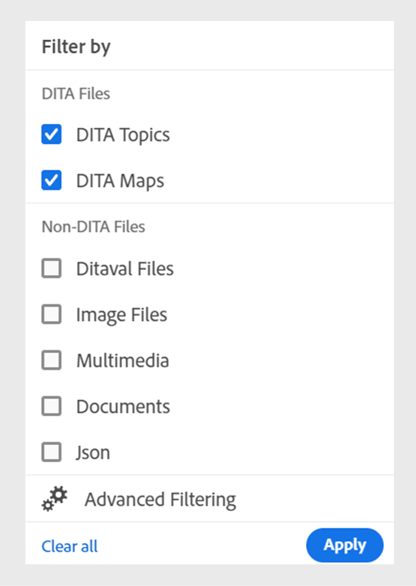

# Neue Funktionen in Version 4.6.0 (September 2024)

Dieser Artikel behandelt die neuen und erweiterten Funktionen, die mit Version 4.6.0 von Adobe Experience Manager Guides eingeführt wurden.

Eine Liste der in dieser Version behobenen Probleme finden Sie unter [Behobene Probleme in Version 4.6.0](../release-info/fixed-issues-4-6-0.md).

Erfahren Sie mehr über [Upgrade-Anweisungen für die Version 4.6.0](../release-info/upgrade-instructions-4-6-0.md).

## Verbesserungen beim Veröffentlichen

In Version 4.6.0 wurden die folgenden Inhaltsveröffentlichungsverbesserungen vorgenommen:

### Publish eines Themas oder seiner Elemente in ein Experience Fragment

Ein Experience Fragment ist eine modulare Inhaltseinheit in Adobe Experience Manager, die Inhalte und Layout integriert. Experience Fragments sind entscheidend für die Erstellung konsistenter und ansprechender Erlebnisse, die über mehrere Kanäle hinweg weiter verwendet werden können. Sie können beispielsweise Experience Fragments für Kopf- oder Fußzeilen mit Branding-Elementen, Werbebannern, Kundenreferenzen und Ereignispromotions erstellen.

 {width="300" align="left"}

*Publish und zeigen Sie die Experience Fragments eines Themas im Abschnitt **Ausgaben**unter **Dateieigenschaften**an.*

Mit Experience Manager Guides können Sie jetzt ein Thema oder seine Elemente in einem Experience Fragment veröffentlichen. Sie können eine JSON-basierte Zuordnung zwischen einem Thema oder seinen Elementen und einer Experience Fragment-Vorlage erstellen. Sie können Varianten von Experience Fragments auch mithilfe der Bedingungsfilter erstellen.

Weitere Informationen zum [Erstellen von Publish Experience Fragments](../user-guide/publish-experience-fragment.md).

### Verbesserungen bei der Veröffentlichung von Inhaltsfragmenten

Experience Manager Guides bietet auch einige hilfreiche Verbesserungen bei Inhaltsfragmenten:

- Mit Experience Manager Guides können Sie ein Thema oder seine Elemente in einem Inhaltsfragment veröffentlichen.

- Sie können die Inhaltsfragmente eines Themas veröffentlichen und im Abschnitt **Ausgaben** der Seite **Dateieigenschaften** anzeigen.

- Sie können auf einfache Weise Varianten von Inhaltsfragmenten erstellen, indem Sie Inhalte beim Veröffentlichen in einem Inhaltsfragment nach Bedingungen filtern.

- Verwenden Sie die neue Zuordnungsschnittstelle, um die Elemente einfach auszuwählen und in einem Inhaltsfragment zu veröffentlichen.

Jetzt ersetzt die Veröffentlichung von Inhaltsfragmenten nur den zugeordneten Inhalt, anstatt das gesamte Inhaltsfragment zu überschreiben. Mit dieser Funktion kann ein Inhaltsfragment Daten aus mehreren Quellen enthalten, z. B. aus mehreren Themen oder aus dem Inhaltsfragment-Editor.

Weitere Informationen finden Sie unter [Publish-Inhaltsfragmente](../user-guide/publish-content-fragment.md).

### AEM Sites-Voreinstellung neu angeordnet für einfache Verwendung

Die Einstellungen wurden neu angeordnet, damit Sie die Ausgabevorgabe schnell konfigurieren und die AEM Sites-Ausgabe generieren können.
Sie können die vorhandenen AEM Sites-Vorgaben erstellen, indem Sie die Option **Alte Komponentenzuordnung verwenden** im Dialogfeld **Neue**&quot; auswählen.

Zeigen Sie die Registerkarten **Allgemein**, **Inhalt** und **Kartenreferenz** in den AEM Sites-Vorgaben an:
- **Allgemein**: Enthält die allgemeinen Konfigurationen zum Generieren der Ausgabe. Sie können die Site und den Ausgabepfad angeben, vorhandene Ausgabeseiten löschen oder überschreiben, die zuvor generierten Seiten für entfernte Themen löschen, die Design-Vorlage auswählen, die temporären Dateien beibehalten und den Nachgenerierungs-Workflow angeben.
- **Content**: Enthält die Einstellungen, die für den Inhalt für die Ausgabegenerierung gelten. Sie können die Filter, die Baseline der DITA-Zuordnung und die Metadateneigenschaften für die Veröffentlichung auswählen.
- **Cross-Map-Verweise**: Diese Liste enthält Themen mit Cross-Map-Verweisen mit scope =„peer“. Sie können den Veröffentlichungskontext für eine Liste von Querverweisen mit scope=„peer“ zu Themen angeben, die in anderen DITA-Zuordnungen verfügbar sind. Diese Registerkarte wird angezeigt, wenn Sie die Experience Manager Guides-Version (UUID) verwenden.

### Kreuzzuordnungsverweise aus AEM Sites-Vorgaben im Web-Editor

Die neueste Verbesserung an Experience Manager Guides führt Querverweisreferenzen in den AEM Sites-Vorgaben des Web-Editors ein.
Querverweise auf Zuordnungen in Experience Manager Guides helfen, die Inhaltsnavigation zu verbessern, die Wiederverwendung von Inhalten zu steigern und das Benutzererlebnis zu verbessern.

Mit scope=„peer“ können Sie den Veröffentlichungskontext für eine Liste von Querverweisen auf Themen angeben, die in anderen DITA-Zuordnungen verfügbar sind. Beispielsweise enthält Thema 1 in Karte A einen Verweis auf Thema 2. Thema 2 kann in einzelnen oder mehreren Karten vorhanden sein.  Sie können für jeden Link die übergeordnete Zuordnung und eine bestimmte Vorgabe oder die zuletzt veröffentlichte Ausgabe auswählen.

Wenn dasselbe Thema mehrmals in einer Datei referenziert wird, können Sie für jede Instanz einen anderen Veröffentlichungskontext hinzufügen. Dies bietet mehr Flexibilität und Kontrolle über ihre Inhalte. Beispielsweise ist Thema 3 sowohl in Karte B als auch in Karte C vorhanden. Thema 1 enthält zwei Verweise auf Thema 3. Sie können Zuordnung B als übergeordnete Zuordnung für den ersten Link und Zuordnung C als übergeordnete Zuordnung für den zweiten Link auswählen.

*Geben Sie auf der Registerkarte **Cross-Map-Referenzen**der Vorgabe **AEM Sites**den Veröffentlichungskontext für die verknüpften Themen an.*

### Übergeben von Metadaten aus Themendateieigenschaften an die native PDF-Ausgabe

Jetzt können Sie mit Experience Manager Guides die Metadaten aus den Dateieigenschaften eines Themas zu den Seiten-Layouts hinzufügen, während Sie die native PDF-Ausgabe generieren. Verwenden Sie diese Funktion, um themenspezifische Metadaten wie Titel, Tags und Beschreibung zu den Seiten-Layouts hinzuzufügen. Sie können Ihre veröffentlichte PDF auch auf der Grundlage der Metadaten des Themas anpassen, z. B. indem Sie dem Hintergrund des Themas ein Wasserzeichen auf Grundlage des Dokumentstatus des Themas hinzufügen.

 {width="300" align="left"}

*Fügen Sie den Feldern in Ihren Seiten-Layouts Metadaten hinzu.*

Erfahren Sie, wie Sie [Felder und Metadaten](../native-pdf/design-page-layout.md#add-fields-metadata) in einem Seitenlayout hinzufügen.

### Unterstützung für Markdown-Dokumente in der nativen PDF-Veröffentlichung

Experience Manager Guides unterstützt auch Markdown-Dokumente in der nativen PDF-Veröffentlichung. Diese Funktion ist praktisch und hilft Ihnen beim Generieren von PDF für die Markdown-Dateien in Ihrer DITA-Zuordnung.

Weitere Informationen finden Sie unter [Unterstützung für Markdown-Dokumente](../web-editor/native-pdf-web-editor.md#support-for-markdown-documents).

### Herunterladen der temporären Datei beim Generieren der Ausgabe über DITA-OT

Sie können auch die temporären Dateien herunterladen, die beim Veröffentlichen der AEM Sites-, HTML-, benutzerdefinierten, JSON- oder PDF-Ausgabe über DITA-OT generiert werden. Mit dieser Funktion können Sie alle Probleme analysieren, die während des Ausgabenerstellungsprozesses auftreten können, und Fehler effektiv beheben.  
Sie können auch die Datei „metadata.xml“ herunterladen, wenn Sie Metadateneigenschaften ausgewählt haben, die an die mit DITA-OT generierte Ausgabe übergeben wurden. 

Weitere Informationen zu den Vorgaben finden Sie unter [Grundlegendes zu den Ausgabevorgaben](../user-guide/generate-output-understand-presets.md).

### Option zur Auswahl einer flachen oder verschachtelten Dateihierarchie für die HTML5-Ausgabe

Jetzt können Sie mit Experience Manager Guides die flache Ordnerhierarchie für die temporären Dateien beibehalten, bei denen der gesamte Inhalt im HTML5-Ausgabeformat veröffentlicht und in einem einzigen Ordner gespeichert wird.
Wenn Sie die Dateihierarchie nicht reduzieren möchten, wird die HTML5-Ausgabe in einer verschachtelten Ordnerhierarchie generiert. Dies bedeutet, dass die ursprüngliche Ordnerstruktur des Inhalts mit Dateien, die in Unterordnern organisiert sind, in der Ausgabe repliziert wird. Diese verschachtelte Ordnerhierarchie ermöglicht eine komplexere Organisation und Kategorisierung von Dateien, wodurch die Verwaltung und Navigation großer Datenmengen erleichtert wird.

Weitere Informationen zum Generieren [ HTML5-Ausgabe](../user-guide/generate-output-html5.md)

## Verbesserungen am Editor

In Version 4.6.0 wurden die folgenden Editor-Verbesserungen hinzugefügt:

### Schreibgeschützter Zugriff auf den Authoring- und Source-Modus für gesperrte Dateien

Wenn eine DITA- oder Markdown-Datei von einem anderen Benutzer gesperrt oder ausgecheckt wird, können Sie den Inhalt nicht bearbeiten oder ändern. Neben der Vorschau können Sie sie auch als schreibgeschützte Datei im Authoring- oder Source-Modus anzeigen.
Im schreibgeschützten Modus können Sie den Inhalt zusammen mit den Tags und Attributen im Modus **Author** oder **Source** anzeigen und die Dateieigenschaften bearbeiten.

Sie können auch auf die **Layout**-Ansicht für schreibgeschützte DITA-Zuordnungen zugreifen.
>[!NOTE]
>
> Ihre Ordnerprofiladministrierenden müssen *ui_config.json* aktualisieren, damit Sie im Autoren-, Source- und Layout-Modus einheitlich auf die schreibgeschützten Dateien zugreifen können.

*Anzeigen der gesperrten Dateien im Authoring- und Source-Modus.*

Erfahren Sie, wie [ Dateien im Authoring- und Source-Modus öffnen ](../user-guide/web-editor-edit-topics.md#open-locked-files-in-author-and-source-modes).

### Auswahl partieller Inhalte aus allen Elementen für Vorgänge

Experience Manager Guides verbessert das Benutzererlebnis bei der Auswahl der Inhalte über die Elemente hinweg im Web-Editor. Sie können mühelos Inhalte über verschiedene Elemente hinweg auswählen und Vorgänge wie fett, kursiv und unterstrichen ausführen.

Mit dieser Funktion können Sie die Formatierung für teilweise ausgewählte Inhalte nahtlos anwenden oder entfernen. Sie können auch schnell die Inhalte löschen, die Sie über Elemente hinweg ausgewählt haben. Sobald der Inhalt gelöscht wurde, wird der verbleibende Inhalt ggf. automatisch unter einem einzigen gültigen Element zusammengeführt. Sie können auch teilweise Inhalte über Elemente hinweg auswählen und dann den Inhalt unter einem gültigen DITA-Element umgeben.

Insgesamt bieten diese Verbesserungen ein besseres Erlebnis und helfen Ihnen, Ihre Effizienz bei der Bearbeitung Ihrer Dokumente zu verbessern.
Weitere Informationen finden Sie unter [Teilweise Auswahl von Inhalten über Elemente hinweg](../user-guide/web-editor-edit-topics.md#partial-selection-of-content-across-elements).

### Getrennte Liste zum Anzeigen und Einfügen gültiger Elemente entsprechend ihrer Position

Beim Bearbeiten eines Dokuments im Web-Editor können Sie jetzt eine getrennte Liste von Elementen anzeigen, die am aktuellen Speicherort und außerhalb des aktuellen Speicherorts gültig sind. Je nach Ihren Anforderungen wählen Sie ein Element aus den folgenden Optionen aus:

- **Gültige Elemente an der aktuellen Position** die Sie an der aktuellen Cursorposition selbst einfügen können.
- **Gültige Elemente außerhalb des aktuellen Speicherorts** die Sie für das aktuelle Element innerhalb der Elementhierarchie nach einem der übergeordneten Elemente einfügen können.

{width="300" align="left"}

*Sehen Sie sich die getrennten Listen mit gültigen Elementen an, um ein Element am aktuellen Speicherort einzufügen.*

Diese geteilte Liste gültiger Elemente hilft Ihnen, die Inhaltsstruktur beizubehalten und die DITA-Standards zu befolgen.

Weitere Informationen zur Funktion **Element einfügen** finden Sie im Abschnitt [Sekundäre ](../user-guide/web-editor-features.md#2051ea0j0y4).

### Neues Erlebnis bei der Suche und Filterung von Dateien in der Repository-Ansicht

Das Filtern von Dateien wurde verbessert. Die überarbeitete Funktion zum Filtern von Dateien bietet eine verbesserte Möglichkeit, Dateien mühelos zu suchen und durch Dateien zu navigieren.

{width="300" align="left"}

*Suchen nach Dateien, die den Text`general purpose.`* enthalten

Profitieren Sie von Vorteilen wie einem schnelleren Zugriff auf relevante Dateien und einer intuitiveren Benutzeroberfläche für ein reibungsloseres und effizienteres Sucherlebnis.

 {width="300" align="left"}

*Verwenden Sie die Filter für die schnelle Suche, um nach DITA- und Nicht-DITA-Dateien zu suchen.*

>[!NOTE]
>
> Ihre Ordnerprofiladministratoren müssen &quot;*_config.json“ aktualisieren* damit Sie harmonisch auf diese Funktion zugreifen können.

Weitere Informationen zur Funktion **Suche filtern** im Abschnitt [Linkes Bedienfeld](../user-guide/web-editor-features.md#id2051EA0M0HS).

### Gruppierte Bedingungen für die erweiterte Inhaltsorganisation

Mit Experience Manager Guides können Sie jetzt Bedingungen gruppieren und in einer verschachtelten Hierarchie darstellen, sodass Sie einer einzigen Gruppe mehrere Bedingungen hinzufügen können. Durch Gruppieren von Bedingungen können Sie diese besser organisieren und auf Ihre gesamten Inhalte anwenden.

{width="300" align="left"}

Weitere Informationen zur Funktionsbeschreibung **Bedingungen** finden Sie im Abschnitt [Linkes ](../user-guide/web-editor-features.md#id2051EA0M0HS)).

### Anpassen des Web-Editor-Erlebnisses mit einer neuen Benutzeroberfläche mit Benutzereinstellungen

Das **Benutzereinstellungen** im Web-Editor enthält jetzt eine neue Registerkarte **Erscheinungsbild**. Auf dieser neuen Registerkarte können Sie die gängigsten Look-and-Feel-Voreinstellungen in der Benutzeroberfläche des Web-Editors konfigurieren.

Sie können so konfigurieren, dass die Dateien nach Titel oder Dateinamen angezeigt werden, und das Design des Programms und die Quellansicht ändern. Außerdem können Sie die Einstellungen konfigurieren, um eine geöffnete Datei in der Repository-Ansicht zu finden und die Leerzeichen ohne Unterbrechung zu verarbeiten.

{width="550" align="left"}

*Passen Sie das Erscheinungsbild Ihren Vorlieben entsprechend an.*

Weitere Informationen zur Beschreibung der Funktion **Benutzereinstellungen** finden Sie im Abschnitt [Linkes Bedienfeld](../user-guide/web-editor-features.md#id2051EA0M0HS).

### Suchen Sie eine geöffnete Datei in der Repository-Ansicht des Web-Editors

Wählen Sie die Option **Dateien immer im Repository finden** unter **Benutzereinstellungen** aus, um schnell zu navigieren und Ihre Datei in der Repository-Ansicht zu finden. Sie müssen nicht manuell danach suchen.

Während der Bearbeitung hilft Ihnen diese Funktion auch dabei, den Speicherort der Datei in der Repository-Hierarchie einfach anzuzeigen.

Weitere Informationen finden Sie unter [Suchen einer geöffneten Datei in der Repository-Ansicht](../user-guide/web-editor-edit-topics.md#locate-an-open-file-in-the-repository-view).

### Verbesserte Handhabung von Leerzeichen ohne Unterbrechung im Web-Editor

Experience Manager Guides ermöglicht es Ihnen, beim Bearbeiten von Dokumenten im Web-Editor eine Leertaste ohne Unterbrechung anzuzeigen. Außerdem wird die Handhabung von Leerzeichen ohne Unterbrechung verbessert.
Dabei werden mehrere aufeinander folgende Leerzeichen in ein einziges Leerzeichen umgewandelt, um die WYSIWYG-Ansicht des Dokuments im Web-Editor beizubehalten. Diese Funktion trägt auch dazu bei, das allgemeine Erscheinungsbild und die Professionalität des Dokuments zu verbessern.

Weitere Informationen finden Sie unter [Weitere Funktionen des Web-Editors](../user-guide/web-editor-other-features.md).

### Möglichkeit, Eigenschaften eines beliebigen Elements aus der Elementhierarchie anzuzeigen

Jetzt werden die Inhaltseigenschaften **Typ** als Dropdown-Menü angezeigt. Sie können die Tags der vollständigen Hierarchie für das aktuelle Tag aus der Dropdown-Liste anzeigen und auswählen.

Dieses Dropdown-Menü hilft Ihnen beim schnellen Zugriff auf die Inhaltseigenschaften des ausgewählten Tags.

{width="300" align="left"}

*Wählen Sie ein Tag aus der Hierarchie für das aktuelle Tag aus.*

Weitere Informationen zur Funktion **Inhaltseigenschaften** finden Sie im Abschnitt [Rechtes Bedienfeld](../user-guide/web-editor-features.md#id2051eb003yk) .

### Verbesserte Leistung beim Masseneinchecken der Dateien aus dem Zuordnungs-Editor

Experience Manager Guides verbessert die Leistung und das Erlebnis der Funktion zum Einchecken von Massendateien im Zuordnungs-Editor. Durch diese Verbesserung können Sie Dateien schneller in Massen einchecken.
Sie können den Fortschritt des Eincheckvorgangs für die Dateien auch im Dialogfeld **Als neue Version speichern und entsperren** anzeigen. Schließlich wird die Erfolgsmeldung angezeigt, nachdem der Vorgang abgeschlossen ist und alle ausgewählten ausgecheckten Dateien eingecheckt wurden.

{width="300" align="left"}

*Liste und Status der Dateien anzeigen, die im Zuordnungs-Editor stapelweise überprüft wurden.*

Erfahren Sie, wie [mit dem erweiterten Zuordnungs-Editor arbeiten](../user-guide/map-editor-advanced-map-editor.md)

## Verbesserungen beim Content Lifecycle Management

Das Content-Lifecycle-Management wurde folgendermaßen verbessert:

### Möglichkeit, Inhalte mithilfe vorkonfigurierter Sprachgruppen in mehrere Sprachen zu übersetzen

In Experience Manager Guides können Sie jetzt Sprachgruppen erstellen und Ihre Inhalte einfach in mehrere Sprachen übersetzen. Mit dieser Funktion können Sie Übersetzungen entsprechend den Anforderungen Ihres Unternehmens organisieren und verwalten.

Wenn Sie beispielsweise Inhalte für einige Länder in Europa übersetzen müssen, können Sie eine Sprachgruppe für europäische Sprachen wie Englisch (EN), Französisch (FR), Deutsch (DE), Spanisch (ES) und Italienisch (IT) erstellen.

{width="300" align="left"}

*Wählen Sie die Sprachgruppen oder Sprachen aus, die Sie Ihre Dokumente übersetzen möchten.*

>[!NOTE]
>
>Wenn der Zielordner einer Sprache fehlt oder die Zielsprache mit der Quelle identisch ist, ist die Sprache ausgegraut und es wird ein Warnsymbol angezeigt.

Als Admin können Sie Sprachgruppen erstellen und diese für mehrere Ordnerprofile konfigurieren. Als Autorin bzw. Autor können Sie die Sprachgruppen anzeigen, die für Ihr Ordnerprofil konfiguriert sind.

Insgesamt verbessert die Erstellung von Sprachgruppen die Effizienz und Produktivität von Übersetzungsprojekten und verbessert damit den Lokalisierungsprozess über mehrere Sprachen hinweg.

Erfahren Sie, wie Sie [Dokumente aus dem Web-Editor übersetzen](../user-guide/translate-documents-web-editor.md).

### Verbesserte Leistung und Skalierbarkeit für große Übersetzungsprojekte

Die Übersetzungsfunktion ist schneller und skalierbarer denn je. Sie verfügt über eine neue Architektur, die eine verbesserte Leistung bietet. Die Projekterstellung ist nun schneller als früher und die Konflikte während des Prozesses sind nahezu nicht mehr vorhanden. Diese verbesserte Leistung hilft Ihnen bei schnelleren Übersetzungen und gewährleistet so einen reibungslosen Betrieb auch bei großen Übersetzungsprojekten.

Diese Verbesserung ist sehr vorteilhaft, da sie die Produktivität und die Gesamterfahrung verbessert.

Erfahren Sie mehr über das [Übersetzen von Dokumenten über den Web-Editor](../user-guide/translate-documents-web-editor.md).

### Nach der Übersetzung das Übersetzungsprojekt automatisch löschen oder deaktivieren

Jetzt können Sie als Administrator konfigurieren, dass die Übersetzungsprojekte nach Abschluss der Übersetzung automatisch deaktiviert oder gelöscht werden. Mit dieser Funktion können Sie Ressourcen effizient nutzen und Dateien nach Abschluss der Übersetzung verwalten.

Wenn Sie ein Projekt löschen, werden alle im Projekt vorhandenen Dateien und Ordner endgültig entfernt. Durch das Löschen der Übersetzungsprojekte können Sie auch den belegten Speicherplatz freigeben.

Sie können die Übersetzungsprojekte deaktivieren, wenn Sie sie später verwenden möchten.

{width="550" align="left"}

*Konfigurieren von Sprachgruppen und Bereinigungseinstellungen für Übersetzungsprojekte.*

Erfahren Sie mehr darüber, wie [das Übersetzungsprojekt automatisch löschen oder deaktivieren](../user-guide/translate-documents-web-editor.md#automatically-delete-or-disable-a-completed-translation-project).

### Deaktivieren der Nachbearbeitung für ausgewählte Ordner in Adobe Experience Manager Assets

Als Administrator können Sie jetzt die Nachbearbeitung und Erstellung von UUIDs für ausgewählte Ordner in Experience Manager Assets deaktivieren. Diese Konfiguration kann hilfreich sein, insbesondere bei vielen Assets oder komplexen Ordnerstrukturen. Außerdem können mehrere Benutzende die Assets schnell und gleichzeitig hochladen, ohne einander zu beeinträchtigen.  

Die Deaktivierung der Nachbearbeitung für einen Ordner wirkt sich auch auf alle untergeordneten Ordner aus. Experience Manager Guides bietet jetzt jedoch die Möglichkeit, die Nachbearbeitung für einzelne untergeordnete Ordner innerhalb des ignorierten Ordners selektiv zu aktivieren.

Erfahren Sie, wie [ Nachbearbeitung für einen Ordner deaktivieren ](../cs-install-guide/conf-folder-post-processing.md).

## Verbesserungen bei den Datenquellen-Connectoren

Die folgenden Verbesserungen wurden an den Datenquellen-Connectoren für Version 2024.4.0 vorgenommen:

### Verbinden mit den Datenquellen von Salsify, Akeneo und Microsoft Azure DevOps Boards (ADO)

Zusätzlich zu den vorhandenen vordefinierten Connectoren bieten Experience Manager Guides auch Connectoren für Datenquellen von Salsify, Akeneo und Microsoft Azure DevOps Boards (ADO) an. Als Admin können Sie diese Connectoren herunterladen und installieren. Konfigurieren Sie anschließend die installierten Connectoren.

### Kopieren Sie die Beispielabfrage und fügen Sie sie ein, um ein Inhaltsfragment oder Thema zu erstellen

Sie können einfach eine Beispieldatenabfrage kopieren und in den Generator einfügen, um einen Inhaltsausschnitt oder ein Thema zu erstellen. Mit dieser Funktion müssen Sie sich nicht an die Syntax erinnern oder eine Abfrage manuell erstellen. Anstatt die Abfrage manuell einzugeben, können Sie eine Beispielabfrage kopieren und einfügen, sie bearbeiten und sie zum Abrufen der Daten nach Ihren Anforderungen verwenden.

{width="800" align="left"}

*Kopieren und bearbeiten Sie eine Beispielabfrage, um den Inhaltsausschnitt zu erstellen.*

### Verbinden mit JSON-Datendateien über einen Datei-Connector

Als Admin können Sie jetzt einen JSON-Datei-Connector konfigurieren, um JSON-Datendateien als Datenquelle zu verwenden. Verwenden Sie den Connector, um die JSON-Dateien von Ihrem Computer oder aus den Adobe Experience Manager-Assets zu importieren. Als Autorin bzw. Autor können Sie dann mithilfe der Generatoren Inhaltsausschnitte oder Themen erstellen.

Mit dieser Funktion können Sie die in Ihren JSON-Dateien gespeicherten Daten verwenden und sie über verschiedene Ausschnitte hinweg wiederverwenden. Der Inhalt wird auch dynamisch aktualisiert, sobald Sie die JSON-Dateien aktualisieren.

### Konfigurieren mehrerer Ressourcen-URLs für einen Connector, um Inhaltsausschnitte oder Themen zu erstellen

Als Administrator können Sie mehrere Ressourcen-URLs für einige Connectoren wie Generic REST Client, Salsify, Akeneo und Microsoft Azure DevOps Boards (ADO) konfigurieren.

Stellen Sie dann als Autorin bzw. Autor eine Verbindung mit den Datenquellen her, um mithilfe der Generatoren Inhaltsausschnitte oder Themen zu erstellen. Diese Funktion ist praktisch, da Sie nicht für jede URL eine Datenquelle erstellen müssen. So können Sie Daten schnell aus einer der Ressourcen für eine bestimmte Datenquelle in einem einzelnen Inhaltsfragment oder Thema abrufen.

Erfahren Sie mehr über die Datenquellen-Connectoren und wie Sie [einen Datenquellen-Connector über die Benutzeroberfläche konfigurieren](../cs-install-guide/conf-data-source-connector-tools.md).

Erfahren Sie, wie Sie [Daten aus Ihrer Datenquelle verwenden](../user-guide/web-editor-content-snippet.md).
