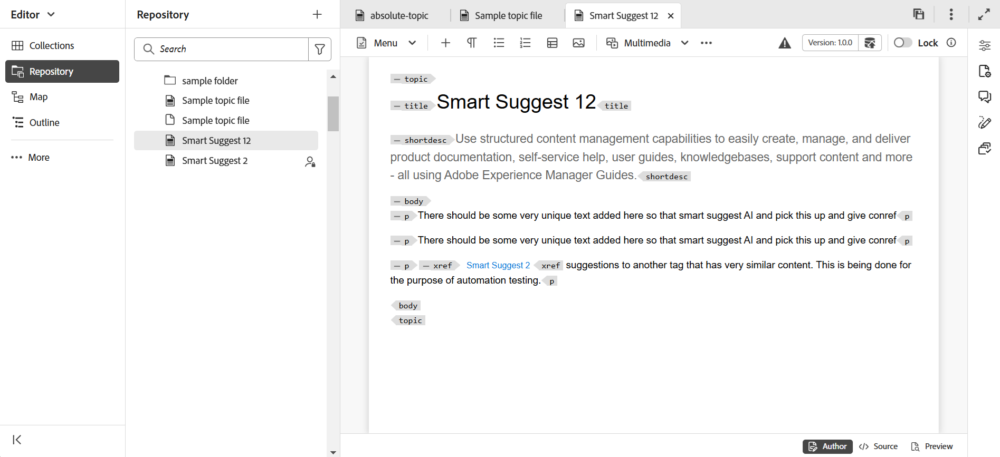

# Neue Funktionen in Version 5.0.0 (März 2025)

Dieser Artikel behandelt die neuen und erweiterten Funktionen, die mit Version 5.0.0 von Adobe Experience Manager Guides eingeführt wurden.

Eine Liste der in dieser Version behobenen Probleme finden Sie unter [Behobene Probleme in Version 5.0.0](../release-info/fixed-issues-5-0-0.md).

Erfahren Sie mehr [Upgrade-Anweisungen für Version 5.0.0](../release-info/upgrade-instructions-5-0-0.md).

## Überarbeitete Experience Manager Guides-Benutzeroberfläche für verbesserte Produktivität und Benutzerfreundlichkeit

Adobe Experience Manager Guides verfügt jetzt über ein überarbeitetes Design und erweiterte Funktionen, mit denen Sie schneller und effizienter als je zuvor arbeiten können. Die neue Benutzeroberfläche bietet ein intuitives und verbessertes Benutzererlebnis mit einer völlig neuen Startseite, einer übersichtlicheren Editor-Symbolleiste, einer dedizierten Kartenkonsole und erweiterten Funktionen.

Die wichtigsten Highlights sind:

- **Einführung in die Startseite**: Experience Manager Guides bietet jetzt eine Startseite, die einen intuitiven Willkommensbildschirm bietet, einschließlich einer Schnellansicht der Dateien, auf die Sie kürzlich zugegriffen haben, der Sammlungen und mehr.

  Weitere Informationen finden Sie unter [Adobe Experience Manager Guides-Startseitenerlebnis](../user-guide/intro-home-page.md).

  {width="800" align="left"}

- **Neues Editor**-Erlebnis: Erleben Sie den Editor jetzt in einem neuen Look-and-Feel. Die überarbeitete Editor-Benutzeroberfläche bietet eine übersichtlichere und besser organisierte Symbolleiste, nahtlose Navigation und ein insgesamt intuitives Erlebnis, damit Dokumente schneller und effizienter erstellt werden können.

  Lernen Sie [Editor-Funktionen kennen](../user-guide/web-editor-features.md).

  {width="800" align="left"}

- **Dedizierte Kartenkonsole**: Einführung in die Kartenkonsole, eine dedizierte Konsole, in der alle Funktionen zur Kartenverwaltung und -veröffentlichung zusammengefasst sind. Jetzt erhalten Sie Optionen zum Generieren von Ausgaben, Übersetzen von Inhalten, Erstellen von Berichten und mehr - alles in einer Benutzeroberfläche.

  Weitere Informationen zu [Kartenverwaltung und -veröffentlichung](../user-guide/map-console-overview.md).

  {width="800" align="left"}

## Integration mit Adobe Workfront für zuverlässige Work-Management-Funktionen

Experience Manager Guides kann jetzt nahtlos in Adobe Workfront integriert werden, sodass Sie zusätzlich zu den zentralen CCMS-Funktionen von Experience Manager Guides auf zuverlässige Projektverwaltungsfunktionen zugreifen können.

Mit dieser Integration können Sie Adobe Workfront-Aufgaben direkt in Experience Manager Guides erstellen und verwalten. Beispielsweise können Sie als Autor eine Prüfungsaufgabe (mit einem oder mehreren hinzugefügten DITA-Themen oder -Karten) direkt in der Experience Manager Guides-Oberfläche erstellen und sie einem Reviewer zuweisen. Als Prüferin bzw. Prüfer können Sie in der Experience Manager Guides-Prüfbenutzeroberfläche zugewiesene Aufgaben bearbeiten und diese mit Kommentaren an die Autorin bzw. den Autor zurückgeben. Ebenso können Sie eine Veröffentlichungs- und Übersetzungsaufgabe erstellen und sie dann den Benutzern zuweisen, die sie bearbeiten müssen.

Die Integration bietet Ihnen auch die Möglichkeit, Ihre Arbeitswarteschlangen zu überwachen und sicherzustellen, dass Sie organisiert bleiben und über alle Ihre Aufgaben (zugewiesene Aufgaben) auf dem Laufenden bleiben. Darüber hinaus können Projektmanager die Leistungsfähigkeit von Adobe Workfront für ein tiefgehendes Projektmanagement in Experience Manager Guides nutzen.

Weitere Informationen finden Sie unter [Workfront-Integration](../user-guide/workfront-integration.md).

{width="800" align="left"}

## Schnellere und skalierbare neue AEM Sites-Publishing-Engine

Erleben Sie eine schnellere und skalierbare Veröffentlichung in AEM Sites mit der völlig neuen Publishing-Engine, die mit der Zuordnung zusammengesetzter Komponenten für eine schnellere Seitenerstellung und -wiedergabe optimiert wurde. Sie ist für neue, im Lieferumfang enthaltene bearbeitbare Vorlagen verfügbar, die mit dem AEM-Vorlageneditor entsprechend Ihren Anforderungen angepasst werden können. Die Vorlagen verwenden eine Mischung aus WCM-Kernkomponenten und spezialisierten Handbüchskomponenten, um sicherzustellen, dass Ihre Endbenutzer das beste Erlebnis auf Ihren AEM Sites-Seiten erhalten. Sie können auch Ihre vorhandenen Vorlagen anpassen, um die Leistungsfähigkeit dieser neuen Publishing-Engine zu nutzen.

Weitere Informationen zur Veröffentlichung von [AEM Sites](../user-guide/generate-output-aem-site-web-editor.md).

{width="500" align="left"}

## Nahtlose Veröffentlichung von eigenständigen Inhalten in AEM Sites mit Veröffentlichung einzelner Themen

Einführung der Veröffentlichung einzelner Themen auf AEM Sites-Seiten, mit der Sie einzelne Themen direkt auf AEM Sites-Seiten veröffentlichen können, ohne eine gesamte Zuordnung veröffentlichen zu müssen.  Dadurch wird der Veröffentlichungsprozess optimiert, was ihn bei der Arbeit mit eigenständigen Inhalten wie Marketing-Inhalten, technischen Bulletins oder anderen eigenständigen Inhalten effizienter macht. Außerdem wird die Inhaltswartung vereinfacht, da keine Karten für die Veröffentlichung einzelner Themen mehr erstellt werden müssen.

Weitere Informationen finden Sie unter [Veröffentlichen von AEM Sites-Seiten](../user-guide/publish-aem-sites.md).

{width="500" align="left"}

## Der völlig neue Markdown-Editor für ein umfangreiches Authoring-Erlebnis

Erleben Sie jetzt eine sauberere, effizientere und leistungsfähigere Möglichkeit, Markdown-Themen zu erstellen. Experience Manager Guides führt eine neue Markdown-Editor-Oberfläche mit einer gut organisierten Symbolleiste und erweiterten Funktionen ein, einschließlich einer **Ansicht** Seite an Seite, um Inhalte gleichzeitig zu erstellen und in der Vorschau anzuzeigen. Außerdem wird die nahtlose Veröffentlichung von Markdown-Themen, die Teil einer Zuordnung sind, auf mehreren Kanälen ermöglicht.

Weitere Informationen finden Sie unter [Markdown-Authoring](../user-guide/web-editor-markdown-topic.md).

{width="800" align="left"}

## Verbesserungen am Editor

Im Rahmen der neuen Version wurden die folgenden Editor-Verbesserungen vorgenommen:

**Verbesserungen beim Einfügen von Tabellen**

- Möglichkeit, die Standardwerte für Kopfzeilen, Textzeilen und Spalten im Dialogfeld „Tabelle“ oder „Einfaches Einfügen“ zu konfigurieren.
- Möglichkeit, die Tabelleneinstellungen so zu konfigurieren, dass aus externen Quellen kopierte Tabellen als einfache Tabelle oder Tabelle eingefügt werden können.

  Weitere Informationen finden Sie im Abschnitt Tabellen in [Kennenlernen der Editor-Funktionen](../user-guide/web-editor-features.md#content-insertion-options).

**Die Funktion für Anzeigenamen für DITA-Elemente wurde verbessert**

Die Funktion für benutzerfreundliche Namen für DITA-Elemente wurde verbessert. Jetzt werden die standardmäßigen Auflistungswerte beibehalten, wenn einem Element ein benutzerfreundlicher Name zugewiesen wird, und der aktualisierte Name wird in Breadcrumbs, Inhaltseigenschaften, dem Bereich für wiederverwendbare Inhalte, dem Glossarbereich und anderen relevanten Speicherorten angezeigt.

**Verbessertes Erlebnis für gefilterte Suchen**

Die maximale Anzahl der Asset-Anzeigen für gefilterte Suchergebnisse im Adobe Experience Manager Guides-Repository wurde erhöht. Die Suchergebnisse geben jetzt alle relevanten Assets oder Dateien zurück, die den Suchkriterien entsprechen. Sie können durch die Liste scrollen, um weitere Ergebnisse zu laden, sodass Sie nicht mehr wiederholt nach den erforderlichen Assets suchen müssen.

**Alternativtext für Bilder jetzt als Element hinzugefügt**

Bilder verwenden jetzt das `<alt>`-Element für alternativen Text gemäß den neuesten DITA-Standards. Die Verwendung `@alt` Attributs für alternativen Text wird nicht mehr unterstützt, wird aber in früheren DITA-Versionen weiterhin unterstützt.

**Anpassen von Querverweisen in der Editor-Symbolleiste**

Erstellen Sie jetzt eine benutzerdefinierte Symbolleistenschaltfläche für **Querverweis**, um direkt auf eine der Menüoptionen zuzugreifen. Sie können diese Option beispielsweise so konfigurieren, dass sie je nach Anforderung direkt zu einem Weblink, E-Mail-Link, Dateiverweis oder einer anderen verfügbaren Option springt.

Weitere Informationen finden Sie unter [Anpassen der Symbolleiste und der Symbolleiste](../guides-ui-extensions/customisations/toolbar-topbar.md).

## Verbesserungen bei Überprüfungen

Im Rahmen der neuen Version wurden die folgenden Verbesserungen vorgenommen:

- Beim Erstellen einer Prüfungsaufgabe können Sie jetzt einen Projektnamen eingeben, um sie schnell zu finden und in der Dropdown-Liste Projekt auszuwählen. Diese Verbesserung macht es überflüssig, lange Projektlisten zu durchlaufen, wodurch die Zuweisung von Prüfungsaufgaben schneller und effizienter wird, insbesondere bei der Verwaltung mehrerer Projekte.

- In der Editor- und Überprüfungs-Benutzeroberfläche unterstützt das Feld **Antwort** jetzt mehrzeilige Einträge. Sie können **Umschalt**+**Eingabetaste** verwenden, um zur nächsten Zeile zu wechseln. Sie können das Kommentarfeld auch erweitern, während Sie den Kommentar schreiben.

  Weitere Informationen finden Sie unter [Themen ](../user-guide/review-topics.md).

- Jetzt können Autorinnen und Autoren auf die Überprüfungskommentare im Editor zugreifen, selbst wenn die Überprüfungsaufgabe als geschlossen markiert ist. Mit den neuesten Verbesserungen bietet das Überprüfungsbedienfeld sowohl aktive als auch geschlossene Überprüfungsaufgaben für jedes Projekt im Editor. Wenn Sie eine geschlossene Prüfungsaufgabe auswählen, werden die entsprechenden Kommentare im Kommentarbereich auf der rechten Seite angezeigt, sodass Sie auch nach dem Schließen einer Aufgabe kontinuierlich auf wichtige Prüfungskommentare zugreifen können.

  Weitere Informationen finden Sie im Überprüfungsabschnitt von [Kennenlernen der Editor-Funktionen](../user-guide/web-editor-features.md).

## Verbesserungen beim Veröffentlichen

Im Rahmen der neuen Version wurden die folgenden Veröffentlichungsverbesserungen vorgenommen:

**Verbesserungen am nativen PDF**

- Möglichkeit, beim Generieren der nativen PDF-Ausgabe die Metadaten aus dem `prolog` eines Themas wie Copyright, Autor und andere Details in die Seiten-Layouts einzuschließen. Dadurch wird sichergestellt, dass die generierten PDFs detaillierter sind und einen wesentlichen Kontext bieten, wodurch sie für den Leser informativer werden.

  Weitere Informationen finden Sie unter [Hinzufügen von Feldern und Metadaten im Seiten-Layout](../native-pdf/design-page-layout.md#add-fields-and-metadata-add-fields-metadata).

  {width="300" align="left"}

- Es wurde eine Option zum Aktivieren oder Deaktivieren der DITA-OT-Vorverarbeitung für die native PDF-Ausgabe eingeführt. Aktivieren Sie diese Option, wenn Ihr Inhalt während der Verarbeitung eine DITA-OT-basierte Normalisierung oder benutzerdefinierte DITA-OT-Plug-ins erfordert. Dadurch erhalten Sie mehr Kontrolle darüber, wie Inhalte für die PDF-Generierung verarbeitet werden. Standardmäßig ist die Einstellung auf &quot;**&quot;**.

  Weitere Informationen finden Sie unter [Arbeiten mit der PDF-Ausgabevorgabe](../user-guide/generate-output-pdf.md)

  {width="500" align="left"}

- Die Druckeinstellungen für die native PDF-Ausgabegenerierung wurden aus der Einstellung **Vorlagen** in die **native PDF-**) verschoben, um die Benutzerfreundlichkeit zu verbessern. Sie können jetzt dieselbe Vorlage für Online- und Druck-PDFs mit verschiedenen Druckeinstellungen wie Farbprofil verwenden.

  Weitere Informationen finden Sie unter [Native PDF-Ausgabevorgabe](../web-editor/native-pdf-web-editor.md)

- Möglichkeit zum Hinzufügen eines Lesezeichens für die Inhaltsverzeichnisseite in der nativen PDF-Ausgabe für eine nahtlose Seitennavigation, insbesondere in langen PDF-Dateien.

  Weitere Informationen finden Sie unter [Hinzufügen eines benutzerdefinierten Lesezeichens in der PDF-Ausgabe](../native-pdf/add-custom-bookmark.md).

## Verbesserungen beim Content-Management

Im Rahmen der neuen Version wurden die folgenden Verbesserungen beim Content-Management vorgenommen:

**Benutzerdefinierte Metadatenfelder in Berichten**

Mit dieser Funktion können Sie benutzerdefinierte Metadatenfelder für Berichte über &quot;**&quot;**. Nach der Konfiguration können Sie diese Felder unter **Spalten** im Filterbereich der Berichte anzeigen, wo Sie sie zur Steuerung ihrer Sichtbarkeit auswählen oder die Auswahl aufheben können.

Weitere Informationen finden Sie im [DITA-Zuordnungsbericht in der Zuordnungskonsole](../user-guide/reports-web-editor.md).

**Schaltfläche „Aktualisieren“ in der Übersetzungs-Benutzeroberfläche**

Neu in der Übersetzungs-Benutzeroberfläche ist die Schaltfläche Aktualisieren, mit der Sie das Übersetzungs-Dashboard mit aktualisierten Dateien und Status aktualisieren können.

**Verbesserung des Asset-Nachbearbeitungs-Workflows**

Die Unterstützung für die Asset-Nachbearbeitung wurde über die REST-API sowie die -API SDK bereitgestellt. Jetzt wird das Asset-Verarbeitungsereignis ausgelöst und kann überwacht werden, um weitere Workflows zu definieren.

Weitere Informationen finden Sie unter [Ereignishandler nach der Verarbeitung](../api-reference/post-process-event.md).

## Veraltete Funktionen

**Quick Generate**

Experience Manager Guides unterstützt die Funktion **Schnellgenerieren** nicht mehr, um Ausgaben direkt aus der Repository- oder Zuordnungsansicht zu generieren.

Diese Funktion wurde sowohl aus dem Repository- als auch aus der Zuordnungsansicht entfernt. Es wird empfohlen, die **Map-Konsole** für alle Zuordnungsverwaltungs- und Veröffentlichungsaktionen zu verwenden.

Weitere Informationen finden Sie unter [Zuordnungsverwaltung und -veröffentlichung](../user-guide/map-console-overview.md).

**Übergeben Sie Metadatenargumente für die Stammzuordnung an die DITA-OT-Befehlszeile**

Die Möglichkeit, Metadatenargumente für die Stammzuordnung über die DITA-OT-Befehlszeile zu übergeben, wird als Teil der Version nicht mehr unterstützt. Es wird jetzt empfohlen, das Feld **Dateieigenschaft** oder **Metadaten** in der Voreinstellung zu verwenden, um die erforderlichen DITA-OT-Metadaten zu übergeben.

Um die Metadaten weiterhin in der DITA-OT-Befehlszeile zu übergeben, müssen Sie die `pass.metadata.args.cmd.line` im `Config.Manager` aktualisieren.

Weitere Informationen finden Sie unter [Einstellungen für die Ausgabenerstellung konfigurieren](../cs-install-guide/conf-output-generation.md#configure-the-dita-ot-command-line-argument-field-to-accept-root-map-metadata).
