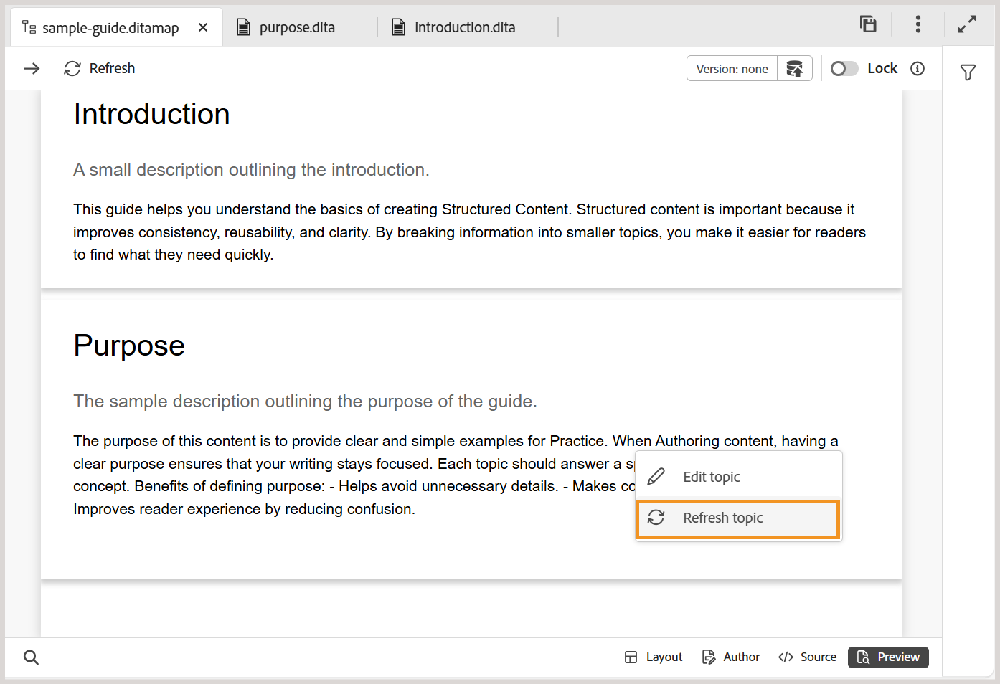
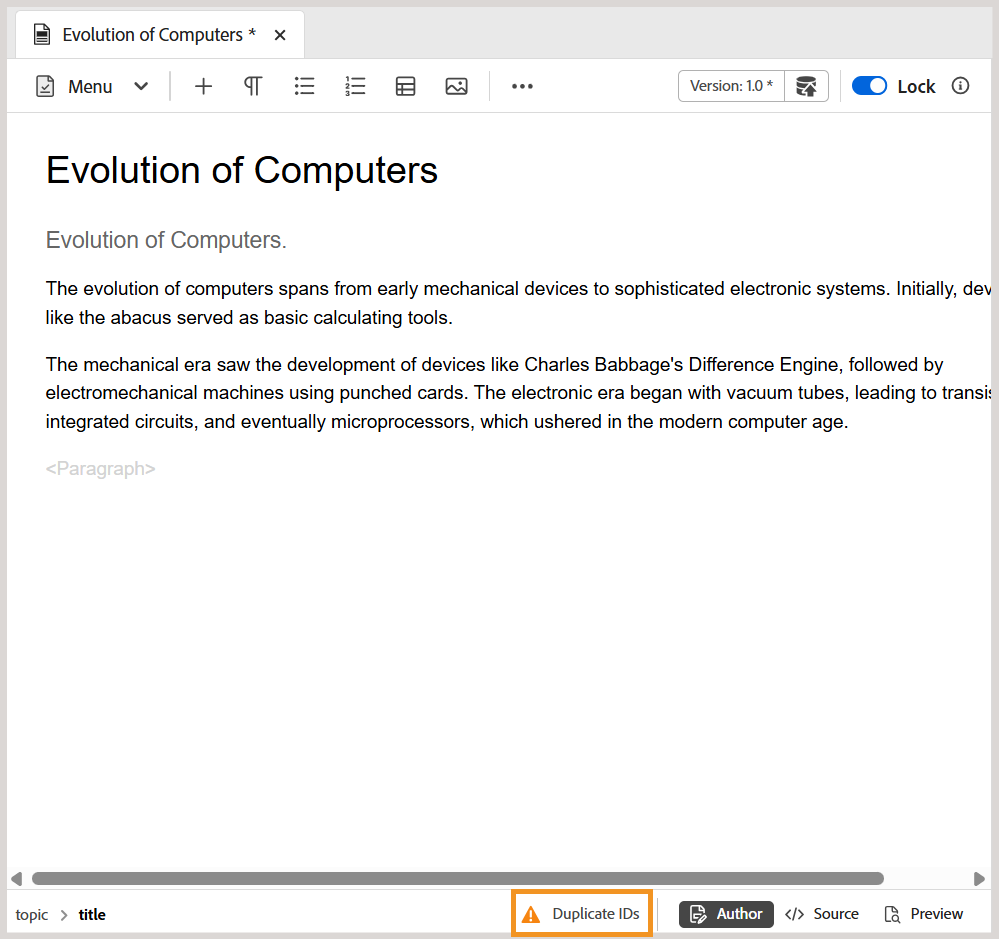

# Neue Funktionen in Version 5.2.0 (Mai 2026)

Dieser Artikel behandelt die neuen und erweiterten Funktionen, die mit Version 5.2.0 von Adobe Experience Manager Guides as a Cloud Service eingeführt wurden.

Eine Liste der in dieser Version behobenen Probleme finden Sie unter [Behobene Probleme in Version 5.2.0](../release-info/fixed-issues-5-2-0.md).

Erfahren Sie mehr [Upgrade-Anweisungen für Version 5.2.0](../release-info/upgrade-instructions-5-2-0.md).

## Einführung in Editor 2.0

Editor 2.0 (auch als „Neuer Editor“ bezeichnet) bietet vereinfachtes Authoring, sodass Sie Inhalte durch ein intuitiveres Erlebnis sowohl im Tag- als auch im Nicht-Tag-Modus effizienter erstellen können. Die -Version bietet eine verbesserte Leistung durch schnelleres Laden von Seiten und eine reibungslosere Bearbeitung selbst für große und komplexe Themen. Außerdem wird durch die Schließung wichtiger Authoring-Lücken, insbesondere im Bereich Navigation und Cursor-Verhalten, die Stabilität verbessert. Darüber hinaus bietet eine moderne Benutzeroberfläche eine aktualisierte und benutzerfreundliche Benutzeroberfläche, die Funktionalität und Benutzerfreundlichkeit in Einklang bringt. Weitere Informationen finden Sie unter [Einführung in den Editor](../user-guide/web-editor.md).

Im Folgenden finden Sie ein Übersichtsvideo zu den Funktionen von Editor 2.0.

>[!VIDEO](https://video.tv.adobe.com/v/3484007)

Im Folgenden finden Sie Verbesserungen, die das Authoring einfacher und effizienter machen.

### Neu gestaltete Benutzeroberfläche und Erlebnis

Eine aktualisierte Benutzeroberfläche verbessert die allgemeine Benutzerfreundlichkeit, wodurch die Navigation und Inhaltserstellung intuitiver und konsistenter werden.

- **Umfassenderes CSS für Elemente im Autoren- und Vorschaumodus**: Das erweiterte standardmäßige CSS für Elemente bietet einen verbesserten Stil und eine bessere visuelle Konsistenz sowohl für den Autoren- als auch für den Vorschaumodus.

  {width="650"}

- **Unterstützung dunkler Designs**: Die Unterstützung für dunkle Designs im Inhaltsbearbeitungsbereich verbessert das Authoring-Erlebnis für Benutzende, die lieber mit einer dunklen Oberfläche arbeiten.

  {width="650"}

- **Konsolidierte Editor-Einstellungen auf Benutzerebene**: Ein neues zentralisiertes Einstellungsbedienfeld, das Autorinnen und Autoren eine bessere Kontrolle über das Editor-Verhalten bietet, sodass Benutzerinnen und Benutzer Voreinstellungen leichter von einem einzigen Ort aus verwalten können. Zu den Konfigurationsoptionen gehören die Möglichkeit, Folgendes zu aktivieren/deaktivieren:

   - Geschützte Leerzeichen im Autorenmodus
   - Einstellungen für die Tag-Sichtbarkeit mit oder ohne Attribute
   - XML-Kommentare im Autorenmodus
   - Menü „Schnelleinfügung“ zum Einfügen von Elementen im Editor

  {width="350"}

  Weitere Informationen zum Konfigurieren der Editor-Einstellungen finden Sie unter [Editor-Einstellungen](../user-guide/config-editor-settings.md).

- **Bessere Darstellung bedingter Inhalte im Autorenmodus**: Bedingte Inhalte werden im Autorenmodus klarer angezeigt, sodass Autoren Varianten besser identifizieren und verwalten können. Weitere Informationen finden Sie [Bedingungen](../user-guide/web-editor-left-panel.md#conditions) im linken Editor-Bereich.

  {width="650"}

### Verbesserte Authoring-Funktionen

Bietet verbesserte Tools und Flexibilität, um die Erstellung und Bearbeitung von Inhalten zu optimieren.

- **Attribute zusammen mit Elementen im Tag-Modus anzeigen**: Autoren können jetzt Elementattribute mit dem Tag-Modus anzeigen, was eine bessere Sichtbarkeit und Kontrolle über strukturierte Inhalte bietet. Um diese Funktion zu konfigurieren, rufen Sie [Editor-Einstellungen](../user-guide/config-editor-settings.md) auf.

  {width="650"}

- **Menü „Schnelleinfügung**: Ermöglicht das direkte Hinzufügen von Elementen während der Bearbeitung im Autorenmodus an der Cursorposition, ohne zur Symbolleiste zu navigieren. Häufig verwendete Elemente können auch im Abschnitt Favoriten über die Editor-Einstellungen konfiguriert werden, um den Zugriff zu beschleunigen. Weitere Informationen finden Sie unter [Themen bearbeiten](../user-guide/web-editor-edit-topics.md).

  {width="650"}

- **Anzeige, Bearbeitung und Einfügen von XML-Kommentaren im Autorenmodus**: Ermöglicht es Autoren, XML-Kommentare direkt im Autorenmodus anzuzeigen, zu bearbeiten und einzufügen, um die Sichtbarkeit innerhalb des Inhalts zu verbessern. Um diese Funktion zu konfigurieren, rufen Sie [Editor-Einstellungen](../user-guide/config-editor-settings.md) auf.

  {width="650"}

- **Nebeneinander-Modus**: Ermöglicht die gleichzeitige Anzeige des Authoring- und Source-Modus, wobei beide Ansichten perfekt synchronisiert bleiben, um Inhaltsänderungen leichter vergleichen, bearbeiten und validieren zu können. Weitere Informationen finden Sie unter [Editor-Ansichten](../user-guide/web-editor-views.md).

  {width="650"}

- **Verbessertes Tabellen-Authoring**: Verbessert das allgemeine Erlebnis beim Erstellen von Tabellen durch intuitivere und effizientere Interaktionen beim Erstellen und Verwalten von Tabellen.

   - Fließende und intuitive Interaktionen: Einfaches Einfügen von Zeilen und Spalten sowie Drag-and-Drop-Unterstützung für die Neuanordnung von Zeilen und Spalten.
   - Kontextuelle Symbolleiste : Greifen Sie auf tabellenspezifische Aktionen wie Formatierung, Ausrichtung, Zusammenführung und andere zusätzliche Aktionen direkt in der Tabelle zu.
   - Konfigurieren von Tabellen: Mehrere Zeilen oder Spalten in einer Aktion hinzufügen, wodurch sich wiederholende Schritte reduzieren und die Effizienz verbessert wird.

  {width="650"}

  Weitere Informationen finden Sie unter [Arbeiten mit Tabellen](../user-guide/web-editor-other-features.md#work-with-tables-in-the-new-editor).

### Verbesserte Leistung bei großen Themen

Der neue Editor verbessert das Erlebnis bei der Arbeit mit großen und komplexen Themen durch schnelleres Rendern von Inhalten, zuverlässigere Funktionen zum Rückgängigmachen und Wiederholen und eine unsaubere Markierung, um nicht gespeicherte Änderungen deutlich anzuzeigen.

## Einführung des neuen Repositorys auf der Startseite und verbessertes Sucherlebnis

Das Repository, auf das jetzt direkt über die Startseite zugegriffen werden kann, dient als zentralisierter Bereich für eine verbesserte Auffindbarkeit von Ordnern und Dateien. Es bietet einen speziellen **Ordner-Navigationsbereich** und eine anpassbare **Tabellenansicht des Repositorys**. Das überarbeitete Such- und Filtererlebnis erleichtert das Suchen und Auffinden von Dateien erheblich. Weitere Informationen finden Sie unter [Kennenlernen der Repository-Oberfläche](../user-guide/home-page-repository-view.md).

{align="left"}

Im -Editor ist das Erlebnis Suchen und Filtern nach Dateien jetzt mit der Startseite konsistent. Ein neues [Suchfeld](../user-guide/search-panel-explorer.md), das sich unten in der Editor-Benutzeroberfläche befindet, wird eingeführt, um Suchergebnisse anzuzeigen. Darüber hinaus wird das Repository jetzt im Editor in **Explorer** umbenannt, sodass Sie Ordner und Dateien wie zuvor durchsuchen können.

{align="left"}

### Unterstützung für den Dokumentstatusfilter

Sie können Ihre Repository-Suchergebnisse auch nach dem aktuellen Dokumentstatus der Dateien filtern. Mit dem Filter Dokumentstatus können Sie Ihre Suche mithilfe der verfügbaren Filterwerte eingrenzen, die in der `ui_config.json` in Ihrem Ordnerprofil definiert sind.

{align="left"}

Die für den Status des Dokuments verfügbaren Standardfilterwerte sind: Entwurf, Bearbeiten, In-Überprüfung, Genehmigt, Überprüft und Fertig.

<!-- For details on customizing the default document state filters values, view [Configure document state filters](../install-conf-guide/conf-doc-state-filters.md).  -->

>[!NOTE]
>
> Wenn Sie benutzerdefinierte Einstellungen für verwenden, `ui_config.json` Sie sicherstellen, dass Sie diese vor dem Upgrade sichern. Überprüfen und passen Sie Ihre Einstellungen nach der Aktualisierung entsprechend den Änderungen an, die in der neuesten Version eingeführt wurden.

### Miniaturbildsymbol für Multimedia

Alle Multimedia-Dateien werden mit Miniaturansichtssymbolen angezeigt, wodurch die visuelle Identifizierung und Suche von Bildern im **Repository)** wird. Diese Verbesserung gilt auch für die Suche nach Dateien im **Suchbereich**, sodass Sie Multimedia-Assets schnell von anderen Dateitypen unterscheiden können.

{align="left"}

## Einführung in den Source-Suchmodus in Suchen und Ersetzen

Experience Manager Guides hat verschiedene Verbesserungen an der Funktion Suchen und Ersetzen eingeführt, die im linken Bereich der Editor-Benutzeroberfläche verfügbar ist. Neben einer verbesserten Benutzeroberfläche für bessere Benutzerfreundlichkeit führt diese Version einen neuen Umschalter **Quellmodus verwenden** im Bedienfeld **Suchen und Ersetzen** ein.

Wenn dieser Modus aktiviert ist, können Sie eine globale Suche nicht nur nach dem sichtbaren Inhalt durchführen, sondern auch nach dem zugrunde liegenden Quellinhalt (XML-Struktur, einschließlich Elementen, Tags und Attributwerten) für die gesuchte Zeichenfolge. Dieser Modus stellt eine umfassende Suche über den gesamten Inhalt hinweg sicher.

{width="650" align="left"}

In diesem Modus können Sie Filter anwenden, um Ihre Suche nach Dateityp, Dokumentstatus, Datum der letzten Änderung und mehr einzugrenzen. Sie haben außerdem die Möglichkeit, nach Durchführung des Vorgangs „Alle ersetzen“ einen detaillierten CSV-Bericht herunterzuladen, der einen Schnappschuss aller durchgeführten Ersetzungsaktionen zusammen mit ihrem Erfolgs- und Fehlerstatus enthält.

Weitere Informationen finden Sie im Abschnitt [Suchen und Ersetzen](../user-guide/web-editor-left-panel.md#find-and-replace) unter _Linkes Bedienfeld im Editor_.

>[!NOTE]
>
> Für **Funktion „Quellmodus verwenden** im Bedienfeld „Suchen und Ersetzen“ muss die Neuindizierung zuerst abgeschlossen werden.

## Verbessertes Erlebnis beim Durchsuchen von Dateien und Ordnern

Diese Version bietet eine übersichtlichere, intuitivere Benutzeroberfläche zum Durchsuchen von Dateien und Ordnerpfaden in Experience Manager Guides.

Beim Durchsuchen von Dateien bietet das neu gestaltete Dialogfeld **Datei auswählen** jetzt ein Layout mit Registerkarten mit zwei Ansichten - **Repository** zum Navigieren im gesamten Inhalts-Repository in einem tabellarischen Format und **Sammlungen** für den schnellen Zugriff auf häufig verwendete Themen, Karten und Bilder.

{width="650" align="left"}

Zu den wichtigsten Verbesserungen gehören:

- Tabellenansicht von Dateien und Ordnern für die organisierte Navigation.
- Breadcrumbs und Ordnernavigationsfenster zum einfachen Durchsuchen der Ordner.
- Unterstützung für die Auswahl mehrerer Dateien für wiederverwendbare Inhalte, Themenreferenzen, Schematron, Ausgabevorgaben (mit DITAVAL) und Workfront.
- Vorschau ausgewählter Dateien zur einfachen Überprüfung; für mehrere Auswahlen sollten Sie alle Dateien in der Vorschau anzeigen und alle Dateien nach Bedarf aus dem Bedienfeld „Vorschau“ entfernen.
- Such- und Filteroptionen zur Eingrenzung der Ergebnisse nach Name, Titel, Dateityp, Dokumentstatus und Tags.

Das **Pfad auswählen**-Dialogfeld bietet außerdem eine verbesserte baumstrukturierte Ansicht für die Ordnernavigation, die eine übersichtlichere und effizientere Methode zur Auswahl von Pfaden im gesamten Inhalts-Repository gewährleistet.

{width="350" align="left"}

Weitere Informationen finden Sie [&#x200B; Abschnitt „Durchsuchen von Dateien und Ordnern in &#x200B;](../user-guide/web-editor-other-features.md#browse-files-and-folders-in-experience-manager-guides)&quot; unter _Weitere Funktionen im Editor_.

## Verbesserungen bei der Inhaltserstellung

Im Rahmen dieser Version wurden die folgenden Authoring-Verbesserungen vorgenommen:

### Greifen Sie auf den Pfad und die UUID von Verweisen in Dateien über das Bedienfeld Inhaltseigenschaften zu

Jetzt können Sie **Link-Pfad** verwenden, um den relativen Pfad der ausgewählten Referenz anzuzeigen, und **Link-UUID**, um die eindeutige Kennung im Bedienfeld Inhaltseigenschaften anzuzeigen. Sie können auch den vollständigen absoluten Pfad und die zugehörige UUID direkt aus der Benutzeroberfläche kopieren, indem Sie die Symbole neben Link-Pfad und Link-UUID verwenden. Dies erleichtert das Nachverfolgen und Wiederverwenden verknüpfter Assets.

Weitere Informationen finden Sie unter [Inhaltseigenschaften](../user-guide/web-editor-right-panel.md#content-properties).

### Arbeitskopie-Indikator für Metadatenänderungen

Bei allen Änderungen an den Metadatenfeldern, die unter **Dateieigenschaften** verfügbar sind oder auf das Backend angewendet werden, wird in der Dokumentversion auch das Sternchen (*) mit einem Trigger versehen. Eine Dokumentversion wird jedes Mal als _dirty (*)_ markiert, wenn Sie standardmäßige oder benutzerdefinierte Metadatenfelder hinzufügen, löschen oder ändern. Um zu verhindern, dass systemgenerierte Metadatenaktualisierungen diese Anzeige beeinflussen, können Admins eine Ignorieren-Liste für Metadateneigenschaften konfigurieren. Weitere Informationen zum Konfigurieren von Metadateneigenschaften finden Sie unter [Konfigurieren der Ignorieren-Liste von Metadateneigenschaften](../install-conf-guide/conf-metadata-prop.md).

### Verbesserungen des Bedienfelds „Schematron-Validierung“

Die folgenden Verbesserungen der Schematron-Benutzeroberfläche wurden vorgenommen, um Klarheit, Benutzerfreundlichkeit und Validierungsergebnisse zu verbessern:

- Im Validierungsfenster wird eine Meldung mit leerem Status angezeigt, wenn keine Schematron-Datei hinzugefügt wird, was für eine bessere Klarheit und Richtung bei den nächsten Schritten sorgt.

  {width="350" align="left"}

- Wenn mehrere Schematron-Dateien hinzugefügt werden, werden sie unter einem konsolidierten Akkordeon organisiert, was eine bessere Sichtbarkeit der konfigurierten Schematron-Dateien bietet.

  {width="350" align="left"}

- Basierend auf dem in der Schematron-Datei definierten Rollenattribut werden die Validierungsergebnisse jetzt wie folgt kategorisiert: `Fatal`, `Error`, `Warn` oder `Info`. Jede Kategorie enthält eine sichtbare Anzahl sowie eine kontextuelle QuickInfo für eine klarere Interpretation.

  {width="350" align="left"}

Weitere Informationen zur Verwendung von Schematrondateien in Experience Manager Guides finden Sie unter [Unterstützung für Schematrondateien](../user-guide/support-schematron-file.md).

### Sprachkopien für Übersetzungen sind jetzt im rechten Bedienfeld der Editor-Benutzeroberfläche verfügbar

Im rechten Bereich unter **Dateieigenschaften** *ist jetzt ein neuer Abschnitt*&#x200B;Übersetzungen“ verfügbar. Dieser Abschnitt bietet direkten Zugriff auf alle verfügbaren Sprachkopien für das aktuell geöffnete Asset (Karte, Thema, Bild usw.). Sie müssen nicht mehr zur Assets-Benutzeroberfläche navigieren, um diese Sprachkopien anzuzeigen oder darauf zuzugreifen.

{width="350" align="left"}

Für jede Sprachkopie können Sie den Mauszeiger über die Datei bewegen, um deren Pfad im Repository zu suchen, oder sie einfach auswählen, um sie im Editor zu öffnen. Neben dem Öffnen von Dateien können Sie auch viele Aktionen über das Menü **Optionen** ausführen. Zu den Aktionen, die Sie ausführen können, gehören Bearbeiten, Vorschau, UUID kopieren, Pfad kopieren, Zu Sammlungen hinzufügen und Eigenschaften.

Weitere Informationen finden Sie unter [Rechtes Bedienfeld im Editor](../user-guide/web-editor-right-panel.md#file-properties).

### Themen oder Zuordnung im Vorschaumodus aktualisieren

>[!NOTE]
>
>Dieses Verhalten gilt nur für den alten Editor. Im neuen Editor wird der Vorschauinhalt automatisch aktualisiert.

Einführung der neuen **Aktualisieren**-Funktion für Karten, die bereits im Vorschaumodus geöffnet sind. Mit dieser neuen Funktion können Sie den Inhalt der gesamten Karte oder einzelner darin vorhandener Themen einfach aktualisieren.

- Um die gesamte Karte (einschließlich aller Themen) zu aktualisieren **wird oben links im Editor eine neue Schaltfläche** Aktualisieren“ angezeigt.

  {width="600" align="left"}

- Um den Inhalt einzelner Themen zu aktualisieren, wird **neue Option** Thema aktualisieren“ im Kontextmenü eingeführt.

  {width="600" align="left"}

Weitere Informationen finden Sie unter [Funktionen des Zuordnungs-Editors](../user-guide/map-editor-advanced-map-editor.md).

### Wortzahl für Themen und Karten

Sie können jetzt die Wortzahl in einer Zuordnungs- oder Themendatei verfolgen. Das neue Feld **Wortzahl** im rechten Bereich würde die Gesamtzahl der Wörter innerhalb eines Themas (oder einer Karte) anzeigen, wobei Wörter, die durch Leerzeichen getrennt sind, als einzelne Wörter gezählt werden. Es wird jedes Mal automatisch aktualisiert, wenn Sie Änderungen speichern. Bei Querverweisen ist nur der Anzeigetext enthalten, während Schlüssel ausgeschlossen sind.

{width="350" align="left"}

Weitere Informationen finden Sie unter [Rechtes Bedienfeld im Editor](../user-guide/web-editor-right-panel.md#file-properties).

### Einfaches Identifizieren und Korrigieren doppelter IDs in Themen und Zuordnungen in der Autorenansicht

Experience Manager Guides enthält jetzt die Schaltfläche **Duplizierte IDs** im Editor, mit der Sie doppelte IDs, die in einem einzelnen Thema oder einer Zuordnung vorhanden sind, schnell identifizieren und beheben können. Wenn doppelte IDs erkannt werden, wird diese Schaltfläche in der Ansicht **Autor“ in der linken unteren Ecke** Editor-Benutzeroberfläche angezeigt. Nach Auswahl der Schaltfläche wird eine Liste aller Instanzen mit doppelten IDs in einem Pop-up angezeigt. Wenn Sie eine Instanz auswählen, wird der entsprechende Inhalt im Thema oder in der Karte hervorgehoben, sodass Sie die doppelten IDs im rechten Bedienfeld finden und korrigieren können.

Weitere Informationen finden Sie unter [Zusätzliche Funktionen im Editor](../user-guide/web-editor-other-features.md).

{width="350" align="left"}

### Verbesserungen der Repository- und Berichtsfilter

Der Filter **Gesperrt von** unter den erweiterten Filtern im Repository und **Autor**-Filter in den DITA-Zuordnungsberichten laden Benutzerlisten nun schrittweise beim Scrollen, anstatt alle auf einmal. Diese paginierte Ladung verbessert die Geschwindigkeit und macht das Arbeiten mit großen Benutzerdatensätzen effizienter und nahtloser.

### Zitate in allen Journalfeldern suchen

Sie können jetzt Zitate in allen Journalfeldern wie *Titel*, *Journaltitel*, *Autor*, *Jahr*, *Volumen*, *Anzahl* und *Seiten* mithilfe der Option **Beliebiges Feld** im Dialogfeld **Zitat hinzufügen** durchsuchen. Die Suche gibt das Zitat zurück, das dem eingegebenen Text am nächsten kommt.

Weitere Informationen zum Hinzufügen von Zitaten in Experience Manager Guides finden Sie unter [Hinzufügen und Verwalten von Zitaten in &#x200B;](../user-guide/web-editor-apply-citations.md).

{width="350" align="left"}

### Settings wird jetzt in Workspace Settings umbenannt und kann von der Startseite aus aufgerufen werden

Um die Navigation und die Benutzerfreundlichkeit zu verbessern, wurden die folgenden Verbesserungen eingeführt:

- **Einstellungen** im Menü **Mehr Aktionen** im Editor wurde in **Workspace-Einstellungen“**.
- Das Menü **Mehr Aktionen** (das Dreipunkt-Menü), das zuvor nur in der Benutzeroberfläche der Editor- und Zuordnungskonsole verfügbar war, ist jetzt über die [Homepage](../user-guide/intro-home-page.md) zugänglich.

  

### Verbesserte Indizierung für Smart-Vorschläge im KI-Assistenten

Sie können jetzt den Status jedes Indizierungsversuchs für Smart-Vorschläge im KI-Assistenten mit neuen Statusindikatoren einfach verfolgen: Indizierung abgeschlossen, Nicht synchronisiert, In Bearbeitung und Indizierung fehlgeschlagen. Der letzte Zeitstempel der Indizierung wird jetzt auf Ordnerprofilebene aufgezeichnet, um die Rückverfolgbarkeit zu verbessern. Darüber hinaus werden Beschränkungen für übergeordnete und untergeordnete Ordner erzwungen, wenn ein Ordner oder ein Dateipfad für die Indizierung angegeben wird.

Weitere Informationen finden Sie unter [Konfigurieren des KI-Assistenten für intelligente Hilfe und Authoring](../install-conf-guide/conf-profiles.md#configure-ai-assistant-for-smart-help-and-authoring-only-for-cloud-service).

## Verbesserungen bei Überprüfungen

Im Rahmen dieser Version wurden die folgenden Verbesserungen vorgenommen:

### Automatisierte Erinnerungen für Prüfungsaufgaben

Sie können jetzt **automatische Erinnerungen** aktivieren, um AEM-Benachrichtigungen und E-Mail-Erinnerungen für Prüfer zu planen, und zwar sowohl vor als auch nach dem Fälligkeitsdatum einer Prüfungsaufgabe. Sie können jeweils mehrere Erinnerungen konfigurieren, wobei überfällige Erinnerungen in einer definierten Reihenfolge gesendet und überfällige Erinnerungen ausgelöst werden, nachdem die Aufgabe basierend auf dem konfigurierten Erinnerungszeitplan als überfällig markiert wurde. Weitere Informationen finden Sie unter [Senden von Themen zur Überprüfung](../user-guide/review-send-topics-for-review.md).

### Versionsverlauf

Reviewer können jetzt auf den Versionsverlauf für zu überprüfende Themen zugreifen, sodass sie zuvor überprüfte und aktualisierte Versionen desselben Themas in vorherigen Prüfungsaufgaben anzeigen und vergleichen können. Auf diese Weise können Validierungsverantwortliche Änderungen, die seit früheren Überprüfungszyklen vorgenommen wurden, validieren und die Kontinuität gewahrt werden, indem sie Kommentare, Beschriftungen und andere zugehörige Details im aktuellen Überprüfungskontext überprüfen. Weitere Informationen finden Sie unter [Versionsverlauf für den Reviewer](../user-guide/review-topics.md#version-history-for-the-reviewer).

### Zugriff auf den Status von Prüfungsaufgaben direkt über das Prüfungsfeld

Als Initiator einer Prüfungsaufgabe können Sie jetzt den Status Ihrer Prüfungsaufgabe direkt im Bedienfeld Überprüfen überprüfen. Mit den neuesten Verbesserungen enthält das Dialogfeld **Aufgabe aktualisieren** im Prüfungsbereich eine neue Option **Prüfungsstatus**. Wenn Sie diese Option auswählen, gelangen Sie direkt zum Überprüfungs-Dashboard, wo Sie den Aufgabenstatus aller Reviewer einsehen können. So können Sie schneller auf den Aufgabenfortschritt zugreifen, ohne den Kontext wechseln zu müssen.

Weitere Informationen finden Sie unter [Anfordern einer erneuten Überprüfung oder Schließen einer Prüfungsaufgabe als Autor](../user-guide/review-close-review-task.md).

{width="350" align="left"}

### Zuweisung an Prüfer basierend auf aktiver Projektauswahl

- Das Zuweisen eines Reviewers zu einer Prüfungsaufgabe hängt jetzt von einer aktiven Projektauswahl ab. Das Feld **Zuweisen zu** auf der Seite *Prüfungsaufgabe erstellen* bleibt deaktiviert, bis ein aktives Projekt ausgewählt wird. Nachdem ein Projekt ausgewählt wurde, wird das **Zuweisen an** aktiviert und listet nur die mit diesem Projekt verknüpften Benutzer und Benutzergruppen auf. Dadurch wird sichergestellt, dass Prüfungsaufgaben nur gültigen Projektmitgliedern zugewiesen werden, und eine unbeabsichtigte Auswahl von Prüfern verhindert.

  

- Das Feld **Zuweisen an** unterstützt jetzt die Suche mit automatischer Textvervollständigung, sodass Sie Benutzer oder Benutzergruppen schnell durch Eingabe von Text finden können.

Zusammen machen diese Verbesserungen die Auswahl der Prüfer präziser, effizienter und besser auf die projektspezifischen Prüfungs-Workflows abgestimmt.

Weitere Informationen finden Sie unter [Themen zur Überprüfung senden](../user-guide/review-send-topics-for-review.md).

### Laufende Prüfungsaufgaben ändern

Sie können neue Themen zu einer laufenden Prüfungsaufgabe hinzufügen (wenn sie nicht zuvor zur Überprüfung gesendet wurden) oder Themen aus einer laufenden Prüfungsaufgabe entfernen, ohne den Prüfungs-Workflow zu beeinflussen. Auf der Seite **Aufgabendetails** können Sie einfach Themen auswählen oder die Auswahl aufheben, um die Themenliste zu ändern. Reviewer werden (über AEM und E-Mail) über Änderungen an ihren zugewiesenen Themen durch AEM- und E-Mail-Benachrichtigungen benachrichtigt. Weitere Informationen finden Sie unter [Themen zur Überprüfung senden](../user-guide/review-send-topics-for-review.md).

{width="650" align="left"}

## Verbesserungen an der Übersetzung

Im Rahmen dieser Version wurden die folgenden Übersetzungsverbesserungen vorgenommen:

### Indikator für nicht versionierte Assets, die zur Übersetzung gesendet werden

Bei der Verwaltung von Übersetzungen ist es wichtig sicherzustellen, dass alle Inhalte versioniert werden, bevor sie zur Verarbeitung gesendet werden. Um Ihnen dabei zu helfen, bietet Experience Manager Guides jetzt einen eindeutigen Indikator für Themen, die Änderungen gespeichert haben, aber noch nicht versioniert sind.

Wenn eine Datei nicht versionierte Änderungen enthält (nicht als neue Version in Ihrer Zuordnung gespeichert), wird neben der Datei ein _info_-Symbol angezeigt, das angibt, dass Aktualisierungen vorhanden sind. Um sich schnell auf diese Dateien zu konzentrieren, aktivieren Sie die Option **Nur Assets mit nicht versionierten Änderungen anzeigen** im Bedienfeld Filter .

Weitere Informationen finden Sie unter [Übersetzen von Dokumenten in der Zuordnungskonsole](../user-guide/translate-documents-web-editor.md).

{width="650" align="left"}

## Verbesserungen beim Asset-Management

Diese Version führt die folgenden Verbesserungen beim Asset-Management ein:

### Verwenden Sie die Dateihierarchie reduzieren , um Zuordnungen mit ursprünglichen Dateinamen und zugehörigen Metadaten herunterzuladen.

Jetzt können Sie die Option Dateihierarchie reduzieren verwenden, um eine Zuordnung mit dem ursprünglichen Dateinamen herunterzuladen. Darüber hinaus enthält das heruntergeladene Paket eine `metadata.json`-Datei, sodass die zugehörigen Metadaten außerhalb von Experience Manager Guides einfach zugänglich und wiederverwendbar sind.

Weitere Informationen zum Herunterladen von Dateien in Experience Manager Guides finden Sie unter [Dateien herunterladen](../user-guide/authoring-download-assets.md).

### Metadateneigenschaften für schreibgeschützte Dateien nicht mehr bearbeitbar

Mit dieser Version können Dateieigenschaften nicht mehr bearbeitet werden, wenn die `Disable edit without locking the file` aktiviert ist und sich eine Datei im schreibgeschützten **befindet**.

Diese Einschränkung gilt für alle Einstiegspunkte, an denen Eigenschaften für DITA- und Markdown-Dateien geändert werden können, darunter:

- Das **rechte Bedienfeld** der Editor-Oberfläche
- Die **Eigenschaften** im Dateikontextmenü
- Der Metadatenbericht einer Zuordnung
- Die Assets-Benutzeroberfläche

Bei nicht-DITA-Assets (z. B. Bildern und Multimedia) bleiben Metadateneigenschaften auch im schreibgeschützten Modus bearbeitbar.

Wenn eine Datei schreibgeschützt ist, müssen Sie die Datei zunächst auschecken, bevor Sie Änderungen an den Eigenschaften vornehmen. Diese Änderung erzwingt strengere Berechtigungskontrollen und stellt sicher, dass Eigenschaftenaktualisierungen denselben Auscheck- und Sperrregeln folgen wie Inhaltsbearbeitungen.

### Verwenden von Regex zum Aktivieren oder Deaktivieren der Nachbearbeitung

Sie können jetzt Regex verwenden, um die Nachbearbeitung für Ordner zu aktivieren oder zu deaktivieren. Diese Verbesserung ermöglicht es Admins, Nachbearbeitungsregeln zu definieren, die für mehrere Ordner oder ganze Ordnerhierarchien mit einer einzigen Konfiguration gelten, anstatt einzelne Ordnerpfade anzugeben.

Weitere Informationen finden Sie unter [Verwenden von Regex zum Aktivieren oder Deaktivieren der Nachbearbeitung](../install-conf-guide/conf-folder-post-processing.md).

- Ausführen der Asset-Verarbeitung auf Ordner- und Einzeldateiebene
- Filtern Sie Assets, indem Sie bestimmte Asset-Typen wie Themen, Karten, Markdown, HTML/CSS, DITAVAL oder andere unterstützte Dateien auswählen, um nur die benötigten Dateien zu verarbeiten.
- Wenden Sie datumsbasierte Filter an, um den Verarbeitungsbereich für einen bestimmten Zeitrahmen zu begrenzen.
- Verarbeiten Sie Assets erneut mit der neuen Option **Assets erneut verarbeiten** die im Kontextmenü von Dateien und Ordnern in der Repository-Ansicht und im Explorer-Bedienfeld verfügbar ist.

Weitere Informationen zur Verarbeitung von Assets finden Sie unter [Assets verarbeiten](../user-guide/asset-processor.md).

### Automatisierte B-Tree-Bereinigung für optimale Leistung

Um die Systemeffizienz zu erhalten und Ressourcenengpässe zu vermeiden, werden die B-Bäume auf Systemebene regelmäßig durch einen neuen Hintergrundprozess bereinigt. Dadurch wird sichergestellt, dass Assets, die nicht mehr vorhanden sind oder vorübergehend hinzugefügt wurden, keinen unnötigen Speicherplatz belegen.

Das System erkennt auf intelligente Weise die Bereinigungskandidaten und führt eine automatisierte Entfernung durch. Darüber hinaus ist diese Funktion konfigurierbar, sodass Administratoren das Verhalten auf der Grundlage betrieblicher Anforderungen steuern können.

Weitere Informationen finden Sie unter [Konfigurieren der B-Baumbereinigung](../install-conf-guide/conf-btree-cleanup.md).

### Verbesserte Handhabung von DITA-Maps mit einer großen Anzahl von Schlüsseln

Sie können jetzt nahtlos mit DITA-Karten arbeiten, die eine große Anzahl von Schlüsseln enthalten. Diese Verbesserung sorgt für schnelleres Laden und verbesserte Leistung und erleichtert so die Verwaltung komplexer Karten ohne Unterbrechungen.

Nach dem Build-Upgrade kann es zu einem temporären Anstieg der Auslastung des Systems kommen, was zu einer Verzögerung bei der Nachbearbeitung neu hochgeladener Daten führt. Dies liegt an einem automatisierten Einmalskript (OTS), das im Hintergrund ausgeführt wird. Sobald das Skript abgeschlossen ist, wird die Systemleistung wieder normal.

### Verbesserte Asset-Verarbeitung

- Es wird ein automatisierter Prozess eingeführt, um Assets im `/content/dam` auf dem neuesten Stand zu halten. Alle 15 Minuten erfolgt eine erneute Verarbeitung des Asset-Trigger durch das System. In jedem Zyklus werden Assets aufgenommen, die innerhalb des letzten 15-Minuten-Intervalls neu hinzugefügt wurden oder unverarbeitet blieben, und erneut verarbeitet. Dies verbessert die Effizienz und Konsistenz in Ihrem gesamten Content-Repository.
- Ausführen der Asset-Verarbeitung auf Ordner- und Einzeldateiebene
- Filtern Sie Assets, indem Sie bestimmte Asset-Typen wie Themen, Karten, Markdown, HTML/CSS, DITAVAL oder andere unterstützte Dateien auswählen, um nur die benötigten Dateien zu verarbeiten.
- Wenden Sie datumsbasierte Filter an, um den Verarbeitungsbereich für einen bestimmten Zeitrahmen zu begrenzen.
- Verarbeiten Sie Assets erneut mit der neuen Option **Assets erneut verarbeiten** die im Kontextmenü von Dateien und Ordnern in der Repository-Ansicht und im Explorer-Bedienfeld verfügbar ist.

Weitere Informationen zur Verarbeitung von Assets finden Sie unter [Assets verarbeiten](../user-guide/asset-processor.md).

## Verbesserungen beim Veröffentlichen

Im Rahmen dieser Version wurden die folgenden Veröffentlichungsverbesserungen vorgenommen:

### Konfigurieren von benutzerdefinierten Bildausgabedarstellungen für bestimmte Ausgabevorgaben

Sie können jetzt mithilfe des `outputName`-Attributs in `renditionmapping.xml` verschiedene Bildausgabedarstellungen für einzelne Ausgabevorgaben unter demselben Ausgabetyp konfigurieren. Diese Verbesserung bietet Ihnen mehr Flexibilität bei der Veröffentlichung von Inhalten, die unterschiedliche Bildauflösungen für verschiedene Szenarien erfordern. Beispielsweise könnten Sie ein hochauflösendes Bild für Ihre HTML5-Hauptausgabe benötigen, während Sie eine kleinere Miniaturansicht für eine einfache Vorgabe verwenden.

Weitere Informationen finden Sie unter [Verarbeiten von Bildausgabedarstellungen bei der Ausgabegenerierung](../install-conf-guide/conf-output-generation.md#handle-image-rendition-during-output-generation).

### Protokolle für generierte Ausgabe herunterladen

Beim Generieren von Ausgaben und Anzeigen von Protokollen ist jetzt eine neue Schaltfläche **Protokolle herunterladen** verfügbar, mit der Sie das Protokoll auf Ihr lokales Gerät herunterladen können, um den Zugriff und die Überprüfung zu erleichtern.

### Sprachvariablen für Querverweise in der nativen PDF-Ausgabe

Beim Veröffentlichen der nativen PDF-Ausgabe können Sie [Sprachvariablen](../native-pdf/native-pdf-language-variables.md) verwenden, um statischen Querverweistext zu übersetzen, z. B. _Siehe Kapitel_ oder _Siehe Seite_. Die Variable verwendet die Sprache, die im Thema durch das Attribut `xml:lang` definiert ist.

Weitere Informationen zur Konfiguration der nativen PDF-Ausgabevorgabe und der Querverweiseinstellungen finden Sie unter [Native PDF-Ausgabevorgabe](../web-editor/native-pdf-web-editor.md).

### Unterstützung für die Komponentenzuordnung auf Elementebene in der AEM Sites-Veröffentlichung (Verwendung der Zuordnung zusammengesetzter Komponenten)

Experience Manager Guides unterstützt jetzt die Komponentenzuordnung auf Elementebene in der AEM Sites-Ausgabe (unter Verwendung der zusammengesetzten Komponentenzuordnung), sodass Teams genau steuern können, wie DITA-Elemente mithilfe von `componentmapping.json` gerendert werden. Wenn Sie `topicref`, Titel, Bilder, Tabellen und mehr den entsprechenden AEM-Kernkomponenten zuordnen, erhalten Sie eine sauberere Struktur, anstatt dass alles standardmäßig auf die Textkomponente festgelegt wird. Dies führt zu einer besseren Leistung und erschließt umfassendere, modernere Sites-Erlebnisse.

Weitere Informationen finden Sie unter [Komponentenzuordnung für AEM Sites](../install-conf-guide/component-mapping.md).

## Neue grundlegende Erfahrung in Experience Manager Guides eingeführt

Die Verwaltung großer, komplexer Baselines ist jetzt schneller, stabiler und einfacher zu skalieren mit dem **neuen Baseline-Erlebnis**, das auf einer neu gestalteten Baseline-Architektur basiert. Diese Aktualisierung löst langjährige Leistungs- und Zuverlässigkeitsprobleme und bewahrt gleichzeitig bestehende Workflows.

Dieses Update ist als Beta-Verbesserung verfügbar und bietet Lösungen für gängige Probleme wie langsames Laden, inkonsistente Baseline-Status und eingeschränkte Verwaltbarkeit, indem es ein schnelleres, stabileres und vorhersehbareres Baseline-Erlebnis mit zusätzlicher Unterstützung für Automatisierung und umfangreiche Baseline-Vorgänge bereitstellt. Die wichtigsten Verbesserungen sind:

- Verbesserte Leistung und Skalierbarkeit
- Bessere Benutzeroberflächen- und Backend-Konsistenz
- Erweiterte Filter-, Navigations- und Abhängigkeitssichtbarkeit

Weitere Informationen finden Sie unter [Neues Baseline-Erlebnis (Beta) in Experience Manager Guides](../user-guide/web-editor-baseline-v2.md).

## API-Verbesserungen

Im Rahmen dieser Version wurden die folgenden API-Verbesserungen vorgenommen:

- Es werden neue APIs eingeführt, um ein neues Übersetzungsprojekt zu erstellen und dessen Status zu verfolgen. Diese APIs helfen bei der Automatisierung des Übersetzungsprozesses, reduzieren den manuellen Aufwand und verbessern die Effizienz. Weitere Informationen finden Sie unter [Übersetzungsprojekt erstellen](../api-reference/translation-project.md)
- Verbesserte Asset-Verarbeitungs-APIs mit verbesserter Filterfunktion für Dateien und Ordner. Weitere Informationen finden Sie unter [Assets verarbeiten](../api-reference/bulk-assets-processing.md).
- Eine neue API ist verfügbar, um den Nachbearbeitungsstatus einzelner Assets und Ordner zu verfolgen. Dies ist besonders nützlich für Teams, die automatisierte Workflows verwenden, bei denen die Veröffentlichung erst erfolgen muss, nachdem die Inhalte vollständig verarbeitet wurden. Die -API bietet eine zuverlässige Möglichkeit, die Bereitschaft zu bestätigen, wodurch das Risiko von Veröffentlichungsfehlern, die durch eine unvollständige Verarbeitung verursacht werden, reduziert wird. Außerdem werden mit der Einführung dieser API die Asset-Nachbearbeitungs-Ereignisse nicht automatisch ausgelöst. Stattdessen können Administratoren dieses Ereignis jetzt über eine Einstellung in `fmdita config manager` aktivieren.
Weitere Informationen finden Sie unter [API zum Nachverfolgen des Nachbearbeitungsstatus einzelner Assets und Ordner](../api-reference/track-post-processing-status.md) und [Einstellung des Nachbearbeitungs-Ereignishandlers im fmdita-Konfigurations-Manager](../api-reference/post-process-event.md)

## Einführung in Schulungs- und Lerninhalte für Produkte in Experience Manager Guides

Die Inhaltsfunktion **Produktschulung und -**) in Experience Manager Guides ermöglicht es Schulungsteams und Lehrplanern, interaktive eLearning-Kurse direkt über die Experience Manager Guides-Benutzeroberfläche zu erstellen.

Mit vorlagenbasiertem Authoring, interaktiven Kurskomponenten und Unterstützung für Bewertungen können Teams hochwertige Schulungsinhalte entwickeln, die auf ihre Unternehmensziele abgestimmt sind.

>[!NOTE]
> 
> Die Funktion für Produktschulungen und Lerninhalte bleibt standardmäßig für alle Instanzen von Experience Manager Guides as a Cloud Service deaktiviert. Administratoren können diese Funktion auf Ordnerprofilebene unter **Workspace-Einstellungen** > **Allgemein** aktivieren.

Die wichtigsten Funktionen sind wie folgt:

- Zentralisiertes Content Management
- Vorlagengesteuerte Bearbeitung
- Unterstützung für die Wiederverwendung von Inhalten
- Erstellung und Verwaltung von Bewertungen
- Web-basierte Überprüfungs-Workflows
- Branchenführendes Übersetzungsmanagement
- Multi-Channel-Publishing mit nativen SCORM- und PDF-Ausgabeformaten

Weitere Informationen finden Sie unter [Erste Schritte](../learning-content/course-overview.md) und [Konfigurationshandbuch](../lc-config-guide/introduction.md).