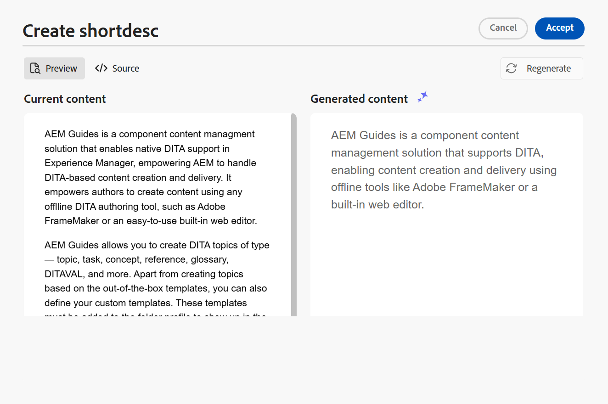

# KI-Assistent zum Verfassen von Dokumenten mit intelligenter Effizienz

Experience Manager Guides bietet ein KI-Assistenten-Tool, mit dem Sie Ihre Bearbeitung intelligenter und schneller gestalten können. Sie erfahren durch intelligente Vorschläge und Optimierung eine vereinfachte Dokumentenverarbeitung. Zeigen Sie mit diesem Tool die intelligenten Vorschläge an, um den Inhalt aus dem vorhandenen Inhalts-Repository wiederzuverwenden. Verwenden Sie die Textaufforderungsfunktion, um eine Eingabeaufforderung bereitzustellen und den Inhalt zu ändern oder eine Ausgabe gemäß Ihren Anforderungen zu generieren. Verwenden Sie den KI-Assistenten, um einen Absatz intelligent in eine Liste zu konvertieren. Sie können eine kurze Beschreibung für das aktuelle Thema erstellen. Diese Funktion hilft Ihnen auch, den ausgewählten Inhalt einfach zu verbessern und zu übersetzen.

>[!NOTE]
>
> Um die Funktion &quot;AI Assistant&quot;im rechten Bereich hinzuzufügen, muss Ihr Systemadministrator die Option **AI Assistant** auf der Registerkarte **Bedienfelder** in den **Editor Settings**  auswählen.
> Außerdem müssen Sie Ihr Dokument auschecken, um das Symbol &quot;KI-Assistent&quot;anzuzeigen.

Diese Funktion ist nur für DITA-Themen verfügbar. Nachdem Sie den Text in einem Thema ausgewählt haben, können Sie eine der AI Assistant-Aktionen durchführen:

## Wiederverwendbaren Inhalt vorschlagen

Verwenden Sie die Funktion **Wiederverwendbaren Inhalt vorschlagen**  , um Inhalte konsistent und präzise zu erstellen. Sie können den Inhalt auswählen. Experience Manager Guides bietet Vorschläge zur Wiederverwendung des vorhandenen Inhalts in Ihrem Repository.
Erfahren Sie mehr über die Verwendung von [KI-gestützten intelligenten Vorschlägen zum Erstellen von Inhalten](authoring-ai-based-smart-suggestions.md).

## Textaufforderung verwenden

Eine Textaufforderung ist eine Anweisung, eine Frage oder eine Anweisung, die den AI-Assistenten beim Generieren einer bestimmten Antwort oder Ausgabe unterstützt.

Sie können eine Textaufforderung verwenden, um den Inhalt zu ändern und eine Ausgabe zu generieren.  Sie können beispielsweise eine Zusammenfassung der Funktionen eines Produkts generieren und es in Ihrem Bericht verwenden, um das Produkt zu präsentieren. Sie können diese Funktion auch verwenden, um zwei Produkte zu vergleichen. Sie können beispielsweise auch eine Vergleichstabelle für die Funktionen zweier Produkte erstellen.

1. Wählen Sie den Text aus, für den Sie die Textaufforderung verwenden möchten.
1. Wählen Sie im Bedienfeld **AI-Assistent** die Option **Textaufforderung verwenden** aus.
1. Geben Sie eine Eingabeaufforderung auf eine der folgenden Arten ein:

   - Wählen Sie eine Eingabeaufforderung aus den Eingabeaufforderungen aus.
   - Überprüfen oder bearbeiten Sie eine vorgeschlagene Eingabeaufforderung, um eine benutzerdefinierte Eingabeaufforderung gemäß Ihren Anforderungen zu erstellen.

     >[!NOTE]
     >
     > Die vorgeschlagenen Eingabeaufforderungen werden im `ui_config.json` von Ihrem Administrator konfiguriert.

   - Geben Sie Ihre Aufforderung in das Textfeld ein.

1. Wählen Sie **Regenerate**  für eine andere Antwort oder Ausgabe basierend auf Ihrer Eingabeaufforderung, z. B. die AI-Tools.

1. (Optional) Wählen Sie **Erweitern**  aus, um den Editor **Textaufforderung verwenden** zu öffnen. Er zeigt den aktuellen und den generierten Inhalt an. Sie können den Quelllayoutinhalt bearbeiten und die Vorschau überprüfen.

   >[!NOTE]
   >
   > Die Antworten werden basierend auf dem ausgewählten Inhalt generiert.

1. Sie können die Eingabeaufforderung auch im Editor bearbeiten und die Antwort neu generieren. Sie können beispielsweise die Eingabeaufforderung ändern, um den Text auf ca. 40 Wörter zu kürzen.

   

1. Sie können die Quelle des generierten Inhalts überprüfen und bei Bedarf bearbeiten.

1. Wählen Sie **Annehmen** aus, um den ausgewählten Inhalt im Thema durch den generierten Inhalt zu ersetzen.
1. **Abbrechen**: Bricht die Aktion für die Textaufforderung ab. Gibt den Anfangsstatus des Bedienfelds zurück.

   >[!NOTE]
   >
   > Wenn Sie im Funktionsbereich das Symbol **Abbrechen** auswählen, werden Sie ebenfalls zum ursprünglichen Status zurückgeleitet.

## Inhalt verbessern

Verbessert den ausgewählten Inhalt. Überprüfen Sie die Rechtschreibung, Sprache und grammatische Struktur und schlagen Sie eine bessere Version des Inhalts vor. Es verbessert auch die Qualität der Sätze.

1. Wählen Sie den Inhalt aus.
1. Wählen Sie **Inhalt verbessern** , um die Vorschläge für den verbesserten Inhalt zu finden.
1. Wählen Sie **Regenerate** aus, um einen weiteren Vorschlag zur Verbesserung des Inhalts zu erhalten.

1. (Optional) Wählen Sie **Erweitern** aus, um den verbesserten Inhaltseditor zu öffnen. Er zeigt den aktuellen und den generierten Inhalt an. Sie können den Inhalt im Quelllayout bearbeiten und auch die Vorschau überprüfen.

Akzeptieren Sie den Vorschlag, generieren Sie ihn für eine andere Antwort oder brechen Sie die Aktion ab, um zum vorherigen Status zurückzukehren.

## Erstellen von Shortdesks

Erstellen Sie eine kurze Beschreibung für das Thema basierend auf dem ausgewählten Inhalt in etwa 30 bis 50 Wörtern. Die kurze Beschreibung hilft Benutzern, relevante Inhalte zu suchen und zu finden.
Beispielsweise können Sie die Systemanforderungen auflisten und entsprechend eine kurze Beschreibung generieren.

1. Wählen Sie den Inhalt aus.
1. Wählen Sie **Shortdesc erstellen **, um eine kurze Beschreibung für das aktuelle Thema zu erstellen.
1. Wählen Sie **Annehmen** aus, um eine neue Kurzbeschreibung zu erstellen, falls die Kurzbeschreibung noch nicht vorhanden ist. Wenn eine kurze Beschreibung vorhanden ist, müssen Sie sie bestätigen, bevor Sie sie durch die neue Kurzbeschreibung ersetzen.

Sie können auch die folgenden Aktionen durchführen:
- Wählen Sie **Regenerieren** aus, um eine weitere kurze Beschreibung für Ihr Thema zu generieren, z. B. die KI-Tools.

- Wählen Sie **Erweitern** aus, um den Editor **Shortdesc erstellen** zu öffnen.

## Inhalt optimieren

Diese Funktion konvertiert einen ausgewählten Absatz intelligent in eine Liste.  Er analysiert den Inhalt und erstellt eine logische Liste von Elementen. Sie müssen die Elemente nicht manuell erstellen. Wenn Sie beispielsweise über einen Absatz verfügen, der die Schritte zum Erstellen eines Benutzerkontos detailliert beschreibt, kann das Tool dies in eine schrittweise Liste umwandeln, sodass Elemente nicht einzeln manuell erstellt werden müssen.

1. Wählen Sie den Inhalt aus.
1. Wählen Sie **Inhalt einschränken**  aus, um den ausgewählten Inhalt in eine Liste zu konvertieren.
Das KI-Assistenten-Tool konvertiert den Inhalt intelligent in eine Liste von Elementen.
1. (Optional) Wählen Sie **Erweitern** aus, um den Editor **Inhalt einschränken** zu öffnen.
1. Wenn Ihre Liste fertig ist, akzeptieren Sie die Änderungen im generierten Inhalt. Der erstellte Inhalt ersetzt dann den ausgewählten Inhalt.

## Inhalte übersetzen

Verwenden Sie diese intelligente Funktion, um den ausgewählten Inhalt in die Zielsprache zu übersetzen. Sie können beispielsweise Inhalte in englischer Sprache hinzufügen und diese schnell ins Deutsche übersetzen.
Führen Sie die folgenden Schritte aus, um den Inhalt zu übersetzen:

1. Wählen Sie den zu übersetzenden Inhalt aus.
1. Wählen Sie im Bereich &quot;AI Assistant&quot;die Option **Inhalt übersetzen**  aus.
1. Wählen Sie die Zielsprache aus der Dropdown-Liste aus. Der übersetzte Inhalt wird im Bedienfeld &quot;KI-Assistent&quot;angezeigt.

1. (Optional) Wählen Sie **Erweitern** aus, um den Editor **Inhalt übersetzen** zu öffnen.
1. Sie können auch eine andere Sprache aus dem Dropdown-Menü auswählen und den Inhalt in der ausgewählten Sprache neu generieren. Wenn Sie beispielsweise Französisch auswählen und dann **Regenerate** auswählen, wird der Inhalt in Französisch übersetzt.

