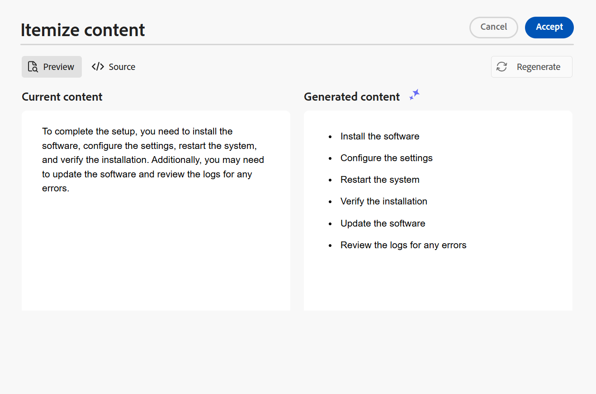

# KI-Assistent zum Erstellen von Dokumenten mit intelligenter Effizienz

Experience Manager Guides bietet ein KI-Assistenten-Tool, mit dem Sie Ihre Inhaltserstellung intelligenter und schneller gestalten können. Durch intelligente Vorschläge und Optimierung erleben Sie eine vereinfachte Dokumentverarbeitung. Zeigen Sie mit diesem Tool die intelligenten Vorschläge zur Wiederverwendung der Inhalte aus dem vorhandenen Inhalts-Repository an. Verwenden Sie die Textaufforderungsfunktion, um eine Eingabeaufforderung bereitzustellen und den Inhalt zu ändern oder eine Ausgabe gemäß Ihren Anforderungen zu generieren. Verwenden Sie den KI-Assistenten, um einen Absatz intelligent in eine Liste zu konvertieren. Sie können eine kurze Beschreibung für das aktuelle Thema erstellen. Mit dieser Funktion können Sie auch die ausgewählten Inhalte einfach verbessern und übersetzen.

>[!NOTE]
>
> Um die Funktion KI-Assistent im rechten Bedienfeld hinzuzufügen, muss Ihr Systemadministrator die Option **KI-Assistent** auf der Registerkarte **Bedienfelder** im Symbol **Editor-Einstellungen**  auswählen.
> Außerdem müssen Sie Ihr Dokument auschecken, um das Symbol für den KI-Assistenten anzuzeigen.

Diese Funktion ist nur für DITA-Themen verfügbar. Nachdem Sie den Text in einem Thema ausgewählt haben, können Sie eine der KI-Assistentenaktionen ausführen:

## Wiederverwendbaren Inhalt vorschlagen

Verwenden Sie das Symbol **Wiederverwendbaren Inhalt vorschlagen**  um Inhalte konsistent und präzise zu erstellen. Sie können den Inhalt auswählen. Experience Manager Guides bietet Vorschläge dazu, wie der vorhandene Inhalt in Ihrem Repository wiederverwendet werden kann.
Erfahren Sie mehr über die Verwendung von [KI-gestützten Smart-Vorschlägen zum Erstellen von Inhalten](authoring-ai-based-smart-suggestions.md).

## Textaufforderung verwenden

Eine Textaufforderung ist eine Anweisung, eine Frage oder eine Anweisung, die den KI-Assistenten bei der Generierung einer bestimmten Antwort oder Ausgabe anleitet.

Sie können eine Textaufforderung verwenden, um den Inhalt zu ändern und eine Ausgabe zu generieren.  Sie können beispielsweise eine Zusammenfassung der Funktionen eines Produkts erstellen und es in Ihrem Bericht zur Präsentation des Produkts verwenden. Sie können diese Funktion auch verwenden, um zwei Produkte zu vergleichen. Sie können beispielsweise auch eine Vergleichstabelle für die Funktionen zweier Produkte erstellen.

1. Wählen Sie den Text aus, für den Sie die Textaufforderung verwenden möchten.
1. Wählen Sie **Textaufforderung verwenden**  im Bedienfeld **KI-Assistent** aus.
1. Geben Sie eine Eingabeaufforderung auf eine der folgenden Arten ein:

   - Wählen Sie eine Eingabeaufforderung aus den vorgeschlagenen Eingabeaufforderungen aus.
   - Bearbeiten Sie eine vorgeschlagene Eingabeaufforderung, um eine benutzerdefinierte Eingabeaufforderung gemäß Ihren Anforderungen zu erstellen.

     >[!NOTE]
     >
     > Die empfohlenen Eingabeaufforderungen werden in der `ui_config.json` von Ihrem Administrator konfiguriert.

   - Geben Sie die Eingabeaufforderung in das Textfeld ein.

1. Wählen Sie **Regenerieren**  für eine andere Antwort oder Ausgabe basierend auf Ihrer Eingabeaufforderung aus, z. B. die KI-Tools.

1. (Optional) Wählen Sie **Erweitern**  aus, um den **Textaufforderung verwenden** zu öffnen. Es zeigt den aktuellen und den generierten Inhalt an. Sie können den Quell-Layout-Inhalt bearbeiten und die Vorschau überprüfen.

   >[!NOTE]
   >
   > Die Antworten werden basierend auf dem ausgewählten Inhalt generiert.

1. Sie können die Eingabeaufforderung auch im Editor bearbeiten und die Antwort neu generieren. Sie können beispielsweise die Eingabeaufforderung ändern, um den Text auf etwa 40 Wörter zu verkürzen.

   

1. Sie können die Quelle des generierten Inhalts überprüfen und bei Bedarf bearbeiten.

1. Wählen Sie **Akzeptieren** aus, um den ausgewählten Inhalt im Thema durch den generierten Inhalt zu ersetzen.
1. **Abbrechen**: Bricht die Textaufforderungsaktion ab. Kehrt zum Anfangsstatus des Bedienfelds zurück.

   >[!NOTE]
   >
   > Durch Auswahl des **Abbrechen**-Symbols im Funktionsbedienfeld werden Sie ebenfalls auf den Ausgangsstatus zurückgesetzt.

## Inhalt verbessern

Verbessert den ausgewählten Inhalt. Überprüfen Sie die Rechtschreibung, Sprache und grammatische Struktur und schlagen Sie eine bessere Version des Inhalts vor. Es verbessert auch die Qualität der Sätze.

1. Inhalt auswählen.
1. Wählen Sie **Inhalt verbessern**  aus, um die Vorschläge für den verbesserten Inhalt zu finden.
1. Wählen Sie **Erneut generieren**, um einen weiteren Vorschlag für verbesserte Inhalte zu erhalten.

1. (Optional) Klicken Sie auf **Erweitern**, um den verbesserten Inhaltseditor zu öffnen. Es zeigt den aktuellen und den generierten Inhalt an. Sie können den Inhalt im Quell-Layout bearbeiten und auch die Vorschau überprüfen.

Akzeptieren Sie den Vorschlag, oder erstellen Sie eine neue Antwort oder brechen Sie die Aktion ab, um zum vorherigen Status zurückzukehren.

## Kurzwahlnummern erstellen

Erstellen Sie eine kurze Beschreibung für das Thema basierend auf dem ausgewählten Inhalt in etwa 30-50 Wörtern. Die kurze Beschreibung hilft Benutzern, nach relevanten Inhalten zu suchen und diese zu finden.
Sie können beispielsweise die Systemanforderungen auflisten und entsprechend eine kurze Beschreibung generieren.

1. Inhalt auswählen.
1. Wählen Sie **Kurzbeschreibung erstellen** , um eine Kurzbeschreibung für das aktuelle Thema zu erstellen.
1. Wählen **Akzeptieren**, um eine neue Kurzbeschreibung zu erstellen, falls die Kurzbeschreibung noch nicht vorhanden ist. Wenn eine Kurzbeschreibung vorhanden ist, müssen Sie sie bestätigen, bevor Sie sie durch die neue Kurzbeschreibung ersetzen.

Sie können auch die folgenden Aktionen ausführen:

- Wählen Sie **Regenerieren** aus, um eine weitere kurze Beschreibung für Ihr Thema zu generieren, z. B. die KI-Tools.
- Wählen Sie **Erweitern** aus, um den **Shortdesc erstellen** zu öffnen.

## Inhalt auflisten

Diese Funktion wandelt einen ausgewählten Absatz intelligent in eine Liste um.  Er analysiert den Inhalt und erstellt eine logische Liste von Elementen. Sie müssen die Elemente nicht manuell erstellen. Wenn Sie beispielsweise über einen Absatz verfügen, der die Schritte zum Erstellen eines Benutzerkontos detailliert beschreibt, kann das Tool dies in eine schrittweise Liste umwandeln, sodass Elemente nicht manuell einzeln erstellt werden müssen.

1. Inhalt auswählen.
1. Wählen Sie **Inhalt** KI aus, um den ausgewählten Inhalt in eine Liste zu konvertieren.
Das Tool KI-Assistent konvertiert den Inhalt intelligent in eine Liste von Elementen.
1. (Optional) Klicken Sie auf **Erweitern**, um den Editor **Inhalt auflisten** zu öffnen.
1. Sobald Ihre Liste fertig ist, akzeptieren Sie die Änderungen am generierten Inhalt. Der generierte Inhalt ersetzt dann den ausgewählten Inhalt.

## Inhalte übersetzen

Verwenden Sie diese intelligente Funktion, um die ausgewählten Inhalte in die Zielsprache zu übersetzen. Sie können beispielsweise Inhalte auf Englisch hinzufügen und schnell ins Deutsche übersetzen.
Führen Sie die folgenden Schritte aus, um die Inhalte zu übersetzen:

1. Wählen Sie die Inhalte aus, die Sie übersetzen möchten.
1. Wählen Sie **Inhalt übersetzen** im ](./images/ai-translate-content-icon.svg)-Assistentenfeld ![Symbol „Inhalt übersetzen“ aus.
1. Wählen Sie im Dropdown-Menü die Zielsprache aus. Die übersetzten Inhalte werden im Bedienfeld KI-Assistent angezeigt.

1. (Optional) Wählen Sie **Erweitern** aus, um den Editor **Inhalte übersetzen** zu öffnen.
1. Sie können auch eine andere Sprache aus dem Dropdown-Menü auswählen und den Inhalt in der ausgewählten Sprache neu generieren. Wenn Sie beispielsweise Französisch auswählen und dann **Regenerieren** wählen, wird der Inhalt ins Französische übersetzt.

