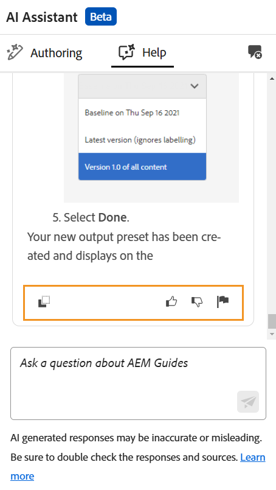

# Effizienzsteigerung durch intelligente Hilfe im KI-Assistenten (Beta)

Experience Manager Guides bietet die GenAI-basierte Smart-Hilfe, eine Funktion zur konversativen Suche, mit der Sie relevante Inhalte aus der [Adobe Experience Manager Guides-Dokumentation finden &#x200B;](https://experienceleague.adobe.com/de/docs/experience-manager-guides/using/overview).

Sie können Ihre Fragen stellen und Antworten auf informative Weise erhalten. Die Antwort auf Ihre Abfrage basiert auf dem Inhalt aus der Produktdokumentation. Diese Suche ist völlig dialogorientiert. Sie können Fragen zu den verschiedenen Funktionen von Experience Manager Guides stellen oder auch Fragen zur Fehlerbehebung stellen. Je nach Antwort können Sie auch weitere Fragen stellen. Die Antwort enthält auch Links zu Quelldokumenten, auf die Sie für Details verweisen können.

Sie können zum Beispiel folgende Fragen stellen: &quot;*veröffentlicht eine Karte?* erhalten Sie eine Antwort und die Links für die entsprechenden Artikel. Wenn Sie dann erfahren möchten, wie Sie eine bestimmte Methode zum Veröffentlichen der Ausgabe verwenden, können Sie Fragen dazu stellen. Beispiel: *Wie veröffentliche ich eine Zuordnung zu PDF?*

Wenn Sie **KI-Assistent** auf der Startseite, in der Map-Konsole oder im Editor öffnen, wird das **Hilfe**-Bedienfeld auf der rechten Seite geöffnet. Im Fall des Editors wird auch das Authoring-Bedienfeld angezeigt, das Ihnen intelligente Authoring-Funktionen bietet. Weitere Informationen finden Sie unter [KI-Assistent zum intelligenten Verfassen von Dokumenten](./ai-assistant-right-panel.md)

{width="300" align="left"}

*Anzeigen des Bedienfelds **Hilfe**.*

Führen Sie die folgenden Schritte aus, um das Hilfebedienfeld zu verwenden, um den entsprechenden Inhalt zu finden und Ihre Abfragen aufzulösen:

1. Wählen Sie **KI-Assistent** aus, um das Hilfefenster zu öffnen.

   >[!NOTE]
   >
   > In den [globalen Profilen oder Profilen auf &#x200B;](../cs-install-guide/conf-folder-level.md#conf-ai-guides-assistant) muss Ihr Administrator die Standardfragen definieren, die im Bedienfeld angezeigt werden.

1. Geben Sie die Frage ein, um den zugehörigen Inhalt in der Dokumentation zu Experience Manager Guides zu finden. Sie können die Standardfrage im Bedienfeld auswählen oder Ihre Frage in das Textfeld eingeben.

1. Wählen Sie **Senden**  oder drücken Sie die **Eingabetaste**, um die Antwort auf Ihre Fragen zu sehen.

   Abhängig von Ihrer Frage können Sie den Inhalt, die passenden Bilder und Links zu den Artikeln anzeigen.

   {width="300" align="left"}

   *Wählen Sie die Beispielfrage aus und zeigen Sie die Inhalte und Bilder als Antwort an.*

1. Wählen Sie die Links zu den Artikeln am Ende aus und erhalten Sie detaillierte Informationen zur Antwort auf Ihre Frage.

1. Wählen Sie **Konversation löschen**  aus, um den Konversationsverlauf aus dem Bedienfeld zu entfernen. Sie können dann eine neue Unterhaltung beginnen und relevante Inhalte finden.

Anstatt in Benutzerhandbüchern und Referenzdokumenten zu suchen, können Sie die Funktion **Hilfe** verwenden, um schnell relevante Antworten auf Ihre Fragen zu finden. Dies spart Zeit und ermöglicht es Ihnen, sich auf die Inhaltserstellung zu konzentrieren, was zu höherer Produktivität und Effizienz führt.

## Verfügbare Optionen für Antworten auf die Hilfe des KI-Assistenten

Wenn Sie eine Antwort vom KI-Assistenten im Bedienfeld **Hilfe** erhalten, können Sie damit interagieren oder Feedback geben, um die Genauigkeit und Zuverlässigkeit zu verbessern. Ihr Feedback hilft dem Experience Manager Guides-Team, die Genauigkeit und Relevanz der KI-Assistentenantworten zu verbessern und ihre Leistung im Laufe der Zeit zu verbessern.

Die folgenden Optionen stehen zur Verfügung, um mit den Antworten des KI-Assistenten (Hilfebereich) zu interagieren **Feedback** geben:

{width="300" align="left"}

- **Kopieren**: Kopieren Sie die Antwort zur Verwendung in Ihren Dokumenten.
- **Like**: Gibt an, dass die Antwort hilfreich oder korrekt war. Wählen Sie das Symbol Gefällt mir , um die Antwort zu mögen, und verwenden Sie die Option **Weitere Informationen**, um detailliertes Feedback zu geben.
- **Gefällt mir nicht**: Markiert die Antwort als nicht hilfreich oder falsch. Wählen Sie das Symbol Gefällt mir nicht, wenn Ihnen die Antwort gefällt, und verwenden Sie die Option **Weitere Informationen**, um detailliertes Feedback zu geben.
- **Bericht**: Markieren Sie die Antwort zur Überprüfung, wenn sie Fehler oder ungenaue Inhalte enthält. Wählen Sie das Markierungssymbol aus, um das Dialogfeld **Berichtsergebnisse** zu öffnen. Wählen Sie aus den verfügbaren Optionen aus oder geben Sie ein benutzerdefiniertes Feedback.