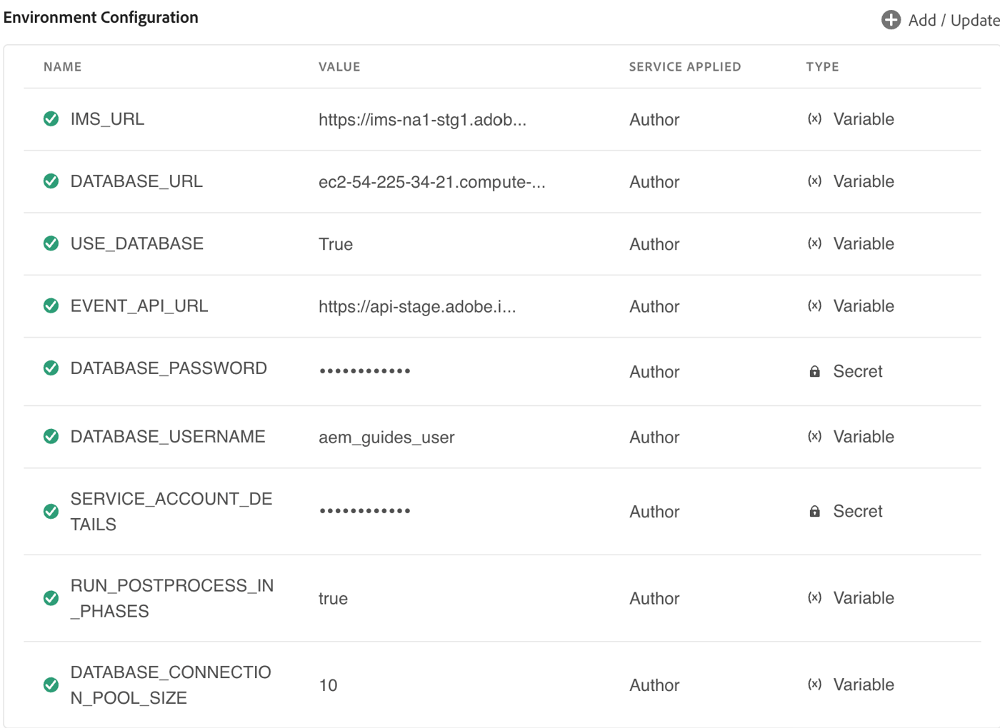

# Asset-Verarbeitung

Die Asset-Verarbeitung ist ein wichtiger Workflow, der sicherstellt, dass Content-Assets innerhalb der Plattform strukturiert, validiert, indiziert und zugänglich gemacht werden. Mit steigenden Skalierbarkeitsanforderungen und Cloud-nativen Anforderungen hat die Architektur einen bedeutenden Wandel von einem Single-Thread-hierarchischen Verarbeitungsmodell zu einem verteilten, grafisch aktivierten Multi-Thread-System durchlaufen.

## Aktueller Asset-Verarbeitungs-Workflow

### Verarbeitungsübersicht

Wenn ein Asset in Experience Manager Guides importiert wird, werden die folgenden sequenziellen Verarbeitungsschritte ausgeführt:

- Eindeutige Schlüsselzuweisung : Jedem Dokument wird eine eindeutige Kennung zugewiesen, um die Rückverfolgbarkeit und Referenzintegrität sicherzustellen.
- Syntaxanalyse: Inhalte (z. B. DITA XML) werden zum Verstehen auf Systemebene in strukturierte Komponenten zerlegt.
- Validierung: Die strukturelle und schematische Validierung stellt die Einhaltung von Dokumentstandards sicher.
- Referenzauflösung: Querverweise (Links, Bilder, Abhängigkeiten) werden über Assets hinweg aufgelöst.
- Metadatenextraktion: Metadaten wie Titel, Autor und benutzerdefinierte Attribute werden zur Indizierung und Suche extrahiert.
- Neuverarbeitung bei Modifizierung: Die inkrementelle Neuverarbeitung gewährleistet die Konsistenz nach Inhaltsaktualisierungen.

### Architektonische Merkmale

- **Single-Thread-Verarbeitung**: Verhindert die Beschädigung von JCR-Strukturen (Java Content Repository), die auf B-Tree-Implementierungen angewiesen sind.Dies stellt die Datenintegrität sicher, führt jedoch zu Verarbeitungsengpässen bei der Massenaufnahme.

- **Abhängigkeit von übergeordneter Zuordnung**: Behält hierarchische Beziehungen zwischen Assets bei, indem Graphen durchlaufen werden. Hierbei handelt es sich um intensive Vorgänge mit hoher Latenz bei umfangreichen Verarbeitungsvorgängen mit erhöhtem Rechenaufwand und Belastung durch traversal-schwere Vorgänge.

## Neuer Asset-Verarbeitungsablauf

Die Kernverarbeitungsschritte bleiben funktionell konsistent, werden jedoch jetzt in einem verteilten und parallelisierten Framework ausgeführt, wodurch der Durchsatz erheblich verbessert wird.

### Verbesserungen der Architektur

- **Graph-Datenbankintegration**:
   - Übergang von hierarchischem JCR zu einer nativen Diagrammdatenbank
   - Effiziente Handhabung von Beziehungen und Abhängigkeiten
   - Beseitigt Komplexität bei der Simulation von Diagrammvorgängen auf hierarchischem Speicher
- **Verteilte Verarbeitung mit mehreren Threads**:
   - Die Verarbeitung erfolgt über mehrere Pods in einer Cloud-Umgebung
   - Entfernt die Abhängigkeit von einem einzelnen Führungsknoten
   - Ermöglicht horizontale Skalierbarkeit und parallele Ausführung
- **Beseitigung der Abhängigkeit der übergeordneten Zuordnung:**
   - Kein explizites Durchlaufen von Diagrammen erforderlich
   - Reduziert I/O-Vorgänge und Verarbeitungslatenz
   - Vereinfacht die Verarbeitung von Pipelines
- **Synchronisierte eindeutige ID-Zuordnung**
   - Zentralisierte Koordination sorgt für:
   - Keine Duplizierung von Dokument-IDs
   - Konsistenz über verteilte Knoten hinweg
   - Beibehaltung der referenziellen Integrität in einer gleichzeitigen Umgebung
- **Cloud-native skalierbare Datenbank (gehostet in AWS)**
   - Hochverfügbare und zuverlässige Datenbankschicht
   - Unterstützt elastische Skalierung basierend auf der Arbeitslast
   - Verbessert die Zuverlässigkeit und Leistung des Systems insgesamt


## Vorteile der neuen Architektur

- Leistungsverbesserungen:
   - Die parallele Ausführung reduziert die Verarbeitungszeit erheblich
   - Die Eliminierung traversal-schwerer Operationen verringert die Latenz
   - Optimierte Diagrammverarbeitung verbessert die Auflösungsgeschwindigkeit von Abhängigkeiten
- Skalierbarkeit:
   - Die horizontale Skalierung über Pods hinweg ermöglicht die Handhabung großer Aufnahmevolumen
   - Cloud-native Infrastruktur passt sich dynamisch an Workload-Anforderungen an
- Zuverlässigkeit und Verfügbarkeit:
   - Verteilte Verarbeitung entfernt Single Point of Failure
   - Von AWS gehostete Datenbank sorgt für hohe Verfügbarkeit und Fehlertoleranz
- Effizienzgewinne:
   - Geringerer I/O-Overhead durch Entfernung des übergeordneten Map-Traversal
   - Bessere Ressourcennutzung über Rechnerknoten hinweg
- Datenintegrität:
   - Die synchronisierte ID-Zuordnung sorgt für Konsistenz über verteilte Systeme hinweg
   - Robustheit bei gleichzeitiger Aktivierung

## Datenbank konfigurieren

Experience Manager Guides ermöglicht eine optimierte Datenbankkonfiguration für AEM Cloud-Umgebungen. Führen Sie die folgenden Schritte aus, um die Datenbank für Ihre AEM Cloud-Instanz einzurichten:

1. Zugriff auf die AEM Cloud Manager: Navigieren Sie über die unten stehende URL zu Adobe Experience Cloud Manager und ersetzen Sie die Platzhalter durch Ihre Organisations-, Programm- und Umgebungsdetails: `https://experience.adobe.com/#/${orgName}/cloud-manager/environments.html/program/${programId}/environment/${envId}`

1. Konfigurieren der Umgebung: Nachdem Sie die Umgebungskonfigurationsseite über Cloud Manager geöffnet haben, können Sie die für Ihre Instanz spezifischen Einstellungen anpassen, einschließlich der Einrichtung der erforderlichen Datenbankkonfigurationen.

Dieser optimierte Ansatz stellt den einfachen Zugriff und die Konfiguration für AEM-Umgebungen innerhalb der Adobe-Cloud-Infrastruktur sicher.

1. Konfigurieren Sie die folgenden Eigenschaften:


| Eigenschaftsname | Wert | Service angewendet | Typ |
|----------------------------------|--------------------------------|-----------------|----------|
| DATABASE_URL | `<host>:<port>/<db_name>` | Author | Variable |
| GUIDES_ENABLE_DATABASE | `true` | Author | Variable |
| DATABASE_PASSWORD | `password` | Author | Geheimnis |
| DATABASE_USERNAME | `username` | Author | Variable |
| RUN_POSTPROCESS_IN_PHASES | `true` | Author | Variable |
| DATABASE_CONNECTION_POOL_SIZE | `10` | Author | Variable |


{width="350"}

1. Änderungen speichern: Nachdem Sie die Konfigurationsänderungen vorgenommen haben, stellen Sie sicher, **Sie** der Cloud Manager-Benutzeroberfläche speichern.

1. Systemverfügbarkeit: Sobald die Konfigurationen vollständig angewendet sind, öffnen Sie GET `http://host/bin/guides/v1/system/status` und überprüfen Sie die folgenden Eigenschaften:
   - `<isDatabase>`: Muss wahr sein
   - `<databaseConnectionCheck>`: Muss übergeben werden

   Wenn die oben genannten Werte in der Antwort korrekt sind, kann das System mit der neu konfigurierten Datenbank verwendet werden.

Wenn Sie diesem Prozess folgen, verfügen Sie über eine ordnungsgemäß eingerichtete und einsatzbereite AEM-Cloud-Umgebung.

>[!NOTE]
>
> Wenn Sie in eine vorhandene Umgebung mit bereits vorhandenen Inhalten migrieren, müssen Sie zunächst Phase 2 (Migrieren vorhandener Inhalte) ausführen, bevor Sie neue Inhalte aufnehmen können. Dadurch soll sichergestellt werden, dass temporäre GUIDs für den neuen Inhalt korrekt zugewiesen werden.

## Aufnehmen von Daten in AEM DAM (Cloud-Umgebung) (Phase 1)

Gehen Sie wie folgt vor, um einen neuen Ordner in AEM DAM (Digital Asset Manager) einzurichten, Daten aufzunehmen und mit einer JCR-basierten Umgebung zu vergleichen.

1. Erstellen Sie einen neuen Ordner in DAM.

2. Aufnehmen von Daten mit dem Daten-Upload-Tool: Weitere Informationen finden Sie unter **Hochladen von Assets in AEM Cloud**.

3. Überprüfen des Systems
   - Überprüfen Sie nach Abschluss des Uploads, ob die Assets in DAM vorhanden sind.
   - Stellen Sie sicher, dass Metadaten (wie Dateitypen, Beschreibungen und Tags) extrahiert und mit den Assets verknüpft wurden.
   - Überprüfen Sie die Experience Manager Guides-Verarbeitung (Multi-Thread), um sicherzustellen, dass alle Verweise, die Metadatenextraktion und die Validierungen erfolgreich waren.
   - Testen Sie den Zugriff auf und die Bearbeitung eines Dokuments, um die Systemintegrität zu bestätigen.

4. Vergleich mit JCR-basierten Umgebungen
   - Ergebnisse über verschiedene Testfälle hinweg vergleichen.
   - Auswerten der Aufnahmegeschwindigkeit


Um Inhalte zu migrieren, die vor dem Wechsel von Experience Manager Guides zu einer datenbankbasierten Einrichtung hochgeladen und verarbeitet wurden, kann ein Migrationsskript verwendet werden. Das -Skript nutzt einen Satz von APIs zum Initiieren und Überwachen des Migrationsprozesses. Die folgenden Schritte beschreiben den empfohlenen Ansatz.

## Migrieren von Inhalten aus JCR in die Datenbank (Phase 2)

Um Inhalte zu migrieren, die vor dem Wechsel von Experience Manager Guides zu einer datenbankbasierten Einrichtung hochgeladen und verarbeitet wurden, müssen Sie ein Migrationsskript verwenden. Das -Skript nutzt einen Satz von APIs zum Initiieren und Überwachen des Migrationsprozesses. Die folgenden Schritte beschreiben den empfohlenen Ansatz.

1. Erstellen Sie einen Trigger für die Migrations-API unter Verwendung eines beliebigen REST-Clients.
2. Überprüfen Sie den Migrationsfortschritt.
3. Überwachen Sie die Migration bis zum Abschluss: Fahren Sie mit der Überwachung fort, bis die Fortschritts-API einen 100%igen Abschluss meldet. Nach Abschluss des Vorgangs werden alle zuvor hochgeladenen und verarbeiteten Inhalte aus dem JCR-Repository in die Datenbank migriert.

   >[!NOTE]
   >
   > - Stellen Sie sicher, dass die erforderlichen Autorisierungs-Header (z. B. OAuth-Token, API-Schlüssel oder Zugriffs-Token von der Entwicklerkonsole) zum Authentifizieren von Anfragen bei AEM enthalten sind.
   > - Die Migrationsdauer hängt von der Größe des Inhalts-Repositorys ab. Es werden regelmäßige Fortschrittsüberprüfungen sowie eine Überwachung auf Fehler oder Unterbrechungen empfohlen.
   > - Überprüfen Sie die Migrationsprotokolle, falls verfügbar, um die Migrationsleistung zu bewerten und Probleme zu identifizieren.

4. Gehen Sie wie folgt vor, um die Migration großer Repository-Größen zu unterstützen

   >[!NOTE]
   >
   > Wenden Sie diese Konfiguration nur an, wenn bei der Migration Fehler beim Durchlaufen des Repositorys auftreten.

   `file name: `org.apache.jackrabbit.oak.query.QueryEngineSettingsService.xml“

   ```xml
   <?xml version="1.0" encoding="UTF-8"?>
   <jcr:root xmlns:jcr="http://www.jcp.org/jcr/1.0"
         xmlns:sling="http://sling.apache.org/jcr/sling/1.0"
         jcr:primaryType="sling:OsgiConfig"
         queryLimitInMemory="5000000"
         queryLimitReads="1000000"
   />
   ```


## Migrations-API

### Start der Migration

- Endpunkt: `POST /bin/guides/v1/assets/process`
- Anfragetext: (`application/json`):

```json
  {
    "path": "/content/dam/dita-templates",
    "excludedPaths": [
      "/content/dam/demo",
      "/content/dam/demo1"
    ],
    "type": "ASSET_PROCESSING"
  }
```

- gibt die processingId für die Migration zurück.
- Trigger Der im Produkt integrierte Asset-Verarbeitungs-Workflow.

### Migrationsstatus überprüfen

Endpunkt: `GET /bin/guides/v1/assets/process/status?processingId=<processingId>`

### Abbrechen einer laufenden Migration

- Endpunkt: `POST /bin/guides/v1/assets/process/cancel`
- Anfragetext (application/json):

  ```
  {
   "processingId": "processingId"
  }
  ```

### Fortsetzen einer fehlgeschlagenen oder abgebrochenen Migration

- Endpunkt: `POST /bin/guides/v1/assets/process/resume`
- Anfragetext (application/json):

  ```
  {
   "processingId": "processingId"
  }
  ```

## Hochladen von Assets in AEM Cloud

Adobe Experience Manager (AEM) as a Cloud Service bietet mehrere Ansätze für die Massenaufnahme von Inhalten. Um eine optimale Leistung sicherzustellen, insbesondere für die Experience Manager Guides-Nachbearbeitung, ist es wichtig, eine unterstützte und skalierbare Aufnahmestrategie zu verwenden.

### Massenaufnahme mithilfe von Cloud-Speicherintegrationen

AEM unterstützt die Massenaufnahme von Inhalten durch unterstützte Cloud-Speicheranbieter, sodass Unternehmen ihre bevorzugte Speicherlösung verbinden und Inhalte direkt in AEM importieren können. Dieser Ansatz wird für die Aufnahme in großem Maßstab und unter Berücksichtigung der Leistung aus folgenden Gründen empfohlen:

- Skalierbare Infrastruktur: Der Aufnahmeprozess wird auf der von Adobe verwalteten Cloud-Infrastruktur ausgeführt und ermöglicht die automatische Skalierung auf der Grundlage von Auslastung und Inhaltsvolumen. Dadurch wird eine konsistente Aufnahmeleistung auch für große Datensätze sichergestellt.

- Vorhersehbare Aufnahmeplanung: Benutzer können die Aufnahmedauer im Voraus schätzen, was bei der Versionsplanung, der Planung und der Koordinierung mit abhängigen Teams hilft.

  {width="350"}

- Umfassende Protokollierung und Nachverfolgung: Der Aufnahme-Workflow enthält detaillierte Protokollierungs- und Nachverfolgungsfunktionen, die Einblick in den Fortschritt, den Erfolgsstatus und potenzielle Probleme während des Importvorgangs bieten.

  {width="350"}

- Geplante Aufnahme: Die Aufnahme von Inhalten kann für vordefinierte Zeitfenster geplant werden, um sicherzustellen, dass sie nur minimale oder gar keine Auswirkungen auf Endbenutzer und laufende Vorgänge hat.

Weitere Informationen finden Sie unter [Massenimport ](https://experienceleague.adobe.com/de/docs/experience-manager-learn/cloud-service/migration/bulk-import).

## Massenaufnahme mit dem AEM-Upload

AEM bietet außerdem [AEM Upload](https://github.com/adobe/aem-uploa), eine Bibliothek und Befehlszeilenschnittstelle (Command Line Interface, CLI), mit der Benutzer Inhalte direkt aus einem lokalen Dateisystem aufnehmen können. Diese Option kann in benutzerdefinierte Lösungen integriert oder als eigenständiges CLI-Tool zum Hochladen von Inhalten verwendet werden.

Da dieser Ansatz auf dem lokalen Computer des Benutzers ausgeführt wird, ist eine stabile und unterbrechungsfreie Netzwerkverbindung erforderlich, um eine zuverlässige und nahtlose Aufnahme sicherzustellen.


## Konsistenzprüfung für Experience Manager Guides-Datenbankkonnektivität

Experience Manager Guides-Bereitstellungen, die für die Verwendung einer Datenbank konfiguriert sind, erfordern eine stabile und konsistente Datenbankkonnektivität, um zuverlässig zu funktionieren. Die Überprüfung des Status der Datenbankverbindung ist ein wichtiger Konsistenzprüfungsschritt, um konnektivitätsbezogene Probleme auszuschließen, die sich auf die Systemfunktionalität auswirken können.

Mit dieser Konsistenzprüfung können Benutzer bestätigen, ob die Datenbank konfiguriert, erreichbar ist und erwartungsgemäß funktioniert. Gehen Sie wie folgt vor, um den Status der DB-Verbindung zu überprüfen.

1. Öffnen Sie einen beliebigen Browser oder REST-Client
2. Trigger eines GET-Aufrufs mit dieser [URL](https://host:port/bin/guides/v1/system/status)
3. Die folgenden Felder können verwendet werden, um die Systemkonfiguration und den Systemzustand zu bestimmen
   1. isDatabase:
      - true: Die Umgebung wird mit der Datenbank konfiguriert.
      - false: Die Umgebung verwendet keine Datenbank

   2. databaseConnectionCheck:
      - Übergeben: Experience Manager Guides überprüft den Verbindungsstatus und wenn Guides eine Verbindung zur Datenbank herstellen können, wird der Status als Übergeben zurückgegeben.
      - Fehlgeschlagen: Die Umgebung kann nicht mit der Datenbank kommunizieren. Kunden sollten die Verwendung des Systems sofort einstellen und sich an den Adobe-Support wenden.

## Protokollüberwachung

Experience Manager Guides mit der -Datenbank protokolliert die Details effizient, um eine insight in den Systemstatus zu versetzen.
Verwenden Sie die folgenden Abfragen in Splunk, um Protokolle für verschiedene Szenarien zu erhalten.

1. Migrationslogs:
   - `index IN ("dx_aem_engineering") aem_service=cm-${programid}-${environmentId} sourcetype=aemerror "AssetProcessingJob" OR "AssetJobProducerDb" NOT "ServiceEvent"`
2. Nachbearbeitungsprotokolle:
   - `index IN ("dx_aem_engineering") aem_service= cm-${programid}-${environmentId} sourcetype=aemerror com.adobe.fmdita.uuid.concrete.Cor*`


>[!NOTE]
>
> Lesen Sie mehr über [Splunk-Abfragefunktionen](https://www.splunk.com/en_us/blog/learn/splunk-cheat-sheet-query-spl-regex-commands.html) um diese Protokolle nach Zeitdauer, Protokollebene oder bestimmten Mustern zu filtern.


