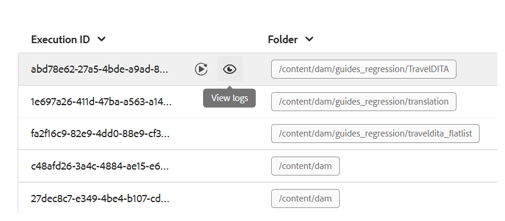

# Verarbeiten oder erneutes Verarbeiten von Assets

In datenintensiven Workflows wie der Veröffentlichung ist ein effizientes Asset-Management entscheidend für die Aufrechterhaltung von Leistung und Zuverlässigkeit. Der Prozess der Verarbeitung oder Neuverarbeitung von Assets wurde speziell für die Verarbeitung von benutzerspezifischen Assets entwickelt, die intensive Datenvorgänge erfordern. Dieser Ansatz berücksichtigt zwei Hauptszenarien: Wenn bei der anfänglichen Verarbeitung von Assets Fehler auftreten oder wenn Dateien aufgrund des Fehlens eines Nachbearbeitungs-Triggers überhaupt nicht verarbeitet wurden. Durch die Aktivierung einer zielgerichteten Verarbeitung auf Ordnerebene können Benutzer nur die erforderlichen Assets isolieren und verarbeiten und so den Verwaltungsaufwand für unnötige Berechnungen vermeiden. Dieser selektive Ansatz verbessert die Leistung erheblich und verringert den Zeitaufwand für kritische Vorgänge wie die Veröffentlichung und die Berichterstellung. Insgesamt trägt sie zu mehr Effizienz und Geschwindigkeit bei der Bearbeitung komplexer Datenaufgaben bei.

>[!NOTE]
>
> Bei großen Datensätzen ist es am besten, die Verarbeitung außerhalb der Spitzenzeiten auszuführen, um eine Beeinträchtigung der Systemleistung zu vermeiden. Nachdem die Verarbeitungsaufgabe abgeschlossen ist, können Sie die Details überprüfen, um die Ergebnisse zu analysieren.

## Verarbeiten der Assets

Gehen Sie wie folgt vor, um die Assets zu verarbeiten oder erneut zu verarbeiten:

1. Klicken Sie oben auf das Adobe Experience Manager-Logo und anschließend auf **Tools**.
1. Wählen Sie im Bedienfeld **Tools** die Option **Guides** aus.
1. Wählen Sie die Kachel **Asset-Prozessor** aus.

   {width="550" align="left"}

1. Das Fenster Guides Asset-Prozessor wird mit den unten angezeigten Details geöffnet. Außerdem werden in diesem Fenster nur die Informationen zu den letzten fünf Migrationen angezeigt.

   - **Ausführungs-ID**: Dies ist die eindeutige ID für jede Neuverarbeitungsaufgabe, die Sie ausführen.

   - **Ordner**: Zeigt den für die erneute Verarbeitung ausgewählten Ordner an.

   - **Ausgeschlossene Ordner**: verweist auf den Ordner, der von der erneuten Verarbeitung ausgeschlossen ist.

   - **Startzeit:** Zeigt das Datum und die Uhrzeit an, zu der der Neuverarbeitungsprozess gestartet wurde.

   - **Endzeit**: Zeigt das Datum und die Uhrzeit an, zu der der Neuverarbeitungsprozess endet.

   - **Status**: verweist auf den Status der erneuten Verarbeitung als In Bearbeitung, Abgeschlossen oder Abgebrochen.

   {width="550" align="left"}

1. Wählen Sie **Registerkarte** Neuer Prozess“ in der oberen rechten Ecke des Fensters, um eine neue Verarbeitungsaufgabe zu starten.

   {width="550" align="left"}

1. Wählen Sie den Ordner aus, den Sie verarbeiten oder erneut verarbeiten möchten. Sie können auch die Ordner (innerhalb des übergeordneten ausgewählten Ordners) auswählen, die Sie ausschließen oder ignorieren möchten.

   >[!NOTE]
   >
   >Es kann jeweils nur ein Ordner für die Verarbeitung ausgewählt werden. Für bestimmte Vorgänge können Sie mehrere Ordner ausschließen.

1. Wählen Sie **Erstellen**. Es erscheint ein Popup mit der Meldung **Erfolg und der Prozess wurde erfolgreich ausgelöst** wie im Ausschnitt dargestellt. Dasselbe spiegelt sich in der Liste wider. Im Fenster wird der Status der Neuverarbeitungsaufgabe angezeigt.

   {width="550" align="left"}

## Zusätzliche Optionen für die Verarbeitungsaufgaben

Zusätzliche Optionen stehen für die Verarbeitungsaufgabe zur Verfügung, sobald sie initiiert wurde. Sie können auf diese Optionen zugreifen, indem Sie den Mauszeiger über die Ausführungs-ID Ihrer Aufgabe bewegen. Details zu diesen Optionen finden Sie unten:

- **Neu starten** : Startet die zuvor erfolgreiche Asset-Verarbeitungsaufgabe neu.

  {width="550" align="left"}

- **Fortsetzen** : Setzt die zuvor abgebrochene oder fehlgeschlagene Asset-Verarbeitungsaufgabe fort.

  {width="550" align="left"}

- **Abbrechen** : Bricht die derzeit ausgeführte Asset-Verarbeitungsaufgabe ab.

  {width="550" align="left"}

- **Protokolle anzeigen**: Zeigt die Protokolle für die Asset-Verarbeitungsaufgabe an. Für laufende Aufgaben zeigt das Protokoll detaillierte Verarbeitungsinformationen an, einschließlich der geschätzten verbleibenden Zeit und des Asset-Status. Diese Protokollliste zeigt die neuesten 500 Einträge an. Das vollständige Protokoll kann heruntergeladen werden.

  {width="550" align="left"}

