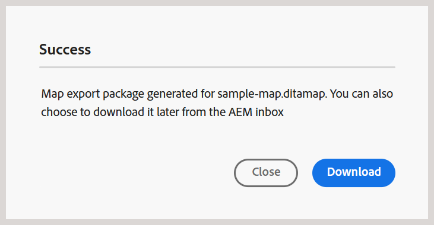

# Dateien herunterladen {#id216MC0H0BE8}

Sie können Assets, einschließlich DITA- und Nicht-DITA-Dateien, herunterladen. Es gibt mehrere Möglichkeiten, Assets herunterzuladen. Einige Methoden sind nativ in Adobe Experience Manager und andere werden von Adobe Experience Manager Guides unterstützt. Informationen zum nativen Herunterladen von Adobe Experience Manager-Assets finden Sie unter [Herunterladen von Assets von Adobe Experience Manager](https://experienceleague.adobe.com/docs/experience-manager-cloud-service/assets/manage/download-assets-from-aem.html?lang=de) in der Dokumentation zu Adobe Experience Manager. Im folgenden Abschnitt wird der Mechanismus zum Herunterladen von Dateien in Experience Manager Guides erläutert.

## Herunterladen einer DITA-Map-Datei aus dem Editor

Führen Sie die folgenden Schritte aus, um eine DITA-Zuordnungsdatei aus dem Editor herunterzuladen:

1. Navigieren Sie zur DITA-Karte, die Sie herunterladen möchten.
1. Wählen Sie die DITA-Karte aus, um sie im Editor zu öffnen.

1. Wählen Sie in der Kartenansicht das Symbol **Optionen** und dann **Karte herunterladen** aus der Liste aus.

   

   Das **„Karte**&quot; wird angezeigt.

   {width="300"}

1. Im Dialogfeld Karte herunterladen können Sie die folgenden Optionen auswählen:

   - **Baseline verwenden**: Wählen Sie diese Option, um eine Liste der Baselines zu erhalten, die für die DITA-Zuordnung erstellt wurden. Wenn Sie die Zuordnungsdatei und deren Inhalte basierend auf einer bestimmten Baseline herunterladen möchten, wählen Sie die Baseline aus der Dropdown-Liste aus. Weitere Informationen zum Arbeiten mit Grundlinien finden Sie unter [Arbeiten mit Grundlinien](generate-output-use-baseline-for-publishing.md#).

   - **Dateihierarchieoptionen**: Sie können auch das Dropdown-Menü „Dateihierarchie“ verwenden, um festzulegen, wie die Ordnerstruktur für Ihre heruntergeladenen Zuordnungsdateien verarbeitet werden soll. Folgende Optionen sind verfügbar:

      - **Dateihierarchie beibehalten**: Wählen Sie diese Option aus der Dropdown-Liste, um die vorhandene Ordnerstruktur für die heruntergeladenen Dateien beizubehalten.
      - **Dateihierarchie reduzieren**: Wählen Sie diese Option aus der Dropdown-Liste, um alle referenzierten Themen und Mediendateien in einen Ordner herunterzuladen.

     Für jede Option können Sie außerdem angeben, wie Dateinamen für heruntergeladene Dateien verarbeitet werden. Die folgenden Dateinamenoptionen sind verfügbar:

      - **GUID-Dateinamen verwenden**: Lädt die Zuordnungsdatei mit GUID als Dateinamen herunter.
      - **Tatsächlichen Dateinamen verwenden**: Lädt die Zuordnungsdatei mit dem ursprünglichen Dateinamen herunter. Wenn diese Option mit Dateihierarchie reduzieren verwendet wird, werden alle doppelten Dateinamen in der Zuordnung automatisch durch Anhängen numerischer Suffixe (_2, _3 usw.) aufgelöst, um eindeutige Dateinamen sicherzustellen.

   >[!NOTE]
   >
   > Sie können die Zuordnungsdatei auch herunterladen, ohne eine Option auszuwählen. In diesem Fall wird die letzte persistierte Version der referenzierten Themen und Mediendateien heruntergeladen.

1. Wählen Sie **Herunterladen** aus.

   Die Anfrage zum Herunterladen der Zuordnung wird in die Warteschlange gestellt.

   

   Sobald die Karte zum Herunterladen bereit ist, erhalten Sie die folgende Benachrichtigung.

   {width="550"}

1. Klicken Sie **Herunterladen**, um die Zuordnungsdatei im `.zip`-Format herunterzuladen. Oder laden Sie sie später aus dem AEM-Posteingang herunter.

   >[!NOTE]
   >
   > Standardmäßig bleiben die heruntergeladenen Zuordnungen fünf Tage lang im Adobe Experience Manager-Benachrichtigungs-Posteingang.

Nachdem die Karte heruntergeladen wurde, können Sie die Karte auswählen und das Symbol Öffnen oben verwenden, um den heruntergeladenen Inhalt zu öffnen. Um die zugehörigen Metadaten der heruntergeladenen Zuordnung anzuzeigen, öffnen Sie die im heruntergeladenen Inhalt enthaltene `metdata.json`. Diese Datei ist für die beiden Optionen *Dateihierarchie* „Dateihierarchie reduzieren“ und „Dateihierarchie beibehalten“ verfügbar.

## Herunterladen einer DITA-Map-Datei vom Map-Dashboard

Sobald Sie die DITA-Zuordnungsdatei im Adobe Experience Manager-Repository haben, können Sie die Zuordnungsdatei zusammen mit den abhängigen Elementen herunterladen. Dadurch haben Sie die Möglichkeit, die gesamte Zuordnungsdatei für die Offline-Bearbeitung, Validierung, Überprüfung oder einfache Erstellung eines Backups freizugeben.

Führen Sie die folgenden Schritte aus, um eine DITA-Zuordnungsdatei zusammen mit den abhängigen Dateien herunterzuladen:

1. Navigieren Sie in der Assets-Benutzeroberfläche zu der DITA-Karte, die Sie herunterladen möchten.

1. Wählen Sie die DITA-Map aus, um sie in der DITA-Map-Konsole zu öffnen.

1. Wählen Sie die **Themen** aus, um die Liste der in der DITA-Karte verfügbaren Themen anzuzeigen.

1. Wählen Sie in der Hauptsymbolleiste **Karte herunterladen** aus.

   Das Dialogfeld Zuordnung herunterladen wird angezeigt.

   {width="300"}

1. Wählen Sie **Herunterladen** aus. Im Dialogfeld Karte herunterladen können Sie die folgenden Optionen auswählen:

   - **Baseline verwenden**: Wählen Sie diese Option, um eine Liste der Baselines zu erhalten, die für die DITA-Zuordnung erstellt wurden. Wenn Sie die Zuordnungsdatei und deren Inhalte basierend auf einer bestimmten Baseline herunterladen möchten, wählen Sie die Baseline aus der Dropdown-Liste aus. Weitere Informationen zum Arbeiten mit Grundlinien finden Sie unter [Arbeiten mit Grundlinien](generate-output-use-baseline-for-publishing.md#).

   - **Dateihierarchie reduzieren**: Wählen Sie diese Option, um alle referenzierten Themen und Mediendateien in einem Ordner zu speichern.

   >[!NOTE]
   >
   > Sie können die Zuordnungsdatei auch herunterladen, ohne eine Option auszuwählen. In diesem Fall wird die letzte persistierte Version der referenzierten Themen und Mediendateien heruntergeladen.

1. Nachdem Sie auf die Schaltfläche **Herunterladen** geklickt haben, wird die Anfrage zum Herunterladen der Zuordnung in die Warteschlange gestellt. Sobald die Karte zum Herunterladen bereit ist, erhalten Sie die folgende Benachrichtigung.

   {width="550"}

   - Wählen Sie **Herunterladen** aus, um die Zuordnungsdatei im ZIP-Format herunterzuladen.

   - Wählen **Später herunterladen**, um die Zuordnungsdatei zu einem späteren Zeitpunkt herunterzuladen. Der Download-Link kann über den Adobe Experience Manager-Benachrichtigungs-Posteingang aufgerufen werden. Wählen Sie die generierte Zuordnungsbenachrichtigung im Posteingang aus, um die Zuordnung im ZIP-Format herunterzuladen.

   >[!NOTE]
   >
   > Standardmäßig bleiben die heruntergeladenen Zuordnungen fünf Tage lang im Adobe Experience Manager-Benachrichtigungs-Posteingang.

{width="300"}

Nachdem die Karte heruntergeladen wurde, können Sie die Karte auswählen und das Symbol Öffnen oben verwenden, um den heruntergeladenen Inhalt zu öffnen.

**Übergeordnetes Thema:**&#x200B;[&#x200B; Inhalte verwalten](authoring.md)
