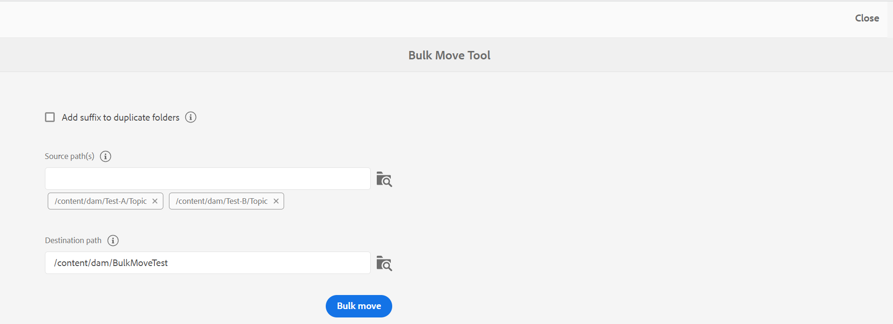
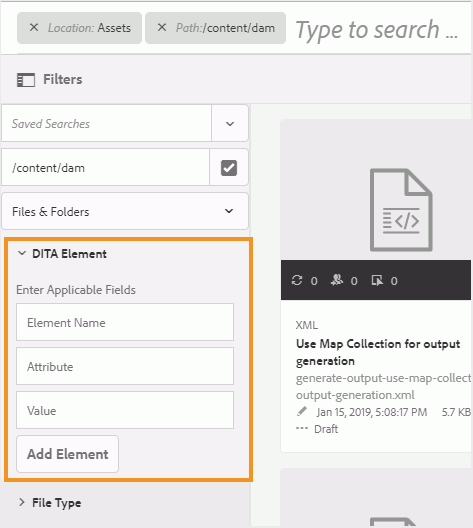

# Dateien und Ordner verwalten {#id2116G0L08XA}

In diesem Abschnitt wird erläutert, wie Adobe Experience Manager Guides mit grundlegenden Dateivorgängen wie Kopieren, Einfügen, Drag-and-Drop und Löschen von Dateien umgeht. Die folgenden Szenarien sind möglich:

## Dateien kopieren und einfügen

**Wenn die Datei einen für Menschen lesbaren Dateinamen hat**

- *Wenn die Datei mit demselben Namen nicht im Zielordner vorhanden ist*: Es wird eine neue Kopie der Datei erstellt und ihr wird außerdem eine UUID zugewiesen. Hier entspricht der Dateiname dem ursprünglichen Dateinamen.
- *Wenn die Datei mit demselben Namen bereits im Zielordner vorhanden ist*: Eine neue Kopie der Datei wird mit dem Suffix \(wie filename0.extension\) erstellt. Der neu erstellten Datei wird auch eine UUID zugewiesen.

**Wenn der Dateiname auf einem UUID-Muster basiert**

- *Wenn die Datei mit demselben Namen nicht im Zielordner vorhanden ist*: Es wird eine neue Kopie der Datei erstellt und ihr wird am neuen Speicherort ebenfalls eine neue UUID zugewiesen. Hier ist der Dateiname mit der UUID identisch.
- *Wenn die Datei mit demselben Namen bereits im Zielordner vorhanden ist*: Es wird eine neue Kopie der Datei erstellt und ihr wird außerdem eine neue UUID zugewiesen. Der Dateiname ist mit der UUID identisch.

## Ordner kopieren und einfügen

**Kopieren Sie den Ordner und fügen Sie ihn am selben Speicherort ein**

- *Der Ordner enthält Dateien mit für Menschen lesbaren Dateinamen*: Eine neue Kopie des Ordners wird mit dem Suffix \(wie ordnername0\) erstellt. Eine neue UUID wird auch den Dateien im Ordner zugewiesen. Die Dateinamen ändern sich jedoch nicht.

- *Der Ordner enthält Dateien mit Dateinamen, die auf einem UUID-Muster basieren*: Eine neue Kopie des Ordners wird mit dem Suffix \(wie ordnername0\) erstellt. Eine neue UUID wird auch allen Dateien im neuen Ordner zugewiesen. Die Dateinamen werden ebenfalls geändert. Die Dateinamen entsprechen der neuen UUID.

**Kopieren und Einfügen des Ordners an einem anderen Speicherort**

- *Der Ordner enthält Dateien mit für Menschen lesbaren Dateinamen*: Es wird eine neue Kopie des Ordners erstellt und allen Dateien im Ordner am neuen Speicherort wird auch eine neue UUID zugewiesen. Hier gibt es keine Änderung am Ordner oder an den Dateinamen.

- *Der Ordner enthält Dateien mit Dateinamen, die auf einem UUID-Muster basieren*: Eine neue Kopie des Ordners wird mit demselben Namen wie der ursprüngliche Ordner erstellt. Eine neue UUID wird auch allen Dateien im neuen Ordner zugewiesen. Die Dateinamen werden ebenfalls geändert. Die Dateinamen entsprechen der neuen UUID.

**Erfolgsmeldung und Benachrichtigung**

Der Kopiervorgang zum Einfügen von Ordnern in der Assets-Benutzeroberfläche wird asynchron im Hintergrund ausgeführt, sodass Sie weiterarbeiten können, während das System die Anfrage verarbeitet. Es wird eine Popup-Meldung angezeigt, die angibt, dass der Prozess gestartet wurde.

{width="350" align="left"}

Nach Abschluss des Vorgangs wird eine Erfolgs- oder Fehlerbenachrichtigung ausgelöst, die angibt, ob der Vorgang erfolgreich war oder fehlgeschlagen ist.

{width="650" align="left"}

## Drag-and-Drop-Dateien

**Drag-and-Drop mit menschenlesbaren Dateinamen**

- *Drag-and-Drop am selben Speicherort*: Sie haben die Optionen **Vorhandene Datei(en) überschreiben**, **Beide Dateien beibehalten\(s\)** und eine Option zum Erstellen einer Version der vorhandenen Arbeitskopie.

  {width="650" align="center"}

  Wenn Sie die Option **Vorhandene Datei(en) überschreiben** auswählen, ersetzt die hochgeladene Datei die aktuelle Arbeitsversion der vorhandenen Datei am ursprünglichen Speicherort. Die UUID wird nicht erstellt oder geändert.

  Wenn Sie die Option **Beide Dateien beibehalten\(s\)** wählen, wird eine neue Kopie der Datei mit dem Suffix \(wie filename0.extension\) erstellt. Der neu kopierten Datei wird auch eine neue UUID zugewiesen.

  Mit der Option Vorhandene Datei(en) überschreiben wird, wenn Sie die Option wählen, eine Version aus der vorhandenen Arbeitskopie zu erstellen, auch eine neue Version aus der Arbeitskopie des Dokuments erstellt.

  >[!NOTE]
  >
  > **Neue Version für hochgeladene Datei erstellen** muss die Funktion von Ihrem Administrator aktiviert werden. Wenn diese Funktion aktiviert ist, wird eine neue Version für die hochgeladene Datei erstellt. Wenn die Option deaktiviert ist, wird keine Version der hochgeladenen Datei erstellt. Weitere Informationen finden Sie *Abschnitt „Neue Version für hochgeladene Datei erstellen* im Abschnitt Installieren und Konfigurieren von Adobe Experience Manager Guides as a Cloud Service.

  Wenn eine Datei bereits von einem anderen Benutzer auf Bearbeitungen überprüft wurde und Sie versuchen, die vorhandene Datei hochzuladen und zu überschreiben, schlägt dies fehl und zeigt einen Fehler an.

  >[!NOTE]
  >
  >Die **Ausgecheckte Datei beim Hochladen überschreiben** muss von Ihrem Administrator deaktiviert werden. Wenn diese Funktion aktiviert ist, können Sie ausgecheckte Dateien überschreiben. Wenn die Funktion nicht aktiviert ist, wird verhindert, dass eine ausgecheckte Datei überschrieben wird. Weitere Informationen finden Sie *Abschnitt „Ausgecheckte Datei beim Hochladen überschreiben* im Abschnitt Installieren und Konfigurieren von Adobe Experience Manager Guides as a Cloud Service.

- *Dateien per Drag-and-Drop an einen anderen Speicherort ziehen*: Es wird eine neue Kopie der Datei erstellt und ihr wird auch eine neue UUID am neuen Speicherort zugewiesen. Hier entspricht der Dateiname dem ursprünglichen Dateinamen.

**Drag-and-Drop mit Dateinamen, die auf einem UUID-Muster basieren**

*Datei per Drag-and-Drop am selben Speicherort ablegen*: Sie haben die Möglichkeit, **Vorhandene Datei(en) überschreiben** und eine Version der vorhandenen Arbeitskopie zu erstellen.

{width="650" align="center"}

Wenn die Datei überschrieben wird, gibt es keine Änderung am Dateinamen oder an der UUID.

Wenn Sie die Option **Version für die vorhandene Arbeitskopie erstellen** auswählen, wird eine neue Version aus der Arbeitskopie des Dokuments erstellt. Die neue Datei wird hochgeladen, es wird auch eine neue Version der Datei erstellt und sie wird als Arbeitskopie des Dokuments erstellt.

**Neue Version für hochgeladene Datei erstellen** muss die Funktion von Ihrem Administrator aktiviert werden. Wenn diese Funktion aktiviert ist, wird eine neue Version für die hochgeladene Datei erstellt. Wenn die Option deaktiviert ist, wird keine Version der hochgeladenen Datei erstellt. Weitere Informationen finden Sie *Abschnitt „Neue Version für hochgeladene Datei erstellen* im Abschnitt Installieren und Konfigurieren von Adobe Experience Manager Guides as a Cloud Service.

*Datei per Drag-and-Drop an einen anderen Speicherort ziehen*: Sie haben die Optionen **Vorhandene Datei(en) überschreiben**, **Datei(en) an einen neuen Speicherort verschieben** und eine Option zum Erstellen einer Version der vorhandenen Arbeitskopie.

{width="650" align="center"}

Wenn Sie die Option **Vorhandene Datei(en) überschreiben** auswählen, ersetzt die hochgeladene Datei die vorhandene Datei am ursprünglichen Speicherort. Die UUID wird nicht erstellt oder geändert.

Wenn Sie die Option **Datei(en) an neuen Speicherort verschieben** auswählen, wird die vorhandene Datei an den aktuellen Speicherort verschoben und dann mit der hochgeladenen Datei überschrieben. Durch das Verschieben einer Datei an den neuen Speicherort werden keine vorhandenen Verweise von oder auf die Datei beschädigt.

Wenn Sie beim Ersetzen oder Verschieben der Dateien die Option zum Erstellen einer Version aus der vorhandenen Kopie auswählen, wird eine neue Version aus der Arbeitskopie des Dokuments erstellt. Die neue Datei wird entweder am vorhandenen Speicherort ersetzt oder an den neuen Speicherort verschoben.

## Dateien stapelweise verschieben {#move-files-bulk}

Experience Manager Guides verfügt über das Tool zum Massenverschieben , mit dem ein Administrator einen Ordner mit einer großen Anzahl von Dateien von einem Speicherort an einen anderen verschieben kann. Mit diesem Tool können Dateien innerhalb eines oder mehrerer Ordner einfach in einen anderen Ordner in Ihrem Adobe Experience Manager-Repository verschoben werden. Eines der Hauptmerkmale dieses Tools ist, dass es nicht nur eine große Anzahl von Dateien verschiebt, sondern auch die Verweise auf und von den Dateien, die verschoben werden. Sie können die Anzahl der Dateien, die Sie in Stapeln verschieben können, anpassen, ohne die Authoring- und Publishing-Aufgaben zu beeinträchtigen.

>[!NOTE]
>
> Das Tool zum Massenverschieben funktioniert nur auf Ordnerebene. Wenn Sie einzelne Themen- oder Zuordnungsdateien verschieben möchten, verwenden Sie das reguläre Verschiebe-Tool von der Assets-Benutzeroberfläche von Adobe Experience Manager aus.

Im Folgenden finden Sie einige der Funktionen, die das Tool für die Massenverschiebung bereitstellt:

- Sie können die Anzahl der Dateien anpassen, die in jedem Batch verarbeitet werden sollen. Dazu müssen Sie möglicherweise einige Tests durchführen, bevor Sie eine optimale Zahl erhalten, die Ihr System problemlos verarbeiten kann.
- Autoren- und Veröffentlichungs-Services funktionieren problemlos und ohne Unterbrechung des Verschiebevorgangs.
- Vollständige Kontrolle über das Zeitintervall zwischen nachfolgenden \(Ausführung von\) Batch-Prozessen. Dieses Zeitintervall stellt sicher, dass der Nachbearbeitungsvorgang abgeschlossen ist, bevor der nächste Dateistapel gestartet wird.

- Automatische Verarbeitung von Ordnern mit demselben Namen. Mit dieser Funktion wird sichergestellt, dass Ordner mit demselben Namen, die verschoben werden, nicht überschrieben werden.

- Automatische Handhabung von Verweisen auf und von den Dateien, die verschoben werden.

Beachten Sie die folgenden Punkte, bevor Sie den Batch-Prozess ausführen:

- Wenn Sie Themen verschieben möchten, die derzeit überprüft werden, müssen Sie den Überprüfungsprozess für alle diese Themen schließen, bevor Sie sie verschieben können. Wenn Sie die Prüfungsaufgabe nicht schließen, wird der Überprüfungsprozess unterbrochen.
- Sie dürfen auf dem System immer nur einen Massenverschiebevorgang ausführen. Dadurch wird eine ordnungsgemäße Handhabung von Verweisen auf und von den verschobenen Themen sichergestellt.

Um Dateien stapelweise zu verschieben, führen Sie die folgenden Schritte aus:

1. Klicken Sie oben auf das Adobe Experience Manager-Logo und anschließend auf **Tools**.
1. Wählen Sie **Guides** aus der Liste der Tools aus.
1. Wählen Sie die **Tool für Massenverschiebung** aus.
1. Die Seite mit dem Tool für die Massenverschiebung wird je nach Einrichtung angezeigt. Geben Sie die folgenden Details auf der Seite **Tool für die Massenverschiebung** an:

   

   
 Cloud Services und On-Premise-UUID-basiertes Dateisystem 

   {width="650" align="center"}

   >[!TIP]
   >
   > Auswahl    in der Nähe eines beliebigen Felds, um weitere Details dazu anzuzeigen.

   - **Suffix zu doppelten Ordnern hinzufügen**: Wenn Sie Ordner mit demselben Namen verschieben, müssen Sie diese Option auswählen. Im vorherigen Screenshot enthält beispielsweise der Pfad **Source** den Namen der zu verschiebenden Ordner. Der Ordner mit dem Namen „Topic“ ist an zwei verschiedenen Stellen vorhanden - Test-A und Test-B. Wenn Sie diese Option auswählen, werden die Ordner erfolgreich verschoben. Der erste verschobene Ordner erhält den Namen „topic“, der zweite den Namen „topic0“. Der Verschiebungsvorgang fügt den Ordnern mit demselben Namen ein Suffix in der sequenziellen Reihe \(0, 1, 2 usw.) hinzu.

     Wenn Sie Ordner mit demselben Namen verschieben, ohne diese Option auszuwählen, wird der Vorgang mit einer Nachricht abgebrochen.

   - **Source-Pfad(e**: Geben Sie den Speicherort der Ordner an, die Sie verschieben möchten.

      - Wählen Sie **Ordner durchsuchen**      , um das Dialogfeld **Pfad auswählen** zu öffnen. Wählen Sie die zu verschiebenden Ordner aus und klicken Sie auf **Auswählen**, um den Vorgang abzuschließen. Sie können mehrere Ordner auswählen, die sich an verschiedenen Stellen im Pfad-Browser befinden. Der Pfad der ausgewählten Ordner wird beibehalten, sodass Sie sie beim erneuten Öffnen des Dialogfelds einfach überprüfen oder ändern können.

      - Sie können auch den Quellspeicherort eingeben oder kopieren und einfügen. Drücken Sie die Eingabetaste , um den Ordner zur Liste hinzuzufügen.

        Die ausgewählten Ordner werden zusammen mit ihrem Pfad aufgelistet. Bewegen Sie den Mauszeiger über das Ordner-Tag, um den vollständigen Pfad anzuzeigen.
      - Sie können auch einen beliebigen Ordner entfernen, indem Sie auf **Entfernen** klicken  in der Nähe des Ordners.

   - **Zielpfad**: Geben Sie den Speicherort an, an den Sie die Quellordner verschieben möchten.

      - Wählen Sie **Ordner durchsuchen** , um das Dialogfeld „Datei durchsuchen“ zu öffnen. Wählen Sie den Speicherort aus, an den Sie die Quellordner verschieben möchten. und wählen Sie aus, um den Prozess abzuschließen.
      - Sie können den Zielpfad auch eingeben oder kopieren und einfügen.

     Der ausgewählte Ordner wird zusammen mit seinem Pfad im Textfeld angezeigt.

   - Wählen Sie **Massenverschiebung** aus.

     Das System beginnt mit dem Verschieben von Dateien vom Quell- zum Zielspeicherort. Nach Abschluss des Vorgangs wird rechts auf der Seite eine Zusammenfassung des Verschiebevorgangs angezeigt.

     {width="650" align="center"}

   

   

   
 On-Premise, nicht-UUID-basiertes Dateisystem 

   {width="650" align="center"}

   >[!TIP]
   >
   > Auswahl    in der Nähe eines beliebigen Felds, um weitere Details dazu anzuzeigen.

   - **Stapelgröße**: Geben Sie die Anzahl der Dateien an, die in einem Stapel verschoben werden sollen. Die Standardwerte von 50 Dateien.
   - **Ruheintervall (Sekunden)**: Geben Sie die Zeit in Sekunden an, die der Prozess warten soll, bevor der nächste Batch gestartet wird. Während dieses Ruhezeitintervalls werden die Verweise auf und von den verschobenen Dateien vom System korrigiert. Das standardmäßige Schlafintervall beträgt 60 Sekunden.

   - **Suffix zu doppelten Ordnern hinzufügen**: Wenn Sie Ordner mit demselben Namen verschieben, müssen Sie diese Option auswählen. Beispielsweise enthält im vorherigen Screenshot der **Source-Pfad** den Namen der zu verschiebenden Ordner. Der Ordner mit dem Namen „Topic“ ist an zwei verschiedenen Stellen vorhanden - Test-A und Test-B. Wenn Sie diese Option auswählen, werden die Ordner erfolgreich verschoben. Der erste verschobene Ordner erhält den Namen „topic“, der zweite den Namen „topic0“. Der Verschiebungsvorgang fügt den Ordnern mit demselben Namen ein Suffix in der sequenziellen Reihe \(0, 1, 2 usw.) hinzu.

     Wenn Sie Ordner mit demselben Namen verschieben, ohne diese Option auszuwählen, wird der Vorgang mit einer Nachricht abgebrochen.

   - **Aktualisieren der Verweise ausgecheckter Dateien**: Wenn Sie Ordner verschieben, die ausgecheckte Dateien enthalten, wird empfohlen, diese Option auszuwählen. Wenn Sie diese Option auswählen, werden alle Dateien, die ausgecheckt wurden, gespeichert und mit einer neuen Revision eingecheckt. Diese neue Revision wird dann an den Zielspeicherort verschoben.

     Wenn Sie diese Option nicht auswählen, werden die ausgecheckten Dateien im selben ausgecheckten Status in den Zielordner verschoben. In diesem sich bewegenden Prozess kann es jedoch zu Datenverlust kommen.

   - **Source-Pfad(e**: Geben Sie den Speicherort der Ordner an, die Sie verschieben möchten.

      - Wählen Sie **Ordner durchsuchen**      , um das Dialogfeld **Pfad auswählen** zu öffnen. Wählen Sie die zu verschiebenden Ordner aus und klicken Sie auf **Auswählen**, um den Vorgang abzuschließen. Sie können mehrere Ordner auswählen, die sich an verschiedenen Stellen im Pfad-Browser befinden. Der Pfad der ausgewählten Ordner wird beibehalten, sodass Sie sie beim erneuten Öffnen des Dialogfelds einfach überprüfen oder ändern können.

      - Sie können auch den Quellspeicherort eingeben oder kopieren und einfügen. Drücken Sie die Eingabetaste , um den Ordner zur Liste hinzuzufügen.

        Die ausgewählten Ordner werden zusammen mit ihrem Pfad aufgelistet. Bewegen Sie den Mauszeiger über das Ordner-Tag, um den vollständigen Pfad anzuzeigen.
      - Sie können auch einen beliebigen Ordner entfernen, indem Sie auf **Entfernen** klicken  in der Nähe des Ordners.

   - **Zielpfad**: Geben Sie den Speicherort an, an den Sie die Quellordner verschieben möchten.

      - Wählen Sie **Ordner durchsuchen** , um das Dialogfeld „Datei durchsuchen“ zu öffnen. Wählen Sie den Speicherort aus, an den Sie die Quellordner verschieben möchten. und wählen Sie aus, um den Prozess abzuschließen.
      - Sie können den Zielpfad auch eingeben oder kopieren und einfügen.

        Der ausgewählte Ordner wird zusammen mit seinem Pfad im Textfeld angezeigt.

   - Wählen Sie **Massenverschiebung** aus.

     Das System beginnt mit dem Verschieben von Dateien vom Quell- zum Zielspeicherort. Nach Abschluss des Vorgangs wird rechts auf der Seite eine Zusammenfassung des Verschiebevorgangs angezeigt.
     {width="650" align="center"}

## DITA-Inhalt durchsuchen

Standardmäßig erkennt Adobe Experience Manager keine DITA-Inhalte und bietet daher keinen Mechanismus zum Durchsuchen von DITA-Inhalten in seinem Repository. Experience Manager Guides fügt zusätzlich zu Adobe Experience Manager eine Ebene hinzu, mit der Adobe Experience Manager DITA-Inhalte verstehen und verarbeiten kann. Mit der DITA-Inhaltssuchfunktion in Experience Manager Guides können Sie im Adobe Experience Manager-Repository nach DITA-Inhalten suchen.

>[!NOTE]
>
>Ihre bzw. Ihr Systemadmin kann die Suchkomponente **DITA Element** konfigurieren und dann die Funktion über die Adobe Experience Manager Assets-Benutzeroberfläche verwenden. Weitere Details finden Sie im Abschnitt *Hinzufügen der DITA-Elementsuchkomponente in der Assets* unter Installieren und Konfigurieren von Adobe Experience Manager Guides as a Cloud Service.

Mit der Suchfunktion haben Sie folgende Möglichkeiten:

- Suchen nach DITA-Inhalten basierend auf einem Elementwert, z. B. `author`= xml
- Suchen nach DITA-Inhalten anhand eines Attributwerts, z. B. `@platform`= windows
- Verwenden Sie eine Kombination aus DITA-Element und Attributwert, z. B. `author`= xml `AND` `@platform`= windows

Führen Sie die folgenden Schritte aus, um im Adobe Experience Manager-Repository nach DITA-Inhalten zu suchen:

1. Öffnen Sie die Assets-Benutzeroberfläche.

1. Wählen Sie in der linken Leiste die Option **Filter**.

   {width="450" align="center"}

   Die Optionen zum Filtern von Inhalten werden in der linken Leiste angezeigt. Außerdem finden Sie die Filteroption DITA-Element , mit der DITA-Inhalte gefiltert werden können.

   {width="450" align="center"}

1. *\(Optional\)* Suchen Sie im Feld **Suchverzeichnis auswählen** nach dem Speicherort, in dem Sie suchen möchten.

1. Geben Sie im **DITA** ElementFilter den **Elementnamen**, **Attribut** und einen Wert an, nach dem Sie suchen möchten. Um beispielsweise nach Dokumenten zu suchen, die `author` Element enthalten, das `@type` Ersteller ist, müssen Sie die Informationen angeben, wie im folgenden Screenshot gezeigt:

   {width="650" align="center"}

   Die im Filter **DITA-Element** eingegebenen Suchkriterien werden oben in der Suchleiste angezeigt. Die Dateien, die den Suchkriterien entsprechen, werden im Bereich **Suchergebnisse** angezeigt.

   Beachten Sie beim Festlegen der Suchkriterien die folgenden Punkte:

   - Um nach einer exakten Phrase zu suchen, geben Sie die Phrase in Anführungszeichen (`"`) in das Feld Wert `"`.
   - Sie können bis zu 3 DITA-Element-Suchkriterien hinzufügen.
   - Wenn Sie mehrere Suchkriterien angeben, werden alle mit der Logik UND kombiniert.
   - Sie können in Ihren Suchkriterien kein Platzhalterzeichen verwenden. Um beispielsweise nach Plattform \(attribute\) mit dem Wert Windows zu suchen, können Sie weder **form noch Fenster angeben.

**Checkout-Statusfilter bei der Suche**

Zusätzlich zum DITA-Elementfilter können Sie mit Experience Manager Guides auch anhand des Checkout-Status nach Inhalten suchen. Dies ist hilfreich, wenn Sie Dateien, die derzeit von Ihnen ausgecheckt sind, schnell herausfiltern und wieder einchecken möchten.

Führen Sie die folgenden Schritte aus, um nach Dateien auf der Grundlage ihres Checkout-Status zu suchen:

1. Öffnen Sie die Assets-Benutzeroberfläche.

1. Wählen **Filter** in der linken Leiste aus.
1. Geben Sie Ihren Suchbegriff in die Suchleiste ein.
1. Wenden Sie die erforderlichen Filter über die linke Leiste an.

   Sie können beispielsweise den Filter **Checkout-Status** anwenden, um die ausgecheckten oder eingecheckten Themen anzuzeigen. Sie können diese Liste weiter verfeinern, indem Sie die Person oder Gruppe aus der Liste Ausgecheckt von auswählen.

   Ihr Suchergebnis wird angezeigt.

## Dateien löschen

Das Löschen von Dateien aus dem Adobe Experience Manager-Repository ist eine eingeschränkte Funktion, die von Ihrem Systemadministrator gesteuert wird. Abhängig von den Konfigurationen kann das Löschen von Dateien eingeschränkt sein, wenn sie:

- Ausgecheckt
- Eingehende oder ausgehende Referenzen haben

Sie können Dateien auch nur löschen, wenn Sie zu einer bestimmten Benutzergruppe gehören, die über die Berechtigung zum Löschen von Dateien verfügt.

>[!NOTE]
>
> Weitere Informationen zu den Konfigurationen für die Dateiverwaltung finden Sie in den Abschnitten *Verhindern des Löschens ausgecheckter Dateien* und *Verhindern des Löschens referenzierter Dateien* in Adobe Experience Manager Guides as a Cloud Service installieren und konfigurieren.

Wenn Ihr Administrator allen Benutzern die Berechtigung zum Löschen von Dateien erteilt hat, wird beim Löschen von Dateien mit Verweisen die folgende Meldung angezeigt:

{width="650" align="center"}

In diesem Szenario können Sie Dateien erzwingen, ohne die eingehenden oder ausgehenden Verweise aus den Dateien zu entfernen.

Wenn die Löschberechtigungen einer bestimmten Benutzergruppe zugewiesen sind, wird auch die obige Meldung für Benutzer angezeigt, die dieser Gruppe angehören. Für andere Benutzer wird jedoch die folgende Meldung angezeigt:

{width="650" align="center"}

In diesem Szenario dürfen Benutzer keine Dateien löschen, bis alle eingehenden und ausgehenden Verweise entfernt wurden.

## Arbeiten mit Mediendateien

Mediendateien wie Bilder und Videos sind ein integraler Bestandteil Ihres Inhalts. Während Sie Ihre Inhalte hochladen und verwalten, können Sie auch mit Mediendateien arbeiten.

Wenn Ihre Mediendatei Änderungen erfahren hat, können Sie die Dateien im Abschnitt „Versionsverlauf“ suchen **in der Vorschau anzeigen** um Änderungen in den verschiedenen Versionen einer Mediendatei herauszufinden:

1. Greifen Sie in der **Assets-Benutzeroberfläche auf die Datei**.
1. Wählen Sie die Datei aus, für die Sie den Versionsverlauf anzeigen möchten.
1. Wählen Sie in der linken Leiste **Versionsverlauf** und wählen Sie eine Version aus.
1. Sie können auch die Miniaturansichten der verschiedenen Versionen unter Versionsverlauf anzeigen.

   {align="center"}

1. Wählen Sie aus den aufgelisteten Versionen die Version aus, die Sie als Basisversion verwenden möchten, und wählen Sie **Vorschauversion** aus. Die Vorschau der ausgewählten Version wird im Fenster Versionsvorschau angezeigt.

   {width="650" align="center"}

**Übergeordnetes Thema:**&#x200B;[ Inhalte verwalten](authoring.md)
