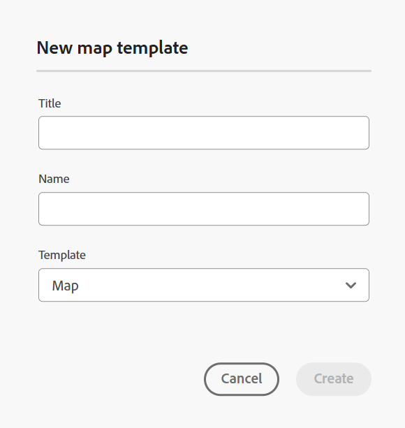

# Erstellen von Karten basierend auf benutzerdefinierten Vorlagen {#id225VF0808MP}

Sie können benutzerdefinierte Zuordnungsvorlagen erstellen und sie verwenden, um DITA-Zuordnungen zusammen mit den Themenvorlagen und Zuordnungsvorlagen zu erstellen, auf die in der Zuordnungsvorlage verwiesen wird

Sie können über die angepasste Zuordnungsvorlage auf andere Zuordnungsvorlagen und Themenvorlagen verweisen. Die referenzierten Zuordnungsvorlagen können auf verschiedene Zuordnungsvorlagen, Themenvorlagen, Themen, Karten, Bilder, Videos und andere Assets verweisen. Die benutzerdefinierte Zuordnungsvorlage kann Ihnen dabei helfen, die Zuordnungsvorlagen und die gesamte referenzierte Ordnerstruktur sehr einfach zu replizieren. Diese benutzerdefinierten Vorlagen sind besonders nützlich, um mehrere Karten zu erstellen und neu zu erstellen, die rekursive Strukturen und Verweise haben.

>[!NOTE]
>
> Themenvorlagen werden nicht rekursiv erstellt. Es werden nur Themenvorlagen generiert, die sich direkt in der Zuordnungsvorlage befinden. Jede Themenvorlage innerhalb einer Themenvorlage wird einfach direkt in der übergeordneten Vorlage referenziert.

## Erstellen benutzerdefinierter Vorlagen

Mit Adobe Experience Manager Guides können Sie benutzerdefinierte Zuordnungen und Themen aus dem Ordner „dita-templates“ erstellen. Sie können diese benutzerdefinierten Vorlagen verwenden, um Ihre Karte und Ihr Thema zu erstellen. Sie können diese Vorlagen auch für Ihre Autoren freigeben, damit diese ihre Dateien erstellen können. Mithilfe dieser Vorlagen können Sie Autoren die separate Aufbewahrung von Kopien bestimmter Ressourcen erlauben, die sich im Vorlagenordner befinden.

>[!NOTE]
>
> Ressourcen, die nur in referenziert und verwaltet werden sollen, müssen außerhalb des Vorlagenordners aufbewahrt werden.


Sie können Zuordnungs- und Themenvorlagen wie folgt erstellen:
- [Erstellen benutzerdefinierter Vorlagen im Editor](#create-customized-templates-from-the-editor)
- [Erstellen benutzerdefinierter Vorlagen über die Assets-Benutzeroberfläche](#create-customized-templates-from-the-assets-ui)


### Erstellen benutzerdefinierter Vorlagen im Editor

Die **Vorlagen**-Funktion ist im [linken Bereich der Editor-](./web-editor-features.md#left-panel) vorhanden und nur für Administratoren verfügbar. Mithilfe dieses Bedienfelds können Admins mühelos Vorlagen erstellen und verwalten, die dann von den Autoren verwendet werden können. Standardmäßig werden die Vorlagen unter den Vorlagen vom Typ *Zuordnung* und *Thema* kategorisiert.

{width="300" align="left"}

Standardmäßig können Sie die Dateien nach Titeln anzeigen. Wenn Sie mit dem Mauszeiger auf eine Vorlage zeigen, können Sie den Dateititel und den Dateinamen als QuickInfo anzeigen.

>[!NOTE]
>
> Als Administrator können Sie auch die Liste der Dateien im Editor anzeigen. Wählen Sie die **Dateiname** im Abschnitt **Konfiguration von Editor-Dateien** Benutzereinstellungen **aus**.

Führen Sie die folgenden Schritte aus, um ein Thema oder eine Zuordnungsvorlage aus dem Editor zu erstellen:

1. Öffnen Sie das **Vorlagen** im Editor und wählen Sie das Symbol **DITA-Vorlage erstellen** aus.

   {width="500" align="left"}

1. Wählen Sie **Themenvorlage** oder **Zuordnungsvorlage** aus dem Dropdown-Menü, je nach dem Typ der Vorlage, die Sie erstellen möchten.
1. Wenn Sie **Themenvorlage** auswählen, wird das **Neue**) angezeigt.

   {width="300" align="left"}

   Wenn Sie **Zuordnungsvorlage** auswählen, wird das Dialogfeld **Neue Zuordnungsvorlage** angezeigt.

   {width="300" align="left"}

   Sie können auch **Ordner** aus der Dropdown-Liste auswählen, wenn Sie zunächst einen Ordner im Ordner **Thema** oder **Zuordnung** erstellen möchten.

1. Geben Sie im Dialogfeld **Neue**/**Neue**) den **Titel** ein, der im Bedienfeld **Vorlagen** angezeigt wird. Der **Name** der Vorlage wird basierend auf dem Titel automatisch vorgeschlagen. Sie können jedoch einen anderen Dateinamen angeben.
Wählen Sie außerdem den zu erstellenden Vorlagentyp aus der Dropdown-Liste **Vorlage** aus.

   >[!NOTE]
   >
   > Wenn Ihr Administrator automatische Dateinamen basierend auf der UUID-Einstellung aktiviert hat, wird das Feld Name nicht angezeigt.

1. Wählen Sie **Erstellen** aus.

Nachdem die Vorlage erstellt wurde, müssen Sie sie zu Ihrem globalen Profil oder Ihrem Profil auf Ordnerebene hinzufügen. Nachdem die Vorlage hinzugefügt wurde, wird die neue Vorlage vom Autor im Prozess der Themen-/Kartenerstellung angezeigt.

Über das **Optionen**-Menü einer vorhandenen Vorlage können Sie **Vorlage Bearbeiten** oder **Duplizieren**. Im Falle einer Duplizierung werden Struktur und Typ \(des Dokuments\) der Vorlage beibehalten und Sie können sie wiederverwenden, um eine andere Vorlage daraus zu erstellen.

{width="500" align="left"}

### Erstellen benutzerdefinierter Vorlagen über die Assets-Benutzeroberfläche

Führen Sie die folgenden Schritte aus, um eine Zuordnung oder Themenvorlage über die Assets-Benutzeroberfläche zu erstellen:

1. Navigieren Sie in der **Assets** Benutzeroberfläche zum Ordner „dita-templates“.

   {align="left"}

1. Öffnen Sie **Ordner** Themen“, wenn Sie eine **Thema**-Vorlage erstellen möchten. Öffnen Sie **Ordner** maps“, wenn Sie eine **-** erstellen möchten.
1. Wählen Sie **Erstellen \> DITA-Vorlage**.

   {width="300" align="left"}
1. Klicken Sie auf der Blueprint-Seite auf **Thema \> Weiter**, um eine Themenvorlage zu erstellen. Wählen Sie andernfalls **Map \> Weiter**, um eine Zuordnungsvorlage zu erstellen.
1. Geben Sie auf der Seite Eigenschaften die Vorlage **Titel** an.
1. Geben Sie die Datei &quot;**&quot;**.

   >[!NOTE]
   >
   > Der Dateiname muss die Erweiterung &quot;.dita“ aufweisen.

1. \(Optional\) Fügen Sie eine Beschreibung hinzu.
1. Wählen Sie **Erstellen** aus.

   Die Meldung Themenvorlage erstellt wird angezeigt. Anschließend können Sie die Vorlage öffnen und bearbeiten. Bei einer Zuordnungsvorlage können Sie auch die Verweise für die Themenvorlagen, Zuordnungsvorlagen und auch andere Assets in der Zuordnungsvorlage hinzufügen.


**Optionsmenü in der Assets-Benutzeroberfläche**

Um eine Zuordnung oder Themenvorlage mithilfe des Optionsmenüs in der Assets-Benutzeroberfläche zu erstellen, führen Sie die folgenden Schritte aus:

1. Wählen Sie **Ordner** Zuordnung“ oder **Thema** im aktuellen Vorlagenordner aus. Beispielsweise den Ordner `dita-templates`.
1. Wählen Sie im **Optionen**-Menü **Zuordnungsvorlage erstellen** oder **Themenvorlage erstellen**.

   Das **Neue Zuordnungsvorlage erstellen** oder das Dialogfeld **Neue Themenvorlage erstellen** wird geöffnet.
1. Geben Sie den Titel und den Namen der neuen Vorlage ein.
1. Wählen Sie in der Dropdown-Liste **Vorlage“ den Vorlagentyp aus** den Sie erstellen möchten.

Die Meldung Zuordnungsvorlage erstellt wird angezeigt. Sie können die Vorlage zu Ihrem globalen Profil oder Profil auf Ordnerebene hinzufügen. Die neue Vorlage wird dann im Erstellungsprozess des Themas oder der Zuordnung angezeigt, und Sie können damit Karten oder Themen erstellen.

Ihr Administrator kann auch einen Ordner erstellen und ihn als den Ordner konfigurieren, in dem Sie die Vorlagen erstellen und speichern können.

Erfahren Sie je nach Einrichtung, wie Sie den Ordnerpfad für benutzerdefinierte DITA-Vorlagen konfigurieren:
<details>
    <summary> Cloud Services </summary>

Erfahren Sie, wie [benutzerdefinierten DITA-Vorlagenordnerpfad konfigurieren](../install-guide/conf-template-tags-custom-dita-topic-template.md#configure-custom-dita-template-folder-path-id191lcf0095z) im Installations- und Konfigurationshandbuch für Cloud Services beschrieben wird.
</details>

<details>
    <summary> On-Premise Software</summary>

Erfahren Sie, wie [benutzerdefinierten DITA-Vorlagenordnerpfad konfigurieren](../cs-install-guide/conf-template-tags-custom-dita-topic-template.md#configure-custom-dita-template-folder-path-id191lcf0095z) im On-Premise-Installations- und Konfigurationshandbuch beschrieben wird.
</details>

## Übergeben Sie den in den Vorlagen definierten Titel.

Wenn Sie den Titel des in Ihrer Vorlage verwendeten Themas oder der Zuordnung an die mit dieser Vorlage erstellten DITA-Zuordnungen übergeben möchten, verwenden Sie geschweifte Klammern um den Titel.

Beispiel

```XML
<pubtitle>
   <mainpubtitle outputclass="booktitle">
   {title}
   </mainpubtitle>
   <subtitle>Subtitle</subtitle>
</pubtitle>

The resultant DITA map with title "Rootmap1" will look like as follows:
<pubtitle>
   <mainpubtitle outputclass="booktitle">Rootmap1
   </mainpubtitle>
   <subtitle>Subtitle</subtitle>
</pubtitle>
```

>[!NOTE]
> Nur das erste Vorkommen der geschweiften Klammer wird durch den Titel ersetzt.

Wenn Sie keine geschweiften Klammern um den Titel verwenden, wird in der resultierenden DITA-Zuordnung nur das erste Element ausgewählt und die Verschachtelung des Titels wird nicht aus der Vorlage ausgewählt und sieht wie folgt aus:

```XML
<pubtitle> Rootmap1 </pubtitle>
```

>[!NOTE]
> Sie können auch die geschweiften Klammern um den Text verwenden, um dessen verschachtelte Struktur von den benutzerdefinierten Vorlagen an Ihre DITA-Zuordnungen zu übergeben.

Beispiel

```XML
<title>    
    <sub>        
        <b>{title}</b>    
    </sub>
</title>
```

## Verwenden der Zuordnungsvorlage zum Erstellen neuer Zuordnungen

>[!NOTE]
>
> Die Zuordnungsvorlage muss von Ihrem Administrator konfiguriert und für die Bearbeitung zur Verfügung gestellt werden. Weitere Informationen finden Sie *Abschnitt „Konfigurieren von Authoring* im Abschnitt Installieren und Konfigurieren von Adobe Experience Manager Guides as a Cloud Service.

Führen **im** Editor) die folgenden Schritte aus, um eine Zuordnung mithilfe der benutzerdefinierten Zuordnungsvorlage zu erstellen:

1. Navigieren **im** zu dem Ordner, in dem Sie die Zuordnung erstellen möchten.
1. Wählen Sie im Menü Optionen des Ordners die Option **Neu \> DITA-Map**.

   {width="500" align="left"}
1. Das **Neue Zuordnung** wird angezeigt.
1. Geben **im Dialogfeld** Neue Zuordnung **die Zuordnung (Titel**, **Name** an und wählen Sie die gewünschte Zuordnungsvorlage aus.

   Wenn Sie beispielsweise eine Zuordnungsvorlage „Testvorlage“ erstellt haben, wählen Sie sie aus.

1. Wählen Sie **Erstellen** aus.

   Die Meldung Map created wird angezeigt.

Führen Sie in der **Assets** Benutzeroberfläche die folgenden Schritte aus, um eine Zuordnung mithilfe der benutzerdefinierten Zuordnungsvorlage zu erstellen:

1. Navigieren Sie in der **Assets** Benutzeroberfläche zu dem Ordner, in dem Sie die Zuordnung erstellen möchten.
1. Wählen Sie **Create \> DITA Map**.
1. Wählen Sie auf der Blueprint-Seite die gewünschte Zuordnungsvorlage aus und klicken Sie auf **Weiter**. Wenn Sie beispielsweise eine Zuordnungsvorlage „Testvorlage“ erstellt haben, wählen Sie sie aus.
1. Geben Sie auf der Seite Eigenschaften die Zuordnung (**)**.
1. Geben Sie die Datei &quot;**&quot;**.

   >[!NOTE]
   >
   > Der Dateiname muss die Erweiterung &quot;.ditamap“ aufweisen.

1. Wählen Sie **Erstellen**. Die Meldung Map created wird angezeigt.

## Zusätzliche Hinweise zu DITA-Karten, die mit benutzerdefinierten Vorlagen erstellt wurden


Die Zuordnung generiert alle Assets, die im Vorlagenordner referenziert werden. Einige Asset-Typen, auf die in einer Zuordnung verwiesen wird, können wie folgt aussehen:

- Wenn die Zuordnung den Verweis auf eine Themenvorlage enthält, wird innerhalb des Ordners eine Kopie davon in derselben Hierarchie wie im Themenordner im `dita-templates` erstellt.
- Wenn die Zuordnung den Verweis auf eine Zuordnungsvorlage enthält, wird innerhalb des Ordners in derselben Hierarchie wie im Ordner „maps“ im Ordner &quot;`dita-templates`&quot; eine Kopie davon erstellt.
- Wenn die Zuordnung den allgemeinen Verweis auf ein Thema oder eine Zuordnung außerhalb des `dita-templates/topics`- oder `dita-templates/maps`-Ordners enthält, wird nur auf dieselbe verwiesen und keine Kopie erstellt.

  >[!NOTE]
  >
  > `dita-templates/topics` und `dita-templates/maps` sind die Standardpfade in Handbüchern und können konfiguriert werden.


  Wenn in der Zuordnungsvorlage eine Schlüsseldefinition für eine Themenvorlage vorhanden ist, wird ein neuer Schlüssel \(also neues Thema\) erstellt und in der Zuordnung referenziert.

- Wenn eine andere Zuordnung oder ein anderes Thema auf derselben Ebene im Ordner erstellt wird, werden die Namen der neu erstellten Assets mit 0,1,2 angehängt, usw. Sie können die Zuordnung zur Bearbeitung öffnen oder die Zuordnungsdatei im Repository speichern.

**Übergeordnetes Thema:**&#x200B;[&#x200B; Einführung in den Zuordnungs-Editor](map-editor.md)
