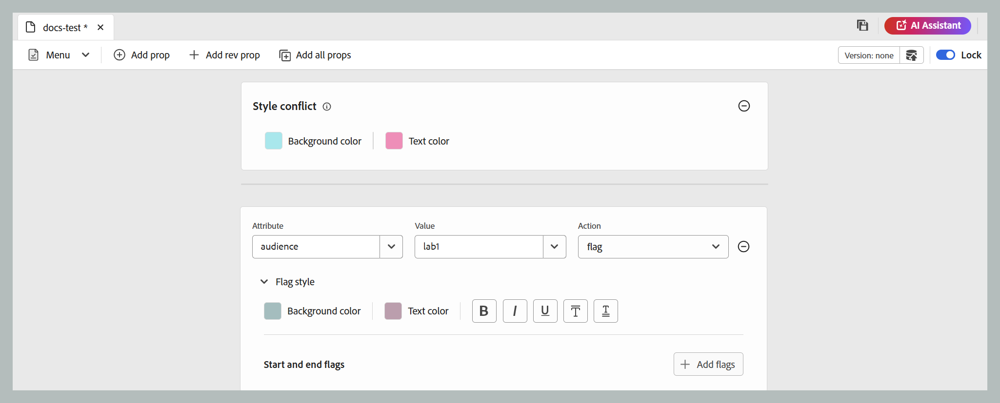

# DITAVAL-Editor {#ditaval-editor}

DITAVAL-Dateien werden zur Erzeugung von bedingten Ausgaben verwendet. In einem einzelnen Thema können Sie Bedingungen mithilfe von Elementattributen hinzufügen, um Inhalte mit Bedingungen zu versehen. Anschließend erstellen Sie eine DITAVAL-Datei, in der Sie die Bedingungen angeben, die aufgenommen werden sollen, um Inhalte zu generieren, und welche Bedingung bei der endgültigen Ausgabe ausgeschlossen werden soll.

Mit Adobe Experience Manager Guides können Sie DITAVAL-Dateien mit dem DITAVAL-Editor ganz einfach erstellen und bearbeiten. Der DITAVAL-Editor ruft die Attribute (die als Bedingungen verwendet werden können) ab, die in Ihrem System definiert sind, und Sie können sie zum Erstellen oder Bearbeiten von DITAVAL-Dateien verwenden. Weitere Informationen zum Erstellen und Verwalten von Bedingungen in Adobe Experience Manager finden Sie im Abschnitt [Verwalten von Tags](https://experienceleague.adobe.com/docs/experience-manager-cloud-service/sites/authoring/features/tags.html?lang=de) in der Dokumentation zu Adobe Experience Manager.

In den folgenden Abschnitten werden die verfügbaren Optionen für eine DITAVAL-Datei in Experience Manager Guides beschrieben.

- [DITAVAL-Datei erstellen](#create-ditaval-file)
- [DITAVAL-Datei bearbeiten](#edit-ditaval-file)
- [DITAVAl-Datei-Editor-Ansichten](#ditaval-editor-views)
- [Arbeiten mit einer DITAVAL-Datei in der Assets-Benutzeroberfläche](#working-with-ditaval-files-in-the-assets-ui)

## DITAVAL-Datei erstellen

Führen Sie die folgenden Schritte aus, um eine DITAVAL-Datei zu erstellen:

1. Wählen Sie im Repository-Bedienfeld das Symbol **Neue Datei** und wählen Sie dann **Thema** aus dem Dropdown-Menü aus.

   {width="300" align="left"}

   Sie können auf diese Option auch über die Startseite von [Experience Manager Guides ](./intro-home-page.md) über das Optionsmenü eines Ordners in der Repository-Ansicht zugreifen.

2. Das **Neues Thema** wird angezeigt.

3. Geben **im Dialogfeld** Neues Thema“ die folgenden Details an:
   - Ein Titel für das Thema.
   - \(Optional\)* Der Dateiname für das Thema. Der Dateiname wird basierend auf dem Thementitel automatisch vorgeschlagen. Wenn Ihr Administrator automatische Dateinamen basierend auf der UUID-Einstellung aktiviert hat, wird das Feld Name nicht angezeigt.
   - Eine Vorlage, auf der das Thema basieren soll. Für eine DITAVAL-Datei wählen Sie **Ditaval** aus der Dropdown-Liste aus.
   - Pfad zum Speichern der Themendatei. Standardmäßig wird der Pfad des aktuell ausgewählten Ordners im Repository im Feld Pfad angezeigt.

   {width="300" align="left"}

4. Wählen Sie **Erstellen** aus.

Das Thema wird unter dem angegebenen Pfad erstellt. Außerdem wird das Thema im Editor zur Bearbeitung geöffnet.

{align="left"}

## DITAVAL-Datei bearbeiten

Wenn Sie ein DITAVAL-Thema erstellen, wird es im Editor zur Bearbeitung geöffnet. Um ein vorhandenes DITAVAL-Thema zu bearbeiten, navigieren Sie zu dem Ordner oder der Karte, in dem bzw. der sich das DITAVAL-Thema befindet, und wählen Sie **Bearbeiten** aus dem Menü **Optionen**.

Mit dem DITAVAL-Editor können Sie mehrere Aufgaben wie unten aufgeführt mithilfe der Optionen in der Editor-Symbolleiste ausführen.

### Symbolleistenoptionen im Editor

#### Menü-Dropdown

Die Dropdown-Liste Menü bietet Zugriff auf die Funktionen zum Bearbeiten, Suchen und Ersetzen, Versionsverlauf, Versionsbezeichnung, Zusammenführen, Prüfungsaufgabe erstellen, Änderungen verfolgen und Tags .
Weitere Informationen finden Sie unter [Dropdown-Optionen im Menü](./web-editor-toolbar.md#menu-dropdown)

#### Eigenschaft hinzufügen

Fügen Sie in Ihrer DITAVAL-Datei eine einzelne Eigenschaft hinzu.

{width="650" align="left"}

In der ersten Dropdown-Liste werden die zulässigen DITA-Attribute aufgelistet, die Sie in der DITAVAL-Datei verwenden können.

Die zweite Dropdown-Liste zeigt die für das ausgewählte Attribut konfigurierten Werte an. Anschließend werden in der nächsten Dropdown-Liste die Aktionen angezeigt, die Sie für das ausgewählte Attribut konfigurieren können. Die zulässigen Werte in der Dropdown-Liste Aktion sind `include`, `exclude`, `passthrough` und `flag`. Weitere Informationen zu diesen Werten finden Sie in der Definition des Elements [prop](http://docs.oasis-open.org/dita/dita/v1.3/errata01/os/complete/part3-all-inclusive/langRef/ditaval/ditaval-prop.html#ditaval-prop) in der OASIS DITA-Dokumentation. Weitere Informationen zur Aktion der in den Attributen hinzugefügten Eigenschaften finden Sie unter [Aktionen für Eigenschaft](#actions-for-property).

#### Einnahmeneigenschaft hinzufügen

Um einem Tag in XML eine bestimmte Revisionsnummer hinzuzufügen, können Sie die Option Rev-Prop hinzufügen verwenden. Dadurch wird dem Tag ein Attribut rev hinzugefügt, dessen Wert im Feld Value definiert ist, zusammen mit der ausgewählten Aktion für die Eigenschaft. Dieses Revisionsattribut kann später verwendet werden, um beim Generieren der Ausgabe relevante XML-Inhalte basierend auf der angegebenen Revisionsnummer zu filtern.

{width="650" align="left"}

#### Alle Eigenschaften hinzufügen

Wenn Sie mit einem Klick alle in Ihrem System definierten bedingten Eigenschaften oder Attribute hinzufügen möchten, verwenden Sie die Funktion Alle Eigenschaften hinzufügen . Die zulässigen Werte in der Dropdown-Liste Aktion sind `include`, `exclude`, `passthrough` und `flag` . Die Einzelheiten zu diesen Aktionen sind unten aufgeführt.

>[!NOTE]
>
> Wenn alle definierten bedingten Eigenschaften bereits in der DITAVAL-Datei vorhanden sind, können Sie keine weiteren Eigenschaften hinzufügen. In diesem Szenario wird eine Fehlermeldung angezeigt.

{width="650" align="left"}

##### Aktionen für Eigenschaft

Für eine bestimmte Eigenschaft sind hauptsächlich vier Aktionen verfügbar, die wie folgt aufgeführt sind und verwendet werden können:

**Einschließen** Den Inhalt in die Ausgabe einschließen. Dies ist das Standardverhalten, sofern nicht anders festgelegt.

**Ausschließen** Schließen Sie den Inhalt aus der Ausgabe aus (wenn alle Werte im jeweiligen Attribut ausgeschlossen sind).

**Passthrough:** Schließen Sie den Inhalt in die Ausgabe ein und behalten Sie den Attributwert als Teil des Ausgabestreams für die weitere Verarbeitung durch eine Laufzeitmaschine bei, z. B. die Laufzeitfilterung auf der Grundlage einzelner Benutzereinstellungen.

**Flags hinzufügen:** Um Inhalte in der Ausgabe zu kennzeichnen, können Sie das Flag als Aktion für das gewünschte Attribut in der Datei festlegen. Sie können auch verschiedene Markierungsstile anwenden, indem Sie die Dropdown-Liste **Markierungsstil** verwenden, wie im folgenden Ausschnitt dargestellt.

{width="650" align="left"}

- **Hintergrundfarbe** Wählen Sie den Farbton, die Sättigung und den Kontrast der Hintergrundfarbe aus. Der entsprechende HEX-Wert wird automatisch auf der Grundlage Ihrer Auswahl aktualisiert. Sie können auch das Farbraumformat über das Dropdown-Menü wechseln, um zwischen HEX, RGB und HSB zu wählen.

{width="650" align="left"}

- **Textfarbe** Wählen Sie den Farbton, die Sättigung und den Kontrast der Textfarbe aus. Der entsprechende HEX-Wert wird automatisch auf der Grundlage Ihrer Auswahl aktualisiert. Sie können auch das Farbraumformat über das Dropdown-Menü wechseln, um zwischen HEX, RGB und HSB zu wählen.

{width="650" align="left"}

- **Stiloptionen**: Sie können auch einige Stiloptionen hinzufügen, z. B. Fett, Kursiv, Unterstrichen, Überstrichen, Doppelt unterstrichen.

{width="650" align="left"}

- **Start- und End-Flags**: Sie können Bilder mithilfe der Schaltfläche **Flag hinzufügen** als Start- und End-Flags einfügen. Um Bilder auszuwählen, verwenden Sie entweder **Assets durchsuchen**, um sie aus dem Handbücher-Repository auszuwählen, oder **Datei hinzufügen**, um sie von Ihrem lokalen System hochzuladen. Darüber hinaus können Sie alternativen Text für die Bilder angeben.

{width="650" align="left"}

- **Stilkonflikt**: Es werden die Konflikte aufgelöst, die auftreten, wenn ein einzelnes Element mehrere Eigenschaften mit unterschiedlichen Flag-Stilen enthält. In solchen Fällen wird der in den Stilkonflikteigenschaften definierte Wert ausgewählt, was effektiv als Standardwertauswahl für Hintergrund- und Textfarben dient.

{width="650" align="left"}

#### Versionsinformationen und Als neue Version speichern

Die Funktion Versionsinformationen und Als neue Version speichern kombiniert Versionsverfolgung und Inhaltsspeicherung in einer einzigen Funktion.
Weitere Informationen finden Sie unter [Als neue Version speichern](./web-editor-toolbar.md#version-information-and-save-as-new-version)

#### Sperren/Entsperren

Sperrt oder entsperrt die aktuelle Datei. Durch das Sperren einer Datei erhalten Sie exklusiven Schreibzugriff auf die Datei.
Weitere Informationen finden Sie unter [Datei entsperren](./web-editor-toolbar.md#lockunlock)

### Inhalt speichern

Nachdem Sie die Bearbeitung der DITAVAL-Datei abgeschlossen haben, klicken Sie in der **auf** Speichern.

>[!NOTE]
>
> Wenn Sie die Datei schließen, ohne zu speichern, gehen die Änderungen verloren. Wenn Sie keine Änderungen in das Adobe Experience Manager-Repository übernehmen möchten, wählen Sie **Schließen** und dann **Ohne Speichern schließen** im Dialogfeld **Nicht gespeicherte Änderungen** aus.

## DITAVAL Editor-Ansichten

Der DITAVAL-Editor von Adobe Experience Manager Guides unterstützt die Anzeige von DITAVAL-Dateien in zwei verschiedenen Modi oder Ansichten:

**Autor**:   Dies ist eine typische Ansicht von What You See Is What You Get \(WYSISYG\) des DITAVAL-Editors. Sie können Eigenschaften über die einfache Benutzeroberfläche hinzufügen oder entfernen, über die die Eigenschaften, ihre Werte und Aktionen in der Dropdown-Liste angezeigt werden. In der Autorenansicht haben Sie die Möglichkeit, eine einzelne Eigenschaft einzufügen und alle Eigenschaften mit einem Klick einzufügen.

Sie können auch die Version der DITAVAL-Datei finden, an der Sie gerade arbeiten, indem Sie den Mauszeiger über den Dateinamen bewegen.

**Source**:   Die Source-Ansicht zeigt den zugrunde liegenden XML-Code an, aus dem die DITAVAL-Datei besteht. In dieser Ansicht können Autoren nicht nur reguläre Textbearbeitungen durchführen, sondern auch Eigenschaften mithilfe des Smart-Katalogs hinzufügen oder bearbeiten.

Um den Smart-Katalog aufzurufen, platzieren Sie den Cursor am Ende einer Eigenschaftendefinition und geben Sie &quot;&lt;&quot; ein. Der Editor zeigt eine Liste aller gültigen XML-Elemente an, die Sie an dieser Stelle einfügen können.

## Arbeiten mit DITAVAL-Dateien in der Assets-Benutzeroberfläche

Sie können auch eine DITAVAL-Datei über die Assets-Benutzeroberfläche erstellen. Gehen Sie wie folgt vor, um ein neues DITAVAL-Thema zu erstellen:

1. Navigieren Sie in der Assets-Benutzeroberfläche zu dem Speicherort, an dem Sie die DITAVAL-Datei erstellen möchten.

1. Wählen Sie **Erstellen** \> **DITA-Thema**.

1. Wählen Sie auf der Blueprint-Seite DITAVAL-Dateivorlage und klicken Sie auf **Weiter**.

1. Geben Sie auf der Seite Eigenschaften die **Titel** und **Name** für die DITAVAL-Datei an.

   >[!NOTE]
   >
   > Der Name wird automatisch basierend auf dem Titel der Datei vorgeschlagen. Wenn Sie den Dateinamen manuell angeben möchten, stellen Sie sicher, dass der Name keine Leerzeichen, Apostrophe oder geschweifte Klammern enthält und mit &quot;.ditaval“ endet.

1. Wählen Sie **Erstellen** aus.

   Die Meldung Thema erstellt wird angezeigt.

Sie können die DITAVAL-Datei zur Bearbeitung im DITAVAL-Editor öffnen oder die Themendatei im Adobe Experience Manager-Repository speichern.

Führen Sie folgende Schritte aus, um eine vorhandene DITAVAL-Datei zu bearbeiten:

1. Navigieren Sie in der Assets-Benutzeroberfläche zur DITAVAL-Datei, die Sie bearbeiten möchten.

1. Um eine exklusive Sperre für die Datei zu erhalten, wählen Sie die Datei aus und klicken Sie auf **Auschecken**.

1. Wählen Sie die Datei aus und klicken Sie **Bearbeiten**, um die Datei im Adobe Experience Manager Guides DITAVAL-Editor zu öffnen.

